Наше знакомство со страной гейзеров и ледников началось с ночного купания в лагуне при северном сиянии. Мы подружились с местными лошадками, увидели разлом тектонических плит, гейзер по имени "Гейзер" и самый большой в Исландии водопад.

<!--more-->

## День 1. Рейкъявик, Исландия.

Мы благополучно прилетели в аэропорт Кефлавик из Хельсинки, быстро забрали нашу машину Suzuki Grand Vitara 4x4 и поехали смотреть точки, отмеченные для посещения в первый день: 1. Хот-дожную, которую особенно хвалили за отличный вкус международно известного блюда- хот-дога. Исландские сосиски вкусные, и по цене почти не кусаются - 170 рублей за штуку. Пока ехали, увидели праздничные украшения крестах на могилах (!!!): каждый крест был плотно обвит сетью гирлянд [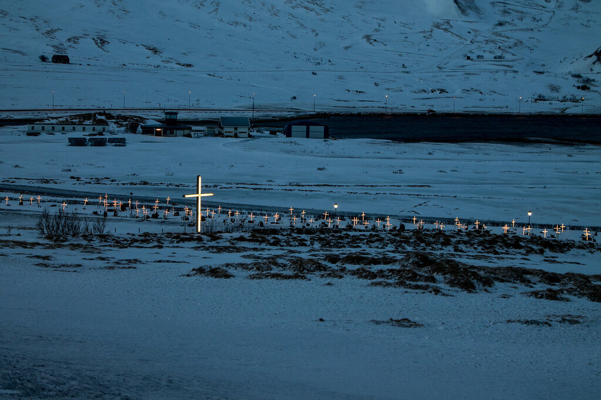](https://fotki.yandex.ru/next/users/klimentij511/album/464271/view/1236183?page=15)

2\. Магазин-дискаунтер Бонус - для того, чтобы целиком проникнуться дороговизной Исландии. Тут действительно ОЧЕНЬ дорого: нарезка сыра 150 грамм - 900 рублей, килограмм бананов - 200, куриное филе 1100 рублей за килограмм. Пока питаемся запасами из России 3. Знаменитая Голубая Лагуна. Вход стоит 35 евро с человека, и за это вы попадаете в благоустроенный спа-центр, с природными горячими источниками (местами вода прогревается до 100 градусов цельсия - там висят знаки предупреждения). И мы остались бы просто в хорошем расположении духа, если бы в какой-то момент не увидели всполохи полярного сияния! Это неописуемые эмоции! Нам невероятно повезло, что мы увидели его в самый первый день, да еще и в такой момент! Словом, восторг!!! Первый день удался на славу :) 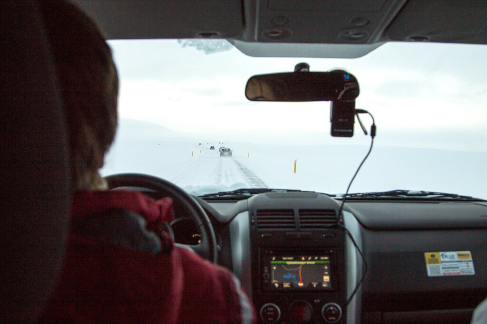

 

## День 2. Рейкъявик, Исландия.

Поздно ночью первого дня мы все-таки смогли найти ночевку, хотя это было трудно и дорого: в Исландии все стойки регистрации закрываются в 20.00, а мы никак не могли успеть, так как до 21 купались в Голубой Лагуне. В конце концов мы нашли нормальный вариант за 3500 за номер на двоих с завтраком, с удобствами на этаже. Приготовив ужин на скорую руку, мы рухнули спать, так как количество впечатлений за один день зашкаливало.

Утро второго дня имело запах подгоревших тостов, т.к. один из постояльцев во время завтрака благополучно забыл про свой хлеб. Вещи были собраны и перебраны уже в третий раз: сначала в Финке по приезду, потом перед отъездом, теперь тут..И затем еще разок вечерком в четвертый раз мы переложили продукты! Вы можете спросить, зачем мы делаем это столько раз, но 4 чемодана просто невозможно каждый раз таскать с собой, поэтому мы пытаемся как-то оптимизировать пространство и сэкономить силы наших мужчин. 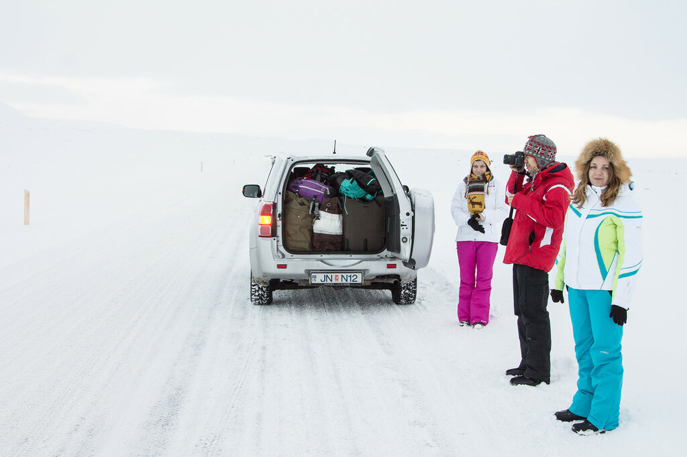

Разлом тектонических плит между Европой и Америкой - каждый год он увеличивается на 2 сантиметра 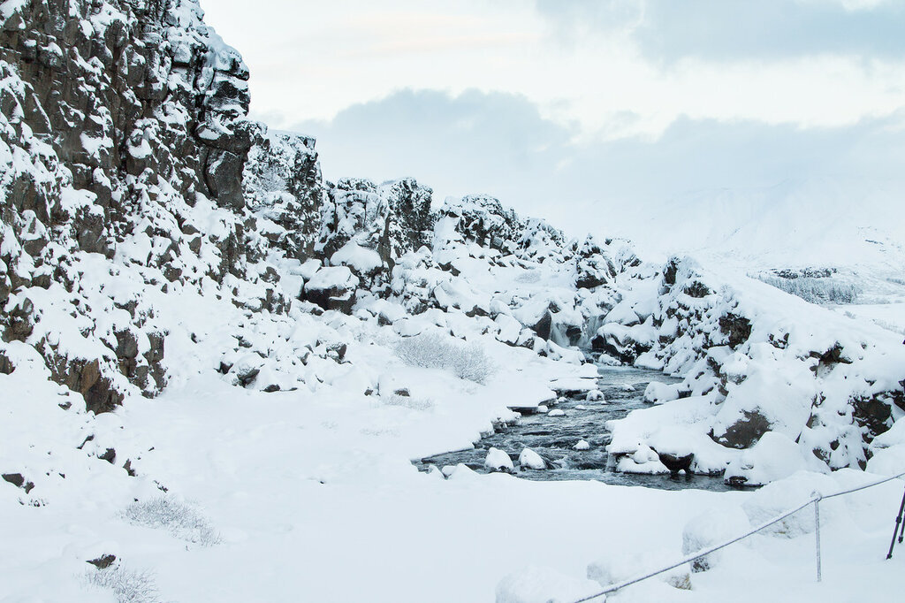

Исландские лошади, которые почему-то не любят сахар и наотрез отказались есть рафинад из наших рук 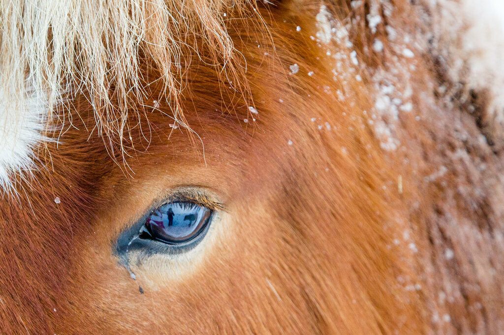 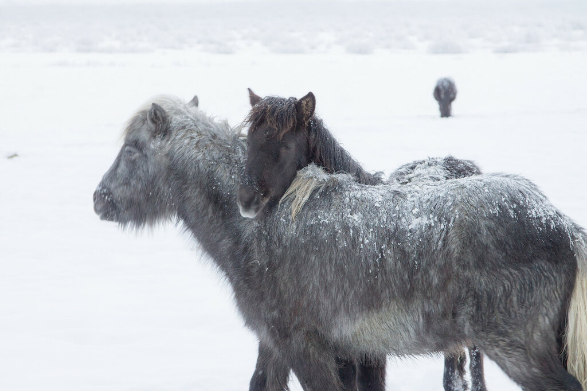 Потом была наша первая заправка - а это всегда квест с тремя неизвестными - какой бензин, где бензобак (слева или справа) и как работает этот чертов автомат по приеме карт (т.к. в Исландии все заправки автоматические - людей нет, просто запихиваешь свою кредитку и вводишь, сколько литров хочешь залить). [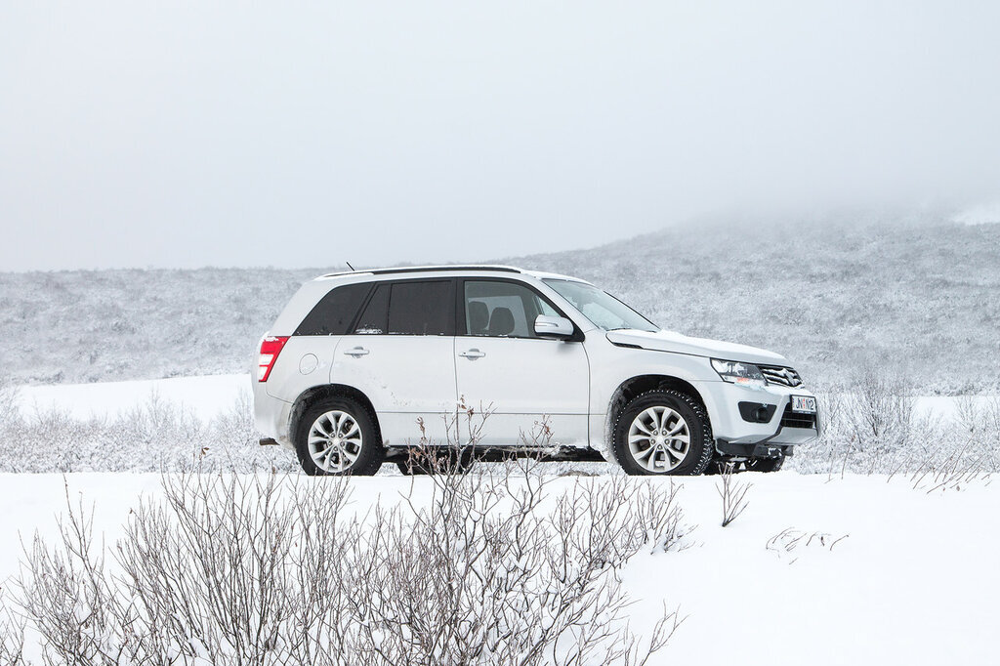](https://fotki.yandex.ru/next/users/klimentij511/album/464271/view/1235890?page=1)

Затем мы посетили знаменитый гейзер Geysir, который дал название всем гейзерам. Но увидеть его во всей красе не удалось, так как он "работает" всего лишь несколько раз в году. [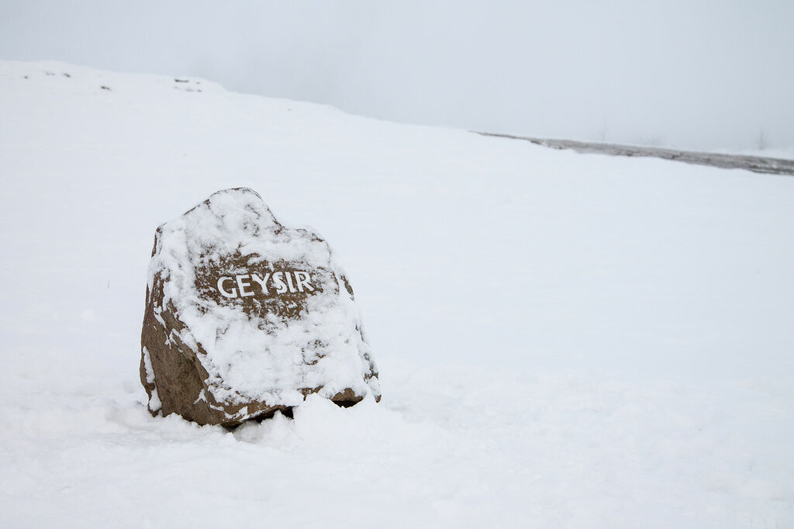](https://fotki.yandex.ru/next/users/klimentij511/album/464271/view/1235904?page=2)

Поэтому мы довольствовались гейзером Стоккуром - он поменьше, зато каждые 4-10 минут исправно взрывается. [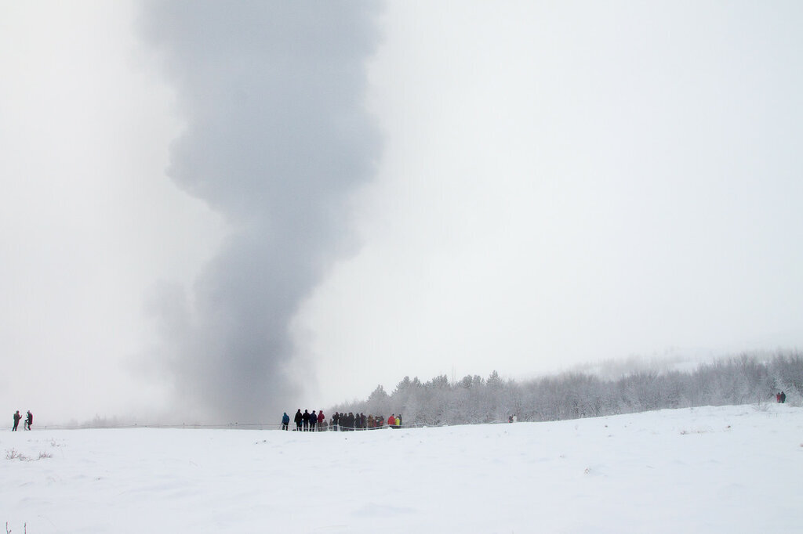](https://fotki.yandex.ru/next/users/klimentij511/album/464271/view/1235903?page=2)

Здесь повсюду висят знаки, что бросать монеты запрещено - при взрыве они могут больно поранить, но туристы игнонируют и кидают деньги. [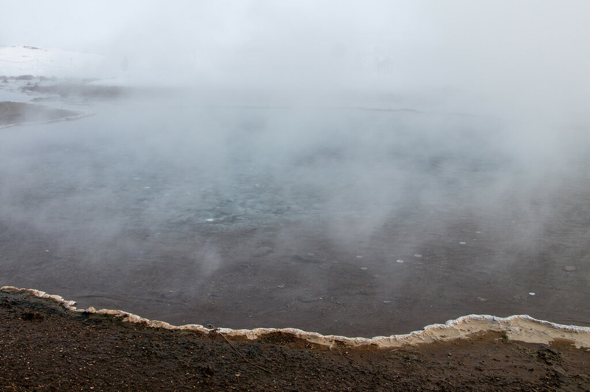](https://fotki.yandex.ru/next/users/klimentij511/album/464271/view/1235901?page=2)

[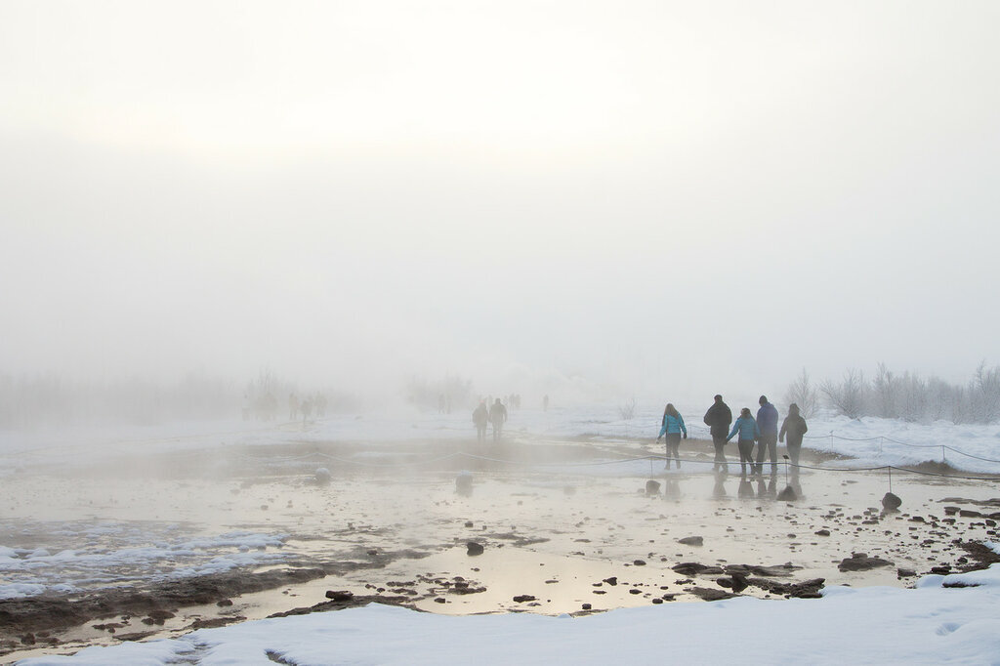](https://fotki.yandex.ru/next/users/klimentij511/album/464271/view/1235900?page=2)

Под вечер мы успели доехать до самого крупного в Исландии водопада - Гульфосса. [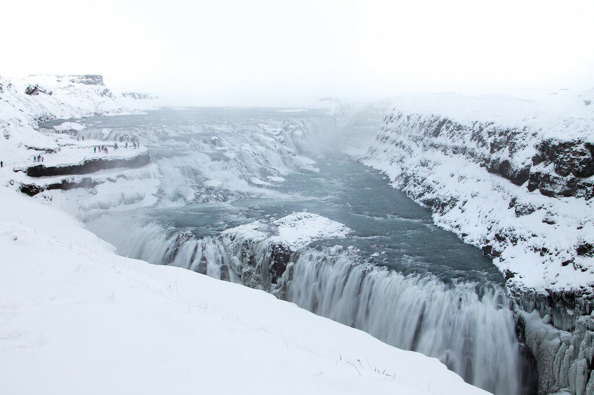](https://fotki.yandex.ru/next/users/klimentij511/album/464271/view/1235910?page=2)

Мощь природы в чистом виде! Я никогда не видела такое количество воды, которое с такой силой и скоростью падала с высоты. Даже страшно немного становится. [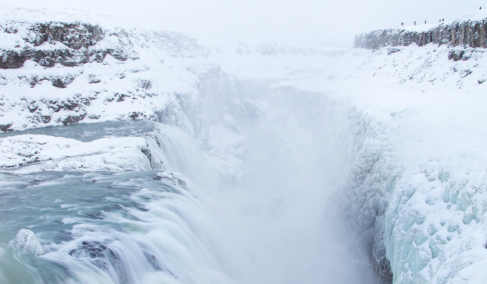](https://fotki.yandex.ru/next/users/klimentij511/album/464271/view/1235914?page=2)

[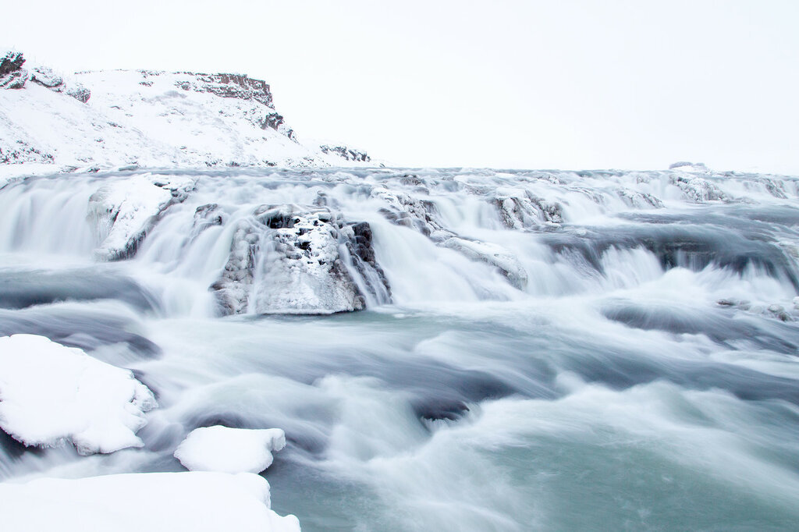](https://fotki.yandex.ru/next/users/klimentij511/album/464271/view/1235915?page=2)

По дороге в Сельфосс мы заехали уже почти в полной темноте на кратер Керид - внутри огромное замерзшее озеро. Говорят, летом можно спуститься по пологой части, но зимой желания скатиться в ледяную воду было мало. Под конец вечера мы прогулялись по уютному городу Сельфосс, а затем вернулись в наш хостел и устроили себе пир из 5 блюд. Проведя инвентаризацию наших запасов, мы поняли, что пора крепко налегать на еду, чтобы не возвращаться в Россию с банками тушенки и макаронами. Уверена, Климентий оценит)

Читайте другие статьи из цикла про зимнюю Исландию:

- [Исландия зимой. Часть 2. Южная Исландия](https://vodpop.ru/islandiya-zimoy-chast-2-yuzhnaya-islandiya/)
- [Исландия зимой. Часть 3. Страна льдов](https://vodpop.ru/islandiya-zimoy-chast-3-strana-ldov/)
- [Исландия зимой. Часть 4. Самый север](https://vodpop.ru/islandiya-zimoy-chast-4-samyiy-sever/)
- [Исландия зимой. Часть 5. Круг замкнут](https://vodpop.ru/islandiya-zimoy-chast-5-krug-zamknut/)
