Рано утром мы выехали из Сельфосса, чтобы успеть до восхода солнца успеть приехать к первой точке маршрута.

<!--more-->

## День третий. Южная часть Исландии.

Увидев заправку, мы сразу остановились, т.к. в Исландии никогда не знаешь, когда и где будет следующая - все заправляются впрок. Даже местные [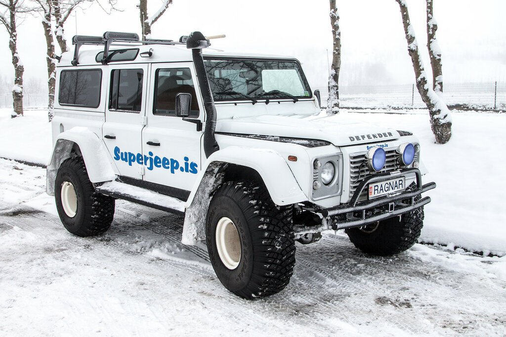](https://fotki.yandex.ru/next/users/klimentij511/album/464271/view/1235908?page=2)

У них, наверное, расход литров 30 на сотню. Первой точкой стал водопад Сельяландсфосс [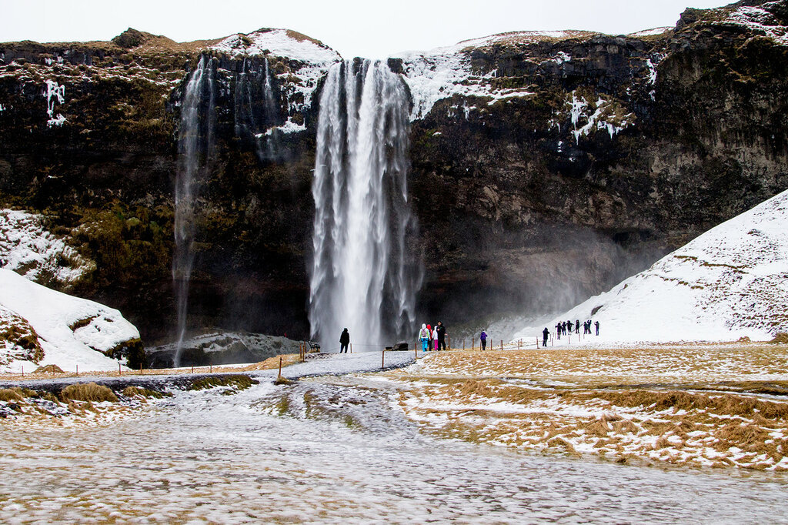](https://fotki.yandex.ru/next/users/klimentij511/album/464271/view/1235924?page=3)

Машин рядом с ним было довольно много, а дорога представляла собой абсолютно гладкий каток. Если вы в России ругаетесь на то, как чистят дороги - забудьте. В Исландии этого вообще нет. Здесь в лучшем случае убирают снег, но раскатанный лед не посыпают ничем [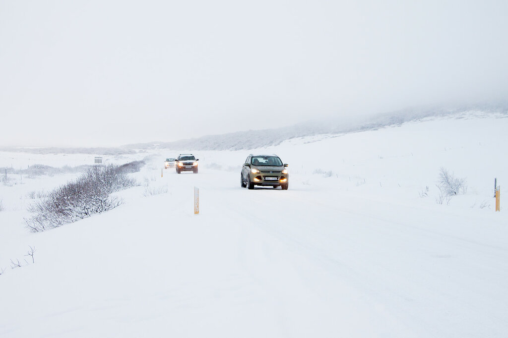](https://fotki.yandex.ru/next/users/klimentij511/album/464271/view/1235887?page=1)

Мы решились пройти за водопад - описывать эти ощущения бесполезно, но было очень-очень скользко: часть пути мы преодолевали на попе [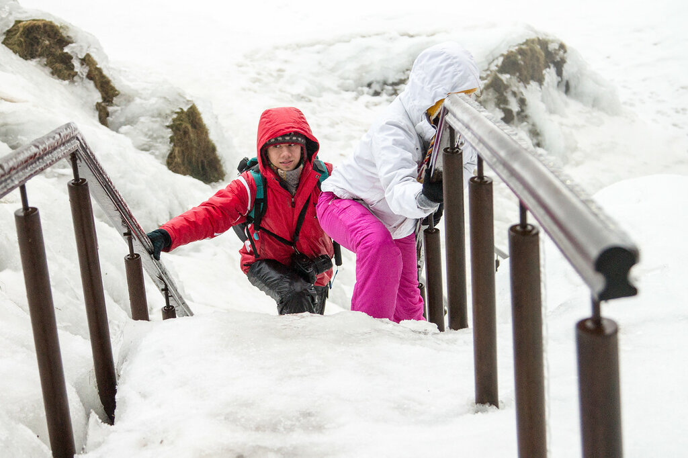](https://fotki.yandex.ru/next/users/klimentij511/album/464271/view/1235925?page=3)

[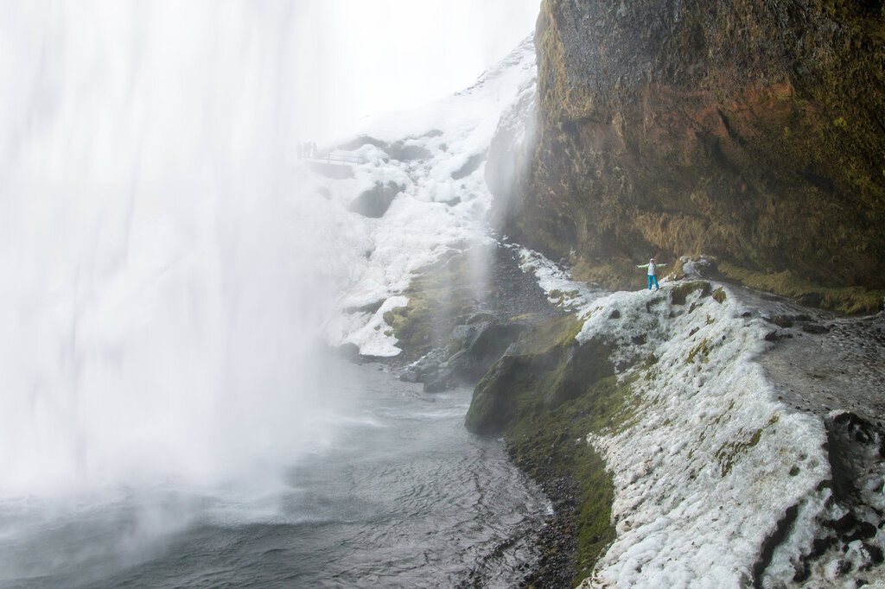](https://fotki.yandex.ru/next/users/klimentij511/album/464271/view/1235929?page=3)

Затем мы заехали в информационный центр самого известного в Европе вулкана Эйяфьядлайёкюдль. Оказывается, он извергается уже не в первый раз, да и в целом в Исландии извержение вулкана - вполне обычное явление [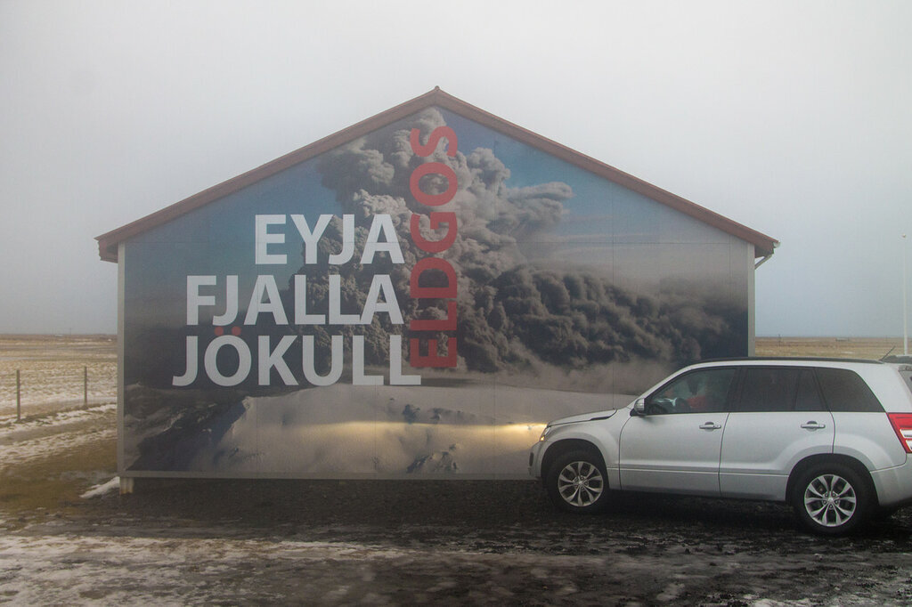](https://fotki.yandex.ru/next/users/klimentij511/album/464271/view/1235930?page=3)

Сегодня уточнили в прокатной конторе модификацию нашей машины - в день аренды мы так спешили, что даже не спросили, какой бензин заливать. Нам достался Suzuki 4x4 автомат, объем 2.4 литра. Кушает он 11 литров по трассе. Неплохо идет по льду, даже там, где человеческие ноги раздвигаются и пытаются усесться на шпагат. В целом впечатления неплохие, но имхо миллион сто эта машина не стоит [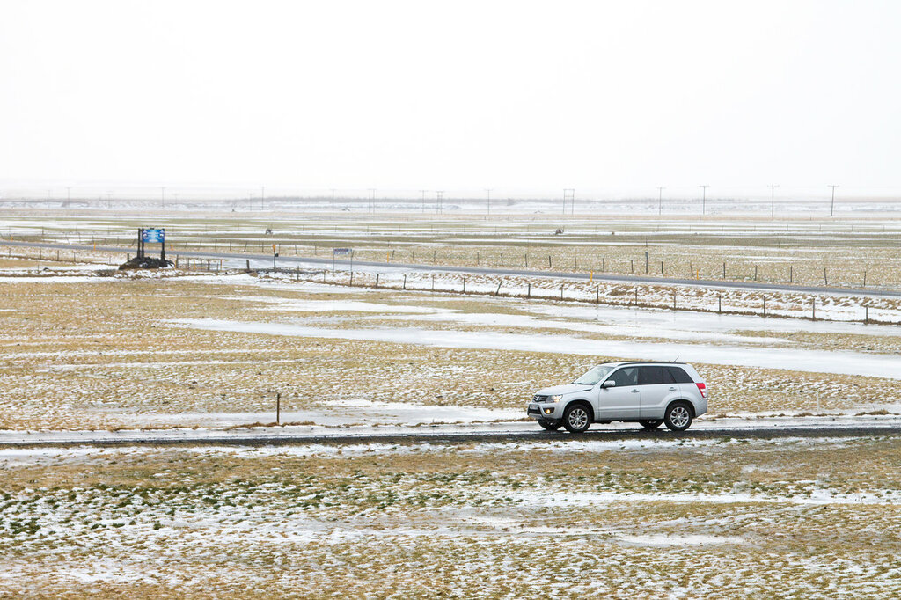](https://fotki.yandex.ru/next/users/klimentij511/album/464271/view/1235935?page=3)

Пейзажи поражали, несмотря на дождь туман, которые преследовали нас весь день. Кажется, мы научились различать все 50 оттенков серого. С дороги иногда видно заброшенные домики, построенные прямо в скалах 

[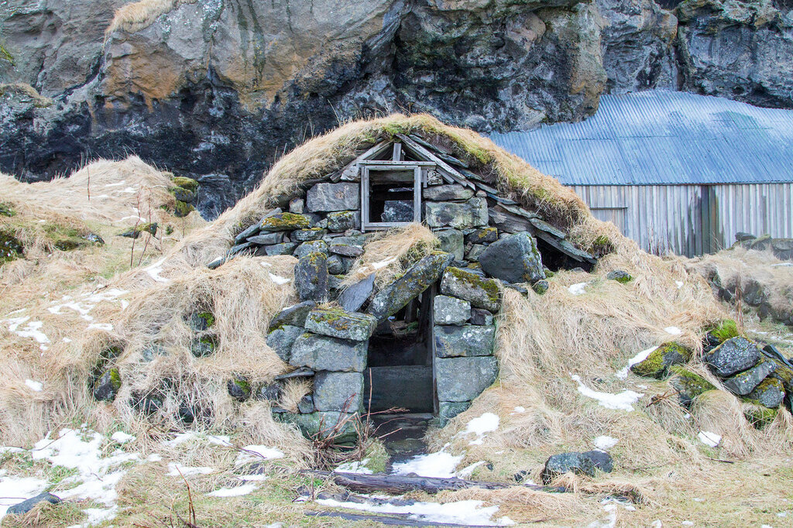](https://fotki.yandex.ru/next/users/klimentij511/album/464271/view/1235933?page=3)

Забрались в один из них [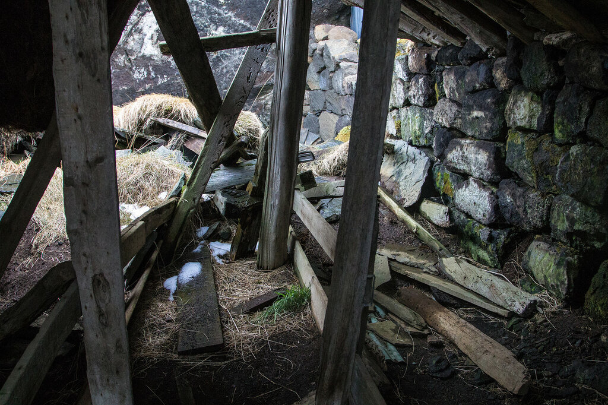](https://fotki.yandex.ru/next/users/klimentij511/album/464271/view/1235934?page=3)

Следующим этапом стал Скогарфосс. Промокшие после предыдущего захода на водопад, мы пофотографировали его издали, и поехали дальше [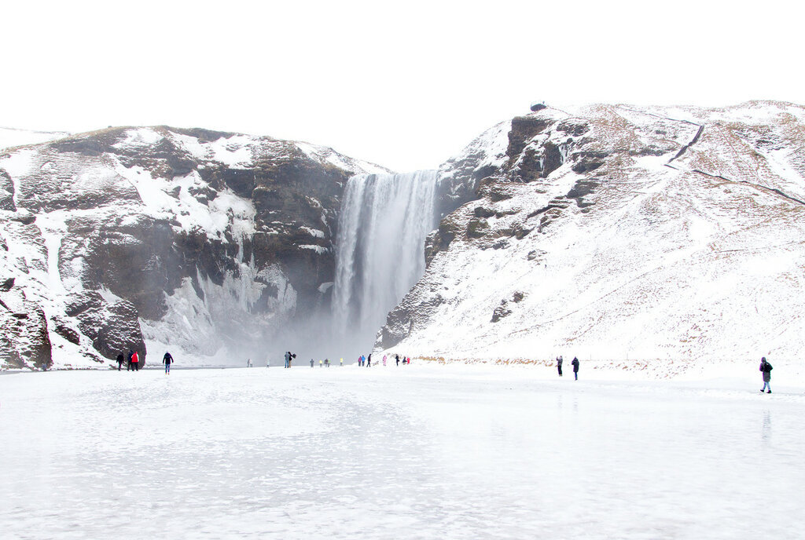](https://fotki.yandex.ru/next/users/klimentij511/album/464271/view/1235937?page=4)

После него мы съехали с нормальной дороги и решили качественно опробовать способности Сузуки (а заодно нервы мои и Даши): Климентий с Владимиром по очереди преодолевали нечто, что я бы назвала замерзше-протекшим намеком на направление, в котором теоретически может двигаться автомобиль. Вообщем, каша под ногами плохо фотографировалась, но зато подарила нам массу адреналина, стресса и приятных впечатлений (тут уж кому что досталось) [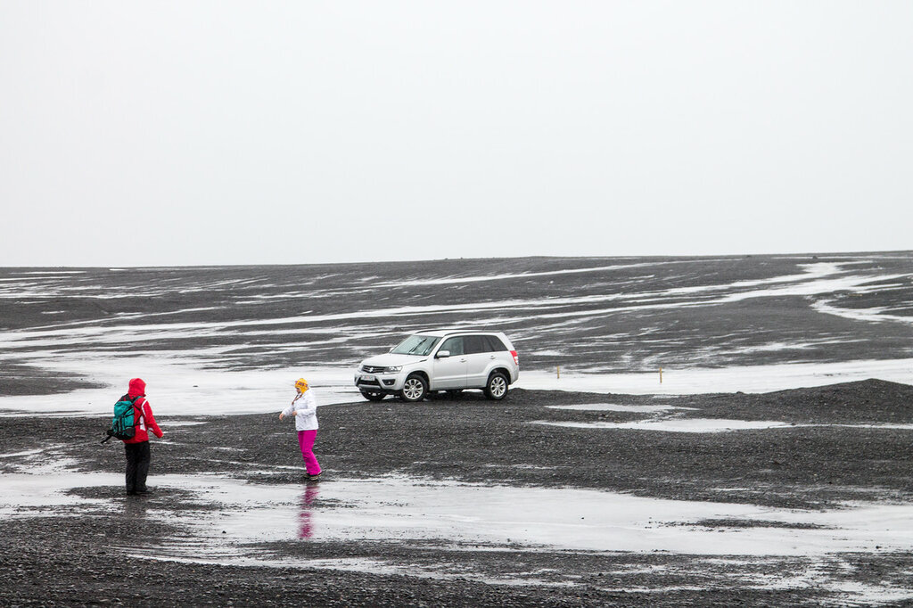](https://fotki.yandex.ru/next/users/klimentij511/album/464271/view/1235942?page=4)

Двигались мы этому месиву не просто так - здесь потерпел крушение самолет DC-3, обломки которого не стали убирать [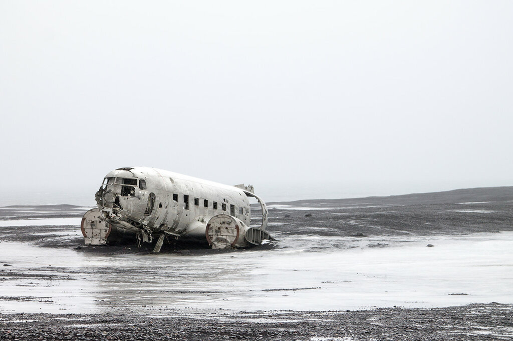](https://fotki.yandex.ru/next/users/klimentij511/album/464271/view/1235941?page=4)

[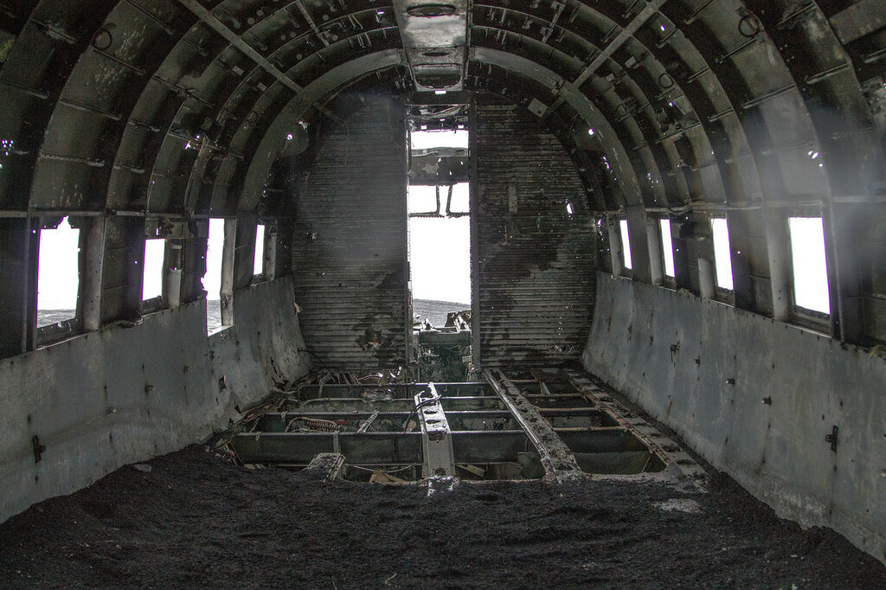](https://fotki.yandex.ru/next/users/klimentij511/album/464271/view/1235946?page=4)

Заодно посмотрели на Черный Пляж - пляж из черного песка, образованный одним из вулканических извержений. Порывы ветра не только поднимали многометровые волны, но и сбивали нас с ног [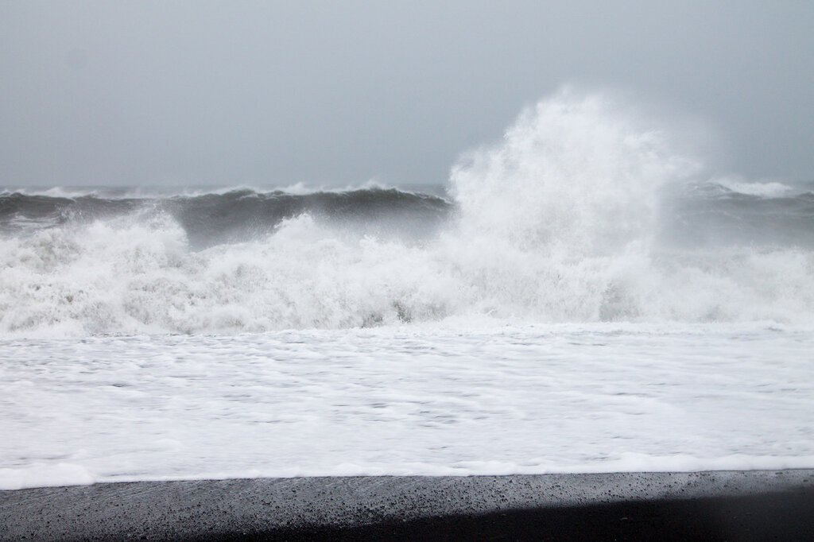](https://fotki.yandex.ru/next/users/klimentij511/album/464271/view/1235950?page=4)

[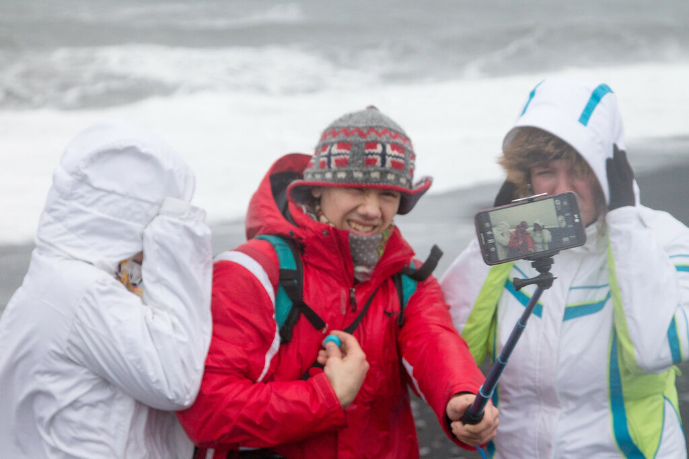](https://fotki.yandex.ru/next/users/klimentij511/album/464271/view/1235954?page=4)

По льду мы скользили без коньков, просто порывами ветра, а черный песок летел в глаза, фотоаппараты, телефоны и забивался в куртки 

Тут мы промокли окончательно и бесповоротно, хотя наши с Климом новые куртки Volkl удержали тепло и сухость - я потом напишу отдельный пост про наши комплекты одежды [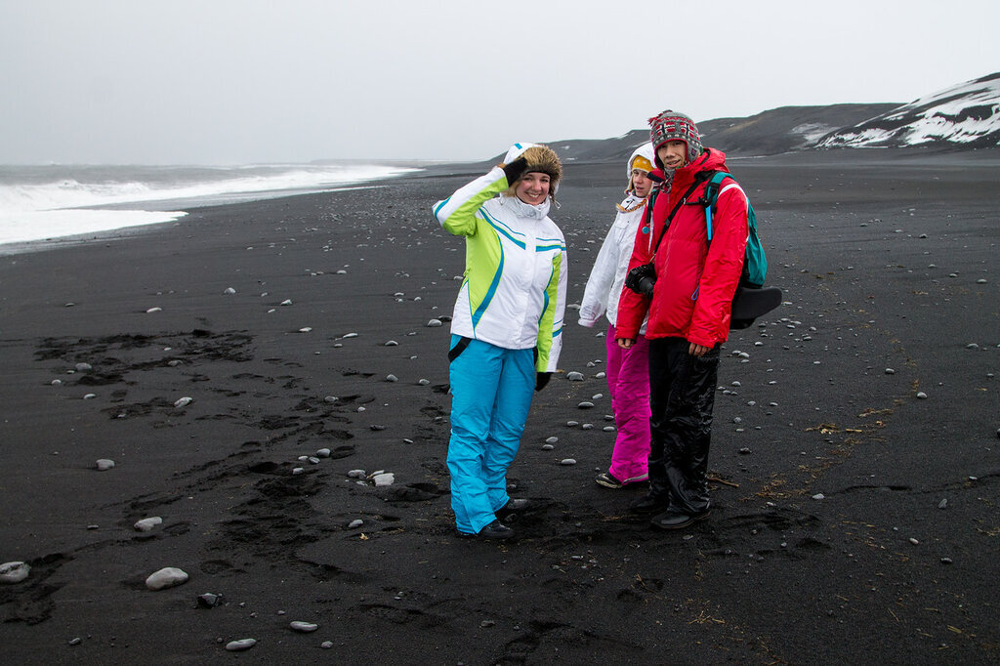](https://fotki.yandex.ru/next/users/klimentij511/album/464271/view/1235949?page=4)

Но надо сказать, что ни один рубль на спортивную экипировку не был потрачен зря. По дороге к последней точке маршрута мы увидели церковь - я попросила остановить и сфотографировать для отчета кресты с гирляндами: увы, только на телефон, т.к. оба фотоаппарата запотели и "оттаяли" только в хостеле. Итак, одно из самых красивых мест на юге Исландии осталось на вечер: мыс Дурхолей. Оттуда открывается потрясающий вид на Черный Пляж, а также океан, скалы и местных птиц, которые живут на мысе [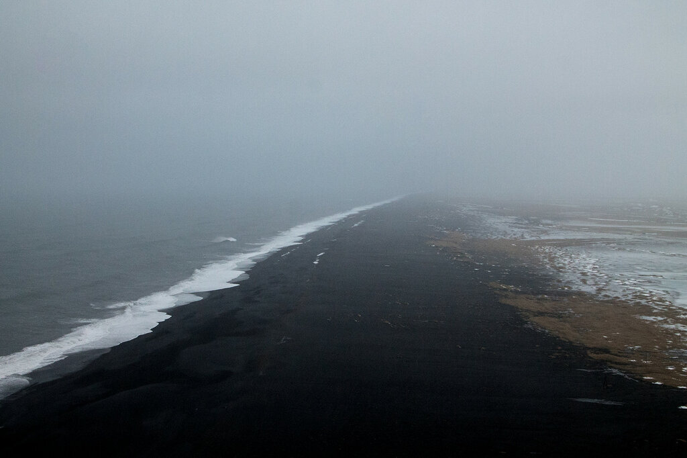](https://fotki.yandex.ru/next/users/klimentij511/album/464271/view/1235955?page=4)

[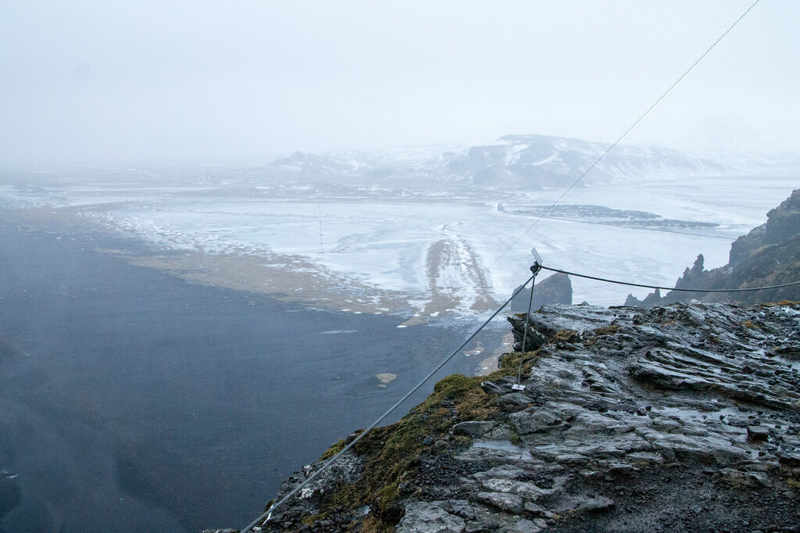](https://fotki.yandex.ru/next/users/klimentij511/album/464271/view/1235958?page=5)

Увы, света для нормальных фотографий уже не хватало [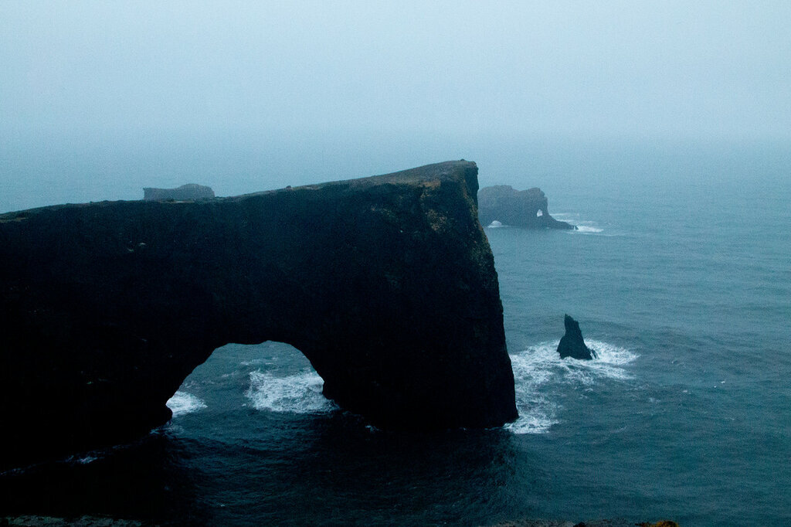](https://fotki.yandex.ru/next/users/klimentij511/album/464271/view/1235960?page=5)

Темнело буквально на глазах 

Настроение сильно портилось мокрой одеждой, но мы стойко пережили 15 минут леденящего ветра, прежде чем сесть в машину и приступить к поискам ночевки [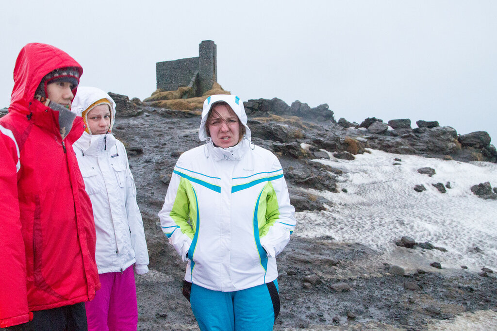](https://fotki.yandex.ru/next/users/klimentij511/album/464271/view/1235956?page=4)

На букинге цены стартовали с 119 евро, но мы нашли нормальный хостел за 80 евро за четверых: это очень дешево, но администратора хочется ударить чем-то тяжелым по голове. Тут не принимают карточки, мало батарей (а учитывая погоду, это очень критично) и администратор постоянно несет какую-то чушь. Приходится расплачиваться за дешевизну. День был невероятно крутым - начиная с прогулки под водопадом (а я постояла прямо под струями - позже будет видео), заканчивая адовой дорогой к упавшему самолету. Много эмоций, ужасная погода. Словом, настоящая Исландия.

Читайте другие статьи из цикла про зимнюю Исландию:

- [Исландия зимой. Часть 1. Лагуна, Гейзер и водопад Гульфосс](https://vodpop.ru/islandiya-zimoy-chast-1-laguna-geyzer-i-vodopad-gulfoss/)
- [Исландия зимой. Часть 3. Страна льдов](https://vodpop.ru/islandiya-zimoy-chast-3-strana-ldov/)
- [Исландия зимой. Часть 4. Самый север](https://vodpop.ru/islandiya-zimoy-chast-4-samyiy-sever/)
- [Исландия зимой. Часть 5. Круг замкнут](https://vodpop.ru/islandiya-zimoy-chast-5-krug-zamknut/)
