Несмотря на то, что хостел был в меру ужасен, мы смогли высушить все вещи и даже немного обуви (но мы все равно решили одеть сухие комплекты). Рано утром выехать не удалось, т.к. мы с Дашкой уснули позже, развешивая вещи, и еще проснулись в середине ночи, чтобы перевесить белье на другую сторону - утро благополучно проспали (аж до 8 утра!), зато встретили рассвет в дороге.

<!--more-->

## День четвертый. Юго-восток Исландии

[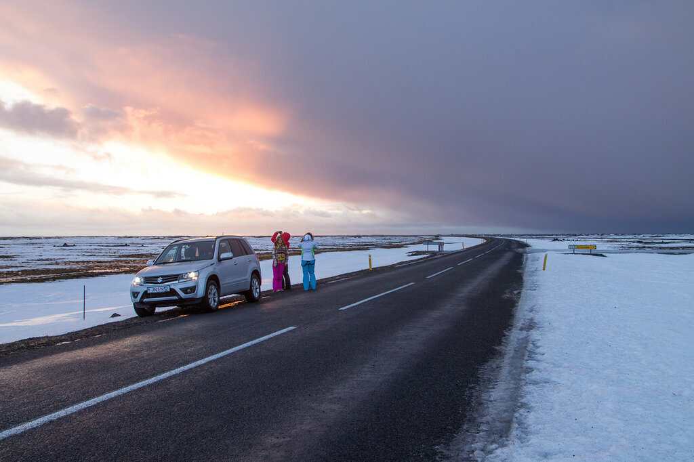](https://fotki.yandex.ru/next/users/klimentij511/album/464271/view/1235967?page=5)

Поверьте, увидеть солнце в Исландии - это редкость! Мы в первый день увидели ясное небо и с чего-то решили, что оно будет сопутствовать нам каждый день поездки. Ха-ха!!! Дорога в солнечных лучах смотрелась потрясающе - мы то и дело останавливались, делая фотографии на все доступные гаджеты. Единодушно пришли ко мнению, что ни одна фотография зимней Исландии не способна передать красоту и величие, которое мы наблюдаем своими глазами [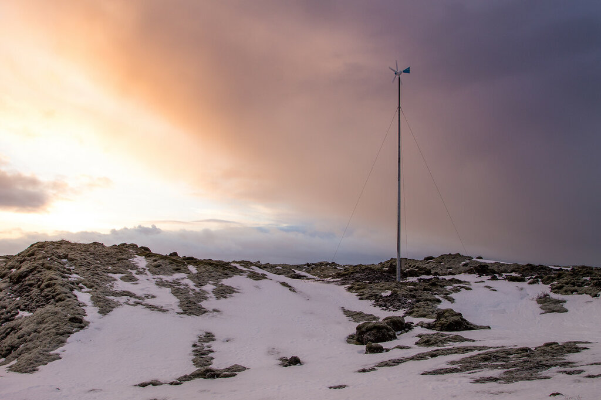](https://fotki.yandex.ru/next/users/klimentij511/album/464271/view/1235970?page=5)

Вдоль дороги были потрясающей красоты голубые лужицы, у одной из которых я попросила руль: меня не включили в страховку, поэтому я решила попробовать порулить там, где наличие полицейских наименее вероятно [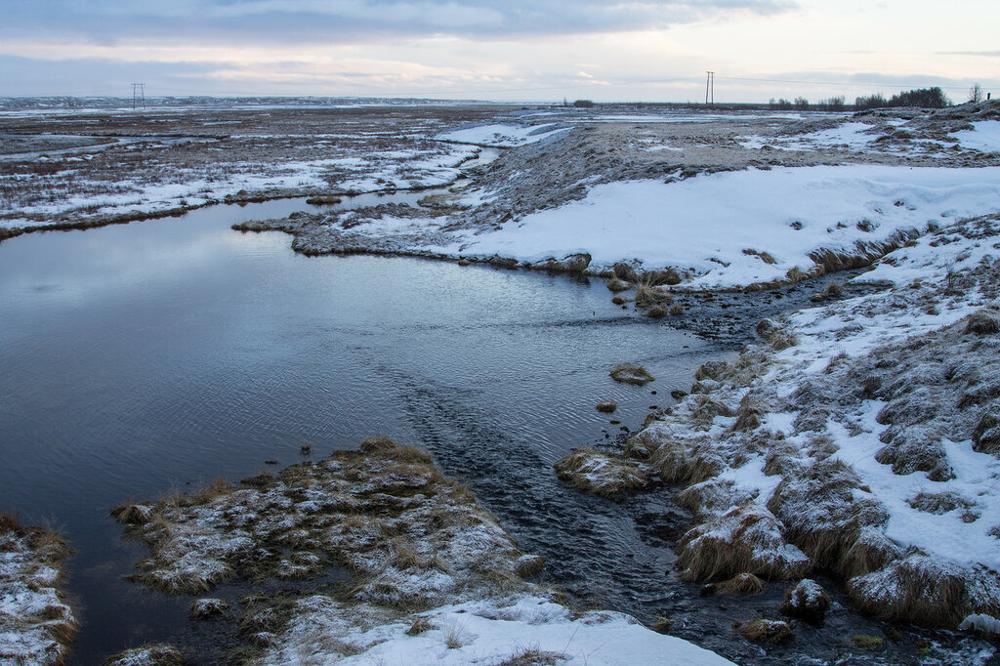](https://fotki.yandex.ru/next/users/klimentij511/album/464271/view/1235983?page=6)

Ехать местами страшновато - под колесами каток из воды, льда и снега. Но в целом Сузуки показывает себя хорошо: никаких неожиданностей в управлении не замечено, а автоматическая коробка (которая досталась нам бесплатно - мы заказывали механику) позволяет убрать ноги, включив круиз-контроль и лишь изредка покручивая руль. Однако, нужно быть бдительным - погода меняется примерно раз в 15-20 минут: снег, солнце, дождь, шторм, потом снова солнце и затем ужасающий ветер, сносящий машину [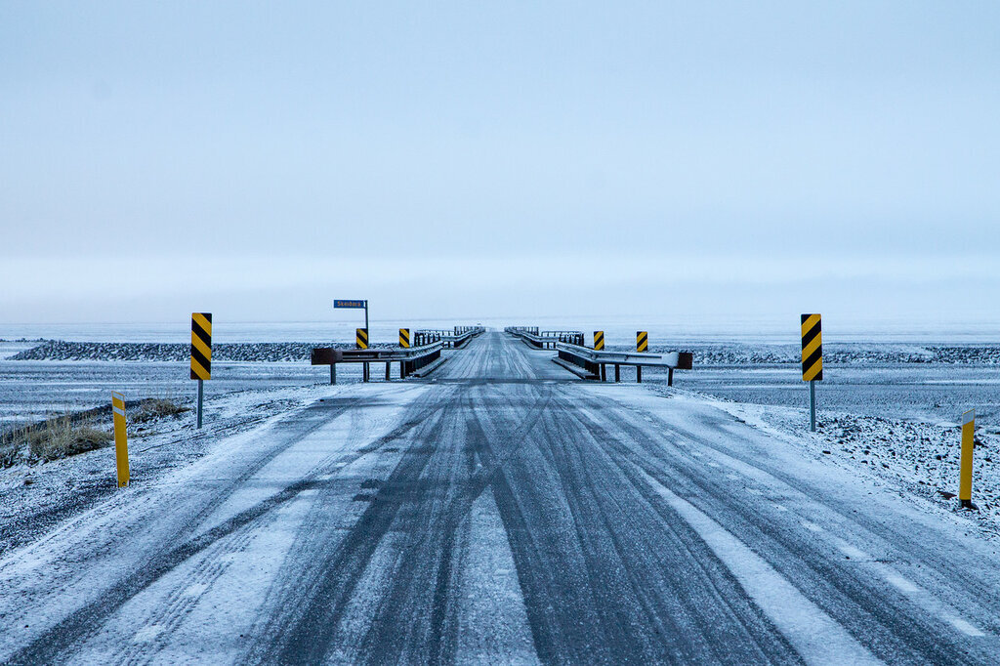](https://fotki.yandex.ru/next/users/klimentij511/album/464271/view/1235985?page=6)

Между прочим, при аренде автомобиля нас отдельно предупредили, что двери от такого ветра могут оторваться и это не входит в страховку. Там мы улыбнулись, а вчера и сегодня поняли, о чем идет речь. Еда пока даже не стремится подходить к концу, но тушенка уже не вызывает никакого энтузиазма. Зато горячие супчики в термосе идут на-ура. Не хватает только хлеба и молока, но мы уже второй день не можем найти открытый супермаркет. В Исландии вообще невозможно найти жизнь: только изредка домики да фермерские хозяйства. Где они покупают еду, бензин, учатся и лечатся - это тайна, покрытая густым слоем тумана и проливными дождями [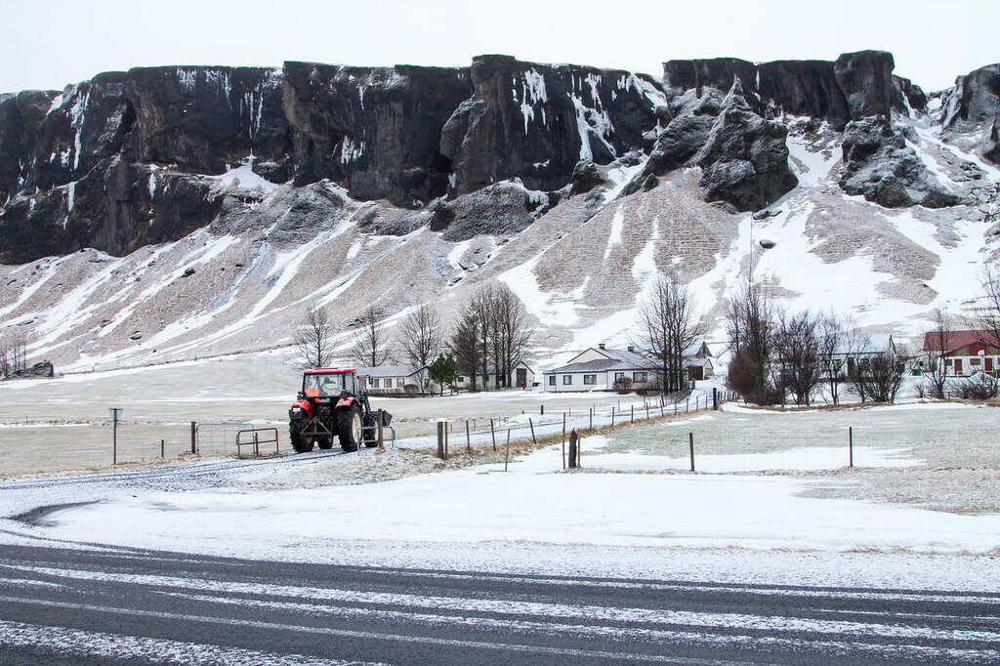](https://fotki.yandex.ru/next/users/klimentij511/album/464271/view/1235976?page=5)

[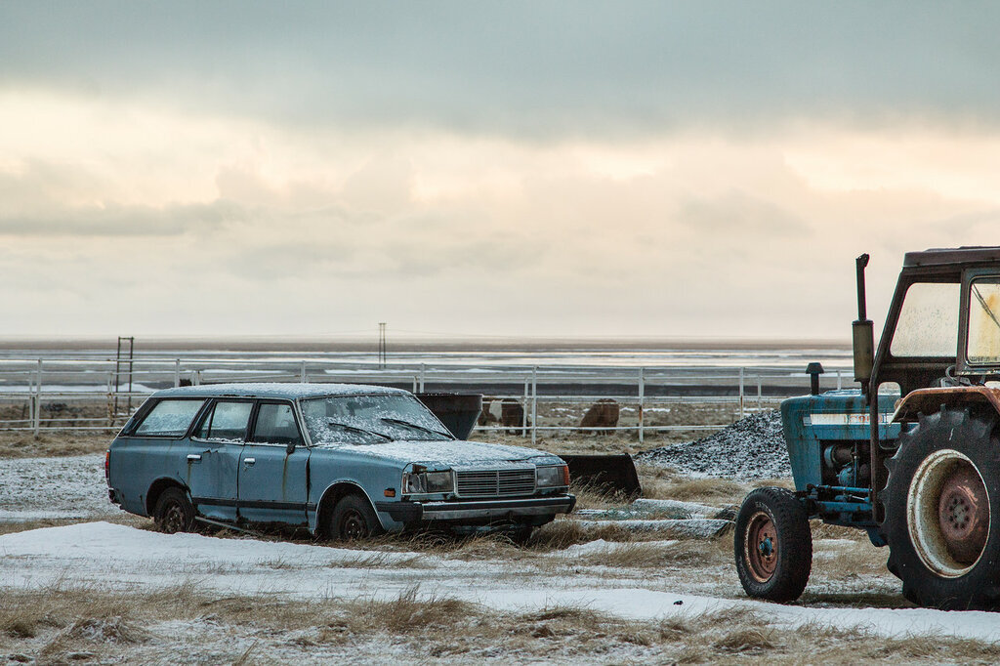](https://fotki.yandex.ru/next/users/klimentij511/album/464271/view/1235979?page=6)

Наконец, мы добрались до подножия крупнейшего ледника Исландии - Ватнайёкюдля, который занимает 11% от площади острова [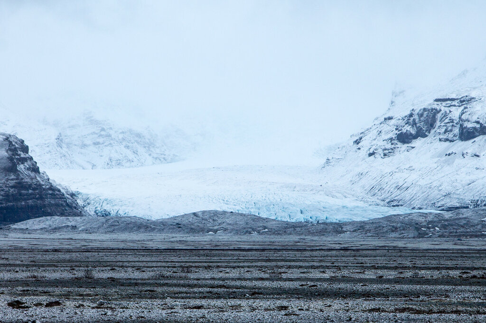](https://fotki.yandex.ru/next/users/klimentij511/album/464271/view/1235994?page=6)

Тут мы сначала поднялись к водопаду Свартифосс (дорога в одну сторону занимает около 40 минут) [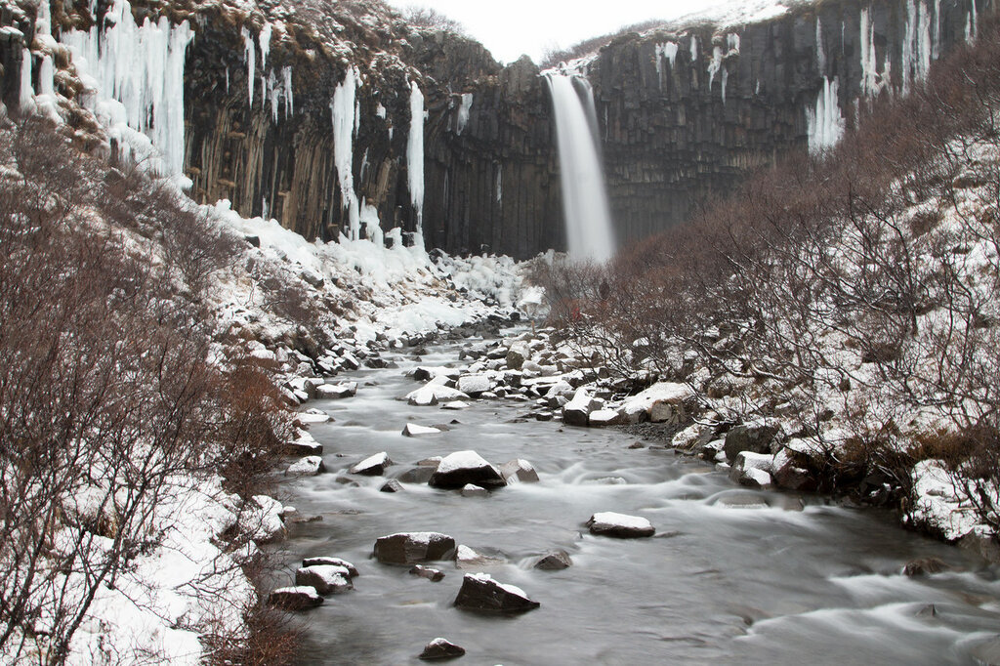](https://fotki.yandex.ru/next/users/klimentij511/album/464271/view/1236007?page=7)

а затем подъехали к одному из "языков" ледника - Svínafellsjökull, название которого на русском звучит примерно как Свинафетльсйокутль. Это просто НЕВЕРОЯТНОЕ зрелище. Ощущение, что ты находишься где-то на Марсе [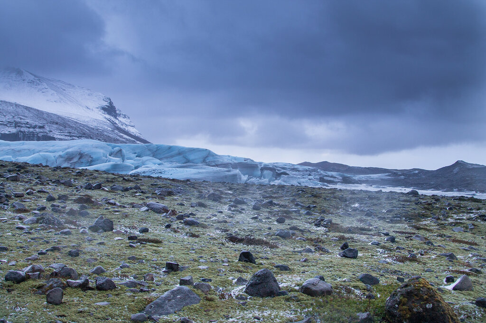](https://fotki.yandex.ru/next/users/klimentij511/album/464271/view/1236011?page=7)

[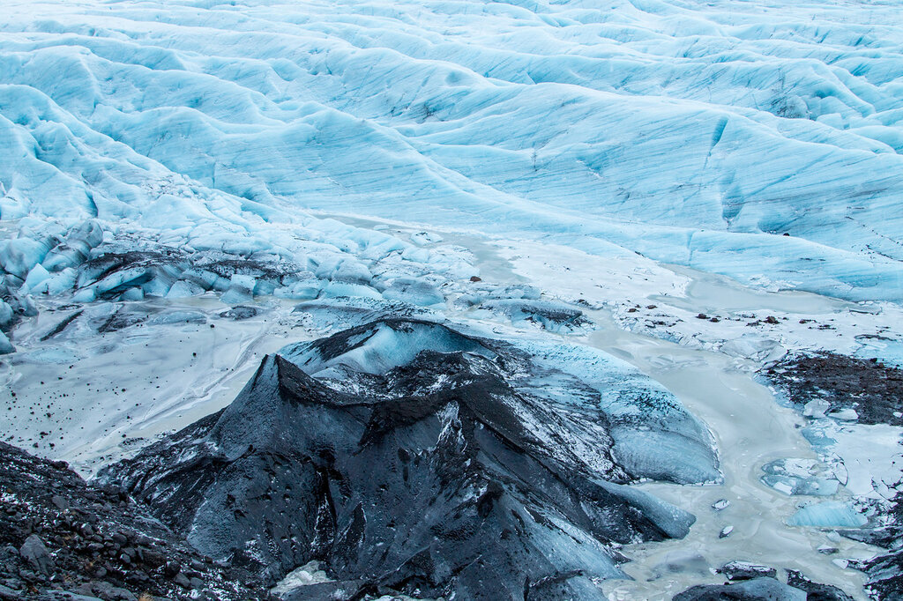](https://fotki.yandex.ru/next/users/klimentij511/album/464271/view/1236019?page=7)

В планах на сегодня еще была лагуна Йокульсарлон, но из-за темноты и проливного дождя с штормовым ветром, мы решили поехать в гостиницу (которую впервые забукали заранее!): просушить все вещи, выспаться и с новыми силами с утра посмотреть на эту ледниковую лагуну.

## День пятый. Юго-восток Исландии, часть 2

Ночь выдалась снежная и ветренная - стенки домика за 140 евро немного продувало, а шум с непривычки мешал заснуть даже после насыщенного и напряженного дня. Из-за стирки вещей на Дашке закончилась горячая вода. Вещи опять пришлось перевешивать, ради чего за ночь я проснулась 3 раза и с утра чувствовала себя несколько разбитой. Сна в нашей поездке немного не хватает - попытка увидеть все за короткий световой день ставит нас в жесткие временные рамки. Да и вообще, рассуждая о путешествии в зимнюю Исландию, мы пришли к выводу, что это для настоящих гиков. В Норвегию съездить намного проще и дешевле [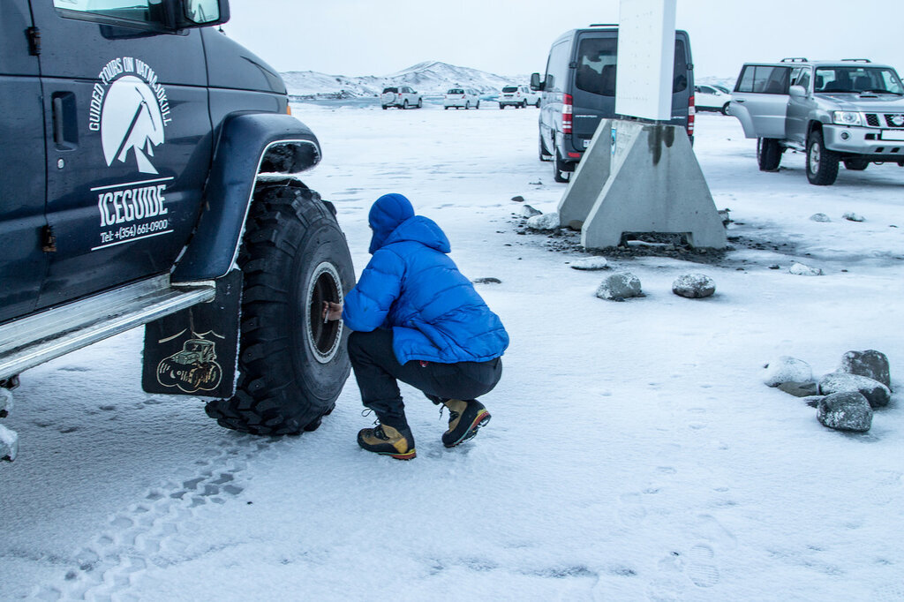](https://fotki.yandex.ru/next/users/klimentij511/album/464271/view/1236034?page=8)

Но мы каждый день приходим в состояние шока от природы, ее силы, могущества и необычности форм. Сложно поверить, что в мире вообще существует что-то подобное. Сначала мы долго смотрели на фотографии других путешественников, и думали, что там фотошоп. Но нет. Тут на самом деле так, и даже лучше.

Сегодня с утра нам опять повезло - была хорошая видимость и даже обошлось без снегопада: мы подъехали к ледниковой лагуне Йокульсарлон, куда постепенно стали подтягиваться джипы и легковушки других путешественников [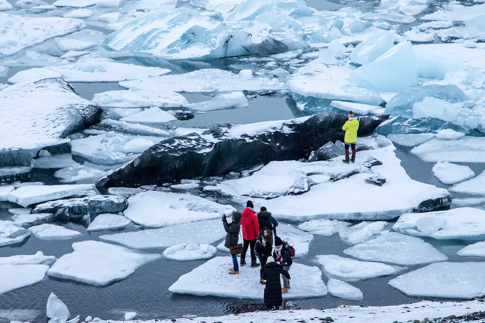](https://fotki.yandex.ru/next/users/klimentij511/album/464271/view/1236033?page=8)

Виды невероятные - ледник вот уже почти век постепенно тает, а отколотые глыбы льда выплывают в море. Летом здесь катают на лодочках, чтобы можно поближе увидеть льдины и, если повезет, тюленей [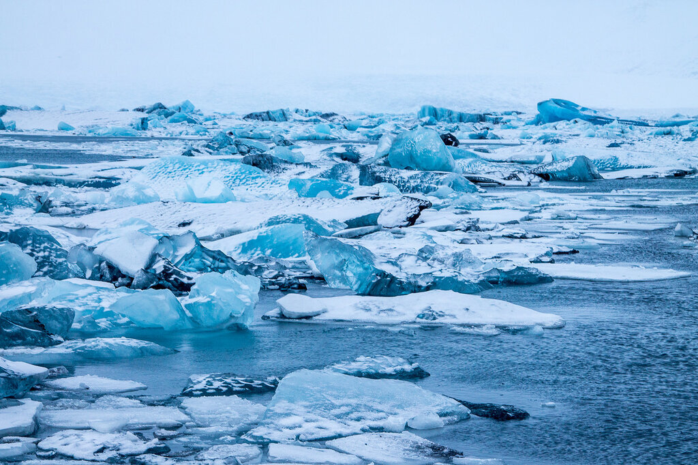](https://fotki.yandex.ru/next/users/klimentij511/album/464271/view/1236021?page=8)

Увы, животных на горизонте не было, зато были потрясающие виды, для описания которых мне необходимо прочитать словарь синонимом для слов "ошеломляющее, сногсшибательное, завораживающее". Напротив лагуны находится пляж, куда течением выносит ледяные глыбы, уже успевшие попасть в океан. Зрелище фантастическое: черный пляж, голубой лед, сумерки [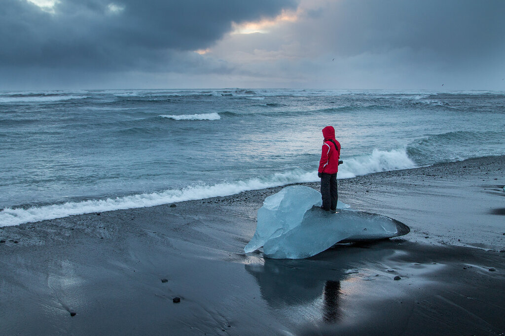](https://fotki.yandex.ru/next/users/klimentij511/album/464271/view/1236042?page=9)

При солнце это смотрелось бы куда фотогеничнее, но о таком подарке судьбы мы даже не просим: нам уже достаточно того, что ветер не отрывает двери и не сносит машину в кювет [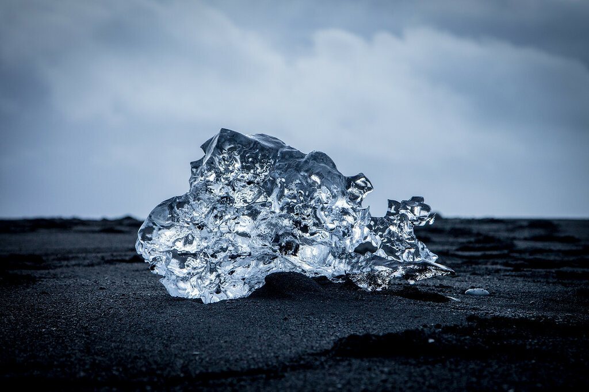](https://fotki.yandex.ru/next/users/klimentij511/album/464271/view/1236036?page=8)

[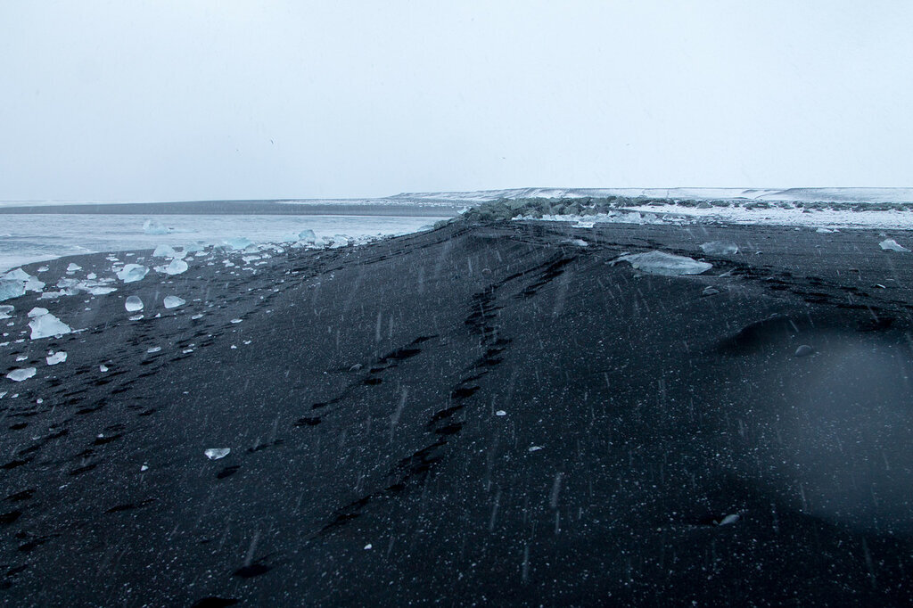](https://fotki.yandex.ru/next/users/klimentij511/album/464271/view/1236046?page=9)

Первая половина дня была цвета крем-брюле: солнце из-за облаков очень красиво освещало снег, и мы ехали словно по ванильной глазури для торта [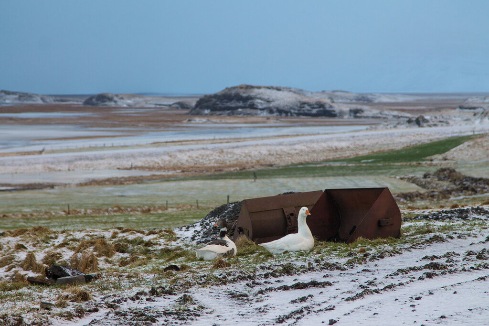](https://fotki.yandex.ru/next/users/klimentij511/album/464271/view/1236049?page=9)

[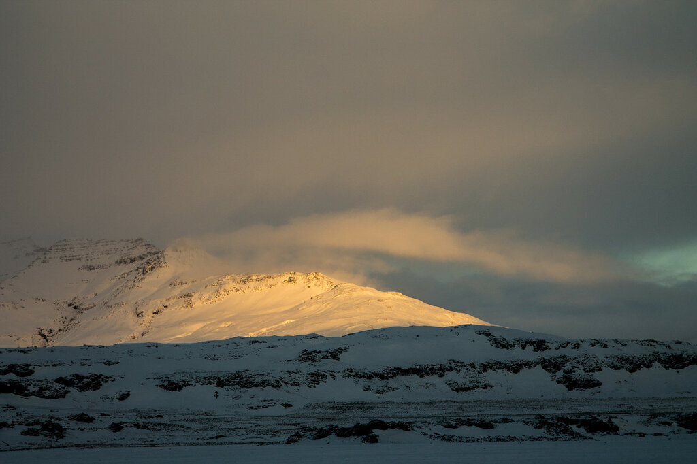](https://fotki.yandex.ru/next/users/klimentij511/album/464271/view/1236056?page=9)

С каждым днем мои отчеты становятся все длиннее и длиннее, так как я просто не могу уместить свои впечатления. После лагуны мы поехали на восток, где берут начало исландские фьорды. Фьорды - это узкий, извилистый и глубоко врезавшийся в сушу морской залив со скалистыми берегами. Самыми прекрасными для нас навсегда останутся фьорды Норвегии, где мы их увидели в самый первый раз. По дороге мы заехали в термальные источники [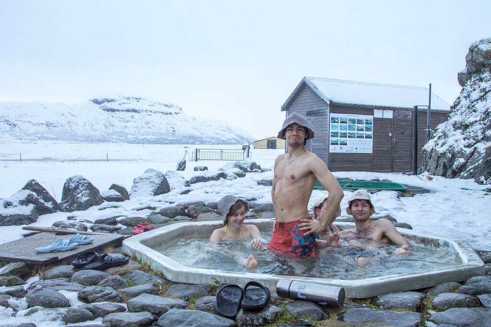](https://fotki.yandex.ru/next/users/klimentij511/album/464271/view/1236067?page=10)

Источники оформлены в виде небольших купелей в скале. Из людей были только мы - все опознавательные знаки на дороге замело снегом, поэтому добраться сюда мог только тот, кто заранее хотел сюда попасть. На входе надо было оставить взнос по 500 крон с каждого, положив в бокс, но мы уже немного ошалели от цен, поэтому решили хоть здесь немного сэкономить. Можете корить нас, но когда сюда доберетесь, в вас тоже проснется жаба, которая будет пытаться компенсировать затраты любым доступным способом. Спидометр сегодня показал 1000 км, и это значит, что мы уже потратили 12000 рублей на бензин, а впереди еще 4 дня в дороге. Мы заехали в город Hofn, который читается как "Хебн" [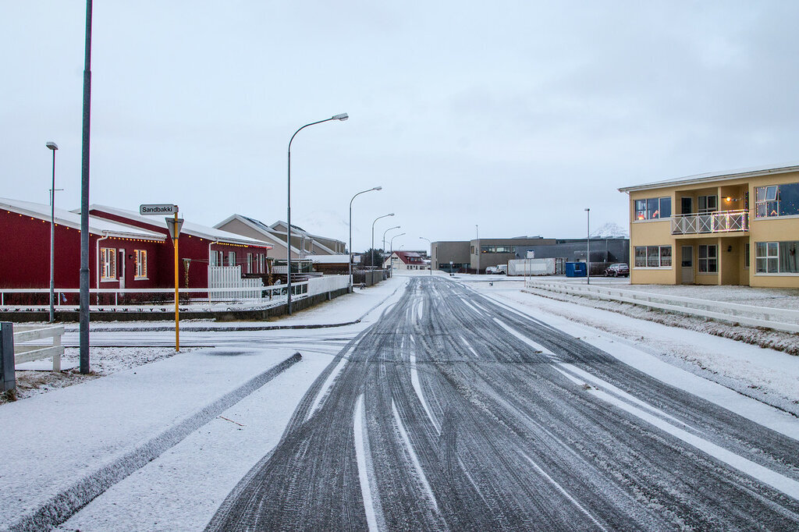](https://fotki.yandex.ru/next/users/klimentij511/album/464271/view/1236094?page=11)

[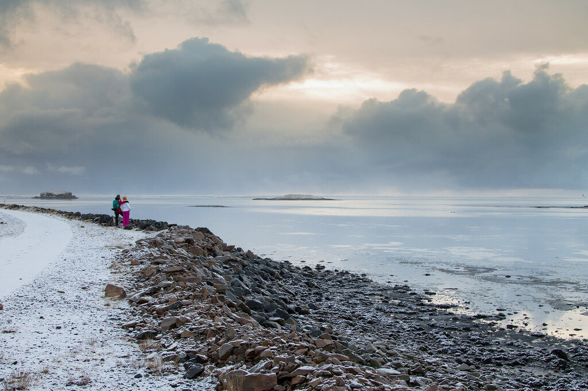](https://fotki.yandex.ru/next/users/klimentij511/album/464271/view/1236079?page=11)

Там мы наконец-то нашли большой супермаркет, где купили молоко (70 рублей), йогуртами (по 75 рублей/штука) и хлебом (150 рублей). Мясо взять рука не поднялась - 800 рублей за килограмм, при этом минимальная туша - 3 кг.Столько мы не съедим за раз, а на больше готовить смысла нет. Тушенка уже не лезет, поэтому сегодня мы ели суп на обед, а на ужин открыли паштет [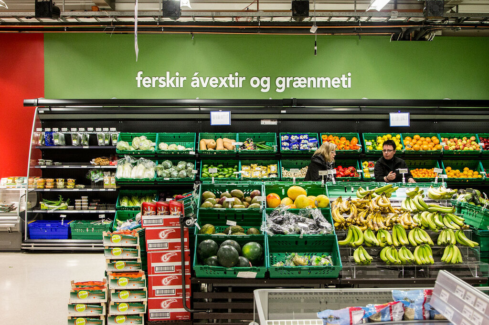](https://fotki.yandex.ru/next/users/klimentij511/album/464271/view/1236072?page=10)

Вам может показаться, что мы немного зациклились на ценах, но это нет так, просто невозможно игнорировать столь существенную разницу в ценах между Россией и Исландией. Тем более мы знаем, сколько стоит жилье и еда в разных странах, и какие условия должны быть в гостинице и хостелах. С поисками гестхаусов каждый день проблемы: исландцы игнорируют букинги день в день. Необходимо либо это делать заранее, либо звонить. Благо, у Даши бесплатная связь, но без этого мы бы разорились на постоянных звонках. Несмотря на бытовые трудности, страна полна приятных сюрпризов: погода меняется каждые 15 минут, и ты никогда не знаешь, какой она будет [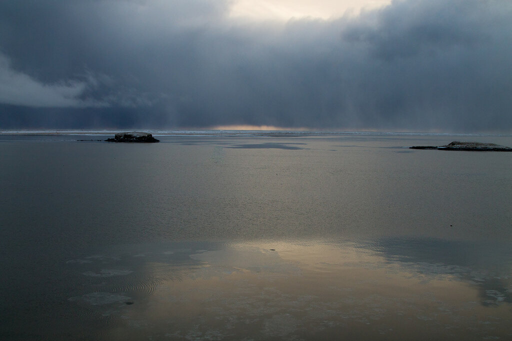](https://fotki.yandex.ru/next/users/klimentij511/album/464271/view/1236091?page=11)

Сегодня мы впервые в жизни видели абсолютно горизонтальный из-за ветра град: если открыть в этот момент окно (а мы так и сделали), то острые льдины летят прямо в лицо, больно ударяя, пока жмешь кнопку электроподъемника, чтобы быстрее прекратить это. На точках были маяк, РЛС и еще пара городов, но длительное купание в термальных источниках+сильный ветер и ОЛЕНИ на дороге очень мешали ехать быстрее

<iframe src="//vk.com/video_ext.php?oid=15592&amp;id=170983511&amp;hash=f3955c87aa32e088&amp;hd=2" width="853" height="480" frameborder="0"></iframe>

Олени появились внезапно, а когда добрые два десятка из них бросились под колеса, мы стали ехать еще аккуратнее. Затем путь преградил сначала знак, что дорога не обслуживается и мы едем на свой страх и риск (мы с Дашей запротестовали и попросили поехать по главной дороге №1), а потом дорога №1 внезапно кончилась знаком, что она закрыта: пришлось снова искать пути объезда, и к месту ночевки мы приехали позднее запланированного. День сумбурный, столько всего произошло, что уже сложно вспоминать, что было в начале. Надеюсь, сон немного поможет - после тяжелой дороги (а Клим и Вова еще настояли на съезд на F-трассу, где начался легкий офф-роад, после которого до конца дня болела голова) и отсутствия горячей еды в течение 6 часов мой организм чувствует себя побитым и температура в 35.8 тому доказательство. Знак, предупреждающий о броде 

И сам брод [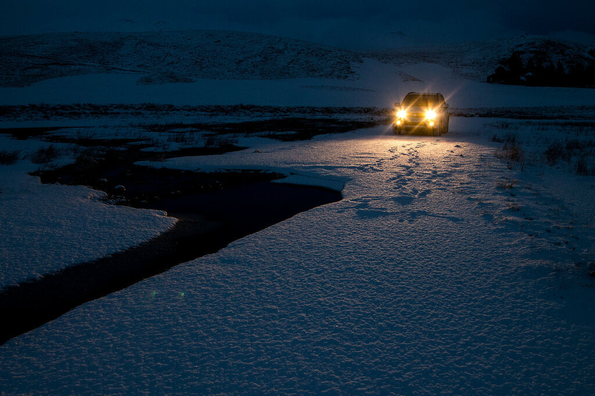](https://fotki.yandex.ru/next/users/klimentij511/album/464271/view/1236103?page=12)

Зато у нас хороший хост сегодня - трехкомнатные апарты с ванной, кухней и гостиной! "Всего" 113 евро!

Читайте другие статьи из цикла про зимнюю Исландию:

- [Исландия зимой. Часть 1. Лагуна, Гейзер и водопад Гульфосс](https://vodpop.ru/islandiya-zimoy-chast-1-laguna-geyzer-i-vodopad-gulfoss/)
- [Исландия зимой. Часть 2. Южная Исландия](https://vodpop.ru/islandiya-zimoy-chast-2-yuzhnaya-islandiya/)
- [Исландия зимой. Часть 4. Самый север](https://vodpop.ru/islandiya-zimoy-chast-4-samyiy-sever/)
- [Исландия зимой. Часть 5. Круг замкнут](https://vodpop.ru/islandiya-zimoy-chast-5-krug-zamknut/)
