Ветер всю ночь завывал так, словно хотел ворваться в наше жилище и унести вещи с собой. Меня пожалели - разбудили самую последнюю, позвав на уже готовый завтрак из каши и йогурта. С собой на обед ребята приготовили супчик в термосе и вермишель с тушенкой.

<!--more-->

## День шестой. Северо-восток Исландии

Говядина в банках уже еле-еле запихивается в наши уставшие желудки - рыбу мы решили по опыту с Норвегией не брать - думали, она тут местная и дешевая. Но как бы не так: Исландия занимается промышленным рыболовством, и всю полученную рыбу продает той же Норвегии. Себе по какой-то причине они ничего не оставляют: на прилавках можно найти только китайскую и калининградскую рыбу по цене от 500 руб/кг. Рыболовство, кстати, является вторым по объему источником доходов Исландии после туризма. Выехали мы уже в светлое время суток, что вызвало много возмущений со стороны мужской половины коллектива: им с первого дня мерещится, что мы не успеем все посмотреть [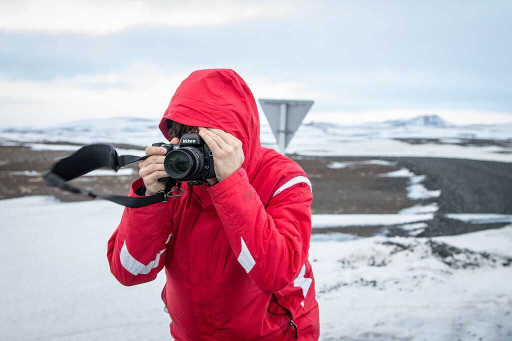](https://fotki.yandex.ru/next/users/klimentij511/album/464271/view/1236108?page=12)

Их сомнения можно понять: Исландия очень красивая и интересная страна, где почти везде можно найти что-то занимательное, но световой день в январе самый короткий в году: ровно в дни нашей поездки солнечного света меньше всего в году. Сегодня мы проехали около 300 км - дорога была красивая, мы останавливались и просто гуляли вокруг, делали фото, пока порывы ледяного ветра не загоняли нас обратно в машину [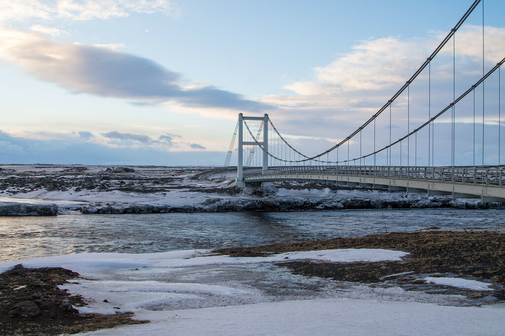](https://fotki.yandex.ru/next/users/klimentij511/album/464271/view/1236113?page=12)

Любимым развлечением стало опрокидываться назад, пока угол между телом и землей не составит около 50 градусов: в таком положении ветер может поддерживать спину, и ты никак не можешь упасть [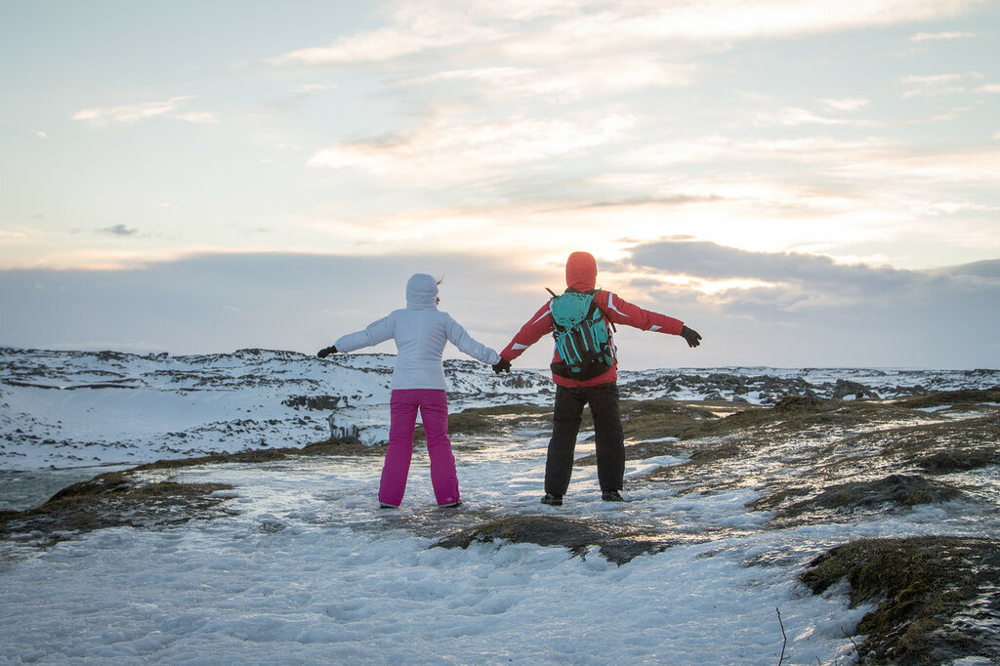](https://fotki.yandex.ru/next/users/klimentij511/album/464271/view/1236128?page=13)

Первой точкой в этот день стал крупнейший водопад в Европе, Деттифосс. Его длина составляет свыше 100 метров, а высота около 45 [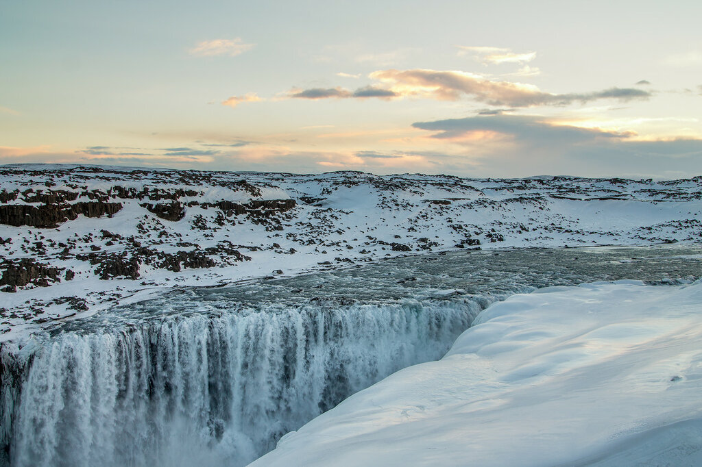](https://fotki.yandex.ru/next/users/klimentij511/album/464271/view/1236122?page=13)

Порывы ветра рядом с ним буквально сбивают с ног, поэтому мы предпочитали сидеть и смотреть [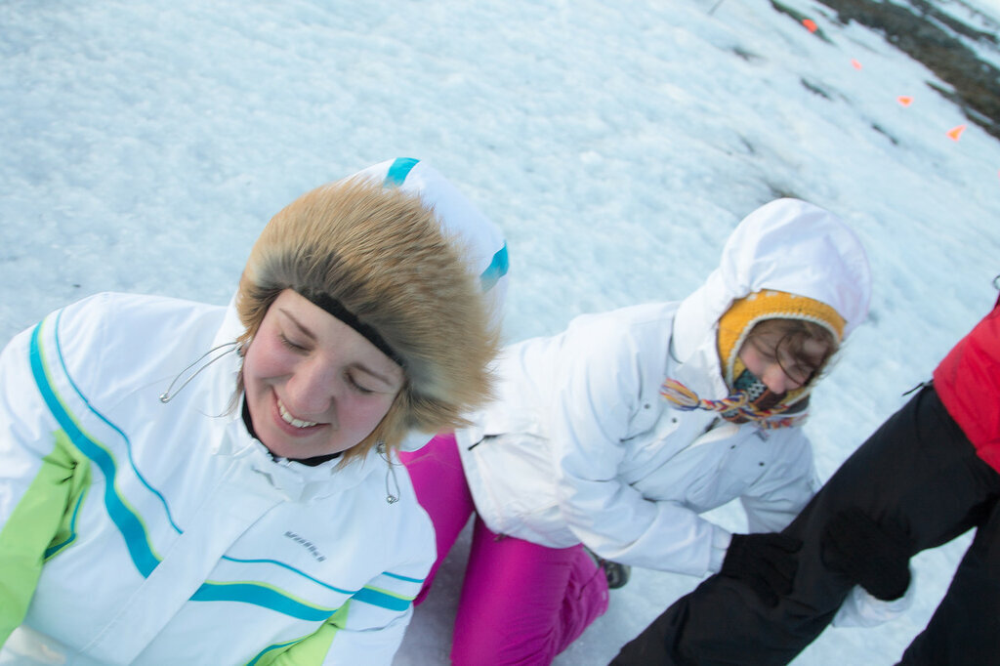](https://fotki.yandex.ru/next/users/klimentij511/album/464271/view/1236126?page=13)

Здесь же была припаркована единственная машина: местный исландский рейнджер развешивал предупреждающие флажки: поверхность рядом с водопадом настолько обледенела, что оттуда легко можно упасть в пропасть [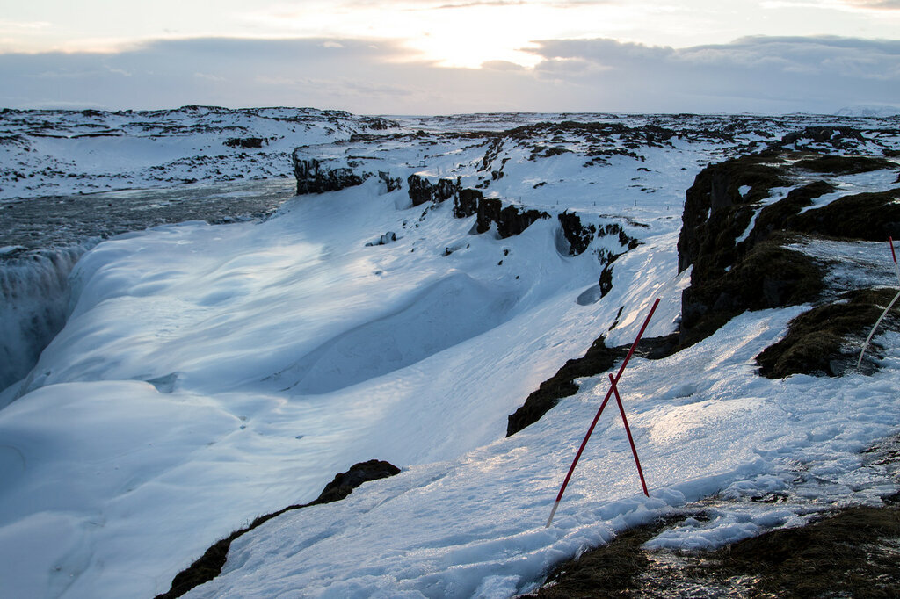](https://fotki.yandex.ru/next/users/klimentij511/album/464271/view/1236127?page=13)

Дорога ко второму водопаду была закрыта из-за возможного извержения [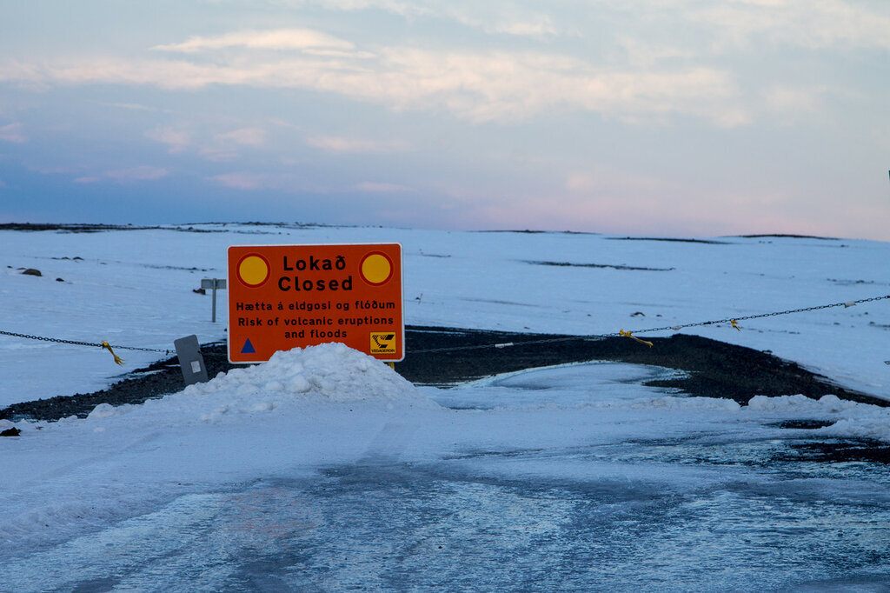](https://fotki.yandex.ru/next/users/klimentij511/album/464271/view/1236119?page=13)

Это просто супер-знак: трудно недооценить спокойствие, с которым Исландцы относятся к своей погоде и природе: даже самое известное извержение они переносили стойко и не уходили из своих домов. Рейнджер сказал, что раз мы русские и знакомы с холодом, то можем прогуляться до того водопада пешком, а вот ехать отговорил: сказал, что спасатели приедут в лучшем случае через 2 дня, если мы там застрянем. Сама дорога тоже была какая-то необыкновенная: лед на асфальте переливался такими красивыми оттенками голубого, что было сложно заставить себя смотреть вперед [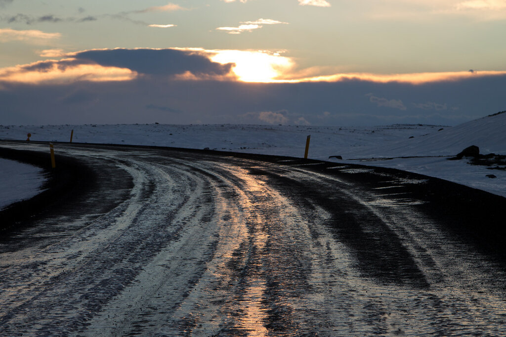](https://fotki.yandex.ru/next/users/klimentij511/album/464271/view/1236120?page=13)

Потом мы поехали в самую активную вулканическую зону Исландии, на вулкан Крафла: здесь построена геотермическая электростанция, которая отапливает второй по величине город Исландии - Акурейри  Чистое топливо - это не только прекрасно для экологии, но и очень красиво. Мы поднялись по заснеженной дороге к кратеру Вити, образованное благодаря извержению в 1724 году [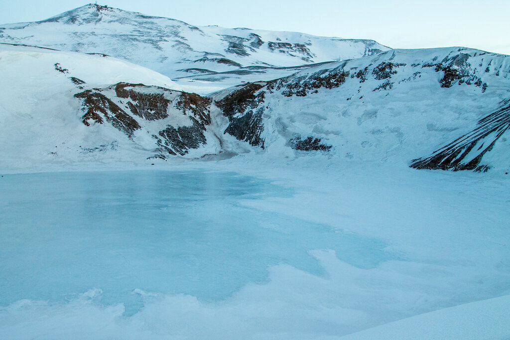](https://fotki.yandex.ru/next/users/klimentij511/album/464271/view/1236143?page=14)

Музей при электростанции. Как обычно, закрыт до лета 

Заодно мы посмотрели mud pots - грязевые лужи и hot springs - горячие источники [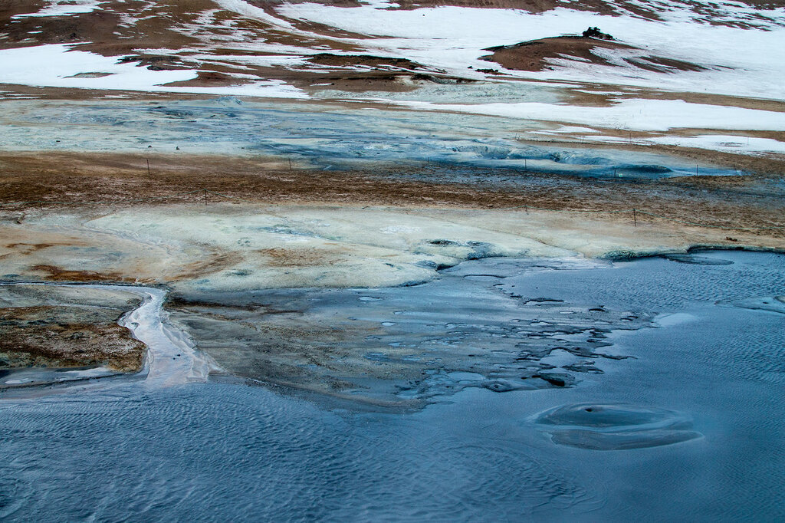](https://fotki.yandex.ru/next/users/klimentij511/album/464271/view/1236130?page=13)

Воняют они жутко - сероводородом, запах которого больше всего напоминает тухлые яйца. Только здесь их много: слева и справа из недров земли поднимается вода и грязь: горячий и вонючий пар разносится ветром повсюду [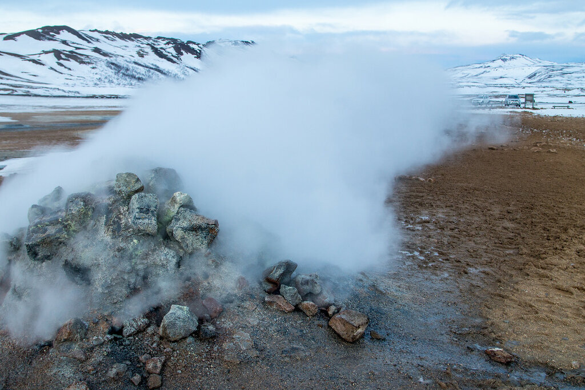](https://fotki.yandex.ru/next/users/klimentij511/album/464271/view/1236133?page=13)

Следующей точкой стало озеро Миватн [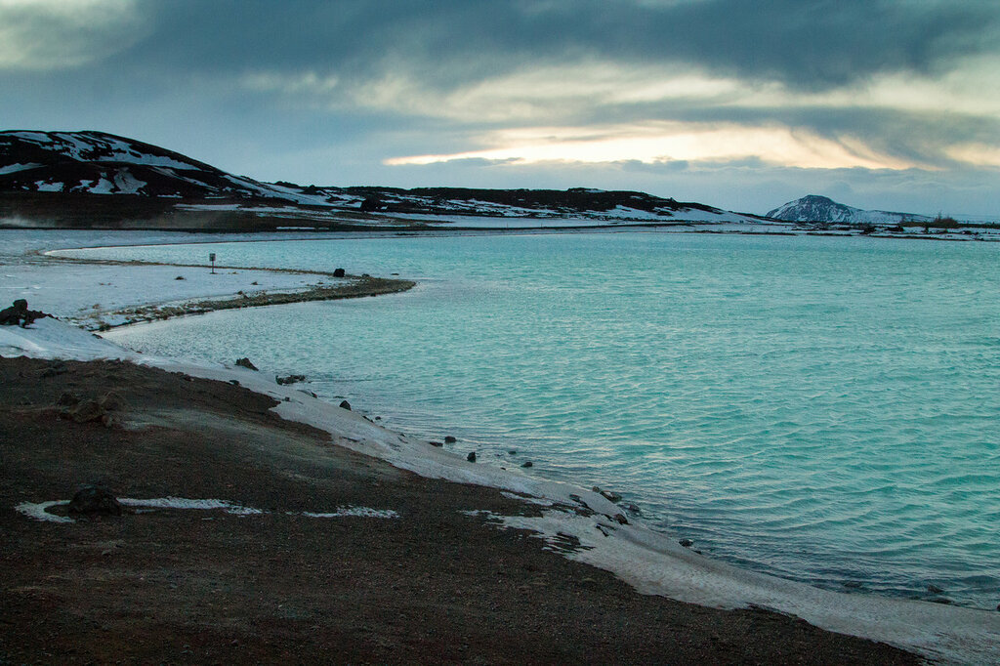](https://fotki.yandex.ru/next/users/klimentij511/album/464271/view/1236153?page=14)

Мы остановились у источника, в котором нельзя было купаться, но с каким-то невероятным напором воды: было ощущение, что стоишь у ворот в Ад, откуда извергаются потоки голубой жидкости, а земля дрожит так, что даже машина весом в 2 тонны вибрирует под тобой [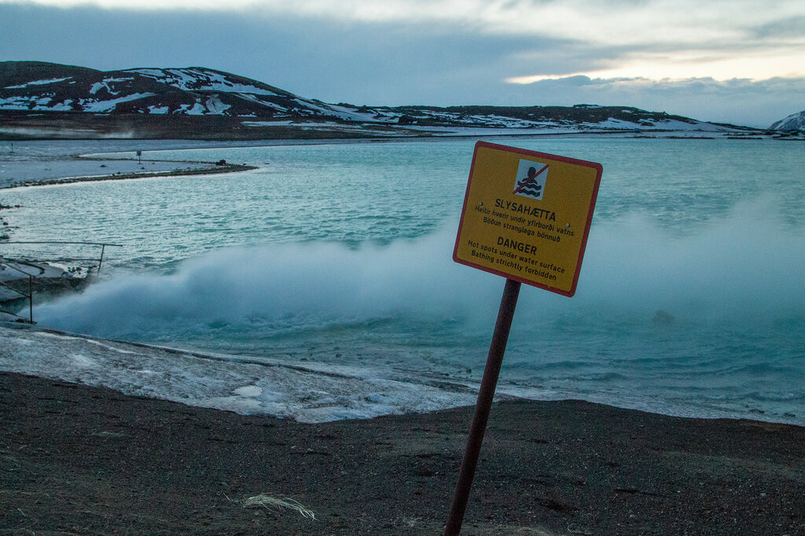](https://fotki.yandex.ru/next/users/klimentij511/album/464271/view/1236155?page=14)

В северную голубую лагуну мы заехали с целью искупаться, но особого энтузиазма не было, т.к. всего лишь вчера мы плавали за бесплатно, а здесь вход стоит 1500 с человека. Вокруг стоял все тот же запах тухлых яиц.. [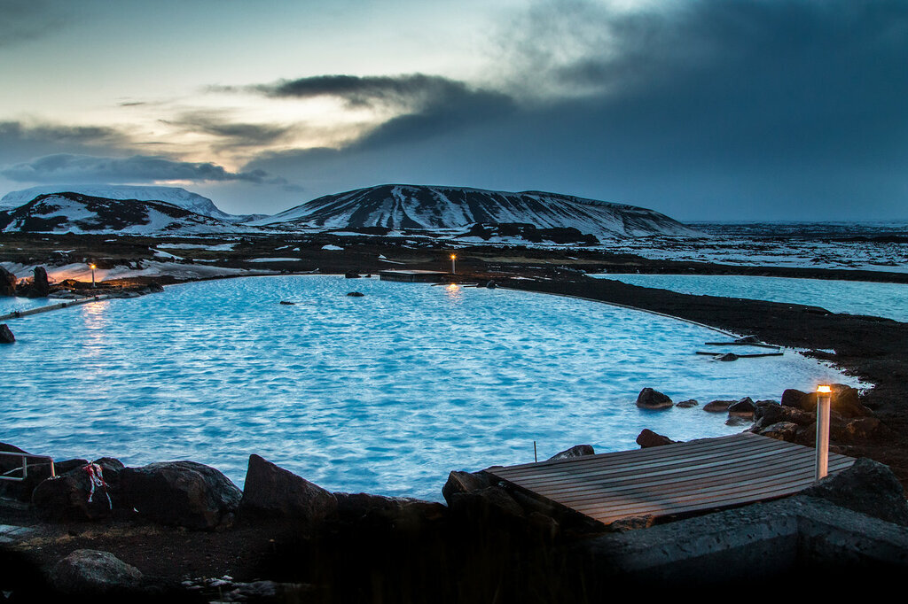](https://fotki.yandex.ru/next/users/klimentij511/album/464271/view/1236156?page=14)

Мы воспользовались бесплатным интернетом, чтобы забронировать апартаменты в Акурейри - северной столице Исландии. Пока я писала, уже приготовился ужин из бедра ягненка: сегодня мы наконец смогли найти магазин, который работает после 18.00. [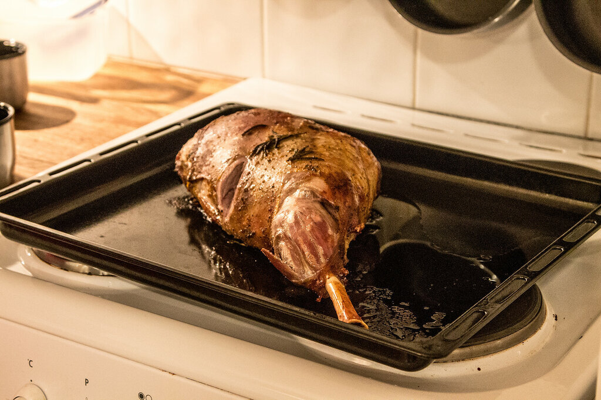](https://fotki.yandex.ru/next/users/klimentij511/album/464271/view/1236160?page=14)

Всем доброго вечера Рождества и хорошего настроения!

## День седьмой. Север Исландии

После ночевки в Акурейри, мы пытались посмотреть этот город: был запланирован культурный маршрут, с посещением музеев и костелов. Но ритм жизни в Исландии внес свои коррективы: музеи работают только два месяца в году, да и то раз в неделю. [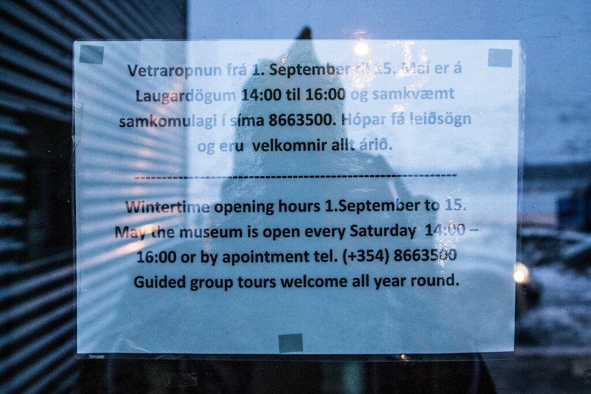](https://fotki.yandex.ru/next/users/klimentij511/album/464271/view/1236161?page=15)

Поэтому в Исландии музеи смотрят так [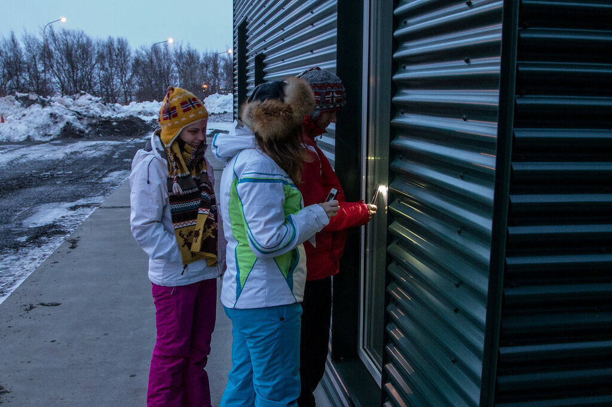](https://fotki.yandex.ru/next/users/klimentij511/album/464271/view/1236162?page=15)

Зато мы посетили целых два магазина с сувенирами: ребята купили открытку и магнитик, а Климентию наконец-то подобрали шапку, которую никак не могли купить в России [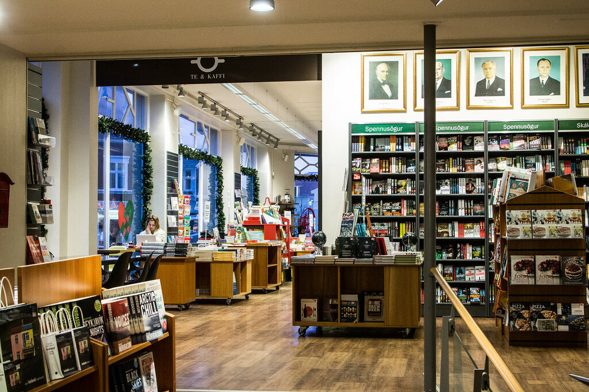](https://fotki.yandex.ru/next/users/klimentij511/album/464271/view/1236168?page=15)

А еще тут светофоры красным светом горят в форме сердечек! [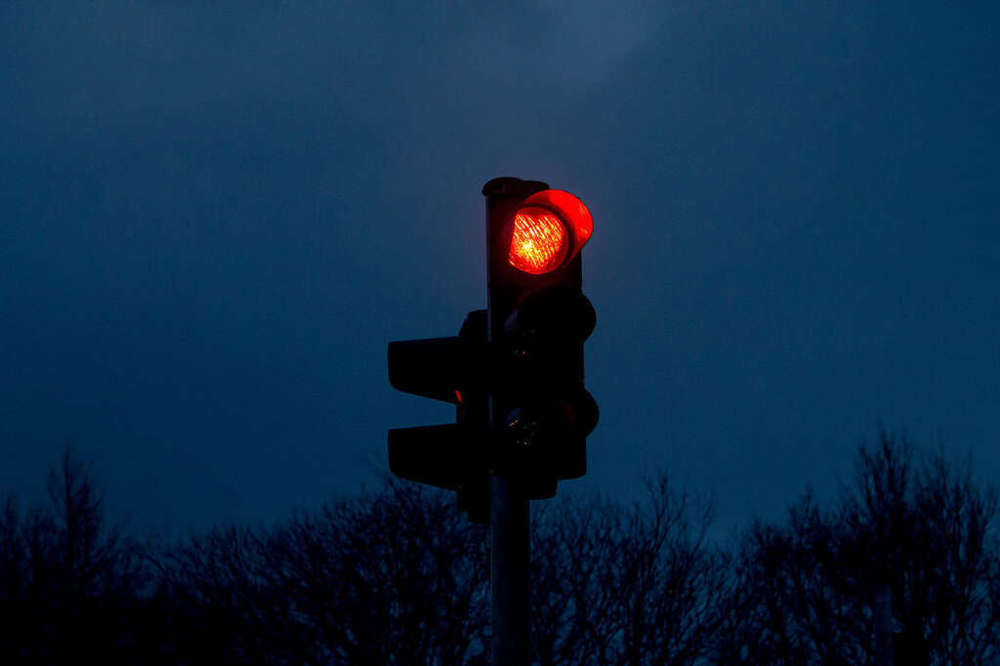](https://fotki.yandex.ru/next/users/klimentij511/album/464271/view/1236164?page=15)

[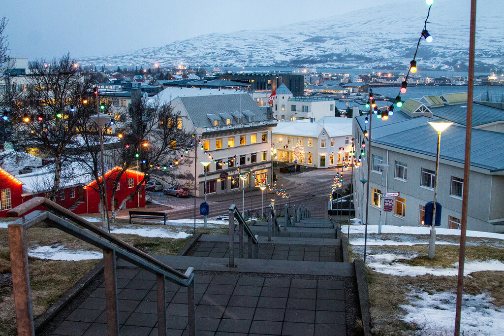](https://fotki.yandex.ru/next/users/klimentij511/album/464271/view/1236165?page=15)

Было забавно, что мальчишки наконец-то осознали, что у нас впереди еще много дней и совсем некуда спешить: появился резерв съездить куда-то вне плана, чем мы и воспользовались, и поехали на север от Акурейри, смотреть на красивые виды фьордов и местных деревушек, которые носят гордое имя города [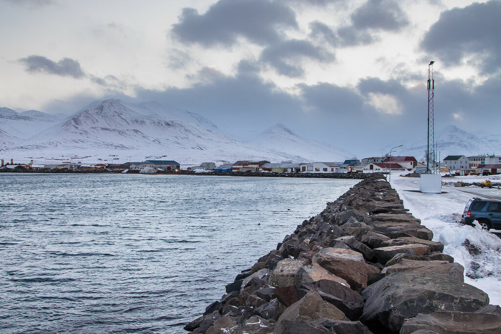](https://fotki.yandex.ru/next/users/klimentij511/album/464271/view/1236175?page=15)

[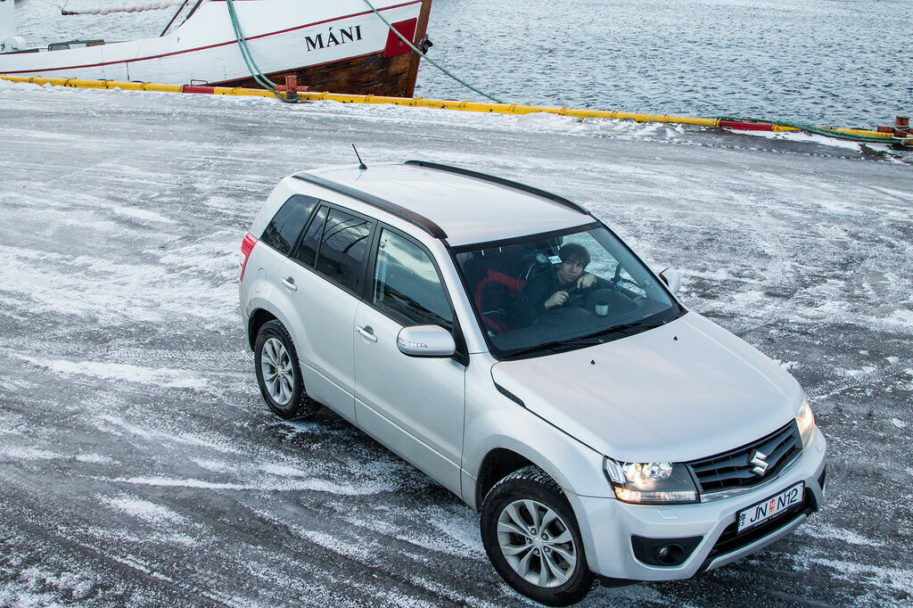](https://fotki.yandex.ru/next/users/klimentij511/album/464271/view/1236174?page=15)

[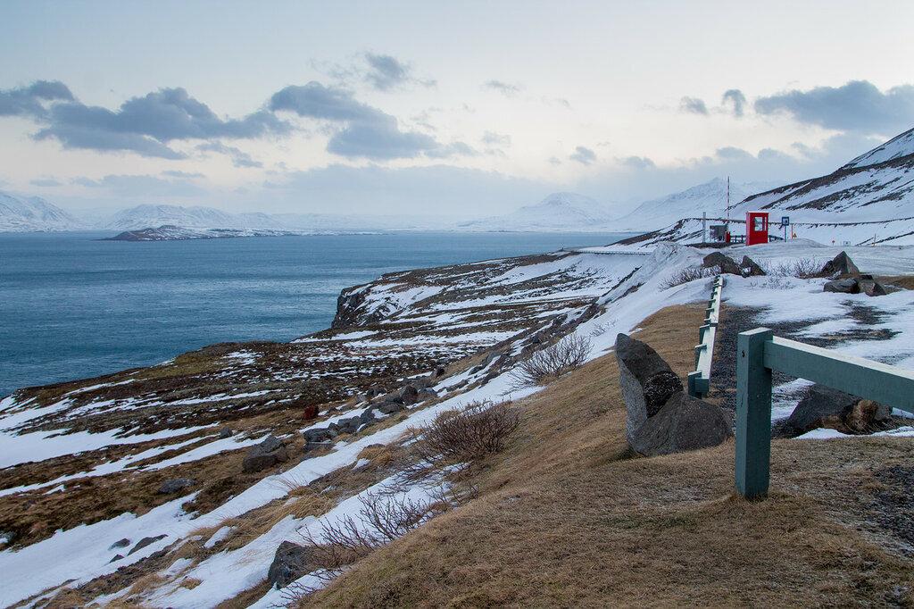](https://fotki.yandex.ru/next/users/klimentij511/album/464271/view/1236180?page=15)

В середине дня мы заехали в бассейн. Изначально предполагалось, что там будут термальные источники, но это оказался вполне обычный бассейн под открытым небом, вода в котором подогревалась благодаря энергии, которая получена на геотермальной станции, которую мы увидели вчера на вулкане Крафла. В бассейне мы были абсолютно одни: жуткий ветер сдувал наши шапки с голов (а мы всегда в Исландии плаваем в шапках для сауны), а пока мы бегали между бассейнов (горячими и не очень, большими и поменьше), ветер продувал до самых костей. В городке Далвик процветает рыбный промысел - запах стоит соответствующий, а еще отсюда три раза в неделю отходит паром до острова Гримси (Grimsey) - там туристам выдают сертификат, что он находится за полярным кругом. У нас подобный опыт уже был по дороге в Мурманск, да и расписание паромов мы заранее не узнавали: решено было ехать дальше, вдоль моря, чтобы получше рассмотреть фьорды [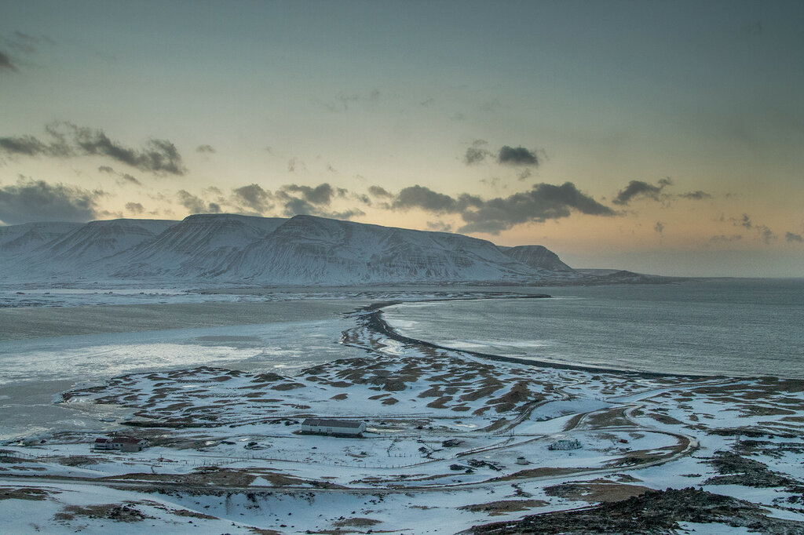](https://fotki.yandex.ru/next/users/klimentij511/album/464271/view/1236187?page=15)

Местами дорога жутковатая: скользкая, петлявая, ветренная. Выходя из машины обязательно надо придерживать двери, т.к. их просто вырывает из рук. Опять-таки "полежали" на порывах ветра, а Вова с Климом даже расстегнули куртки, чтобы под силой ветра попробовать немного "полетать" [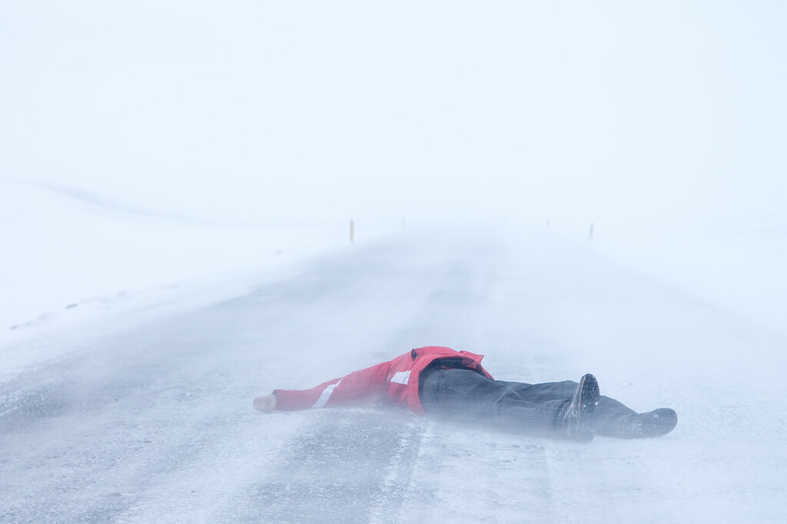](https://fotki.yandex.ru/next/users/klimentij511/album/464271/view/1236192?page=16)

Далеко не улетели, что уже успех: обрывы в Исландии не принято ничем защищать. Лишь изредка вдоль трассы можно встретить отбойники. Сегодня было много тоннелей: также, как и в Норвегии, дорога на фьордах проходит сквозь горную породу [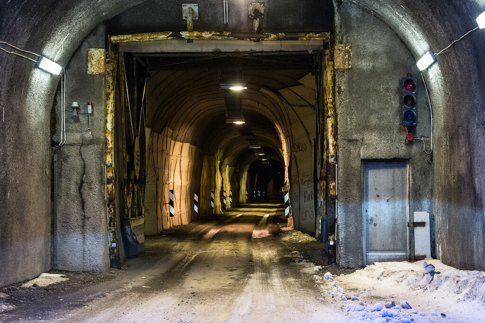](https://fotki.yandex.ru/next/users/klimentij511/album/464271/view/1236185?page=16)

Тоннели сделаны куда менее качествено, чем в Норвегии: тут и там торчат неаккуратно убранные куски арматуры, и это проявляется почти во всем: в гостиницах не очень чисто, в общественных местах тоже все немного недомытое. Это не сильно мешает, но за 150 евро хочется получать хороший сервис. Пришла к выводу, что в Исландию нужно ехать все-таки с палаткой и ночевать в кемпингах, а лучше и вовсе в диких местах. Природа настолько прекрасна, что хочется любоваться ей каждую свободную минуту. Одно НО - погода не всегда располагает к нахождению на улице, поэтому крайне желательно иметь автомобиль, в котором можно укрыться в случае непогоды [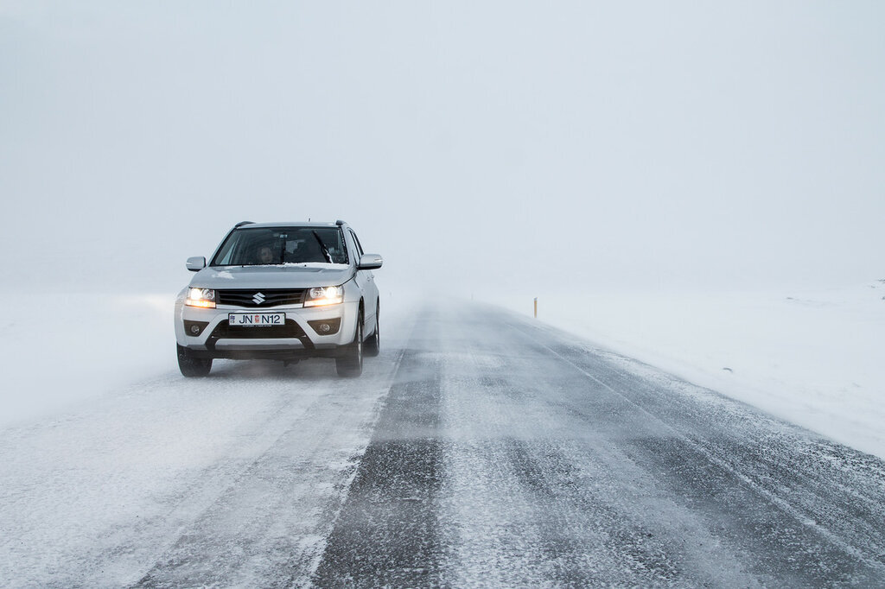](https://fotki.yandex.ru/next/users/klimentij511/album/464271/view/1236189?page=16)

Остановиться решили в городе, который известен как лучшее место наблюдения за тюленями. Завтра проверим! Гостиница сегодня была забукана за час, но это не привело нас к успеху: все равно пришлось звонить, чтобы получить код от коробки,в которой лежали ключи. Из-за мороза все замерзло, и шкафчик не открылся - пришлось звонить еще раз и просить приехать хозяйку. Когда мальчишки разгрузили вещи, мы с Дашей стали готовить ужин, а они поехали кататься. Как и было ожидаемо, они затащили машину в какой-то сугроб, откуда выбирались достаточно долго, и ужин пришлось подогревать заново.

Читайте другие статьи из цикла про зимнюю Исландию:

- [Исландия зимой. Часть 1. Лагуна, Гейзер и водопад Гульфосс](https://vodpop.ru/islandiya-zimoy-chast-1-laguna-geyzer-i-vodopad-gulfoss/)
- [Исландия зимой. Часть 2. Южная Исландия](https://vodpop.ru/islandiya-zimoy-chast-2-yuzhnaya-islandiya/)
- [Исландия зимой. Часть 3. Страна льдов](https://vodpop.ru/islandiya-zimoy-chast-3-strana-ldov/)
- [Исландия зимой. Часть 5. Круг замкнут](https://vodpop.ru/islandiya-zimoy-chast-5-krug-zamknut/)
