Переночевав в домике, от которого мы все-таки раздобыли ключи, а потом ожидали мальчишек половину вечера, мы двинулись дальше на юго-запад, в сторону Рейкъявика.

<!--more-->

## День восьмой. Запад Исландии.

По дороге увидели исландских лошадок, и решили дать им еще один шанс нас очаровать - в первый раз на популярной трассе лошадки отказались обниматься и есть сахар, что очень нас расстроило. Но местные лошади, лишенные какого-либо внимания, сразу подошли к нам и доверчиво подставили головы, чтобы мы их могли погладить. Затем мы скормили им половину пачки рафинада, нацеловались и счастливые и довольные поехали опять сквозь метель [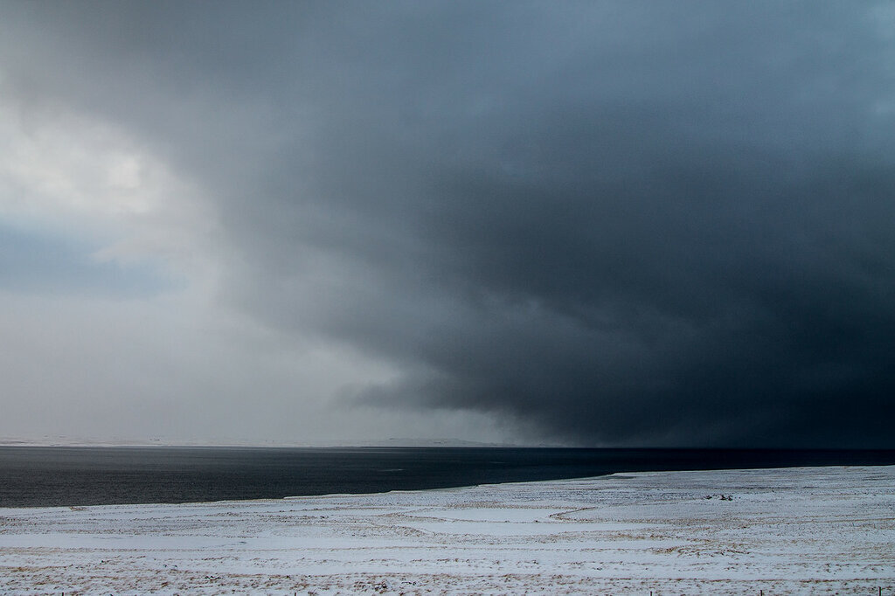](https://fotki.yandex.ru/next/users/klimentij511/album/464271/view/1236193?page=16)

Честно говоря, я не знаю, что еще описать из восьмого дня: мы ехали в полной темноте: жуткий снегопад перекрывал все виды перед нашими глазами, и приятным развлечением стал самый горячий источник Исландии - Дейльдартунгюквер, рядом с которым с апреля по осень продают помидоры из теплиц, работающих на геотермальной энергии [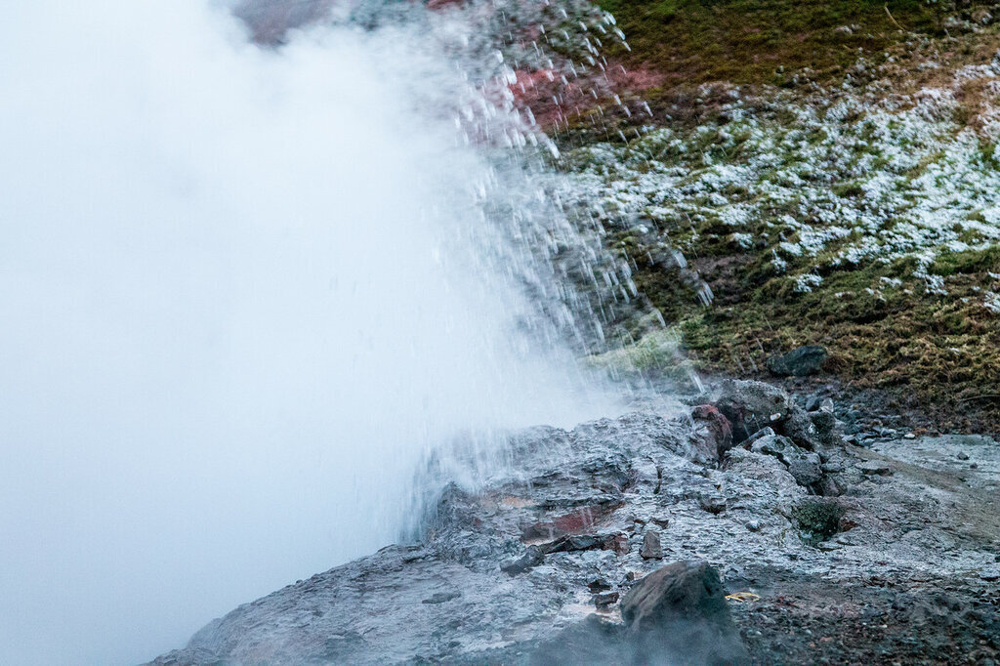](https://fotki.yandex.ru/next/users/klimentij511/album/464271/view/1236200?page=16)

[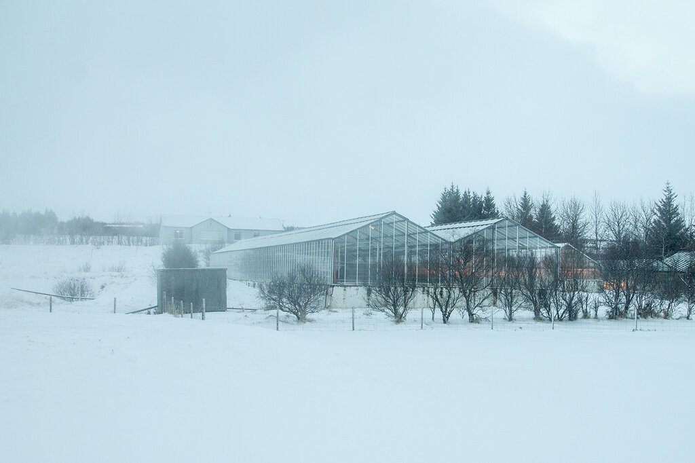](https://fotki.yandex.ru/next/users/klimentij511/album/464271/view/1236198?page=16)

[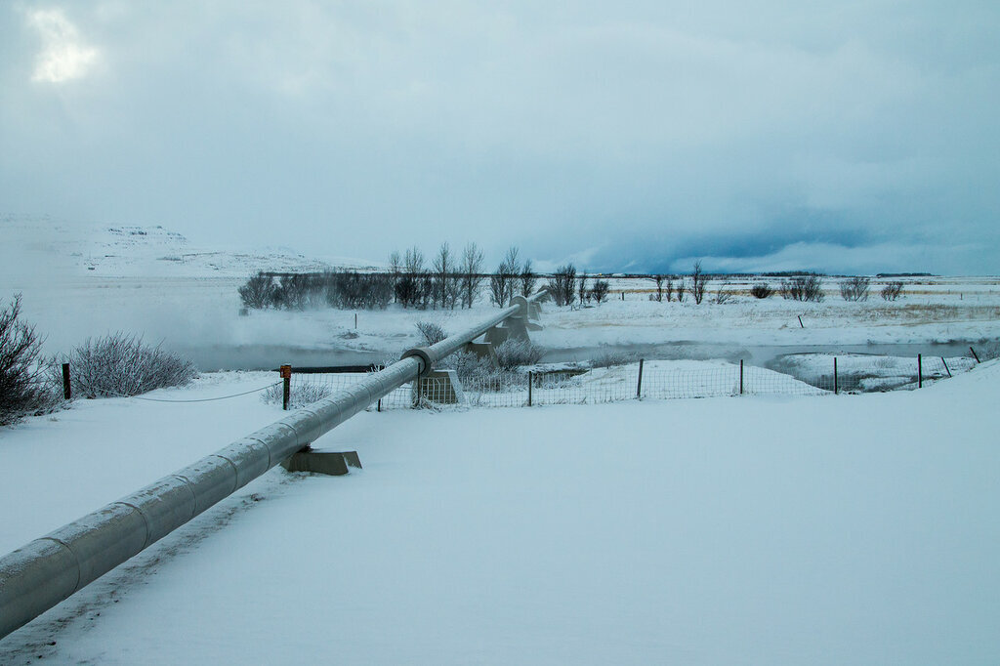](https://fotki.yandex.ru/next/users/klimentij511/album/464271/view/1236202?page=17)

Мы твердо решили переночевать на ферме - одном из популярных мест размещения в Исландии. Постучались прямо в соседские дома, рядом с теплицами, на что милый исландец показал нам рукой куда-то в сторону, куда мы послушно поехали. Затем мы подъехали к еще одному дому, где были поражены хорошим знанием языка седоволосой исландской фермерши.

Попробуй в России заехать в глушь и спросить на английском, где ближайшая к ним гостиница на ферме. Знание языка приятно поражает во всей Скандинавии - любой мойщик на любой заправке без запинки отвечает нам на английском на любой вопрос, в то время как в России не всегда способны ответить даже по-русски. Через 15 минут поисков ферма была найдена. Ей оказался дом, стоящий по соседству с хозяйским, оборудованный в виде хостела. Каких-то особых животных мы не заметили - разве что две собаки, которые были очень рады нас видеть (особенно Владимира - он после нападения собак в промзоне Москвы старается обходить их стороной, а они очень любят оказать ему особое внимание).

Из примечательного было то, что в гестхаусе мы были абсолютно одни - было много комнат, большая кухня, и в нашем полном распоряжении. Правда, очень холодно - батареи еле топили, но мы сначала погрелись в термальном бассейне прямо на веранде дома (вода +38), а потом ягермейстером. Надо сказать, что алкоголь идет в этой поездке очень и очень слабо - согреваться куда приятнее горячим чаем и едой, чем горячительными напитками. В итоге половину бутылки 0,7 ягермейстера мы возвращаем обратно в Россию.

Кстати, о чае! В поездку мы взяли 4 термоса, которые спасали нас от холода и голода каждый день. Чтобы не путаться в абсолютно одинаковых на вид стальных банок (трое из которых одинаковы и куплены в Икее), мы дали каждому имя. Так что помимо нас, Исландию посмотрели Фрося (хранительница супов), Геннадий (Гена) - знатный любитель сладкого чая, Эйнар - термос исландских кровей, причем женских - любит кофе и иногда супчик, а также Бьерна - молодой человек из Исландии, который выручал нас в ту минуту, когда все остальные термосы были пусты.

## День девятый. Юго-запад Исландии.

День порадовал нас относительно ясной погодой - по крайней мере было видно небо и даже местами горы. Причем сразу с утра, т.к. мы проспали и встали в 9.30 - рассвет уже начинался [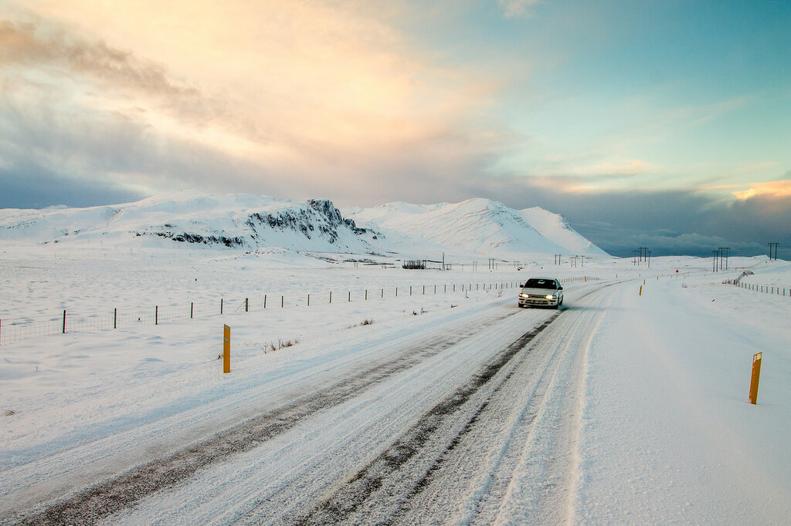](https://fotki.yandex.ru/next/users/klimentij511/album/464271/view/1236205?page=17)

Совсем забыла написать, что в день накануне Дашка с Владимиром сходили в музей тюленей - живьем нам их увидеть не удалось, поэтому ребята довольствовались фильмом и выставкой про этих дивных животных. Им очень понравилось, и что важно, они смогли купить студенческие билеты без предъявления ISICа [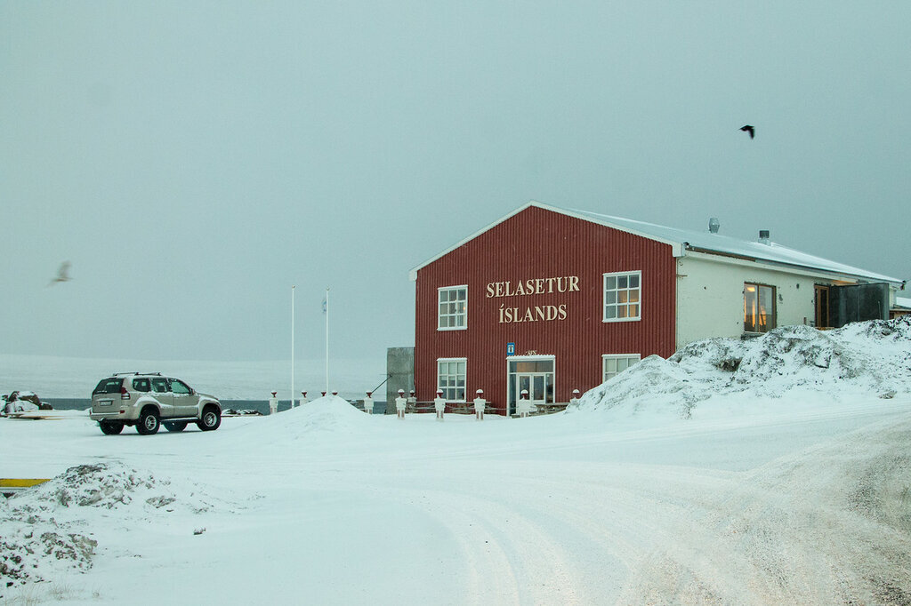](https://fotki.yandex.ru/next/users/klimentij511/album/464271/view/1236188?page=17)

Была попытка даже покушать в кафе, но оно, как и все остальное в Исландии вне туристического маршрута и сезона, не работало. В принципе под конец путешествия мы без особого энтузиазма смотрели на вывески, понимая, что в 99% случаев объект будет закрыт, и тратили время на глядение по сторонам, чтобы запомнить чуть больше этой природы. Меня одолевает желание приехать сюда снова летом, чтобы проехать в центральную часть острова. Смысла ехать по кругу я особо не вижу, хотя некоторые места буквально запали в душу, и если меня спросят, что самое удивительное в своей жизни я видела, я однозначно вспомню природу Исландии - совершенно неземную, марсианскую, похожую на сон или описание из чей-то фантазии [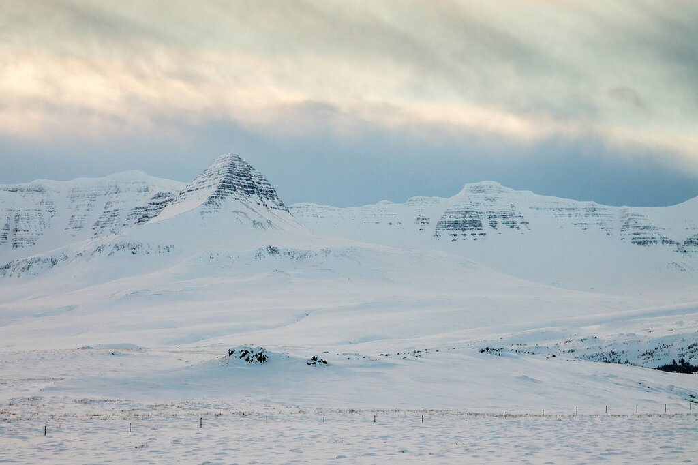](https://fotki.yandex.ru/next/users/klimentij511/album/464271/view/1236203?page=17)

Это трудно описать словами - нужно видеть. И даже не пытаться понять страну по фотографиям, которые мы или кто-то выкладывает на просторах интернета.

А мы тем временем подходили к столице. Поняв, что Рейкьявик наступает как-то слишком быстро, решили свернуть на параллельное шоссе в попытках увидеть что-то новенькое [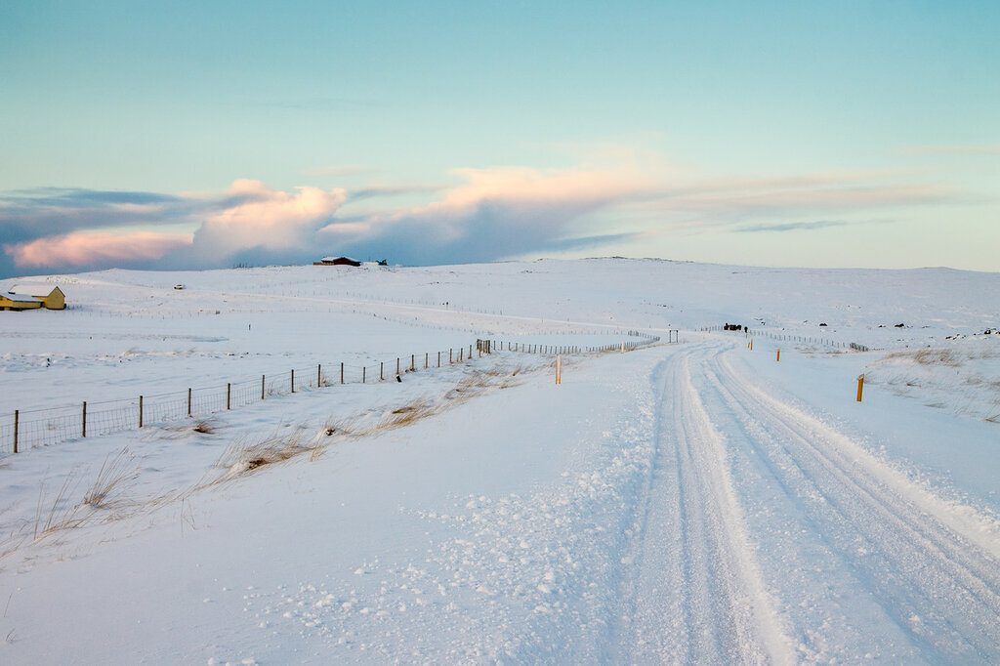](https://fotki.yandex.ru/next/users/klimentij511/album/464271/view/1236206?page=17)

К сожалению, в какой-то момент уровень неубранного снега стал выше уровня мостов нашего авто. Пришлось ехать назад. Причем задним ходом, потому что возможности развернуться не было. Сойди мы на эту дорогу на полчаса позже, ее бы уже почистили. Кстати, уборка такого слоя снега — это весьма зрелищно, особенно в лучах восходящего солнца [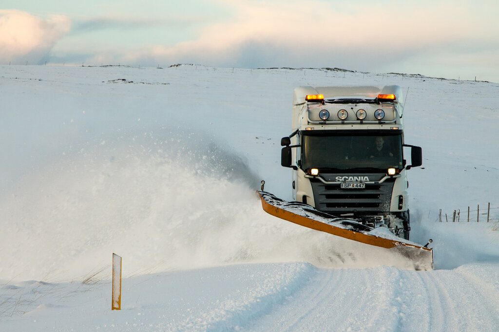](https://fotki.yandex.ru/next/users/klimentij511/album/464271/view/1236208?page=17)

[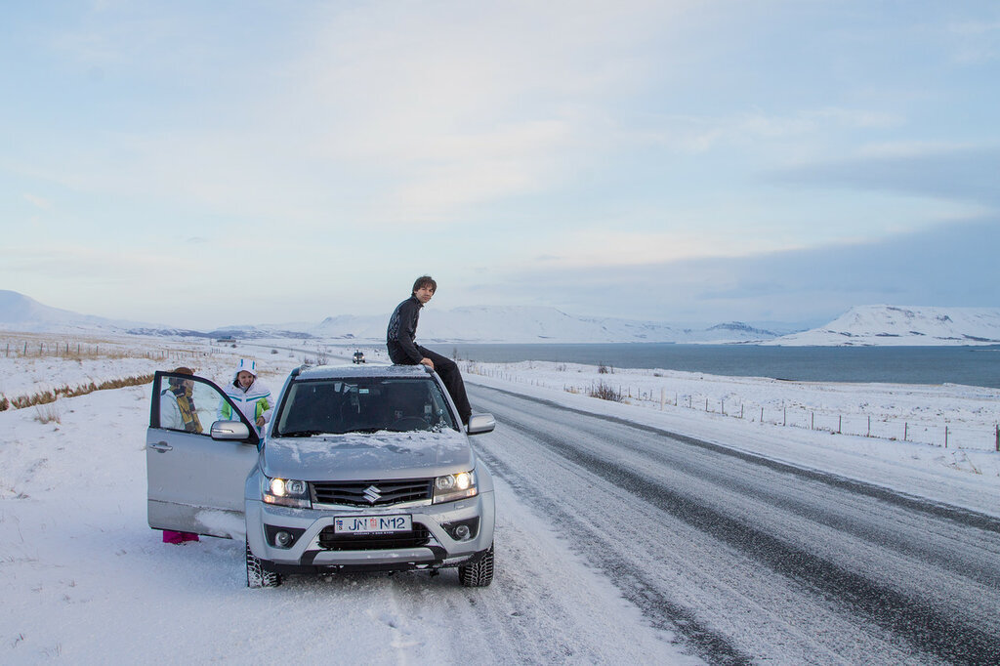](https://fotki.yandex.ru/next/users/klimentij511/album/464271/view/1236207?page=17)

Хостел мы решили "чтоб наверняка" забукать с утра, и поехать прямиком к нему, т.к. вечером нам нужно было сдать машинку в аэропорту. Выбор пал на СпортХостел - хостел, в котором мы попытались остановиться в первый же вечер в Исландии, но не смогли, т.к. здание было закрыто, а мужчина на том конце трубки явно недопонимал, чего мы от него хотим..Ну мы решили, что в этот раз точно все будет ОК, но как бы не так! Приехали опять-таки к пустым дверям, начали звонить - не отвечает...Когда наконец он взял трубку, пообещал приехать, переспросив, сколько нас и на сколько мы дней.. В момент, когда мы его увидели, мы поняли, что все это не со зла - он в самом деле не видел ничего страшного в том, что нам пришлось его ждать, ни в том, что один из номеров был не убран, ни то, что некоторые двери закрыты. Это свойственно всем исландцам! Я просто не представляю, как поселиться в этой стране в хостел без телефона и знания английского: ведь мы все делали правильно, и все равно каждый раз звонили и еще раз договаривались, что мы приедем, да, нас четверо, да, нам нужна кухня и т.д. и т.п. Сложно! Но спасибо Дашке и ее работодателю за то, что связь у нас была бесплатной, а то бюджет нашей поездки резко бы увеличился из-за связи в роуминге. С горем пополам заселившись в хороший, не смотря на все, хостел, мы поехали в аэропорт менять машинку. Изначально план был изучать Рейкъявик пешком, но потом мы решили снять малолитражку на оставшиеся полтора дня, чтобы облегчить себе трансфер до аэропорта в 5 утра, который с нашими сумками явно не был бы столь простым. [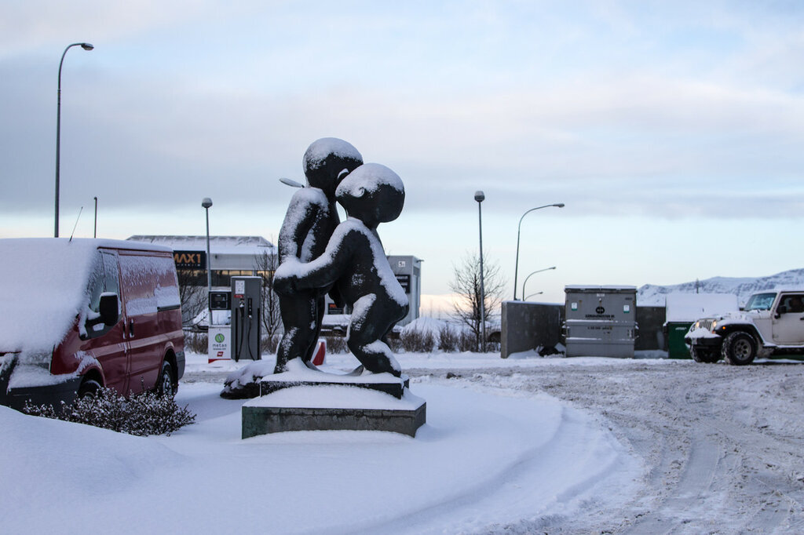](https://fotki.yandex.ru/next/users/klimentij511/album/464271/view/1236210?page=17)

В итоге мы ездим по городу на Вольксвагене Поло, 1.2. - после Сузуки непривычно абсолютно все, но зато она кушает невероятно мало - бортовой компьютер не показывает, но по ощущениям около 5 литров на сотню. После снятия машинки, мы заехали по дороге в Икею - не поверите, но цены здесь почти такие же, как в России. Целью нашего захода был ресторан Икеи, который хвалили в одном из блогов, за вкусную и относительно недорогую еду. Заодно приценились к любимому термосу - вот он в РФ точно стоит меньше. Затем была самая туристическая улица столицы Исландии Laugavegur - что-то вроде нашего Арбата: куча магазинчиков, 80% из которых были уже закрыты в 19.00. Прогулявшись немного, мы вернулись в хостел, чтобы посмотреть северное сияние, которое нам предсказывал в этот день владелец хостела, но небо было затянуто тучами, поэтому мы рухнули спать после длинного дня.

## День десятый. Рейкъявик.

Усталость от длительного путешествия с ежедневными прогонами по сотне км окончательно нас добила и не позволила оторвать головы от подушки раньше 10.30 утра. Да и потом был еще час валяния в постели. Оправдание было весомое - у Дашки День Рождения - мы поздравили подарком и тортиком, половину которого прикончили сразу за завтраком, а вторую оставили на ужин. [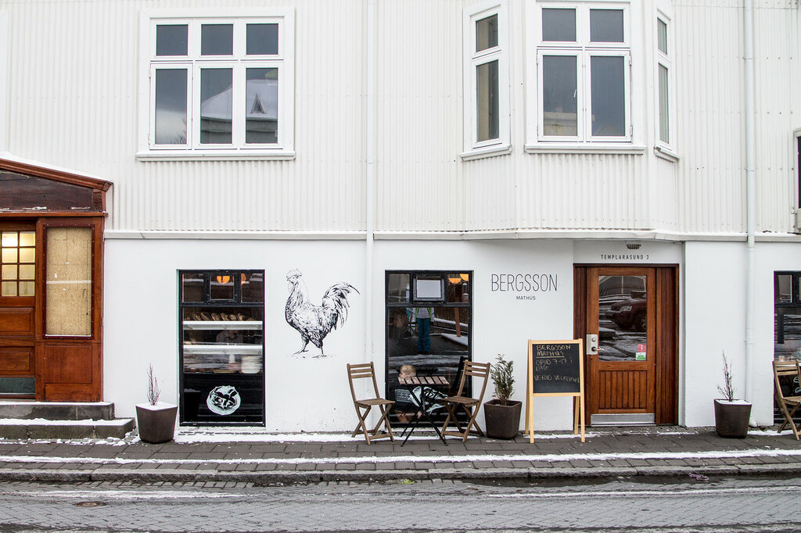](https://fotki.yandex.ru/next/users/klimentij511/album/464271/view/1236216?page=17)

Из культурных достопримечательностей мы посетили аж целый один музей - Национальный, который не произвел на нас супер-впечатления, но дал кое-какое представление о жизни исландцев [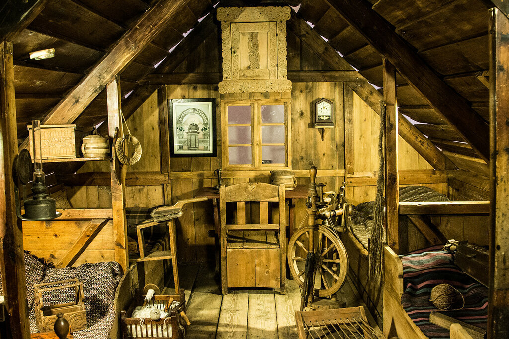](https://fotki.yandex.ru/next/users/klimentij511/album/464271/view/1236233?page=17)

[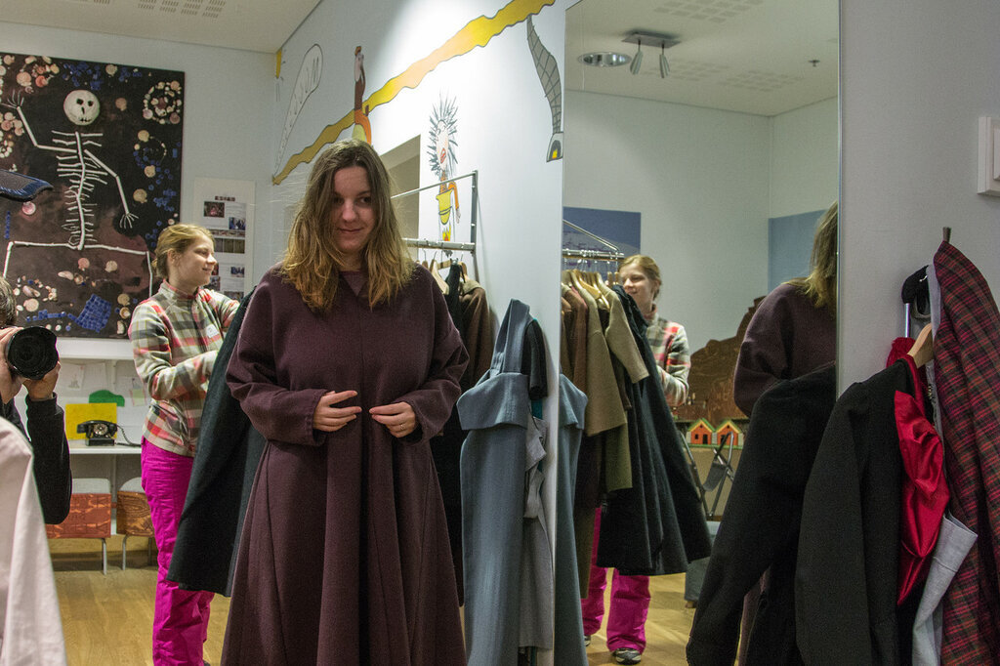](https://fotki.yandex.ru/next/users/klimentij511/album/464271/view/1236231?page=17)

Мы заглянули в информационный туристический центр, где я собрала полную коллекцию маленьких путеводителей по каждой части Исландии - передам потом кому-нибудь, кто соберется изучать эту страну (желающие могут сразу писать мне в личку или в комменты) [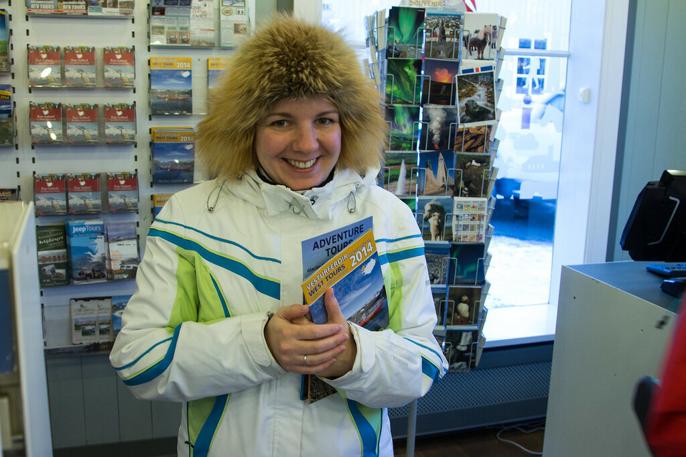](https://fotki.yandex.ru/next/users/klimentij511/album/464271/view/1236211?page=17)

Там же была попытка сделать VAT refund, но она провалилась из-за нежелания европейцев работать по выходным. Центр города можно точно обойти за день пешком, но т.к. главную улицу мы уже посмотрели, то стали обходить вокруг, пройдя мимо российского и индийского посольств, заглянув на старинное кладбище, а после музея пообедав в очень популярной по отзывам и крайне аутентичной кафешке [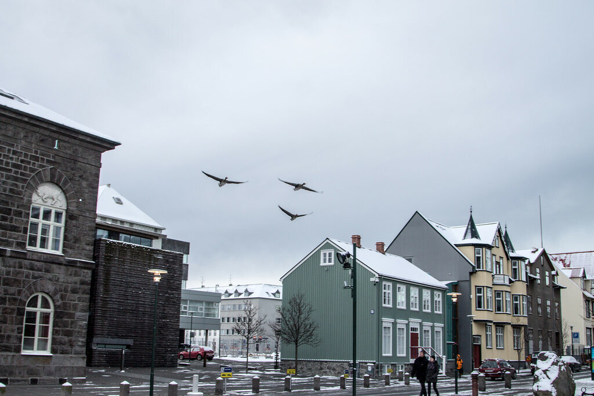](https://fotki.yandex.ru/next/users/klimentij511/album/464271/view/1236215?page=17)

И тут гуси вместо голубей [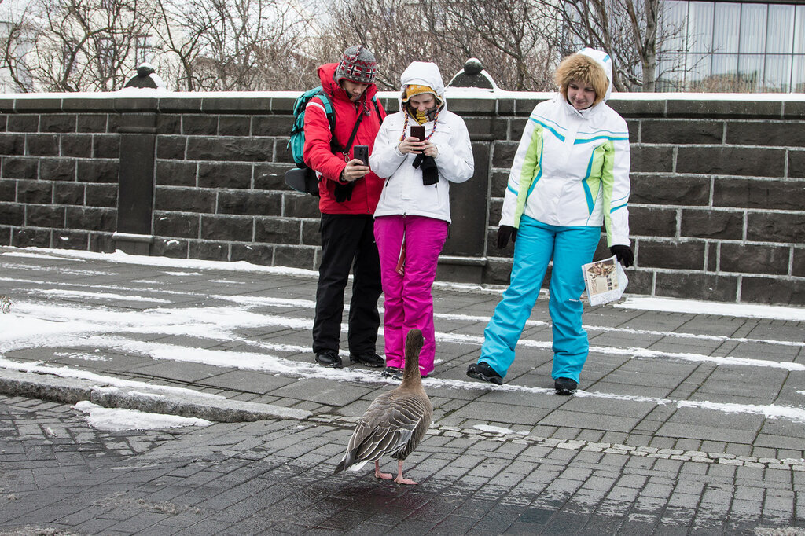](https://fotki.yandex.ru/next/users/klimentij511/album/464271/view/1236217?page=17)

Исландское кладбище [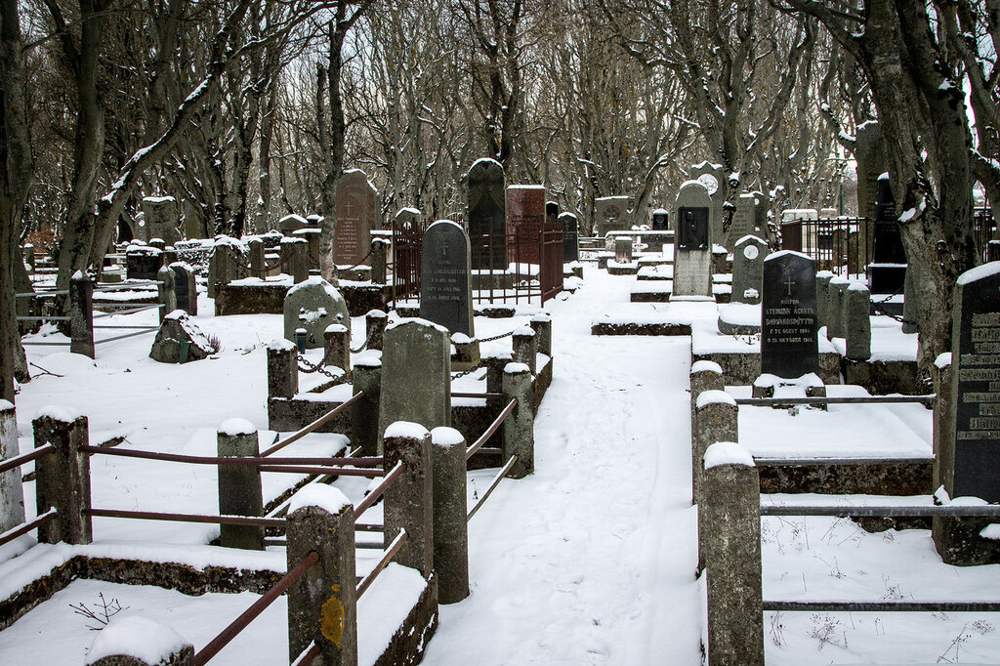](https://fotki.yandex.ru/next/users/klimentij511/album/464271/view/1236229?page=17)

Страна с одним из самых коротких мотосезонов [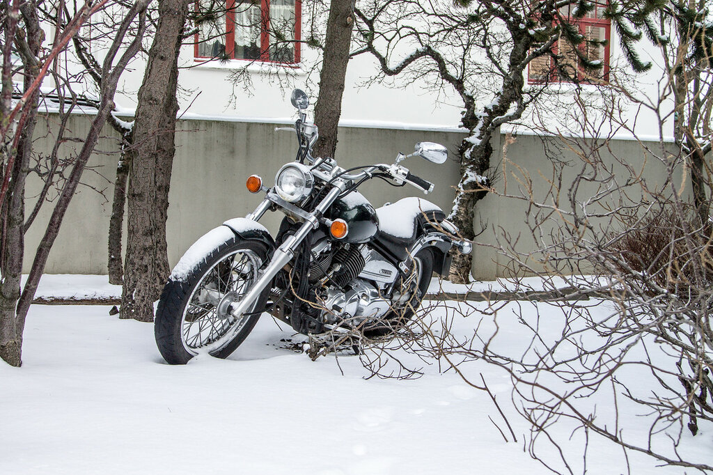](https://fotki.yandex.ru/next/users/klimentij511/album/464271/view/1236230?page=17)

Сегодня был праздник желудка - на завтрак вкуснейший торт, на обед - суп из лобстера и шашлычок из филе рыбы, а потом еще и стейк из кита, который Климентий категорично отказался есть под предлогом, что отдает печенью, а он ее терпеть не может ( можно дописать в длинный список из более, чем 100 пунктов того, что Клим не ест) [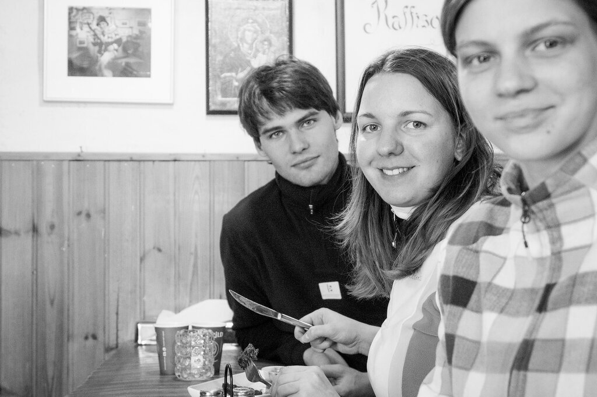](https://fotki.yandex.ru/next/users/klimentij511/album/464271/view/1236243?page=17)

Буду солидарна, мясо действительно очень странное - очень жирное, волокнистое и вкусом напоминает говяжью печень. Все удовольствие обошлось в 2500+900 = 3400 крон на двоих, что составляет около 1700 рублей на двоих. За такой набор блюд это дешево даже по московским меркам. В кафе познакомились с парой из Франции, которые приехали сюда специально, чтобы посмотреть северное сияние, но так ни разу его и не увидели. Они спрашивали, каково это - увидеть его, и мы пересказали историю самого первого вечера в Голубой Лагуне. Они сказали, что мы счастливчики, что не вызвало в нас никакого противостояния - это действительно так!

## Немного сухой статистики о нашей поездке в Исландию

Основные статьи затрат (в скобках указана общая сумма за 4х человек): 1) проживание в домике в Финляндии с 31.01 по 02.01 (11400 рублей), 2) ночевки в Исландии (72081 рублей) 3) аренда Сузуки Гранд Витара с 02.01 по 10.01 (39886 рублей) 4) аренда Фольксваген Поло с 10.01 по 12.01 (4982 рублей) 5) еда (18832 рублей) 6) бензин (32015 рублей) Напомню, что путь Москва-Хельсинки-Москва (около 2600 км туда-обратно) мы проделали на Рено Мегане с расходом 6,7 литров на сотню, заправлялись исключительно в РФ (около 36 рублей за литр). Пробег по Исландии на Сузуки Гранд Витара - 2173.6 км, расход 11,5 литров на сотню. Цена бензина - 95 рублей за литр. Пробег по Исландии на Фольксваген Поло - около 120 км, расход около 6 литров (не было датчика). **ИТОГО: На человека было потрачено 57862 рубля с 30.12 по 13.01.**

На картинке указан наш точный маршрут, красной линией - перелет из Кефлавика в Хельсинки [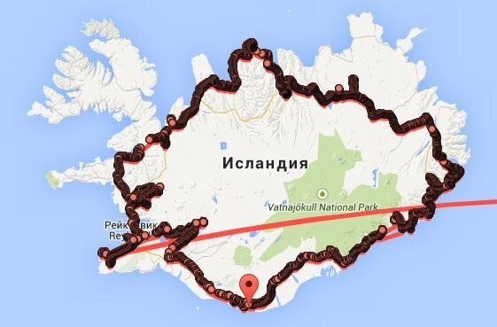](https://vodpop.ru/wp-content/uploads/2015/07/hW5x4fVzfek.jpg)

## Эпилог

Мы побывали в Исландии зимой, что делали до нас крайне немного человек (по сравнению с летом), объездили все запланированные точки и даже немного больше. Мы одевались в традиционные исландские одежды, а от частных переездов наш чемодан с вещами не выдержал и порвался в трех местах. Мы увидели самую потрясающую и удивительную природу, побывали в самых безлюдных местах этой страны, узнали многое о том, насколько ужасной может быть погода, климат и чем грозят природные катаклизмы которые каждой год происходят в Исландии. Мы первый раз в жизни управляли машинкой 4х4, топили ее в реке и в снегу, почти давили оленей, видели воронов размером с лисицу, гуляли по тысячелетнему льду и познакомились с самым настоящим гномом! Спасибо всем за то, что следили за нашим путешествием - нам было очень приятно читать ваши комментарии здесь и в личных сообщениях. До новых приключений!

Читайте другие статьи из цикла про зимнюю Исландию:

- [Исландия зимой. Часть 1. Лагуна, Гейзер и водопад Гульфосс](https://vodpop.ru/islandiya-zimoy-chast-1-laguna-geyzer-i-vodopad-gulfoss/)
- [Исландия зимой. Часть 2. Южная Исландия](https://vodpop.ru/islandiya-zimoy-chast-2-yuzhnaya-islandiya/)
- [Исландия зимой. Часть 3. Страна льдов](https://vodpop.ru/islandiya-zimoy-chast-3-strana-ldov/)
- [Исландия зимой. Часть 4. Самый север](https://vodpop.ru/islandiya-zimoy-chast-4-samyiy-sever/)
