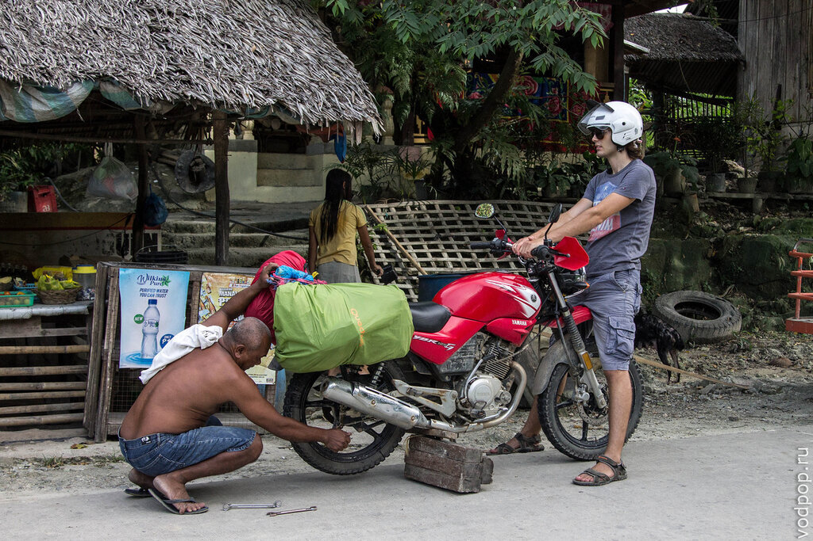
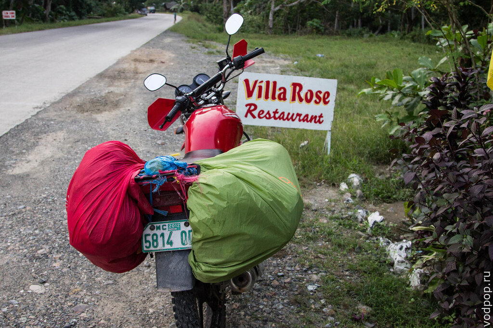
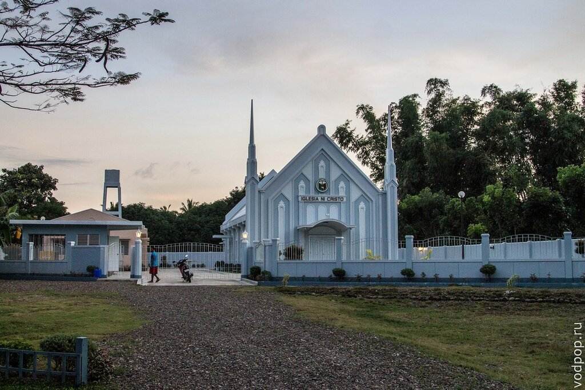
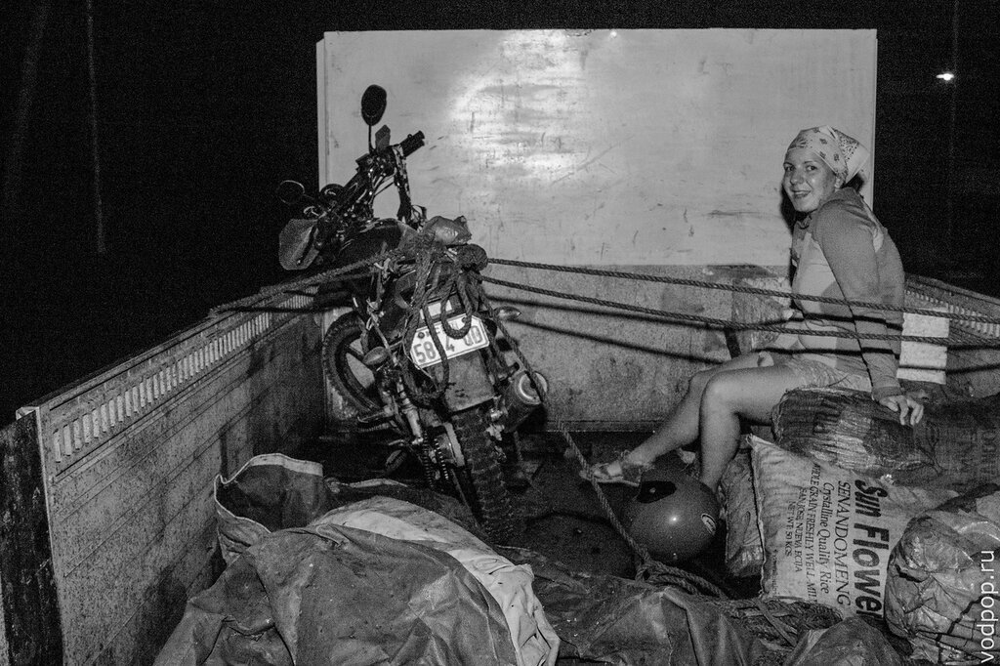
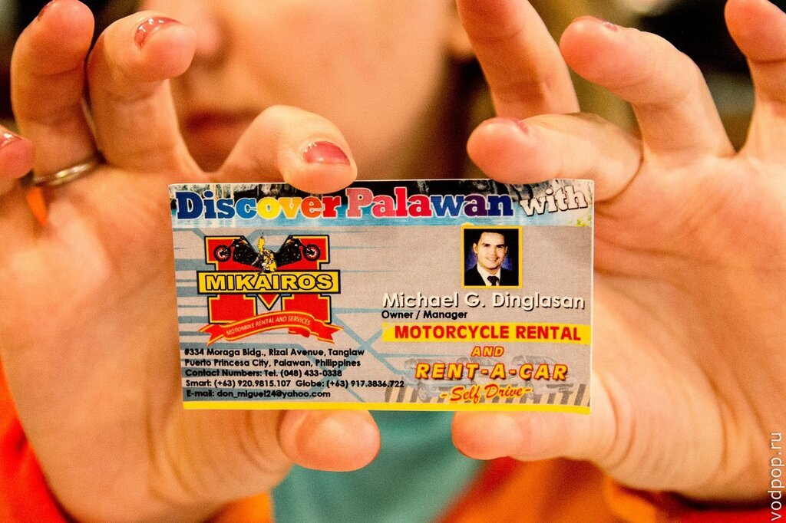
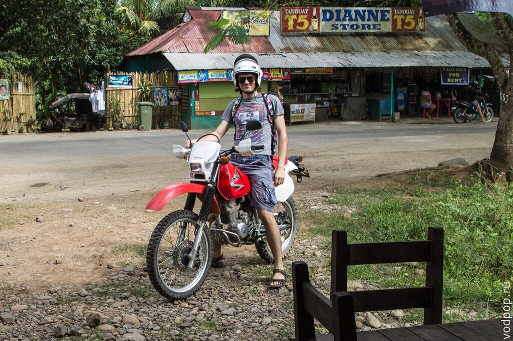
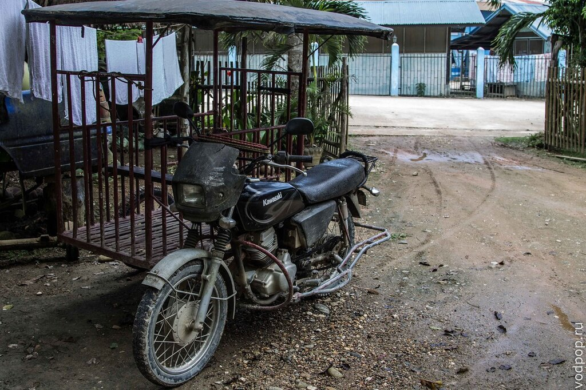

Несмотря на то, что нам очень понравилось в Тай Тай, уже настала пора возвращаться в Пуэрто-Принцесу. Казалось бы, что нового может принести дорога, по которой ты проехал уже несколько раз? Однако, сюрприз поджидал нас со стороны арендованного мотоцикла - Yamaha YBR 125.

<!--more-->

Проделав примерно половину пути из [Тай Тай](https://vodpop.ru/taj-taj-palavan/ "Неизведанный Палаван. Тай Тай") в Пуэрто-Принцесу, мы стали замечать странный звук, исходящий от нашего мотоцикла. Сначала подумали, что что-то случилось с цепью, и Клим решил ее подтянуть. Так как под рукой инструментов не было, то стали искать мото-сервис, который на Филиппинах обозначен табличкой Vucanization (Вулканизация). Остановились рядом с первой, которая попалась на пути.

Механик попался крайне молчаливый. Не то он не понимал по-английски, не то просто не хотел разговаривать. Мы от него услышали только "twenty", что значило, что за подтяжку цепи мы должны были заплатить 20 песо.

Но несмотря на это, стук возобновился через пару минут в дороге. Мы решили, что нас "пронесет" и даже остановились пообедать в полной уверенности, что на оставшиеся 60 километров мотоцикла точно хватит.

Сделали пару-тройку фотографий, и продолжили путь.

Темнота опускается на Филиппинах довольно рано, в 18.00. И как только последние лучи заката скрылись из зоны видимости, наш мотоцикл издал несколько хлопков, цепь слетела, и мы были вынуждены остановиться в ту же минуту.

Дальше все происходило довольно весело. Поняв, что мотоцикл сегодня больше никуда не поедет, мы стали думать, что же нам делать. Решили, что будем стопить грузовик или пикап, который довезет нас и нашего "коня" до Пуэрто-Принцесы.

Через 10 минут нам улыбнулась удача - остановился большущий грузовик с открытой задней частью. Первые попытки поднять вдвоем мотоцикл (я не участвовала), который вместе с нашими рюкзаками весил килограмм 150, не удались.  Водитель позвал несколько мужчин, которые сразу прибежали нам помогать. О деньгах разговора не шло, хотя водителю мы сразу сами сказали, что заплатим 500 песо.

Ямаху закрепили для устойчивости веревками, а сами мы, отказавшись от предложения водителя сесть внутрь, остались с мотоциклом в открытом кузове, на мешки с цементом.

Благополучно доехав до [Пуэрто-Принцесы](https://vodpop.ru/chem-zanatsa-v-puerto-princesse/ "Чем заняться в Пуэрто-Принцессе: Хонда Бэй, гостиницы и рестораны"), мы выяснили, что задняя втулка вместе с подшипником превратились практически в песок, а наша "своевременная" подтяжка цепи добила их окончательно. Зато теперь мы знаем, что на груженом двумя людьми и рюкзаками мотоцикле цепь следует не подтягивать, а наоборот, ослаблять.

Хозяин прокатной конторы через 10 минут пригнал нам новый байк на замену (у нас еще оставался один оплаченный день), но при возврате залога взял с нас 300 песо, которые составляли половину стоимости новых запчастей. Чеки он предъявил, поэтому никаких претензий с нашей стороны тоже не возникло - ведь это мы частично виноваты. Поэтому рекомендуем это место, так как хозяин адекватный, хорошо говорит по-английски, и не берет в залог паспорт (что является довольно популярной практикой в других конторах). Найти эту контору в Пуэрто Принцесе довольно просто: идете от аэропорта по левой стороне Rizal километра полтора, и этот прокат будет сразу перед Капитолием. Увидите вывеску с логотипом из визитки:

Нравится статья? Узнавайте первым о выходе новых интересных историй! Подпишитесь на нас по [эл. почте](http://feedburner.google.com/fb/a/mailverify?uri=vodpop&loc=ru_RU) или в [группе ВКонтаке](http://vk.com/vodpop)

###### Что нужно, чтобы удачно арендовать мотоцикл на Филиппинах:

1. Иметь при себе какой-нибудь не очень нужный документ. В нашем случае это была студенческая карта ISIC. Главное это наличие фотографии и ФИО на английском языке. А вот права категории А иметь не обязательно. Об этом ниже;
2. Иметь представление о том, сколько это в среднем стоит. Как правило, названная в первый раз цена, минус 30% - это и есть реальная стоимость. Лучше узнать в 2-3 местах, чтобы картина была более объективной. Мы снимали на 21 день за 6500 песо+2000 песо залог;
3. Берите то, что вам удобнее и привычнее. Если до этого вы ездили только на скутерах, а хотите арендовать мотоцикл, то советуем хотя бы денек покататься по городу, чтобы оценить свои возможности;
4. Не оставляйте в залог свой паспорт! По крайней мере настоящий. Шучу. Просто не все филиппинцы одинаково хорошие, да и мало ли, что может случиться с мотоциклом. Лучше не рисковать;
5. Сумма залога является "страховкой от угона". Если ваш байк угонят на острове, то хозяин платит 2000 песо, чтобы местная полиция его нашла. Но, если с мотоциклом что-то случается (как в нашем случае), то нанесенный владельцу ущерб вычитается из этой суммы. Если вы боитесь, что за ваш счет будут ремонтировать старые повреждения, то не поленитесь, и сделайте несколько фотографий до того, как арендуете мотоцикл;
6. Тщательно проверьте работоспособность всех агрегатов. Послушайте двигатель - нет ли каких-то шумов, стуков? Если с двигателем все ок, открутите крышку бензобака и убедитесь, что вы сможете это проделать на бензозаправке (иногда заедает). Далее кикстартер и тормоза - самые полезные функции мотоцикла. Затем подергайте за самые критичные зоны - ручки и зеркала. В 70% случаев что-то из этого отломано/отклеено/оттопыривается. Нужно попросить прикрутить все как положено прямо при вас;
7. Не поленитесь посмотреть на спидометр и одометр, потому что они также любят быть в нерабочем состоянии. Проверьте фары (ближний и дальний свет) и задние габариты, поворотники;
8. Прокатитесь пару кружков, разгон-тормоз-разгон.. В целом, большую часть проблем легко заметить при первых 10 минутах эксплуатации. Но некоторые скрытые дефекты выползают не сразу;
9. Если собираетесь в длительное путешествие, купите смазку для цепи. Стоит копейки, продается на каждой бензоколонке. Цепь на Филиппинах нужно смазывать каждые 100 км;
10. Шлемы обязательны для вашей же безопасности. В арендных пунктах они весьма потрепанного вида. Не поленитесь померить и особенно тщательно убедиться, что царапинки на лицевом щитке (линзе, стекле) не мешают вам хорошо видеть дорогу. Особенно критично для шлема водителя. Если видно плохо, просите заменить (дело 5 минут).

Может показаться, что это больше похоже на инквизицию, а не на выбор мотоцикла. Но даже не думайте жалеть прокатчиков! Это их работа, а ваше дело - заботиться о своей безопасности. Тут не грех немного переусердствовать.

Процесс выбора мотоцикла может затянуться, особенно если повторить все пункты в каждой конторе. Поэтому, советуем сначала определиться с пунктом проката, а потом уже затевать все остальное.

А перед этим постарайтесь решить, какой  двухколесный друг вам больше подходит.

###### Мотоциклы на Филиппинах:

- классика - Yamaha YBR-125 и его китайские аналоги. Самый комфортный для длительного путешествия (круизеров на Палаване мы на нашли); 
- эндуро - Honda XR - Клим снимал его на один день. Сверхпроходимый Зверь, но жесткий, для двух людей совсем не подходит - сидеть некомфортно даже одному; 
- скутер - много всяких, в основном китайских. Хотя Yamaha и Honda тоже присутствуют. Удобен и прост в управлении, но проходимость куда меньше;
- полуавтомат - представлен в основном Honda XRM, которые производятся  и продаются только на Филиппинах. Очень популярная модель, но мы не пробовали.

А вот на таких "конях" ездит местное население. Умещается 5-6 человек - целая семья!

###### Как арендовать мотоцикл на Филиппинах без прав

Мы ездим без водительского удостоверения, а точнее без открытой категории А. В том числе и в России. Правда, в РФ только по проселочным дорогам, на шоссе изредка, только в случае крайней необходимости. Все-таки придется расставаться с уже имеющимися правами на категорию В.

На Филиппинах все намного проще. Полицейских мы вообще видели только один раз в Пуэрто-Принцесе, но нас они не остановили. К "белым" на Филиппинах относятся вообще с большим уважением и стараются лишний раз не беспокоить.

Самая распространенная схема аренды байка на Филиппинах, когда ты якобы (повторюсь, ЯКОБЫ) оставляешь свое водительское удостоверение в пункте проката.

В случае, если вас остановит полицейский, вы ему протягиваете документы на мотоцикл (всегда берите их с собой!), справку об аренде (где отмечено, что у вас взято в залог вод.удостоверение) и визитку своего пункта проката.

Если у полицейского будут еще какие-то вопросы, то он сам позвонит по указанному телефону на визитке в пункт проката, и спросит хозяина, действительно ли у вас есть права на байк. Хозяин всегда отвечает "да", и на этом вы с полицейским расстанетесь с миром.

###### Что нужно взять с собой в длительное мото-путешествие на Филиппинах:

- полный бак бензина. Иногда заправок подолгу нет, или они закрыты;
- смазку для цепи;
- шлемы;
- дождевики (погода тут меняется очень быстро);
- солнцезащитные очки;
- бутылку воды (на жаре организм быстро теряет воду);
- солнцезащитный крем (обгорают ноги и руки);
- немного денег (мы, напомню, заплатили 500 песо за эвакуацию до Пуэрто-Принцесы)

Надеюсь, наши советы помогут вам арендовать мотоцикл на Филиппинах без каких-либо проблем!
