Эль Нидо на Филиппинах - одно из самых популярных мест среди иностранных туристов. И не зря, ведь это райское место, которое находится в северной части острова Палаван, может подарить вам не только пару потрясающих снимков, но и яркие впечатления на всю жизнь. Мы  объясним, как добраться до Эль Нидо и найти здесь дешевое жилье.

<!--more-->

Эль Нидо (El Nido) стал нашей следующей целью после Сан Висенте, в котором мы остановились аж на целую неделю, и никак не хотели уезжать. Естественно, именно в тот день, когда мы наконец-то собрались с духом, собрали вещи, привязали их к мотоциклу - пошел дождь. Нам повезло, что застали мы его уже после того, как съехали с грунтовой дороги на Северное шоссе.

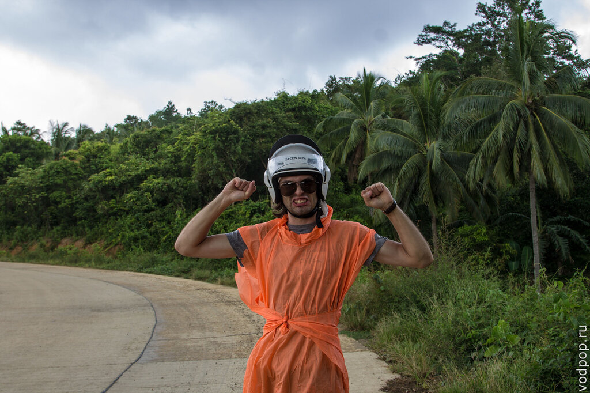

Большую часть пути мы проделали довольно быстро. Но примерно километров за 60 асфальт резко закончился и началась вот такая грунтовая дорога, на которой мы тряслись до самого Эль Нидо.

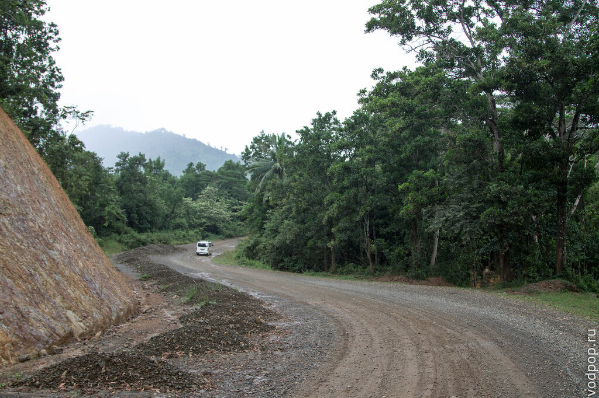

В дождик грязь, смешанная с песком и гравием, дает довольно неприятный эффект: периодически нас заносило. Но без последствий. Из автомобилей лучшей проходимостью и комфортом обладают минивены. По крайней мере внешне их трясло меньше, чем другие виды транспорта. Пассажирам джипни остается только посочувствовать.

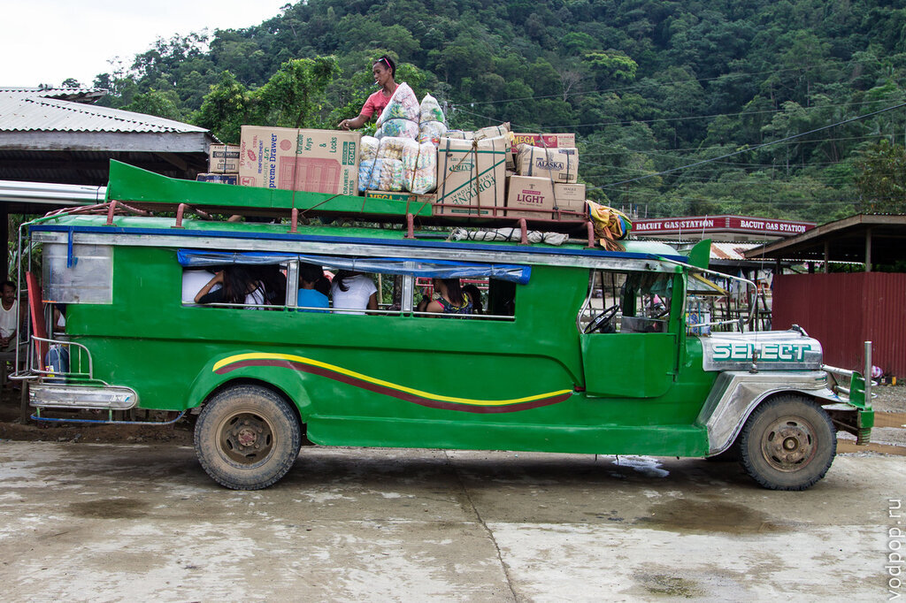

Мы пытались заранее найти жилье на agoda.ru , но потом решили, что на месте в низкий сезон сможем договориться на меньшую цену, и не ошиблись. Хотя мы жили не в самом Эль Нидо, где нам показалось слишком шумно и людно, а в городке Корон-Корон (Corong Corong), который находится на 5 километров южнее, не доезжая Эль Нидо.

Способ поиска жилья в целом на Филиппинах довольно прост. Мы ехали по дороге, и останавливались лишь в тех местах, где внешне нам понравилось.

Первым местом стали Dream Cottages: несколько бунгало, прямо на берегу моря, с песчаным пляжиком. Мы сторговались до 500 песо, а зайдя в дом, были несколько разочарованы спартанской обстановкой внутри.  Можете даже не пытаться искать эти коттеджи в интернете - их просто нет. Даже информационной странички на популярном в здешних краях Facebook: ни-че-го!

Но мы решили не сдаваться и заехали в еще пару мест, пока не увидели на дороге растяжку Greenviews Resort. В памяти всплыл отзыв девушки, с которой мы вместе ездили на [острова в Сан Висенте](https://vodpop.ru/samye-krasivye-ostrova-filippin/ "Сан Висенте. Самые красивые острова Филиппин") - она останавливались в этом месте год назад и порекомендовала его с положительной стороны. Нас почти все устроило, кроме той самой пресловутой цены. Мы сошлись на 700 песо: нас окончательно уговорили это сделать наличие wi-fi на территории и прекрасный вид с собственного пляжа.

За заборчиком находится веранда, где мы обычно устраивали себе рабочее место.

Четвероногие сторожи ни разу не гавкнули. В основном валялись около входа и своими пушистыми хвостами перекрывали путь.

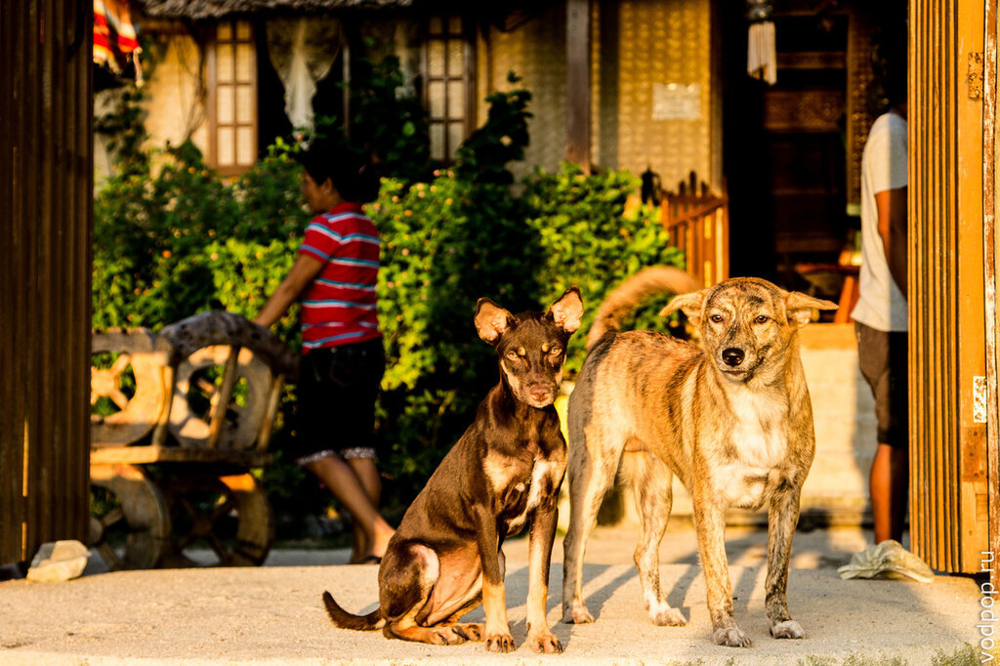

О, эти виды!

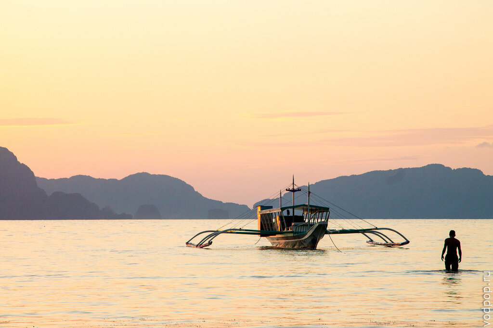

Хотя пляжи вдоль берега в Эль Нидо и Корон Корон не предназначены для купания (мелко, много водорослей и лодки кругом), виды менее прекрасными от этого не становятся.

Закаты радовали и холодными, и теплыми цветами. Вдохновение природой!

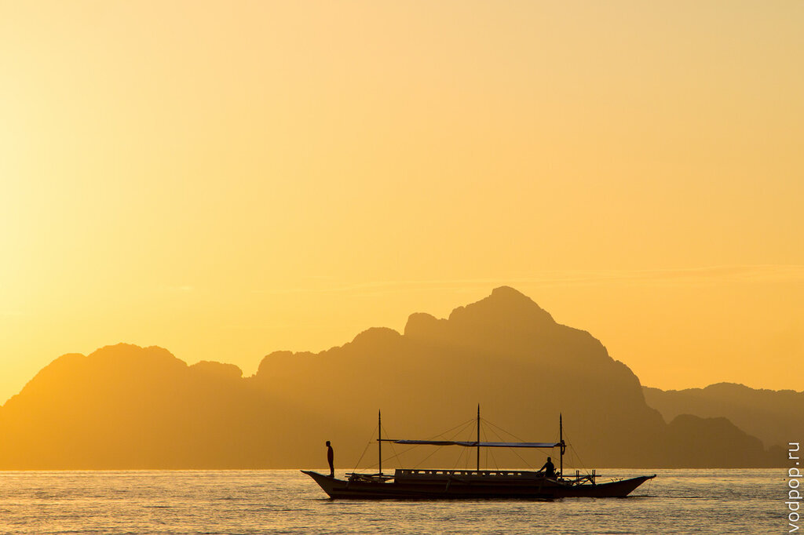

Нравится статья? Узнавайте первым о выходе новых интересных историй! Подпишитесь на нас по [эл. почте](http://feedburner.google.com/fb/a/mailverify?uri=vodpop&loc=ru_RU) или в [группе ВКонтакте](http://vk.com/vodpop)

К реальности нас возвращали наши естественные потребности в виде еды, за которой приходилось буквально охотиться. В ресторане нашего резорта было дороговато по местным меркам (около 120 рублей горячее блюдо + 20 рублей кофе или чай), поэтому мы пытались найти что-то еще.

Попытки привели нас сначала в ужасный рыбный ресторан Pescardal Seafood, где наш заказ приняли с третьей попытки, готовили час и официантка была настолько деревянной, что мы даже не стали делать ей замечание.

От местных столовых Климентий воротил нос: порк адобо уже надоел, а разнообразием филиппинское меню на отличается. Поэтому мы поехали в самое популярное кафе в Эль Нидо - Арт Кафе (Art Cafe), где скорость подачи заказа почти на европейском уровне. Никаких сорокаминутных или часовых ожиданий.

В принципе, можно покупать еду на рынке и просить готовить за небольшую плату в любой столовой. Рынок находится на автобусной станции Corong Corong Market Terminal.

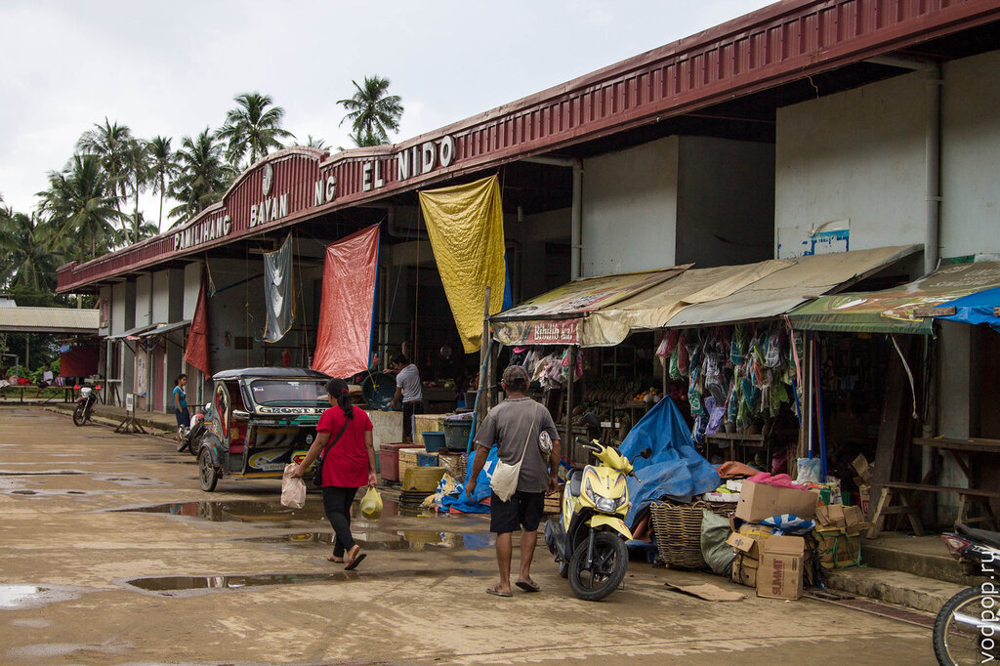

Тут можно недорого купить лобстера.

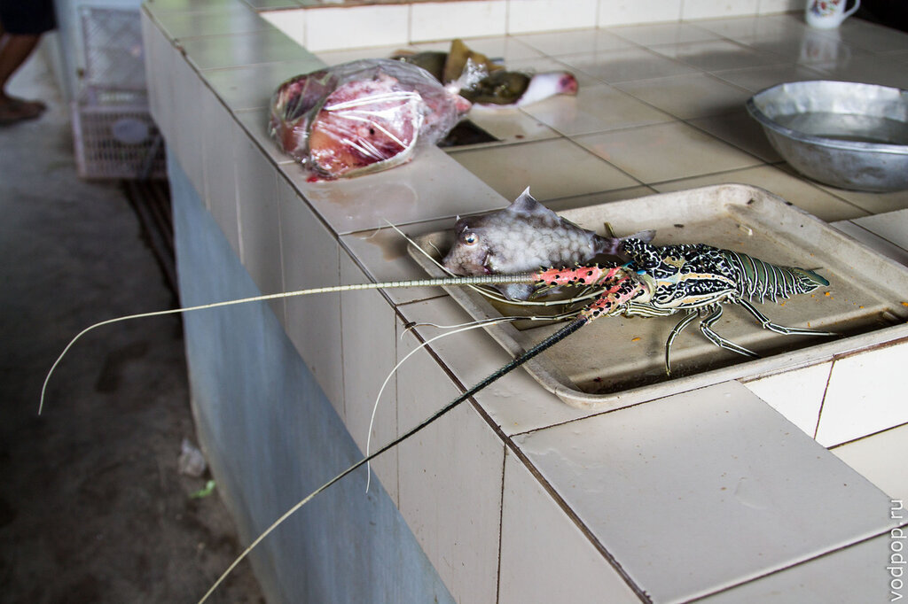

Креветки

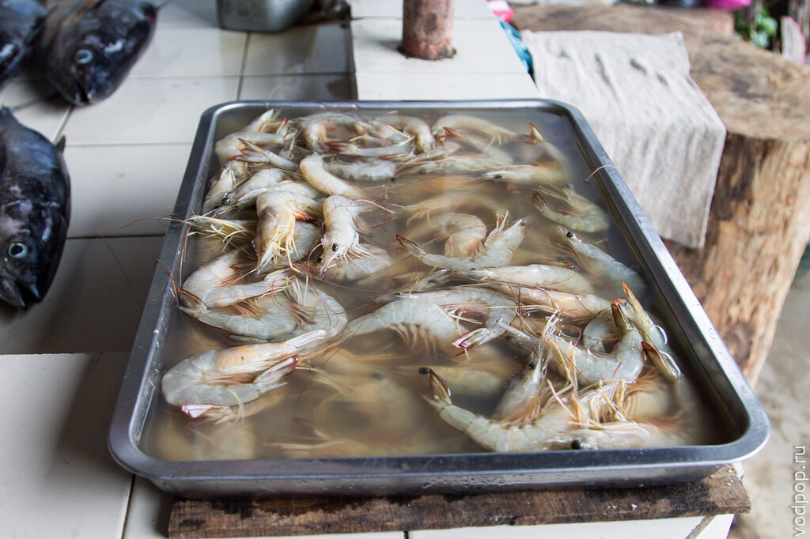

И даже скатов. Я до этого не знала, что их, оказывается, едят.

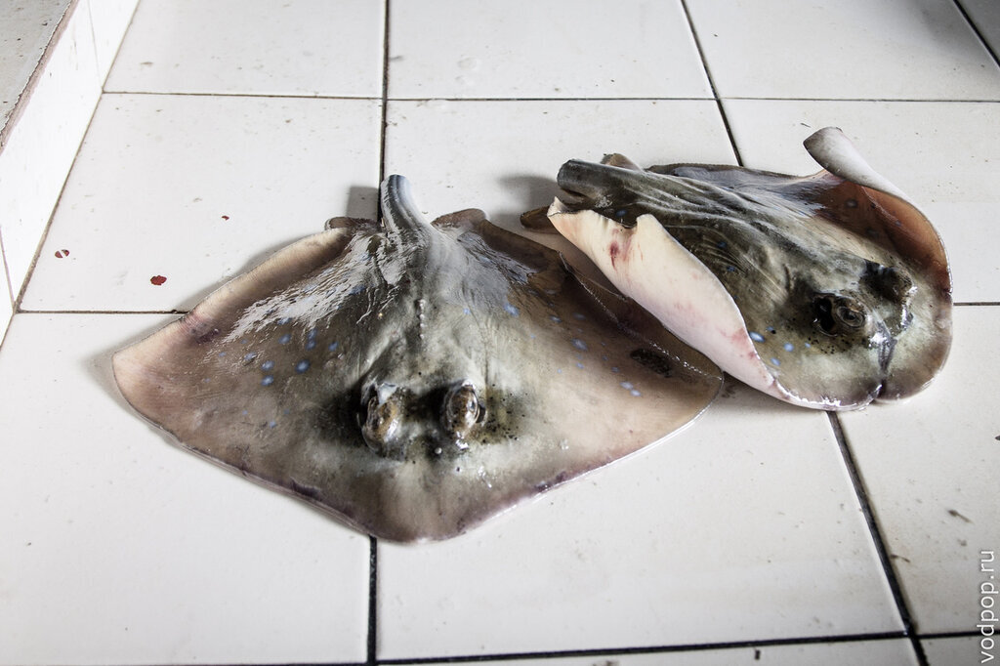

Запах на рынке тот еще, поэтому я залетела с фотоаппаратом, и сразу же вылетела. Однако, продавцы явно не замечают этого запаха, а заодно еще и добавляют в общее впечатление клубы сигаретного дыма.

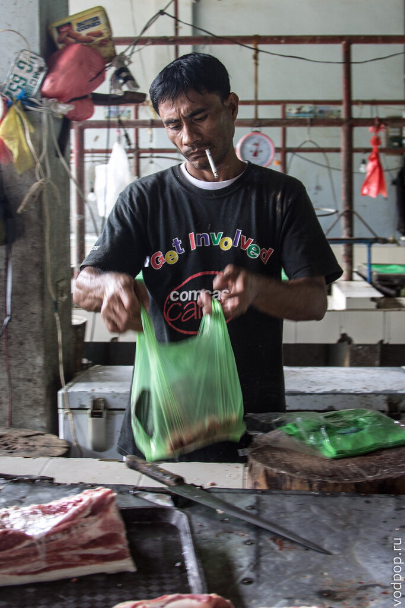

Чуть дальше стоят палатки с овощами и фруктами. Тут запахи более радостные. Хотя тапки с ананасами вместе продают только в этой стране.

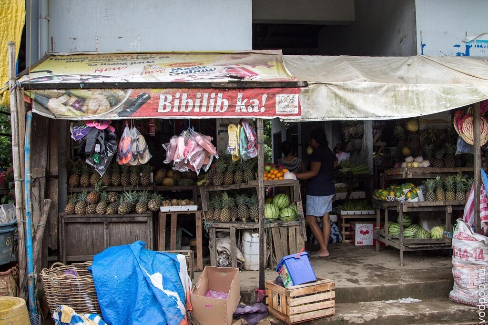

Еще одна забота в Эль Нидо - это заправка. Бензин тут стоит на 10-15 песо дороже, чем на остальной части острова. Наш байк кушал бензин Unleaded.

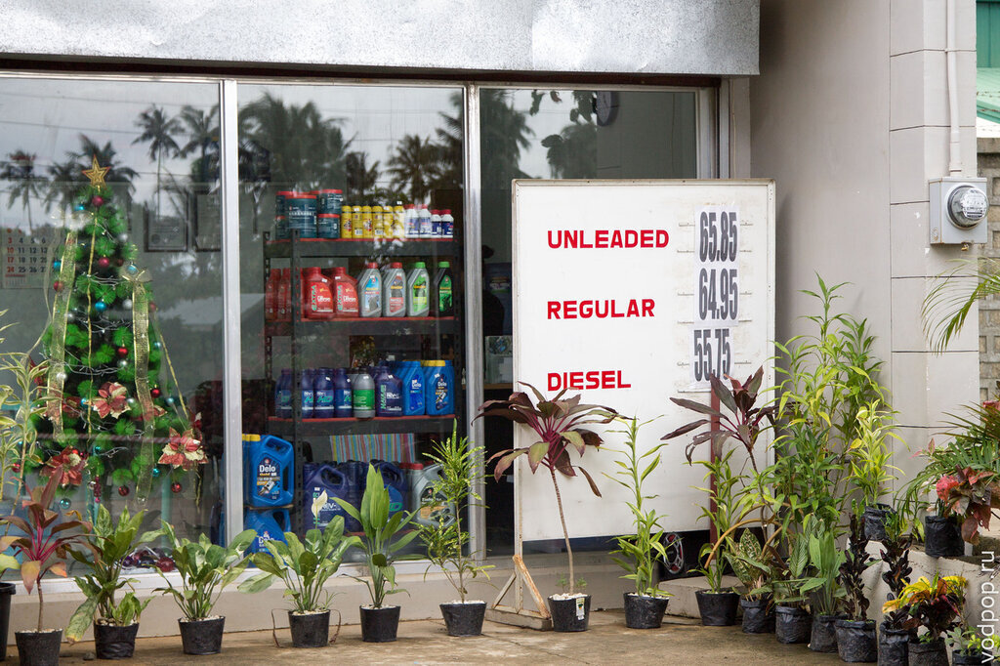

Заправщик в стеснении отводит глаза. Не только нам себя обезьянами в зоопарке чувствовать (это я про реакцию на белых людей на Филиппинах)!

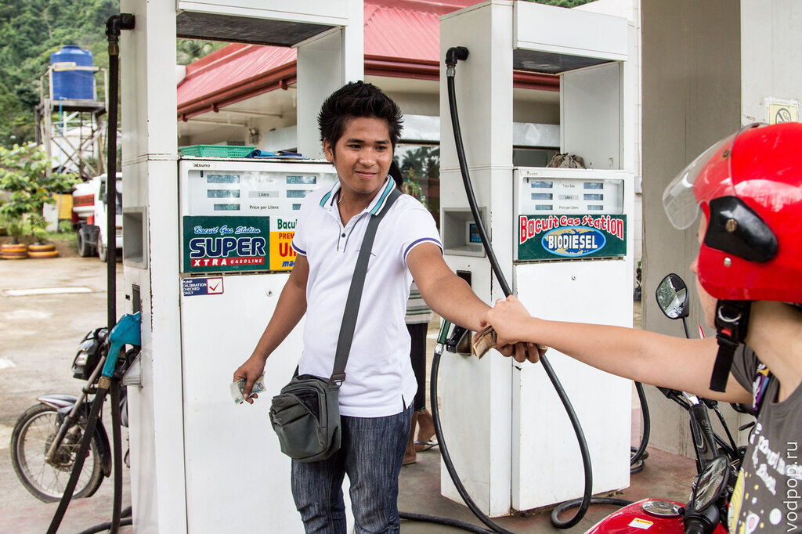

###### Как добраться до Эль Нидо

- спросить трансфер в вашем отеле в Пуэрто-Принцессе.
- автобусом с терминала Сан Хосе (San Jose) в Пуэрто-Принцессе. Автобусы ходят с 4.00 (утра) до 18.00 (прибытие днем или поздним вечером), а также с 22.00 до 24.00 - эти автобусы ночные, в них вы можете поспать, так как они прибывают в Эль Нидо около 6-10 утра. Путь займет 6-7 часов.
- минивеном.

<table><tbody><tr><td>Маршрут</td><td>Время отправления</td><td>Компания</td><td>Контакты</td></tr><tr><td>Пуэрто-Принцесса-Эль Нидо (600 песо)</td><td>7:00/ 11:00/ 13:30</td><td>Fortwally</td><td>0917-2762875</td></tr><tr><td></td><td>5:30/7:00/10:00/13:00:00/18:00</td><td>Eulen Joy</td><td>0926-6998700</td></tr><tr><td></td><td>5:30/8:00/9:30/11:00/14:00/17:00</td><td>Lexus</td><td>0917-5859612</td></tr><tr><td>Эль Нидо - Пуэрто-Принцесса</td><td>5:00/ 7:00 /9:00/ 11:00</td><td>Fortwally</td><td>0917-3488078</td></tr><tr><td></td><td>5:00/7:00/9:00/10:30/13:00/18:00</td><td>Eulen Joy</td><td>0949-4498858</td></tr><tr><td>Эль Нидо - Сабанг (пирс) (900 песо)</td><td>5:30/ 10:00</td><td>Lexus</td><td>0917-5859612</td></tr><tr><td>Сабанг (пирс) - Эль Нидо</td><td>7:30/14:00</td><td>Lexus</td><td>0917-5859602</td></tr></tbody></table>

- самолетом. Актуальную информацию о перелетах можно узнать в Арт Кафе
    - Манила - Эль-Нидо : ежедневный рейс компании [ITI](http://www.elnidopalawan.com/go.html#iti) - 7:30/ 11:00/ 15:00
    - Эль-Нидо-Манила  : ежедневный рейс компании  [ITI](http://www.elnidopalawan.com/go.html#iti) - 9:30/ 13:00/ 17:00
    - Манила - Пуэрто-Принцесса: ежедневные рейсы компаний [PAL](http://www.flypalexpress.com/), [Air Philippines](http://www1.philippineairlines.com/), [Cebu Pacific](https://www.cebupacificair.com/Pages/default.aspx) . Нужно заходить на сайты и проверять, потому что периодически компании то открывают, то закрывают это направление

 

###### Полезная информация об Эль Нидо

- в Эль Нидо нет электричества с 6.00 до 14.00 (иногда и дольше). Если вам критично - ищите гостиницу с генератором
- интернет в Эль Нидо очень медленный. В низкий сезон хорошо работал 3G в ранние и поздние часы, когда все еще(уже) спали. Что творится в высокий сезон - грустно представить.
- в самом Эль Нидо нет купабельных пляжей. Только на островах, ради которых все сюда и едут ( об этом в следующих статьях)
- тур А, B, C, D - самые популярные маршруты по островам и  лагунам вокруг Эль Нидо. Продаются на каждом шагу
- банкоматов в Эль Нидо нет. Вернее, есть, но они не принимают международные карты Visa и Master Card, только местные. Поэтому либо запасайтесь заранее, либо готовьтесь обналичивать под высокий процент -от 5 до 10. Поспрашивайте на заправках и в Арт Кафе.
- платежей карточкой почти нет. Наша гостиница принимала платеж за проживание, но только с комиссией 5%
- в самом Эль Нидо делать нечего. Можно прогуляться 1-2 вечера, зайти в кафешки, потанцевать в клубах. А что делать потом, мы так  и не поняли (но вы можете поделиться своим мнением в комментариях)
- цены на все чуть-чуть выше, чем на остальной части острова - еда, одежда, жилье, бензин, аренда байка

Эль Нидо на карте

Если у вас появились вопросы, не стесняйтесь, пишите в комментариях - мы обязательно вам ответим!
