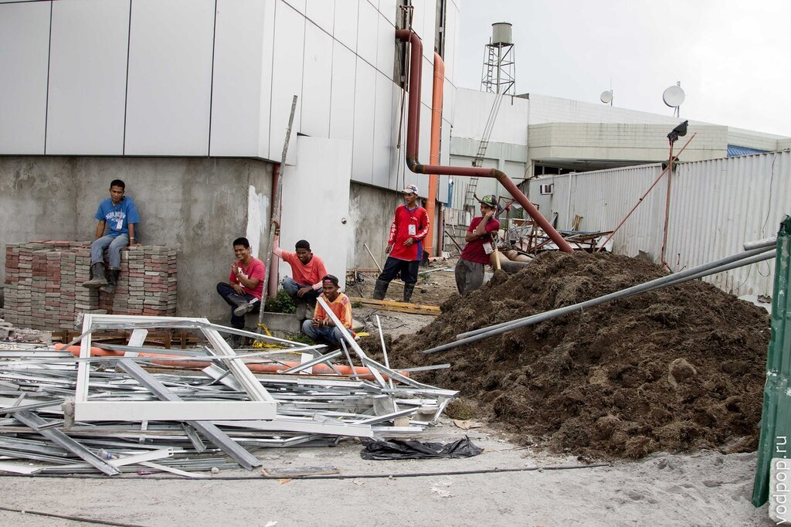
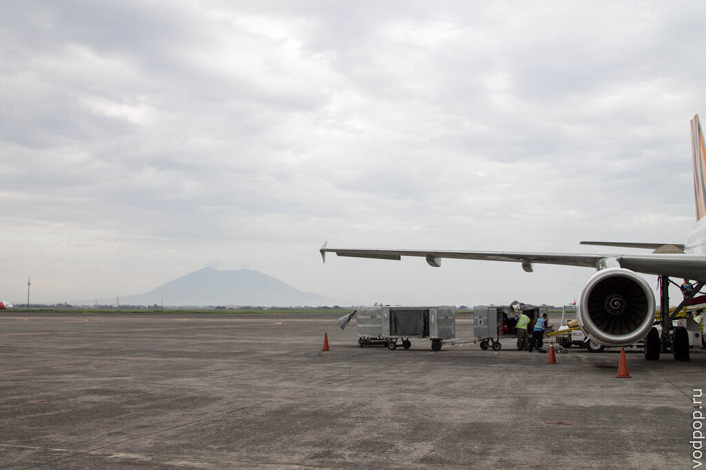

После месяца, проведенного в Бангкоке перед нами встал вопрос - продлевать визу в Лаосе, Мьянме или Куала-Лумпуре. Однако мы вдруг загорелись идеей посетить Филиппины, куда можно купить довольно дешевые билеты из столицы Таиланда до аэропорта Кларк в Маниле.

<!--more-->

Первое впечатление от Филиппин - "наконец-то нормальная еда!". Без жутко острых соусов, перца чили и моря специй. Обычная европейская пресная пища пришлась нам по душе после месяца тайской "диеты".

Еду мы купили в кафе Airasia, которое находится прямо напротив выхода из аэропорта Кларк (Clark), расположенного неподалеку от города Анхелес. На местном языке ("тагальском" или еще один вариант "таглише") город носит гордое название  Lungsod ng Angeles и слывет столицей секс-туризма на Филиппинах.

Обычно в этом городе останавливаются пассажиры стыковочных рейсов, поэтому можно найти гостиницы с почасовой оплатой - это дешевле, чем брать номер на сутки, но можно поспать и принять душ за 500-700 песо.

Аэропорт Кларка представляет собой небольшое помещение, в котором находится багажная лента и несколько стоек с информацией. Здесь же есть несколько обменников, которые предлагают весьма выгодный курс.

Забавно выглядит момент высадки пассажиров - стюарты открывают оба выхода и толпа вываливается на летное поле, после чего самостоятельно идет до здания аэропорта. Никаких тебе новомодных автобусов или хотя бы провожатого - мы просто шли за толпой местных и не ошиблись.

Повсюду идет ремонт. Филиппины - развивающаяся страна, расположенная более чем на 7100 островах, и ремонт здесь - весьма привычное явление. Минимум автоматики, максимум дешевой рабочей силы.

Средняя заработная плата в месяц составляет 10-15 тысяч песо, что, даже учитывая местные цены, маловато. Если у тебя нет семьи, то все относительно просто, но если в семье есть дети, то нужно как минимум платить за их образование и медицинское обслуживание. А если детей несколько? Словом, вся атрибутика бедной азиатской страны присутствует. Многие могут возмутиться, что и в России живется местами не лучше. Поверьте, мы живем лучше! Намного лучше!

А я тем временем вернусь ближе к теме.

Не забудьте оглянуться назад на летном поле, чтобы увидеть потухший вулкан Араят высотой 1026 метров. Если вы собираетесь поехать из Кларка в столицу Филиппин - Манилу, то сможете рассмотреть его поближе. 

У автобусов из Кларка в Манилу довольно странное расписание. Последний дневной автобус отправляется в 17.00. Билет можно купить внутри аэропорта рядом с огромной табличкой "Ticket Manila" за 450 песо с человека+весь багаж включен. Мы были единственными пассажирами этого 40-местного комфортного, особенно в сравнении с сидениями самолета, автобуса, в котором так люто работал кондиционер, что на подъезде к Маниле мы уже сидели, завернувшись в плед.

Следующий автобус, как нам радостно сообщили работники аэропорта, только в полночь. Поэтому старайтесь подгадать время прилета, чтобы не сидеть в аэропорту до полуночи. Хотя это не всегда возможно, так как бюджетные авиалинии постоянно откладывают рейсы на полчаса-час.

Кстати, как альтернатива автобусу - можно взять такси. Однако это далеко не бюджетный вариант - 3500 песо за 90 км явно дороговато. Можно доехать до Анхелеса и попытаться сторговаться там за 2700-3000 песо. За меньшие деньги, понимающие безвыходность вашей ситуации филиппинцы, просто не поедут. Хотя торговаться они любят, и готовы скидывать до 50% от первоначально названной цены.

Кстати, из Бангкока в Кларк мы летели Tiger Airways. Довольно неплохая компания с жутко неудобными креслами. Зато дешево. На борту всем выдают декларации, которые можно заполнить от балды - пограничники едва скользят по ней взглядом, ставят штамп (для русских он действителен 30 дней, можно продлить до 59) и иногда проверяют обратный билет. Если хотите задержаться на Филиппинах подольше, то можно сделать фейковый, например, компании  AirAsia.

Кстати, о ней. Ходят слухи, что если лететь самолетом AirAsia, то компания предоставляет трансфер до Манилы. На каких условиях, увы, не знаю, но было бы интересно послушать осведомленных  - для будущих поездок.

Когда мы планировали путешествие на Филиппинах, мы решили, что переночуем в Маниле, познакомимся с городом и через день-два полетим в Пуэрто-Принцессу (хотя правильно будет Пуэрто-Принцеса! Да-да, с одной буквой "с"!). Однако все сложилось совсем иначе.

Во-первых, рассчитывайте на дооолгий путь из Кларка в Манилу. Ехать всего-ничего - 90 км, но дичайшие пробки в Маниле позволили нам преодолеть это расстояние за 4,5 часа. Мы были порядком уставшие, когда автобус наконец-то довез нас до автовокзала Пасай Сити (Pasay City).

Если хотите сократить время в пути, то могу посоветовать выйти на первой же станции метро и проехать до Пасай Сити без пробок. Только крепче держите сумки и следите за карманами - Манила считается одним из самых опасных и криминальных городов Азии.

Если вы едете в аэропорт Манилы -  Ниной Акуино (Manila Ninoy Aquino International Airport), то лучше всего прямо от Пасай Сити взять такси, которое нам обошлось в 160 песо. Не забывайте про счетчик - на Филиппинах без него таксистам ездить запрещено, если отказываются - грозите полицией.

Изначально мы собирались переночевать в одной из гостиниц\-Winston Motel,  рядом со станцией, но суровая реальность обрушилась на нас в виде 15-сантиметрового паука, бегающего со скоростью Усейна Болта. После 20 минут попыток избавиться от паука, мы-таки придавили бедолагу подушкой.

Хотя пока его мохнатое тело бегало по нашей кровати, бедолагой его назвать было сложно - мохнатые лапы и огромное туловище заставляли вспомнить про тарантулов, коих в избытке в этой части Азии.  Мы вызывали на подмогу администратора, который без спешки пришел через 15 минут, когда грязное дело было сделано.

Быстро собрав вещи мы решили, что на ночь в этом подозрительном месте не останемся (помимо паука сам мотель производил впечатление места для плотских утех - зеркало на потолке и кресло очень странной формы подтверждало наши догадки).

Потом началось веселье - вместо того, чтобы извиниться перед нами и предложить другой номер, администраторы вымогали деньги за проведенное в номере время, которое мы потратили на паука. После 20 минут переговоров нас наконец отпустили с миром, и мы поехали прямиком в аэропорт Манилы.

Увы, все рейсы до [Пуэрто-Принцессы](https://vodpop.ru/chem-zanatsa-v-puerto-princesse/ "Чем заняться в Пуэрто-Принцессе: Хонда Бэй, гостиницы и рестораны") (Puerto Princesa) в тот день уже закончились, поэтому мы купили билеты на следующий, в местной авиакомпании Cebu Pacific. Если покупать заранее, то можно взять билет за 800-1000 рублей в одну сторону, мы же заплатили по 2000 рублей за билет и были рады поскорее уехать из грязной и опасной по ощущениям Манилы.

К слову, аэропорт произвел хорошее впечатление. Настолько, что поужинав в кафешке с бесплатным вай-фаем, легли спать прямо на полу, расстелив плед. Все лучше, чем гостиницы в Маниле.

Наш добрый совет - старайтесь брать перелеты с минимально возможной стыковкой, чтобы обойтись без ночевки в Маниле. В приличных отелях здесь останавливаться довольно дорого, а в менее приличных, как мы лично убедились, просто опасно.

В аэропорту Манилы нет душевых, поэтому по пробуждении мы обошлись минимальными гигиеническими процедурами и пошли на регистрацию. Рейс до Пуэрто-Принцессы задержали на 40 минут, что для местных авиакомпаний считается абсолютной нормой. Клим заставил меня понервничать, когда ушел за едой  "на 5 минут" и чуть не опоздал на посадку. В самолете все по-спартански, минимум комфорта, зато красивые виды из иллюминаторов.

На борту самолета стюарты развлекают пассажиров играми, одна из которых похожа на детскую игру "светофор". Стюарты по очереди говорят, что нужно показать, и первый пассажир, продемонстрировавший предмет в нужном цвете, получает сувенир от авиакомпании. Для примера - нам загадывали зеленый кошелек, красный ремень и синюю кредитную карту.

Кстати, на борту немного потрясывает в облаках.

Через час после взлета мы уже готовились к посадке в столице острова Палаван (Palawan) - Пуэрто-Принцессе.
