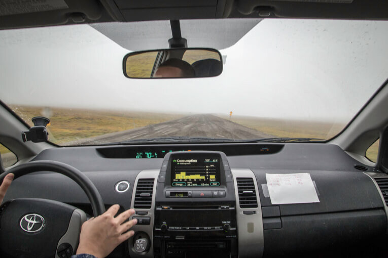
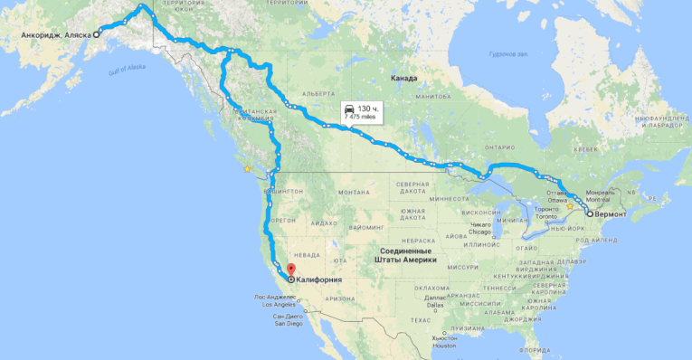
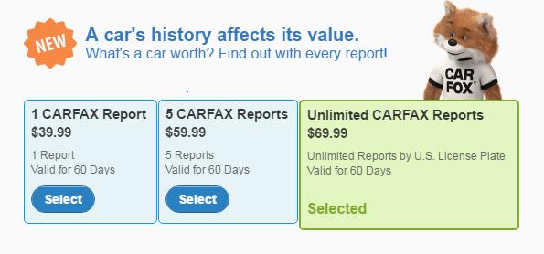
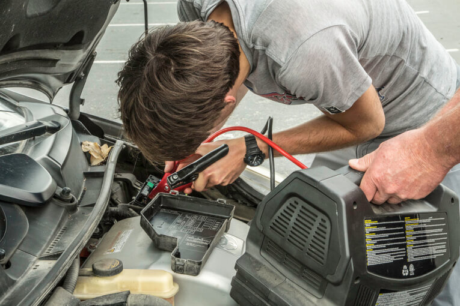
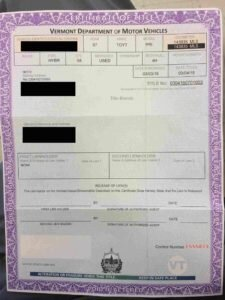
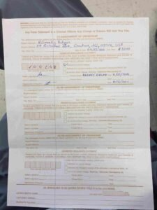
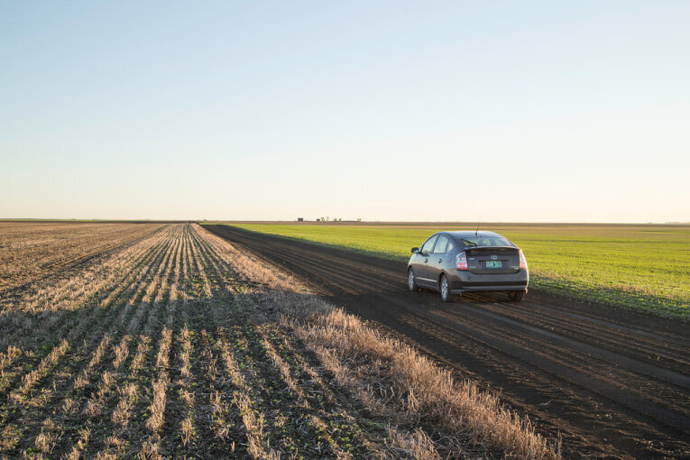
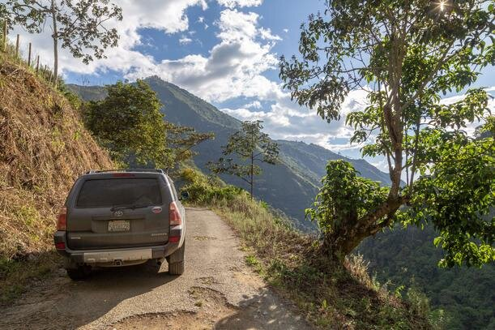

Если вы едете в США более, чем 2-3 недели, то есть смысл задуматься о покупке собственного авто. На собственном примере расскажем, как купить машину в США, какие документы потребовались и сколько времени мы потратили.

<!--more-->

В штате Вермонт мы купили Toyota Prius 2007 года за 4400$, и проехали на нем всю Канаду с востока на запад, Аляску, и вниз до Калифорнии.

Из тех.обслуживания меняли масло каждые 10-12 тысяч километров,  воздушный фильтр и заливали бензин. Маршрут путешествия доступен [по ссылке](https://vodpop.ru/puteshestvie-po-amerikam-onlayn-statistika/).

## Преимущества собственной машины в США перед арендованной:

1. Уверенность и спокойствие. Конечно, попадать в аварии - дело неприятное. И что на своей, что на арендованной машине придется вызывать полицейских. Однако, как это случилось с нами, иногда неприятности случаются в отсутствие свидетелей. Так, в канадском Виннипеге, неизвестная личность поцарапала нам боковую дверь и вывернула зеркало бокового вида. Мы просто вывернули обратно зеркало и продолжили нашу поездку. А про царапины уже забыли, потому что они не глубокие и делать что-либо не имеет смысла. На арендованной машине процесс усложняется как минимум звонком в компанию (и стоимость роуминга ляжет на ваши плечи)
2. Комфорт и уют. Так как мы путешествовали в самый "комарийный" сезон, нам хотелось как-то себя избавить от назойливых насекомых: мы установили противомоскитные сетки, закрепив их на клей. Плюс я приклеила шпаргалки с испанской грамматикой на приборную панель. В арендованной машинке мы бы сильно постеснялись такое делать, тем более что-то связанное с клеем. А на своей - ОК!
3. Свой темп. Нет никаких ограничений, дедлайнов или срока аренды: не нужно никуда торопиться!
4. Экономия. По сравнению со стоимость самой недорогой аренды на месяц, покупка машины полностью отбивает затраченные на нее деньги и время. Более того, вы можете продать автомобиль за ту же цену, и в некоторых случаях даже большую (об этом - дальше). Конечно, если у вас всего неделя на поездку, то намного проще арендовать автомобиль. В краткосрочных поездках мы обычно пользуемся агрегатором [RentalCars](http://c13.travelpayouts.com/click?shmarker=25257&promo_id=653&source_type=customlink&type=click&custom_url=)

<iframe src="http://c13.travelpayouts.com/content?promo_id=484&amp;shmarker=25257&amp;widget=100x350" width="100%" height="350" frameborder="0"></iframe>

## Недостатки покупки и продажи машины в США по туристической визе:

1. Далеко не во всех штатах можно купить машину по туристической визе
2. Много неизвестного: где купить машину, как сэкономить, как проверить машину (битая/не битая), какие документы нужны, как застраховать машину. На эти вопросы мы ответим из личного опыта
3. Сложно продать машину в короткий срок. Это правда, но если вы готовы продать машину  чуть ниже рыночной цены, то сможете это сделать всего за пару часов

## В каких штатах можно купить машину в США по туристической визе:

1. Гарантировано (подтверждено **личным опытом** путешественников): Калифорния, Вермонт, Аляска. Невероятно удобное географическое сочетание, так как существует возможность купить машину как на Восточном, так и на Западном побережьях. Ну и на Аляске, для особо отчаянных путешественников
2. Возможно купить в Техасе, но подтвержденного опыта нет
3. Совершенно **точно нельзя купить машину по туристической визе** без дополнительных процедур в следующих штатах: Ньй-Йорк, Нью-Джерси, Пенсильвания, Мерилэнд, Вирджиния, Западная Вирджиния, Род-Айлэнд, Массачусетс (хотя они по телефону могут сказать, что можно, по факту - нельзя), Нью-Хемпшир, Мэн, Коннектикут, Орегон.

Самостоятельно проверить, возможна ли покупка машины в интересующем вас штате можно на официальном сайте DMV (Department of Motor Vehicles) данного штата. Например, мы проверили информацию на сайте [DMV Vermont](http://dmv.vermont.gov/), где убедились, что для регистрации машины в этом штате не нужен SSN или доказательство постоянного адреса проживания.

## Как купить машину в США

Прежде всего, определитесь с местом покупки. Машину в США можно купить:

1. В автосалоне. Новую или даже подержанную машину, но со значительной переплатой. Из преимуществ - никаких проблем с документами, все сделают за вас
2. У дилера. Они продают самые разные машины, на любой вкус, цвет и кошелек. Однако велик риск, что вам попытаются "впарить" что-то совсем не подходящее
3. У частника. Искать их можно и нужно на американской доске объявлений [craiglist.com](http://craiglist.com). Выбираете раздел for sale, cars и вводите год, модель и другие желаемые параметры, в том числе и цену

**Полезные сайты для покупки машины в США по туристической визе:**

- [carfax.com](https://www.carfax.com/), Carfax - сайт для просмотра истории автомобиля. Здесь можно узнать, была ли машина в авариях, и если обслуживалась у офиц.дилера, то будут все записи о замене масла, фильтров и пр. На главной странице сайта говорится о бесплатном репорте, но не верьте: сервис платный. Проверить можно либо по VIN, либо по номерам автомобиля. Стоимость на картинке. Если вам понравился какой-то автомобиль, то есть смысл заплатить 40$ и убедиться, что с машиной все хорошо
- [kbb.com](http://www.kbb.com/new-cars/?hppopcorn=a&hpnav=true), Kelley Blue Book  - бесплатный сервис для оценки стоимости автомобиля. Введите год, пробег и модель желаемого авто и получите цену, на которую стоит ориентироваться при покупке и продаже машины. Отличный помощник по вопросу, **как купить машину в США**.

## Как не купить кота в мешке:

1. Обратите внимание на хозяина. Именно этот человек эксплуатировал машину, и если он кажется вам неадекватным, то лучше отказаться от покупки
2. Внимательно осмотрите машину, при этом смотря не реакцию владельца. Если он торопит вас и подгоняет, то обычно это не значит ничего хорошего. Задайте вопросы про предыдущих владельцев, для чего он использовал машину, сколько лет ей владеет, что заменял в машине, попадал ли в аварии. Слова не должны расходиться с тем, что написано в объявлении о продаже
3. Проверьте все оригиналы документов. Сколько указано владельцев, совпадает ли VIN-номер с реальностью. VIN-код, как правило, расположен в том месте, где лобовое стекло соприкасается с капотом со стороны водителя, а также дублируется на стикере, находящимся в проеме водительской двери. Кроме того он может дублироваться и в других местах
4. Проверьте Title, он же Pink Slip машины. Существует несколько типов title:
    - Clear Title -  т.е. поле "Title" должно быть пустым. Это значит, что машина не попадала в аварии (по крайней мере по официальным записям, с участием полицейских)
    - Salvage Title - машина была восстановлена после аварии, причем сумма восстановления более 75% от рыночной стоимости машины. Машины с таким тайтлом также бывают в хорошем состоянии (если ремонт делался у офиц.дилеров с заменой деталей), но такое авто намного сложнее продать, чем с чистым тайтлом
    - Rebuilt/Reconstructed Title - целиком восстановленная машина из б/у деталей. Это точно кот в мешке и я бы связываться не стала.
5. Emission Control Requirements, в Калифорнии зовется Smog Check  - проверка поддержанных машин на уровень выбросов в атмосферу. В идеале, машина до покупки уже должна пройти этот тест. В нашем случае у продавца был стикер до 2017 года.

## Я ни разу не покупал поддержанный автомобиль. Куда смотреть?

1. Сначала внешне осмотрите автомобиль. Причем на ровной площадке
2. Проверьте шины: они должны быть одинаковыми и равномерно изношеными
3. Проверьте кузов автомобиля на предмет царапин, сколов, вмятин и ржавичны. Лучше всего это делать при дневном свете, если осматриваете машину вечером, встаньте под фонарем
4. Откройте и закройте все двери по несколько раз, убедитесь, что все замки работают
5. Откройте багажник, найдите запаску и обратите внимание, есть ли ржавчина
6. Откройте капот, найдите VIN-номер, проверьте, что не нарушена геометрия деталей. Если видите "волну", машина побывала в аварии
7. Проверьте состояние воздушного фильтра и уровень масла
8. Проверьте тормозную жидкость и состояние ремней
9. Загляните под машину. В идеале загоните авто на эстакаду и проверьте, что дно выглядит аккуратно, без изгибов, все детали на месте и хорошо закреплены
10. Сядьте в салон на все места в машине по очереди. Откройте-закройте стекла, проверьте чистоту и целостность салона, откиньте задние сиденья, измените положение передних во всех доступных координатах. Все рычаги и кнопки должны работать без проблем
11. На водительском месте попробуйте каждую кнопку: дворники, обогрев стекл, блокировка дверей, работает ли сигнал, включите аварийку, лампочки внутри салона, все поворотники (если осматриваете машину один, можно либо выходить из машины, либо встать напротив стены - будет видно отражение)
12. Убедитесь, что на бортовом компьютере нет никаких ошибок
13. Включите кондиционер, и печку. Проверьте, что все режимы работают (ноги, руки, обогрев стекла)
14. Проверьте пробег на одометре. Он должен быть релевантен году выпуска. Если машине 10 лет, а она проехала 20 тысяч километров, то скорее всего его скрутили
15. После того, как вы убедились, что снаружи и внутри все нормально, приступайте к тест-драйву. Попробуйте газовать, тормозить, затем проверьте экстренное торможение (но только с разрешения владельца). Не должно быть никаких странных звуков, скрипов или вибраций.
16. Поверните машину на 90 градусов, развернитесь, пройдьте на задней передаче. Опять же, слушая звуки и обращая внимания на вибрации
17. Если машина механика (что редкость для США), не забудьте проверить сцепление
18. Проверьте, ровно ли едет машина. На скорости 50 кмч выпрямите руль и отпустите на несколько секунд: машину не должно никуда "вести"
19. Если все устраивает, просите у владельца документы на машину. Если есть мелкие недочеты, можете попросить скидку

## Какие документы нужны для покупки машины в США по туристической визе:

1. Самый главный - Title, он же Pink Slip. Его оригинал должен быть у продавца машины. Напоминанию, что тайтл должен быть чистым: никаких пометок с Salvage или Rebuilt. Проверяем, что на лицевой стороне указан текущий владелец машины
2. Переворачиваем тайтл и заполняем необходимые поля: имя покупателя, дата и сумма покупки, адрес, куда придет оригинал тайтла. Мы воспользовались адресом нашего хоста в Нью-Джерси, с которым познакомились за 3 дня до этого на Couchsurfing.com, но это может быть адрес вашего друга, родственника или любого человека, кому вы можете доверить оригинал тайтла, который придет на этот адрес. Можно даже воспользоваться адресом гостиницы, если вы заранее договоритесь с администратором, что он передаст вам этот тайтл лично в руки. Однако, знайте, что это риск, так как любой человек, у которого оригинал тайтла. может запросто переписать вашу машину на себя
3. [С](https://vodpop.ru/wp-content/uploads/2016/09/title2-4.jpg)амые внимательные читатели заметят, что у нас в тайтле указано не 4400$, а всего 3500$ - мы попросили продавца указать чуть меньшую сумму, так как именно с нее рассчитывается сумма налога
4. Далее тайтл разрезается на 2 части: одна остается у продавца, вторая вам
5. По факту, уже на этом этапе вы можете распрощаться с продавцом, но в нашем случае он поехал с нами в DMV (по закону у вас есть 10 дней, чтобы туда доехать)
6. В DMV Вермонта также необходимо заполнить:
    - [Vermont Registration, Tax, and Title application](http://dmv.vermont.gov/sites/dmv/files/pdf/DMV-VD119-Vehicle_Reg_Tax_Title_App.pdf), еще одна анкета, где указывается адрес продавца и покупателя, данные на машину и дата продажи
    - [Bill of Sale and Odometer Disclosure Statement](http://dmv.vermont.gov/sites/dmv/files/pdf/DMV-VT005-Bill_Of_Sale_Odometer_Cert.pdf) счет, где указывается адрес покупателя, данные на машину, сумма и дата, а также анкета, где указывается показатель одометра
7. Во время заполнения документов передаете деньги продавцу. В некоторых случаях он может попросить заплатить с карточки, тогда вам нужно будет поехать с ним в  банк
8. С заполненными документами мы подошли в окно регистрации, нам рассчитали сумму налога, мы заплатили ее с карточки. Нам сразу выдали 2 номерных знака (license plate), которые мы тут же прикрутили к машине

## Как застраховать машину в США по туристической визе?

Купить и зарегистрировать машину вы можете и без страхового полиса, но управление автомобилем без страховки запрещено, поэтому до страховой компании придется либо ехать на такси, либо идти пешком, или, как мы, на арендованной машине.

Увы, сделать ее онлайн с российскими правами и адресом почти нереально, поэтому мы выбрали оформление страхового полиса в офисе. Страховка на полгода стоила 390$. В компании Progressive, где оформляли мы, минимальный срок страхования 3 месяца.

Для оформления страховки потребовался адрес в Вермонте, мы воспользовались адресом продавца, но можно указывать хоть адрес заправки или Макдональдса: на него просто придет оригинал страховки, который вообще никому не нужен.

Для предъявления полицейским достаточно распечатки (но ее необходимо всегда иметь с собой). Покрытие мы взяли минимальное из возможных, так как у обоих довольно приличный стаж безаварийного вождения

## Что делать в случае аварии

Надеюсь, вам этот пункт никогда не пригодится, но все же нельзя о нем умолчать. Вы встаете на аварийку, звоните в страховую компанию и объясняете, что произошло. После этого следуете инструкциям оператора. В случае вашей вины по самому дешевому полису будут покрыты только расходы на ремонт и о_казание медицинской помощи пострадавшим_ (про это многие не в курсе).

Если рассмотреть сценарий, в котором вы бьете другую машину в багажник, водитель той машины получает сломанный нос от подушки безопасности, то ваша автомобильная страховка покроет ремонт его багажника + лечение переносицы пострадавшего водителя в рамках покрытия (у нас 50 000$). Но в этом сценарии вы себе помяли бампер и ремонтировать вы его будете за свой счет, так как это самая простая страховка. Безусловно, можно купить страховку full coverage (КАСКО), но она стоит существенно дороже.

Важно! При любой аварии, несчастном случае вам **необходимо** иметь медицинскую страховку в США. Мы также подробно расписали, [как купить  страховку в США](https://vodpop.ru/insurance-usa/).

## Как купить машину в США на Восточном Побережье

Мы купили машину в South Burlington, Vermont, предварительно позвонив и уточнив в DMV, что это действительно возможно. Проехали 7,5 часов из Нью-Джерси, переночевали на парковке Walmart в арендованной машине, в 7 утра открыли craiglist и нашли несколько вариантов.

Поехали смотреть Фольксваген Джетту, а в результате продавец оказался мелким дилером: у него в наличии были Тойоты Приусы, и он показал нам один из них. Мы съездили посмотрели Приус у другого продавца, но в результате вернулись к первому.

Было около 11 утра, мы попросили его подъехать с нами в DMV, где заполнили анкеты, получили 2 комплекта ключей в обмен на конверт с деньгами, зарегистрировали машину, прикрутили номера. На все потратили около часа. Затем на арендованной машине доехали до ближайшей страховой (ей оказалась Progressive), где провели почти 2 часа, потому что их система не настроена для ввода российских прав, российского индекса и т.п. В результате директор компании полчаса провисел на трубке, выясняя у тех.поддержки, как заполнять поля с нашими данными.

Итого, около 15 часов того же, в который мы начали поиск машины, мы не только купили ее, но и зарегистрировали, поставили на номера и застраховали. В тот же день, в 23.00 мы уже доехали обратно в Нью-Джерси. Впечатления остались самые положительные, и результат радует не первый месяц: Тойота Приус - лучшая машина, которая у нас когда-либо была, и идеальна для путешествий: легкая, проходимая, с отличным MPG - Miles Per Gallon. Этим сокращением в Америке измеряют прожорливость машинки по части бензина. Т.е. считают, сколько миль машина способна проехать на 1 галлоне=3.78 литра бензина

## Российские или международные права для поездки в США?

Международные права для поездки в США и Канаду можно и не оформлять: полицейских вполне устраивают российские (проверено, увы, на личном опыте). По не вполне подтвержденным данным с нашими правами (любыми) можно водить в США 3 месяца, а затем необходимо оформлять местные. Однако, существует точка зрения, что права действуют весь срок нахождения вас в стране, как туриста. Как на самом деле - не знает никто, но если узнаем, обязательно расскажем об этом в блоге.

## Как продать машину в США по туристической визе?

Ответ прост - нужно прочитать все, что выше и сделать наоборот. Теперь мы размещаете объявление на craiglist, пишите там всю необходимую информацию, встречаетесь с потенциальными покупателями. Лучший вариант для вас - наличный расчет, но если возникнут проблемы, то можете поехать в банк, чтобы покупатель сделал на вас валютный перевод. Это менее предпочтительный вариант, так как комиссия составляет от 40$ и более.

В случае, если нужно продать машину поскорее, то можно поставить цену чуть ниже рыночной, а если хотите расстаться с ней в буквальном смысле за час, то в США множество дилеров, который покупают машину за наличные. Но будьте готовы потерять небольшой процент от стоимости.

После продажи у вас на руках останется часть Title, которую необходимо отправить на указанный в ней адрес или заполнить электронную форму. В штате Vermont вы также должны заполнить  [Bill of Sale and Odometer Disclosure Statement](http://dmv.vermont.gov/sites/dmv/files/pdf/DMV-VT005-Bill_Of_Sale_Odometer_Cert.pdf) для покупателя.

## Личный опыт продажи машины в США. Покупка машины в Калифорнии.

Мы решили поменять Приус на внедорожник 4х4, так как для следующего этапа путешествия, куда входили Мексика, Центральная и Южная Америки, хотелось машину с лучшей проходимостью.

Процесс был прост: мы через craiglist нашли дилера в Калифорнии, у которого был понравившийся нам Toyota 4Runner, сдали в трейд-ин наш Приус за 4000$, доплатили оставшиеся 5500$ наличными, оформили на нас 4Runner по уже описанной выше схеме.

Получилось, что не считая ТО, владение Приусом в течение 9 месяцев обошлось нам в 400$.

Title, он же ПТС, пришел нашему другу в Калифорнии на почту: мы забрали его через несколько месяцев, перед пересечением границы с Мексикой.

Если у вас остались какие-либо вопросы по покупке авто в США, смело пишите в комментариях. А если вам помогла наша статья в приобретении собственного авто в США, то не забудьте поделиться своим опытом или хотя бы поставить "+" - так мы будем знать, что эта информация была для вас полезна.
