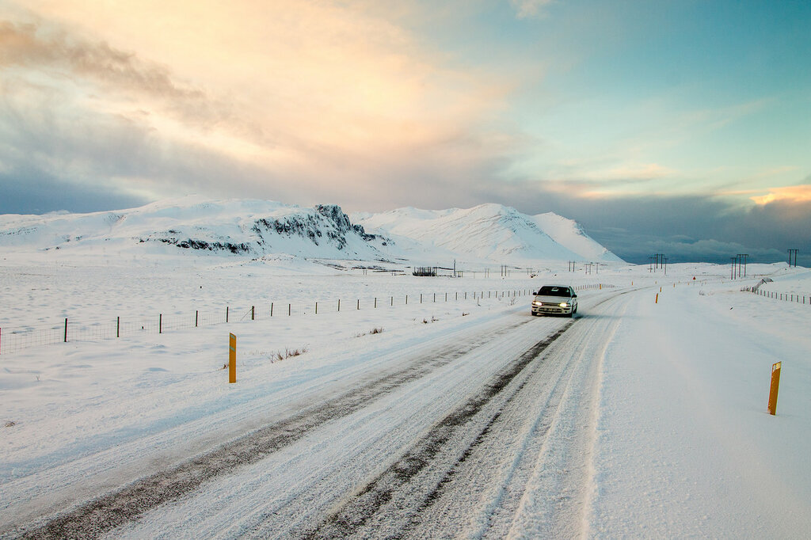

Сейчас я расскажу о том, как найти и купить самые дешевые авиабилеты. Мы пользуемся этим методом каждый раз при планировании путешествия: 6 простых приемов позволяют нам покупать самые дешевые авиабилеты, экономя до 50% от средней стоимости.

<!--more-->

Все описанные ниже приемы многократно проверены нами и другими путешественниками на практике. Однако должен предупредить, что все очень зависит от маршрута рейса. Для вашего удобства, я расположил приемы в порядке убывания потенциальной экономии. Т. е. использование хотя бы первых 3-4 приемов из списка уже дает большую вероятность того, что вы купите **самые дешевые авиабилеты**. И да, если вы еще думаете, куда лететь, рекомендую воспользоваться [картой цен](http://map.aviasales.ru/?origin=MOW&marker=25257). Она помогает быстро подобрать интересные направления с учетом вашего бюджета:

<iframe src="//maps.avs.io/flights/?auto_fit_map=true&amp;hide_sidebar=true&amp;hide_reformal=true&amp;disable_googlemaps_ui=true&amp;zoom=3&amp;show_filters_icon=true&amp;redirect_on_click=true&amp;small_spinner=true&amp;hide_logo=false&amp;direct=false&amp;lines_type=TpLines&amp;cluster_manager=TpWidgetClusterManager&amp;marker=25257.map&amp;show_tutorial=false&amp;locale=ru&amp;host=map.aviasales.ru&amp;origin_iata=MOW" width="800px" height="400px" frameborder="0" scrolling="no"></iframe>

## №1. Правильные время и дата перелетов

Пожалуй, это самый очевидный способ экономии: чем ниже спрос на конкретные даты и время, тем дешевле будут стоить билеты. Поэтому если вы еще можете выбирать, когда лететь, то рекомендую придерживаться следующих простых принципов:

- Узнайте, когда в стране пребывания **"низкий" сезон**. В этом время бывают не только самые дешевые авиабилеты, но и [отели](http://hotellook.ru/?marker=25257).
- Старайтесь лететь туда и обратно в противоток основной массе людей. Авиабилеты **с вылетом/прилетом в середине недели** как правило самые дешевые. Таким образом, выходные выгоднее всего полностью провести в месте назначения.
- При поиске авиабилетов выбирайте **гибкие даты** (хотя бы плюс минус 3 дня). Самое удобное решение с гибкими датами на данный момент есть у поисковика  [Aviasales](http://www.aviasales.ru/?marker=25257). Он позволяет видеть самые дешевые цены сначала по месяцам, а затем по дням:
    
    
    

## №2. Правильное время покупки

- Покупайте авиабилеты **за 45 дней** до даты внутреннего перелета и **за 60 дней** до даты международного. Это выявленные опытным путем значения связанные с особенностями работы информационных систем авиакомпаний. Обратите внимание, это правило может не работать для авиабилетов на время государственных праздников!
- Самые дешевые авиабилеты можно купить **в среду, в час ночи**. В крайнем случае — утром или ночью на буднях, во внерабочее время.
- Если направление не очень популярное и на перелет нет аншлага, то **за один день до полета** можно найти самые дешевые авиабилеты. Но если вы планируете поездку заранее и у вас многое завязано на конкретных датах, я бы не рекомендовал на это полагаться.

## №3. Авиабилеты с пересадками

Так сложилось, что самые дешевые авиабилеты — это обычно авиабилеты с пересадками. Исключение разве что могут составлять перелеты между очень крупными авиационными хабами (например, Москва — Гонконг или Франкфурт — Хельсинки). В остальных случаях рекомендуем придерживаться следующих рекомендаций:

- Используйте крупные поисковики авиабилетов (например, [Aviasales](http://www.aviasales.ru/?marker=25257)), чтобы отфильтровать предложения разных авиакомпаний по цене и сразу найти подходящие **варианты с пересадками**. Иногда пересадки бывают довольно долгими (от 5 часов). И это замечательно, потому что вы получаете возможность выйти в город и, возможно, познакомиться с новой страной. Так мы побывали в [Кишиневе](https://vodpop.ru/dostoprimechatelnosti-londona/), Франкфурте и [Гонконге](https://vodpop.ru/category/azija/gonkong/). Разумеется, для этого у вас должна быть виза страны, которую вы хотите посмотреть во время пересадки.
- Используйте прием "фиктивная пересадка". Это прием для продвинутых путешественников: такие варианты довольно трудно найти и нужно быть очень внимательным, чтобы не остаться без обратного билета. Суть этого приема в том, что на полеты с пересадками иногда делают настолько большую скидку, что стоимость всего полета с пересадкой оказывается меньше стоимости одного из составных перелетов. Звучит сложно, поэтому поясню на примере. Допустим, вы в Москве и вам нужно попасть в Ригу. Прямой до Риги на ваши даты может стоить 10 тыс. руб., а билет до Осло с пересадкой в Риге — всего 7 тыс. руб. Весь трюк состоит в том, чтобы просто **взять и не пойти на пересадку**. Тогда вы сэкономите 3 тыс. руб. в один конец. Единственное, в таком случае брать билеты туда и обратно нужно отдельно, не одним заказом. У авиакомпаний есть такое правило: если вы не являетесь на пересадку, все следующие перелеты в заказе аннулируются.
- Используйте местных лоукостеров (бюджетных авиакомпаний) для преодоления части расстояния. По сути, вы можете самостоятельно составить для себя перелет с пересадками. Именно так мы летали Москва — Бангкок. Прямой рейс Москва — Гонконг и рейс лоукостером Air Asia Гонконг — Бангкок в сумме стоили примерно на 20% дешевле предложения Москва — Бангкок. Это прием может быть эффективен, если на вашем маршруте (или недалеко от него) есть очень крупные международные хабы, в которых работают бюджетные авиакомпании. Основываясь на логике из приведенного примера с маршрутом Москва — Гонконг — Бангкок, вы можете поэкспериментировать с составлением перелетов с пересадками из прямых перелетов в этой форме:
    
    <iframe src="//www.travelpayouts.com/widgets/cb32b475e5222c84ad3bda3e6100b59c.html?v=602" width="800" height="254" frameborder="0" scrolling="no"></iframe>
    
    Иногда таким образом можно сэкономить еще больше, если доехать до большого хаба на автомобиле. Именно так мы добирались до [Исландии](https://vodpop.ru/category/evropa/islandiya/) из Москвы в январе этого года. Дело в том, что рейс Москва — Рейкьявик с пересадками стоил около 30 тыс. руб. на человека (туда и обратно). Экономически получалось гораздо выгоднее доехать на машине до Хельсинки и уже оттуда полететь в Исландию на этот раз прямым рейсом, который обошелся нам почти в два раза дешевле. 

## №4. Поиск мест в чартерах

Чартеры — это специальные нерегулярные рейсы, которые бронируют туроператоры для своих пакетных туров. Часто бывает так, что турагентства не успевают продать все пакетные туры и тогда самолет летит незаполненным. Чтобы хоть как-то скомпенсировать убытки, туроператоры выставляют эти пустые места в самолетах на продажу на специализированных сайтах-биржах, например [aviacharters.ru](http://aviacharters.ru) или [chartex.ru](http://chartex.ru).

Разумеется, искать такие предложения гораздо менее удобно, чем на том же [Aviasales](http://www.aviasales.ru/?marker=25257), зато можно перехватить действительно самые дешевые авиабилеты. Например, на рейс Москва — Бангкок за какие-то $200.

## №5. Поик акций авиакомпаний

Авиакомпании постоянно проводят акции. Конечно, вы можете подписаться по почте на все сайты авиакомпаний, но тогда вам будет приходить такое количество писем (в основном — бесполезный хлам), что вы просто перестанете это читать. Поэтому я обычно отслеживаю акции в специализированных группах ВКонтакте, а если нужно найти акции и спецпредложения на конкретные даты по конкретным направлениям, я пользуюсь вот этой [агрегированной подборкой](http://www.aviasales.ru/offers?marker=25257).

## №6. Анонимность при покупке

Билетные сервисы в процессе покупки определяют ваше местоположение, ваше устройство и примерно оценивают вашу платежеспособность. Поэтому одни и те же авиабилеты могут стоить дороже, если вы покупаете их с макбука из Москвы, чем если бы вы покупали их с дешевого нетбука из Архангельска. Эту хитрость можно "взломать", если покупать билеты из режима "инкогнито" браузера и через прокси-сервер какого-нибудь не очень богатого региона. Приведу несколько ссылок на ресурсы, которые могут вам помочь в этом:

- [Инструкция по включению режима "инкогнито"](http://spvcomp.com/stat/rezhim_inkognito_\(privatnyj\)_v_brauzere.php)
- Aviasales в анонимайзере. В бесплатном режиме сервер выбирается случайно среди Румынии, Германии или США
- Некоторые популярные анонимайзеры: hideme.ru, hidemyass.com, shadeyouvpn.ru, hideguard.ru

Вот и все, желаю вам побольше дешевых авиабилетов. Если знаете о других способах, как купить самые дешевые авиабилеты — вы можете поделиться этой информацией с миром в комментариях под статьей. Ну и конечно любые ваши вопросы крайне приветствуются! :)
