Любите снимать на "мыльницу" в автоматическом режиме? До сих пор привозите из поездок гигабайты скучных снимков, которые не хочется потом пересматривать снова и снова? Хотите прямо сейчас начать делать красивые фотографии? Это возможно. И это просто. В этой статье я расскажу, как сделать красивую фотографию в путешествии, не потратив ни копейки на оборудование.

<!--more-->

Сейчас речь пойдет исключительно о приемах, которые я использую непосредственно в процессе съемки. О том, как обрабатывать фотографии, я расскажу в других статьях. Поехали.

На самом деле, сделать красивую фотографию можно за три шага (разумеется, когда я фотографирую, я не думаю ни о каких шагах, просто решил, что это наиболее доступный формат передачи знаний моим дорогим читателям):

1. Возьмите паузу (расслабьтесь)
2. Найдите уникальный сюжет
3. Позаботьтесь о композиции

А теперь обо всем по порядку.

## **Шаг 1. Возьмите паузу**

Знаете, почему в мире уже отснято так много скучных фотографий? Все просто. У фотографов-любителей зачастую есть вредная привычка - фотографировать все, что привлекает внимание. А так как во время путешествия, когда приезжаешь на новое место, привлекает внимание почти все - другие люди, другие дома, другая природа - человек с фотоаппаратом начинает панически документировать буквально все подряд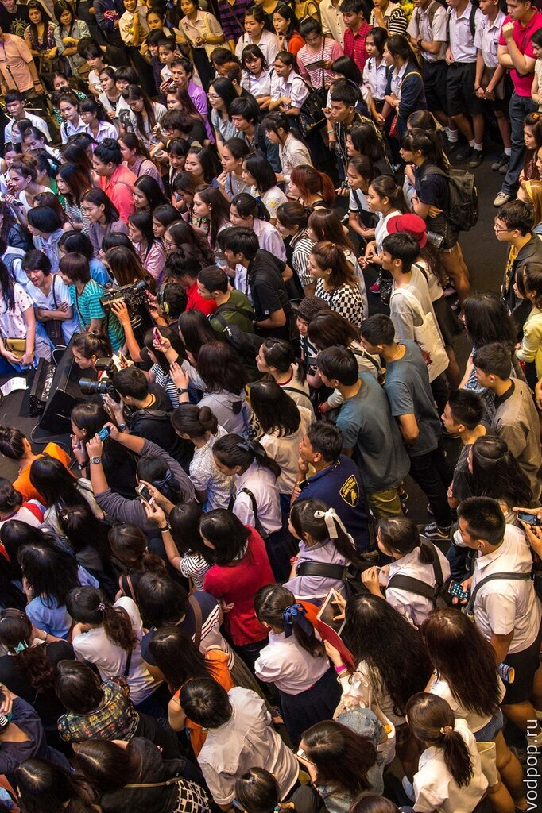

Не делайте этого! Если вы собираетесь пробыть в новом городе несколько дней, то в первый день я рекомендую вообще не доставать камеру. Дайте вашему мозгу время, чтобы "переварить" новые впечатления. Креатив возможен лишь тогда, когда вы почувствуете, что новая обстановка вас уже не так удивляет, когда обычные вещи станут для вас действительно вполне обычными вещами. Ну как, успокоились? Теперь самое время переходить к поиску сюжета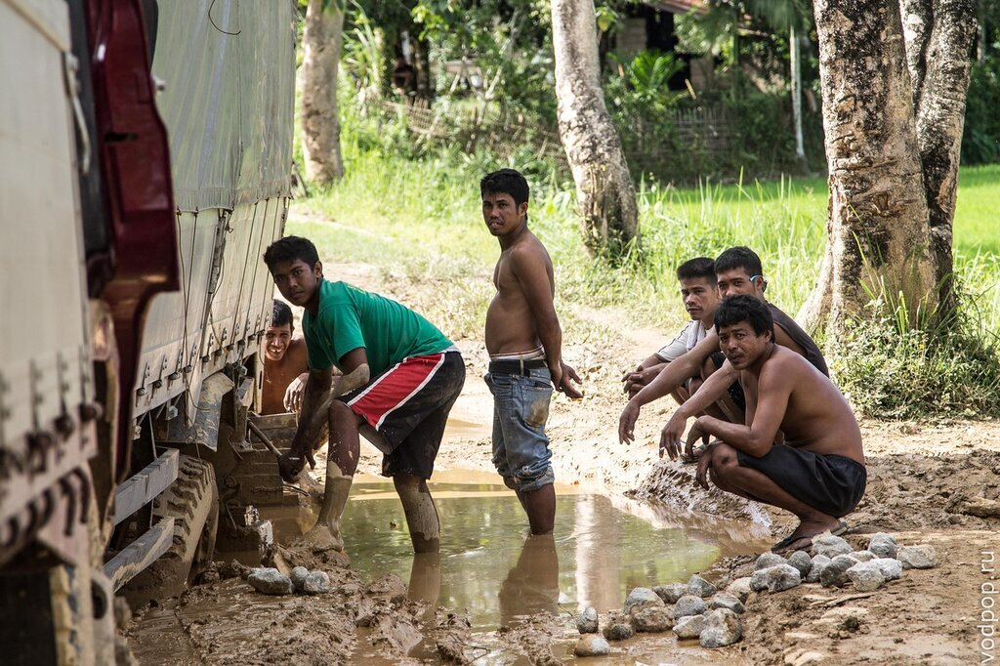

## Шаг 2. Найдите уникальный сюжет

Сюжет - это основа красивой фотографии в путешествии

Фотография с неинтересным или невыраженным сюжетом автоматически становится скучной. Вам нужен _уникальный_ сюжет. Поиск сюжета - объективно самая сложная задача в тревел-фотографии, потому что здесь, в отличие от постановочной фотографии, не последнюю роль играют факторы, которыми вы управлять не можете. Собака, которая помчалась разгонять голубей, мальчишка, измазавшийся мороженным или человек, распахивающий поле в такой момент времени и в таком месте, чтобы с дороги удалось его сфотографировать вместе с пальмой (перед снимком я подождал секунд 20, пока пахарь дойдет до нужного мне места)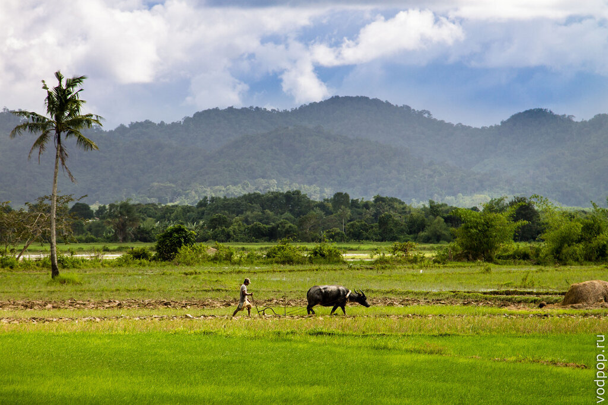

Тем не менее, я могу дать несколько простых советов, которые помогут вам с большей вероятностью запечатлеть интересный сюжет:

- **Остановитесь.** Никогда не фотографируйте в движении. Подождите пару минут и оглядитесь по сторонам. Мир настолько хаотичен, что что-нибудь интересное обязательно произойдет. В крайнем случае, неподвижно стоящий посреди улицы человек, привлечет внимание прохожих и спровоцирует у них уникальные эмоции, которые также могут стать интересным сюжетом. 
- **Будьте любознательны.** Тот кто ищет, всегда находит. Заводите диалоги с местными: это позволит вам не только создать идеальные условия для жанровой съемки, но и узнать немного о местной культуре. Чаще всего, именно сам фотограф превращает своим вмешательством обычный сюжет в уникальный. Иногда достаточно вопроса "как найти улицу такую-то?", чтобы познакомиться с человеком узнать что-то интересное и сделать выдающиеся снимки. Например, когда я катался по [Палавану на байке](https://vodpop.ru/podzemnaja-reka-v-sabange/ "Фотки с поездок по Палавану на байке"), я разговорился с владельцем придорожного кафе. Он думает, что в России зима круглый год, а водка течет из-под крана 
- **Находите непопулярные среди туристов места.** Как правило, в переполненных туристами достопримечательностях трудно найти уникальный сюжет. Найдите информацию об интересных местах города на форумах и блогах, поспрашивайте у местных или найдите частного гида. Когда мы жили в Тай Тай на [Филиппинах](https://vodpop.ru/samye-krasivye-ostrova-filippin/ "Больше красивых фото с Филиппин"), мы лазали по церкви, находящийся на реконструкции, и заходили в местную школу. Детишки были в восторге 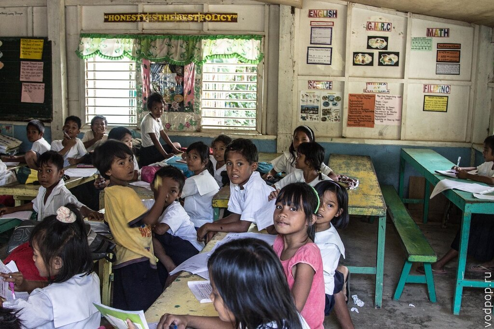

Итак, вы немного привыкли к новому месту и нашли интересный сюжет. Но не спешите жать на кнопку спуска.

Нравится статья? Узнавайте первым о выходе новых интересных историй! Подпишитесь на нас по [эл. почте](http://feedburner.google.com/fb/a/mailverify?uri=vodpop&loc=ru_RU) или в [группе ВКонтакте](http://vk.com/vodpop)

 

## Шаг 3. Позаботьтесь о композиции

Композиция - это то, как распределены и связаны друг с другом предметы и формы в кадре. Композиция в фотографии - это целая "маленькая наука", в которой известно множество практических методов и приемов. Сейчас я расскажу только о трех самых простых и эффективных инструментах, которые часто применяю сам.

- **Правило третей** (правило золотого сечения). Мысленно разбейте фотографию на трети, либо воспользуйтесь встроенной сеткой камеры. В портретной фотографии старайтесь располагать ближний к объективу глаз модели на границе или в центре одной из третей, либо разместите изображение лица целиком в одной из третей. Кстати, фанатки косплея в [Бангкоке](https://vodpop.ru/category/%D0%B0%D0%B7%D0%B8%D1%8F/%D1%82%D0%B0%D0%B9%D0%BB%D0%B0%D0%BD%D0%B4/ "Фотографии из Бангкока") очень любят фотографироваться, можно практиковаться на них 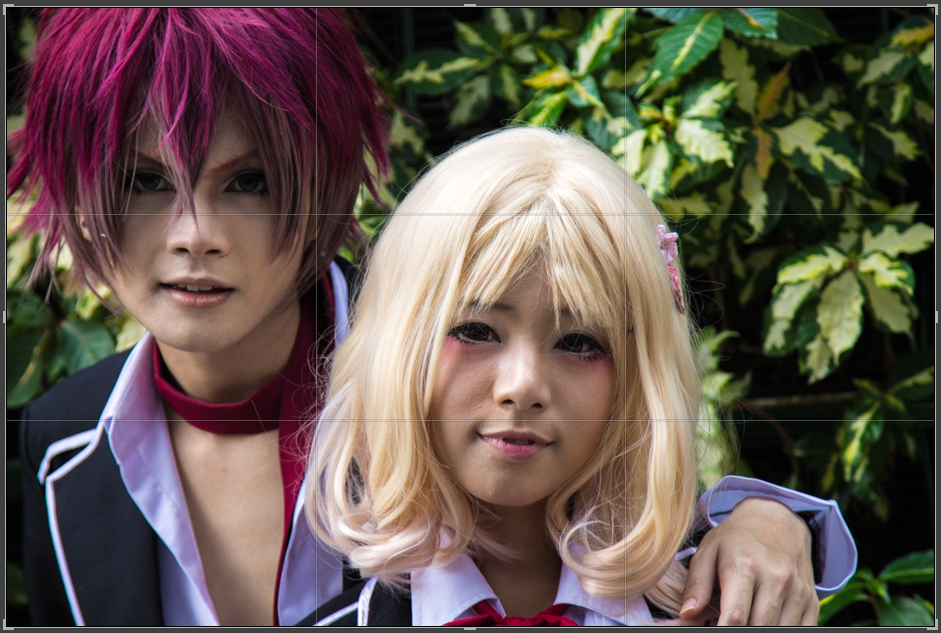При съемки пейзажей мысленно выделите "передний" и "задний" план (иногда еще бывает "средний"). Разместите, например, задний план в верхней трети - получите красивую фотографию. Разумеется, при этом должен быть достаточно привлекательный передний план. И следите, чтобы горизонт не был "завален". Например, две трети этого кадра я заполнил спокойным морем, интересно подкрашенным [закатным солнцем Сан Висенте](https://vodpop.ru/palavan-foto/ "Неизведанный Палаван: Сан Висенте"), а ближнюю лодку разместил на границе третей 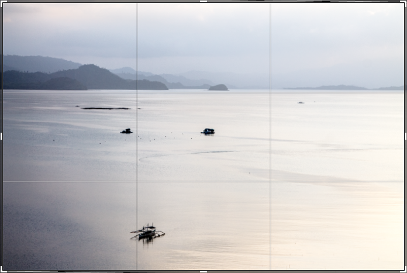
- **Дисбаланс.** Если хотите сделать фотографию более динамичной, поймайте кадр, в котором какой-то один объект физически нестабилен. Например, брызги воды, которые в следующий момент упадут обратно в [реку](https://vodpop.ru/lodki-v-bangkoke/ "Лодки в Бангкоке (Khlong boats)") 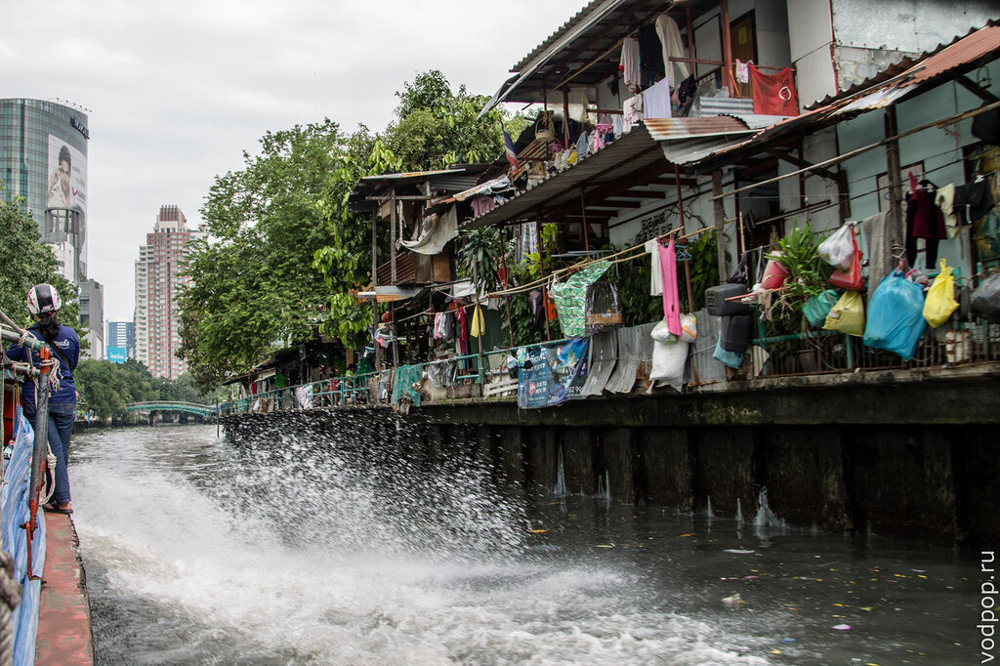Пасть крокодила, которая вот-вот захлопнется вместе с рукой дрессировщика **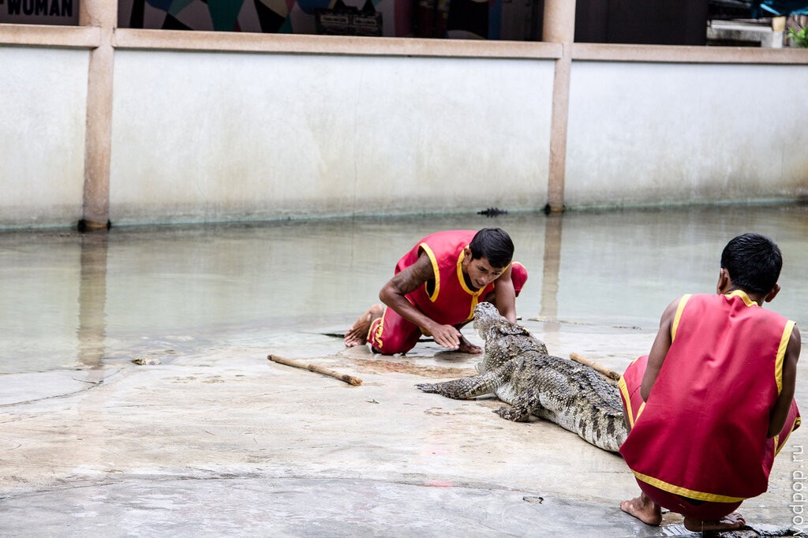**Весло, которое через секунду опустится в воду 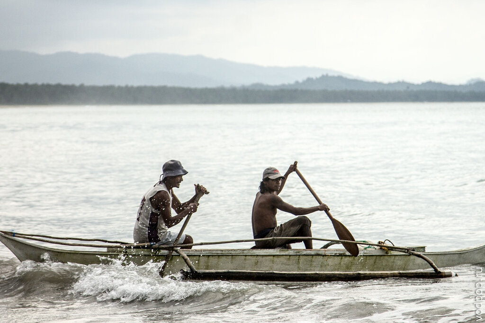Кстати, тут есть небольшая хитрость. Если вы снимаете на цифру (не так жалко, как пленку) и нашли интересный динамичный сюжет, обязательно сделайте подряд 3-4 кадра. Позже, при обработке фотографий, вы сможете выбрать наиболее динамичную из них. Например ту, на которой весло находилось высоко над водой.
- **Сходящиеся линии.** Сходящиеся линии на фотографии создают ощущение объема. Причем, это могут быть не только линии стен или потолка. Это могут быть и линии из ритмично повторяющихся объектов, например, кирпичные колонны [Древнего города](https://vodpop.ru/drevnij-gorod-bangkok/ "Достопримечательности Бангкока. Парк «Древний город» в Бангкоке") 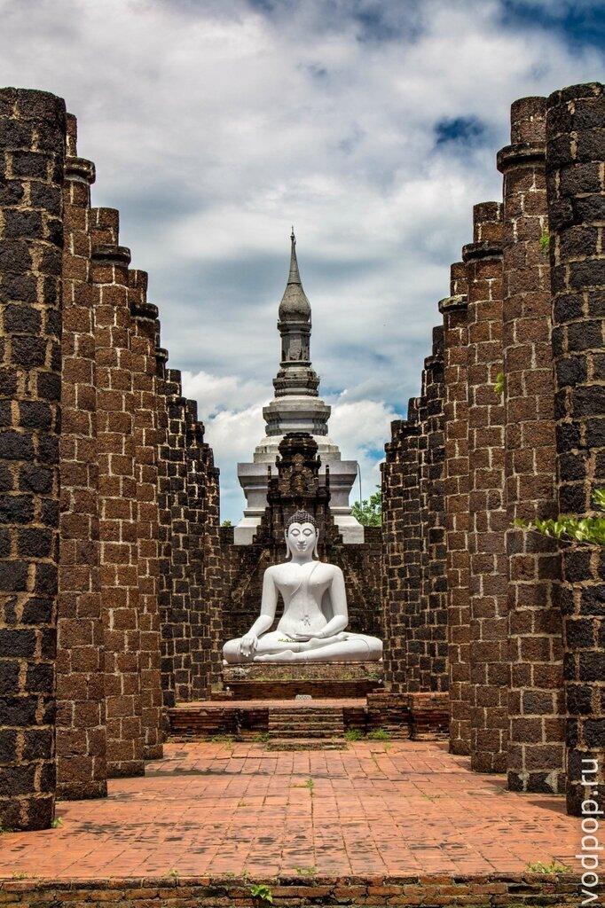Но просто сходящихся линий обычно недостаточно, чтобы сделать красивую фотографию. Нужен какой-то объект, который нарушает ритм и "портит" нашу геометрическую идиллию Будет здорово, если этот "объект-нарушитель" будет сам по себе источником какой-то необычной формы, сочетания цветов или эмоции 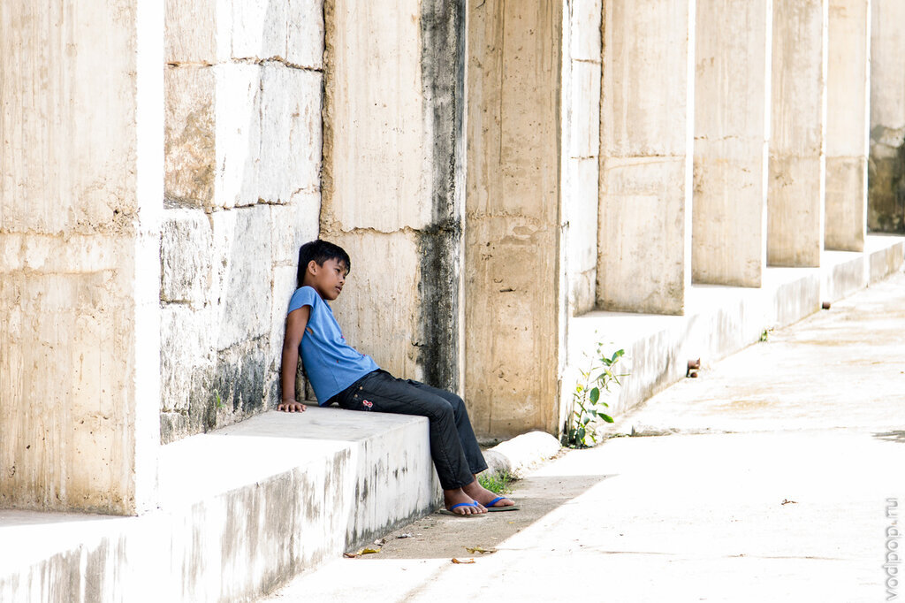

## Заключение

В этой статье я рассказал, как сделать красивую фотографию за всего за три шага на любом оборудовании, даже на "мыльнице" в автоматическом режиме. Разумеется, есть еще сотни других приемов, есть еще такие важные элементы фотографии, как свет, цвет и форма. Но уже трех шагов из этой статьи достаточно, чтобы пойти и прямо сейчас сделать красивую фотографию.

Также важно понимать, что в фотографии любое отклонение от классических приемов, дающее интересный результат - это не нарушение правила, а лишь еще один прием. Больше путешествуйте. Больше фотографируйте. Творческих успехов, друзья!

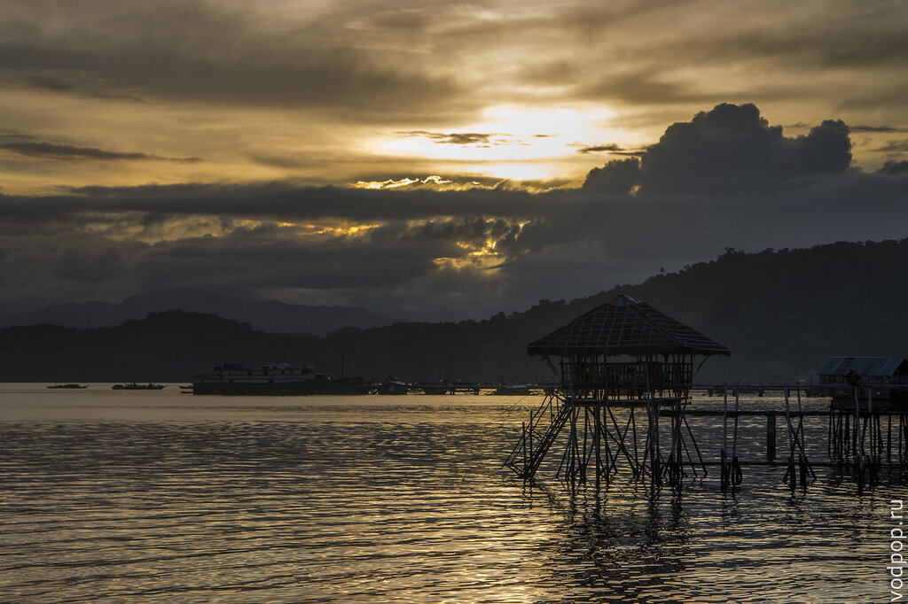

Кстати, все фотографии-примеры из этой статьи отсняты мной буквально на днях на Филиппинах. [Смотрите больше красивых фотографий из нашего путешествия](https://vodpop.ru/category/%D0%B0%D0%B7%D0%B8%D1%8F/ "Фотографии из Путешествия по Азии").

Обо всех новых статьях и о том, как мы переживаем [тайфун на Филиппинах](http://vk.com/vodpop "Вчера через нас прошел тайфун Хаянь. Все живы") можно узнать, вступив в нашу [группу ВКонтакте](http://vk.com/vodpop "Не забывайте вступать в нашу группу ВКонтакте!").

P.S. Если кому интересно, посоветую в комментах пару книжек для старта и оборудование под ваш бюджет.
