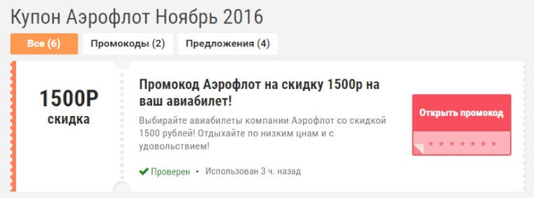

Любое путешествие подразумевает траты на отели, билеты, трансферы. Мы уже рассказывали вам о способах экономить на перелетах, а сегодня хотим поделиться еще несколькими вариантами, которые вы найдете ниже.

## <!--more-->**Промокоды для экономии на билетах**

На помощь приходят специализированные сервисы, когда нам нужно найти промокод. Мы обычно пользуемся Cuponation. Этот сайт собирает скидки, которые можно использовать, заказывая что-то в интернете, в том числе и билеты.

**Как забронировать билеты со скидкой:**

Заходим в раздел каталога «Путешествия» и смотрим, какие сейчас действуют предложения, а потом выбираем, какое подходит лучше всего, можно искать по названию авиакомпании или привычного сайта бронирования. Планируете лететь Аэрофлотом - пригодится такой [промокод](https://www.cuponation.ru/aeroflot-bonus).

Пользоваться сервисом просто: когда вы кликнете на интересующий вас купон, сайт автоматически перенаправит вас на страницу бронирования билетов. Так получится сэкономить и на авиабилетах, и на поезде: там найдутся промокоды для заказа на Tutu.ru. Еще на сайте встречаются спецпредложение, воспользовавшись которыми по выгодной цене можно купить не только билеты, но и туры. Например, с помощью Travelata.ru

## **Cash-back service для экономии на проживании**

Отели, хостелы, апартаменты, даже квартиры с Booking.com – на любом варианте проживания в поездке, который вы предпочитаете, тоже можно сэкономить с помощью Сash-back сервиса. При оплате картой вы получаете определенный процент от стоимости назад: [здесь](https://cashback.ru/Booking.com) можно вернуть больше 3% от суммы, которую вы заплатили.

Это не сложно: переходите с сайта на интересующий вас ресурс, оформляете покупку там, как вы обычно это делаете. Магазин передает информацию о вашей покупке кэш-бэк сервису, он, в свою очередь, возвращает комиссию на сайт сервиса. Просто выведите ее на вашу карту или онлайн-кошелек. Удобно то, что оплатить можно сразу через интернет или при получении наличными.

## **Акции компаний для экономии на поездках внутри страны**

Давайте не будем забывать о передвижении в стране, в которую хотим отправиться. Вы когда-нибудь слышали об автобусах-лоукостерах? Если нет, то вам [сюда](http://vandrouki.ru/category/drugie-aktsii/avtobusyi-i-poezda/). На сайте собраны предложения внутренних перевозчиков разных стран мира, воспользовавшись которыми, вы сможете путешествовать почти даром. А куда уже направиться - из Москвы в Киев или из Польши в Бельгию - решать вам. Советуем регулярно проверять подобные ресурсы.

И, конечно, не забывайте пользоваться нашими советами по [поиску самых дешевых билетов](https://vodpop.ru/kak-kupit-samyie-deshevyie-aviabiletyi/). У вас тоже есть подобные полезные лайфхаки в арсенале? Тогда не стесняйтесь и делитесь в комментариях!
