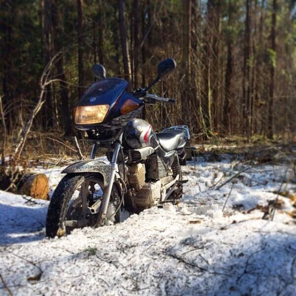
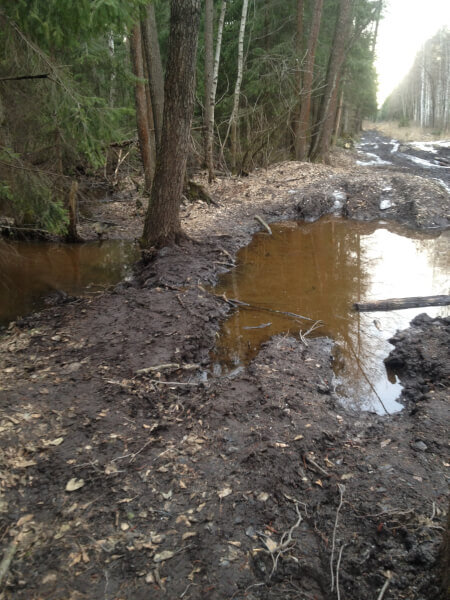
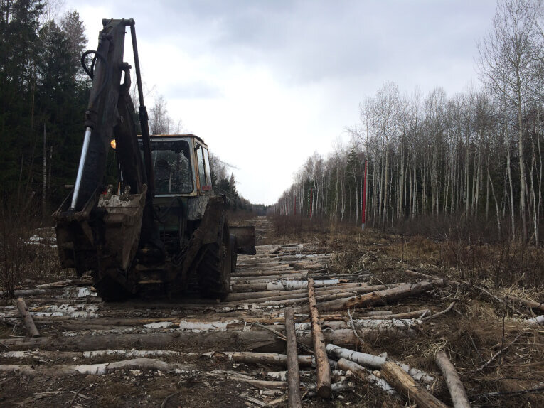
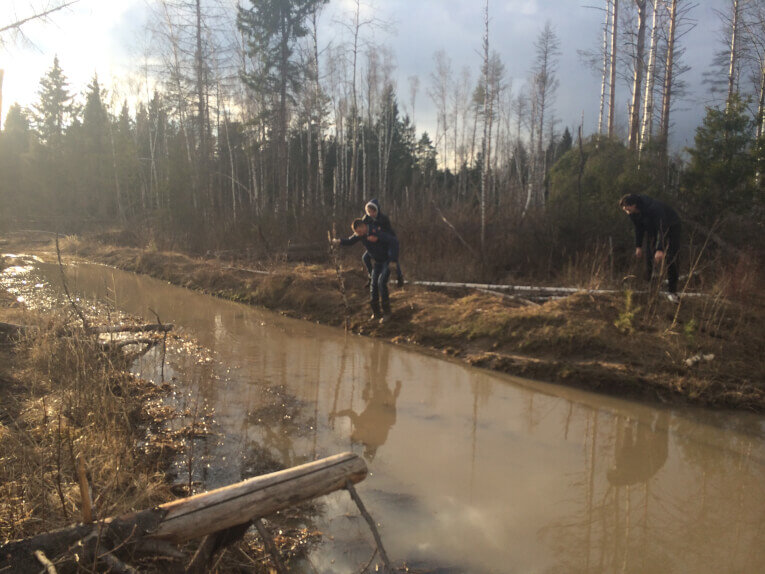
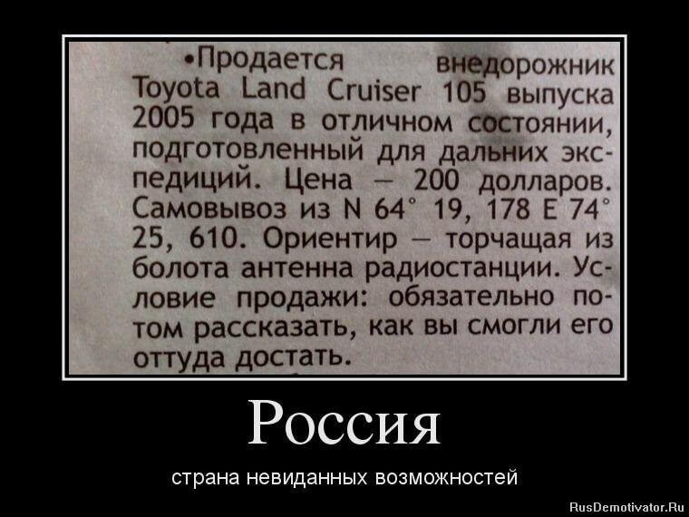
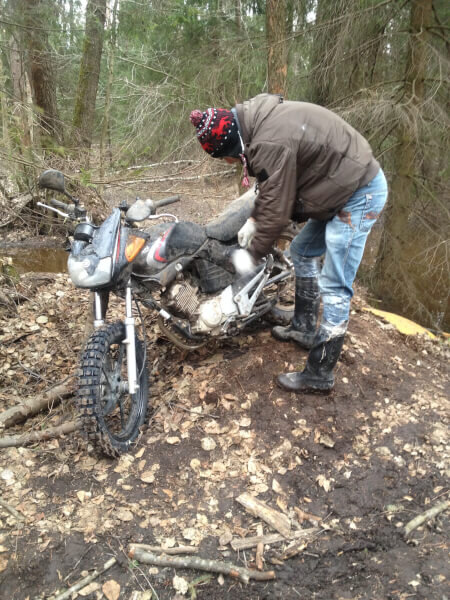
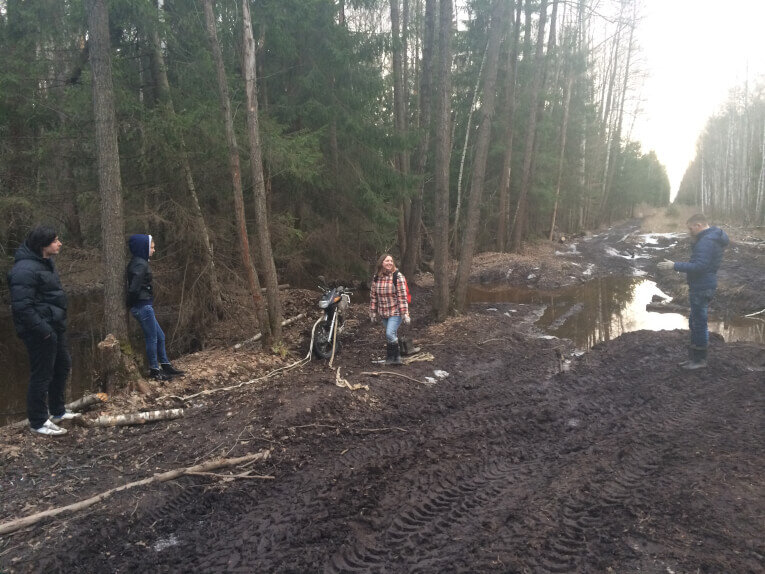
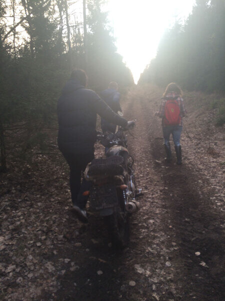

Фотоочерк выходного дня. Краткая предыстория - Клим на прошлой неделе купил новую злую резину (я называю ее "мохнатой") и пару деталей, чтобы превратить Yamaha YBR 125 в подобие эндуро.

<!--more-->

Начало было отличным - мотик резво проезжал сугробы и лужи, не пасовал перед ветками и уверенно рыл носом влажную землю

,пока одна из луж не оказалась настоящим болотом, куда Клим соскользнул, благополучно утопив мотоцикл по самый руль, а потом потратил 2 часа на вытаскивание его из этой жижи.

Попытка не удалась, и Клим, забив на металлического друга, побежал (в буквальном смысле) в сторону ближайшего населенного пункта. Кстати, телефон выжил - он был убран в пакетик, и практически не хлебнул воды (включение только с 5ой попытки не в счет). Таксист, приехавший за Климентием, был бы рад отказаться от такого пассажира - мокрого, в плащ-палатке, покрытой слоем грязи из болота с соответствующим ароматом.

На следующее утро Клим вместе с папой поехали искать тракториста, но тот проехал с километр и дальше ехать отказался.

Следующую попытку вытащить мы предприняли вдвоем - нашли телефон некого Евгения, который через час приехал вместе со своими друзьями, и веселой компанией мы пошли гулять в лес в поисках болота, в котором покоилась Yamaha. Через час увлекательной прогулки с перепрыгиванием с лужи на лужу под искрометные шутки Жени и его друзей, в которых читался немой вопрос "на кой черт ты утопил свой мотоцикл в лесу", мы нашли своего железного друга.

Всю дорогу я вспоминала некогда очень популярный демотиватор

Но случилось чудо: мотоцикл стоял, заботливо прислоненный к дереву - некто очень добрый вытащил его на сушу. Мы предположили, что это квадрациклисты, которых Клим встречал в тот день в лесу. Кто бы ты ни был, наш таинственный друг, СПАСИБО тебе огромное!

Дальше задача была нехитрая - надо было дотащить Yamaha до Газели.

Для этого к передней вилке мы привязали веревку - один тянул спереди, второй держал за руль, а третий толкал сзади. Прямо как в басне "Лебедь, рак и щука". Думаю, пояснять, почему двигатель не завелся, не нужно

Через час мы наконец вышли из леса (правда, очень далеко от припаркованной Шкоды и Газели), откуда ребята позвонили своему другу-таксисту. Затем были круги по Электроуглям - сначала мы забрали машины, потом погрузили в них мотоцикл, а потом поехали разгружаться в гараж в Монино.. На все это у нас ушло 5 часов (плюс те 2 часа, что Клим пытался сам вытащить мотик и время с трактористом). Удовольствие обошлось нам в 5200 рублей, но мы получили столько веселья, сколько ни за какие деньги не купишь. Ребята, которые помогали тащить мотоцикл явно обзавелись темой для обсуждения на ближайшие пару недель.

Нервный смешок вызвала последняя фраза от Жени: "Ты только на машину злую резину не ставь...". Да уж, не будем!

Продолжение следует... (та часть, где мы разбираем мотоцикл до винтиков)
