Обычно мы довольно редко расписываем прелести нашего жилья - оно меняется довольно быстро, гостиницы сменяются гестхаусами, гестхаусы хостелами, хостелы на резорты... Словом, про все наши места ночевки и не вспомнить. Но удержаться от небольшой восторженной статьи в пользу нашего кондо, в котором мы провели целых два месяца, просто не смогли. Итак, лучший кондоминиум на Пхукете - Chaofa West Suites.

<!--more-->

Возможно, критики сразу скажут "да вы даже других кондо не видели!", и будут по-своему правы. Так получилось, что из [Бангкока](https://vodpop.ru/bangkok-otzivy/ "Наши впечатления от Бангкока") мы поехали на Краби, известное место для зимовки среди путешественников и фрилансеров. Однако мы приехали в начало высокого сезона и не учли, что благодаря нарастающей популярности этого места, в Краби ломанулись сотни и тысячи туристов (два прямых рейса в неделю из Москвы по 500 человек каждый).

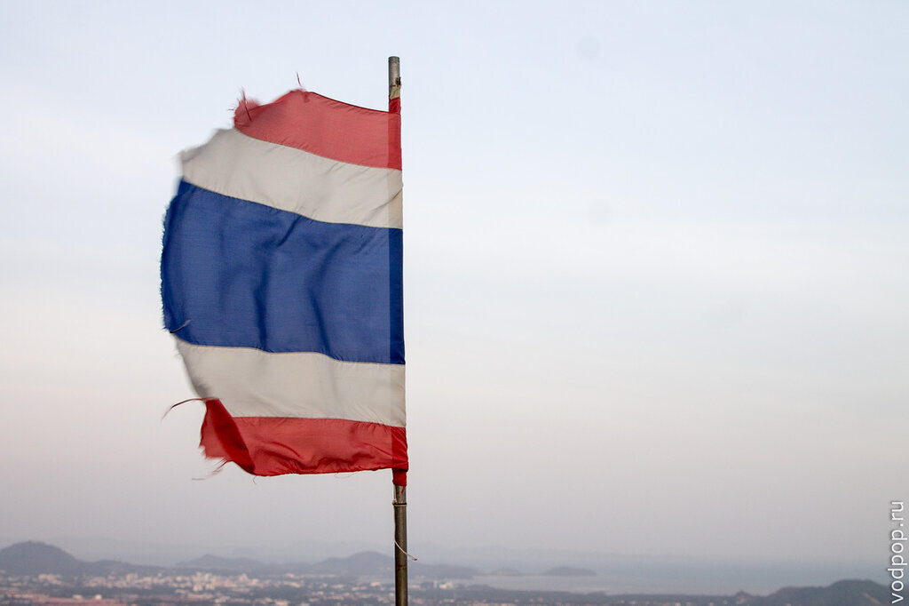

В общем, к моменту нашего появления, жилья свободного не было, а то, что было, резко подскочило в цене буквально за неделю до нашего приезда. Помаявшись 4 дня, мы решили, что с нас хватит поисков, и стали искать варианты на [Пхукете](https://vodpop.ru/ezhegodnaya-yarmarka-v-vat-chalong/ "Ежегодная ярмарка в Ват Чалонг на Пхукете").

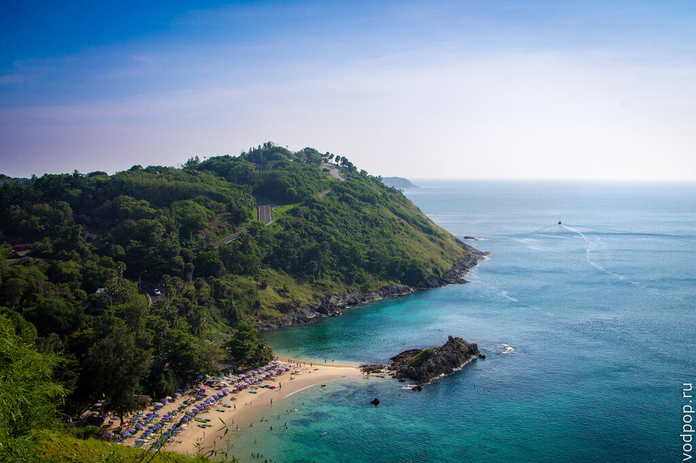

Изначально у меня был немного негативный настрой к Пхукету - я слышала про это место, известное своими отелями, вечеринками и толпами пьяных соотечественников на Патонге. Но, к счастью, это оказалось лишь одной стороной медали - для себя мы открыли все радости пребывания на Пхукете в виде [огромных песчаных пляжей](https://vodpop.ru/ostrov-bon/ "Остров Бон. Самый безлюдный остров на Пхукете"), чистейшего моря, [множества достопримечательностей](https://vodpop.ru/bolshoy-budda-na-phukete/ "Большой Будда на Пхукете. Покатушки на слонах и прекрасный вид на город"), а уровень комфорта и уюта в кондо добавлял приятных эмоций.

Вопрос решился довольно быстро - поиск в интернете занял несколько часов, после которых я наткнулась на сайт [http://chalongapartment.com/](http://chalongapartment.com/) , где были отличные фотки всех доступных вариантов размещения, актуальные цены и телефон для связи. Мы не стали терять время, созвонились с хозяйкой, которая шикарно говорила по английски, и забронировали жилье на месяц (спустя несколько часов, которые занял автобус Краби-Пхукет).

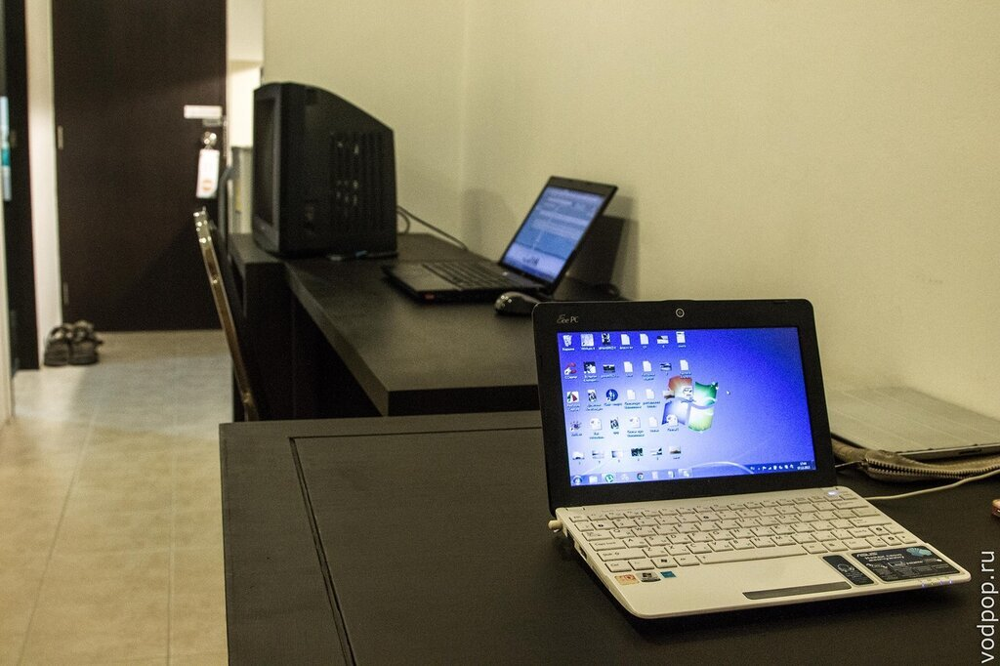

По приезду на Bus Terminal 2, на нас накинулись таксисты, которые предлагали за 500(!!!) бат довезти нас до нашего кондо, расположенного в районе Чалонг-Раваи. Мы пришли в тихий ужас, так как такси в Бангкоке стоило куда меньших денег, чем здесь. Как бы то ни было, двумя сонгтэо мы добрались до развилки на Биг Будду - это самая ближняя достопримечательность к нашему кондо, благодаря чему мы посещали это место минимум раз 5.

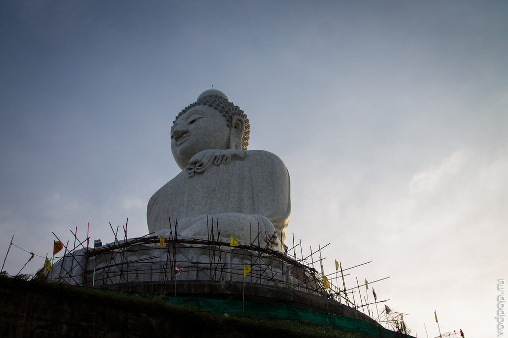

Кондоминиум располагается в нескольких зданиях, и мы успели пожить в двух из них. Что крайне удобно, прямо в кондо можно арендовать байк: мы сняли Honda Click, который стал нашим незаменимым спутником на все время пребывания на Пхукете. Аренда в месяц - 3000 бат. На фото процесс моего обучения на парковке Tesco.

[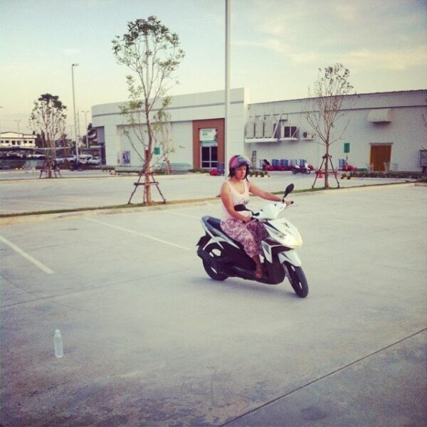](https://vodpop.ru/wp-content/uploads/2014/02/klik.jpg)

Улыбчивая тайка на ресепшн тоже неплохо говорила на английском, показала нам студию и бассейн на крыше.

**По ценам:** 13500 (маленькая студия)+вода, электричество (у нас нагорало на 1500 бат) + 500 бат постельное белье. Интернет бесплатно. Уборка бесплатно, два раза в неделю (по расписанию).

Студия после нашего заселения. Справа небольшая кухня: холодильник, микроволновка, раковина. Рисоварку мы докупили сами (300 бат). Вся посуда есть - ложки, тарелки, вилки, чашки

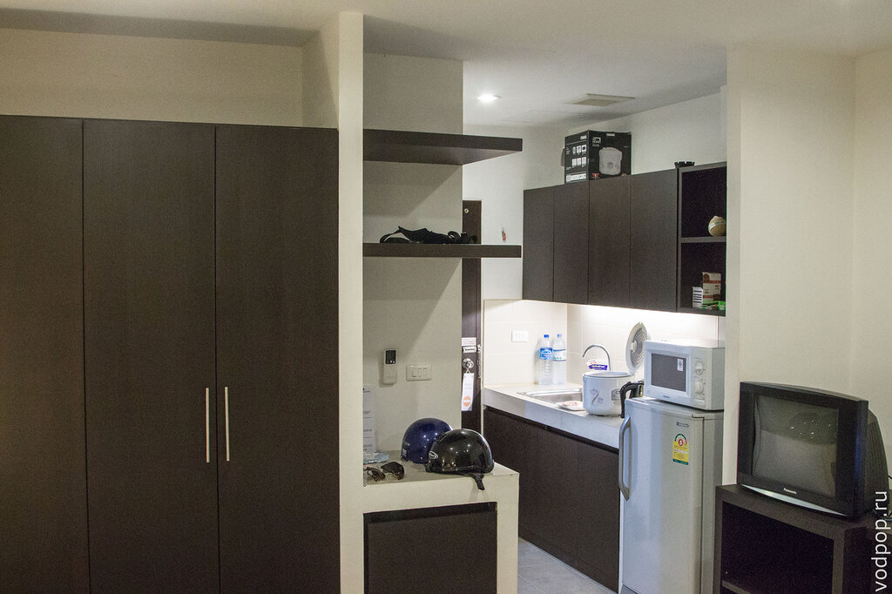

Кровать кинг-сайз. Постельное белье  стоит дополнительных 500 бат, меняют два раза в месяц.

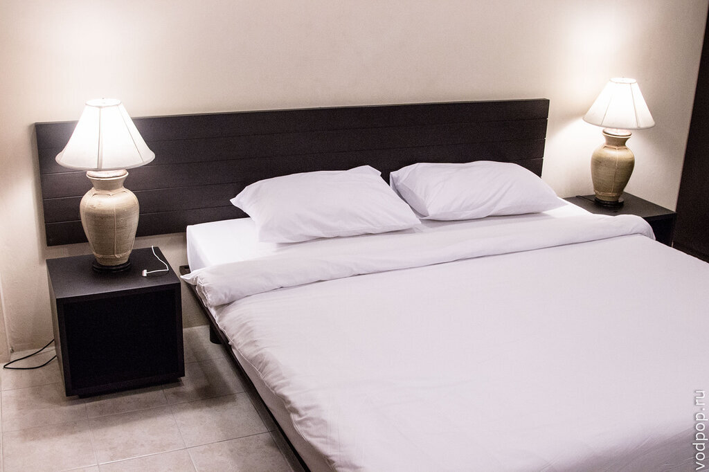

Шкаф для вещей с подсветкой, реагирует на открытие дверцы. Есть вешалки. Куча всяких полочек-тумбочек. Есть телевизор, даже русские каналы были. Мы включили его ровно один раз, а потом убрали в шкаф.

Нравится статья? Узнавайте первым о выходе новых интересных историй! Подпишитесь на нас по [эл. почте](http://feedburner.google.com/fb/a/mailverify?uri=vodpop&loc=ru_RU) или в [группе ВКонтакте](http://vk.com/vodpop)

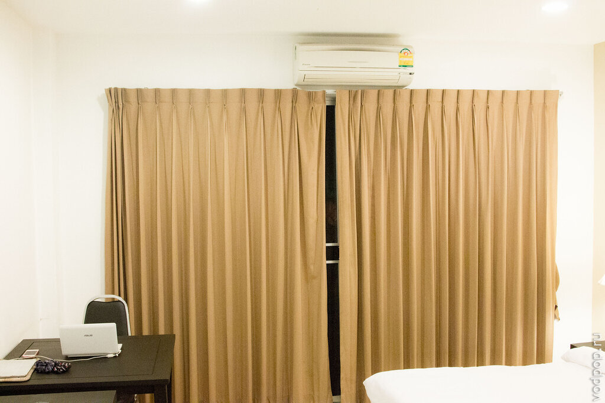

Кондиционер работал без нареканий. В комнате также есть два рабочих стола, два стула. Стеклянные двери ведут на балкон, есть москитные панели, но мы большую часть дня сидели в кондиционере, так как было очень жарко.

Интернет работал почти без нареканий, 5 мегабит. Иногда рандомно падал - мы выходили в коридор и перезагружали роутер, который висел как раз рядом с нами.

В ванной комнате все довольно стандартно - душ с занавеской, туалет, раковина с тумбочкой внизу. Полотенца предлагаются за доп. плату, но мы пользовались своими.

[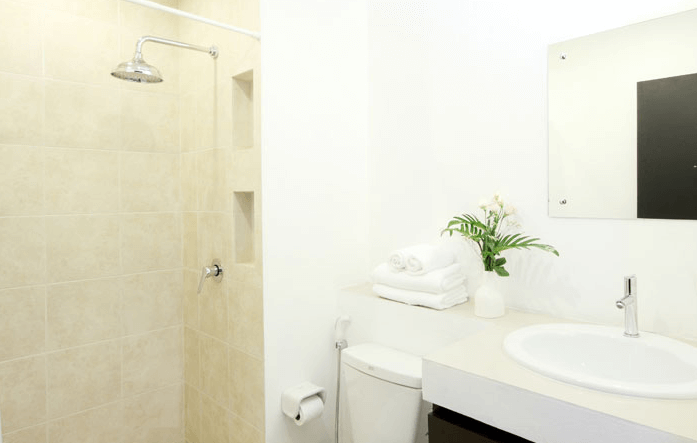](https://vodpop.ru/wp-content/uploads/2014/02/vanna.png)

На крыше был бассейн, вокруг шезлонги и есть деревянная беседка, где можно посидеть.  Бассейн очень неглубокий - около метра, но охладиться днем - самое то. Хотя мы предпочитали море.

[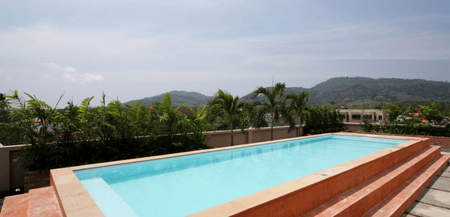](https://vodpop.ru/wp-content/uploads/2014/02/basseyn.png)

Крыша беседки немного просвечивает, поэтому экран бликует даже на Ipad. А вот с бумажной книжкой будет приятно там посидеть. Вечером атакуют комары из расположенных по соседству джунглей, поэтому купите спрей в ближайшем магазине 7-11 (Seven-Eleven)

[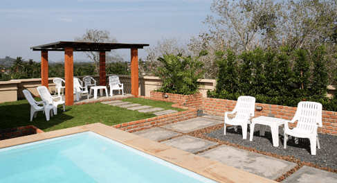](https://vodpop.ru/wp-content/uploads/2014/02/terrasa.png)

Для тех, кто любит похулиганить - на крыше есть еще одна небольшая пристройка, где находится флюгер и антенны. Туда можно забраться из окна туалета на крыше, вскарабкавшись затем по пожарной лестнице на самый верх. Оттуда открывается чудесный вид на 360 градусов на Пхукет.

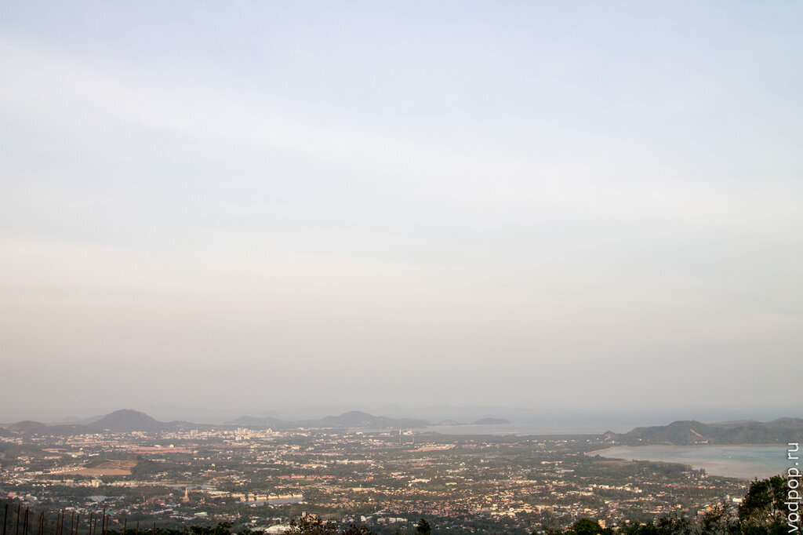

Мы справляли там Новый Год-2014, затащив стулья и стол. Вид был прекрасный - ночное небо, кругом салюты и многочисленные китайские фонарики. Единственное, что во время спуска обратно мы обнаружили, что кто-то очень добрый закрыл окно в туалете, и Климу пришлось карабкаться в обход.

Второй месяц мы жили в Chaofa West Studios, которая также зовется Phompassorn, в комнате чуть больше предыдущей. Меблировка такая же, только расположение другое. Ну и во втором здании чуть более глубокий бассейн, а рядом с беседкой еще стоит электро-гриль (можно пользоваться бесплатно). Стоила вторая студия 16600. Депозит все тот же - 5000 бат, отдается при выселении.

Цены на коммунальные услуги:

- Электричество - 6 бат
- Вода - 15 бат

По соседству много местных кафешек с дешевой и вкусной едой, а также в лобби каждого из зданий кондо стоят стиральные машинки по 20 бат(10 кг).

Словом, мы остались в диком восторге! И кондоминиум на Пхукете Chaofa West Suites был для нас №1, пока мы не заселились в шикарный кондо [The Shine в Чианг Мае](https://vodpop.ru/shine-condominium-v-chiang-mae/ "Shine Condominium в Чианг Мае. Как найти жилье на севере Таиланда").

## Как добраться до Пхукета из России

Самый простой (и дорогой) способ — самолетом. Актуальные цены приведены в календаре:

Можно сэкономить примерно 3-4 тыс. руб., если лететь до Бангкока самолетом, а оттуда сесть на ночной автобус до Пхукета (стоит около 900 руб.). Цены на авиабилеты до Бангкока:

А если хотите сэкономить еще больше, рекомендую ознакомиться с набором приемов, которые мы используем для вылавливания самых дешевых авиабилетов: [Самые дешевые авиабилеты: 6 способов сэкономить до 50%](https://vodpop.ru/kak-kupit-samyie-deshevyie-aviabiletyi/)

До новых встреч!
