Если вы уже долго путешествуете по Азии, то королевская вилла Doi Tung поможет вспомнить, как выглядят уютные скандинавские домики, голландские оранжереи, европейские тротуары и почувствовать запах настоящего эспрессо. <!--more--> Одна дорога уже приводит в восторг: мы решили поехать на Doi Tung сразу после посещения [Белого](https://vodpop.ru/chiang-ray-belyiy-hram/ "Чианг Рай. Белый храм") и [Черного](https://vodpop.ru/chiang-ray-chernyiy-hram/ "Чианг Рай. Черный храм: самый жуткий храм Таиланда") храмов в Чианг Рае - освежающие потоки ветра и открывающиеся перед нами виды на горы заряжали своей энергией. 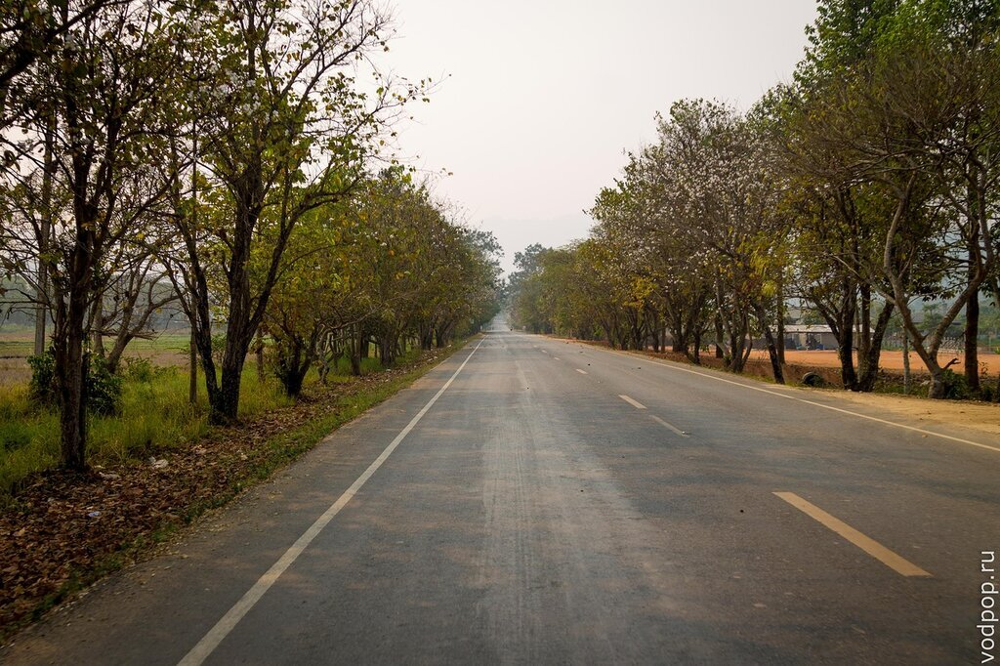

Эмоциональная составляющая путешествий - это самое трудно поддающееся описанию. Все слова неспособны описать какое-то клокочущее состояние внутри. когда от восторга глаза боятся лишний раз моргнуть, а легкие дышат чаще, чтобы запомнить все запахи этого ощущения.

Оно иногда настигает нас спонтанно - ты можешь идти по своему родному городу, и вдруг - БАМЦ! - оно настигает тебя, и ты радуешься, как ребенок, что ты живешь на этой планете, что у тебя есть ноги, глаза и уши, чтобы в полной мере наслаждаться моментом.

И именно такой восторг я испытала, когда мы забрались на вершину Doi Tung

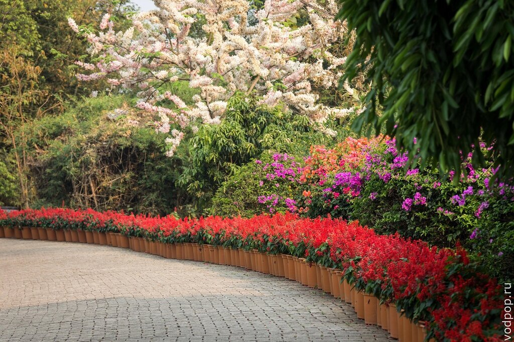

Потрясающие цветочные клумбы словно выверены по линеечке, а обилие видов приводит в восторг не только ботаников

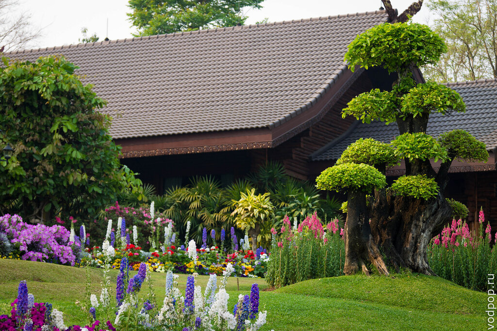

Я долго смотрела на анютины глазки и вспоминала, как мы с мамой сажали их на даче, пока не пришло осознание, что анютины глазки уж точно не растут в Таиланде. Оказалось, что королева Синакхаринтхра - мать двух королей страны улыбок, очень любила цветы и во время своих заграничных поездок искала самые красивые виды, а затем привозила саженцы и обустроила на вершине Doi Tung ботанический сад Mae Fah Luang, открытый круглый год для посетителей , чтобы тайцы, мало путешествующие за границу, могли познакомиться поближе с самыми красивыми растениями со всех уголков мира.

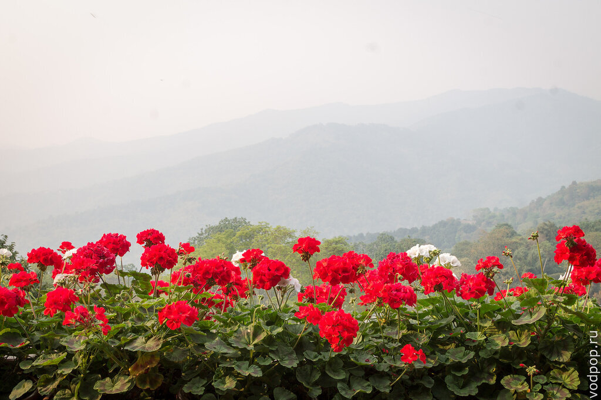

На территории парка находится королевская резиденция - Doi Tung Royal Villa, ставшая откровением после европейских и российских резиденций.

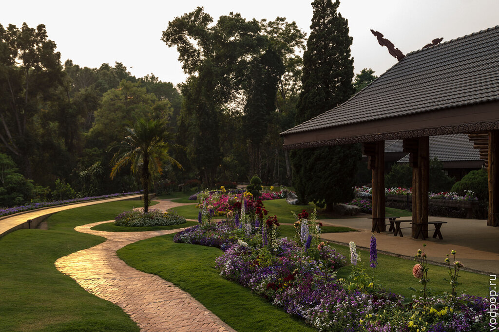

Резиденция представляет из себя очень аккуратный домик в скандинавском стиле, обилием цветов как высаженных вокруг, так и растущих внутри в горшках.

На входе вас попросят снять обувь - полы идеально чистые, поэтому бояться не нужно. Для обуви выдадут отдельный мешок, с которым вы можете ходить по залам. Для взрослых вход в дом стоит 90 бат: за эти деньги вы получаете аудиогид (есть на русском), и можете самостоятельно ходить по всем открытым комнатам в доме. Резиденция открыта для посетителей круглый год, кроме тех дней, когда сюда приезжает королевская семья. Внутри фотографировать запрещено, поэтому фотоаппарат мы доставали только на балконе.

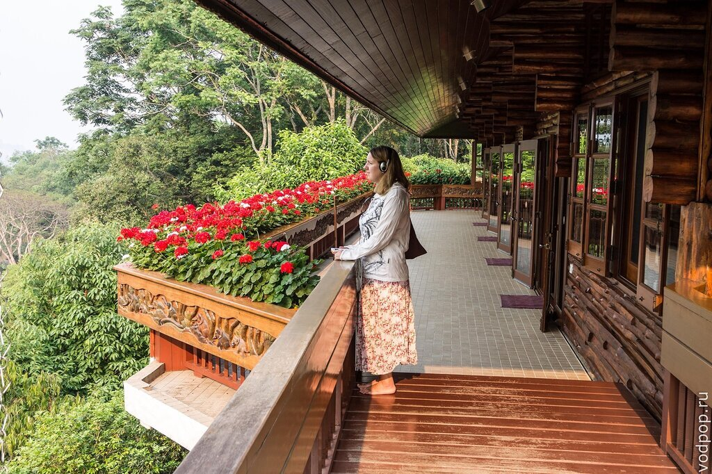

История королевской семьи меньше всего похожа на мемуары несуществующих людей - наоборот, проходя мимо той или иной комнаты, я понимала, что здесь жили реальные люди - королева любила вышивать и увлекалась ботаникой, ее супруг писал книги, а сыновья занимались за столом, стоящим около стены. У них была хорошая библиотека и старенький телевизор. Я чувствовала, что здесь жили хорошие, добрые люди, хотя и жили они в трудные времена: Doi Tung находится на границе Золотого Треугольника - места, где соединяются три страны: Таиланд, Лаос, Мьянма. В 20 веке здесь возникло производство опиума, которое погубило тысячи и тысячи жизней.

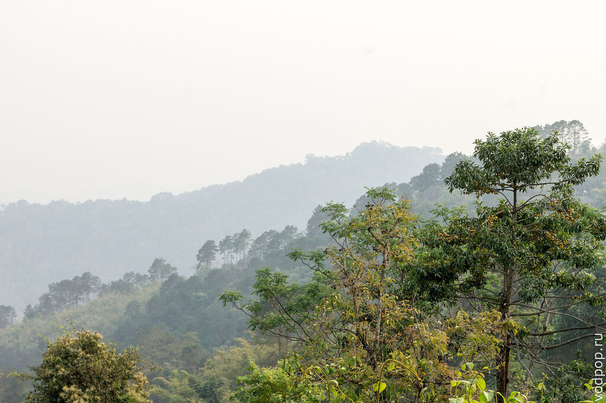

Местные до сих пор говорят об этом с грустью, вспоминая тяжелые для страны времена. Были те, кто продавали наркотики, но куда больше людей употребляли их, чем наносили себе и будущим поколениям непоправимый вред. Неподалеку открыт музей Опиума, куда мы не стали заезжать - я не очень люблю смотреть на подобные вещи, так как тянет плакать от бессилия - ведь время не повернешь вспять, и лучшее, что мы можем делать - это подавать хороший пример нынешним и будущим поколениям.

Так решила и королевская семья, поэтому помимо борьбы с наркотиками в буквальном смысле, они оказывали медицинскую помощь всем нуждающимся в те страшные времена. И до сих пор в королевской резиденции есть небольшой медицинский пункт. Однако, врачей на местах застать не так-то просто: королевская семья спонсировала покупку мобильной больницы, и эта больница на колесах ездит по всей стране и оказывает бесплатную медицинскую помощь для всех нуждающихся.

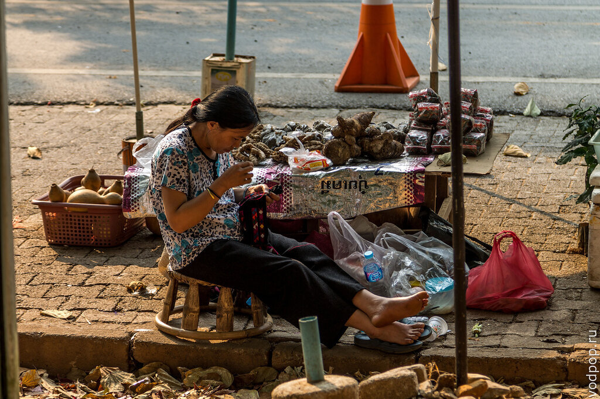

Еще немного сказочного вида на резиденцию при предзакатных лучах солнца.

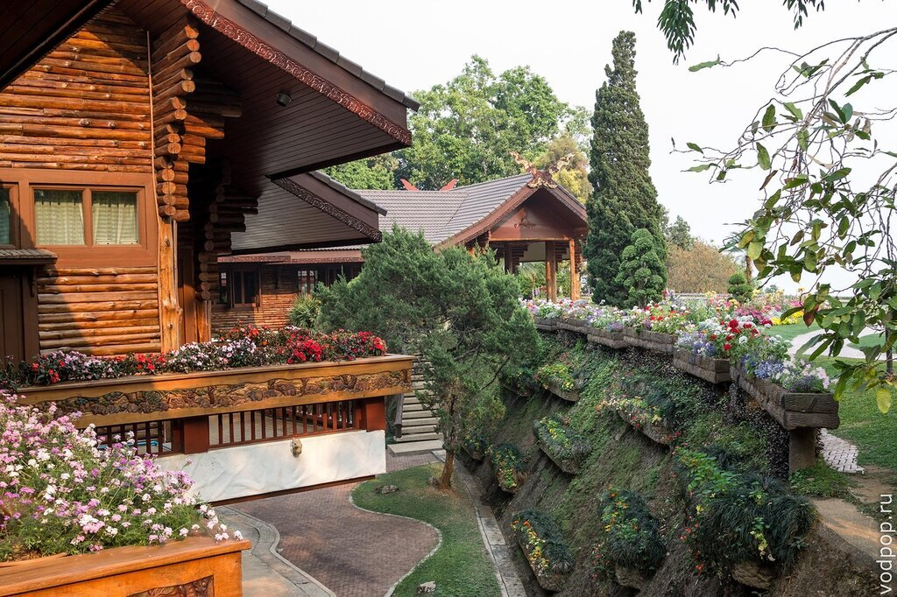

После прогулки по саду и резиденции, мы решили побаловать себя чашкой кофе с орехами, выращенными на склоне горы Doi Tung.

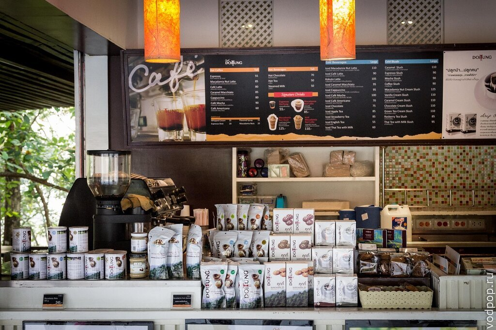

Рядом сидят мьянмки, продающие чай, травяные смеси и коренья. Мы купили немного чая, так это большая редкость в Таиланде - обычно мы довольствовались Липтоном из пакетиков.

Между кофейней и рыночным развалом находится небольшой цветочный магазин - здесь можно купить семена всех растений, которые вы увидите в парке. При входе растет очень необычное растение, название которого мы так и не смогли узнать - на английском его никто не знал, а тайский мы не понимаем.

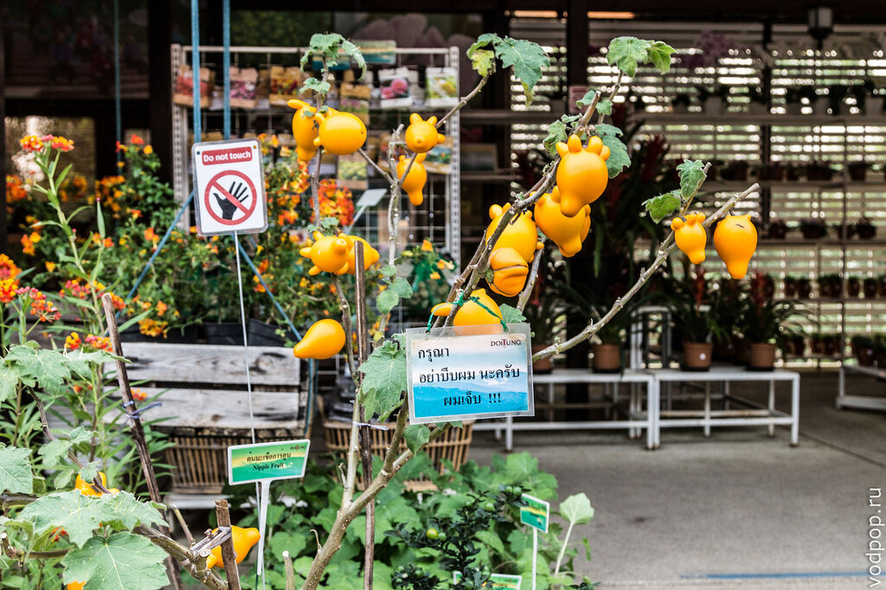

Может, кто-то из наших читателей знает, что это за плод?

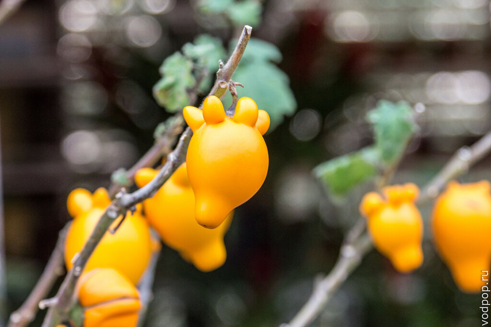

Ниже прикрепляю карту Doi Tung

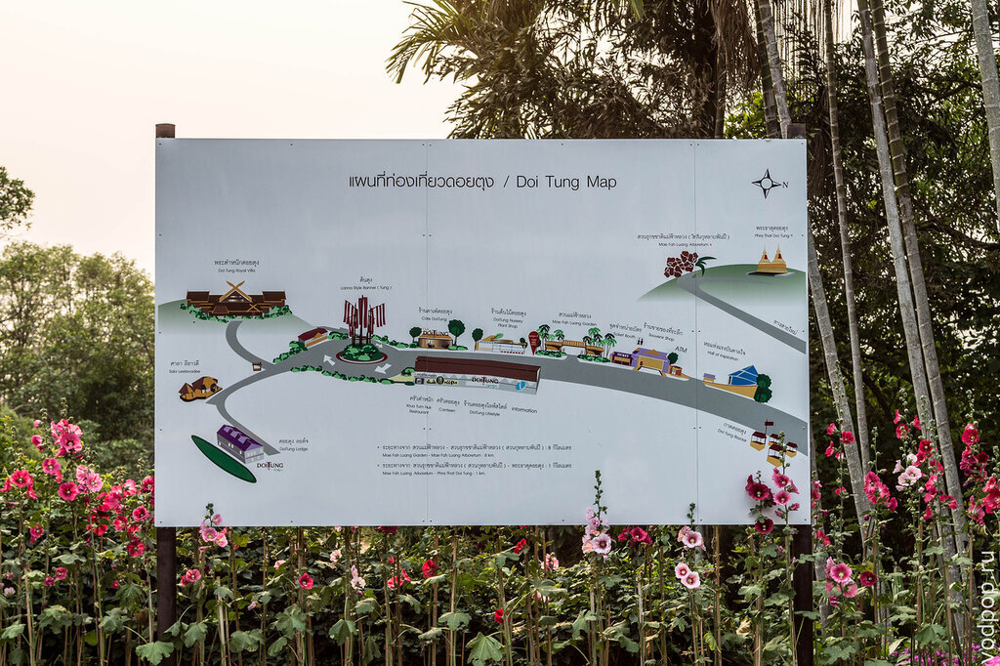

Как добраться - 50 км на Север от Чианг Рая

<iframe style="border: 0;" src="https://www.google.com/maps/embed?pb=!1m29!1m12!1m3!1d239798.69161776867!2d99.69228115645458!3d20.09836585710713!2m3!1f0!2f0!3f0!3m2!1i1024!2i768!4f13.1!4m14!1i0!3e6!4m5!1s0x30d706670927ea4b%3A0x386bd811b93aa61e!2sChiang+Rai+Thailand!3m2!1d19.9071656!2d99.83095499999999!4m5!1s0x30d6f0d4e0ec55d7%3A0xe88a28fc5933252e!2zRG9pIFR1bmcgUmVzaWRlbmNlLCBIaWdod2F5IDExNDksIE1hZSBGYSBMdWFuZywgQ2hpYW5nIFJhaSwg0KLQsNC40LvQsNC90LQ!3m2!1d20.289044!2d99.81106299999999!5e0!3m2!1sru!2sru!4v1429531907361" width="600" height="450" frameborder="0"></iframe>
