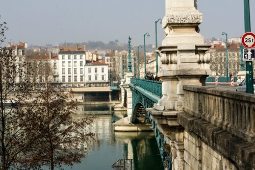
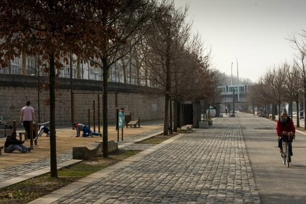
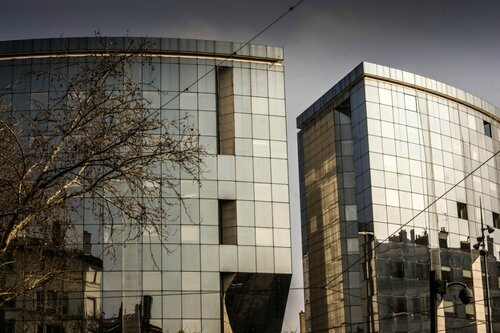
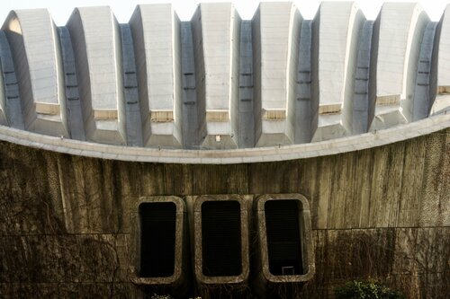
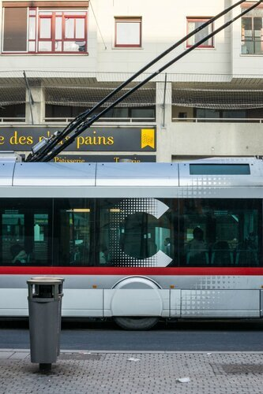
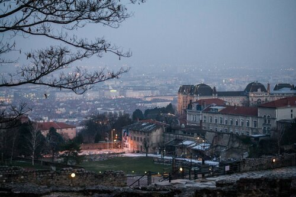

Знакомство с Лионом началось с прогулки по одному из крупных мостов города. Надо заметить, что Лион - промышленный центр, а не туристический. Поэтому мы смогли посмотреть город в его естественном виде.

<!--more-->

Впечатления двойственные, и даже после возвращения не могу понять - понравился мне он или нет. В Лионе все заточено под пешеходов и велосипедистов - машин здесь не так много. Зато куча пунктов проката велосипедов, тренировочных площадок под открытым небом вдоль реки.

На пару с нами по набережной прогуливался лебедь. Он совершенно не поленился выйти на берег и сесть на тротуаре на радость прохожим. Я было хотела его погладить, но внушительный клюв меня немного испугал.

Дальнейший путь проходил через улочки, которые испортили первоначальное впечатление от города - восточные кварталы, где пахло как на рынках специй, висели национальные восточные платья и даже их традиционные свадебные наряды. Причем самих арабов там не было - только товары, но впечатления остались так себе. Я очень обрадовалась, когда мы наконец вышли к торговому центру, где собирались немного обновить наш гардероб. Архитектура очень специфичная - даже не возьмусь назвать все стили, которые мы приметили за день.

Назначения некоторых конструкций остались для нас тайной.

Зато нам понравился общественный транспорт - очень плотная сеть, удобные переходы и стыковки метро-автобус-трамвай-троллейбус. Сам транспорт выглядит футуристично, и не просто так - Лион считается наукоградом Франции.

Мы запланировали вечером уехать в Марсель, поэтому, забрав вещи из гостиницы, пытались успеть подняться на вершину холма Фурвьер. Нас ожидало маленькое испытание - нужный нам фуникулер был закрыт, поэтому мы поднялись только на половину пути и остальную часть шли в горку с рюкзаками, набитыми купленными вещами (которых, к счастью, было не так уж много). Цель на вершине - Базилика Нотр-Дам-де-Фурвьер. Внутрь мы не попали, так как храм был на реконструкции, зато насладились видом на вечерний Лион.

Мы уже понимали, что на этом наше путешествие близится к концу - купив билеты на поезд Лион-Марсель, мы за час с небольшим преодолели 320 км и чудом успели на последний автобус до аэропорта Марселя. В зале ожидания мы провели несколько часов - Клим работал, а я складывала оптимальным образом нам вещи Как оказалось, зря. Ибо в спешке покупая билеты (на одной из остановок поездка Лион-Марсель, ибо в пути на скорости 200 км/ч интернет не работал) мы не обратили внимания, что взяли билеты без багажа. Не сказать, что у нас было что-то ценное, но вещи пришлось опять впихивать таким образом, чтобы наши рюкзаки соответствовали положенному объему ручной клади. Одна из особенностей марсельских таможенников - бзик на жидкости - заставили все запаковать в отдельные пакеты (хотя у меня и так все лежало в спец. сумке). Упаковку йогуртов из 12 штук заставили разломать на 3 части и распихать в разные пакеты. И шарфики! Шарфики они тоже просили снимать. Поэтому лучший наряд для прохождения их таможни - это костюм аквалангиста, желательно без обуви (по умолчанию ты можешь в ней пройти, но она звенела почти у всех - приходилось возвращаться, снимать обувь и идти босиком по кафелю). Впрочем, не смотря на эти мелкие недоразумения, мы не сильно расстроились и обрадовались, когда голос на английском вежливо сообщил, что мы приземляемся в аэропорту Шереметьево.
