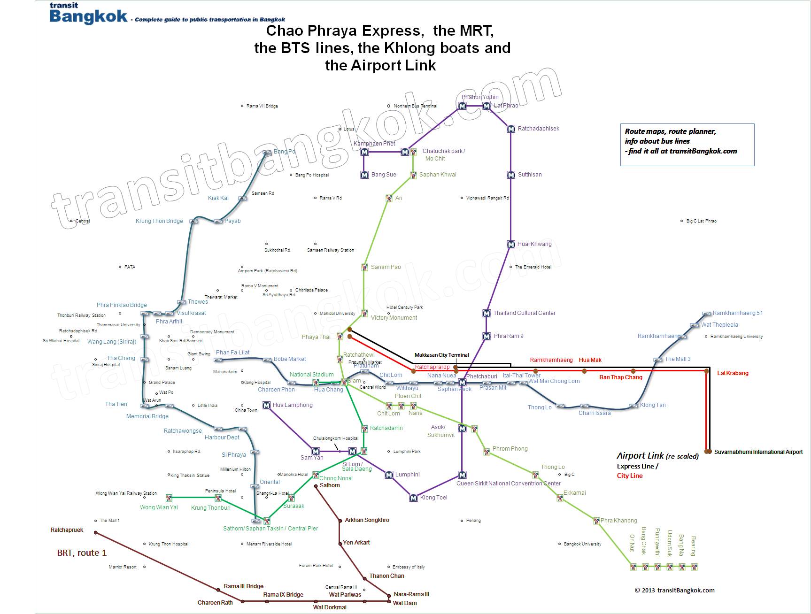
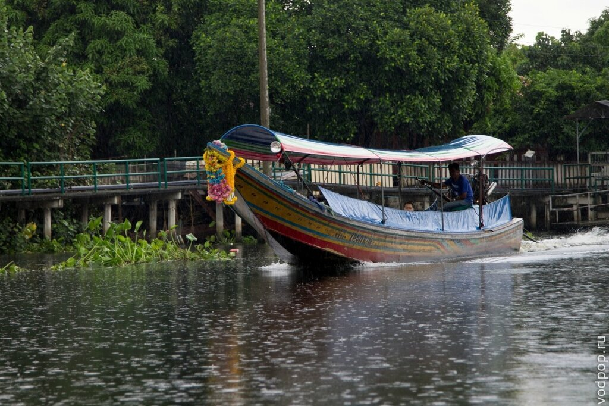
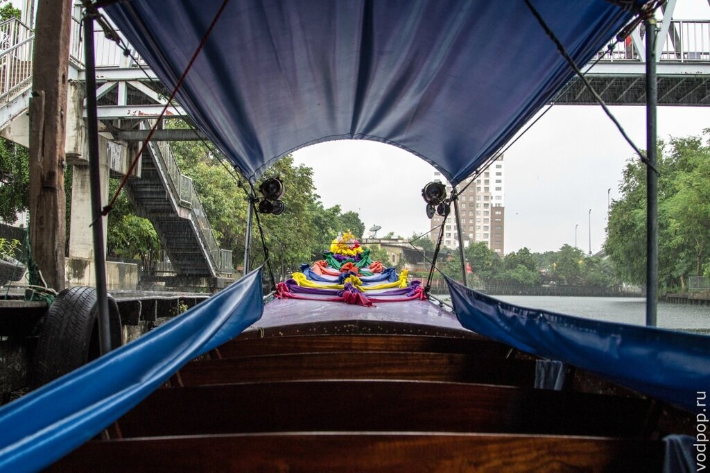
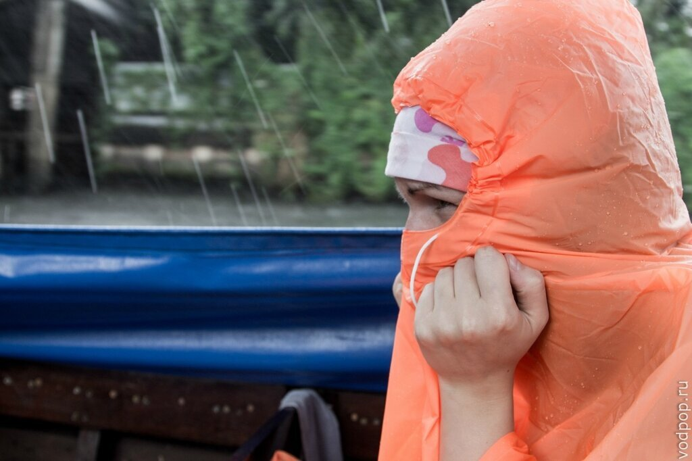
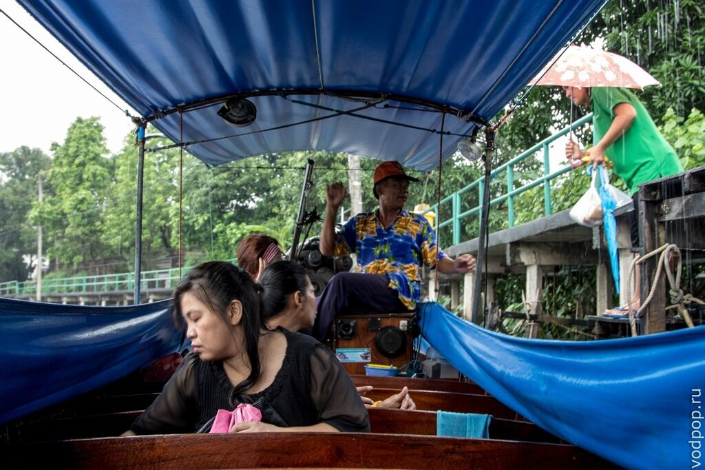
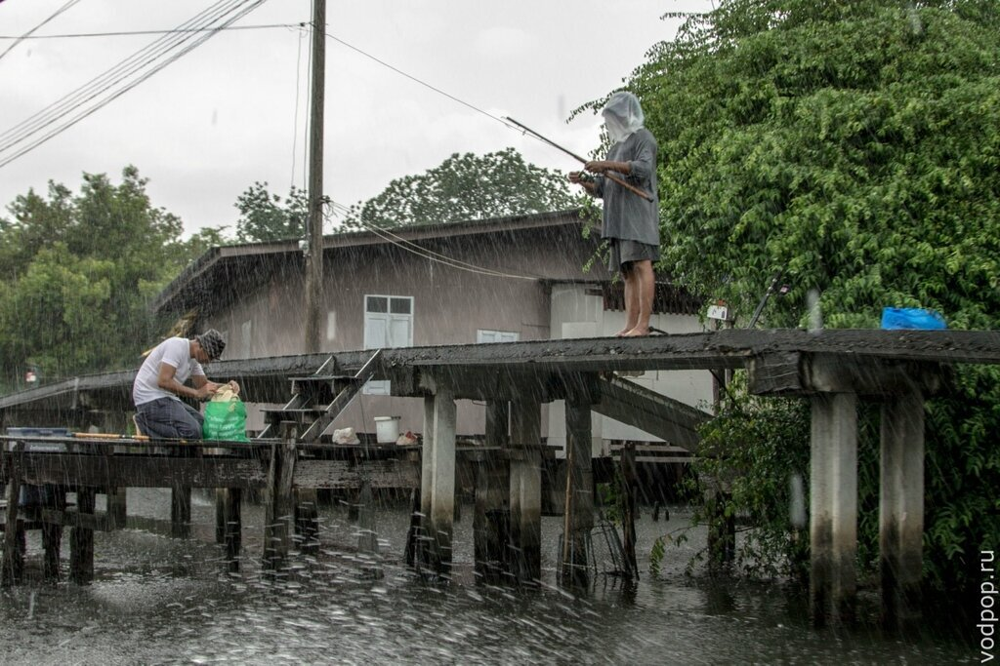
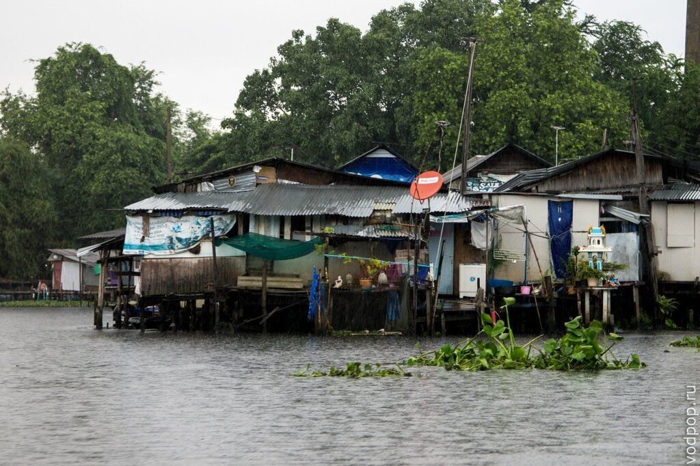

Если вы гуляете неподалеку от станции BTS National Studium или BTS Hua Chang, то вы можете устроить себе незабываемую поездку по каналам реки Чао Прайя и всего за час увидеть потрясающие виды исторической и новой частей города.

<!--more-->

Читайте наши заметки о других видах общественного транспорта в Бангкоке:

[Такси, мото-такси и тук-туки](https://vodpop.ru/taxi-v-bangkoke/ "Такси в Бангкоке")

[Метро](https://vodpop.ru/metro-v-bangkoke/ "Метро в Бангкоке")

[Автобусы](https://vodpop.ru/avtobusi-v-bangkoke/ "Автобусы в Бангкоке")

 

Работать лодки в Бангкоке начинают аж с 5.30 утра и до 20.30 (до 19 по выходным дням). Цена от 10 до 20 бат, а зависимости от расстояния (картинка кликабельна).

Также существуют экспресс-лодки, которые отличаются количеством остановок и скоростью. Бывают 4х видов:

- обычные
- оранжевые
- зеленые
- желтые

Цена колеблется от 10  до 40 бат, билеты покупаются либо в лодке, либо на пирсе. Узнать расписание, цены и посмотреть подробную карту маршрута можно на сайте [http://www.chaophrayaexpressboat.com](http://www.chaophrayaexpressboat.com/)

За 150 бат вы можете купить безлимитный билет на 1 день, чтобы кататься по самому насыщенному достопримечательностями маршруту - увидеть знаменитый храм Ват По, прогуляться по Каосан-роад, увидеть самые известные мосты города Бангкока и купить за копейки потрясающий букет на цветочном рынке. Лодка ходит с 9.30 до 19.30 (картинка кликабельна).

Мы решили погрузиться в жизнь местных, поэтому вместо прогулки по центральным каналам, отправились изучать клонг неподалеку от станции On Nut. Так выглядит лодка снаружи

На такие лодки в Бангкоке обычно ставят двигатели от старых автомобилей. Винт тяги принято выносить на 2-3 метра за корму. Видимо, так лучше управляемость. Внутри лодки очень демократично. Деревянная скамья, по бокам натянута клеенка, чтобы во время дождя вода не затекала в лодку.

Но несмотря на клеенку,  без дождевика во время дождя есть риск промокнуть насквозь.

Нравится статья? Узнавайте первым о выходе новых интересных историй! Подпишитесь на нас по [эл. почте](http://feedburner.google.com/fb/a/mailverify?uri=vodpop&loc=ru_RU) или в [группе ВКонтакте](http://vk.com/vodpop)

Капитан нашего "корабля" управлял, сидя сзади. Он же придерживает лодку, когда мы причаливаем к пристани, чтобы никто не упал.

Типичная пристань. Без дождевика за минуту можно стать насквозь мокрым. Хотя холодно не будет, проверено на себе.

Как живут обычные люди в Бангкоке. Условия, конечно, ужасают. Но люди здесь живут годами, ходят на работу и улыбаются. Все-таки буддизм творит чудеса.

А можно совместить приятное с полезным - например, поужинать на борту вместительного судна, где для вас будут готовить национальные блюда тайской кухни, а вы тем временем будете наблюдать виды ночного города вдоль реки  Чао Прайя. Старт около 18-20 часов, прибытие на берег около 21-22, цена от 1000 бат с человека (700 детский)

Далеко не полный список компаний, которые предлагают подобные услуги:

- [http://www.thaicruise.com/](http://www.thaicruise.com/)
- [http://www.cruise-thailand.com/](http://www.cruise-thailand.com/Chaophraya_Cruise/)
- [http://www.wanfah.in.th/](http://www.wanfah.in.th/)

Если у вас появились какие-то вопросы, задавайте в комментариях - мы обязательно ответим.
