Стартовав из Будапешта, мы все-таки купили виньетку, чтобы быстрее по автобану добраться до столицы Словении - Любляны. Надо сказать, что Словения совершенно случайно оказалась на нашем маршруте и так получилось, что мы посмотрели большую часть страны.

Но обо всем по порядку. В Любляну мы приехали поздно ночью, порядком измучившись. Поиски гостиницы с круглосуточной стойкой регистрации крайне осложнялись тем, что на booking.com нет такого фильтра - приходилось читать каждую карточку отеля.

<!--more-->

Наконец определившись с выбором, мы приехали в пригород Любляны, в замечательный Hotel Still. Это были первые реальные три звездочки (в Европе есть ощущение, что отели сами себе звезды выставляют пропорционально наглости администрации), которые обеспечили нам уют на целых два дня. Один минус - персонал плохо говорил по английски, но на пальцах мы все друг другу объяснить могли. Итак, после крепкого сна, мы поехали в ближайший банкомат, чтобы снять немного налички, и по соседству увидели загон для лошадей. Лошади очень красивые и ухоженные, но немного трусишки - к нам подошла всего одна.

[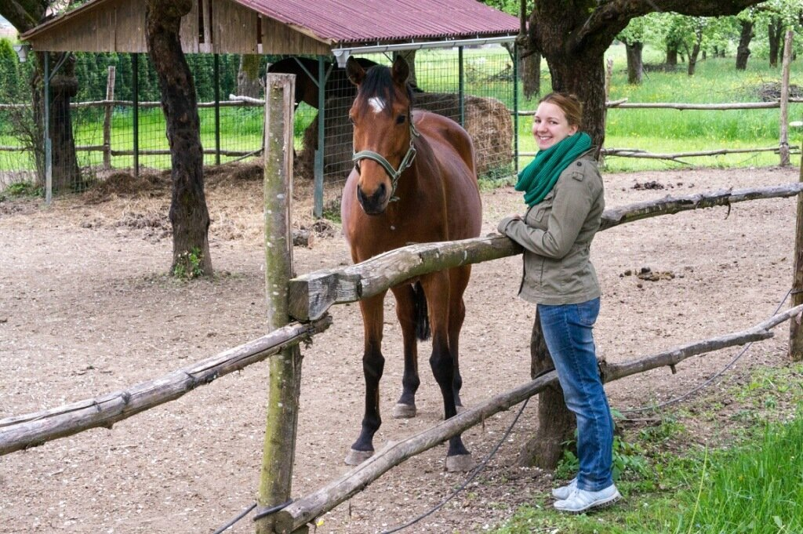](http://fotki.yandex.ru/users/klimentij511/view/841048/)

Далее мы пошли на автобусную остановку и попав внутрь общественного транспорта не смогли оплатить за проезд - у них не принимают наличные, только транспортные карточки, которые можно купить в автомате в центре. Поехали зайцами.

[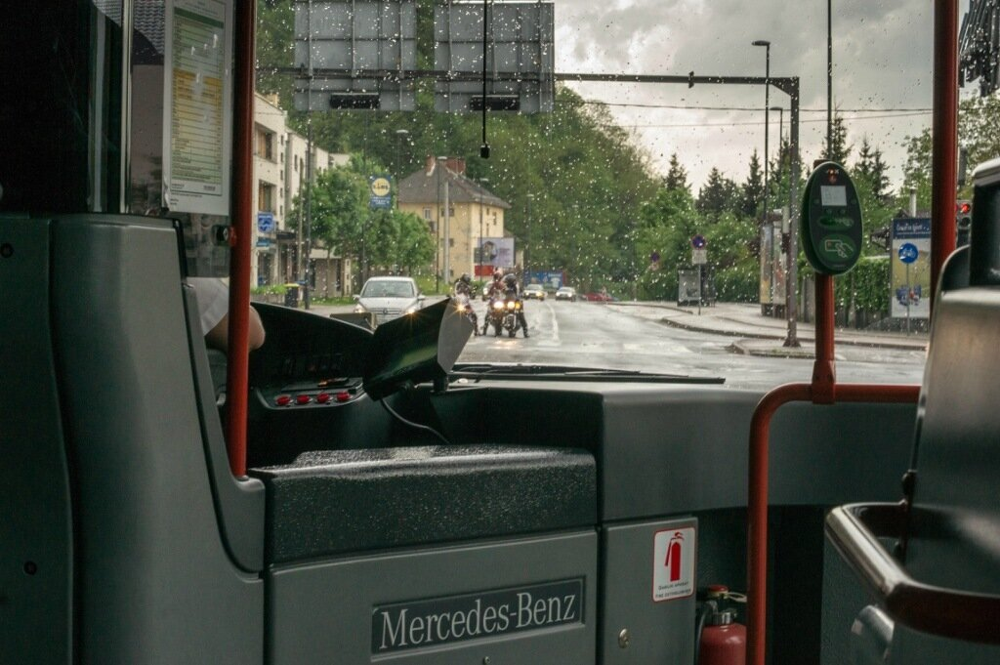](http://fotki.yandex.ru/users/klimentij511/view/841051/)

Мы вышли в самом центре, рядом с основной достопримечательностью столицы - мостом Змея, являющимся символом города. Одна из легенд об этом мосте гласит, что когда по нему проходит девственница, змеи начинают шевелить хвостами.

[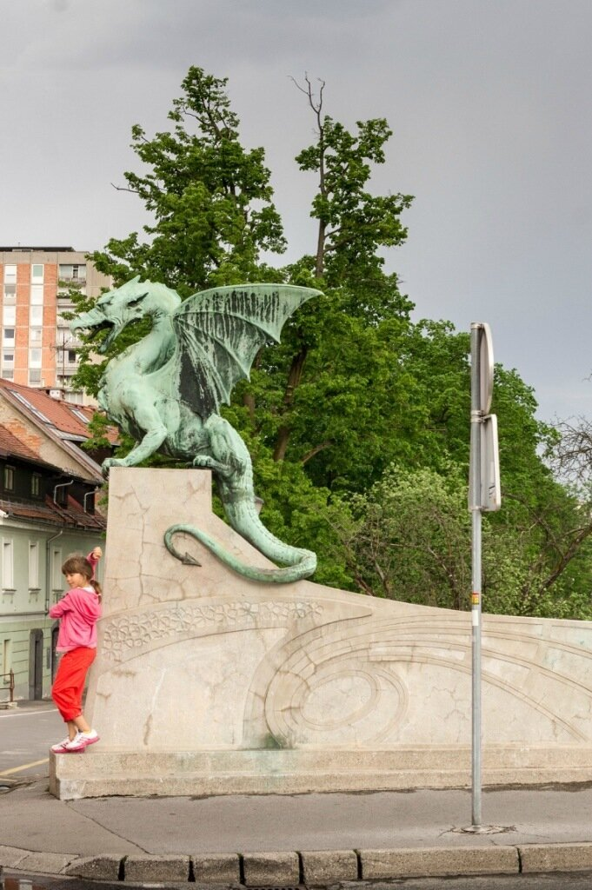](http://fotki.yandex.ru/users/klimentij511/view/841068/)

Любляна - очень уютный город. Типичный европейский - низкие старые дома с красной черепицей, и даже новые здания стараются аккуратно вписываться в сложившийся порядок.

[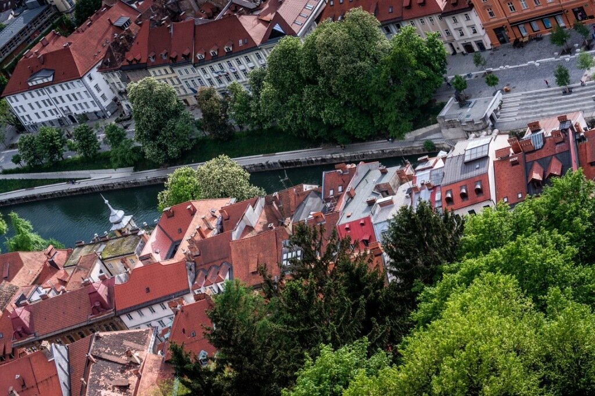](http://fotki.yandex.ru/users/klimentij511/view/841133/)

Немного прогулявшись по площадям около трехмостовья и зайдя в центр туристической информации, мы за обедом ознакомились с историей города и страны в целом. Как показала практика, экскурсионные программы нам совершенно не нравятся, ибо перегружены лишними фактами (о пилястры замка Шэнонсо!) и , как говорится, в одно ухо влетает- в другое вылетает. Так вот трехмостовье, как и многие другие достопримечательности Любляны - это произведение Йоже Плечика - словенского архитектора 20 века, который полностью преобразил город и заслужил за это уважение соотечественников,которые не поленились в русско-язычном гиде написать о нем целых 2 разворота. Увы, в силу ограниченности времени осмотр квартиры - студии этого, безусловно, талантливого человека, перенесется на следующий наш визит в этот город. Если сильно присмотреться на фотографию, можно посчитать количество парапетов и понять, что это те самые три моста, расходящиеся веером над каналом, протекающим насквозь Любляны.

[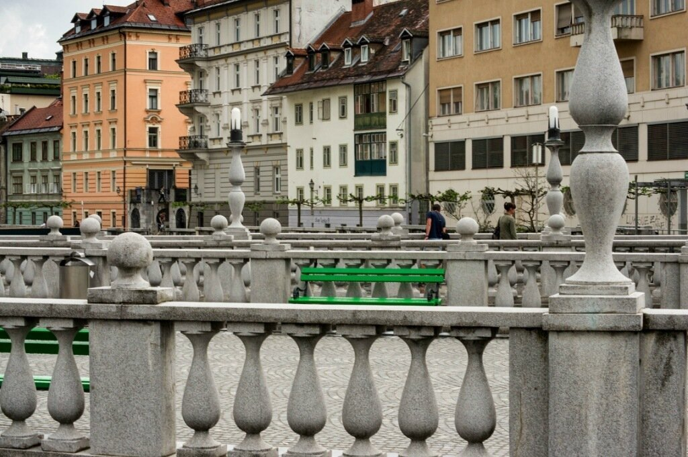](http://fotki.yandex.ru/users/klimentij511/view/841052/)

На фуникулере мы поднялись к Замку, стоящему на вершине холма, откуда открывался потрясающий вид на город.

[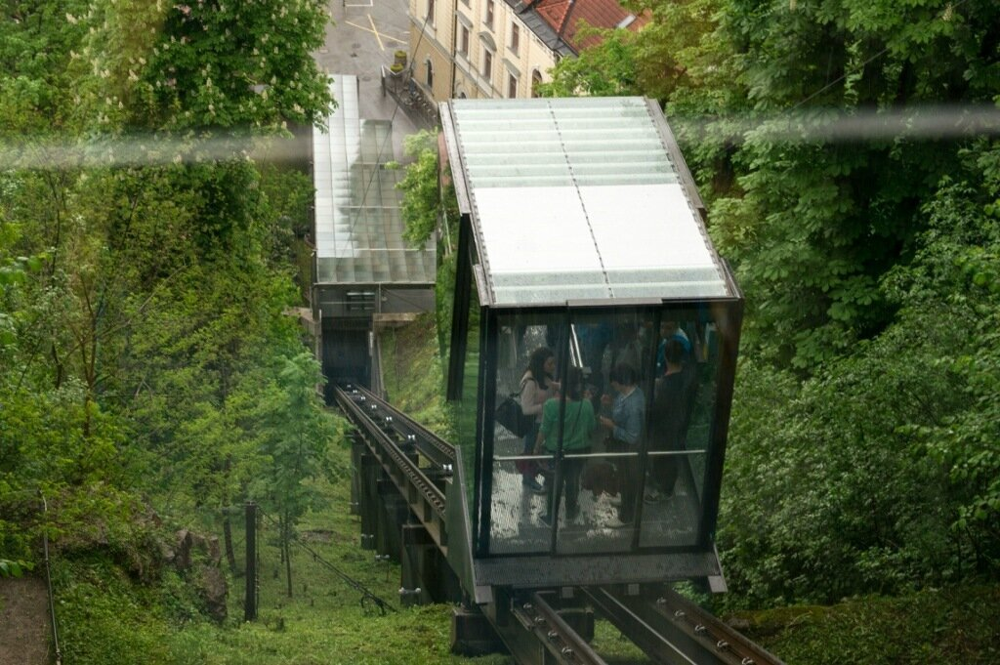](http://fotki.yandex.ru/users/klimentij511/view/841169/)

Подъем на главную башню был головокружителен, особенно если посмотреть вниз. [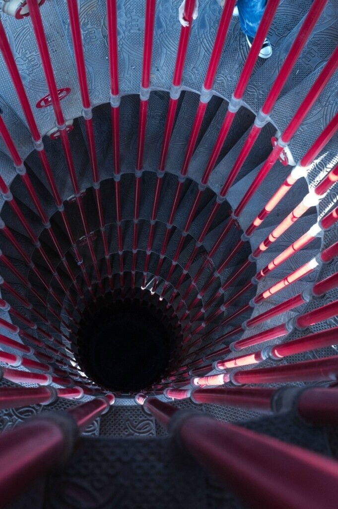](http://fotki.yandex.ru/users/klimentij511/view/841108/)

Еще немного интерьера.

[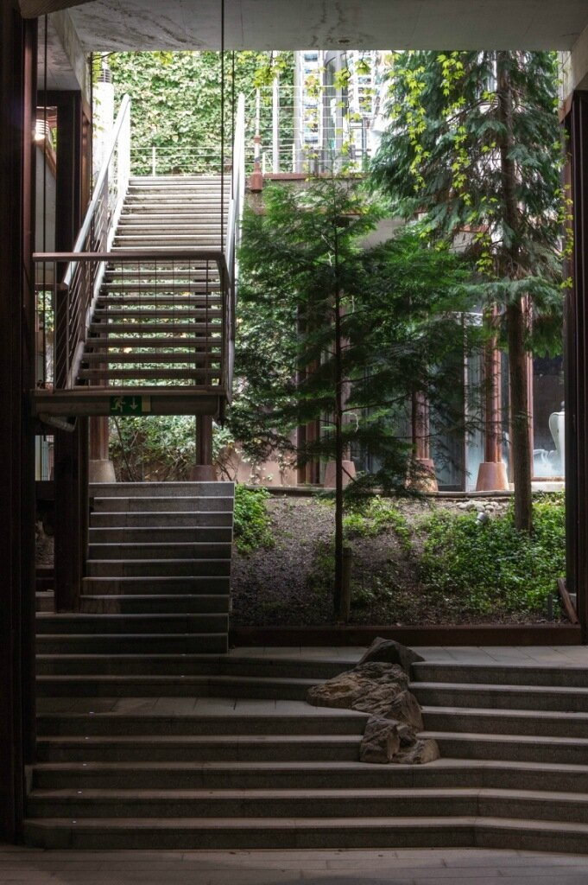](http://fotki.yandex.ru/users/klimentij511/view/841099/)

Наша тучка нагнала нас. Начинался дождик.

[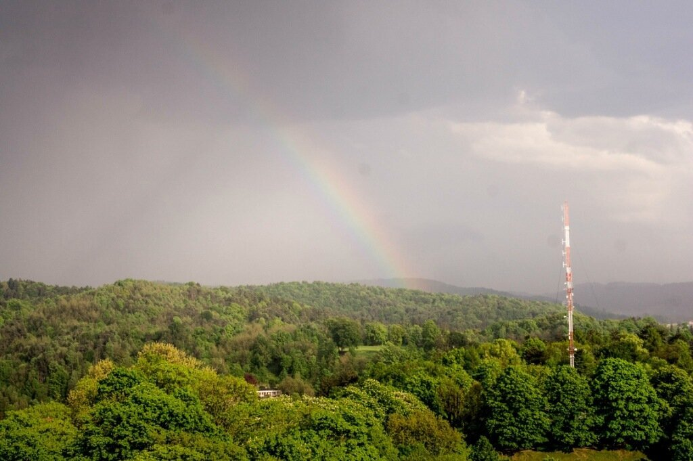](http://fotki.yandex.ru/users/klimentij511/view/841112/)

Но несмотря на тучи, солнце било в глаза. Спасались, как могли.

[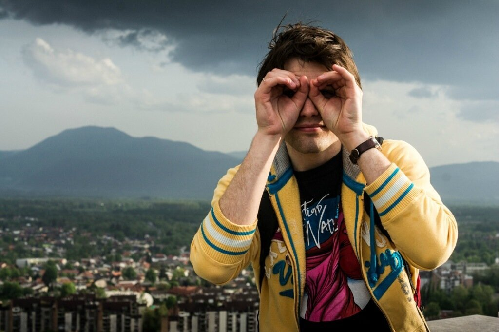](http://fotki.yandex.ru/users/klimentij511/view/841158/)

Весь Замок - это большой музей Любляны, с множеством интересных экспонатов. А еще свежие деревянные настилы невероятно пахли - от влажности было ощущение, что находишься в сауне, такой вкусный запах деревянной породы. Помимо запаха дерева можно было почувствовать аппетитные ароматы, исходящие из кафе и ресторанов, расположенных здесь же. Мы не рискнули попросить меню, а просто поглазели на шикарное оформление и уже немного утомившись, стали возвращаться к фуникулеру.

[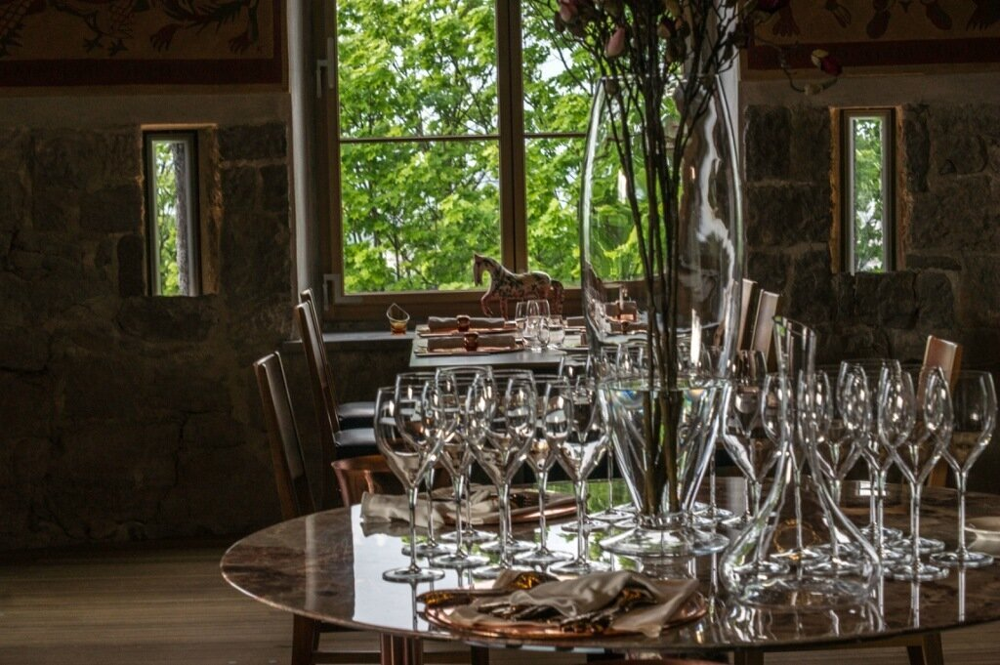](http://fotki.yandex.ru/users/klimentij511/view/841164/)

В Замке помимо постоянной выставки проводятся концерты и лекции под открытым небом. Что-то вроде нашего Красного Октября, хотя, конечно, в Москве таких площадок больше и размеры у них соответствующие. Я пришла в восторг от того, насколько все удобно для туристов - причем даже не говорящих на английском языке - везде есть информационные табло и в туристическом центре можно взять буклет на своем языке. Там же можно закупиться сувенирами. Кстати, сувениры - это отдельная тема. У меня никогда не было порывов привозить что-то бесполезное, и близкие друзья знают, как я обычно поступаю со всеми ненужными вещами. Иногда, конечно, руки тянутся купить что-то мимишное и привезти это с собой. Соблазн тем выше, когда в багажнике машины полно места (в автостопе подобные мысли сразу отметаются - на своей спине все не унесешь). По этим же причинам я почти никогда не привожу ничего друзьям в подарок. Я все время думаю о китайских фабриках, производящих почти одинаковые магниты, футболки, наперстки и кружки с надписями Прага, Словения, Москва, Нью-Йорк и т.п. Возможно, с появлением огромного жилищного пространства я пересмотрю свои взгляды. Итак, прошу прощения за лирическое отступление. Мы тем временем уже спустились на фуникулере, но начавшийся град размером с приличную вишню не пустил нас дальше - мы ненадолго осели в баре.

[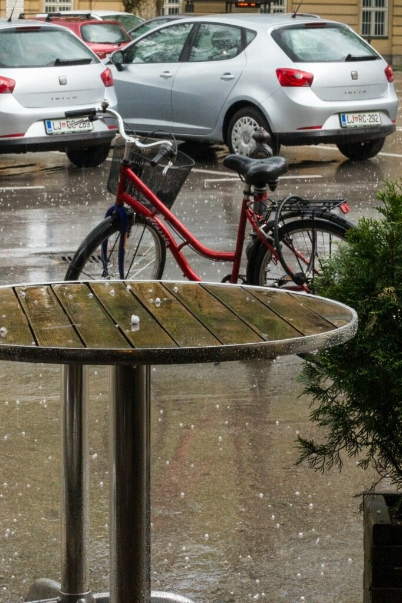](http://fotki.yandex.ru/users/klimentij511/view/841171/)

Наш выбор пал на кофе, ибо несмотря на огромное количество алкогольных напитков, у них абсолютно нечем все это закусывать. На наши удивленные взгляды нам ответили "only drink". Поэтому, если пойдете в бар в Любляне- идите сытыми или берите что-нибудь с собой. Мы вытащили конфеты, запрятанные в рюкзаке на черный день. По дороге на рыночную площадь, мы встретились с толпой девушек, кричащих "Джастин Бибер". Это было до того нелепо-смешное зрелище, что мы еще долго смеялись им вслед, а их крики слышали до самого Моста Змея. Нет ничего красивее плакучих ив, свисающих над водой. Увы, нам не удалось покататься на кораблике (мы прошли вдоль канала пешком), но всем очень советую - сердце замирает от восторга !

[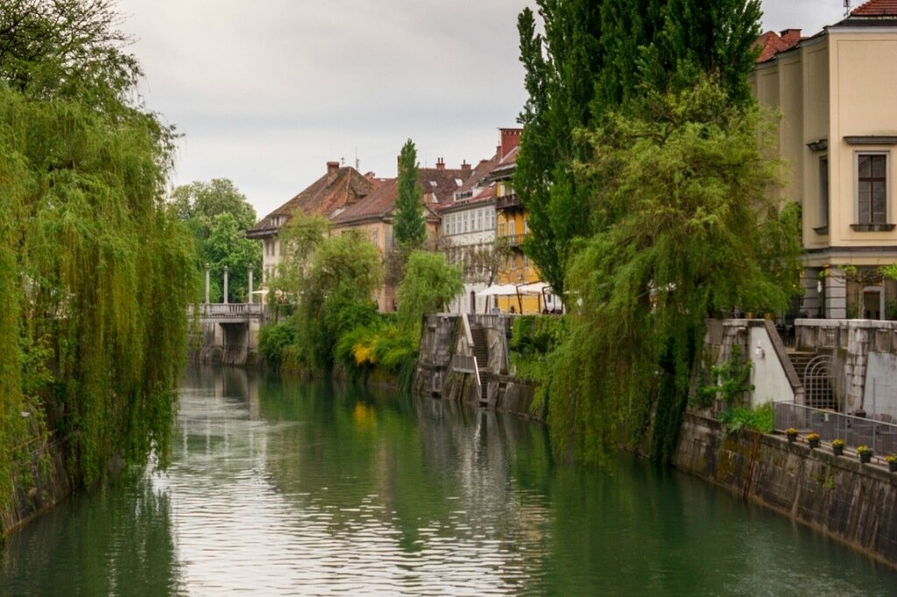](http://fotki.yandex.ru/users/klimentij511/view/841179/)

Любляна разная, но дух ее чувствуется в каждом здании. Приятно просто гулять, взявшись за руки.

[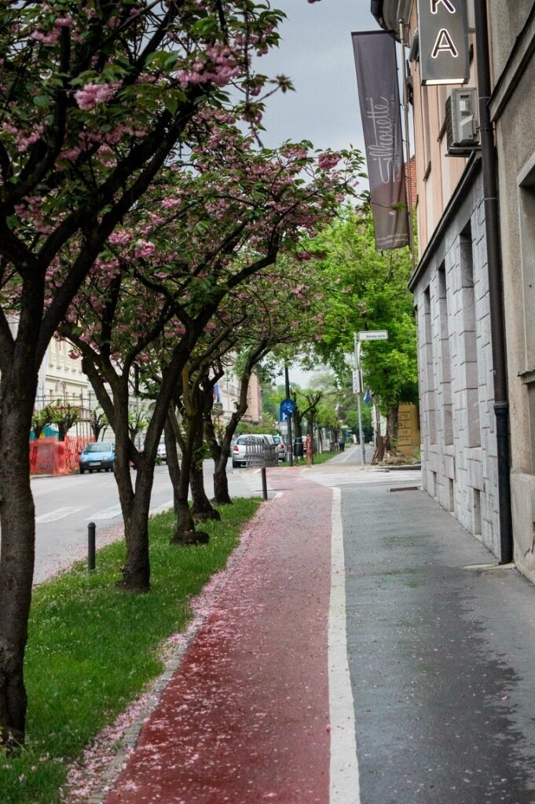](http://fotki.yandex.ru/users/klimentij511/view/841209/)

Побродив по центральным улицам, мы увидели массу красивых зданий, среди которых здания парламента, библиотеки, университета, а также открытую летнюю площадку для концертов, которую мы тоже сначала приняли за какой-то музей под открытым небом. Последнюю неохваченную нами достопримечательность - парк Тиволи, мы увидели уже после заката. Но сумрак и мелкий дождь добавляли нашей прогулке очарования. Мы дошли до одноименного замка Тиволи, внутри которого также находится музей.

[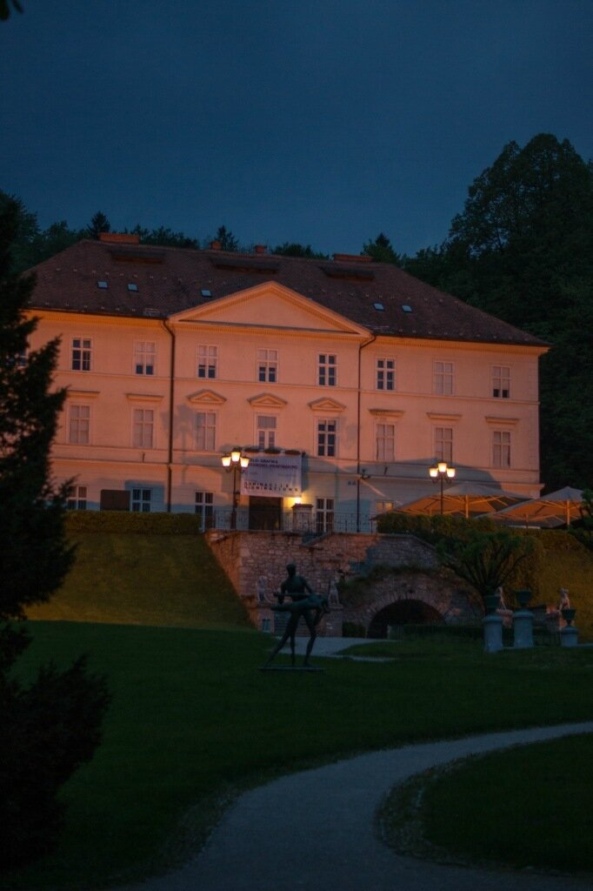](http://fotki.yandex.ru/users/klimentij511/view/841215/)

Атмосфера романтики буквально заполняла легкие - если бы я жила в Любляне, я бы только сюда и ходила на свидания. Перед замком была выставка фотографий под открытым небом. Спрятавшись под зонтиком, мы немного в спешке ее осматривали, так как приближалось время последнего автобуса.

[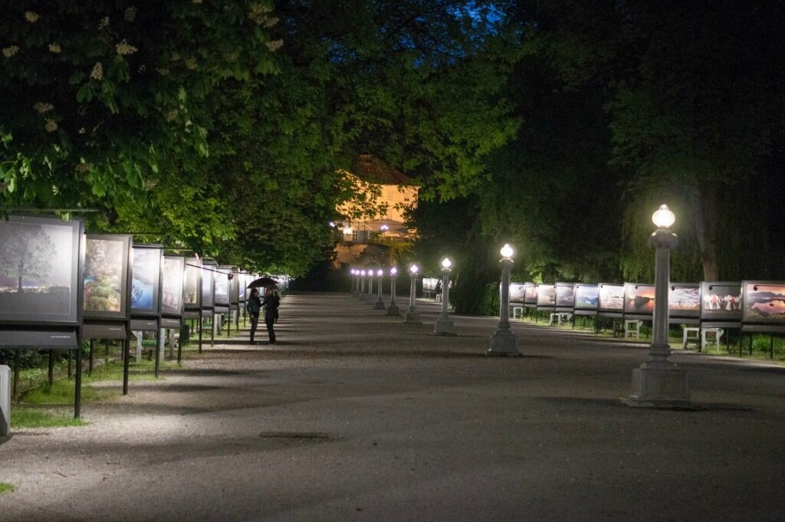](http://fotki.yandex.ru/users/klimentij511/view/841225/)

Любляна оставляет глубоко в душе романтические, теплые воспоминания, которые порой подхватывают тебя своей волной и уносят так далеко, что не хочется возвращаться.
