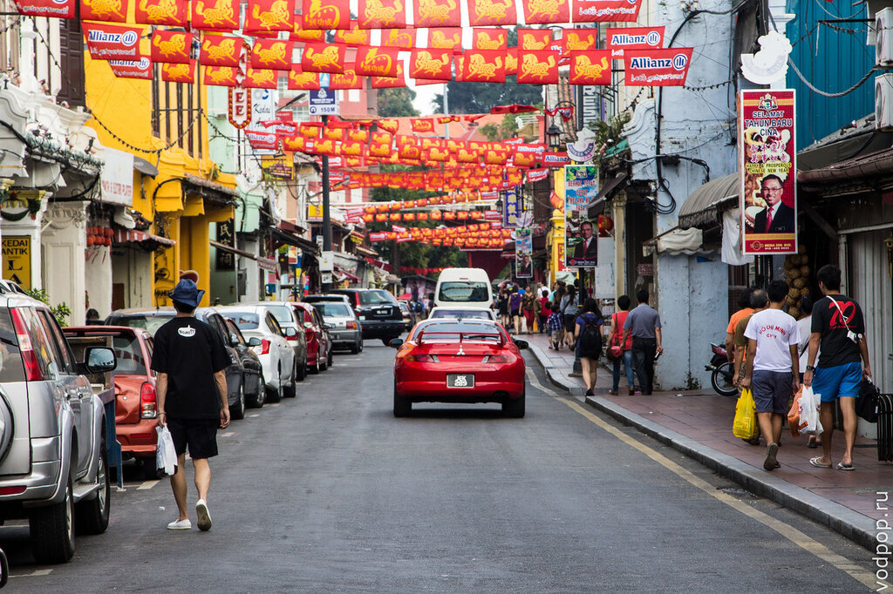
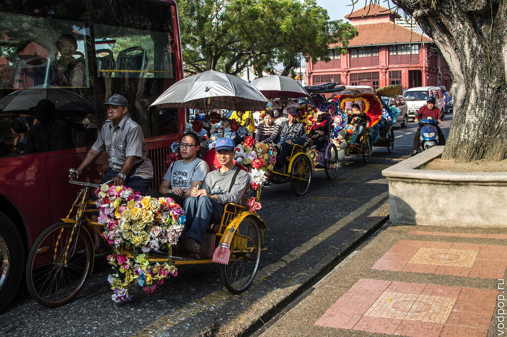
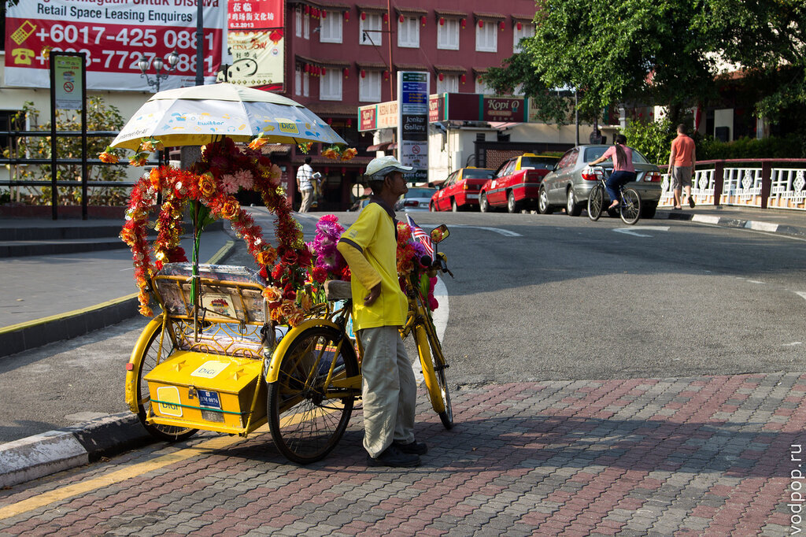
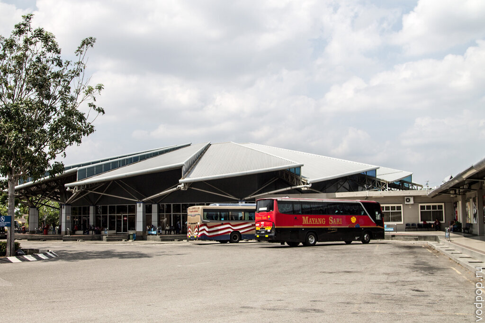
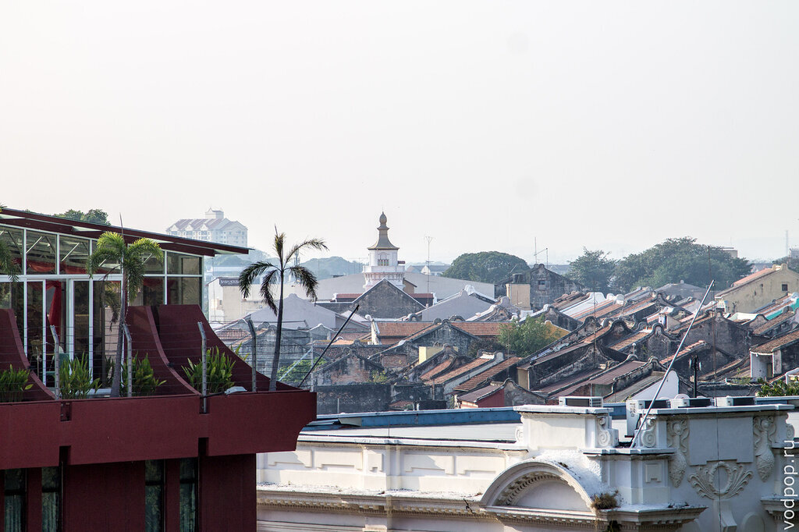
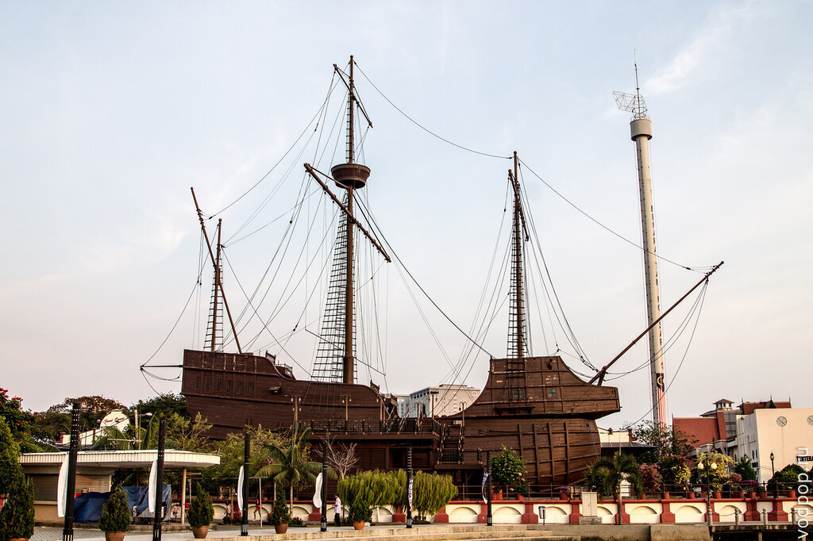
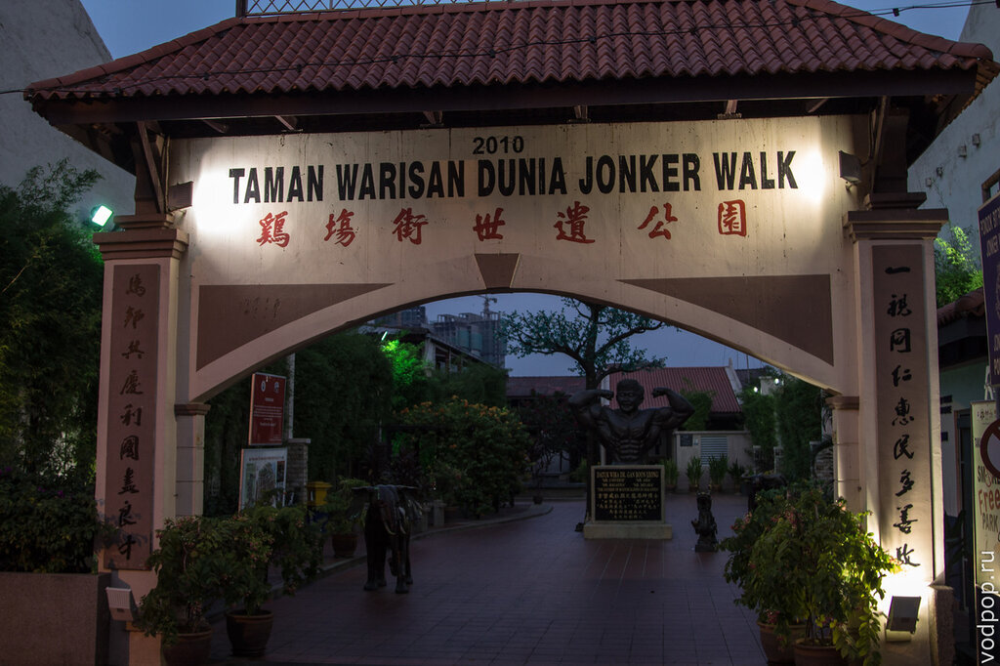
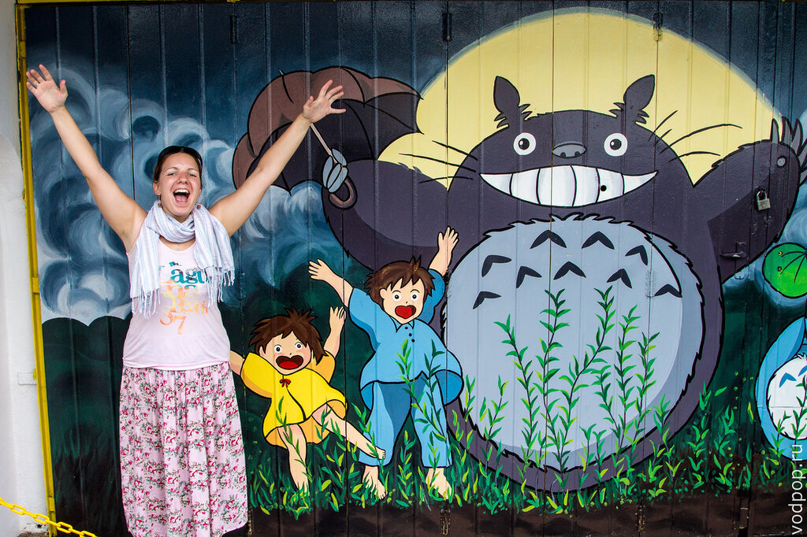
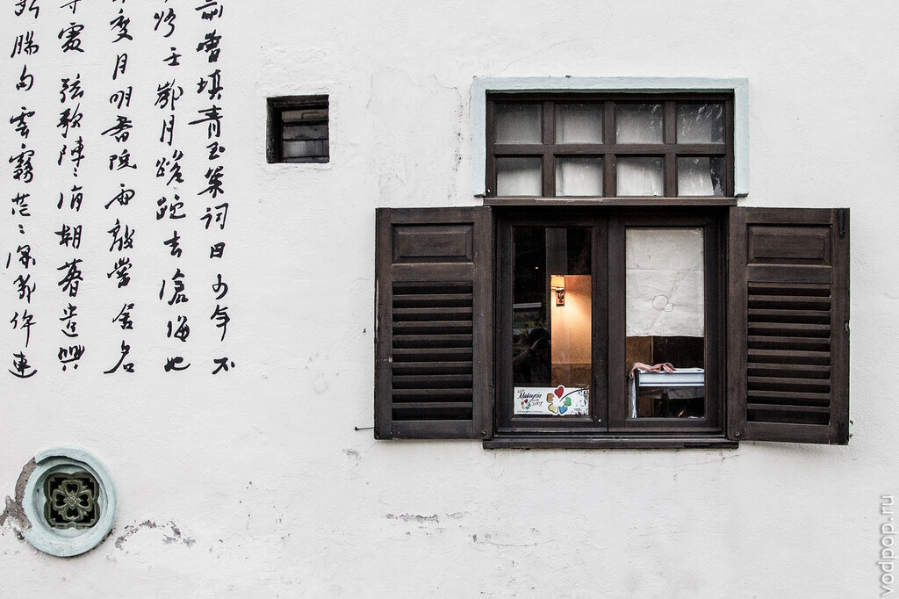

Малакка - уютный городок в Малайзии, внесенный в список Всемирного наследия Юнеско. Именно здесь вынуждены были останавливаться мореходы, чтобы пополнить запасы съестного и пресной воды и ждать смены направления муссона, который диктовал график движения судов в Индию и Китай.

<!--more-->

Несмотря на маленькие размеры, город имел стратегическое положение морского порта, и поэтому в разные годы был колонизирован португальцами, голландцами и англичанами. Учитывая разношерстность населения Малайзии (китайцы, малайцы, индусы и прочие), а также следы культур колонизаторов,  город оставляет самое интересное впечатление.

По центру города можно прокатиться на велорикше, которые здесь имеют совершенно непередаваемый вид и издают невероятный шум. Каждый "водила" выделывается, как может. Кто-то клеит плюшевые игрушки, кто-то обшивает атласными лентами. Одни привлекают жуткими попсовыми композициями, у других же можно услышать песни группы Rammstein. "Всего" за 15 долларов вас покатают по центру под косые взгляды других туристов.

Данное развлечение особенно популярно у китайских туристов. Видимо, им этот пестрый шик приходится по душе.

Лучшее впечатление от города - это наш хостел River One Residence, в который мы приехали поздно ночью практически последним автобусом из Куала-Лумпур. Правда, с наступлением сумерек от автобусной станции добраться общественным транспортом до исторического центра невозможно - после долгих попыток поймать такси (!) нам все-таки улыбнулась удача, и мы за 400 рублей доехали до хостела. Хотя днем с автобусным сообщением в Малакке все хорошо.

Гулять по исторической части Малакки легко и просто - для этого хватит и одного дня. Городок маленький, самые интересные объекты построены во времена колонизации португальцами. Очень интересно прогуляться вдоль реки из центра до залива, а затем обратно. В туристическом центре можно взять бесплатную карту города (но надо попросить девушку на ресепшн - на стойках карт нет, их выдают по 1 штуке в руки), где указаны основные достопримечательности.

Самый интересный объект - форт Сантьяго, там можно погулять около часа, посмотреть на остатки камней, почитать неизвестные тебе имена и посмотреть на город с высоты холма.

Недалеко от залива стоит модель португальского галеона (парусного судна), куда можно попасть за 6 рингит.

Мелакка- исключительно туристический город, заточенный под бэкпекеров. Тут и там молодежь со всего света, ест в местных заведениях, покупают сувениры ручной работы и едят вместе с местными за 5-6 рингит в кафе на главной туристической улице Джонкер Волк.

По бокам вдоль этой улицы чуть ли не каждый дом украшен граффити. Я даже нашла своего любимого Тоторо и не упустила шанс сфотографироваться вместе с ним!

Дома украшены очень необычно. Видно, что местные как-то стараются заинтересовать путешественников, поэтому гулять вокруг интересно - можно просто крутить головой на 360 градусов и видеть необычные вещи.

Благодаря наплыву туристов из Европы, многое кажется привычнее, чем в другой части Азии. Здесь и столовый нож можно найти, и книги на английском или немецком почитать, посмотреть телевизор со спутниковыми каналами, попробовать еду разных стран мира. Кстати, с едой в Малакке все довольно неплохо, но до 7-8 вечера. Потом город засыпает. Даже кафе, рассчитанные исключительно на туристов, закрывают свои двери не позже 9 часов. Исключением является Hard Rock Cafe, куда мы и направились с Климентием. Музыканты пели хорошо, но подборка песен несколько удивляла. Вместо классического рока, они играли что-то около альтернативы и даже поп-музыки. Около часа ночи, перед самым закрытием послышались звуки чего-то потяжелее, но к тому времени мы уже почти выбились из сил, и решили идти спать домой, так как на следующий день был запланирован автостоп обратно в Таиланд.

## Итоги:

Малакка один из увиденных нами городов Малайзии, из которого не хотелось сразу убегать на границу с Таиландом (а это показатель) - тут уютно, колоритно и хочется бродить часами, покупать ненужные сувениры, пить местный алкоголь и читать серьезные философские книжки на английском.
