Метро в Бангкоке - на первый взгляд, не самый дешевый вид транспорта, зато самый быстрый и удобный для посещения множества объектов в Бангкоке. Работает с 6 до 24. В этой статье мы расскажем об особенностях метро в Бангкоке и о том, что следует знать перед первой поездкой.

<!--more-->

 

Читайте наши заметки о других видах общественного транспорта в Бангкоке:

[Такси, мото-такси и тук-туки](https://vodpop.ru/taxi-v-bangkoke/ "Такси в Бангкоке")

[Автобусы](https://vodpop.ru/avtobusi-v-bangkoke/ "Автобусы в Бангкоке")

[Лодки](https://vodpop.ru/lodki-v-bangkoke/ "Лодки в Бангкоке (Khlong boats)")

## Наземное метро BTS Skytrain

Бангкок стоит в пробке, тем временем на высоте третьего этажа проносятся современные "небесные поезда", оснащенные кондиционером, из окон которых можно посмотреть почти весь город.

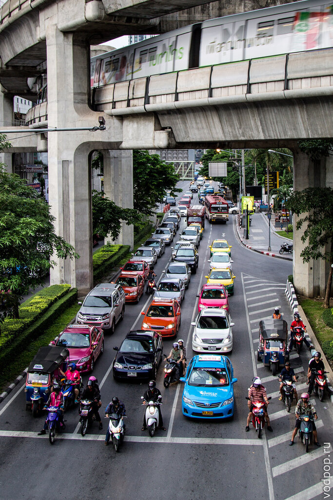

Чтобы оказаться в вестибюле метро, придется подняться по лесенке. Тут можно купить часы, платки, еду, туристические путевки и много всякой мелочи.

Кстати, в вагоне метро есть и пить нельзя.

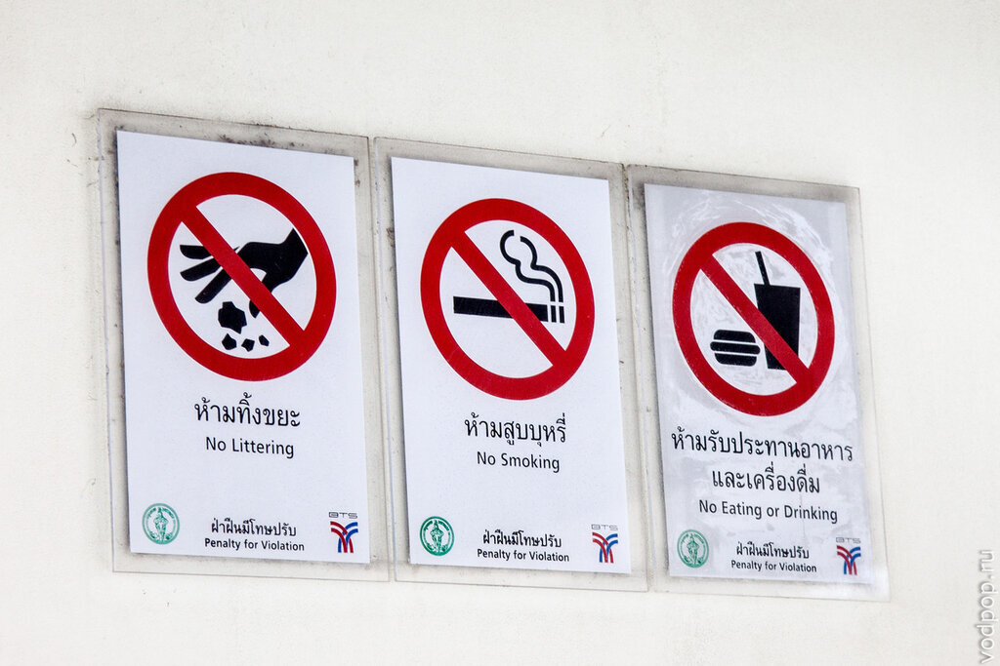

Учитывая, что на платформе минимум один полицейский, я бы проверять этот запрет не стала.

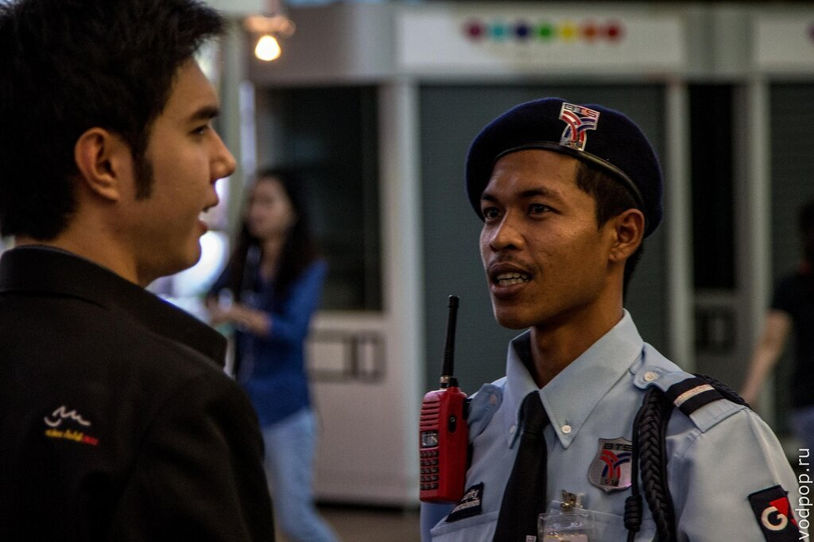

Теперь несколько слов об оплате проезда. В Бангкоке принята зональная система оплата, т.е. вы платите за расстояние, которое проехали. В вестибюле стоит несколько автоматов по оплате проезда. Если у вас нет мелочи, подходите к кассе и вам меняют банкноту.

Подходите к автомату, выбираете станцию, ДО которой вы хотите проследовать. Затем вносите необходимое количество бат (на схеме слева в кружочке находится количество бат, которое вы должны заплатить за проезд), получаете билет и сдачу.

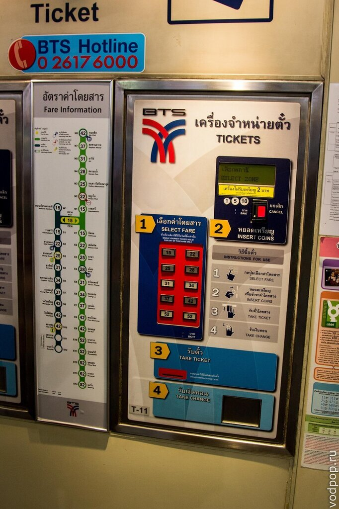

Сами билеты могут выглядеть по-разному, однако у них есть своя особенность. На одной из сторон обязательно будет изображение схемы метрополитена - она не меняется в зависимости от билета. На второй стороне будет нанесено какое-то изображение. Именно этой стороной, по направлению стрелки, необходимо засовывать билет в турникет. На фото лишь малая часть того, что нам встречалась. Полную коллекцию можно посмотреть на [официальном сайте BTS Skytrain](http://www.bts.co.th/) в разделе "Ticket Gallery".

Ни в коем случае **не выкидывайте билет**! Он вам понадобится для выхода на станции, до которой вы оплатили поездку. На официальном сайте есть [онлайн-калькулятор поездки.](http://www.bts.co.th/customer/en/02-route-current.aspx) 

Кроме одноразового билета, который можно купить в автомате, существует и много видов других, которые покупать нужно на кассе в вестибюле.

Если вы планируете целый день перемещаться с помощью метро, то можно купить билет за 1 день за 140 бат. Он будет действовать до полуночи (а не 24 часа). Все билеты на метро в Бангкоке предназначены для одного человека. Передать карточку никак не получится - везде дежурят бдительные полицейские.

Для тех, кто решил задержаться в Бангкоке подольше, подойдет проездной Smart Pass. Данная карта выгодна тем, кто ездит больше одной станции, так как с нее списывается 1 поездка по цене от 20 до 25 бат. Стоимость уменьшается с увеличением количества поездок:

- 15 поездок - 405 бат (27 бат за поездку)
- 25 поездок - 625 бат (25 бат за поездку)
- 40 поездок - 920 бат (23 бат за поездку)
- 50 поездок - 1100 бат (22 бат за поездку)

Указанное количество поездок действительно в течение 30 дней. Неиспользованные поездки пропадают. Если остались какие-то вопросы, обязательно спрашивайте в комментариях, мы обязательно ответим.

А вот и актуальная (на Октябрь 2013)  схема метро BTS Skytrain и подземного метро MRT (картинка кликабельна)

[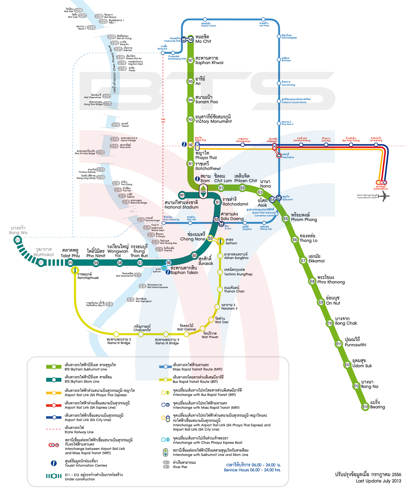](https://vodpop.ru/wp-content/uploads/2013/10/BTS-Bangkok.png)

Как правило, в вестибюле метро стоят банкоматы, так что если вы забыли снять деньги - это не проблема. Для российских карточек самый выгодный банк - AEON, он не берет комиссию за снятие.

После того, как вы купили билет и прошли через турникет, необходимо следовать по указателям. Обычно указан цвет линии (их всего две) и название конечной станции. Этой информации должно быть достаточно, но если вы не уверены, то обратитесь к работнику метрополитена. Услужливость и доброжелательное отношение у тайцев в крови.

Если вы путешествуете с детской коляской, придется попотеть -подъемников здесь не видно, хотя на некоторых станциях есть лифты для инвалидов (их нужно поискать). Во всех прочих обстоятельствах вам помогут работники метрополитена.

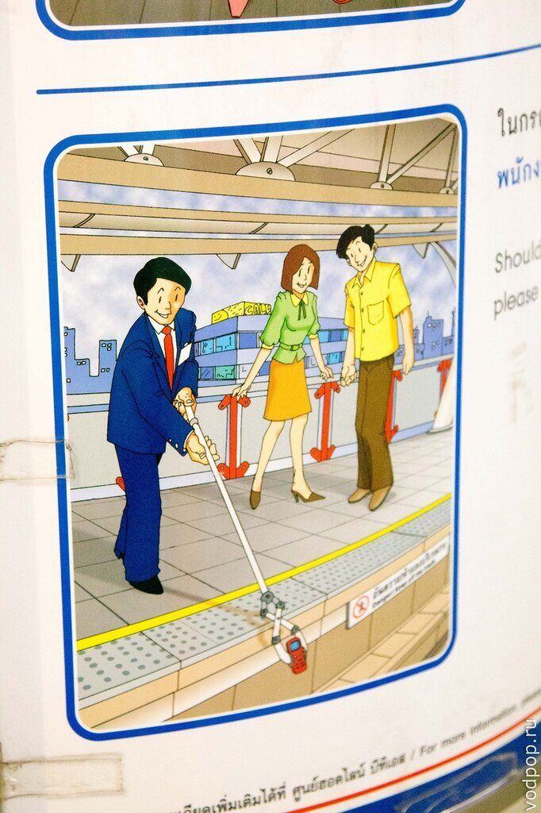

Окна первого и последнего вагона метро не завешены рекламой. Видимо, требования безопасности. Остальные вагоны выглядят очень красочно, что совершенно не мешает хорошо видеть сквозь стекло изнутри.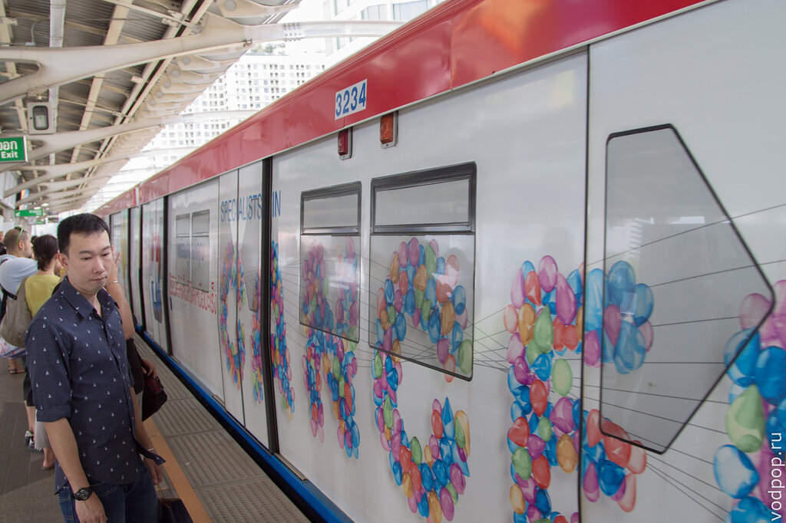

В метро днем довольно свободно. Если присмотреться, то на полу видно разметку остановки поезда, а также стрелки, вдоль которых должны стоять пассажиры, ожидающие поезд. Удобно

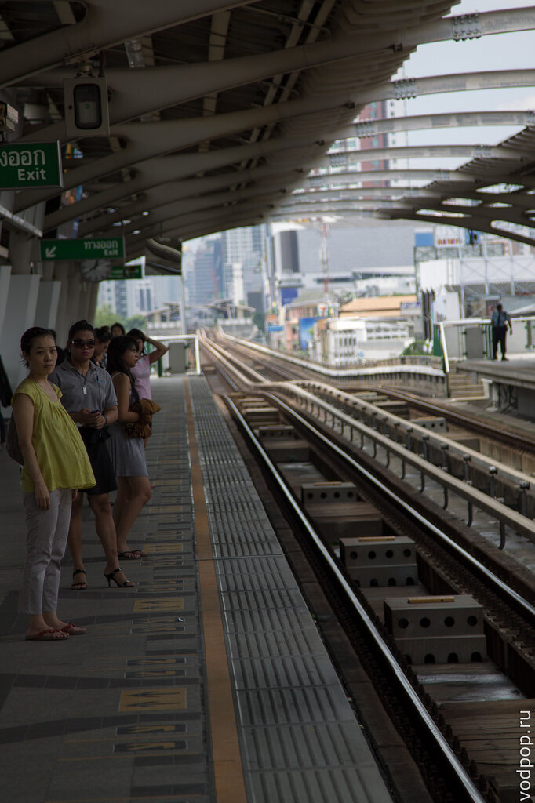

Но и здесь бывают часы-пик. Хотя все ведут себя очень культурно. Никто не лезет в вагон без очереди, не толкается и если не вмещается, то просто ждет следующий поезд. Менталитет, однако.

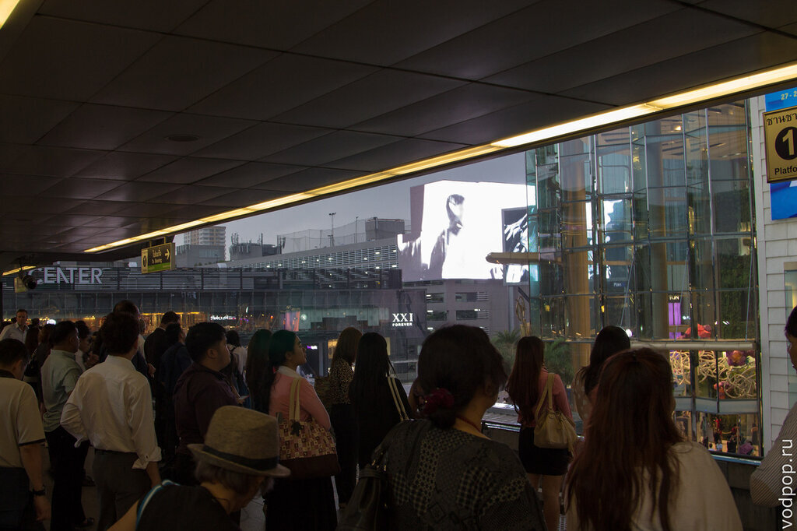

Нравится статья? Узнавайте первым о выходе новых интересных историй! Подпишитесь на нас по [эл. почте](http://feedburner.google.com/fb/a/mailverify?uri=vodpop&loc=ru_RU) или в [группе ВКонтаке](http://vk.com/vodpop)

Кстати, вы можете покататься по всему метро, а потом вернуться на станцию, до которой вы оплатили проезд. Главное, успеть за 120 минут - это максимальное количество времени, которое вы можете провести в метро BTS.

## Подземное метро MRT

Подземное метро похоже на BTS Skytrain. Пока всего 18 станций, но метро в Бангкоке строят быстро, поэтому к вашему приезду число может измениться.

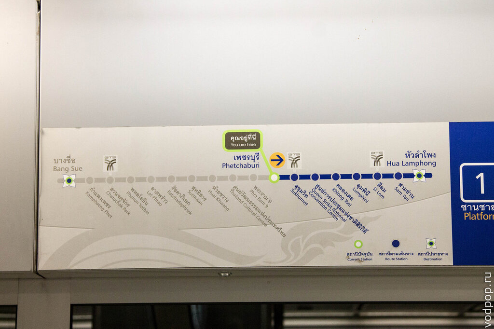

Время работы также с 6 утра до 24 часов. Проездные от BTS не действует, поэтому придется платить отдельно. Стоимость проезда от 16 до 40 бат, зависит от количества станций, которое вы собираетесь проехать. Для оплаты необходимо подойти к автомату и выбрать английский язык. Будет подсвечена та станция, на которой вы находитесь. Далее нужно нажать на сенсорном экране на станцию, до которой планируете поехать и оплатить поездку.

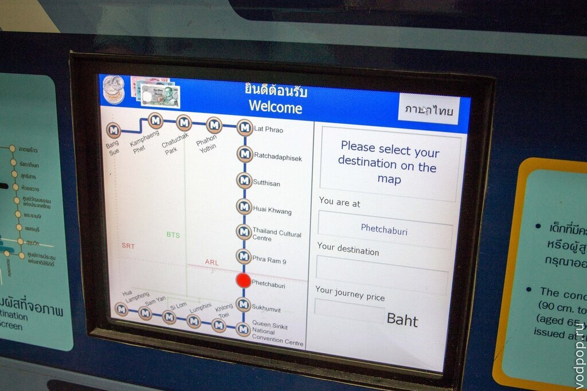

После оплаты вы получите не бумажный билетик, а черную пластиковую монетку, которую нужно будет приложить на входе к турникету, а на выходе засунуть в специальное отверстие.

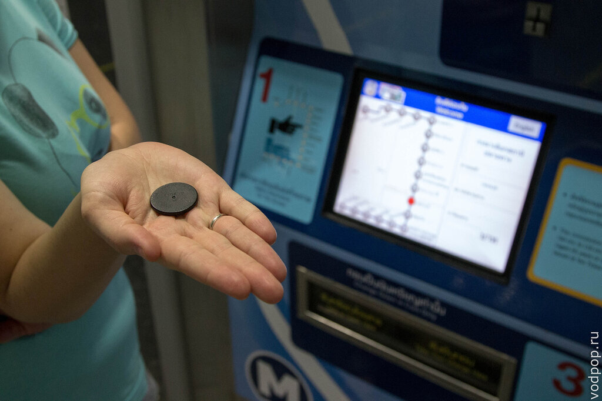

Внутри все аккуратно и чисто. Людей заметно меньше, чем на наземном метро BTS Skytrain.

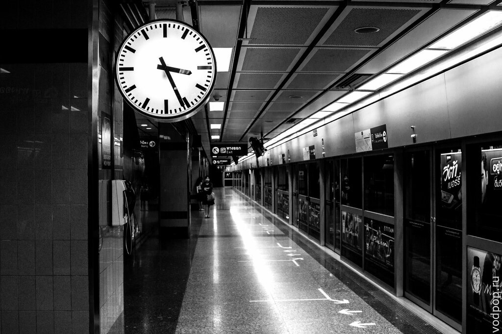

На всех станциях стоят стеклянные автоматические перегородки, которые открываются только по прибытию поезда. Вспомнили Питер.

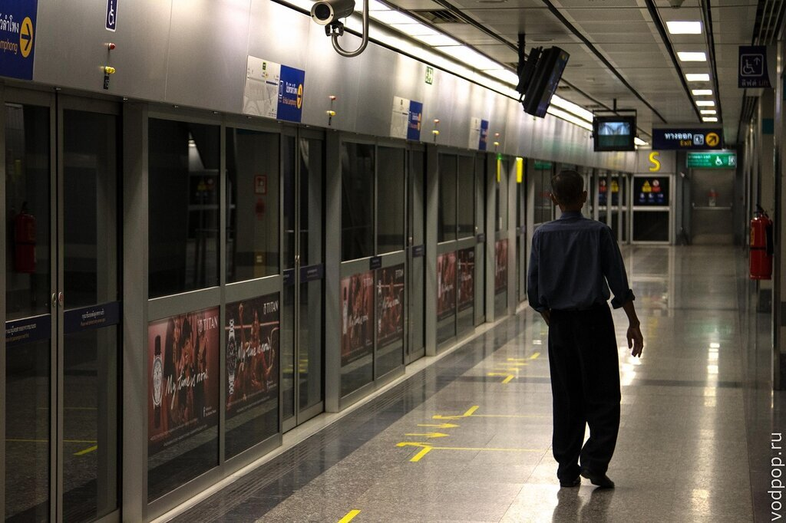

Из известных достопримечательностей на MRT можно добраться до рынка Чатучак (Chatuchak - самый большой рынок в мире) и парка Люмпини. Наш выбор пал на парк, поэтому мы доехали до одноименной станции метро и увидели замечательную схему, которая поможет вам не заблудиться и выйти туда, куда вам нужно.

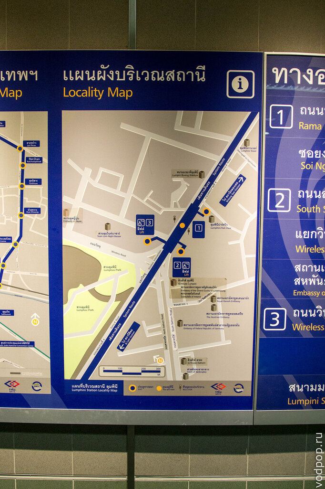
