На протяжении всей поездки нас не покидало желание задержаться где-нибудь подольше, хотя бы на 2-3 дня. Но мы старались придерживаться нашего графика, чтобы вовремя вернуться в Москву.

<!--more-->

## День 1. Ногинск (Россия) - Лаппеенранта (Финляндия )

Старт в 7.40 утра, загрузка машины провизией. 19 часов в пути вместе с прохождением границы. Можно доехать быстрее, но мы особо не торопились, так как страховка на машину (green card) начинала действовать после полуночи. Кстати, о страховке  - ее можно оформить в любой палатке вдоль дороги, на которой есть надпись "Зеленая карта". Цена везде одинаковая - 30€.

 

Мы сняли домик на четверых в кемпинге [Huhtiniemi Camping](http://www.booking.com/hotel/fi/huhtiniemi-camping.ru.html?aid=878635;sid=b6008aa2510d1d9a03d3b7b2e3d86468;dcid=1;dest_id=-1374408;dest_type=city;dist=0;group_adults=2;room1=A%2CA;sb_price_type=total;srfid=3be3421b07d73df37b704f84bcec7c46d25c2472X1;type=total;ucfs=1&). Специально выбирали с круглосуточной стойкой регистрации. Если ее нет, то вы обязательно должны предупредить заранее, во сколько приедете, чтобы вам могли оставить ключи, а это неудобно.

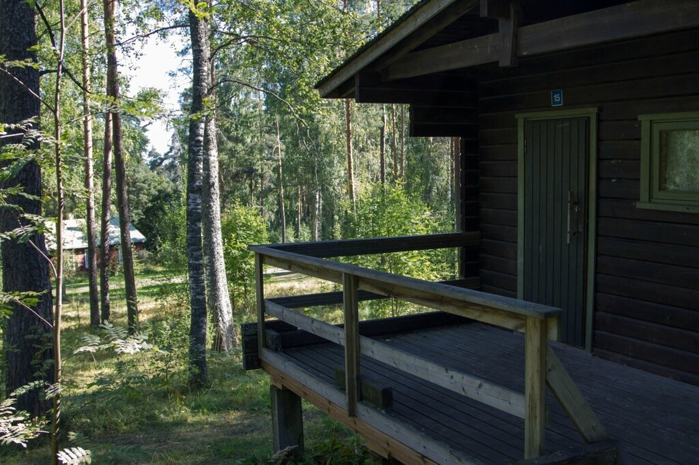

## День 2. Лаппеенранта  - Ruokonen

Из-за позднего приезда мы проспали check-out в Huhtiniemi , но нам разрешили задержаться на 1,5 часа.  За это время мы даже успели немного прогуляться по территории.

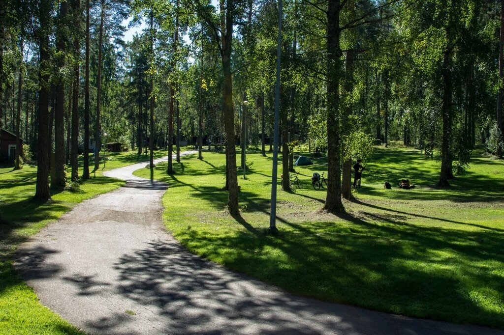

К месту следующей ночевки - [Karkutahko Villas](http://www.booking.com/hotel/fi/karkutahko-villas.ru.html?aid=878635;sid=b6008aa2510d1d9a03d3b7b2e3d86468;dcid=1;dest_id=-1384620;dest_type=city;dist=0;group_adults=2;room1=A%2CA;sb_price_type=total;srfid=0dbc6fc10448e3f20fbff5c16512402ab0f901b6X1;type=total;ucfs=1&) мы добрались еще засветло и, пожалуй, это был самый уютный дом, в котором мы когда-либо останавливались - два этажа, с 4 спальнями, сауной, верандой с барбекю, PlayStation, музыкальным центром и кухней с посудомоечной машиной.

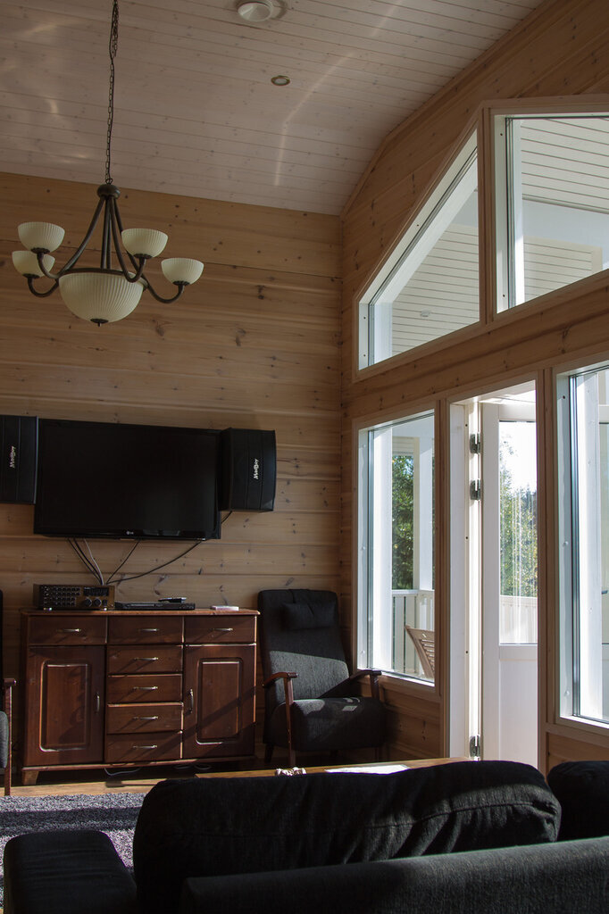

## День 3. Ruokonen - Савукоски

Чем дальше мы продвигались вглубь страны Суоми (так называют свою страну сами финны), тем меньше машин встречали и порой ехали по дороге с полуторной полосой.

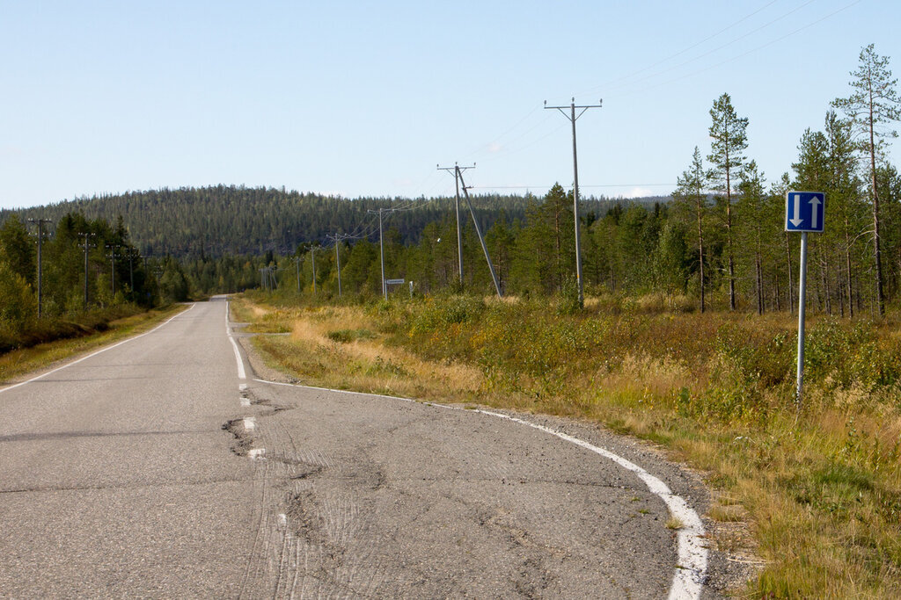

Раз в 2-3 часа мы обязательно делали остановку, чтобы немного размять ноги, перекусить и насладиться красотой природы (а иногда и ее дарами - грибами и ягодой: черникой, брусникой, голубикой, вороникой).

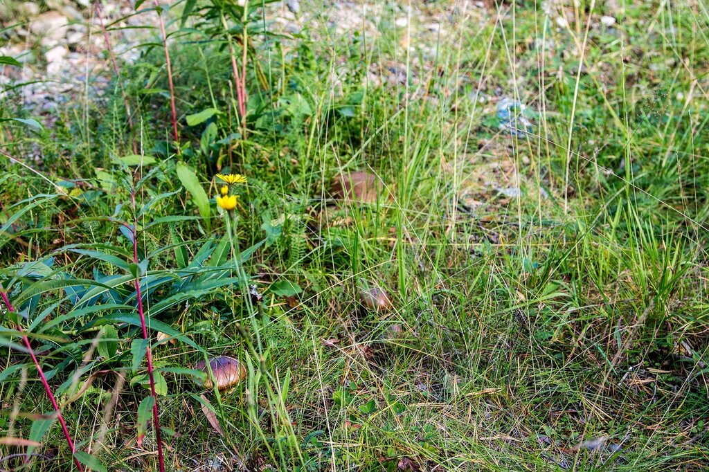

Частые остановки и немалое количество километров заканчивались, как правило, поздним прибытием в кемпинг. Нашим следующим жилищем был [Wilderness Hotel Samperi](http://www.booking.com/hotel/fi/wilderness-samperi.ru.html?aid=878635;sid=b6008aa2510d1d9a03d3b7b2e3d86468;dcid=1;dest_id=-1386148;dest_type=city;dist=0;group_adults=2;room1=A%2CA;sb_price_type=total;srfid=4e867ff04b5092eb06df83e69469e864102fbd76X1;type=total;ucfs=1&). Мы добрались до него около 2 часов ночи.

Ключи нам оставили прямо в домике вместе с оранжевой корзинкой полной вкусной еды - джемы, каши, фрукты, ветчина, хлеб, йогурты.

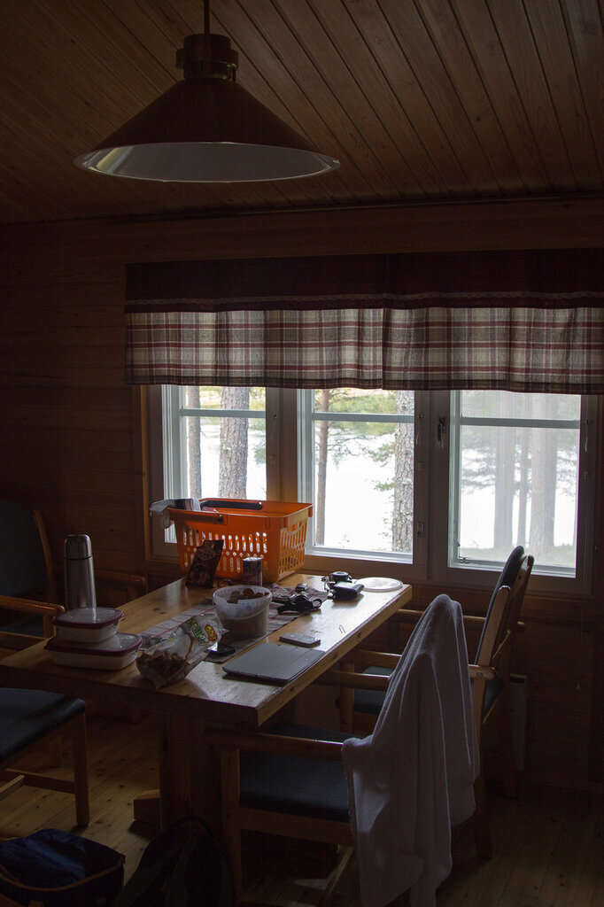

Утром нас ждал приятный сюрприз - разогрелась сауна, которую Клим включил по приезде в кемпинг. Как следует прогревшись, мы побежали к реке Кемийоки, вдоль которой расставлены домики нашего кемпинга.

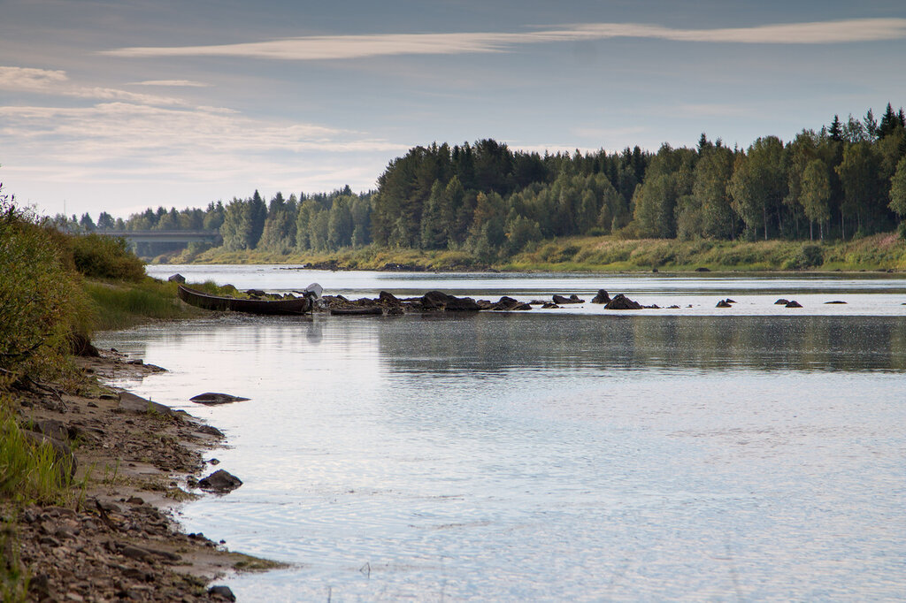

Сказать, что вода освежала - ничего не сказать. На улице было +15, в воде и того холоднее.

## День 4. Савукоски (Финляндия) - Honningsvåg (Norway)

Четвертый день поездки запомнился тем, что мы в первый раз увидели оленя. Он не сказать, что очень  испугался - отошел на пару метров в лес и начал неспешно жевать кусты, пока мы бегали вчетвером и фотографировали на все, что попадалось под руку - телефоны, зеркалки и даже на советский фотоаппарат Киев.

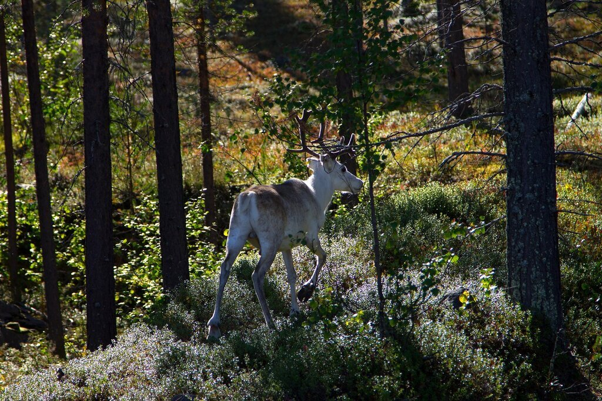

Мы еще неоднократно встречали оленей на дорогах Финляндии и Норвегии. Под конец уже почти перестали удивляться, постепенно привыкнув к этим грациозным животным с умными глазами.

По дороге мы остановились в большом сувенирном магазине с непроизносимым названием, где купили подарки родителям, а для себя приобрели местный деликатес - копченую оленину (ничего особенного, похоже на обычную говядину по вкусу).

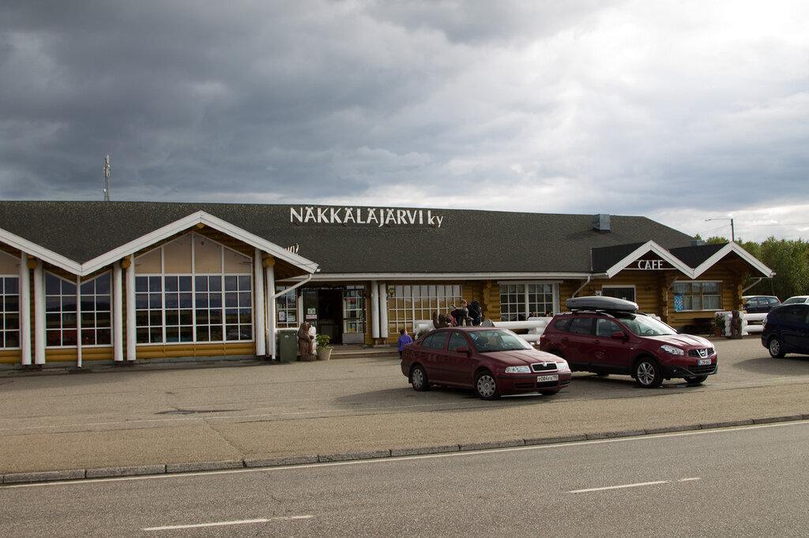

Через пару часов в пути мы совершенно неожиданно для себя пересекли границу между Финляндией и Норвегией. Успев заправиться последним "дешевым" бензином, который был уже существенно дороже, чем в остальной части Суоми, мы продолжили путь.

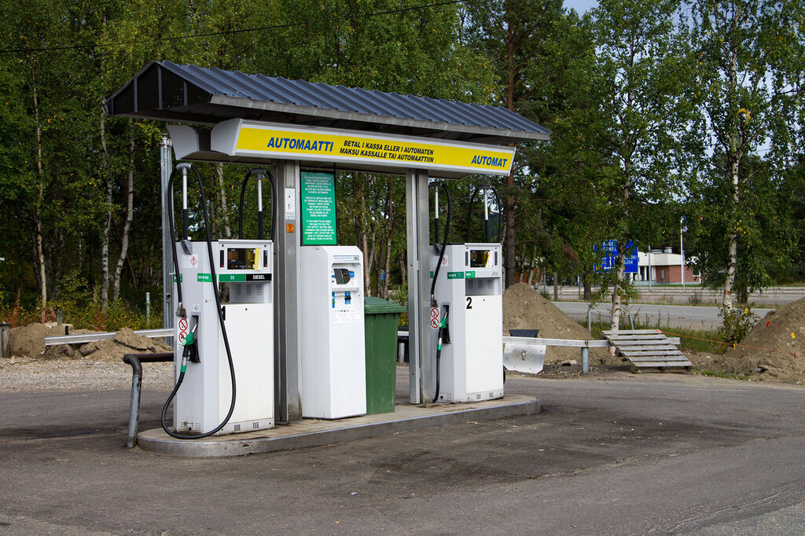

Природа изменилась почти сразу, буквально за двадцать минут вдоль дороги откуда ни возьмись появились горные массивы, воздух стал еще холоднее и общая атмосфера как-то резко переменилась.

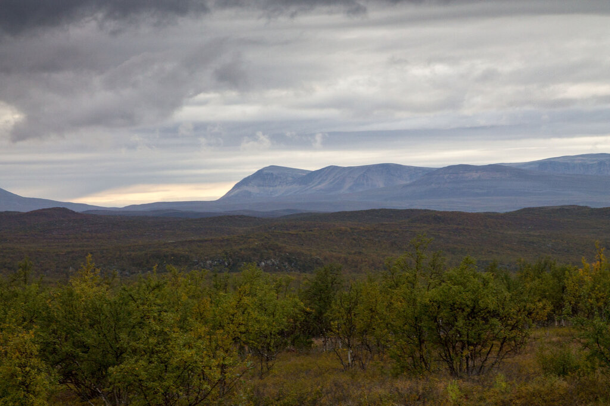

На участке, по которому мы ехали, был небольшой ремонт дороги. Однако, меры безопасности были по настоящему неожиданные и на наш взгляд чересчур жесткие. Машины блокировались с двух сторон двумя светофорами, затем подъезжала специальная машина с мигалками  - "Ledebil", которая ехала впереди машин, указывая путь. Затем она разворачивалась и точно таким же образом провозила встречный поток, который ждал, пока мы проедем.

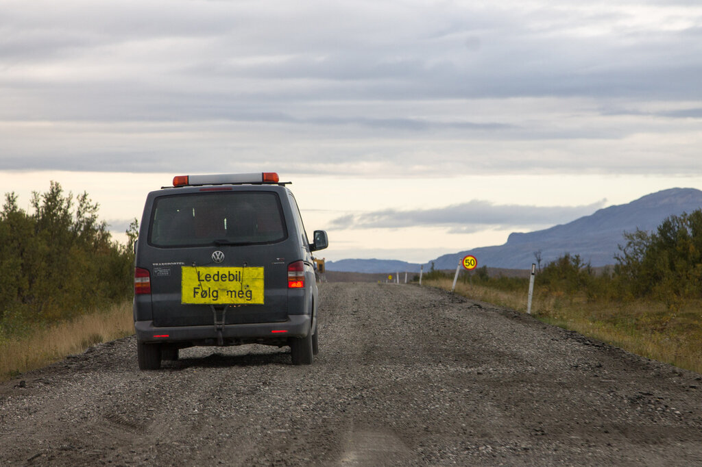

Природа настолько завораживала, что мы начали останавливаться каждые 15 минут. В результате в кемпинг [Nordkapp Camping](http://www.booking.com/hotel/no/nordkapp-camping-as.ru.html?aid=878635;sid=b6008aa2510d1d9a03d3b7b2e3d86468;dcid=1;dest_id=-263884;dest_type=city;dist=0;group_adults=2;room1=A%2CA;sb_price_type=total;srfid=7d68256554a7cb3e410af2d7b36d1bc1c70f7617X1;type=total;ucfs=1&) мы приехали затемно и долго названивали администратору кемпинга по skype, чтобы получить ключи.

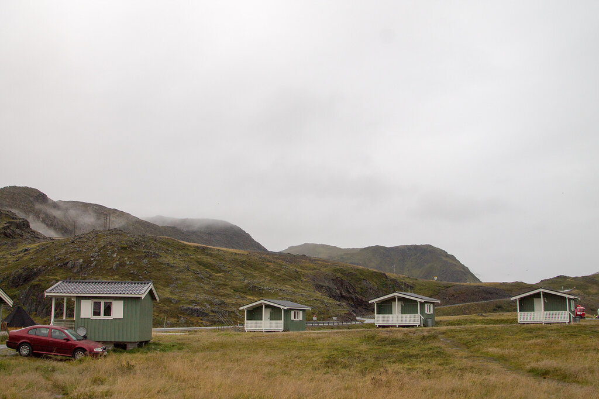

Разумеется, добраться сюда можно не только на машине. Для некоторых было бы утомительно провести за рулем половину отпуска, поэтому как вариант: долететь из Москвы до Осло и арендовать машину на месте.

По авиабилетам можете примерно сориентироваться тут:

или сходите на [Aviasales](http://www.aviasales.ru/?marker=25257) или Skyscanner.

Читайте все части нашей истории о Норвегии:

- [В Норвегию на машине. Часть 1. Подготовка к поездке](https://vodpop.ru/v-norvegiju-na-mashine-podgotovka/ "В Норвегию на машине. Часть 1. Подготовка к поездке")
- [В Норвегию на машине. Часть 3. Нордкап и Лофотенские острова](https://vodpop.ru/nordcap-i-lofotenskie-ostrova/ "В Норвегию на машине. Часть 3. Нордкап и Лофотенские острова")
- [В Норвегию на машине. Часть 4. Тропа Троллей и Атлантическая дорога](https://vodpop.ru/atlanticheskaja-doroga/ "В Норвегию на машине. Часть 4. Тропа Троллей и Атлантическая дорога")
- [В Норвегию на машине. Часть 5. Ставангер и Прекестулен](https://vodpop.ru/stavanger-prekestulen/ "В Норвегию на машине. Часть 5. Ставангер и Прекестулен")
- [В Норвегию на машине. Часть 6. Осло и Стокгольм](https://vodpop.ru/oslo-stokholm/ "В Норвегию на машине. Часть 6. Осло и Стокгольм")

Возможно, вам также будут интересны статьи о наших других поездках на машине по северным странам:

- [Исландия на машине зимой](https://vodpop.ru/category/evropa/islandiya/)
- [Вся Великобритания на машине](https://vodpop.ru/category/evropa/velikobritaniya/)
