Наконец-то выклянчила у Клима фотографии, поэтому спешу записать все, пока окончательно не забыла. И хотя впечатления текущей поездки (нынче мы в бывшей Югославии) живо бурлят, постараюсь "вспомнить все". Итак, поездка случилась довольно спонтанно в один из вторников - оставался час до занятий танцами (мы ходим на буги-вуги и линди-хоп), как Климу написал один из наших заказчиков (если интересно, чем мы занимаемся - велкам на uxman.ru ) с предложением встретиться. Мы не долго думая, кинули зубные щетки и сменную одежду в машинку и поехали в Питер. Не планируя поездку заранее, попали в вечерние пробки, и попали в небольшое ДПТ - не уступили дорогу разворачивающейся на 2 полосы газели - немного задели верхний слой краски, поэтому водители высказали взаимное "фи", и мы поехали дальше. В детстве я была в Великом Новгороде, но воспоминания несколько поутихли за столько-то лет. Клим не был ни разу, поэтому было решено сделать остановку на сон именно там.

<!--more-->

Вид на Кремль снаружи

[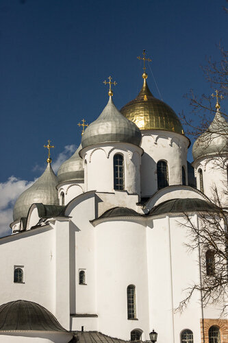](http://fotki.yandex.ru/users/klimentij511/view/834162/)

Софийский собор (внутри Кремля). У рожденных в 90е должна всплывать картинка из школьного учебника (цветной разворот по центру).

Немного эгоизма. Рядом с маленьким сувенирным рынком.

Питер, точнее Санкт-Петербург, мы оставили в этот раз без фотографий, т.к. на встречу мы фотоаппарат брать не стали, а больше нигде особо и не гуляли. На следующий день было решено поехать в Выборг и мы подумывали о поездке в Хельсинки - загранпаспорта мы все время возим с собой, но особой мотивации ехать не было. Почитали форумы - люди туда в основном за жидкостью для мытья посуды ездят..Вообщем, полная неопределенность, а вот Выборг нам рекомендовали очень многие. Мы не попали в Крепость, стоящую на островке, зато вдоволь погуляли по старому городу.

[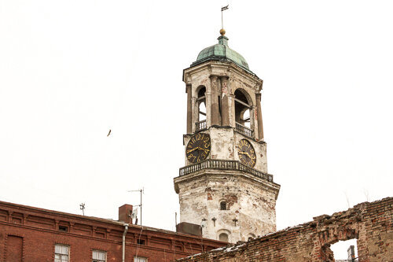](http://fotki.yandex.ru/users/klimentij511/view/834173/)

Я была за рулем, но на подъезде к центру отдала руль Климу - начался совершенный хаос - плохие дороги, нервные водители, а под конец и вовсе пошла брусчатка. Не знаю, что за автомобиль нужен для таких дорог, но лично в нашем ехать по брусчатке - удовольствие не из приятных. Город атмосферный, пропитанный духом истории. Крайне запущенное состояние домов, стоящих на центральной Крепостной улице.

[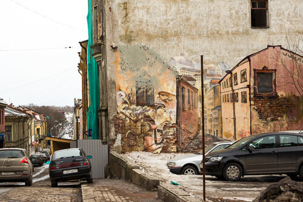](http://fotki.yandex.ru/users/klimentij511/view/834176/)

Судя по навешанным спутниковым тарелкам, люди предпочитают смотреть в экран телевизора, не обращая внимания на разруху вокруг.

[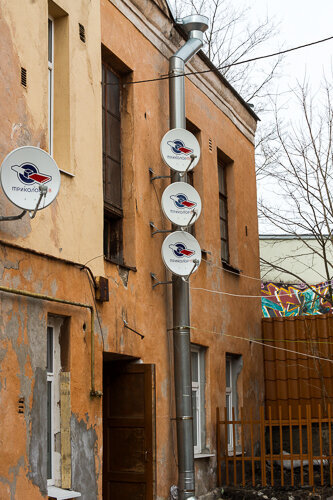](http://fotki.yandex.ru/users/klimentij511/view/834177/)

Под ногами полнейший каток. Я с интересом наблюдала за миловидной блондинкой, шедшей со скоростью улитки на каблуках по узким наклонным брусчатым улочкам, покрытым толстым слоем льда. Надеюсь, она жива. Я передвигалась с помощью Клима и попы. [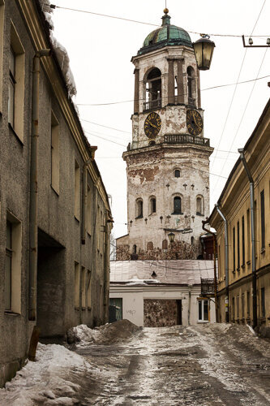](http://fotki.yandex.ru/users/klimentij511/view/834179/)

Наверное, Выборг приятнее, точнее удобнее, смотреть в теплое время года.

[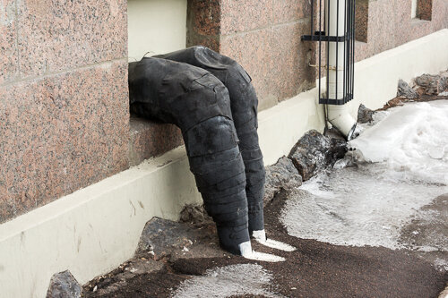](http://fotki.yandex.ru/users/klimentij511/view/834183/)

Я сначала подумала, что человек торчит из окна. Оказалось -трубы, похожие на ноги.

Закрытые ворота крепости. Будет повод вернуться.

А еще запомнилось место под названием "Медведь", на той же Крепостной улице - очень вкусно готовят, рекомендую!

[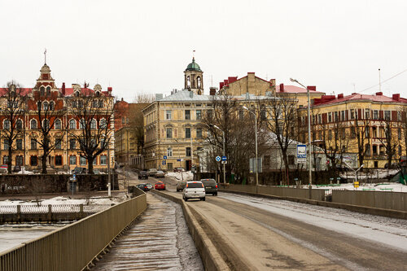](http://fotki.yandex.ru/users/klimentij511/view/834188/)

Отреставрированный кусочек Выборга.

Собственно, когда мы сели в машину, план поехать в Финляндию уже созрел. Изначально планировалось до Лапеенранты, но потом, уже в Финке, решили поехать до Хельсинки. Мы заехали в ВСК, купили страховку на машину и медицинскую, и дали деру до границы (была пятница, боялись попасть в толпу выезжающих на выходные питерцев). Дорога так себе, но ехать можно. Граница прошла незаметно, пограничники явно привыкли к русским туристам-шопоголикам. Немного покружив на развязках, мы оказались в Лапеенранте, которая как-то не зацепила нас. Разве что велосипеды, оставленные зимовать на улице.

[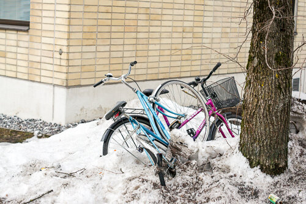](http://fotki.yandex.ru/users/klimentij511/view/834189/)

Тут мы и решили проехать еще 300 км, чтобы увидеть столицу. Во многом благодаря потрясающему пансионату Рантапуйсто, в котором мы остановились на 2 дня, нам невероятно понравилось все. Мы жили в сосновом бору, с бесплатной парковкой (я теперь в каждом отеле на это внимание обращаю, а то крайне недешево по 10-18 евро за день отдавать..), потрясающе вкусным воздухом и бесплатной сауной на территории. Мы никуда не спешили и у нас не было цели посмотреть все достопримечательности. Воспользовавшись рейтингом трипадвизора, нашли музей "Эврика" - нечто похожее есть в Мск, на Бутырской - музей "Экспериментариум".

[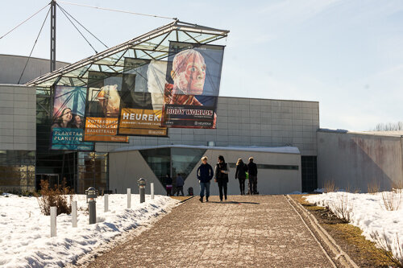](http://fotki.yandex.ru/users/klimentij511/view/834192/)

Внутри музей поделен на несколько частей. Мы начали посещения с обеда, о чем чуть позже я пожалела. Первая часть, где мы оказались, -музей Человеческого тела. Там представлены экспонаты - живые люди, которые пожертвовали свои тела для науки. Сначала, пока шли скелеты, все было неплохо. Потом пошли мышцы, кровеносные сосуды, а под конец экспонат - беременная женщина, с плодом внутри, окончательно добили меня. Я почти выбежала в другую часть музея, где представлены всякие занимательные явления физики. Например, велосипед с грузом под потолком.

[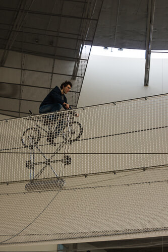](http://fotki.yandex.ru/users/klimentij511/view/834193/)

Климентий пошел первым, а я стояла внизу и фотографировала. Потом было решено поменяться местами, и я тоже забралась на велосипед.

[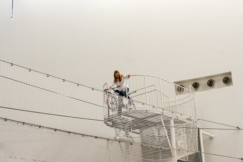](http://fotki.yandex.ru/users/klimentij511/view/834194/)

Но едва он пошатнулся в сторону, мне опять стало плохо, и решив не рисковать чистыми головами посетителей, решила на нем не съезжать. Минут 10 сидения не полу башенки, и мы продолжили осмотр. До сих пор жалко, хотя Клим говорит, что ничего особенного. Вечером мы гуляли по парку, центральным улочкам и наслаждались вкусом местной кухни. Под конец путешествия мы купили упаковку Fairy, всем форумчанам на зависть) Обратная дорога была в 2 смены, без сна. Добрались без пробок.
