Знакомство со страной викингов мы начали с Северной Норвегии. Дикая природа, резкие перемены погоды, пронизывающий ветер и купание в Северном Ледовитом океане  - малый перечень того, что мы успели объять за несколько дней.

<!--more-->

Ссылки на предыдущие и последующие части нашей истории о Норвегии находятся в конце статьи.

## День 5. Honningsvåg  - Альта

Утро началось со звука стирающихся покрышек и продолжилось взлетом вертолета. Как выяснилось позже, рядом с нашим кемпингом снимали видео про супер-кары, которые по очереди уходили в управляемый занос(дрифт) по кругу. Внутри облака дыма кружится Chevrolet Camaro 70-х годов выпуска.

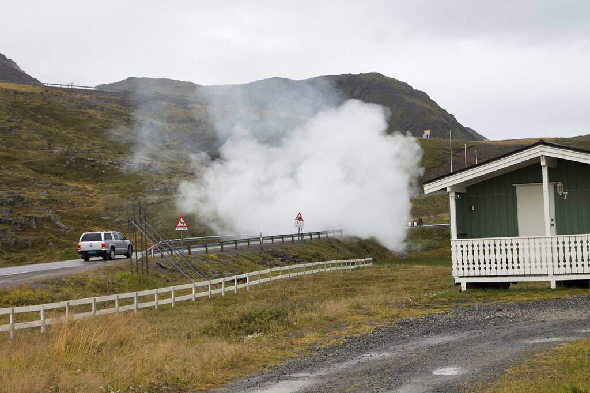

Утренние процедуры, сытный завтрак и погрузка всех вещей в машину - вот, пожалуй, портрет нашего типичного утра. Как мы не старались с вечера оставлять большую часть вещей в машине, у нас не получалось. Вроде и брали только самое необходимое, но в скромных домиках норвежских кемпингов не оставалось и намека на свободное место.

Тем временем, мы добрались до самой северной точки  Евросоюза - мыса Нордкап, который, как оказалось, вовсе ею не является. Как видно на фото (смотреть левее), мыс Кнившелльодден  выступает на 1500 метров севернее, но, возможно, меньше подходил для обустройства смотровой площадки.

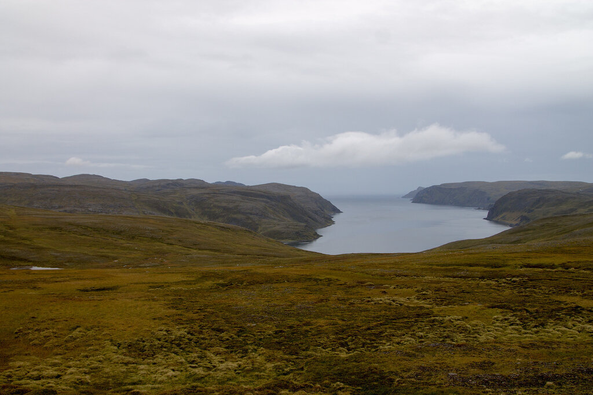

По приезде мы заплатили 640 NOK за билеты на четверых, которые включали в себя бесплатную парковку автомобиля. Каждому выдали информационный буклет со схемой музейного комплекса. Почитать всю полезную информацию о мысе Нордкап и скачать буклет можно с официального сайта: [http://www.nordkapp.no/](http://www.nordkapp.no/)

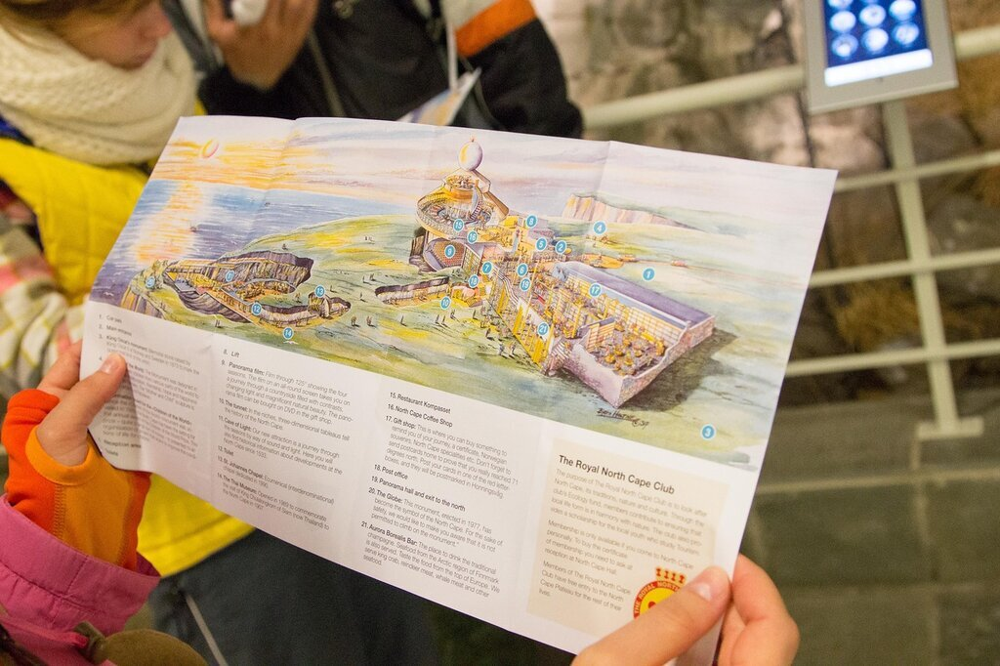

После посещения кинотеатра, ознакомления с экспонатами выставки и инсталляции о 4 сезонах погоды в Норвегии, мы решили выйти "наружу". И здесь нас ждал совершенно ужасающий ветер , который выворачивал зонтики насквозь, и моросящий дождь, благодаря которому буквально за 5 минут мы промокли до последней нитки.  Для сравнения приведу фотографии до и после начала буйства стихии.

До

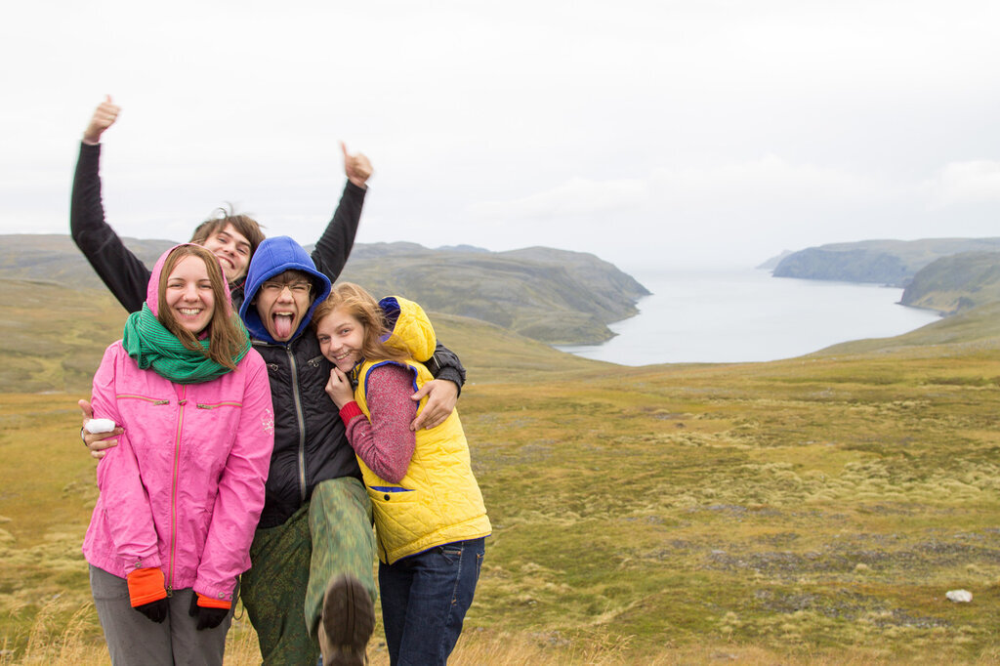

После

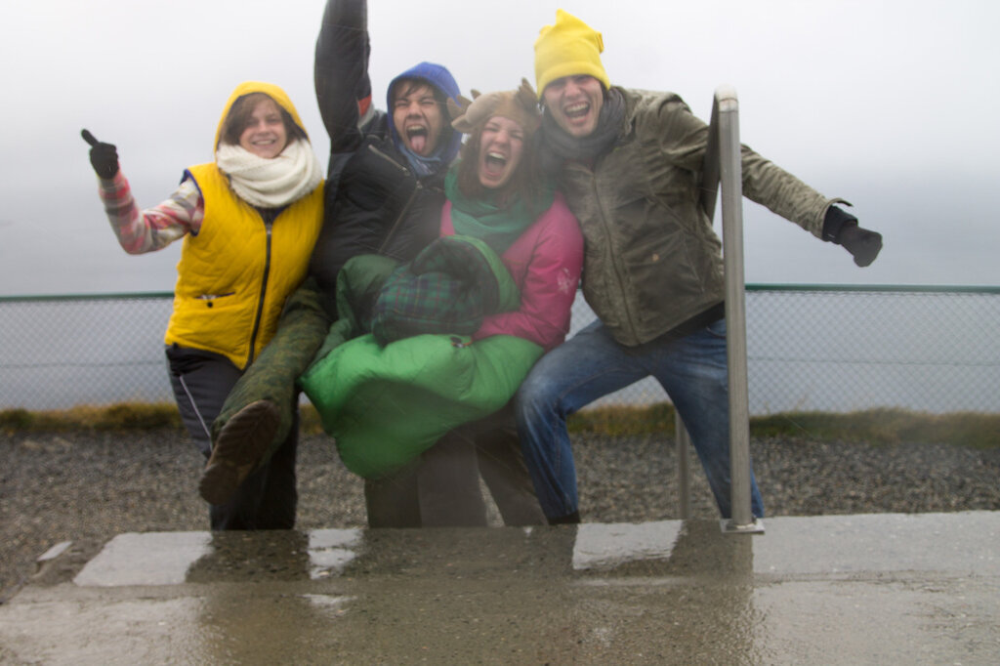

Удивительно, насколько быстро, резко меняется погода в это время года. Мы сознательно выбирали низкий сезон для поездки в Норвегию - конец августа-начало сентября. Высоким сезоном для всей Норвегии считается период с 1 июля по 14 августа. Южную часть страны (фьорды, Осло) можно посещать с начала мая - еще довольно прохладно, но уже можно не бояться замерзнуть во время длительных прогулок (но я настоятельно советую на всякий случай взять термобелье, чтобы на вас не смотрели косо, когда вы в попытках согреться натяните на себя спальник).

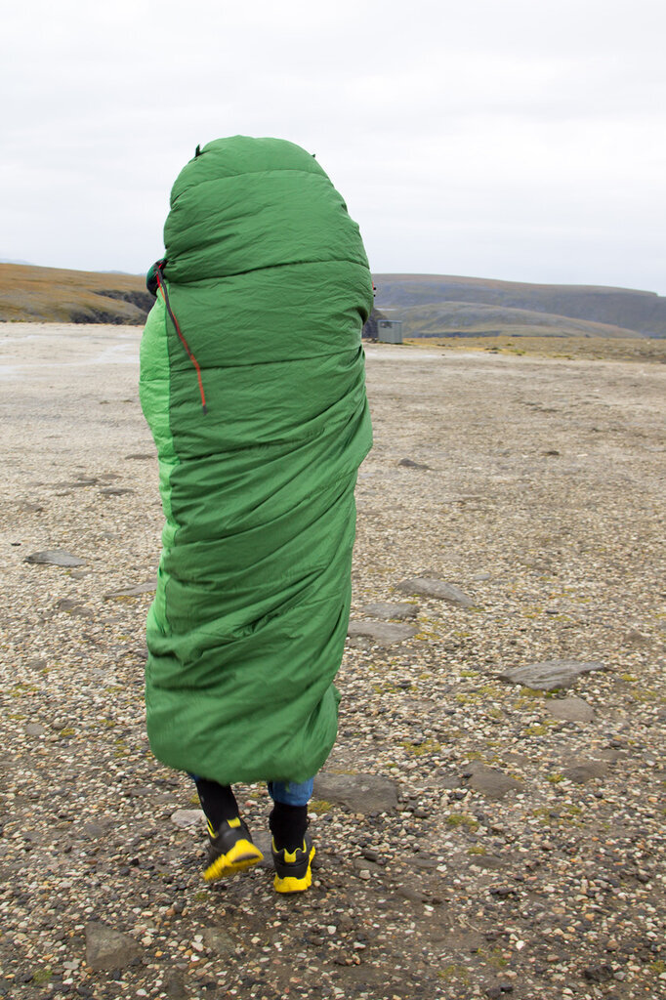

В продолжение "погодной" тематики вспоминается норвежская шутка:

"Вам не нравится наша погода?" - подождите 15 минут!

Что ж, мы на себе почувствовали всю прелесть Севера и побежали отогреваться внутрь. После сытного обеда, чая и бесплатного интернета на душе стало теплее. Правда, не обошлось без казусов: накануне вечером Владимиру прищемило указательный палец дверцей машины. Последовательное применение ледяной воды, обеззараживателя и прощупывание пальца на предмет перелома привели к тому, что по возвращению в домик мы зафиксировали палец в состояние "морковки".

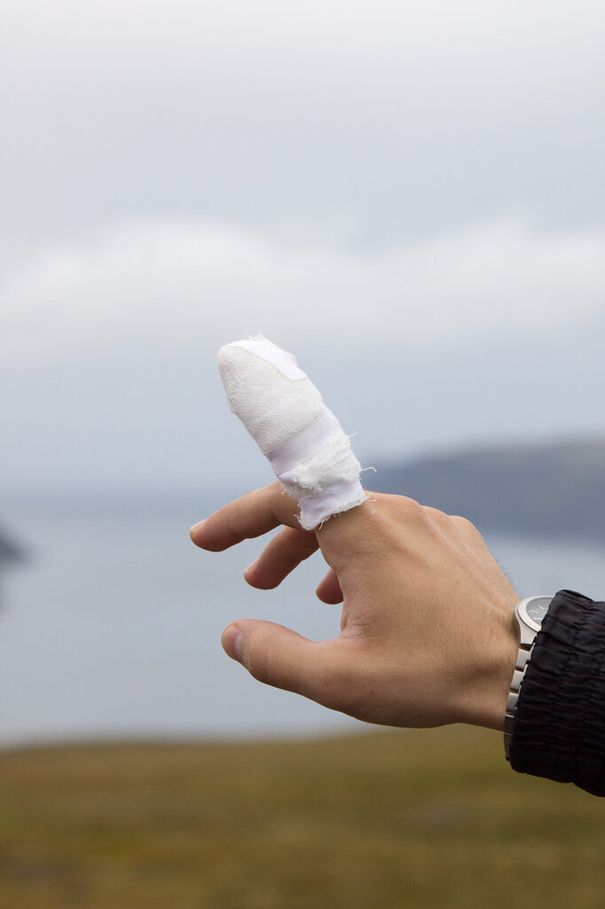

И в тот самый момент, когда Владимир достал ноутбук и приложил указательный палец правой руки - тот единственный палец, который нужен для идентификации пользователя - ничего не произошло. Зал, где сидела толпа людей, наполнился нашим хохотом.

Что ж, хорошо то, что хорошо кончается. В ноутбук он зашел с помощью пароля, а палец зажил как раз к возвращению в Москву.

Наш день только начинался. После горячей еды мы немного окрепли и решили двигаться дальше. Каково было наше удивление, когда через час погода улучшилась - на небе появилось солнышко, тучки исчезли.

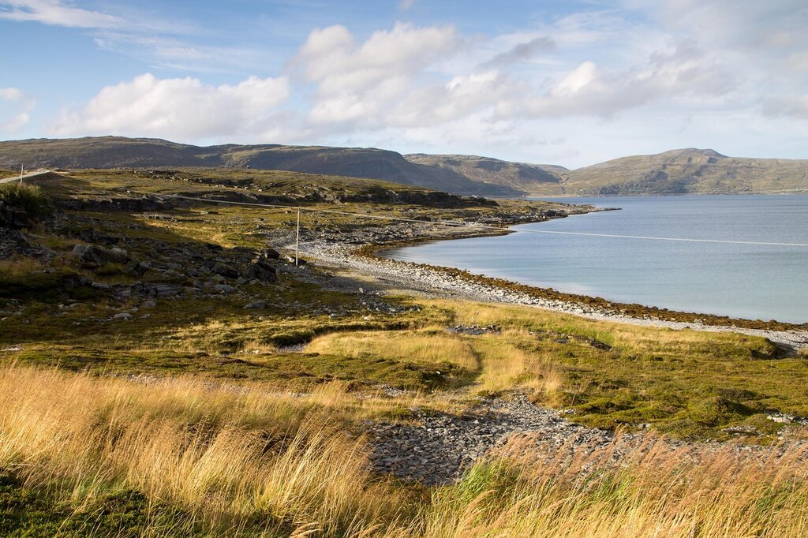

После неудачной попытки просушить вещи мы решили, что нам больше нечего терять и решили искупаться в Северном Ледовитом Океане (точнее, в Баренцевом море). По нашим ощущениям, это было почти также холодно, как и купание в Балтике в начале мая - на улице не выше +14, в воде все +7.

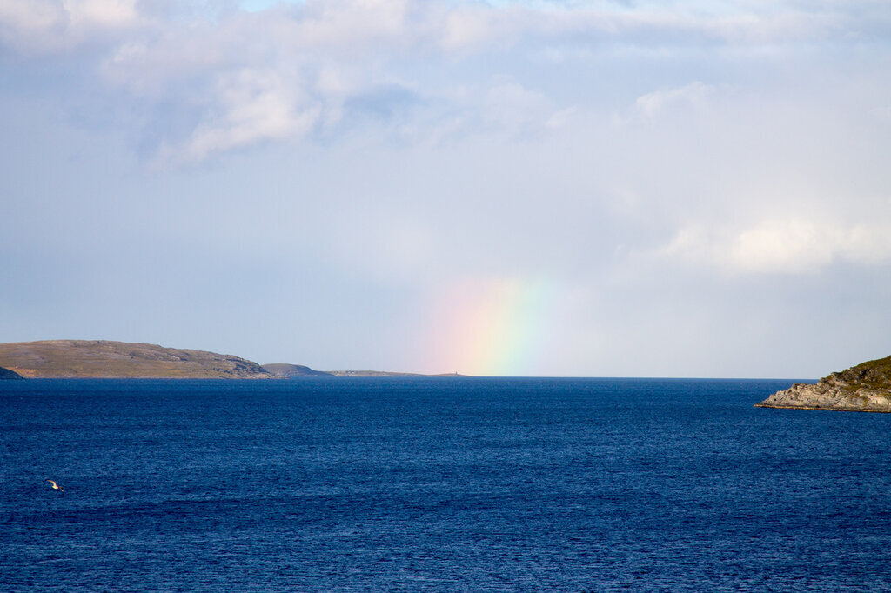

После купания мы окончательно потеряли  желание доехать  до планируемого места ночевки, поэтому постарались проехать еще немного (150 километров), чтобы остановиться в кемпинге [Solvang Camping](http://www.booking.com/hotel/no/solvang-camping.ru.html?aid=878635;sid=b6008aa2510d1d9a03d3b7b2e3d86468;dcid=12;dest_id=-256411;dest_type=city;dist=0;group_adults=2;room1=A%2CA;sb_price_type=total;srfid=826c365647da7f5b27e2659adbcc44e603c5b6cbX1;type=total;ucfs=1&). На наше счастье, в кемпинге была сауна - мы просидели в ней несколько часов, отогрелись и отправились по кроватям набираться сил

## День 6.  Альта - Лофотенские острова

Когда слово "красиво" уже не подходит.

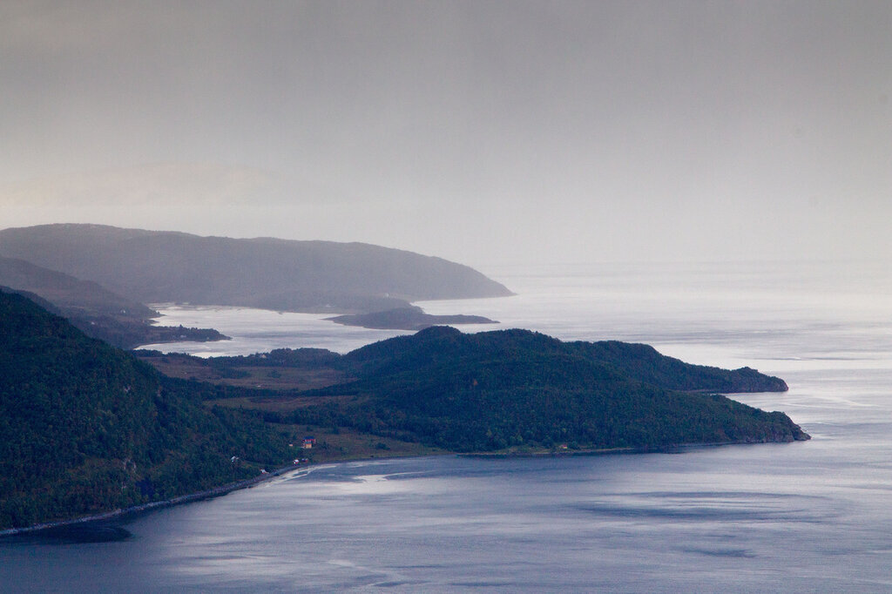

В этот день мы старались делать как можно меньше остановок, чтобы компенсировать потерю вчерашнего дня. Однако у нас не получилось до конца быть верными свои обещанием "ехать и только ехать".  Виды менялись буквально за каждым поворотом - реки, озера, водопады, горные вершины, скалистые обрывы.

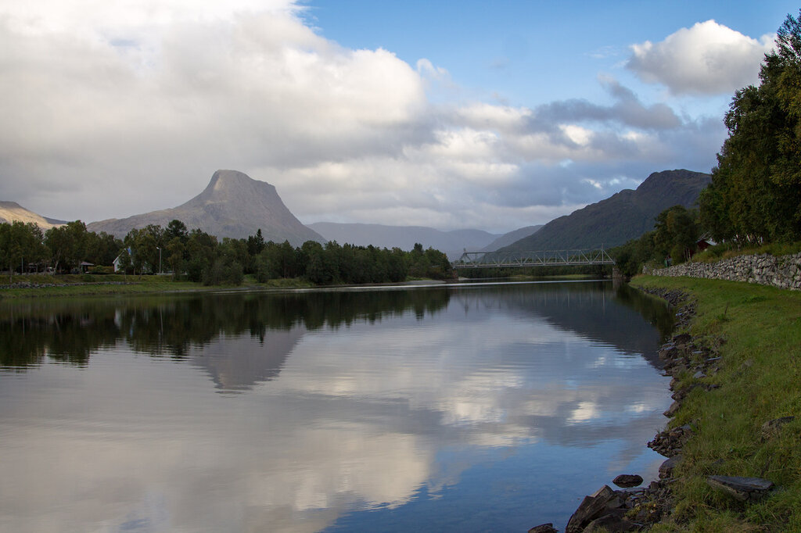

Олени встречались и тут и там. Они пасутся целыми стадами у подножия гор. Ощущение невероятного единения с природой не покидало ни на секунду.

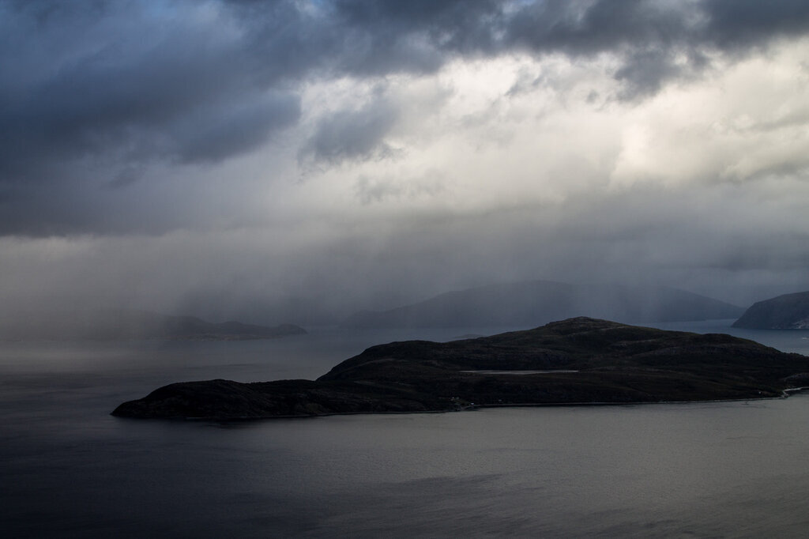

В кемпинг [Offersøy Feriesenter](http://www.booking.com/hotel/no/offersa-y-feriesenter.ru.html?aid=878635;sid=b6008aa2510d1d9a03d3b7b2e3d86468;dcid=12;dest_id=-273225;dest_type=city;dist=0;group_adults=2;room1=A%2CA;sb_price_type=total;srfid=d04f13cef4d942f5e1b487030fdd843fe6b53a90X1;type=total;ucfs=1&)  мы приехали в свое традиционное время - после полуночи. Нам оставили ключи на ресепшн и даже нарисовали карту от руки, как дойти. Не то карта была не очень, не то мы.. но на поиски было потрачено минут 15. Поздний ужин, посиделки - уснули крайне поздно и выселялись на 2 часа позже, чем положено. Правда, к этому в Норвегии отношение довольно спокойное - пара часов никого не волнуют.

## День 7. Лофотенские острова - Бодо

Лофотенские острова запомнились своей нетронутой природой, свежестью, красотой. Одним словом, восторг!

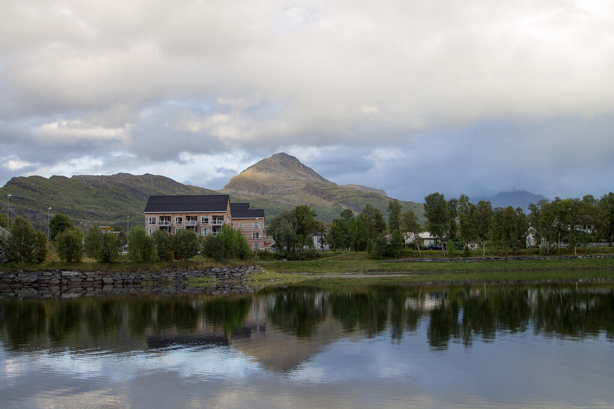

Мы сбились с количества остановок, сделанных за день. У нас была одна цель - как-нибудь выбраться с островов, желательно паромом.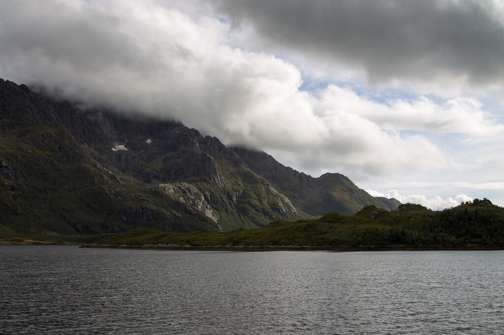

Почти у каждого норвежца есть собственная лодка.

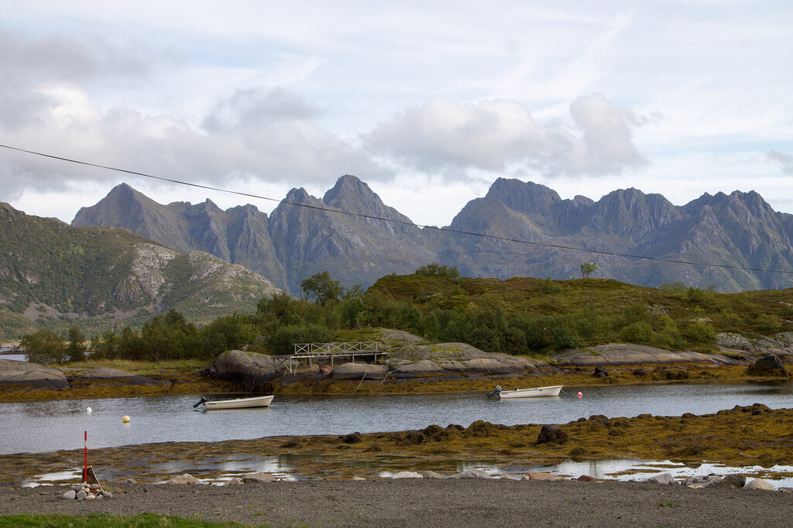

И прекрасный дом. Дома они стараются строить на удалении друг от друга (иногда до 100 метров).  Исключением из правил являются крупные города. Во всей Норвегии живет всего 5 миллионов людей, даже поселение из 100 тысяч человек - большой город. Для справки - в Осло проживает порядка 500 тысяч.

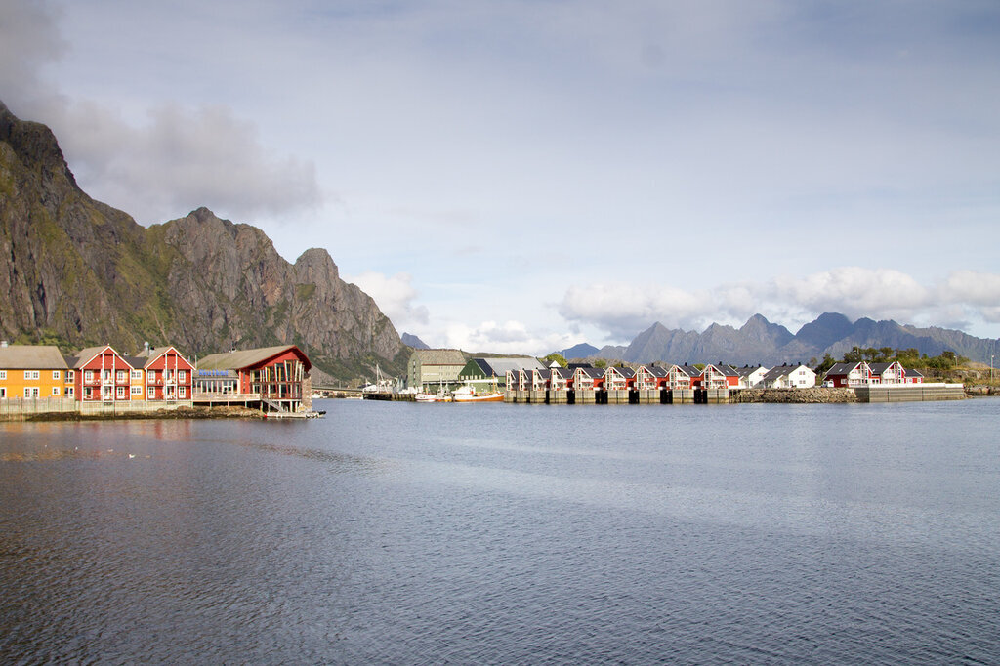

Острова соединяются между собой либо тоннелем, либо мостом. И то, и другое - произведение инженерного искусства.

В конце концов мы добрались до конечной точки маршрута - паромной станции.

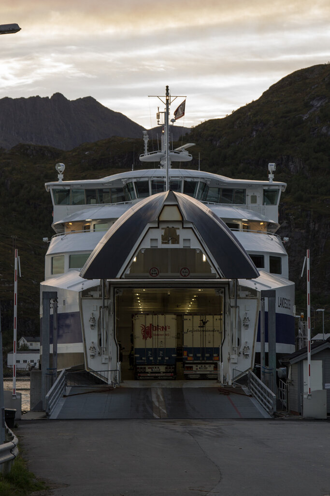

Неспешно подойдя к диспетчеру парома мы узнали поистине сногсшибательную цену за путь до Bodø - 1146 NOK за четверых + автомобиль. Решение ехать было принято за минуту, так как паром уже отчаливал, а следующий был только утром. Сказать, что нас душила жаба - ничего не сказать. Это компенсировалось позже, когда мы отплыли от берега.

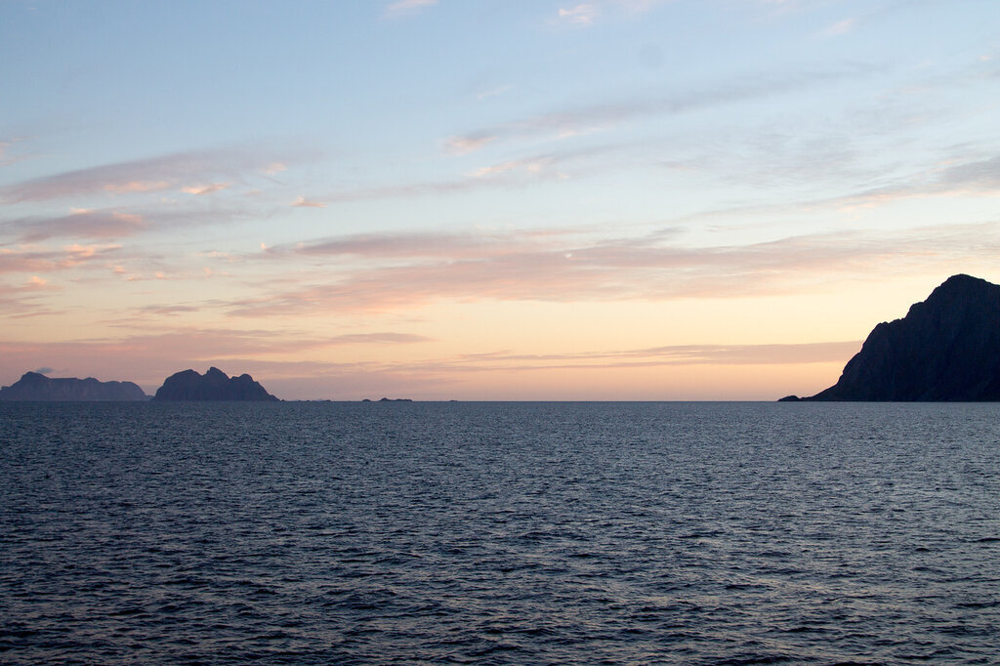

Вслед за закатом на небо постепенно опускалась темнота. И именно в эту ночь, на пароме, мы увидели северное сияние! Увы, фотографий этого потрясающего природного явления нет, так как без специального оборудования его почти не возможно сфотографировать. Мы стояли на открытой палубе парома и как дети прыгали от восторга. Это такой кусочек Норвегии, который мы никогда не забудем.

Для желающих повторить маршрут будет полезен сайт с актуальным расписанием паромов [http://www.lofoten.info/](http://www.lofoten.info/en/Ferry-and-expressboat)

Читайте все части нашей истории о Норвегии:

- [В Норвегию на машине. Часть 1. Подготовка к поездке](https://vodpop.ru/v-norvegiju-na-mashine-podgotovka/ "В Норвегию на машине. Часть 1. Подготовка к поездке")
- [В Норвегию на машине. Часть 2. Начало пути](https://vodpop.ru/moskva-norvegija-na-mashine/ "В Норвегию на машине. Часть 2. Начало пути")
- [В Норвегию на машине. Часть 3. Нордкап и Лофотенские острова](https://vodpop.ru/nordcap-i-lofotenskie-ostrova/ "В Норвегию на машине. Часть 3. Нордкап и Лофотенские острова")
- [В Норвегию на машине. Часть 4. Тропа Троллей и Атлантическая дорога](https://vodpop.ru/atlanticheskaja-doroga/ "В Норвегию на машине. Часть 4. Тропа Троллей и Атлантическая дорога")
- [В Норвегию на машине. Часть 5. Ставангер и Прекестулен](https://vodpop.ru/stavanger-prekestulen/ "В Норвегию на машине. Часть 5. Ставангер и Прекестулен")
- [В Норвегию на машине. Часть 6. Осло и Стокгольм](https://vodpop.ru/oslo-stokholm/ "В Норвегию на машине. Часть 6. Осло и Стокгольм")

Возможно, вам также будут интересны статьи о наших других поездках на машине по северным странам:

- [Исландия на машине зимой](https://vodpop.ru/category/evropa/islandiya/)
- [Вся Великобритания на машине](https://vodpop.ru/category/evropa/velikobritaniya/)
