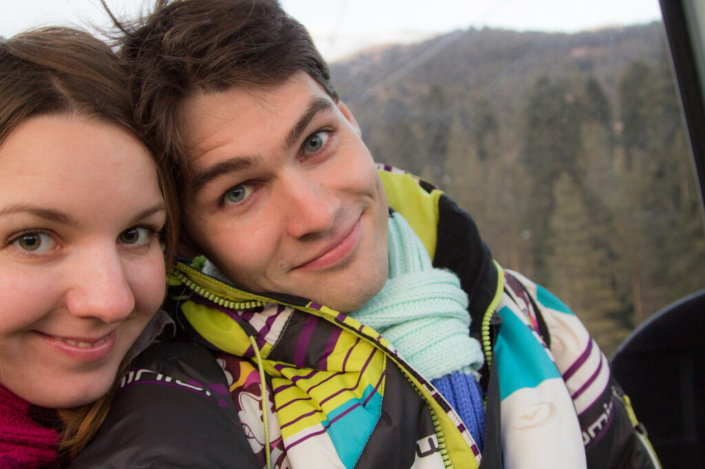

## Наша история

Мы родились в 90-м, в тихих подмосковных городках, в 20 км друг от друга. Закончили МГТУ им. Баумана, где и познакомились. В ходе обучения в университете, старательно и весьма успешно выстраивали карьеры в ИТ. Когда появились первые самостоятельно заработанные деньги, мы сразу отправились в  путешествие.

После получения дипломов, мы буквально на следующий день пустились путешествовать. После нескольких поездок по России и Европе мы взяли билеты до Бангкока в один конец и вернулись домой только спустя 7 месяцев. За это время мы проехали на мотоциклах, автобусах и автостопом почти всю Юго-Восточную Азию, увидели массу удивительных мест и познакомились с множеством интересных людей.

По возвращении из Азии мы остались в Москве на 2 года, чтобы вывести бизнес на новый уровень. В настоящее время мы вновь окунулись в [путешествие по Двум Америкам](https://vodpop.ru/puteshestvie-po-amerikam-onlayn-statistika/): прилетели в Нью-Йорк, купили машину и планируем доехать до Огненной Земли в Аргентине.

За текущими новостями можно следить в нашей группе в ВК: [https://vk.com/vodpop](https://vk.com/vodpop)

## Как мы зарабатываем

Обнаружив крайне интересную и почти не освоенную нишу в IT-секторе, мы открыли свое [юзабилити-бюро](http://uxman.ru), которое занимается проектированием и дизайном пользовательских интерфейсов. Наша команда работает в онлайне, как и все наши заказчики. Мы проводим юзабилити-тестирования, создаем интерактивные прототипы интерфейсов и рисуем дизайн. Мы с удовольствием занимаемся любимым и интересным делом из любой точки мира.

<table><tbody><tr><td><h2>Контакты Александры</h2>Skype: alexbulygina

Моб.: +7 926 532 76 66

Эл.почта:&nbsp;<a href="mailto:alex.bulygina@gmail.com">alex.bulygina@gmail.com</a>

<a href="http://vk.com/meetoyou" target="_blank">Вконтакте</a></td><td><h2>Контакты Климентия</h2>Skype: klimentij511

Моб.: +7 925 870 73 39

Эл.почта: <a href="mailto:me@uxman.ru">me@uxman.ru</a>

<a href="http://vk.com/klimentij511" target="_blank">Вконтакте</a></td></tr></tbody></table>

**По поводу сотрудничества и размещения рекламы вы всегда можете обратиться к Александре.**

## Наши путешествия

Мы посетили 55 стран и 1 одну заморскую территорию из 197 стран.

[Create your own visited countries map](https://www.amcharts.com/visited_countries/) or check out the [JavaScript Charts](https://www.amcharts.com/).

