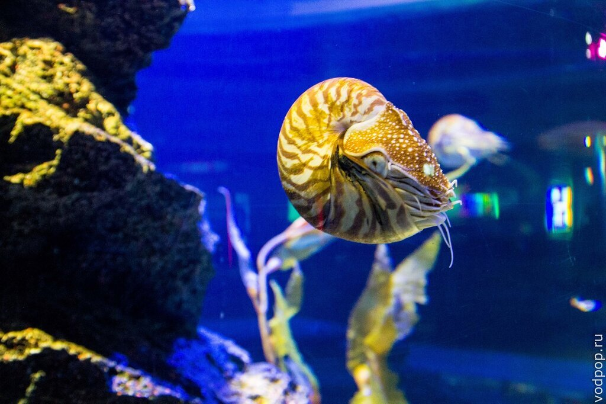
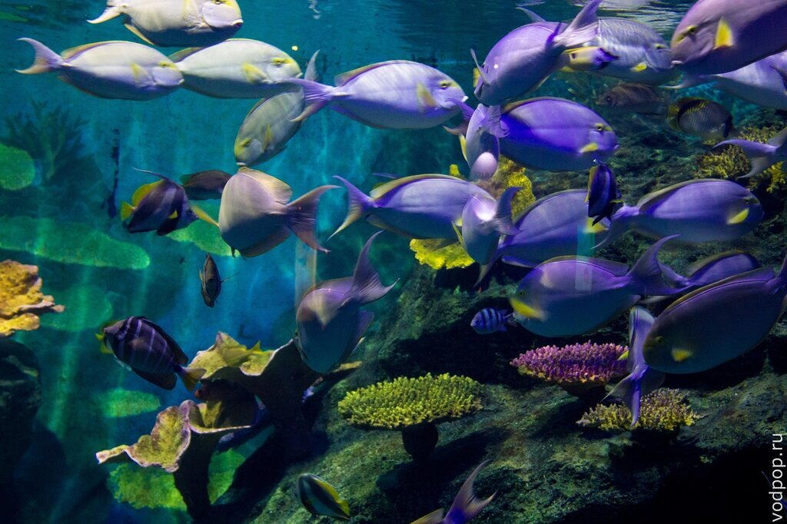
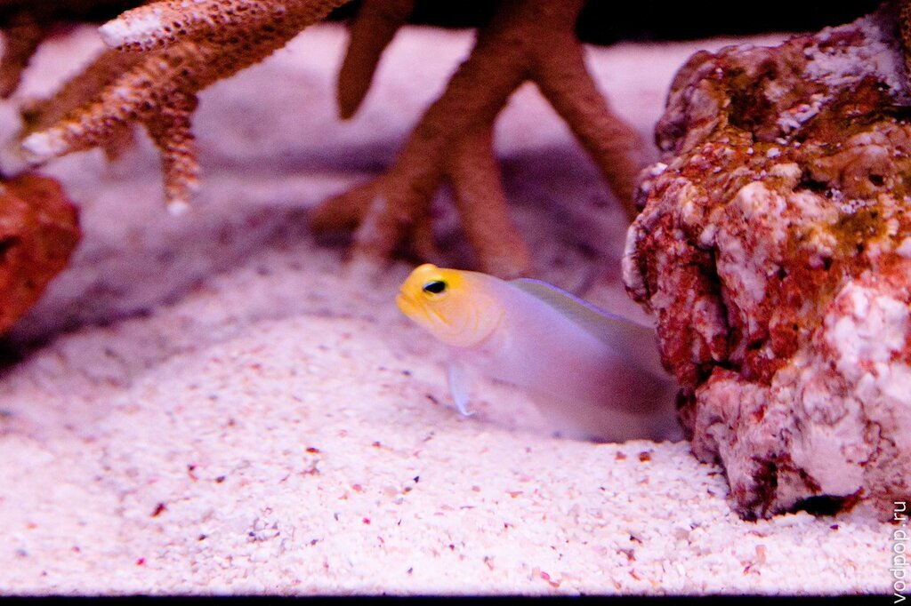
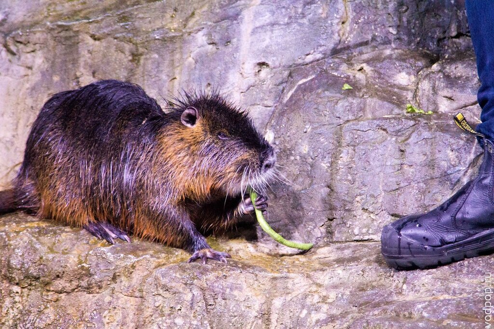
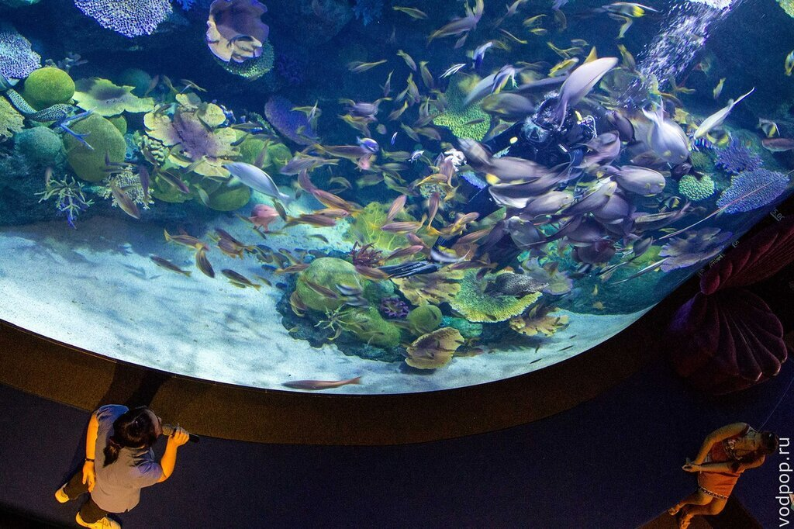
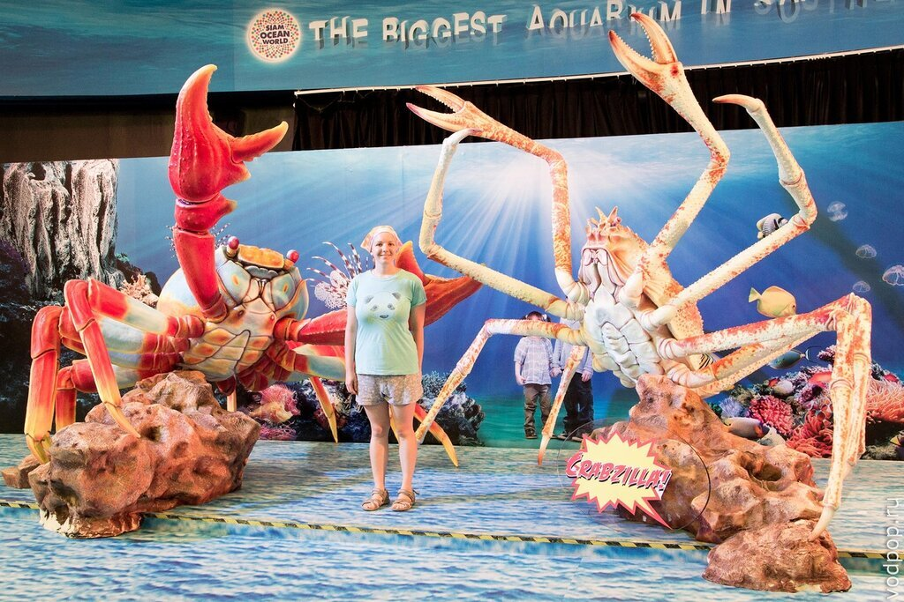

Океанариум Siam Ocean World  в Бангкоке - второй по величине океанариум в Юго-Восточной Азии, стал второй достопримечательностью, которую мы посетили по прилету в Бангкок.

<!--more-->

Океанариум в Бангкоке находится на нижнем этаже в крупном торговом центре Siam Paragon и занимает 10 тысяч квадратных метров. Мы немного поплутали по ТЦ, прежде чем найти нужный вход. Самый простой способ сориентироваться - выйти на станции Siam и следовать по указателям "Siam Ocean World", а рядом со входом в ТЦ спуститься на нижний этаж B1-B2 на эскалаторе.

**Краткая справка.**

Океанариум в Бангкоке открыт в 2005 году;

Он принадлежит компании Oceanis Australia Group, которая строит океанариумы по всему миру;

Стенки аквариумов имеют толщину 14 см;

Общее количество воды в аквариумах составляет 5 миллионов литров;

Океанариум разделен на 7 частей, в каждой из которой тематически подобраны представители животного мира.

## **Weird and Wonderful (Странные и Великолепные)**

Как следует из названия, здесь представлены по-настоящему странные, немного пугающие своей внешностью обитатели морских глубин. Огромные осьминоги, голубые раки, наутилусы и прочие интересные существа. Напротив осьминога висит табличка, запрещающая фотографировать, но русские туристы в большинстве своем нарушают порядок и слепят беднягу вспышкой. По этой причине запрещающие таблички представлены на трех языках: тайском, английском и русском.

## **Deep Reef (Глубокий Риф)**

 

Пожалуй, один из самых красивых аквариумов. Сначала вы видите верхнюю его часть, затем можете спуститься на первый этаж и подойти вплотную, чтобы рассмотреть его удивительных жителей. В этом аквариуме проводят шоу с погружением  в 12.00, 14.00 и 15.00 каждый день. Дайвер кормит рыбок, а девушка снаружи комментирует происходящее.

 

## **Living Ocean (Живой Океан)**

В этой части океанариума представлены рыбы необычных форм, морские коньки и даже тарантулы (обратите внимание на вход в затемненную комнату на левую стороне).

## **Rainforest (Тропический Лес)**

Здесь вы можете посмотреть на гигантских морских черепах, ящериц, змей и прочих ползающих по земле. Сфотографировать что-либо было проблематично, так как очень мало света, а спышкой слепить животных как-то не хотелось. 

## **Rocky Shore (Скалистый берег)**

Эта часть океанариума в Бангкоке находится на этаж ниже и лично мне понравилась больше всего, т.к мы попали на зажигательное выступление водяных крыс и выдр. Они вытворяли что-то невероятное, чтобы получить кусок капусты из рук дрессировщика. При этом было заметно, что у каждого животного свой характер и даже своя особенная походка. Словом, это стоит увидеть своими глазами. Выступления проходят в 11.30 и 15.30. Не пропустите! Еще здесь есть touch pool, в котором вы можете дотронуться до животных своими руками. Рядом стоит бдительная девушка и наблюдает за процессом. Думаю, она больше защищает животных, чем людей. Ту же морскую звезду так и тянет взять с собой и погладить вдали от посторонних глаз.  Еще там есть черепахи и какие-то странные животные, которых мы трогать не стали. В этом же отсеке аквариум с пингвинами. На процесс их кормления можно посмотреть в 12.30 и 16.30. 

## **Open Ocean (Открытый Океан)**

Самый яркая часть океанариума представляет собой огромный тоннель, сквозь который вы проходите и наблюдаете за самыми красивыми, яркими и опасными морскими обитателями. Именно тут можно увидеть страшных огромных акул-людоедов и даже поплавать с ними за дополнительную плату (об этом чуть ниже). Здесь же проходит кормление акул в 13.00 и 16.00.

## **Sea Jellies (Морские Медузы)**

Я бы не рискнула назвать это выделенной частью океанариума, скорее маленьким закутком с небольшим количеством аквариумов, в котором можно рассмотреть различные виды медуз. В комнатке играет приятная музыка и атмосфера очень расслабляющая. Здесь можно даже поваляться на огромном диване, стоящем в центре комнаты.

На выходе можно сделать памятную фотографию или зайти в один из двух сувенирных магазинчиков и купить памятные сувениры.

## Цены в океанариуме Siam Ocean World

**Siam Ocean World**  - одно из самых дорогих развлечений в Бангкоке. Актуальные акции и спец-предложения можно посмотреть на [официальном сайте](https://www.sealifebangkok.com/en/tickets/).

Зачастую покупка билетов через интернет более выгодна, чем в кассах океанариума. Особенно, если у вас есть статус резидента в Таиланде.

Существует несколько вариантов билетов в океанариум в Бангкоке, цена на детские билеты ниже (от 80 до 120 сантиметров).

Для тех, кто по-настоящему любит подводный мир и готов приходить сюда снова и снова, есть специальные членские билеты. Членский билет дает скидку от 10 до 20% на посещение, покупки в магазинах и дополнительные мероприятия (например, для плавания с акулами).

Если вы купили обычный билет, а внутри решили, что вам мало просто смотреть на рыбок, то  можно дополнительно оплатить следующие развлечения:

1. Плавание с акулами ( Dive with sharks):
2. Прогулка в океане (Ocean Walker);
3. Поездка по аквариуму на лодке с прозрачным дном (Glass Bottom Boat);
4. 5D кинотеатр: Показывают мультик про загрязнение окружающей среды с применением спецэффектов. Фотоаппарат лучше спрятать подальше, чтобы ее на забрызгало водой;
5. Экскурсия за кулисы (Back of house tour);

## Советы для посещения **Siam Ocean World**

1. Лучше прийти в океанариум к 11-13 часам, тогда вы сможете посмотреть наибольшее количество шоу и представлений. Если вы хотите поплавать с акулами или погрузиться в аквариум, то нужно прийти до 12.00 и подойти к специальной стойке.
2. Поешьте перед походом в океанариуме. В ТЦ Siam Paragon огромное количество кафешек на любой вкус и кошелек. Внутри тоже есть еда, но оставьте этот вариант на всякий случай.
3. Идти лучше всего в будний день. Меньше людей - больше шансов подолгу постоять над рыбкой без недовольного шипения сзади.
4. Обязательно берите с собой фотоаппарат. Многих рыб можно и нужно фотографировать - когда еще увидишь такую красоту?
5. Если у вас есть 3-4 часа времени в Бангкоке и вы не знаете, чем его занять, или у вас большая стыковка в аэропорту, то вам прямая дорога в Siam Oceam World - удивительные красоты подводного мира не оставят никого равнодушным!

Если вы уже посещали океанариум в Бангкоке или только собираетесь посетить, будем рады увидеть ваши впечатления и вопросы в комментариях!
