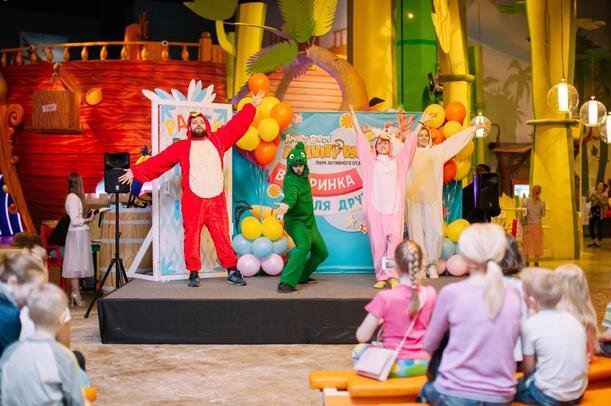
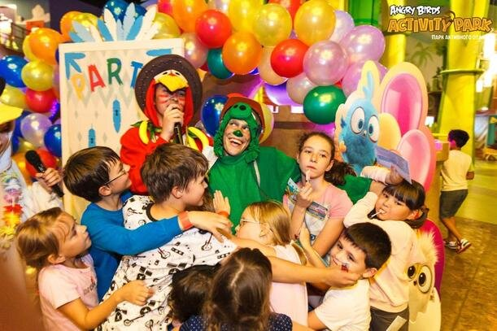
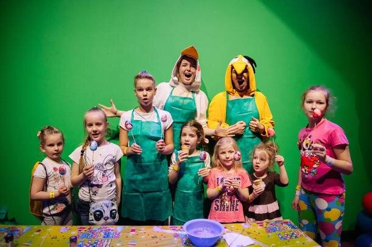
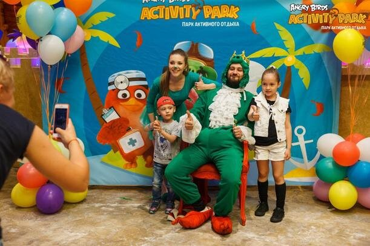

Вы - постоянный житель Петербурга или приехали сюда на выходные с ребенком? Может, только планируете поездку всей семьей? Если хотя бы один ответ положительный, то вот вам инструкция, как провести незабываемый и веселый детский праздник в Санкт-Петербурге!

<!--more-->

В парке активного отдыха Angry Birds Activity Park в Питере проводят оригинальные детские дни рождения.

В декорациях любимой игры вас ожидает целый день веселых развлечений, познавательных игр, увлекательных квестов, занимательных мастер-классов, вкусных угощений и, конечно же, подарков.

Для именинников и их друзей предусмотрены скидки на входные билеты, кафе и ассортимент магазина.

Для проведение тематического дня рождения в парке разработано 19 пакетных предложений. Героем вашего торжества может стать Редди Поттер, СвинХотеп, МС Стелла и множество других героев вселенной Angry Birds!

Узнать больше о праздновании Дня рождения в Angry Birds Activity Park вы можете по [ссылке](http://www.activityparkspb.ru/birthday/den-rozhdeniya/?utm_source=https___vodpop_ru_&utm_medium=ppc&utm_campaign=vodpop_dr).
