За последние дни поездки мы успели посмотреть две столицы Скандинавии - Осло и Стокгольм, а также нелегально переночевать в шведском кемпинге, увидеть наркомана и получить штраф за парковку. Но обо всем по порядку.

<!--more-->

## **День 14. Драммен - Осло - Стокгольм**

Встав утром пораньше, мы постарались побыстрее выселиться из кемпинга и поехать в Осло. До самого города мы добрались очень быстро, но долго не могли найти парковку. Мимо проезжали шикарные такси Tesla Model S.

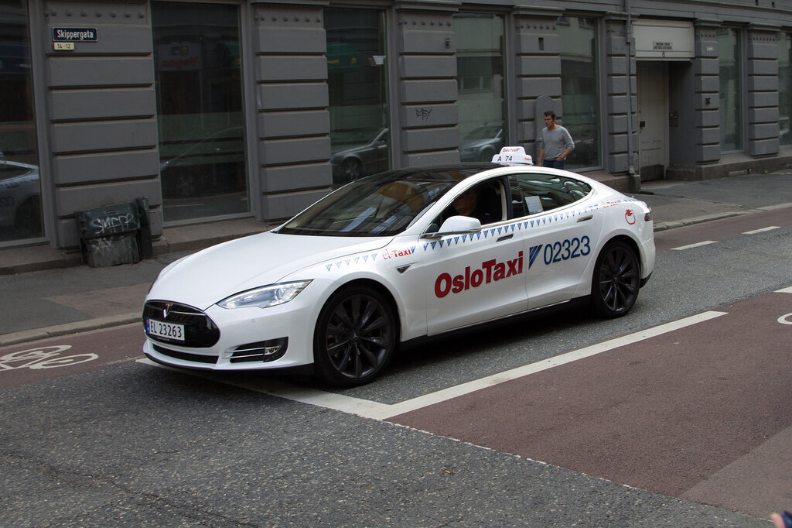

В результате долгих поисков мы припарковались рядом со зданием местной полиции. Первое, что мы увидели - местный наркоман, который почти не прячась от нас принимал дозу. Честно говоря, мне стало тошно - я первый раз в жизни видела что-то подобное (раньше только в фильме "Реквием по мечте").

Местная конная полиция.

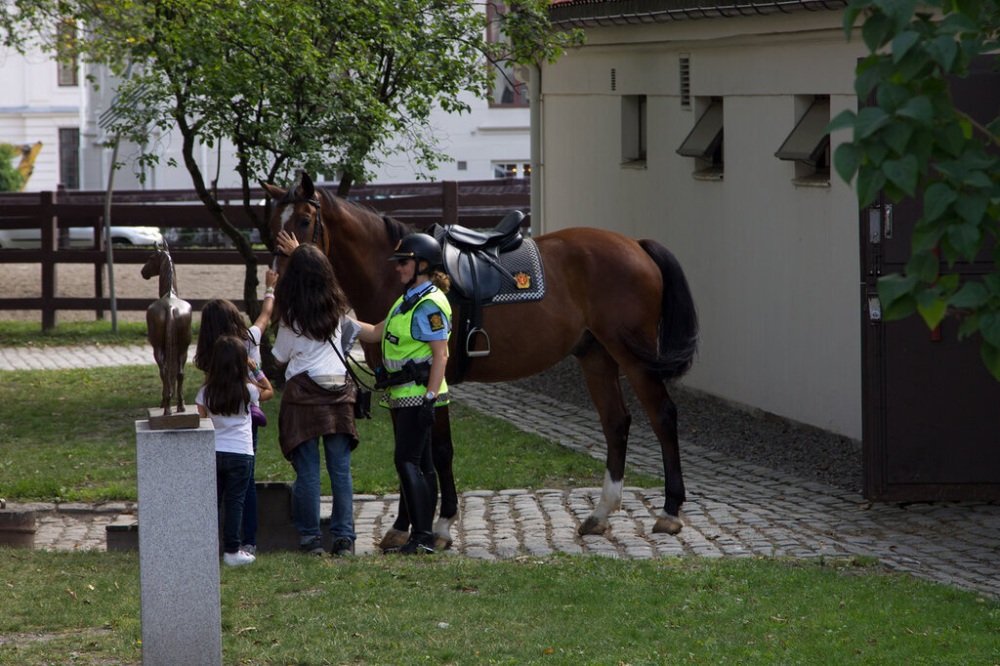

Современное искусство на улицах города.

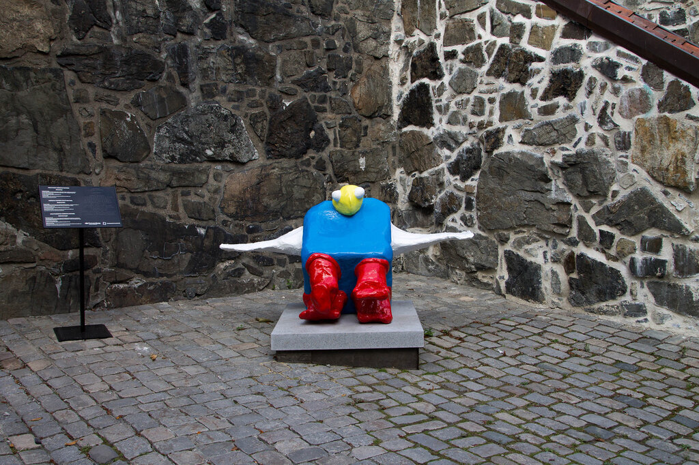

Довольно странные светофоры привлекают внимание.

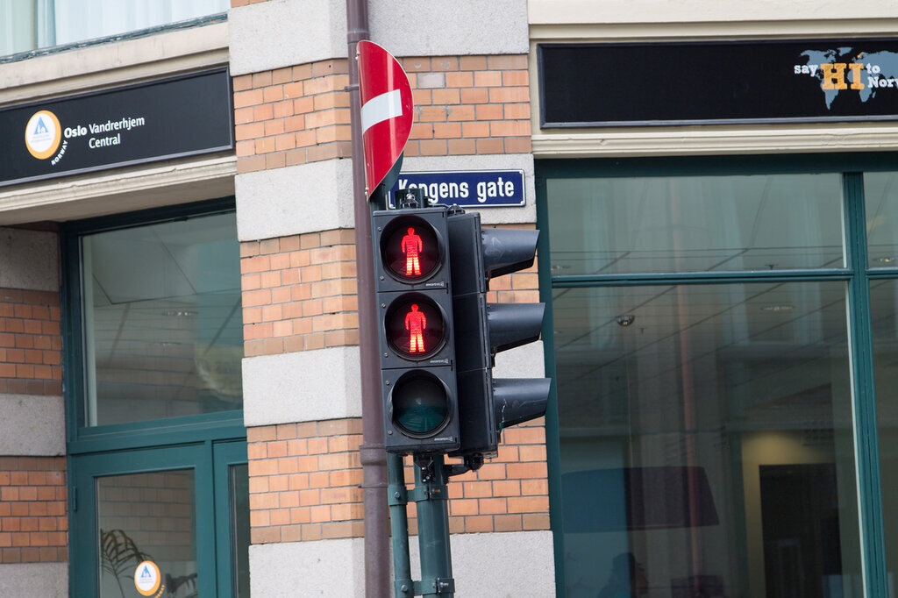

Мы зашли в крепость Акерсхус ( Akershus slott), где сейчас размещаются штаб вооруженных сил Норвегии и министерство обороны. У замка довольно богатая история и если вы в Осло больше, чем на один день, то стоит познакомиться с ним поближе. Мы застали смену караула королевских гвардейцев.

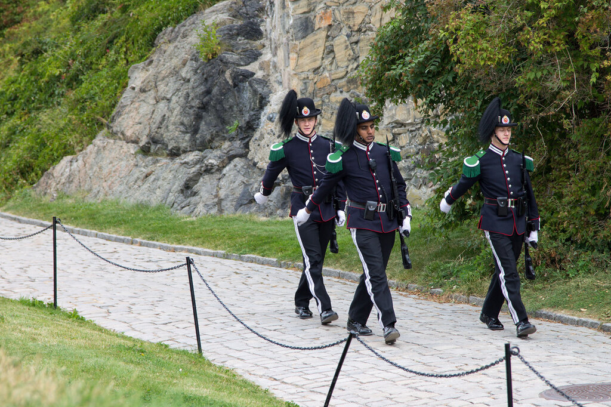

И на одной из городских лужаек увидели флеш-моб. Его смысл мы так и не поняли.

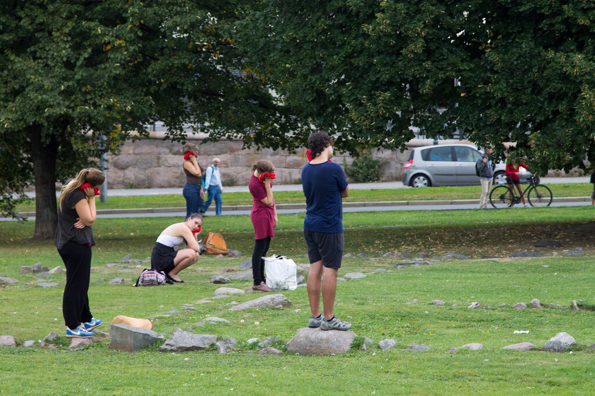Наверняка вы слышали хотя бы раз про Нобелевскую премию мира - это награда за достижения в области укрепления мира. Вручается она Нобелевским комитетом в Осло. Мы зашли внутрь этого здания, которое большую часть года работает как музей и место проведения конференций. Там вы можете взять аудиогид и узнать все, что вы не знали о премии и ее лауреатах.

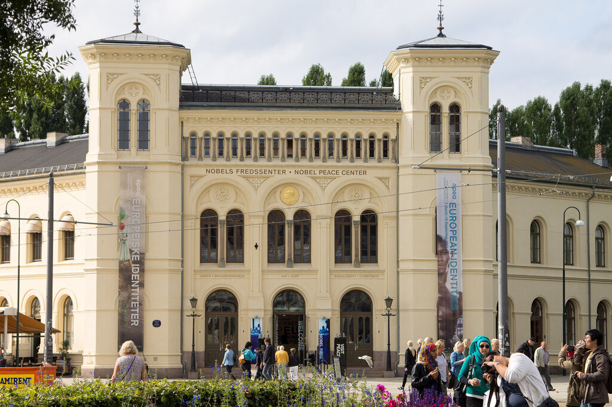

Нас поразил музей современного искусства. Мы не стали заходить внутрь, но даже снаружи это совершенно необыкновенное здание, наполненное светом. Тяжело оторвать взгляд.

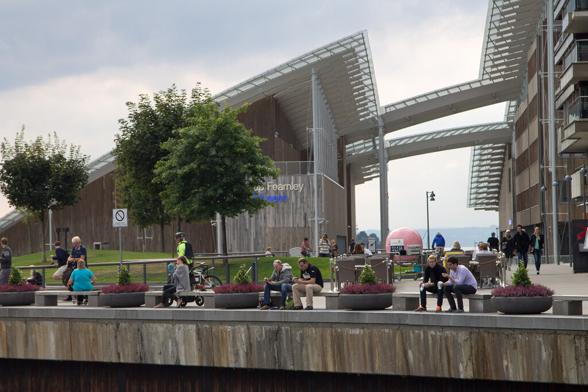

Очень много стекла и света, а строгие прямые линии дополняют образ современного мегаполиса.

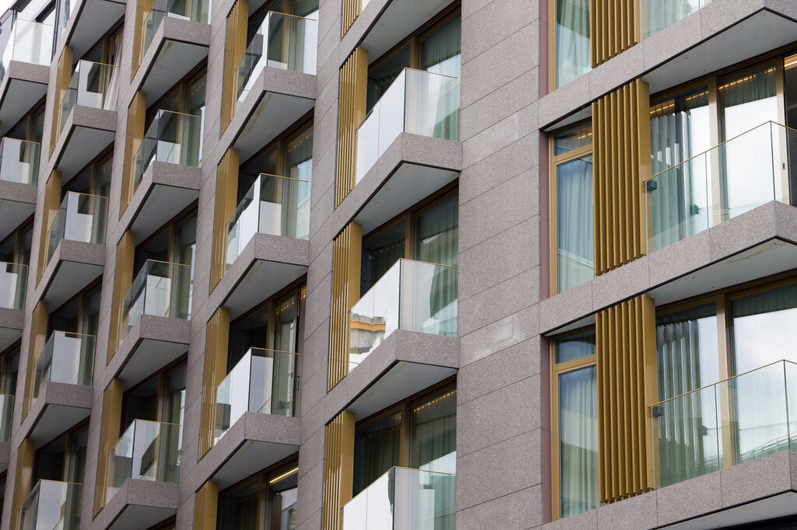

Шеф-повара из ресторанов стоят на улице и зазывают к себе посетителей яркими витринами со свежайшими дарами моря и потрясающими запахами. Мы даже видели акулу. Вот это маркетинг!

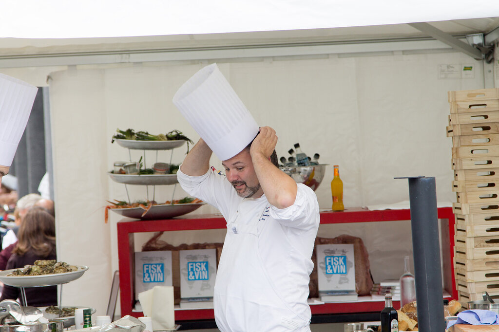

А вот уличным музыкантам здесь живется труднее, чем поварам. Несмотря на красивейшую джазовую композицию, через минуту к нему подошел охранник и вежливо попросил уйти.

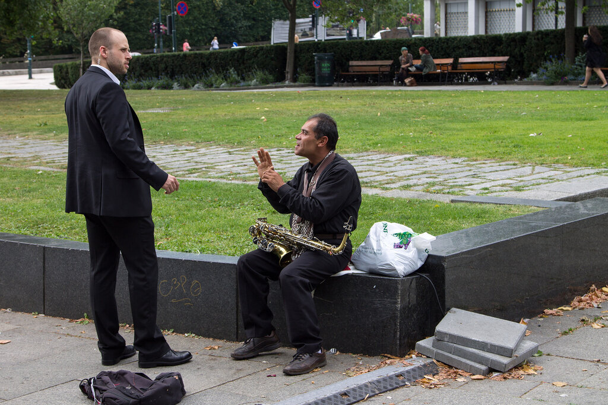

Зашли в Макдональдс, чтобы заказать самый дорогой гамбургер в мире. Такой же невкусный, как и везде.

Затем мы разделились с Дашей и Владимиром: они пошли в торговый центр за шапками (кстати, на удивление, они недорогие, так что смело везите в качестве сувениров), а мы с Климом прогулялись до Оперы. Место необычное, с какой стороны не посмотри.

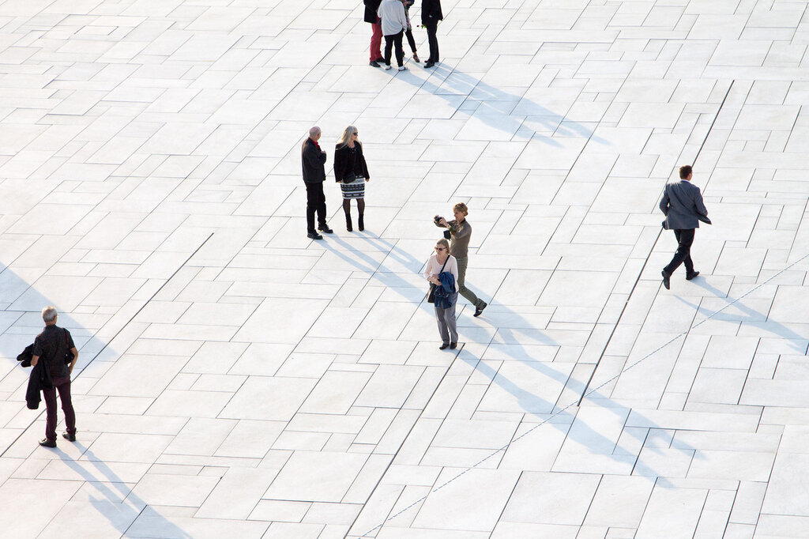

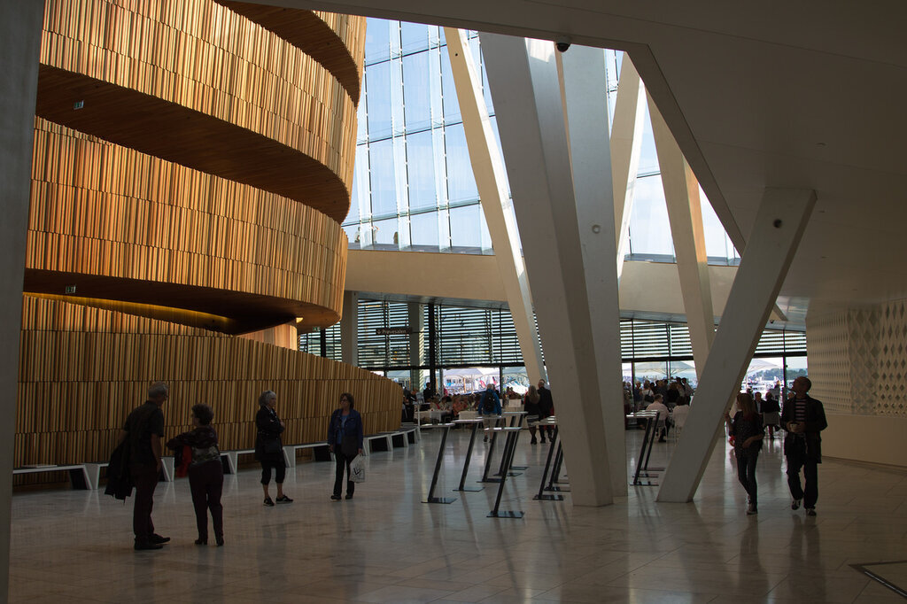

После прогулки мы подошли к машине и обнаружили желтую штрафную квитанцию. Согласно инструкции, ее нужно оплатить в течение двух недель (до этого нас штрафовали в [Хорватии](https://vodpop.ru/plitvitskie-ozera-horvatiya/ "Плитвицкие озера Хорватии — чудо природы"), где мы расплатились "на месте").

По возвращении домой мы начали искать ответ, надо ли все-таки платить или нет (выяснилось, что можно и не платить). И нашли замечательную подсказку, достойную звания "русский человек". Люди предлагают взять эту бумажку в следующую поездку в Норвегию и класть ее себе сразу под стекло. Полиция в ходе проверки будет думать, что вам уже выписали штраф, поэтому квитанцию выписывать не будет. Таким образом (безусловно, вредным и очень плохим) можно сэкономить до 3000 рублей за парковку в Осло.

А вечером нам предстояла довольно тяжелая дорога до Стокгольма. Увы, в Швеции с кемпингами куда хуже, чем в Норвегии. Поэтому мы до двух ночи пытались найти открытый кемпинг, но везде натыкались на закрытые ворота (большая часть кемпингов в сентябре уже не работает). Мы остановились у какого-то кемпинга, в котором не смогли найти ресепшен и просто поставили на их территории палатку. Утром мы попытались снова поискать, кому отдать деньги, но так и не нашли.

## День 15. Стокгольм - Турку

Приняв бодрящие утренние процедуры в озере по соседству с кемпингом, мы поехали в центр Стокгольма.

Ощущение Скандинавии осталось, но это совершенно иной город, чем Осло. Больше исторического духа, здания не столь современные и все чуточку хуже, чем в Норвегии. Тем не менее нас очаровали мощеные улочки с яркой, местами облетевшей краской.

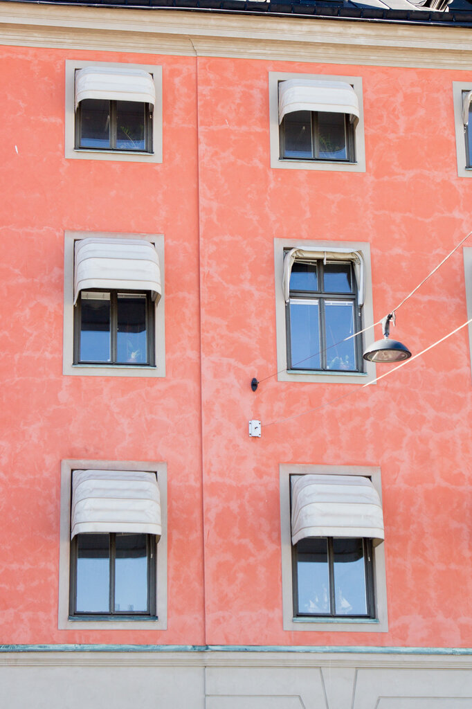

Множество велосипедов по всему городу (как в [Лионе](https://vodpop.ru/tour-de-france-shatelero-lion/ "Tour de France, Шательеро — Лион")).

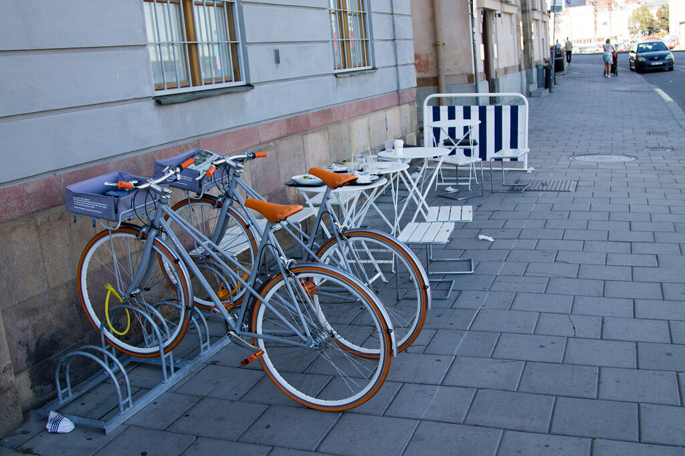

Яркие работы современных художников отвлекли наше внимание почти на час - по маленькой улочке мы передвигались крайне медленно, заходя то в один, то в другой художественный магазин.

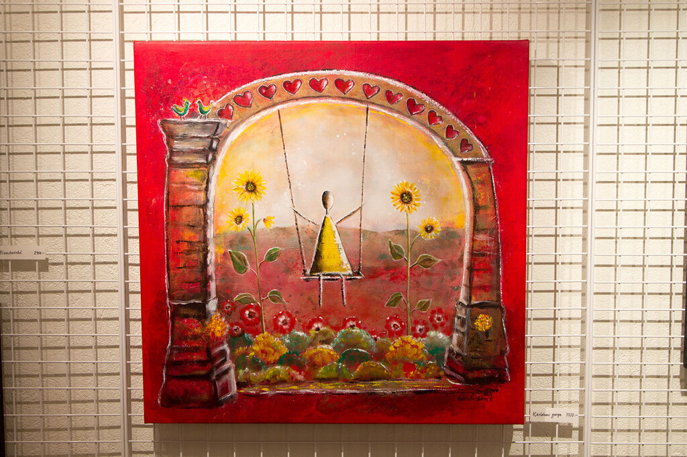

Еда в кафешках почти такая же дорогая, как и в Осло. Обед на двоих - 1500 рублей. И птицы очень ждут, когда же ты наконец закончишь трапезу и уступишь им место.

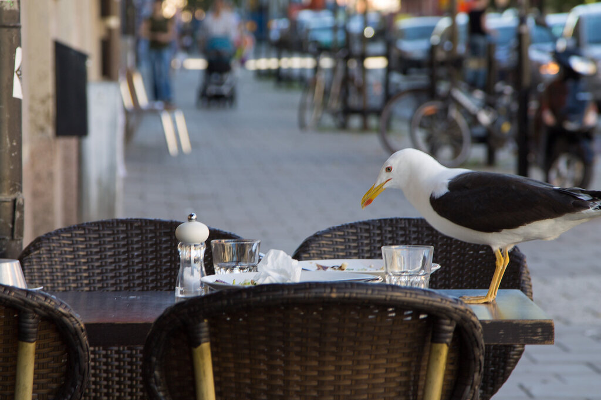

Перелив колоколов привлек наше внимание к церкви на одной из улиц - играли свадьбу. Жених и невеста отнюдь не такие юные, как у нас. Европа, однако. Особенность многих европейских свадеб  - большое количество гостей. Например, на свадьбе нашего знакомого в [Польше](https://vodpop.ru/varshava-polsha/ "Варшава. Город, возрожденный из пепла")  было больше 80 человек).

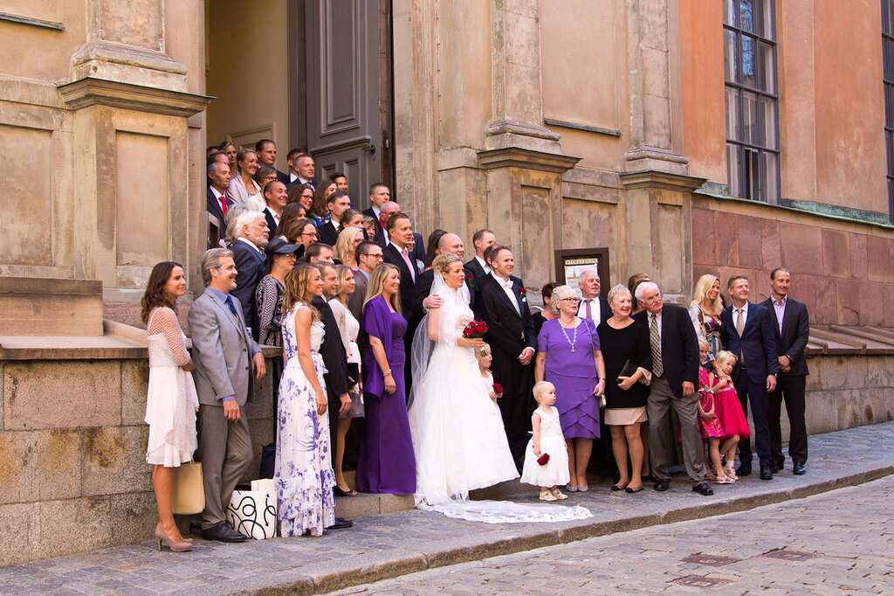

Спустились в подземку, чтобы побыстрее добраться до машины. Силы кончились, но цена за поездку крайне мотивировала пойти пешком. 100 рублей за поездку! Даже во Франции метро дешевле.

Мы приехали за полтора часа до отплытия парома. Скорость разгрузки и погрузки просто невероятная. За час работники парома успели сначала выпустить, а потом впустить, несколько сотен машин и людей. Удивительно! А вот и наша Amorella.

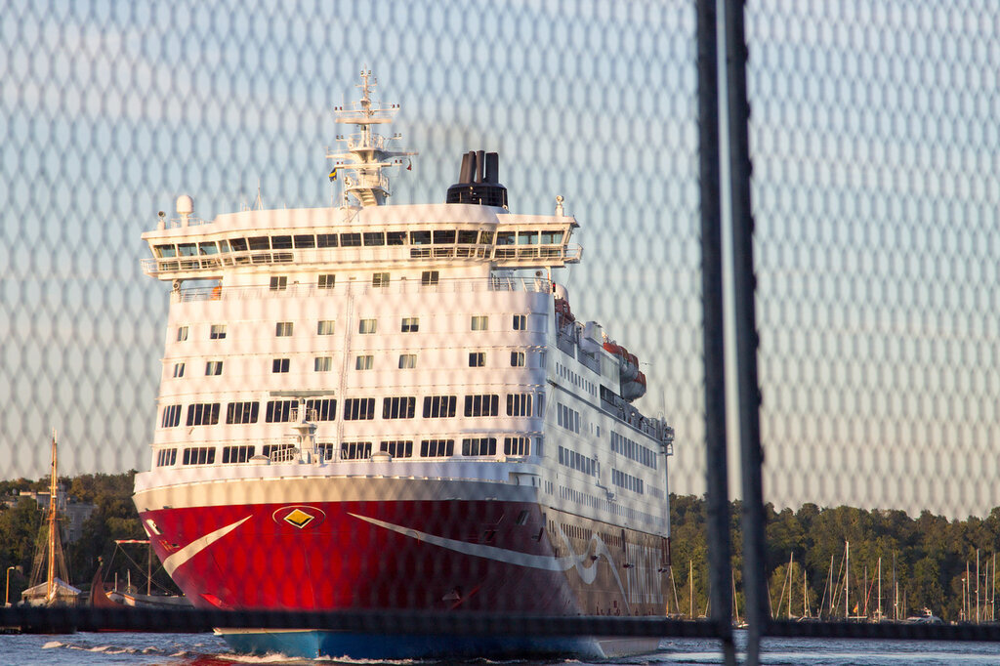

Поэтажная схема парома.

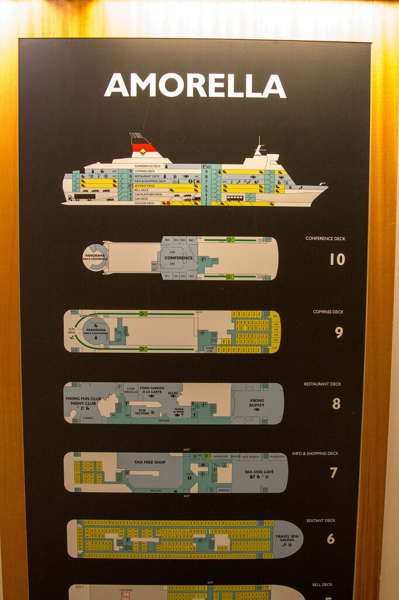

Наша каюта эконом-класса. Похожа на купе поезда, разве что без окна. Первая мысль, когда зашла внутрь: "я буду спать в шкафу". Но не все так страшно.

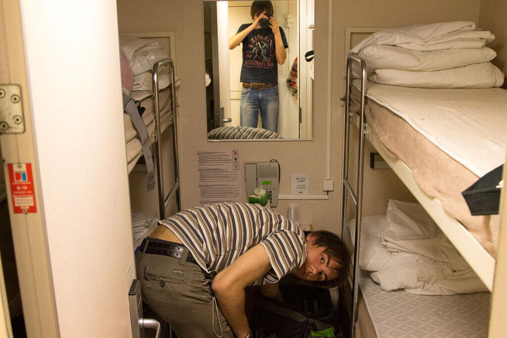

В самой каюте есть 4 кровати, чистое постельное белье, зеркало, телефон, информационные журналы (в т.ч. с товарами duty-free). На этаже находятся душ+туалет. Душ шикарный - после Норвегии мы были в восторге помыться под горячей водой с хорошим напором без ограничения по времени.

На самом пароме есть бесплатный wi-fi. Скорости хватает на почту, поиск и соц.сети. Потоковое видео посмотреть не удастся. Да и незачем. Вечер можно провести, стоя на палубе и любуясь красивыми видами ночного Стокгольма.

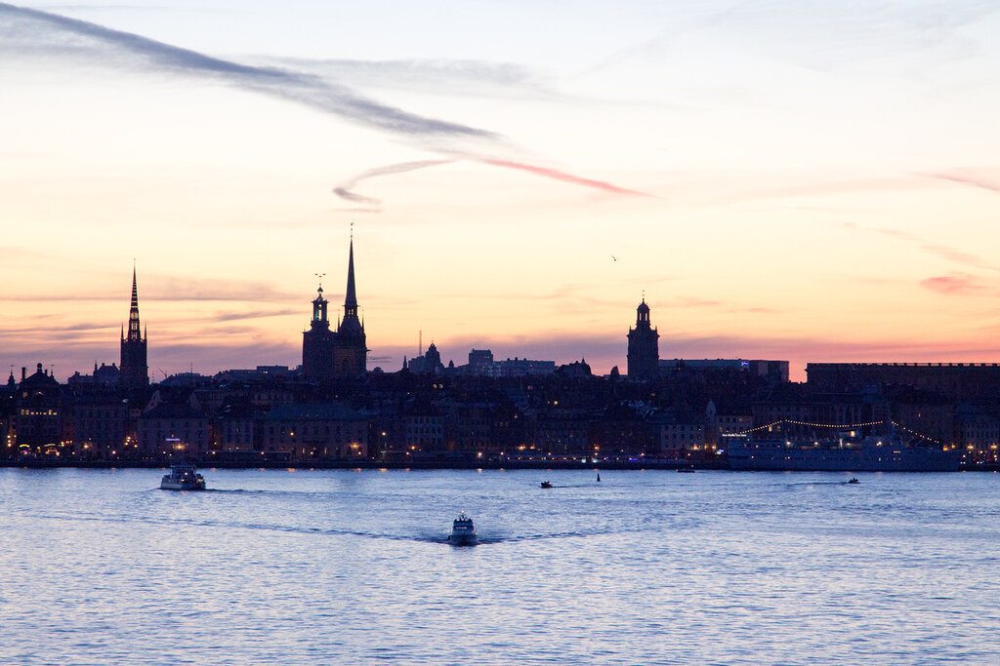

Или же побродить по многочисленным палубам парома - зайти в магазины, поужинать в ресторане или кафе, поиграть в игровые автоматы или просто пораньше лечь спать, ведь паром прибывает рано.

Если вам нужно что-то подогреть, в кафе на 7 этаже стоит микроволновая печь. А вот кипятка вы нигде на найдете - его можно купить за 1 евро в кафе (набрав из термопота в свою собственную тару). У нас с собой был чайник на 220 В, но мы не смогли им воспользоваться, потому что розетки выдают только 110 В.

## День 16. Турку - Москва

Утром мы проспали подъем и проснулись по последнему сигналу на пароме, предупреждающему о прибытии через 15 минут. В результате мы быстро закинули все вещи и бегом побежали в грузовой отсек. Чуть-чуть задержали наш ряд, но в целом все прошло спокойно. Паром очень понравился, тем более за такую цену!

Финляндия пролетела быстро, границу мы перешли за считанные минуты - вся очередь стояла почему-то в красную зону (где нужно декларировать товары) - видимо, сработал стадный инстинкт ([зимой](https://vodpop.ru/moskva-velikiy-novgorod-piter-vyiborg-helsinki-moskva/ "Москва-Великий Новгород-Питер-Выборг-Хельсинки-Москва") эта граница заняла 15 минут). А мы поехали в абсолютно свободное зеленое окно, где лишь открыли багажник, получили штампы и оказались в России.

Когда возвращаешься в Россию после таких насыщенных поездок по Европе, становится грустно. Климентий всегда вспоминает отрывок из стихотворения А.Блока:

_Россия, нищая Россия,_

_Мне избы серые твои..._

Мы ехали по Ленинградскому шоссе и останавливались в уже знакомых придорожных кафешках, смеялись над камерами в кустах, над гаишниками и сигналили странным водителям. Словом, все быстро возвращалось на свои места.

Несмотря на некоторую грусть от того, что путешествие уже закончилось, мне очень радостно, что мы открыли для себя чудесную, незабываемую красоту Скандинавии: океаны, моря, фьорды, горы, водопады  - словом, все то, что дала нам сама царица-природа.

Надеюсь, что вам понравилось путешествовать вместе с нами!

P. S. После поездки в Норвегию, на родине мы продержались чуть больше недели (делали дела),  после чего купили билеты до Бангкока в один конец. Ждите наши новые рассказы о жизни в этом совершенно ином мире! Подписывайтесь на наш блог [Вконтакте](http://vk.com/vodpop)!

Читайте все части нашей истории о Норвегии:

- [В Норвегию на машине. Часть 1. Подготовка к поездке](https://vodpop.ru/v-norvegiju-na-mashine-podgotovka/ "В Норвегию на машине. Часть 1. Подготовка к поездке")
- [В Норвегию на машине. Часть 2. Начало пути](https://vodpop.ru/moskva-norvegija-na-mashine/ "В Норвегию на машине. Часть 2. Начало пути")
- [В Норвегию на машине. Часть 3. Нордкап и Лофотенские острова](https://vodpop.ru/nordcap-i-lofotenskie-ostrova/ "В Норвегию на машине. Часть 3. Нордкап и Лофотенские острова")
- [В Норвегию на машине. Часть 4. Тропа Троллей и Атлантическая дорога](https://vodpop.ru/atlanticheskaja-doroga/ "В Норвегию на машине. Часть 4. Тропа Троллей и Атлантическая дорога")
- [В Норвегию на машине. Часть 5. Ставангер и Прекестулен](https://vodpop.ru/stavanger-prekestulen/ "В Норвегию на машине. Часть 5. Ставангер и Прекестулен")

Возможно, вам также будут интересны статьи о наших других поездках на машине по северным странам:

- [Исландия на машине зимой](https://vodpop.ru/category/evropa/islandiya/)
- [Вся Великобритания на машине](https://vodpop.ru/category/evropa/velikobritaniya/)
