Остров Бон - один из самых безлюдных островов в окрестностях Пхукета. Если вам уже надоели популярные туристические места вроде Пхи-Пхи, Джеймса Бонда и прочие, представленные в каждом турагенстве Пхукета, то вам сюда.

<!--more-->

На остров Бон можно попасть с пляжа Раваи, взяв лодку, которая идет около 15 минут в одну сторону.

Сами лодочники по-английски не говорят, поэтому договариваться о том, когда вас заберут (если вы планируете поезду на весь день), нужно с хозяином лодок.

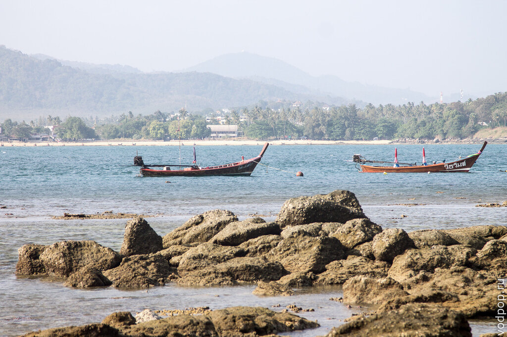

Арендовать лодку до острова Бон можно в кафе Chokolatta, которое находится примерно на середине пляжа Раваи. Мы заказывали там лодку оба раза, что ездили на остров, и добирались почти без приключений.

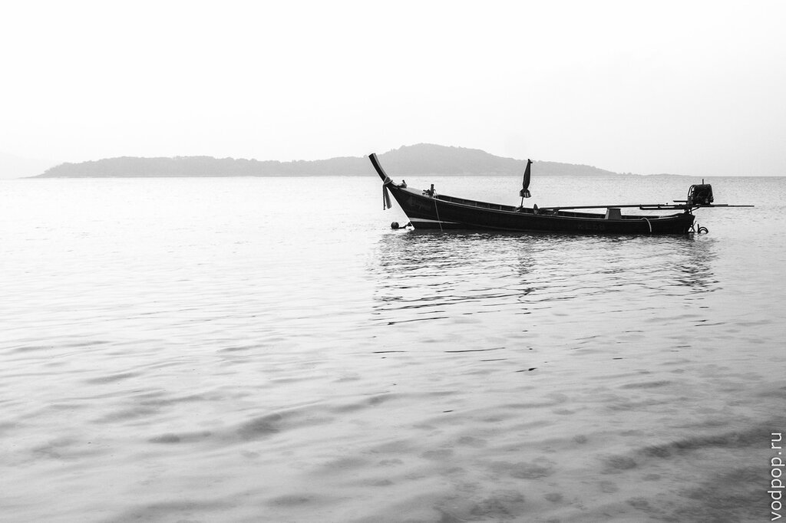

"Почти" - это потому что в первый раз лодочник забыл нас забрать, и мы его ждали 40 минут на пляже. Отчасти мы виноваты в этом сами - бумажку с телефоном хозяина мы забыли дома, а второй момент, который мы не учли - это то, как тайцы воспринимают время: для них полчаса-час вообще не считается опозданием.

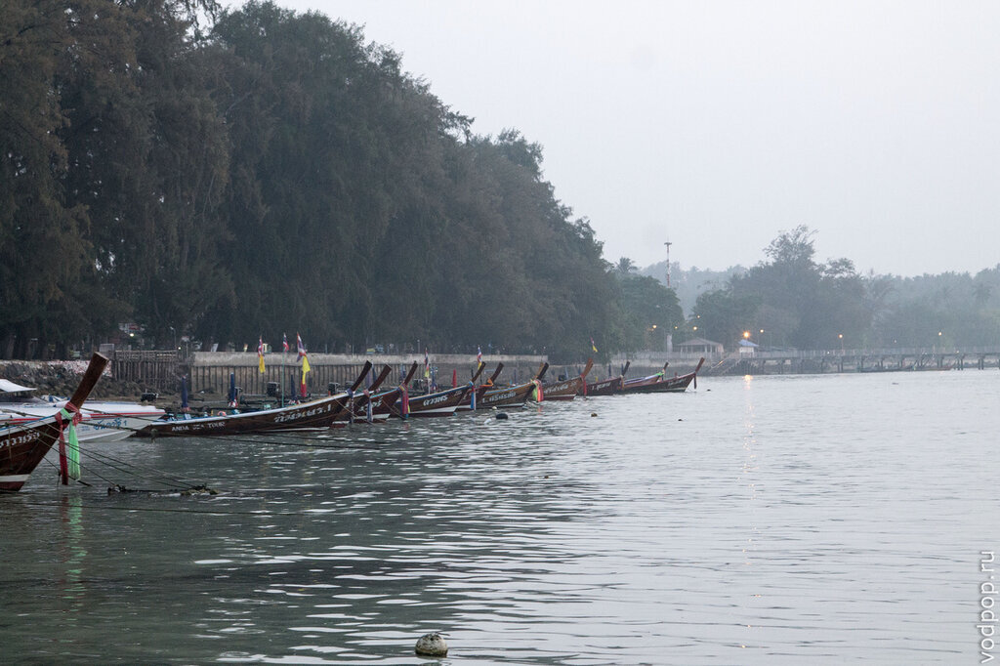

Как бы то ни было, сам остров Бон просто прекрасен - в первый раз мы были там 1 января (это был подарок Клима мне на Новый Год), и нам невероятно понравилось!

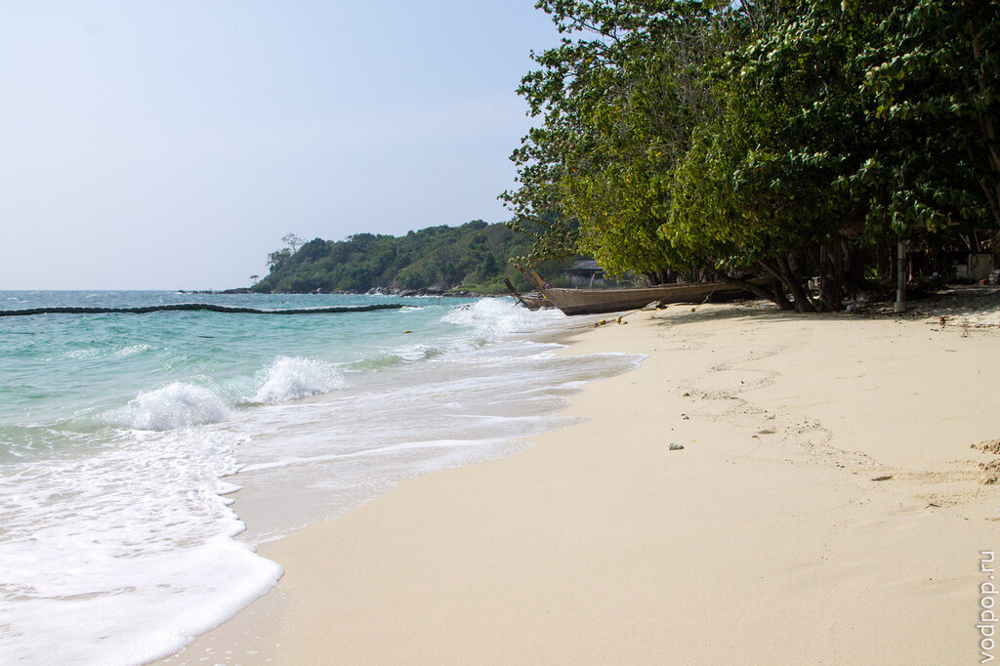

Белоснежный песок, чистое море, легкий ветерок - все как с картинки в журнале.

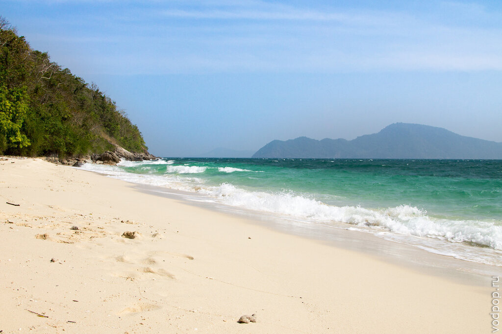

Остров Бон совсем небольшой по размерам, но обойти его кругом не удастся - путь перекрывают большие, скользкие и порой очень острые камни

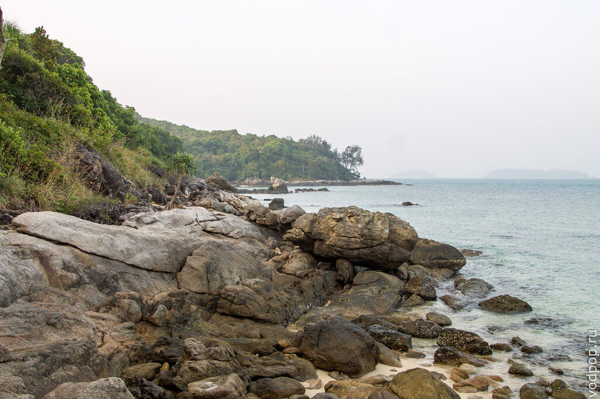

Достопримечательностей на острове как таковых нет - разве что кафе на углу (если смотреть с Раваи на остров Бон, то кафе будет с левой стороны), которое работает примерно с 12-13 часов и до заката. Там все довольно дорого, поэтому лучше взять еду и напитки с материка.

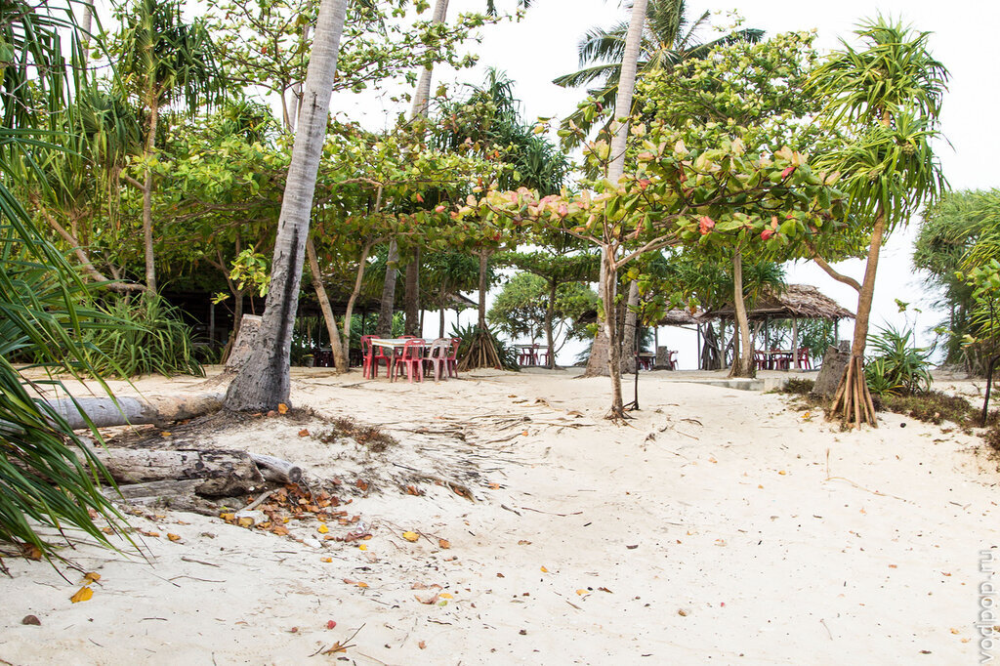

Лучшее место на острове - на противоположной стороне, где находится заброшенный отель Evason Phuket Resort and Spa. Если быть точной, то этот отель принадлежал международной сети люкс-отелей Six Senses Hotels, и находился на пляже Раваи, откуда 6 раз в день ходили бесплатные лодки до острова, так как пляж Раваи не предназначен для купания. 

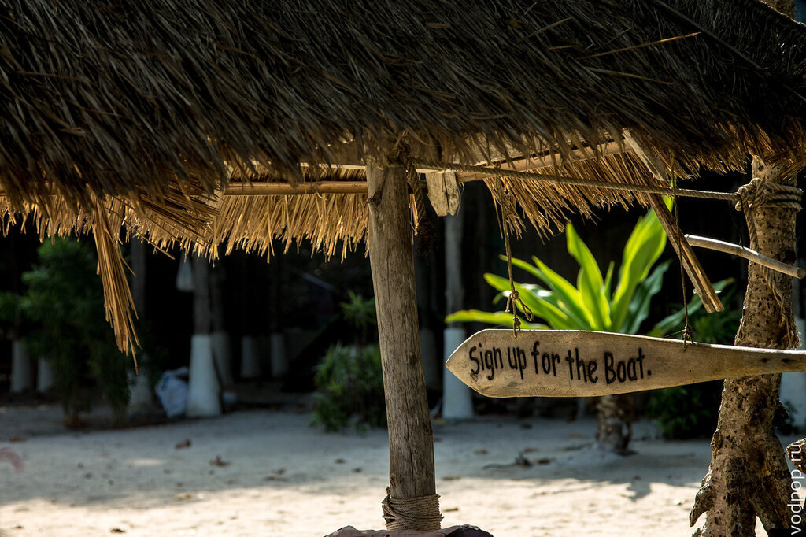

Видимо, отель закрылся совсем недавно, потому как все выглядит заброшенным, но довольно новым. Вдоль береговой линии стоят веранды с душевой и туалетом, которые посетители отеля могли арендовать за дополнительную плату.

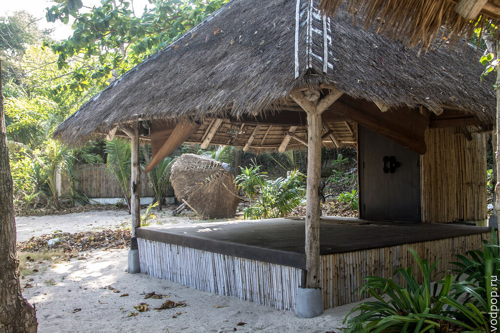

Мы расположились на одной из веранд совершенно бесплатно, хотя у всего этого наверняка остался хозяин, присматривает за этим таец, мирно спящий под одной из соломенных крыш. Во вторую поездку нас, правда, предупредили, что если наведается хозяин, то нам придется заплатить.

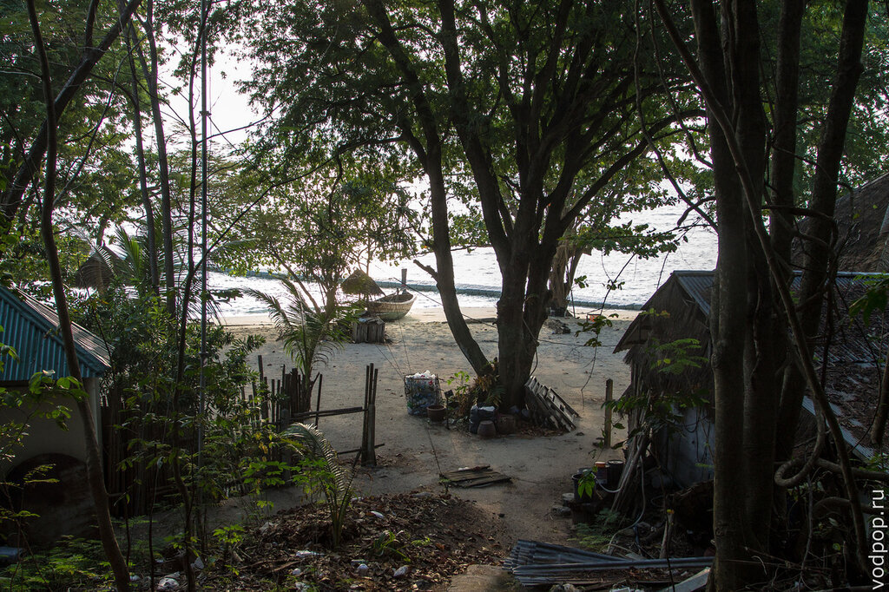

Кстати, после прочтения этого отчета вы, наверное, сразу подумаете "ну зачем идти пешком на другую сторону, если можно поплыть на лодке?". Как бы не так! Во вторую поездку нами была предпринята такая попытка, благодаря которой мы порвали пару шлепок, поцарапали себе ноги и испытали кучу стресса.

Дело в том, что вдоль береговой линии заброшенного отеля идет огромный риф с переплетенными кораллами, сотнями морских ежей, морских огурцов и острых камней. И вот по этой ядерной смеси мы пытались пройти, пока под весом наших тел это не стало проваливаться вниз, заставляя осколки впиваться в ноги.

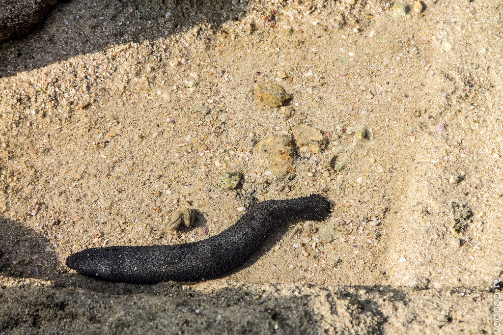

Через 10 минут мытарств мы сдались и попросили лодочника, который не рискнул нас покинуть (и правильно сделал!), довезти нас до другой части острова, откуда мы по лесенке перешли к заброшенному отелю.

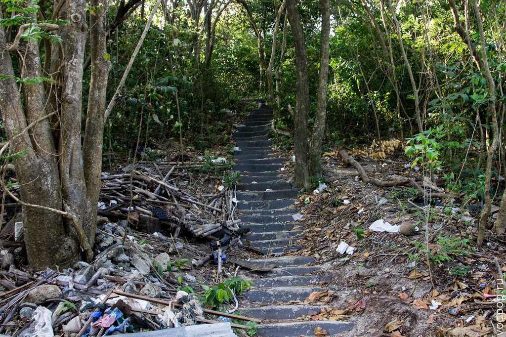

Самое классное, что об этом месте знает очень мало людей, поэтому оба раза мы были в гордом одиночестве, если вычесть тайца, охраняющего территорию. Для любителей поплавать голышом и позагорать топлесс - это лучшее место!

Правда, после дня на острове в костюмах "в чем мама родила" мы с Климом неделю залечивали ожоги, которые особенно рьяно проявились на наших попах - три дня мы никуда не выходили из дома, так как сесть на байк было физически невозможно.

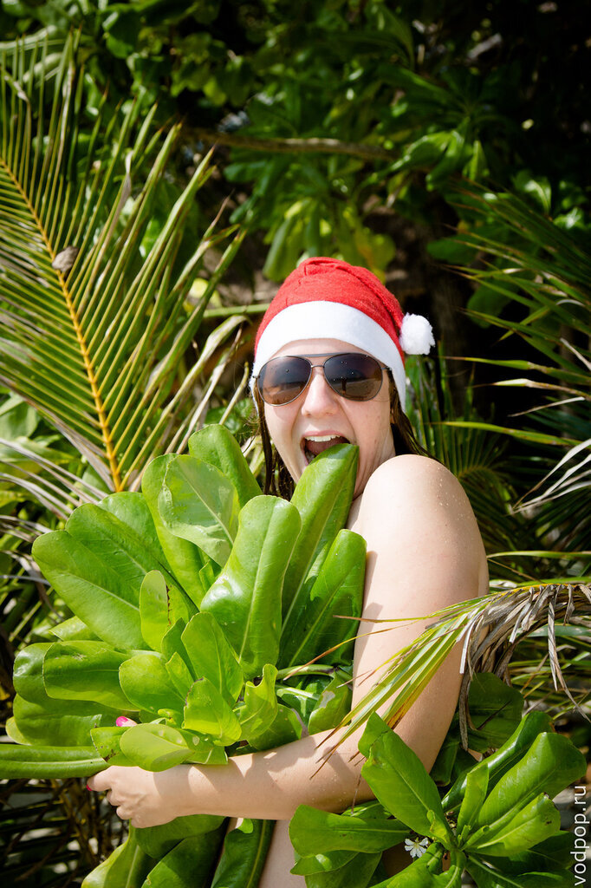

Мы даже пытались слепить песковика - снеговика из песка, пока солнце не раскалило наши спины.

За вещами на песке нужно следить внимательно - на острове очень сильные приливы и отливы, поэтому всю одежду лучше оставить подальше от воды, чтобы ее не унесло в море, пока вы будете загорать на солнышке.

Можно еще прогуляться по мостику, который постоянно скользит по поверхности морских волн.

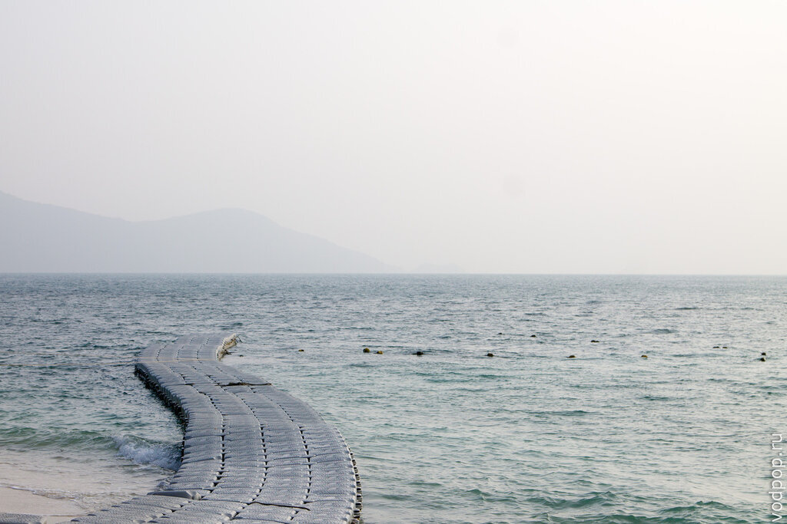

Некоторые приезжают на остров на несколько дней - с палаткой и спальниками. Компанией здесь отдыхать так же здорово, как и вдвоем.

Кстати, второй раз мы ездили сюда по работе - Климу заказали фотосессию на пляже, и мы, чтобы не быть арестованными за нелегальную деятельность, решили провести ее на острове Бон. Хотя, когда мы уже сидели в том самом кафе, к нам подошла европейка и потребовала 40 бат с человека за фотосъемку  на острове, и разрешение на работу фотографом.

[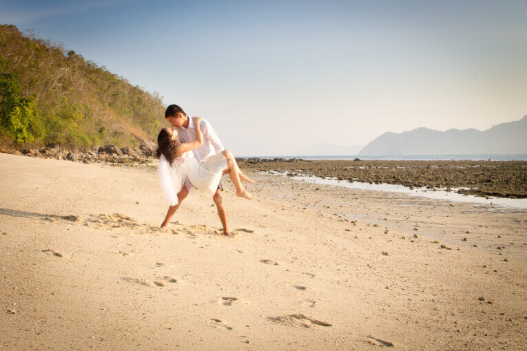](https://vodpop.ru/wp-content/uploads/2014/03/20140204-IMG_6424.jpg)

Мы от нее кое-как отвязались (к тому времени мы уже ничего не фотографировали), но она пригрозила, что нас запомнила и в следующий раз возьмет с нас деньги. Так что тем фотографам, которые мечтают работать на райских островах Таиланда, придется сначала получить Work Permit или быть готовыми везде и всюду платить взятки (до 40 тыс бат).

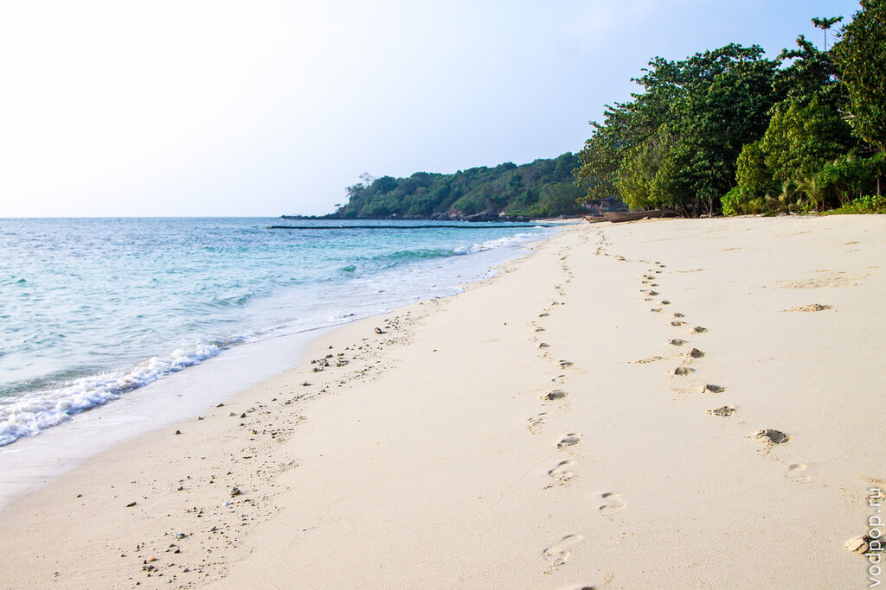

Если объединить опыт двух наших посещений острова Бон, то смело можно сказать, что остров желателен к посещению, если вы уже устали от толпы туристов, хотите посидеть в тишине и спокойствии и поплавать в чистом море. Если вам хочется движухи, кафе и громкой музыки - то это точно не по адресу.

## Как добраться

От пляжа Раваи на лодке за 15 минут.  Искать аренду лодки можно вдоль пляжа - там множество контор. Сначала поспрашивайте цены, потом соглашайтесь - даже не в сезон тайцы неплохо торгуются. Мы оба раза арендовали в кафе Chokolatta.

## Цена

Если вы хотите приехать на остров на пару часов - искупаться и поехать домой (или на другой остров), то лодочник будет ждать вас около берега, и цена будет около 1000 бат. Если вы хотите остаться подольше, то лодочник уплывет обратно на большую землю, а потом вернется за вами в заранее оговоренное время. Это уже стоит дороже - 1400 бат, так как лодочник делает не две ходки, а фактически четыре. Кстати, на острове есть связь, поэтому если захотите уплыть пораньше, можно просто позвонить хозяину лодки.

## Что взять с собой

Мы уже приводили [полезный список вещей](https://vodpop.ru/samye-krasivye-ostrova-filippin/ "Сан Висенте. Самые красивые острова Филиппин"), которые надо брать на острова, когда ездили на морскую экскурсию на Филиппинах.

## Координаты острова Бон

7.756159, 98.330877

## Карта острова Бон

<iframe style="border: 0;" src="https://www.google.com/maps/embed?pb=!1m18!1m12!1m3!1d7906.610381108174!2d98.33264249999999!3d7.7574210499999925!2m3!1f0!2f0!3f0!3m2!1i1024!2i768!4f13.1!3m3!1m2!1s0x305028f29b7ef9f5%3A0xd99d32a9323e23af!2sKo+Bon!5e0!3m2!1sru!2sru!4v1395167521190" width="600" height="450" frameborder="0"></iframe>
