Решив выбраться в выходной день из центра Гонконга на остров Ламма, мы случайно попали на благотворительную ярмарку Lamma Fun Day.

<!--more-->

Немного перепутав выход из метро, мы вышли к центральному пирсу, откуда отходит большинство паромов к разным частям Гонконга.

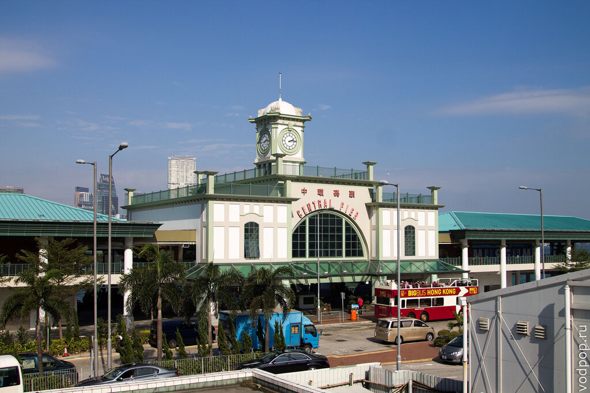

Мы пришли очень вовремя: посадка закончилась буквально через минуту после того, как мы зашли на борт. Хотя ходят кораблики, а точнее, катамараны, довольно часто.

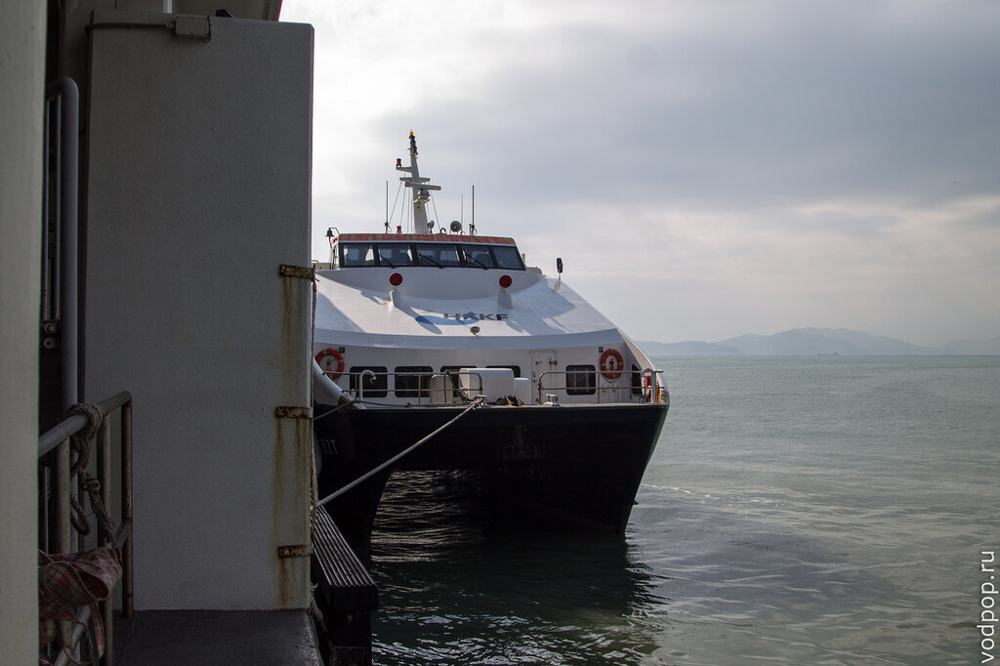

Внутри катамарана стекла выглядят так, как будто их не мыли пару месяцев. Но на самом деле это всего лишь многочисленные брызги создают столь неприглядный эффект.

Первое, что мы увидели, сойдя через полчаса на остров Ламма, множество ярких реклам, говорящих о том, что именно в эту субботу на острове проводится благотворительная ярмарка.

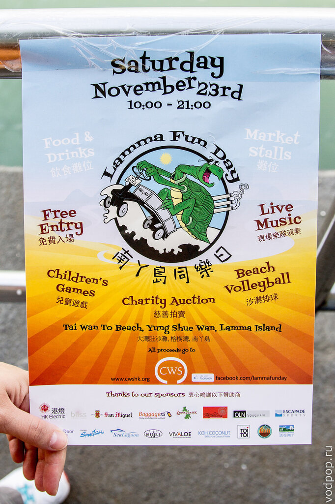

И все было бы отлично, если бы не количество людей.

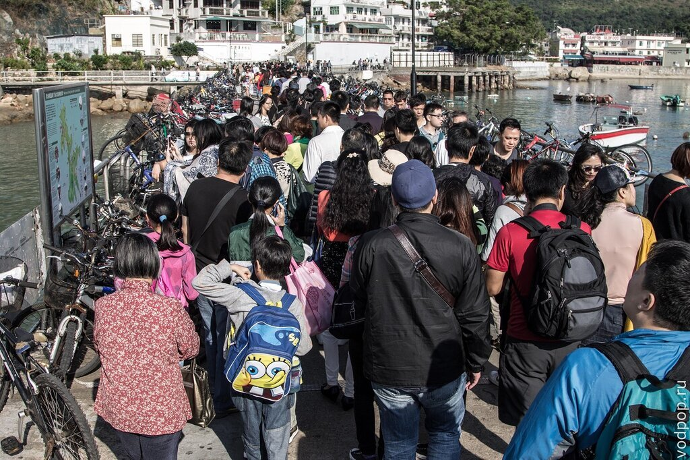

Говорят, что на континентальной части Китая в крупных городах еще печальнее, но мы были несколько расстроены, так как поехали на остров в поиске тишины, природы и уединения.

Мы решили пропустить всю эту толпу, сделав небольшую остановку около карты острова (кликабельно).

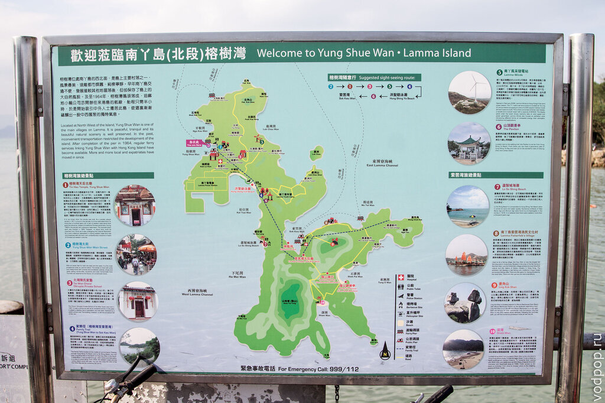

На ней отмечены основные достопримечательности острова Ламма, и даже проложены пешие маршруты разной протяженности. Весьма удобно, что и говорить. Многие туристы и местные жители активно пользуются ими, зажав в руках специальные палки для ходьбы.

Главная достопримечательность острова - угольная электростанция, Lamma Power Station, построенная в 1982 году, которая обеспечивает электричеством не только себя, но и весь остров Гонконг в придачу.

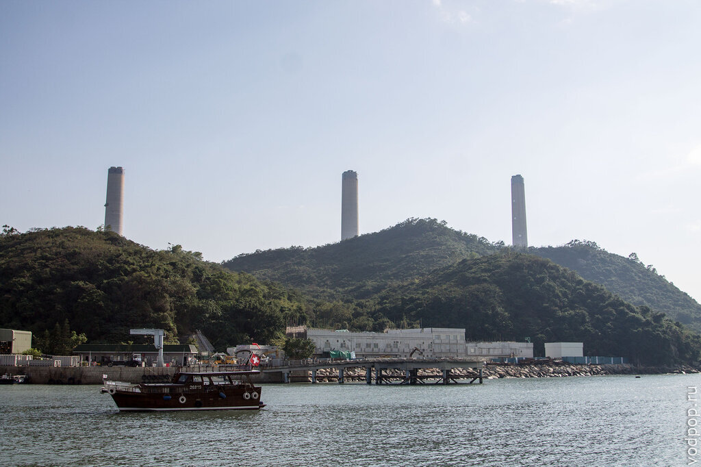

Даже учитывая довольно небезопасное соседство с электростанцией, основное занятие жителей этого острова - рыбалка. Множество лодок стоят вдоль пляжей, обеспечивая ежедневным уловом свежий ассортимент в многочисленных рыбных ресторанах.

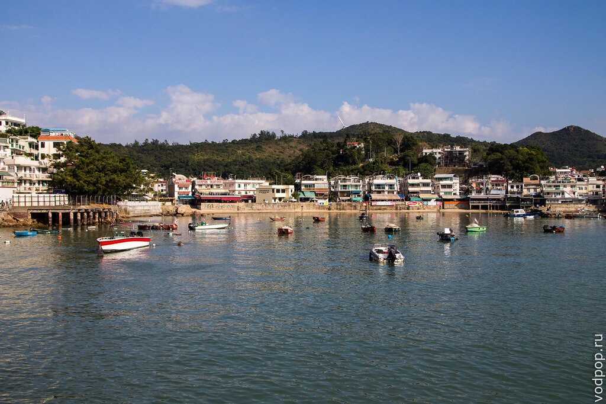

Правильнее говорить ресторан морепродуктов, но как-то не звучит. Зачастую мы его между собой называем сифуд (sea food), что в переводе будет "морепродукты".

Ради свежих морепродуктов, которые можно выбрать прямо на прилавке, чтобы тебе их сразу приготовили, сюда приезжают ценители свежей и вкусной рыбы, лобстеров, креветок, крабов, устриц и прочих обитателей морских глубин. Sampam Seafood - один из самых популярных и известных ресторанов, находится прямо на берегу, рядом с пристанью. Если поедете на остров Ламма, то дорога в город обязательно проведет вас мимо его открытых аквариумов и столов с клетчатыми скатертями.

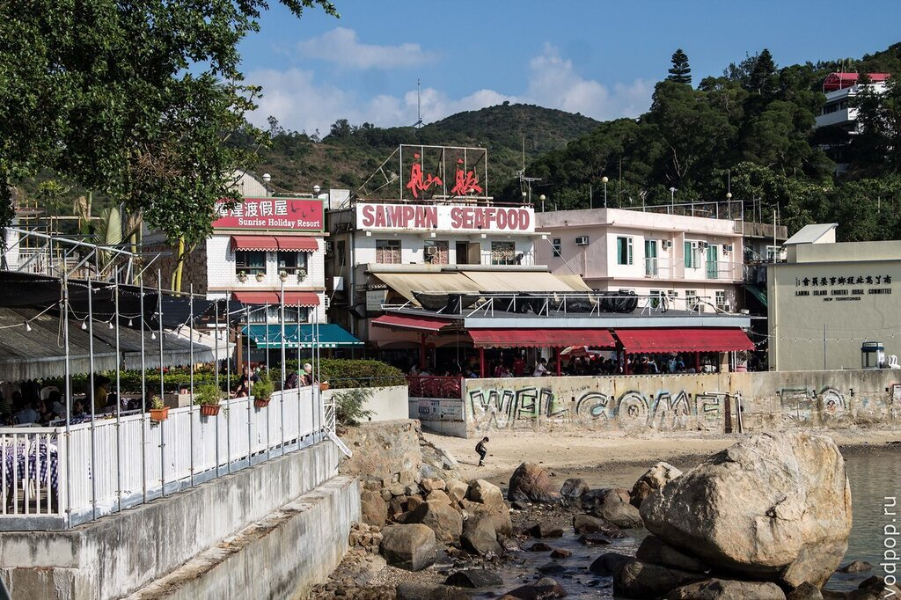

Увы, Климентий к  числу  ценителей не относится, поэтому мы лихо пробежали мимо всех сифудов, пока не оказались в довольно странной кафешке для местных, где нам подали ужасный соленый чай. После консультаций с давно живущими русскими на острове, выяснилось, что это чай со специями, а порой просто чай, разбавленный соевым молоком (которое и дает соленый привкус). Словом, на любителя.

Нравится статья? Узнавайте первым о выходе новых интересных историй! Подпишитесь на нас по [эл. почте](http://feedburner.google.com/fb/a/mailverify?uri=vodpop&loc=ru_RU) или в [группе ВКонтакте](http://vk.com/vodpop)

Чтобы выйти к парковой зоне острова, необходимо пройти сквозь узкие улочки, забитые кафешками и магазинчиками для туристов. Цены тут довольно высокие, но мы, опять-таки, сравнивали с [Филиппинами](https://vodpop.ru/taj-taj-palavan/ "Неизведанный Палаван. Тай Тай"), которые на нашей памяти остались самой дешевой страной в ЮВА.

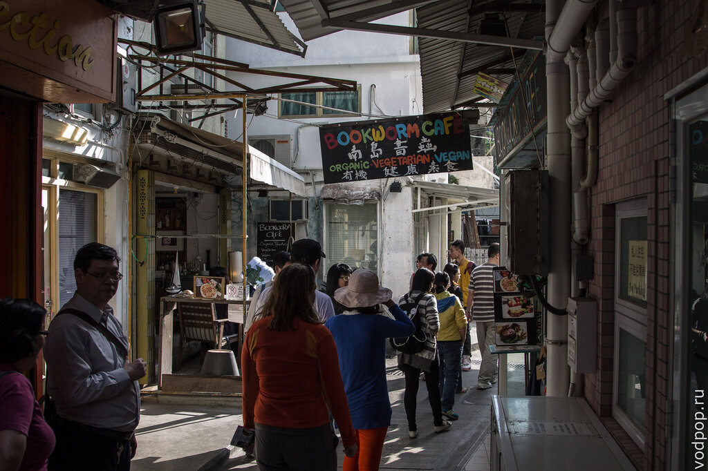

Много вывесок с вегетарианской и органической едой. Вообще, вегетарианцы и веганы(это еще более "строгие" вегетарианцы, исключившие из своего рациона все продукты животного происхождения, включая мясо, рыбу, яйца, молоко, молочные продукты и даже мед) - очень модное веяние практически по всему миру. Точнее, балуются этим в основном европейцы (и русские, коих в Азии я тоже отношу к европейцам), а кафе по всему миру таким образом находят небольшую, но приносящую прибыль, нишу.

После "туристического рая" мы практически сразу свернули на одну из дорожек, ведущую к ветряку. Наконец-то та самая тишина, зелень и приятная безлюдность.

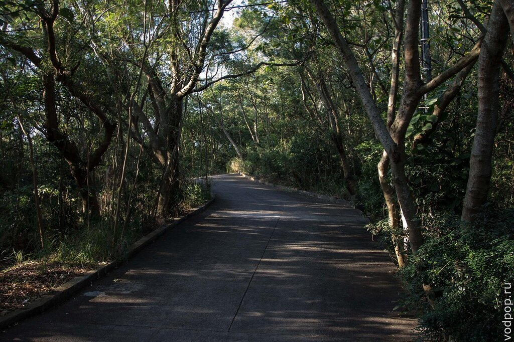

В гору идти около полутора километров. Вроде и подъем небольшой, но наверху чувствуешь себя порядком уставшим. Очень хотелось пить, но все магазины остались на тех самых узких улочках.

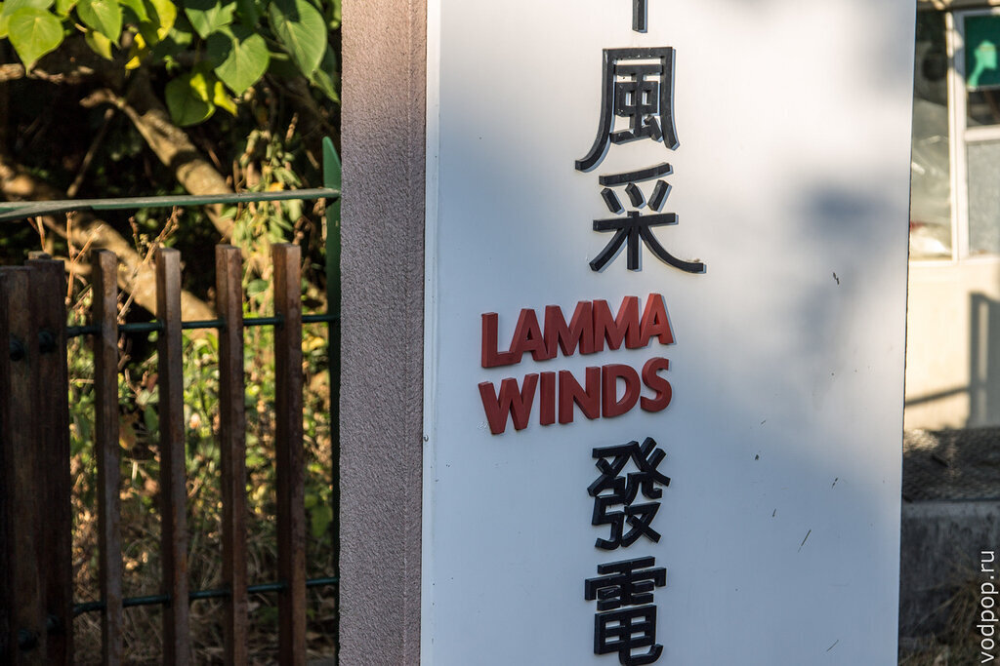

Итак, Lamma Winds, он же ветряк, он же ветряная электростанция.

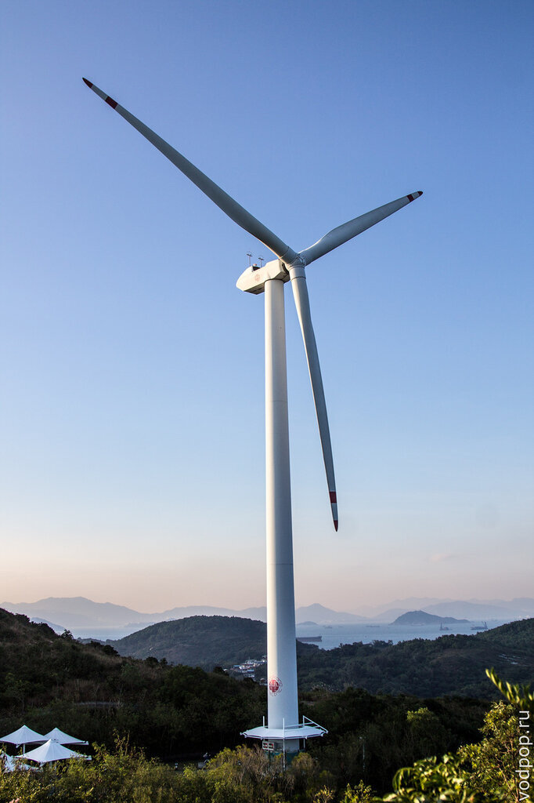

Вокруг ветряка оборудованная смотровая площадка, с красивыми информационными табличками, которые рассказывают про альтернативные и традиционные источники энергии, о влиянии их на окружающую среду и даже висит информационное табло, на котором постоянно обновляется информация о выработанном ветряком количестве киловатт.

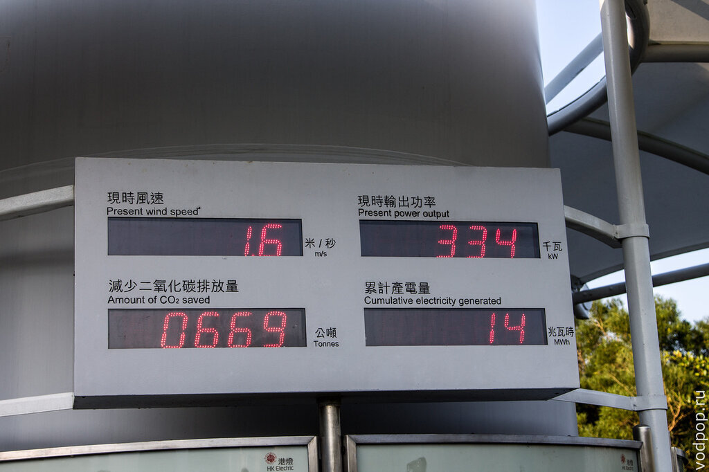

Затем мы поднялись на небольшую смотровую площадку с видом на Гонконг. Немного попозировали нашему лучшему товарищу - автоспуску.

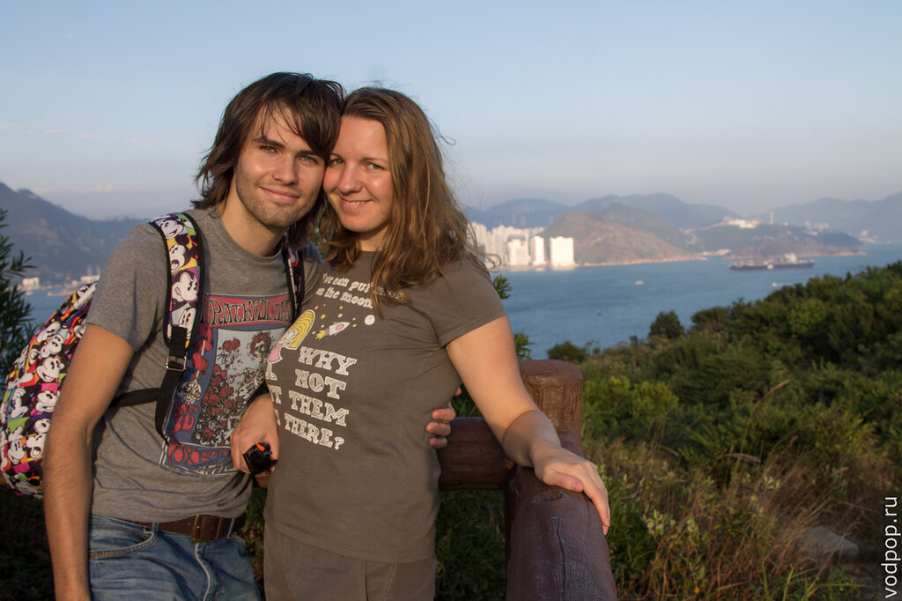

После ветряка мы пошли в сторону пляжа, с которого открывался потрясающий вид на море. Можно было даже искупаться, но мы не догадались взять с собой купальники, а ехать мокрыми сначала на пароме, а потом в метро, как-то не хотелось.

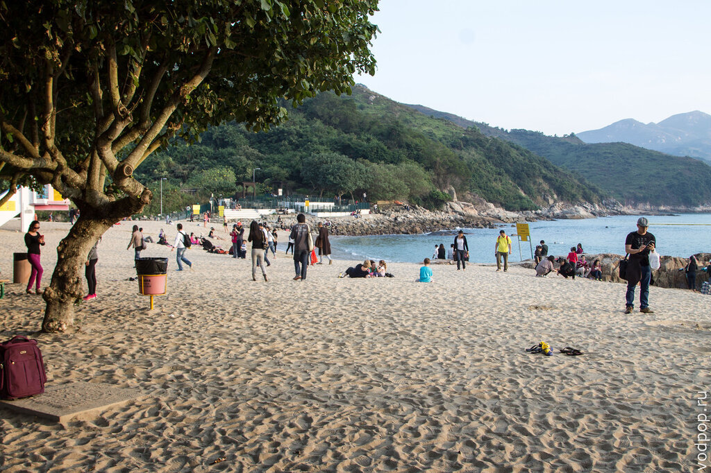

Пришлось довольствоваться прекрасными видами.

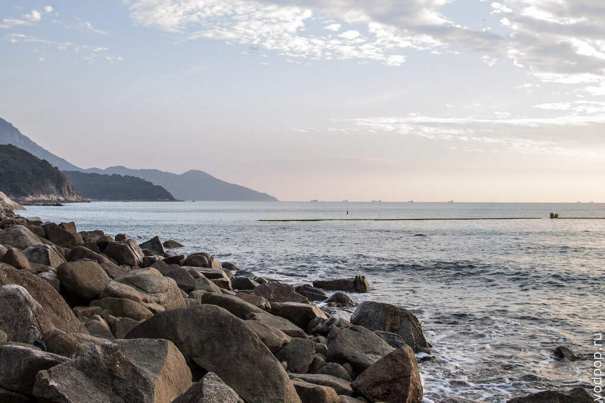

По возвращении на пристань, откуда уходят обратно катамараны на материк, мы все-таки наткнулись на остатки ярмарки. Одна толпа собралась на пляже, где сильный звук микрофона вещал о чем-то на английском, а вторая часть вдоль дороги продавала и покупала кучу нужных и ненужных вещей, начиная от игрушек йо-йо, заканчивая вечерними шелковыми платьями second hand.

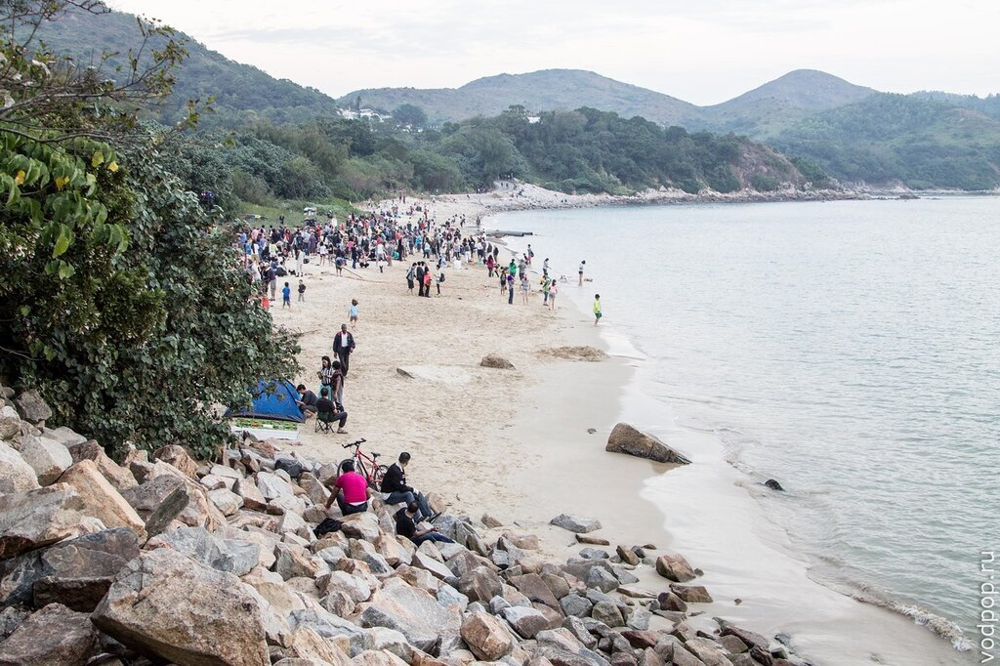

Вид на угольную электростанцию. Сооружение, конечно, поражает

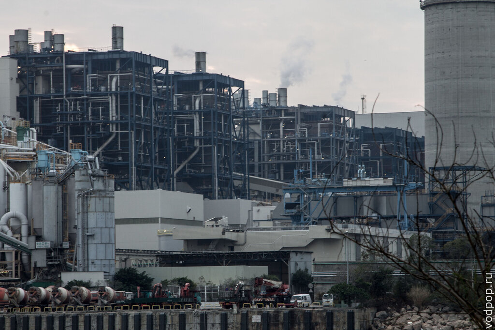

Оно же на закате

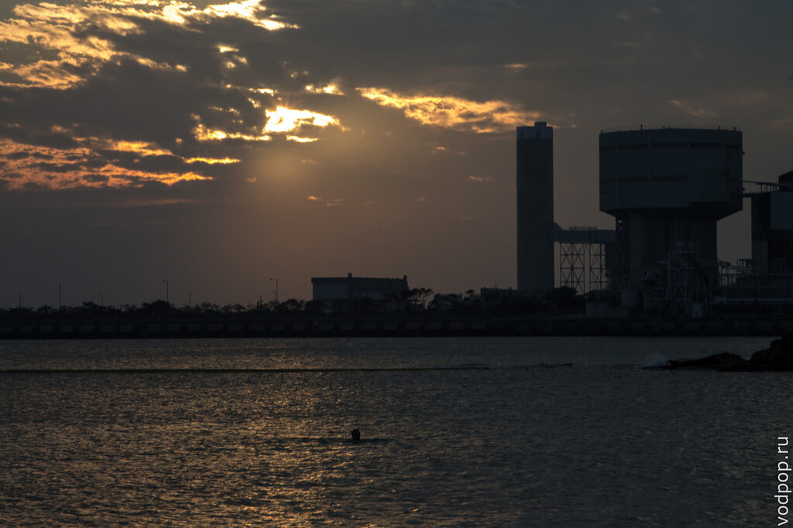

На этом наше знакомство с островом подошло к концу. Не могу сказать, что меня как-то поразило это место, но если у вас есть несколько свободных дней, и вы уже съездили и досконально изучили [остров Лантау](https://vodpop.ru/bolshoy-budda-v-gonkonge/ "Большой Будда в Гонконге и рыбацкая деревня Тай О"), то вполне можно потратить денек и увидеть остров Ламма своими глазами.

## Как добраться

От Центрального Пирса №4 на острове Гонконг (станция метро Honk Kong) ходят лодки сразу на два разных причала на остров Ламма: Yung Shue Wan (27 минут в пути), на котором вышли мы, и Sok Kwu Wan (30-40 минут в пути), до которого мы так и не добрались.

