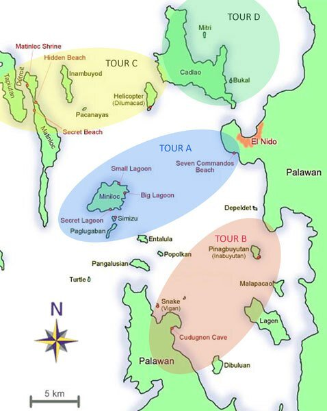
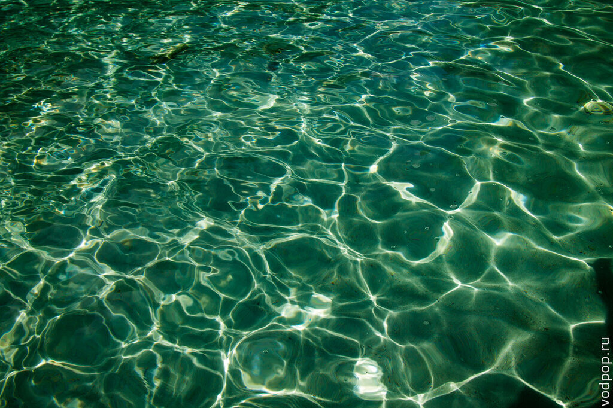
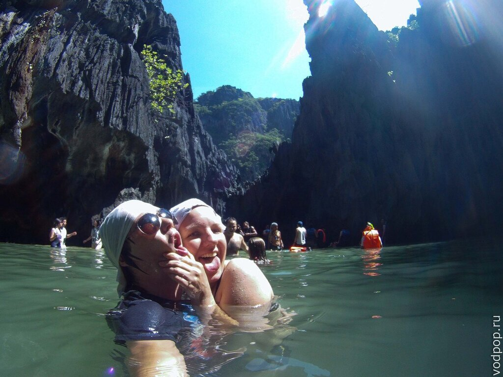
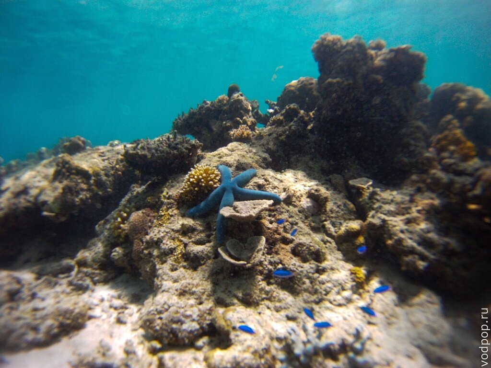
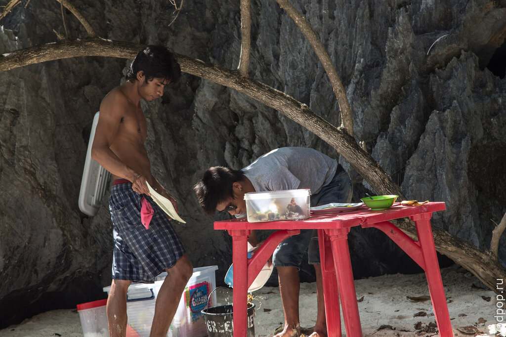
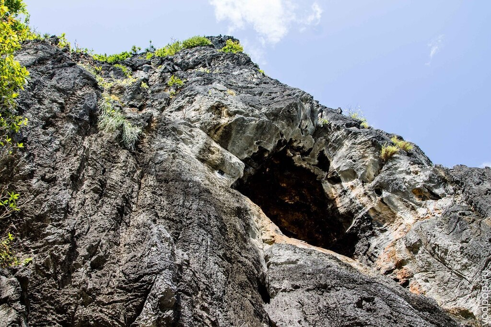
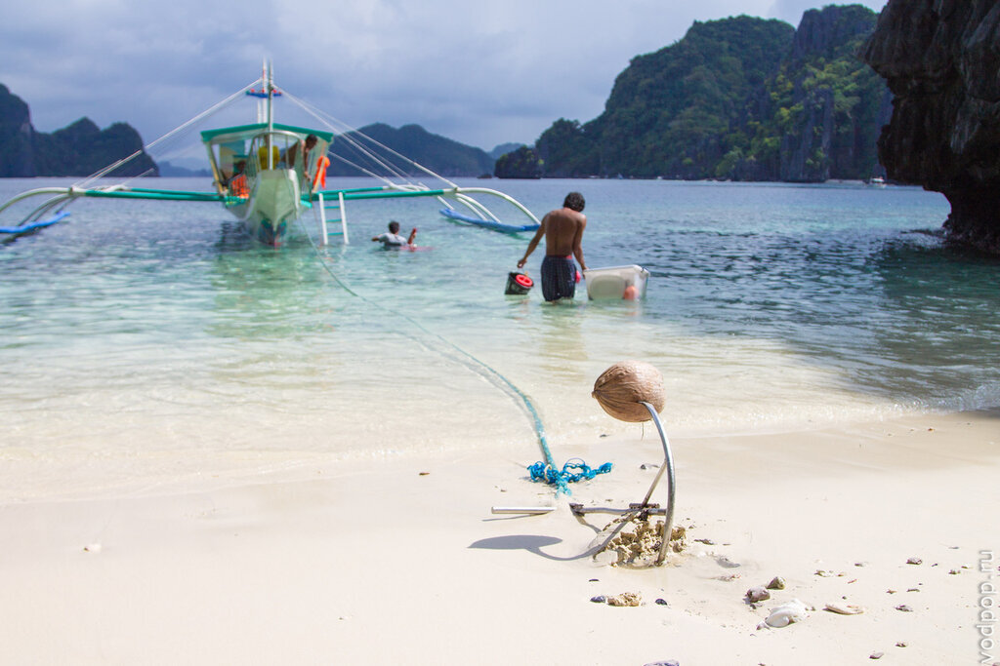
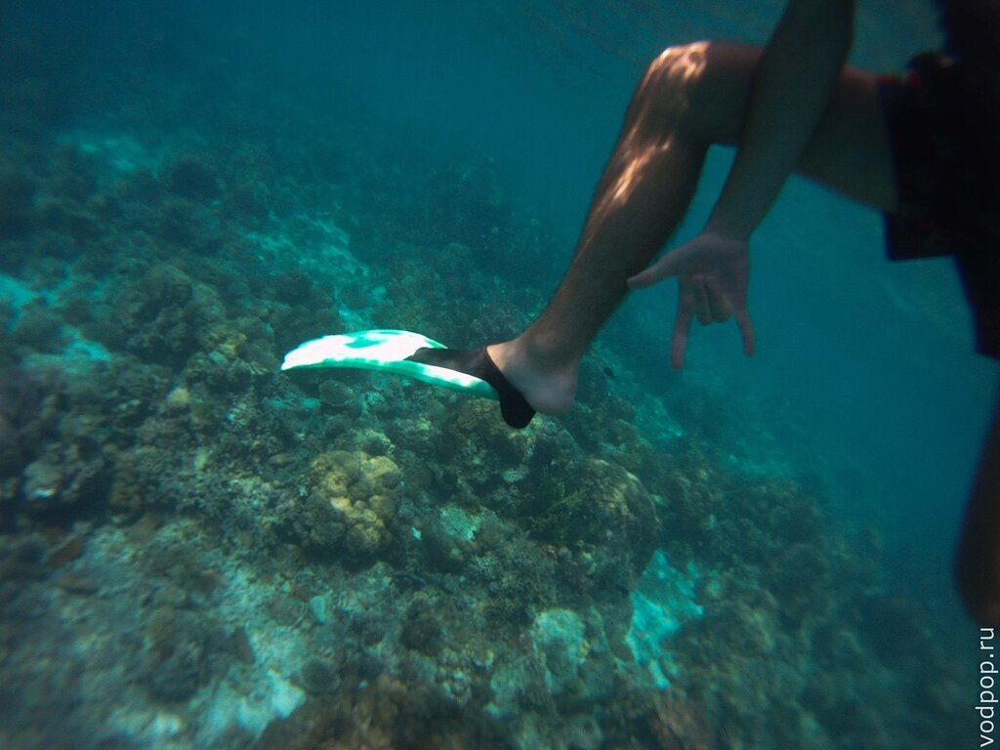

Острова Эль Нидо - это то, ради чего сюда ежегодно приезжают тысячи и тысячи туристов. И не зря. Туры на острова и лагуны не оставят никого равнодушным. Мы решили начать знакомство с красотами Эль Нидо с тура А.

<!--more-->

Напомню, что после [непродолжительного поиска отеля](https://vodpop.ru/kak-dobratsa-do-el-nido/ "Как добраться до Эль Нидо") мы остановили свой выбор на Greenviews Resort, который находится неподалеку от Эль Нидо, в городке Корон Корон (Corong Corong). Выбрать тур было не так уж и легко, мы сомневались между А и С - одними из самых популярных и красивых маршрутов по островам и лагунам Эль Нидо.

Карта Эль Нидо

Для того, чтобы было легче сориентироваться, можете посмотреть схематическое изображение туров на карте.

Наш выбор пал на тур А, который мы забронировали в нашем отеле по цене 700 песо с человека.

Мы отправились в тур сразу после завтрака, в 9 утра. Первой точкой нашего маршрута оказалась Большая Лагуна (Big Lagoon), где лодка проходит без остановки по длинному ущелью, наполненному водой невероятно красивого цвета.

Дно довольно близко, поэтому лодки идут медленно, ловко маневрируя между камнями.

Затем нас повезли на остров Минилок (Miniloc), в Секретную Лагуну (Sectet Lagoon). Само собой, попав в столь популярный маршрут, эту лагуну стоило бы назвать Рассекреченной, но мы с улыбкой приняли это название, и даже постояли в очереди, чтобы пробраться сквозь пробоину в скале, чтобы оказаться в небольшом природном бассейне, спрятанном в высоких скалах.

Несколько раз мы останавливались в открытом море, чтобы поснорклить. Невероятное количество рыб, морских звезд, змей, моллюсков и водорослей - все это можно увидеть своими глазами, если заплатить еще 100 песо за аренду маски и трубки.

Не удержались, и немного поснимали подводный мир на камеру. Ну разве не красота?

<iframe src="//www.youtube.com/embed/e5WxVCSJXC4?rel=0" width="853" height="480" frameborder="0" allowfullscreen="allowfullscreen"></iframe>

К тому времени, как мы добрались до острова Шимизу (Simisu), где у нас по расписанию запланирован ланч, мы были зверски голодные. Но, как и везде на Филиппинах, процесс приготовления пищи был крайне неспешным.

Поэтому мы довольствовались бананами и прятались от палящего солнца в тени высоких скал.

Обратите внимание на меры безопасности. Якорь заботливо прикрыт кокосом, чтобы пассажиры случайно не порезались.

Нравится статья? Узнавайте первым о выходе новых интересных историй! Подпишитесь на нас по [эл. почте](http://feedburner.google.com/fb/a/mailverify?uri=vodpop&loc=ru_RU) или в [группе ВКонтаке](http://vk.com/vodpop)

Следующим местом стала Маленькая Лагуна (Small Lagoon), в которой мы доплыли до спрятанной в скале маленькой пещеры, где одновременно могут находится не более 5-6 человек. Туда практически не проникает дневной свет, поэтому внутри довольно жутковато и холодно, а вода поражает своей чистотой и прозрачностью.

Наконец мы отправились в последнюю точку - пляж 7 бойцов (7 Commandos). Фотографий, увы нет, потому что в тот день были огромные волны, до двух метров высотой около берега. Поэтому мы просто покатались на них полчасика, потратив последние силы, и поплыли домой, в Greenviews Resort.

Нам однодневное путешествие по островам Эль Нидо очень понравилось, к концу дня даже ощущалась легкая усталость от ярких впечатлений. Если вы тоже собираетесь в Эль Нидо, то стоит прочитать информацию, представленную ниже.

######  Полезное

- туры A, B, C и D можно купить практически на каждом шагу. Большинство гостиниц имеет свои лодки, и вы можете забронировать тур прямо у себя на ресепшн.
- в большинстве мест принимают только наличные, но в более-менее известных гостиницах можете расплатиться картой. В Greenviews Resort принимают оплату картой, но только с удержанием комиссии в 5%. В Арт Кафе, о котором я подробно писала [тут](https://vodpop.ru/art-cafe-v-el-nido/ "Арт Кафе в Эль Нидо. Как мы отмечали Хеллоуин") , можно забронировать любой из туров и также оплатить картой. Правда, цены немного выше средних (в среднем на 100 песо).
- все рекомендации, что нужно взять с собой, как одеться и прочие полезности, можно почитать в [этой статье.](https://vodpop.ru/samye-krasivye-ostrova-filippin/ "Сан Висенте. Самые красивые острова Филиппин")

 

###### Цены

В стоимость тура входит обед, отдельно оплачивается аренда оборудования для снорклинга (100 песо маска+трубка, еще 100 песо - ласты). Воду можно купить у лодочников, но цена завышена.

- Тур А  - 700 песо с человека
    - Small Lagoon (Miniloc Island)
    - Big Lagoon (Miniloc Island)
    - Secret Lagoon (Miniloc Island)
    - Simizu Island
    - 7 Commando Beach
- Тур B - 800 песо с человека
    - Snake Island
    - Cudognon Cave
    - Pangulasian Island
    - Cathedral Cave
    - Pinagbuyutan Island
- Тур С - 900 песо с человека
    - Matinloc Shrine (Matinloc Island)
    - Secret Beach (Matinloc Island)
    - Hidden Beach
    - Tapuitan Island
    - Helicopter Island
- Тур D - 700 песо с человека
    - Cadlao Lagoon
    - Bukal Island
    - Ubugon Cave
    - Paradise Beach
    - Natnat Beach
    - Pasandigan Cove

Отдельно оплачивается экологический сбор 200 песо с человека, который действителен в течение 10 дней. Оплату принимают прямо на лодке, либо можно сделать это заранее в гостинице. Не забывайте брать квитанцию об оплате с собой, чтобы не оплачивать его повторно.

Если вы любитель каяков, то можно взять такой же тур, где между островами и лагунами вы будете плавать самостоятельно. Но многие не советуют этого делать - волны и течение довольно сильные, и вы быстро выбьетесь из сил. И по цене на 600-700 песо дороже, чем просто на лодке.

Также можно заказать приватный тур (минимум на 2 человек):

- Тур A – 2800  песо
- Тур B – 3000 песо
- Тур C – 3200 песо

Если вы побывали на всех вышеперечисленных турах, или вам просто хочется разнообразия, то в некоторых турфирмах можно найти следующие предложения:

- Тур E (Countryside Tour)- прогулка по лесам и водопадам Эль Нидо
- Рыбалка в Эль Нидо (Fishing Package) - целый день с удочкой под палящим филиппинским солнцем
- Восхождение на Клифф (Cliff Climbing Package) - прогулка в  горы на целый день. Нужна средняя физическая подготовка

и многое, многое другое. Просто не стесняйтесь спрашивать у людей, что стоит посмотреть. Турфирмы все время придумывают новые маршруты, чтобы завлекать побольше туристов. И не стесняйтесь просить скидку, если вас несколько человек, или низкий сезон.

П.С. появилась информация по ценам, что с 16 ноября 2013 года действуют новые цены(песо с человека):

- Тур A – 1200
- Тур B – 1300
- Тур C – 1400
- Тур D - 1200

Соответственно, частные туры также вырастут в 2-3 раза, т.е. до 9 тысяч песо за лодку.
