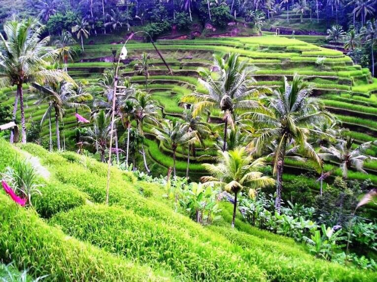
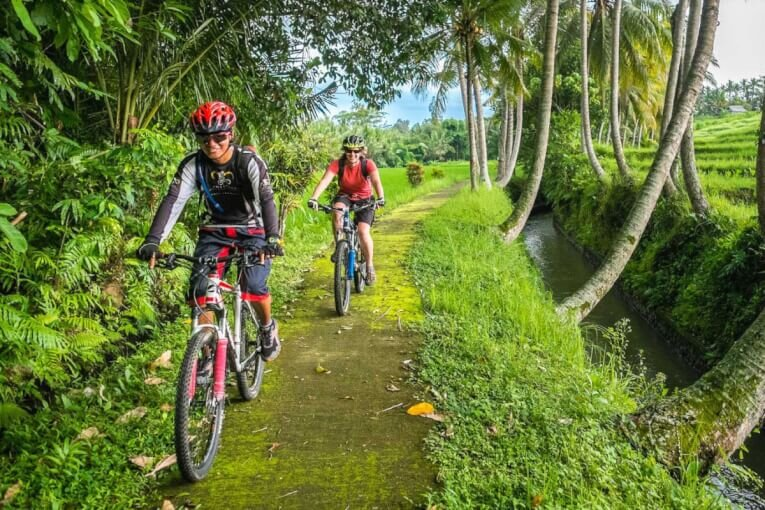
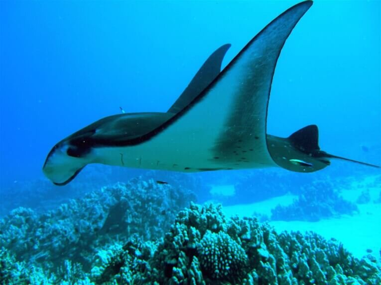
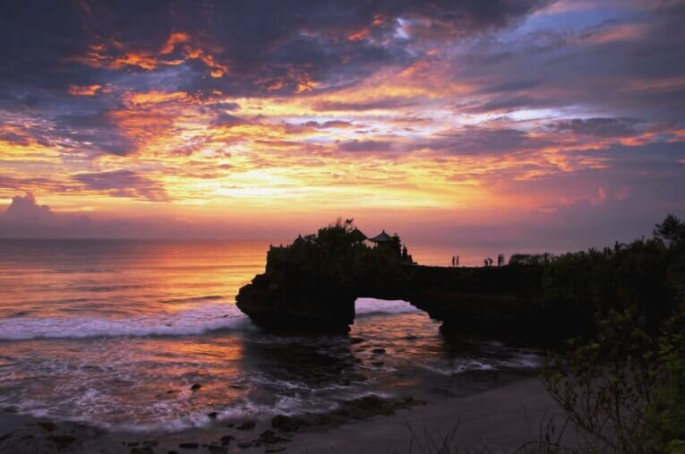

Куда поехать, чтоб насладиться полноценным отдыхом и получить незабываемые впечатления? Многие бывалые туристы подскажут, что все дороги ведут… на остров Бали, который находится в Индонезии. Здесь туриста ждет не только море развлечений среди самой живописной природы в мире, но также гостеприимное местное население со своими интересными обычаями, культурой и вероисповеданием. <!--more-->

На Бали все туристы найдут себе развлечения по душе – и романтические натуры, и заядлые охотники, и те, кто предпочитает активный вид отдыха и адреналин.

Еще одна визитная карта этого красивейшего уголка мира – организация свадьбы и медового месяца. Свадебная церемония, проведенная среди живописных уголков острова с необыкновенной экзотической атмосферой, останется в вашей памяти самым приятным событием вашей жизни.

**Самостоятельный отдых на Бали – шаг за шагом**

Прежде, чем отправиться в путешествие, каждый турист задает себе вопрос: а возможно ли самостоятельно организовать полноценный отдых, к примеру, на таком известном международном курорте, как остров Бали? Для тех, кто не боится пробовать что-то новое в своей жизни – все возможно! Так с чего же начать самостоятельное путешествие на Бали?

1. Первый шаг – это бронирование номера в отеле. Как только вы прилетите на остров, вам нужно где-то поселиться на пару дней, пока вы не подыщете подходящий район и более дешевое жилье в местного населения. Отличной подсказкой вам станут информационные порталы [airbnb](https://www.airbnb.ru/c/alexandrab4058?s=8) или [booking.com](https://www.booking.com/?aid=878635), где вы сможете забронировать себе недорогой номер в отеле или роскошную виллу.
2. Второй шаг – район проживания. Популярными считаются районы Убуд и Нуса Дуа – здесь самые живописные пляжи и центры туристической индустрии острова. Если вы приехали на недельку-две – лучше поселится в этих двух районах или в Семиньяке. Для длительного отпуска лучше подойдут районы Чангу и Джимбаран, где более низкие цены на жилье.
3. А теперь самое интересное и третьей шаг. Что же ждет на туриста среди балийской экзотики? Море развлечений!

Если вы любите активный отдых, здесь вы сможете насладиться самыми разнообразными развлечениями:

\- рафтинг, серфинг, дайвинг;

\- велотуры по горам или джунглям;

\- схождение на вулканы Батур и Агунг.

Самые [популярные экскурсии на Бали](https://gidnabali.ru/ekskursii-na-bali) являются:

\- самостоятельные экскурсии по острову на байке или пешие прогулки;

\- экскурсии по джунглям или поездка в аквапарк;

\- знакомство с местными храмами и религией;

\- прогулки на катере в открытом океане;

\- закат на острове Гили и прочее.

Если вы приехали, чтоб насладиться солнцем и океаном на пляже, лучший вариант – это пляжный отдых в Нуса Дуа. Если вы из числа активных туристов – поезжайте снорклить в Амед, на север острова.

**ГидНаБали – профессиональная команда, которая организует лучший отдых в Индонезии**

Развлечений на Бали очень много, но более подробно Вам о них расскажут местные туристические компании. Единственным официальным туроператором на Бали является компания [Gidnabali.ru](https://gidnabali.ru/) с русскоговорящей командой профессиональных менеджеров. Компания предоставляет широкий спектр услуг для туристов: бронирование жилья, экскурсии по острову и туры по Индонезии, организация свадебной церемонии на Бали, омолаживающие спа-процедуры и прочее.

Если вам нужно организовать интересную и безопасную экскурсию по острову с грамотным гидом или заказать тур по Индонезии, команда GidNaBali подберет самый оптимальный вариант. Ведь большинство местных гидов совмещают еще и обязанности шофера, что не всегда безопасно для туристов.

Самостоятельно путешествовать немного рискованно, так как на Бали неупорядоченное левостороннее дорожное движение. Кроме того, туристу в незнакомой местности трудно сориентироваться и воспользоваться всеми доступными видами развлечений. Поэтому профессиональная помощь туристической компании ГидНаБали может очень даже вам пригодиться.

Не бойтесь открывать для себя новое – насладитесь чудесным отдыхом на экзотическом острове Бали или другом не менее красивом курорте Индонезии.
