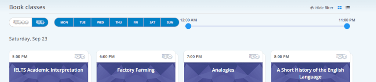
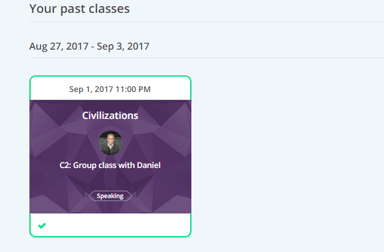

Можно долго рассуждать на тему, нужен ли иностранный язык для путешествий и вообще для жизни, и мой ответ давно известен: да, нужен. И не просто какой-нибудь, а именно английский, потому что еще многие годы он останется самым популярным и доступным для изучения. Есть множество способов выучить английский: школа, университет, курсы, самообучение, частные репетиторы. Я перепробовала все вышеперечисленное и сегодня хотела бы рассказать об онлайн-курсах [Lingoda](https://www.lingoda.com/ru/english/courses/monthly/light)<!--more-->

Для меня очень важно иметь возможность заниматься удаленно. Я бы даже сказала, что это критично, потому что дольше пары недель мы в силу своего [образа жизни](https://vk.com/vodpop) не задерживаемся. Занятия, для которых нужен только ноутбук, наушники и наличие интернета — лучший формат.

Мое знакомство с [Lingoda](https://www.lingoda.com/ru) началось с общения с менеджером этой компании, и мне выделили 5 частных и 5 групповых уроков — вполне достаточно, чтобы познакомиться с сервисом поближе и решить, подходит ли такой способ для изучения английского языка (забегая вперед, да, подходит, но с некоторыми исключениями. См. ниже).

Первое, что вы увидите зайдя на сайт будет выбор языков для изучения. Кроме английского также доступны немецкий, испанский и французский языки.

После выбора языка вам предложат оценить свои познания. Тут я немного подзависла, потому что "я начинаю с нуля" и "я новичок" для меня имеют довольно похожий смысл, но это все тонкости перевода, и на суть не влияет. Даже если вы изначально ошиблись с самоопределением уровня, на первом же занятии вы можете попросить преподавателя оценить ваши знания по общеевропейской системе CEFR, а затем изменить уровень в личном кабинете.

Интерфейс [Lingoda](https://www.lingoda.com/ru) в меру дружелюбный, но кое-какие моменты очень смущают: например, не всегда понятно, в какой части меню вы находитесь: для выбора индивидуальных или групповых занятий. Мой вам совет: перед тем как взаимодействовать с сервисом, потратьте 10-15 минут на изучения вкладок, чтобы в дальнейшем не возникало проблем. И обратите внимание, что дни в списке для выбора занятий идут не по порядку (понедельник, вторник, среда и т.п.), а по наличию занятий в эти дни. Если нет занятий в пятницу, то в интерфейсе пятница тоже не появится.

## Частные уроки на Lingoda

Итак, мои вводные. Отвечая на вопросы на сервисе, я добралась лишь до уровня B2. По моей собственной оценке у меня Advanced - C1, а по мнению преподавателей Proficiency - C2. Что, согласно стандартному определению, значит, что я свободно могу говорить, читать, писать и слышать на любые темы. Однако, я все-таки не носитель языка, и могу допускать некоторые ошибки в грамматике и произношении. Именно это я бы и хотела в идеале исправить в своем английском: отполировать знание грамматики, убрать все еще слышимый русский акцент и прибрести взамен него американский.

Частные уроки на Lingoda проходят по Skype, но, что мне не понравилось, так это тот факт, что о преподавателе (и его учетке в скайпе) я могу узнать лишь в последний момент. Напомню, что я целюсь в американский акцент, и, соответственно, предпочла бы заниматься с преподавателем из США. Но данный сервис не дает возможности выбора (по крайней мере сначала), и о том, кто будет вести то или иное занятие, можно узнать за несколько минут до его начала. Записаться на частное занятие можно минимум за 2 дня заранее. День в день не получится.

Пообщавшись с преподавателями, я поняла, что большинство учеников довольны такой системой: каждый раз новый преподаватель, новый акцент (есть профессоры из Австралии, ЮАР, Англии и т.п.), новый подход. Если вы начинающий или даже уверенный середнячок, это должно пойти на пользу. В случае, если вам не понравился преподаватель, ему можно поставить рейтинг в одну звездочку, и тогда ваши пути на сервисе больше не пересекутся. Если же наоборот, вы нашли самого-самого, то вы можете продолжать заниматься только с ним. В любом случае, это потребует некоторого времени, так как у меня за все разы пользования сервисом так и не попался американский акцент.

Было такое, что под выбранную мной тему не смогли найти преподавателя, о чем мне сообщили за час до предполагаемого занятия. Я, конечно, подрасстроилась, потому что очень сложно в поездке планировать наличие интернета, тем более на два дня вперед. Но сервис автоматически возвращает кредит за занятие на баланс.

## Групповые УРОКИ НА LINGODA

Групповые занятия подразумевают наличие не более 5 человек, но мне везло, как никому другому. Как мне объяснили преподаватели, чем выше уровень и непопулярнее тема, тем меньше конкуренция, и тем выше шанс получить частный урок. Что очень привлекательно, так как групповые уроки проходят в Adobe Connect, а это приложение часто подвисает, особенно по части звука. Если вы один, то вы по обоюдному согласию с преподавателем можете переместиться в Skype.

В итоге, у меня не было ни одного группового занятия с другим учеником. Только индивидуальные — по цене групповых. Что приятно, так это возможность забронировать групповое занятие день в день. Освободился вечер? Можно провести его с пользой.

## Качество преподавания на Lingoda

Все преподаватели, с которыми я успела позаниматься, были профессионалами своего дела, и у меня ни разу не возникло желания поставить им что-то, кроме 5/5.

Наличие преподавателей из разных стран, с разными акцентами и подходом, пойдет на пользу как новичкам, так и продолжающим. Но для моих, весьма конкретных целей, такой метод не вполне подходит. Данные об ученике фиксируются со стороны преподавателей: они оставляют заметки после каждого занятия, чтобы следующий преподаватель мог с ними ознакомиться. Но если говорить об изучении грамматики, то куда легче и проще это делать с одним преподавателем, который будет помнить, на каком моменте вы остановились, какие ошибки допускаешь конкретно ты, чтобы не топтаться на одном месте или наоборот, не убегать слишком далеко вперед. Как я уже упомянула, это можно сделать в частных уроках, если найти понравившегося преподавателя, и договариваться с ним (это все еще проходит официально через Lingoda).

## Плюсы и минусы изучения английского языка с Lingoda

Не бывает идеальных сервисов, поэтому вот моя субъективная оценка, основанная на личном опыте пользования Лингодой.

###### Плюсы:

- занятия проходят онлайн: не надо никуда ездить-ходить-бежать после работы, можно просто сесть с ноутбуком где угодно и заниматься
- материалы для каждого уровня находятся в открытом доступе: перед тем, как выбрать занятие, вы можете скачать PDF-документ с его содержимым, перевести лексику, чтобы не тратить на это ценные минуты занятия
- учебные материалы покрывают множество топиков, от самых простых (шоппинг в магазине), то самых сложных (обсуждение проблемы ВИЧ и СПИДа на международном уровне)
- высокий уровень подготовки преподавателей
- преподаватели и акценты со всех уголков мира: можно познакомиться с особенностями речи разных людей, что явно улучшит ваши навыки аудирования
- за отмену занятий деньги возвращают сразу и без вопросов. Как-то на мое занятие не пришел преподаватель. Два нажатия кнопки — и мне пришло письмо с извинениями и вернули занятие на баланс
- первый урок — бесплатно
- гибкое ценообразование: есть несколько тарифных планов, среди которых можно выбрать подходящий именно вам
- сертификация CEFR: официальный сертификат от Лингода после прохождения каждого уровня

###### Минусы:

- для уровня C2 учебные материалы слабоваты, практически ни разу не следовали им, потому что они слишком простые
- если хочется найти одного-единственного преподавателя и заниматься только с ним, придется сделать несколько попыток: рейтинг профессоров и их акценты скрыты от глаз учеников
- нет домашних заданий. Лично я твердо уверена, что 70% знаний языка - это самостоятельное выполнение домашки. Надо обладать очень высокой самодисциплиной, чтобы делать и проверять ее самостоятельно
- нет круглосуточной технической поддержки. Несмотря на то, что сервис позиционирует себя 24/7, поддержка работает с 9 до 17 по берлинскому времени (и да, неважно, где вы живете, вы непременно должны знать, сколько времени в Берлине :) )

Надеюсь, мой опыт пригодится вам в принятии решения, заниматься ли или нет на Lingoda. Помимо этого, вы всегда можете взять первый бесплатный урок и решить для себя, подходит ли вам такой формат или нет.
