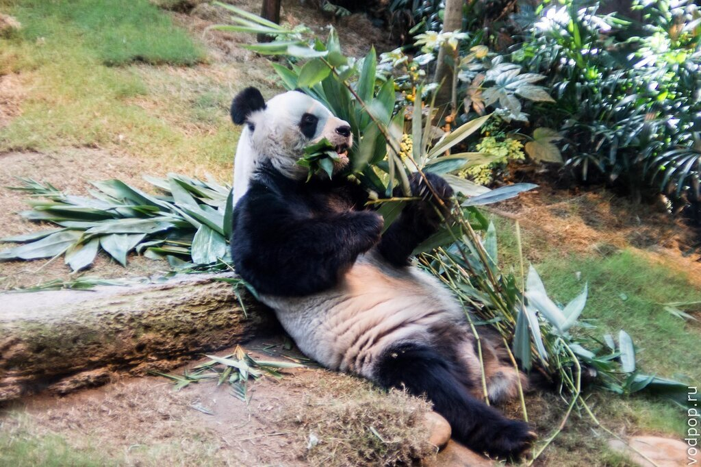
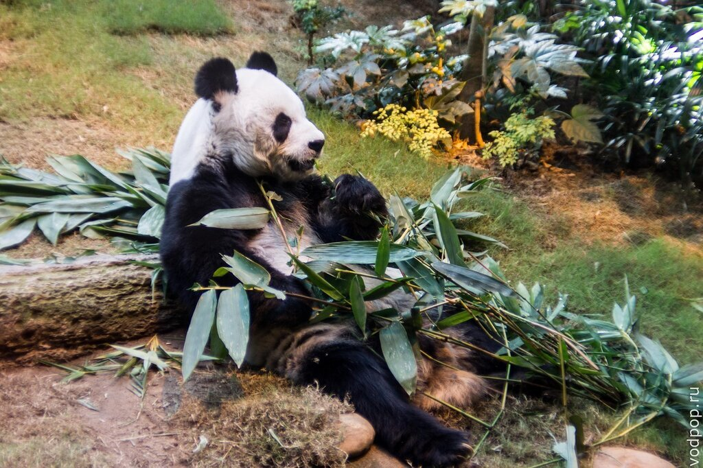
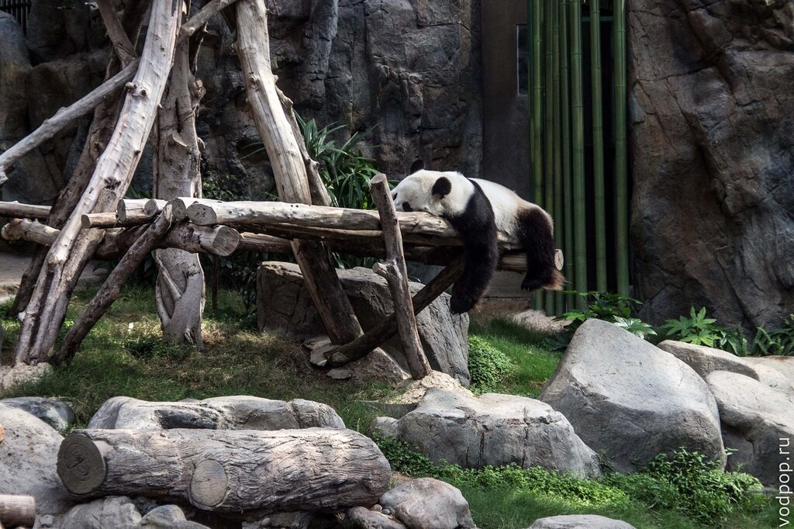
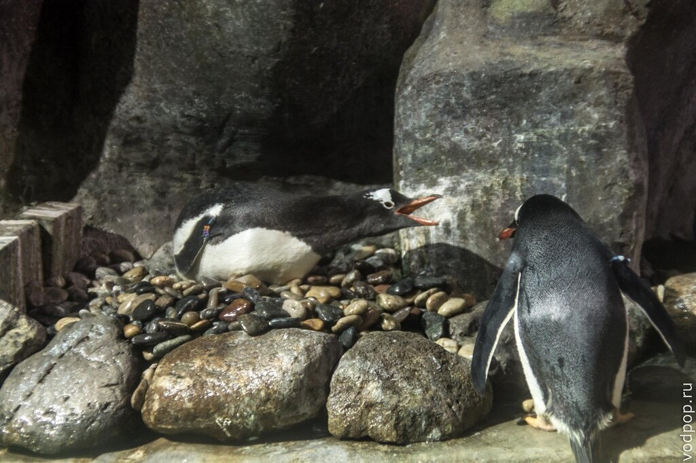
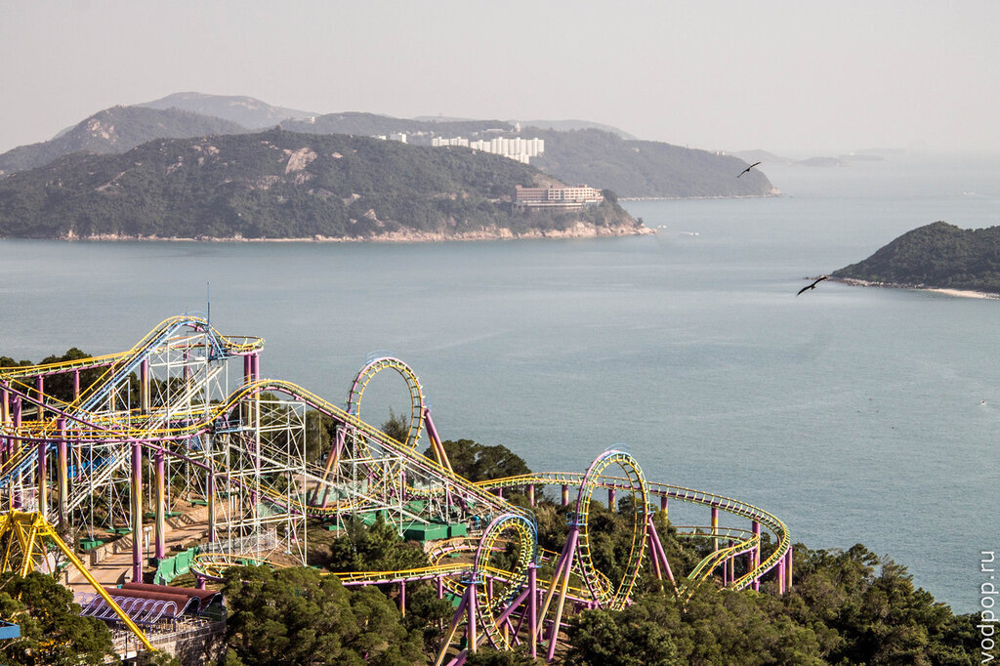
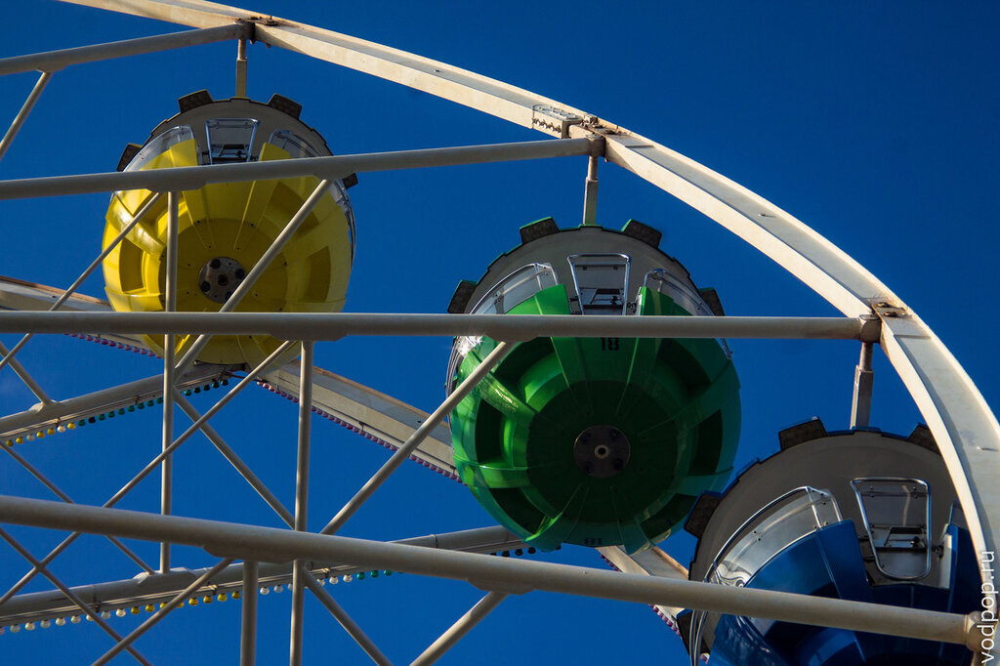
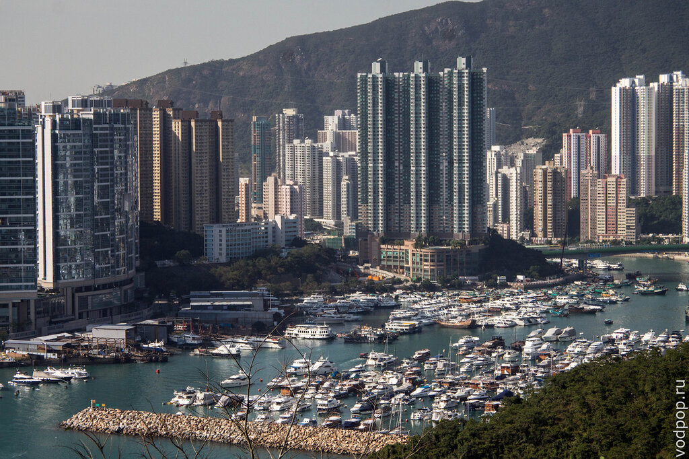
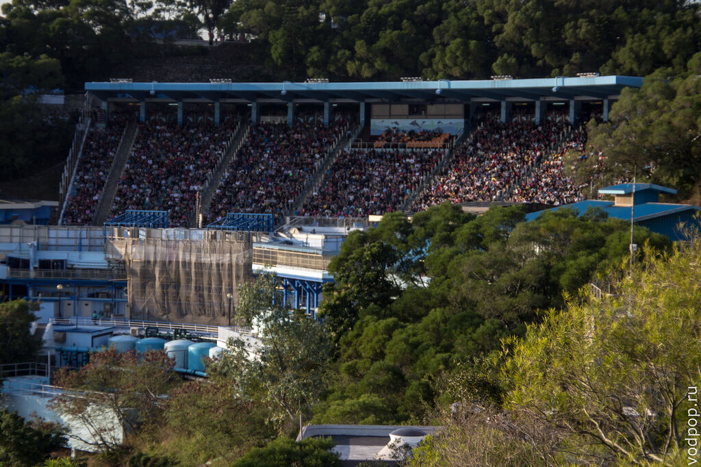
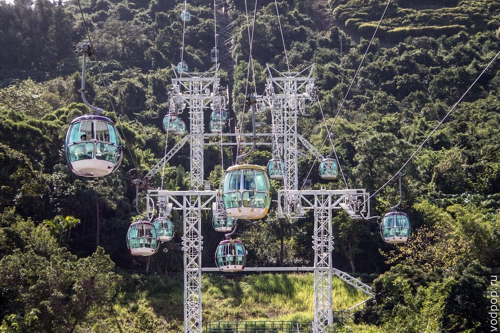

В Азии сбылась еще одна наша маленькая мечта - увидеть своими глазами живую панду. Для этого мы выделили целый день, посетив Оушен Парк в Гонконге. Это великолепное животное давно стало предметом культа - футболки, рюкзаки, сережки, браслеты и чехлы на телефон с изображением этого милого животного можно купить почти в каждой стране мира.

<!--more-->

В жизни, конечно, панда еще очаровательнее, чем на картинках

Если быть точной, правильное название черно-белого пушистика - большая панда.

Панда - ночное животное, по крайней мере в дикой природе: спят днем, а бодрствуют с вечера и до рассвета. Правда, в Оушен Парк (Ocean Park) у них свой режим, так как большинство посетителей приходит сюда с 10.00 до 20.00.

Весит особь до 160 килограмм, а в день поглощает около 30 кг бамбука. Процесс поглощения бамбука занимает практически весь день, ведь панды усваивают всего 17% пищи. Для сравнения - у человека этот показатель около 80-85%. Без улыбки на это смотреть невозможно, так что предлагаю вам короткий сеанс повышения настроения:

<iframe src="//www.youtube.com/embed/53zCKgvTDvM" width="560" height="315" frameborder="0" allowfullscreen="allowfullscreen"></iframe>

 

Вместе с большими пандами, в том же помещении живет весьма редкое и интересное животное - малая панда, знакомая многим по одноименному браузеру с ее изображением: Firefox. Кстати, многие ошибаются, называя ее огненной лисой - ведь малая панда никакое отношение к лисам не имеет, и ближе всего к семейству енотовых.

Из меня еще тот ихтиолог, и среди огромного разнообразия рыб и морских существ, представленных к больших прозрачных аквариумах Оушен Парка, я узнавала разве что самых популярных - акул, рыбок-клоунов и скатов. Даже тщательный поиск в интернете так и не дал мне точного ответа, что же это за странная рыба на фото ниже. Не то шишколобая рыба-попугай, не то групер. Если есть эксперты, буду рада правильному ответу в комментариях.

Кроме этого можно зайти в залы Северного и Южного полюсов, только постарайтесь на замерзнуть - температура там как в холодильнике. Зато пингвинам нравится.

Эти фееричные животные способны очаровать и детей, и взрослых. Несмотря на свою смешную походку на суше, в воде они вытворяют просто чудеса! Увы, мы так увлеклись наблюдением, что забыли снять видео! Поэтому, либо верьте нам на слово, либо проверяйте сами!

Кроме того, в Оушен Парк в Гонконге можно покататься на множестве аттракционов: американские (они же русские) горки, карусели, паровозики, летучие качели и на многом другом.

Я очень хотела покататься на колесе обозрения, потому что с него открывался великолепный вид на город, и в очереди пришлось стоять около 20 минут.

Вид

К слову, это не рекорд ожидания - на некоторые аттракционы приходится стоять по 40-50 минут, никаких тебе удобных fast-pass, как [в Диснейленде](https://vodpop.ru/disneylend-frantsiya/ "Диснейленд в Париже. Цены и инструкция для новичков"). По этой причине мы практически обошли все подобные развлечения стороной, разве что Климентий решил забраться на один из очень крутых аттракционов, куда очереди практически не было. Я благоразумно осталась внизу, т.к. там подразумевалось вращение, а после аналогичного аттракциона в Бангкоке, я больше на них не катаюсь.

А это фотография с колеса обозрения на морское шоу. Нашей основной целью стало пробраться к выходу до того, как вся толпа китайцев хлынет туда же.

Один из основных недостатков Оушен Парка в Гонконге - это то, что он разделен на две части, между которыми всего два канала связи: канатная дорога и поезд.

Нравится статья? Узнавайте первым о выходе новых интересных историй! Подпишитесь на нас по [эл. почте](http://feedburner.google.com/fb/a/mailverify?uri=vodpop&loc=ru_RU) или в [группе ВКонтакте](http://vk.com/vodpop)

В первый раз мы воспользовались поездом, который провез нас сквозь горную породу на другую часть парка. А обратно мы решили все-таки постоять в очереди и прокатиться на канатной дороге.

Судя по отзывам, это чуть ли не самое интересное развлечение в парке. Но нас особого впечатления не произвело: очередь в полчаса с орущими и толкающими тебя сзади локтями китайцами, затем посадка в кабину, где  китайцы сразу начали с нами фотографироваться (ну мы же белые..) - скажем так, ощущение легкого дискомфорта преследовало весь путь назад.

Не став дожидаться шоу фонтанов и оставив всю толпу позади, мы запрыгнули в двухэтажный автобус и поехали домой с теплыми воспоминаниями о самой очаровательной и пушистой большой панде.

Дальше будет интересно прочитать тем, кто сам хочет посетить Оушен Парк.

## Как добраться в Оушен Парк в Гонконге:

- Ситибас №629, который отправляется со станций Admiralty и Central (Star Ferry).  Цена $10.6 HKD - взрослый билет, $5.3 HKD- детский билет;
- Если вы уже хорошо знакомы с транспортной системой Гонконга, до можете добраться до Оушен Парка на любом автобусе, который проходит через Aberdeen Tunnel. От тоннеля небольшая пешая прогулка, и вы на месте;
- Если у вас есть свой личный транспорт, то лучше посмотреть схему и правила парковки на официальном сайте [http://www.oceanpark.com.hk/](http://www.oceanpark.com.hk/)

## Как купить билет в Оушен Парк:

- На официальном сайте [http://www.oceanpark.com.hk/](http://www.oceanpark.com.hk/) за 320 HKD -взрослый, 160 HKD -детский;
- В кассе Оушен Парк за 320 HKD -взрослый, 160 HKD -детский (при групповом бронировании от 20 человек - скидка);
- На станции отправления Ситибас  за 300 HKD - взрослый (детский тоже со скидкой, но мы не знаем, с какой именно). Скидка как раз счет того, что  они покупают сразу несколько сотен билетов.

## Что взять с собой:

- фотоаппарат;
- бутылку воды;
- если есть возможность, нормальную еду. На территории все дорого и не вкусно;
- теплые вещи - для посещения залов Северного и Южного полюсов;
- закрытую обувь - шлепки могут слететь на аттракционах;
- солнцезащитные очки и что-то на голову;
- телефон или книгу - чтобы читать, пока долго стоишь в очереди;

А еще запаситесь терпением, так как китайцы ОЧЕНЬ шумная нация. Они привыкли все время находится в толпе, и не стесняются загородить своим телом весь аквариум, например. Любят пошуметь и потолкаться локтями. При этом они бывают довольно хамоватые и не понимают вежливых просьб на английском. Собственно, впечатления от посещения парка были этим немного смазаны, хотя панда определенно стоит того, чтобы потерпеть все эти мелочи.
