[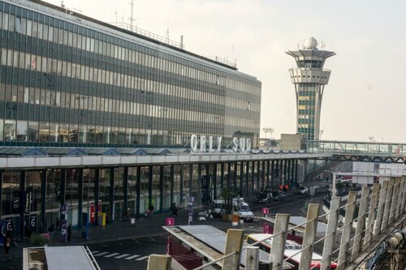](https://vodpop.ru/parizh-frantsiya/)

День 1, он же день прилета.  
Как выяснилось, прилетать в Шарль-де-Голль выгоднее, чем в Орли, так как последний находится в дальней зоне Парижа и ценник на билеты (электричку или автобус) выше, чем из Шарля. По прилету сразу подошли к стойке информации, купили билеты на экспресс и получили карту Парижа на русском языке. Так как я уже не в первый раз в столице Франции, навигацию и поиск отеля я взяла на себя. Климентий был заранее предупрежден о кольцевом строении улиц и к концу нашего пребывания в столице Франции начал неплохо ориентироваться.

<!--more-->  
Из-за того, что мы были невыспавшиеся (я бы даже сказала, неспавшие), нужную остановку мы благополучно пропустили (оказывается, электрички у них останавливаются не на всех указанных в маршруте точках) и уехали немного вперед. Климентий был поражен количеством французов африканского происхождения, но вида не показывал. А еще во французском метро музыканты играют не только на баянах и гитарах, но еще и на контрабасах.  

[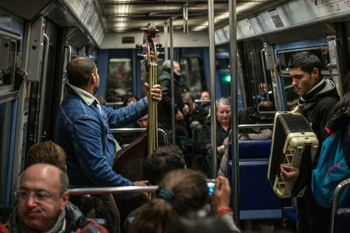](http://fotki.yandex.ru/users/klimentij511/view/804955/)

Так или иначе мы добрались до гостиницы в 9 округе – это идеальный район для осмотра Парижа пешком. Транспортом мы пользовались буквально пару раз.  
Разобрали вещи, и думали было пойти погулять, как решили «прилечь». В результате проснулись в 21.00 и попытались пойти на Мулен Руж. Попытка не удалась, так как свободных мест уже не было – нужно было резервировать заранее. Немного расстроившись, мы вернулись обратно и устроили традиционный в нашем понимании французский ужин – вино, сыр и шоколад. Надо отметить, что купленный в тот день Камамбер не раз портил настроение Климентию своим запахом (хотя он даже не козий. Кто знает, тот поймет о чем я).  
Пара слов о гостинице – весьма обычная, в 3 минутах ходьбы от метро Cadet, на улице Rue Trevise. Мои слова про ограниченность пространства в Париже по началу не воспринимались всерьез. Однако, зайдя в лифт нашего отеля , мы поняли, что это не шутки — надпись просит заходить в лифт по одному.  
Размер лифта примерно в 2,5 раза меньше российских – вдвоем уместиться почти нереально, но нам удалось. Потом мы уже заметили на нем наклейку с просьбой пользоваться лифтом по одному.

[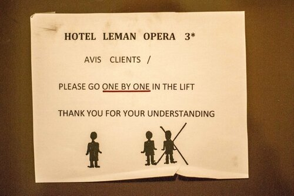](http://fotki.yandex.ru/users/klimentij511/view/805007/)

Вообще Париж это город для людей, которые не страдают клаустрофобией, ибо в нашем коридорчике (без уменьшительных суффиксов никак нельзя!) было аж 4 двери, которые если открылись бы одновременно, заблокировали друг друга. В самом номере умещалась довольно большая двуспальная кровать и стол со встроенным холодильником. Ванна совмещенная с туалетом, почти полноценная – можно было погреться после долгих прогулок. Пожалуй, об отеле все , да и день 1 подошел к концу.

День 2. Полный впечатлений.  
Маршрут был скомпонован из всего того, что мне удалось увидеть в Париже в предыдущий раз. Рано утром мы вышли из отеля и направились пешком в сторону Opera. Мы купили билеты на обзорную прогулку по внутренней части оперы, и взяли брошюру на русском языке. Внутреннее убранство просто шикарно – потрясающие лестницы, статуи, картины.

[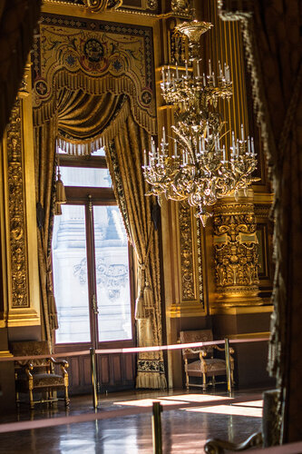](http://fotki.yandex.ru/users/klimentij511/view/804974/)

Начинаешь лучше понимать значение словосочетания «французский шик». И хотя мы не являемся большими любителями золотых люстр весом в 8 тонн и красного бархата, на нас это произвело впечатление. Даже захотели купить билеты на какое-нибудь представление, но в даты нашего пребывания выступлений было. Можно было купить в качестве сувениров вот такие потрясающие светильники, но в наши рюкзаки они бы явно не поместились.

[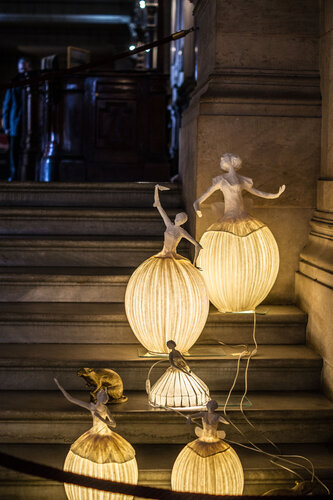](http://fotki.yandex.ru/users/klimentij511/view/804975/)

Из окна Оперы виднелись крыши Пале Рояль, куда и лежал наш дальнейший маршрут.

[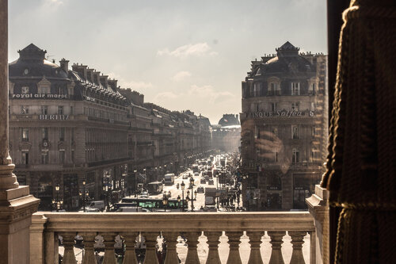](http://fotki.yandex.ru/users/klimentij511/view/804969/)

Мы купили пару салатов и бутылку воды и сели пообедать в саду Тьюльерри. Закончив наш скромный обед, мы двинулись дальше, к площади Конкорд.

[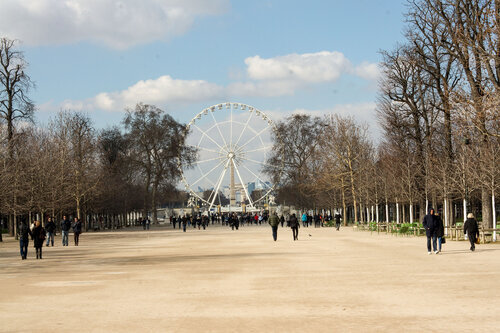](http://fotki.yandex.ru/users/klimentij511/view/804984/)

На улице было несколько холоднее, чем мы рассчитывали, поэтому мы старались разбавлять пешие прогулки чем-то более согревающим. Первым таким объектом стал музей Оранжери – два этажа импрессионистов, на верхнем из которых представлены знаменитые кувшинки Моне. На первом этаже находятся не менее ценные с художественной точки зрения произведения искусства. Лично мне очень запомнился Ренуар и в силу низкого туристического сезона я смогла смотреть на одну из его картин почти 10 минут не отрываясь и не уступая никому место. Как выяснилось позже, мы просто вовремя пришли, так как мы еле протиснулись сквозь толпу школьников при выходе.

[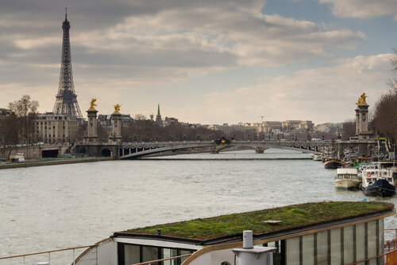](http://fotki.yandex.ru/users/klimentij511/view/804988/)

Мы перешли через мост Александра Второго и пошли в сторону Дома Инвалидов. Желания зайти внутрь у нас не оказалось, поэтому мы прогулялись по внутреннему дворику и прочитали брошюру про историю создания.

[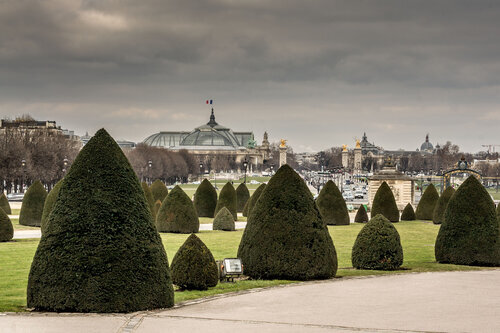](http://fotki.yandex.ru/users/klimentij511/view/804992/)

Выйдя к Эколь Милитари (военной школе) в начале Марсова Поля, мы увидели Стену Мира.

[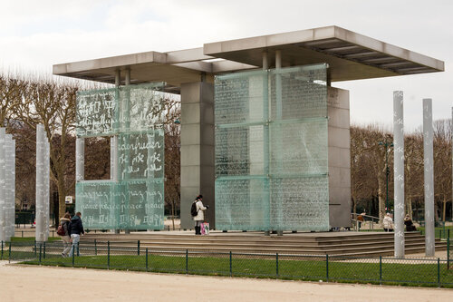](http://fotki.yandex.ru/users/klimentij511/view/804994/)

Несколько высоких стен из стекла, на которых написано слово «Мир» на нескольких языках. До Эйфелевой Башни оставалось несколько десятков метров и я начала готовить Клима к пешему подъему наверх (лифты там тоже ходят, но на них очередь раз в 20 длиннее).

[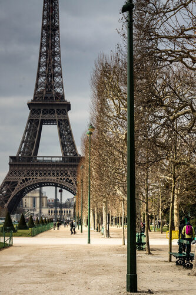](http://fotki.yandex.ru/users/klimentij511/view/804995/)

Во Франции очень быстро окупается международное студенческое свидетельство – всего лишь за 1 подъем на Эйфелеву Башню он экономит половину стоимости.  
Поднялся сильный ветер, поэтому долго любоваться видами Парижа было некогда – мы мгновенно промерзали и забегали внутрь. На Башне мы попробовали тайский куриный суп (гадость жуткая) и восполнив потребности организмов в энергии и тепле, побежали дальше исследовать город. Купили билетики на речной трамвайчик и доплыли до Сен-Жермен Де Пре – одного из самых известных архитектурных памятников Парижа.  
[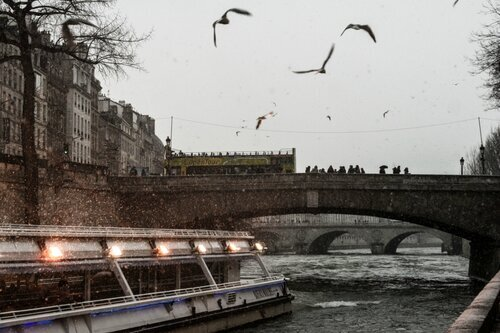](http://fotki.yandex.ru/users/klimentij511/view/805028/)

Убрав карты подальше (я не расставалась с бумажной, Климентий постоянно что-то искал в своем айфоне), мы побродили по узким улочкам и вышли к Люксембургскому Саду, который закрылся буквально за 5 минут до нашего прихода. Нашему взгляду открылся Пантеон, обогнув слева который, мы увидели величественный собор Святой Женевьевы. В Париже [взгляда](https://vodpop.ru/berlin-germaniya/) почти каждая улочка выводит тебя к какой-нибудь достопримечательности, поэтому когда мы поедем туда в следующий раз, то будем просто гулять, не смотря на карты.  
Когда мы вышли к Сорбонне, уже почти стемнело и Климентий запросил пощады (пешком было пройдено около 14 км). Мы зашли в первую же кафешку, в которой заказали фирменный французский луковый суп (много удивления Климентия на размякший хлеб и корку сыра) и не прожаренное мясо (как выяснилось, от этого Клима и вовсе воротит, а мне понравилось). Последующие дни мы подружились с луковым супом, а вот мясо с кровью так и не вошло в список любимых продуктов. Так как Клим наотрез отказался идти пешком, да и мы порядочно продрогли, мы решили доехать до дома на метро, прогулявшись до ближайшей станции нужного нам цвета (без пересадок, чтобы не гулять по малопривлекательному подземному миру Парижа. Метро там так себе). Наш путь к станции лежал через Нотр-Дам де Пари, в который мы вернулись через несколько дней, чтобы взглянуть изнутри.  
[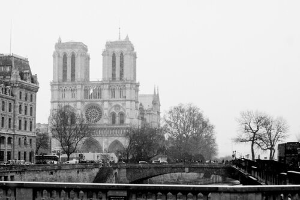](http://fotki.yandex.ru/users/klimentij511/view/805020/)

Но даже снаружи он производит неизгладимое впечатление. В этом году ему исполнилось 850 лет и вся площадь перед Собором переоборудована для приема бОльшего числа туристов – возведены трибуны, обшитые белой тканью с изображением Нотр-Дама.  
Через полчаса мы уже были в гостинице и грелись в ванной.
