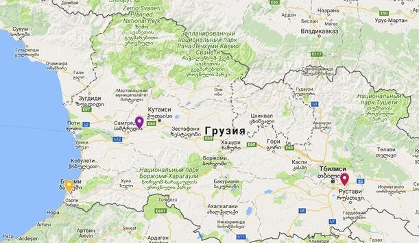
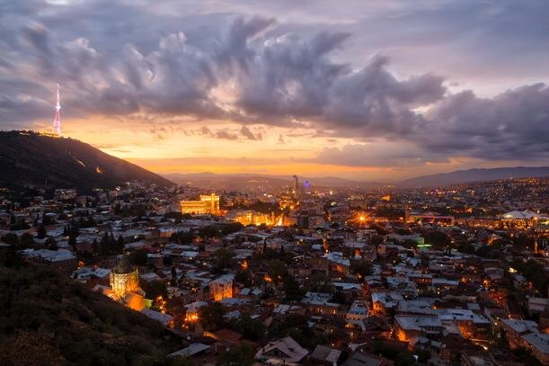
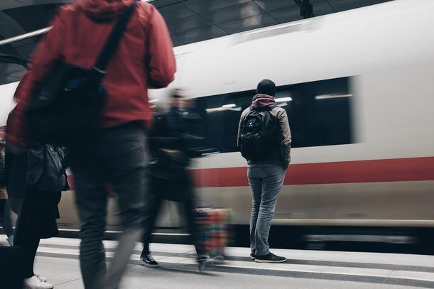

Грузия - страна, о поездке в которую мечтают многие. Горы, реки, богатая грузинская история и культура, безграничное гостеприимство и потрясающе вкусная еда. Это ли не рецепт идеального отпуска?

В этой статье я расскажу, как спланировать перелет в Грузию, как добраться из аэропорта в город, и дам несколько общих советов, которые сделают вашу поездку в Грузию незабываемой.

<!--more-->

Перед тем, как планировать поездку в Грузию, убедитесь, что у вас есть действующий загранпаспорт. Виза в Грузию для поездки сроком менее 360 дней для россиян, украинцев и белорусов не требуется.

Для поездки в Грузию вы можете выбрать один из трех международных аэропортов:

1. Тбилиси [http://tbilisiairport.com](http://tbilisiairport.com/en-EN/flightinfo/Pages/Flightinfo.aspx)
2. Батуми [http://www.batumiairport.com](http://www.batumiairport.com/en-EN/contactus/Pages/ContactInformation.aspx)
3. Кутаиси [http://www.kutaisi.aero](http://www.kutaisi.aero/)

Большинство туристов выбирает Тбилиси в качестве аэропорта прилета, поэтому далее пойдет речь именно о нем.

## Перелет Москва–Тбилиси

Москва, пожалуй, один из самых популярных городов для вылета в Грузию. На маршруте присутствует несколько десятков авиакомпаний, и цены, особенно вне сезона отпусков, приятно порадуют ваш кошелек.

**Продолжительность полета:** 2 часа 30 минут

## Перелет Минск–Тбилиси

Самый удобный способ для белорусов добраться до Грузии – это прямой рейс компании Belavia.

**Продолжительность полета:** 3 часа

## Перелет Киев–Тбилиси

Дешевле всего вылетать из аэропорта Киев-Борисполь.

**Продолжительность полета:** 2 часа 45 минут

 

Также полезным будет иметь в виду **европейские** и **российские лоукостеры** (бюджетные авиалинии), которые предлагают недорогие перелеты до Грузии

1. ## WizzAir
    

[https://wizzair.com](https://wizzair.com/ru-ru#/)

Если вы планируете евротрип с посещением Грузии, то этот вариант для вас: из Вильнюса(Литва) летают самолеты до Кутаиси(Грузия).

## 2\. Победа

[https://www.pobeda.aero/](https://www.pobeda.aero/) 

У российского лоукостера есть рейсы до Тбилиси, а также до Владикавказа, откуда можно на маршрутке доехать до Грузии.

## 3\. AirBaltic

[https://www.airbaltic.com](https://www.airbaltic.com/ru-UA/index)

Латвийский лоукостер предлагает рейсы с одной пересадкой в Риге из Москвы и Санкт-Петербурга, но они редко бывают дешевле регулярных рейсов S7. Этот вариант стоит рассматривать, если вы уже живете в Риге или по соседству.

## Как добраться из аэропорта Тбилиси в город

Первое ваше действие  — это снять немного лари в банкомате аэропорта, или поменять там же в обменнике.

1. ###### Такси
    
    

Самый простой и удобный способ. Официальная цена из аэропорта до центра Тбилиси - 30 лари, однако предприимчивые таксисты могут сказать и 50, и 100. Во избежание споров и торгов советую установить приложение [Яндекс.Такси](https://taxi.yandex.ru/) и заказывать машинку заранее. Также можно воспользоваться грузинским приложением [TaxiMaxim](https://taximaxim.ge/ru/).

Учтите, что для вызова такси вам понадобится интернет: вы можете воспользоваться бесплатной точкой доступа в аэропорту (и, кстати, по всему городу они тоже есть), купить местную симку, заранее позаботиться о международном роуминге, или раз и на всегда забыть о головной боли для краткосрочных поездок и оформить туристическую симку, как это сделали мы.

Есть множество опций, среди которых мы выбрали DrimSim. Их симка работает в 197 странах мира, и они могут выслать ее в любую точку мира. После года использования жалеем только о том, что не оформили сразу две симки. Если закажете ее по [этой ссылке](https://drimsim.app.link/1oqoQhKSLO), то и вы, и мы получим бонусом по 5€ на счет.

###### 2\. На автобусе

Из аэропорта до ЖД вокзала круглосуточно ходит автобус №37. Днем интервал движения 10-15 минут, ночью 25-35 минут. Цена — 0,5 лари. Кстати, ночью маршрут переименовывается на 137. Остановка находится прямо напротив выхода с зоны прилетов. Купить билет в аэропорте можно только в автомате (для этого вам и потребуется мелочь).

Кстати, если вы и в дальнейшем планируете передвигаться по Тбилиси на общественном транспорте, то советую купить Metromoney. Приобрести ее можно на любой станции метро в Тбилиси, стоимость — 2 лари. Если сохраните чек, то в течение 30 дней можно вернуть эту залоговую стоимость. Карточка дает возможность проезда на метро, маршрутках, автобусах и канатных дорогах.

###### 3\. На электричке

В 70 метрах от здания аэропорта расположена станция, откуда вы за 20 минут сможете добраться до центра. Проезд стоит столько же, сколько и на автобусе —0,5 лари. Один минус — ходит очень редко, всего два раза в день из аэропорта в центр.

**Из аэропорта в центр Тбилиси**: 8:35 и 17:40

**Из центра Тбилиси до аэропорта:** 7:55 и 16:55

Если вы только начали планировать свою поездку в Грузию, советую прочитать нашу [подробную статью](https://vodpop.ru/poezdka-v-gruziyu/) о том, нужна ли страховка в Грузию, как искать гостиницы, а также какие грузинские блюда непременно стоит попробовать.

Для поиска жилья в Грузии весьма популярен сервис Airbnb, который дарит [скидку 2100 рублей](http://www.airbnb.ru/c/alexandrab4058) при первом бронировании.

Надеюсь, наши советы сделают ваш перелет в Грузию незабываемым!
