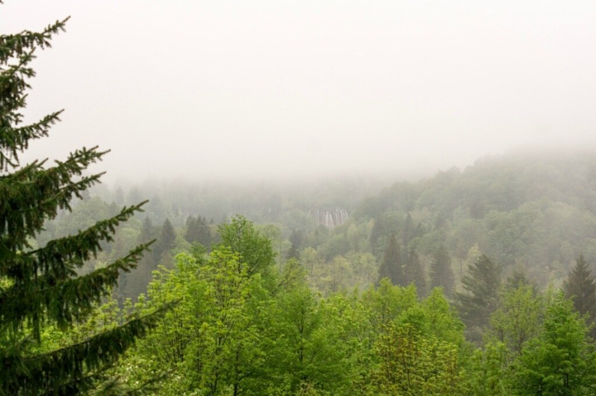
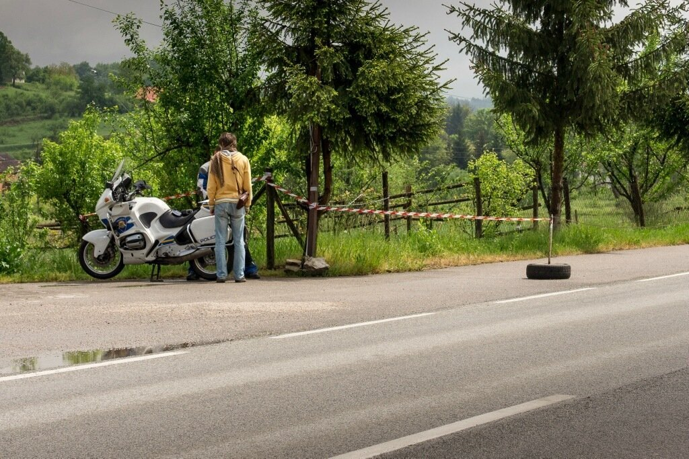
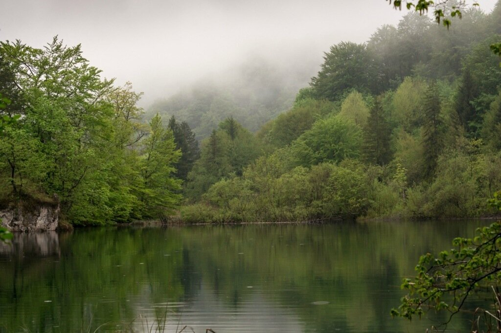
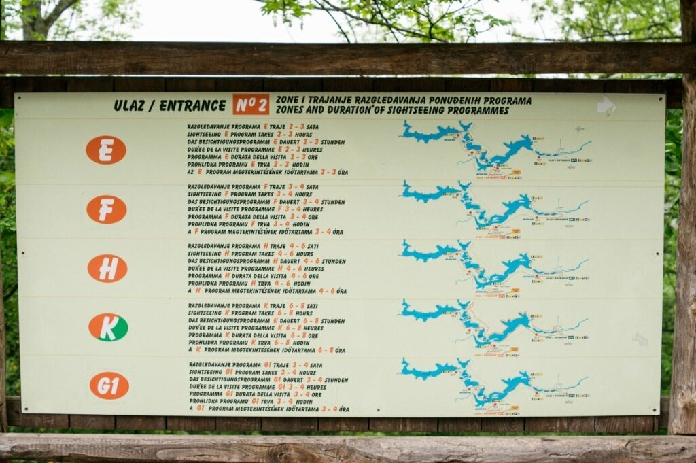
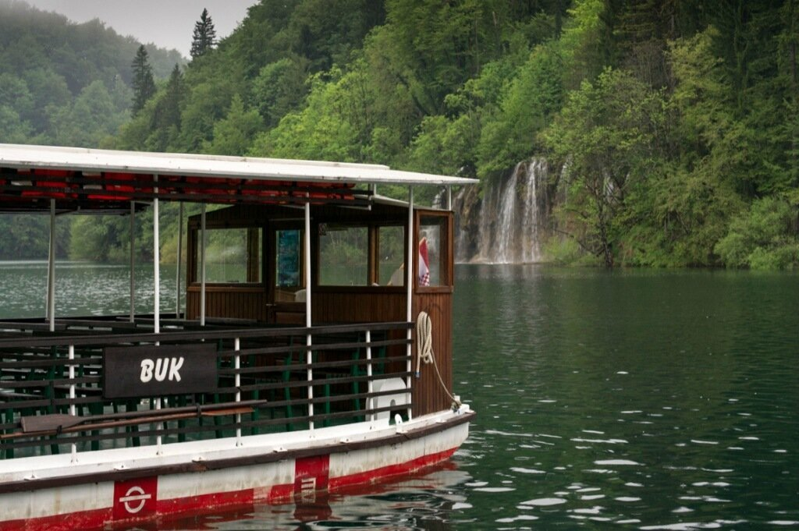
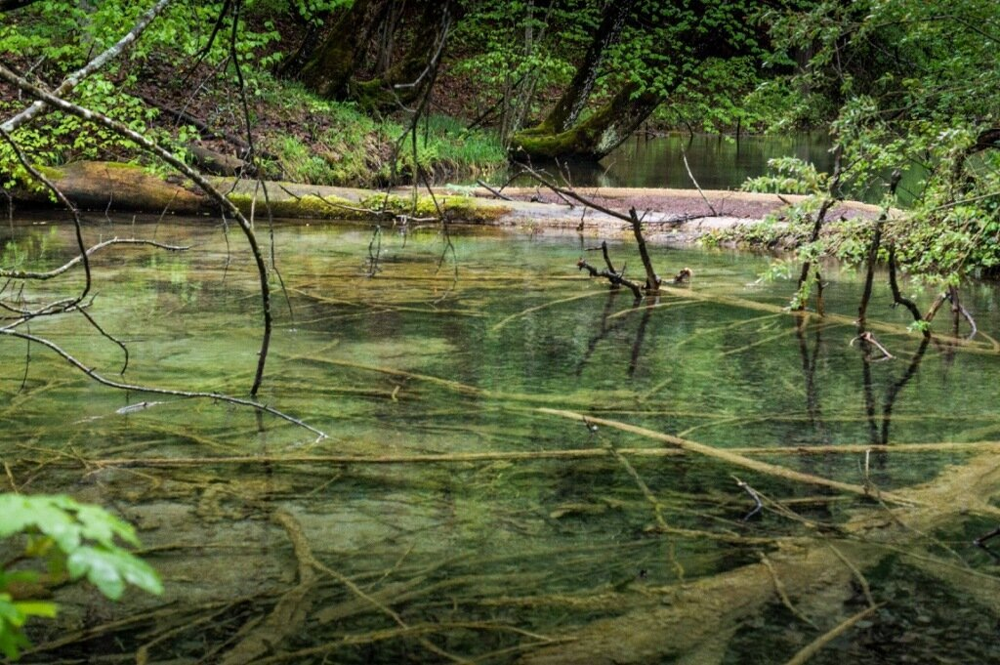
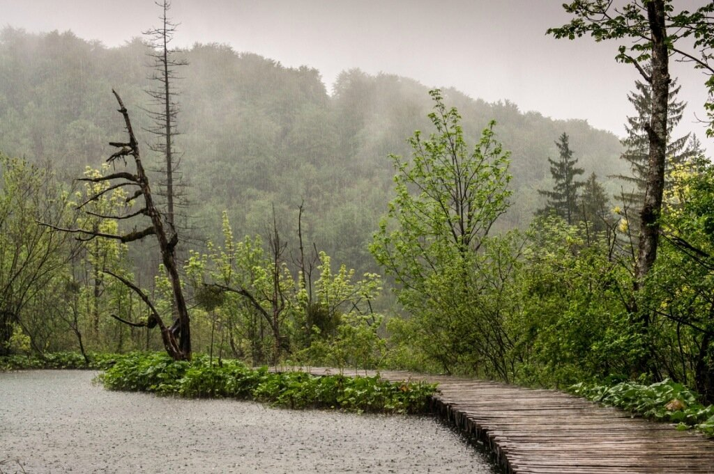
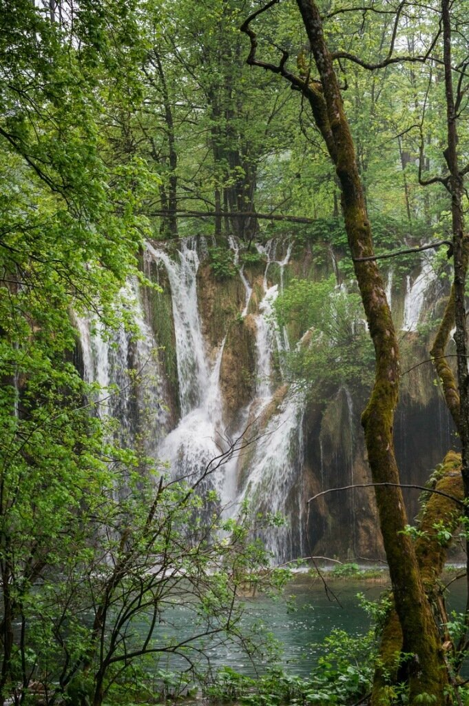
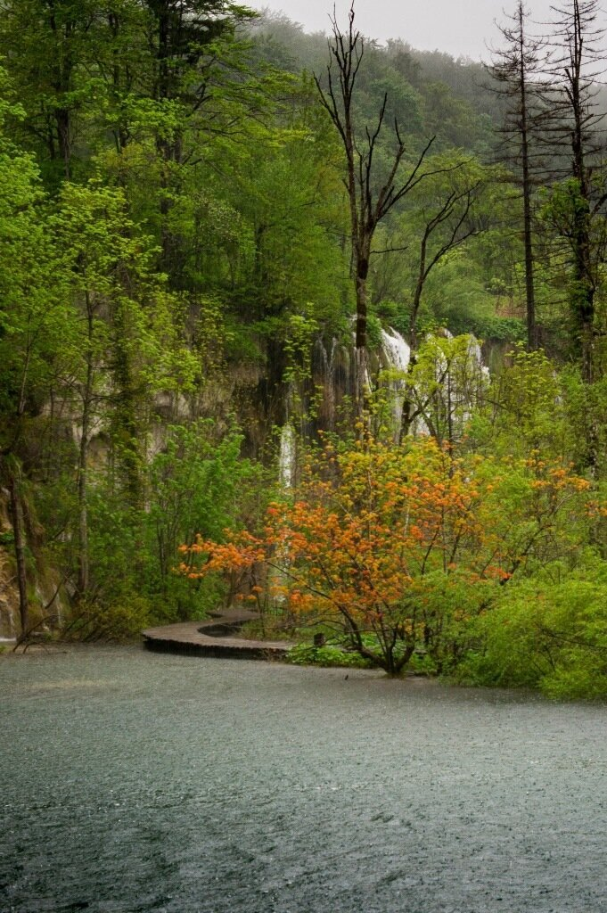
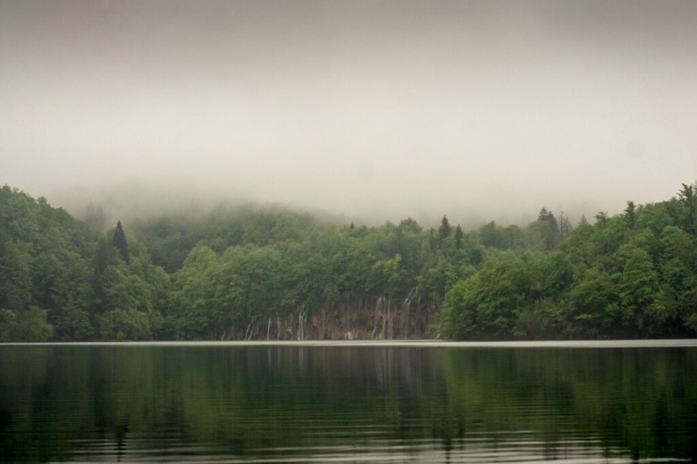

Всем путешественникам, которые собираются посетить в этом году Хорватию, с 1 июня 2013 г. придется в обязательном порядке оформлять хорватскую визу. Мы же, зная об этом нововведении, решили успеть посмотреть до наступления этой даты Плитвицкие озера - одно из чудес природы.

<!--more--> Но прежде чем попасть туда, мы решили проехать до Загреба - переночевать и посмотреть город. Увы, ночной Загреб встретил нас дурацкой системой светофоров ( каждые сто метров, в 3 часа утра - попали в красную волну), односторонними улочками и прочей ерундой, которая невероятно портит впечатления, когда ты устал от долгой дороги и хочешь только в душ и поспать. Насмотревшись за ночь на город со всех сторон в поисках отеля, с утра мы решили больше не тратить на него время - разве что заехали в супермаркет и купили пару бутылок воды в дорогу. По дороге на Плитвицкие.

Дороги в Хорватии на порядок хуже, но стоят также, как европейские. До Плитвицких озер от Загреба сначала автобан, а затем дорога, ведущая через населенные пункты. Ограничение - 50 (в городе) и 80 (вне города). Хорошо зная свою работу, хорватский мент подкараулил нас сразу за поворотом и попытался оштрафовать на 300 евро.

Мы договорились на 70 и остаток пути ехали 50 кмч. Было немного неприятно, т.к. мы ехали по ограничениям навигатора (после этого мы ему перестали верить) и превысили ненамеренно. Зато когда мы добрались до самих озер, все наши сожаления развеялись и даже потеря 70 евро забылась почти сразу.

При оплате билетов можно выбрать маршрут, в зависимости от времени, которые вы готовы посвятить прогулке. Они обозначены буквами и уже на дорожках вдоль самих озер установлены указатели, которые не дадут сойти со своего пути.

От кассы указатели ведут до причала, откуда речной трамвайчик с электромотором отправляется на другой край озера, к началу туристического маршрута.

Вся природа в девственном виде - упавшие деревья, ветки не убирают - они естественным образом разлагаются в воде.

На озерах довольно влажно - нужно брать обувь с противоскользящей подошвой - из-за высокой влажности деревянные настилы очень скользкие.

Природа такая, что бесполезно подбирать слова. Нужно просто ехать и смотреть.

Вроде бы разгар весны, а макушки некоторых деревьев золотисто-рыжие. Наверное, осенью здесь еще красивее.

Когда отдаляешься от экскурсионных групп, кажется, что на расстоянии 500 км нет ни одной живой души - только ты и шум водопадов.

P.S. если вы выбрали длинный маршрут, не забудьте прихватить с собой пару сэндвичей - расстояния огромны, а ближе к вечеру все заведения закрываются.
