На второй день путешествия по Камбодже, мы посетили [Бантей Срей](https://vodpop.ru/bantey-srey/ "Бантей Срей. Женский храм из розового песчаника"), а затем сквозь джунгли поехали по разбитой дороге на Пном Кулен - горную вершину, на которой расположено сразу несколько интересных объектов: ручей 1000 линг, лежащий Будда, храм на скале и, конечно же, водопад. Но обо всем по порядку

<!--more-->

Пном Кулен прежде всего известен как источник основного строительного материала для всех храмов Ангкора, самый известный - [Ангкор Ват](https://vodpop.ru/hram-angkor-vat/ "Храм Ангкор Ват. Восьмое чудо света"), а также менее популярные [Байон и Та Пром](https://vodpop.ru/hramyi-angkora/ "Храмы Ангкора. Загадки Кхмерской Империи"). Но священной эта гора стала, когда король Джаяварман II провозгласил независимость от Явы в 804 году. В том же году Джаяварман II он ввёл культ короля, культ линги.

[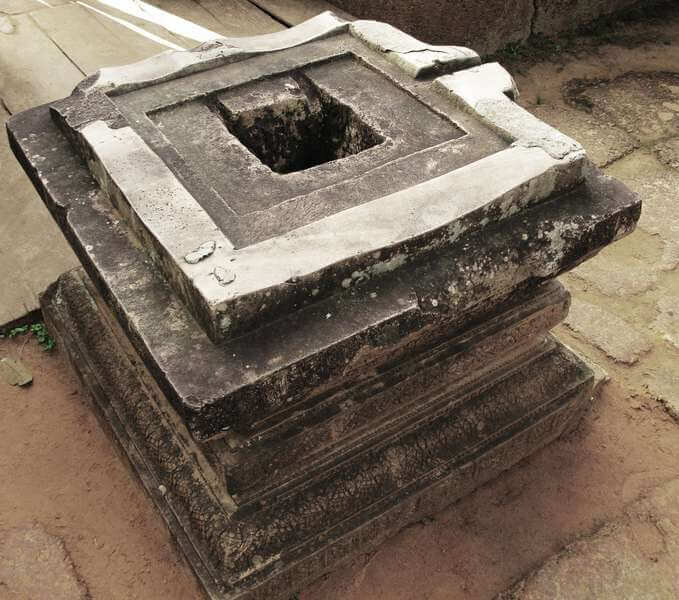](https://vodpop.ru/wp-content/uploads/2014/01/lingam.jpg)

Линга, или как ее еще называют, лингам - это символ бога Шивы, в большинстве случаев представляющий собою вертикально поставленный цилиндр с закруглённой или полусферической вершиной, который олицетворяет собой фаллос. В основании чаще всего находится круг или квадрат - йони, который, как вы уже догадались, означает чрево.

[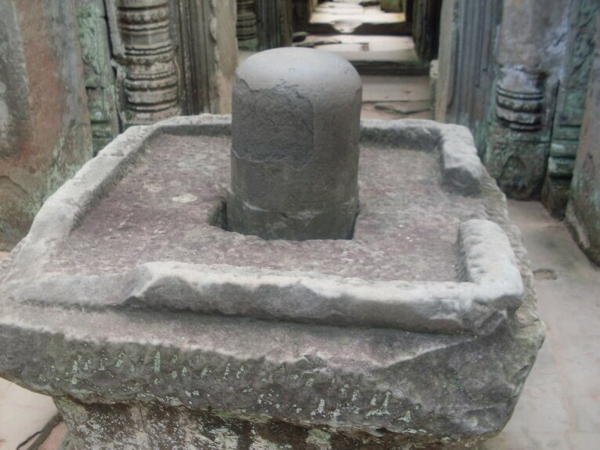](https://vodpop.ru/wp-content/uploads/2014/01/ling.jpg)

Многочисленные лингамы, которые вы встретите во многих храмах Камбоджи, являются символом почитания оплодотворяющей силы  в индуизме.

Хотя на ручье 1000 линг, лингами и йони выглядят несколько иначе. Вода в ручье до сих пор считается священной. И не только благодаря многочисленным лингам. В свое время здесь купался сам король Джаяварман II.

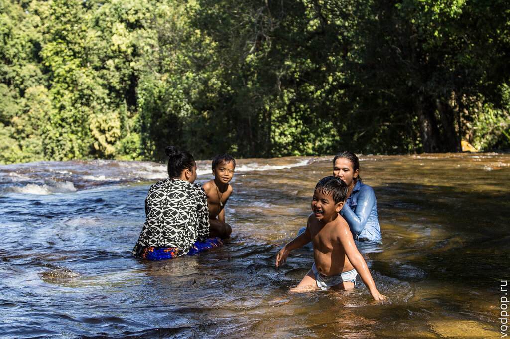

Видимо, ручей так понравился королю, что он приказал отвести русло ручья в сторону, и на его каменистом дне вырезать изображение бога Вишну, лежащего на змее Ананта-шеша, с женой Лакшми подле его ног. На цветке лотоса, выходящего из его пупка, находится изображение Брахмы. Словом, если вы знаток тонкостей индуизма, вам будет здесь невероятно интересно. Если хорошо присмотреться, то под покровом воды заметны лингамы и йони.

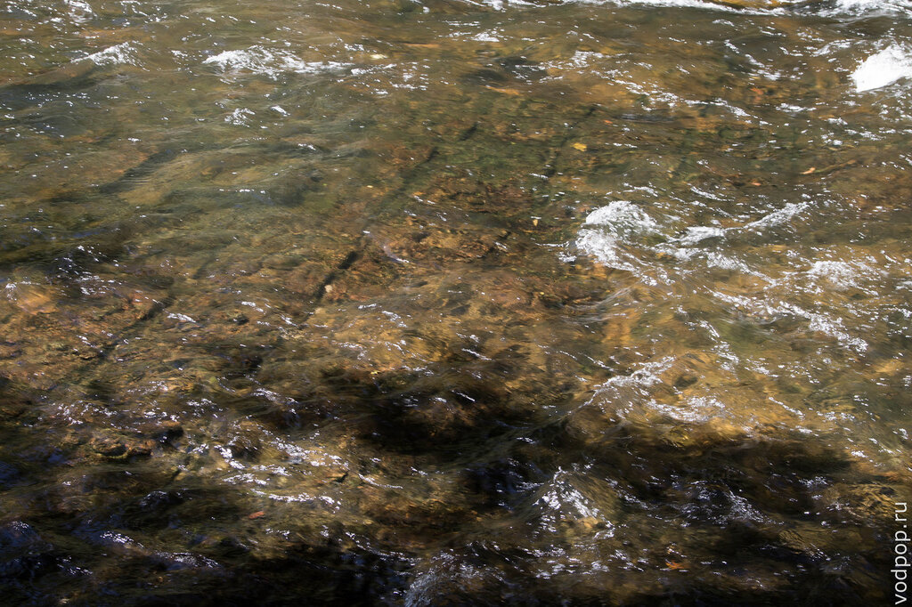

Ручей берет свои истоки из этого очень интересного природного резервуара - в сухой сезон он полностью высыхает, и под ногами образуется что-то вроде зыбучих песков. А после сезона дождей резервуар наполнен, и если кинуть туда какой-то предмет (мы утопили денежку), то постепенно его засасывает внутрь, пока белый песок полностью не скрывает его с наших глаз.

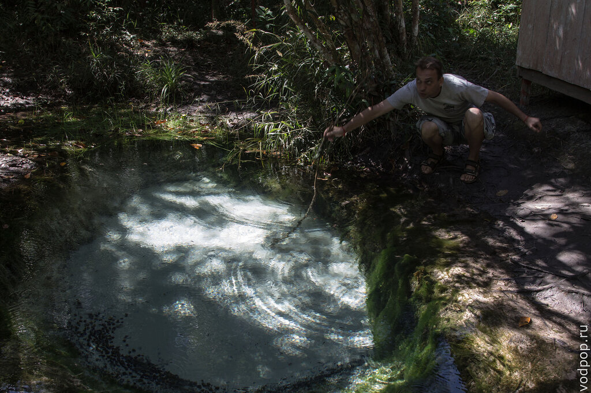

Счастливец тот кхмер, у которого всплывают многочисленные банкноты!

Затем мы направились в сторону храма на скале Пном Кулен. Считается, что перед тем, как зайти в храм, нужно дать немного денег просящим, которые сидят вдоль ступеней. Учитывая, что попрошайки, многочисленные торговцы и прочие неприятные личности и так атаковали нас без конца, я предпочла не поддерживать эту "культуру".

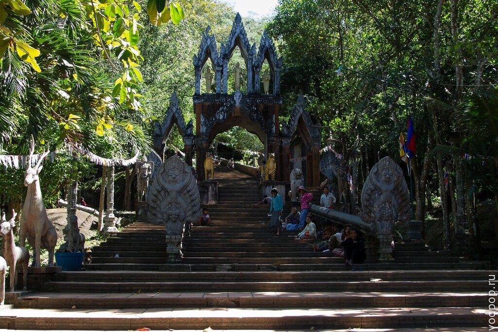

Хотя, надо отдать им должное, здесь они хотя бы не кричали тебе вслед, не приставали а просто молча ждали подаяния

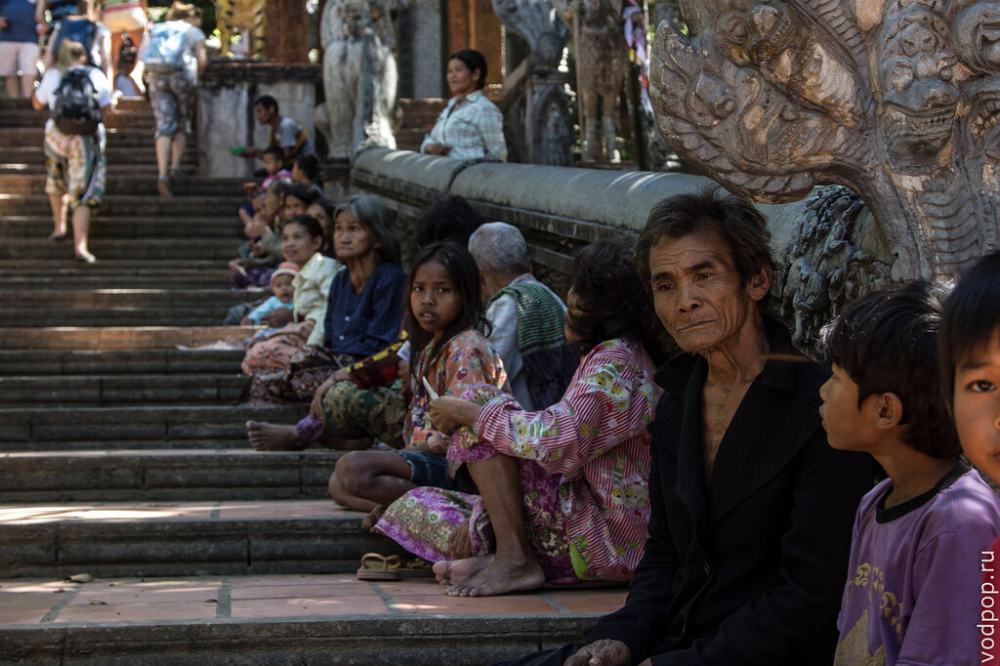

Вдоль прохода стоят многочисленные статуи индуистских богов. Наш гид нам дал простую "формулу": если с диском - значит Вишну. Но формула работает не всегда, поэтому если интересно, то  лучше уточнить у местных.

А еще у Вишну целых 10 аватар (воплощений). Я пыталась прочитать и понять всю взаимосвязь хотя бы на уровне Википедии, но информации так много, что чтобы разобраться, этим нужно по-настоящему увлекаться.

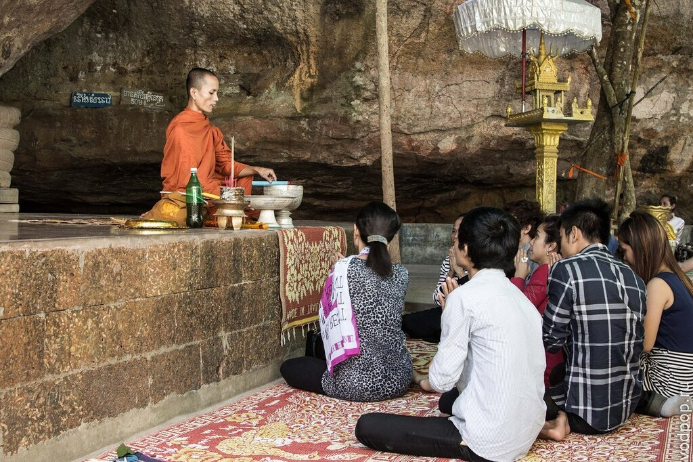

Затем мы пошли в храм лежащего Будды. Вид снаружи

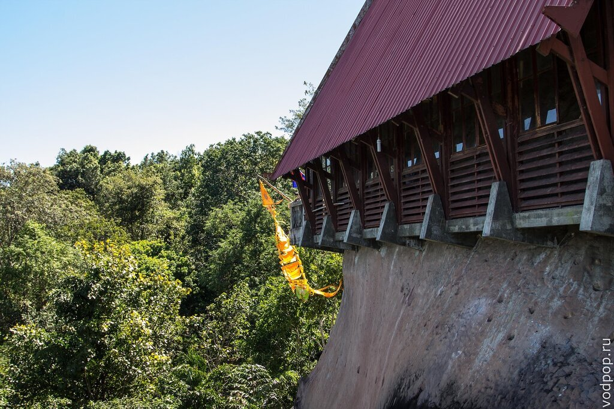

Лежащий Будда настолько большой, что в фотографию целиком влезть не смог.

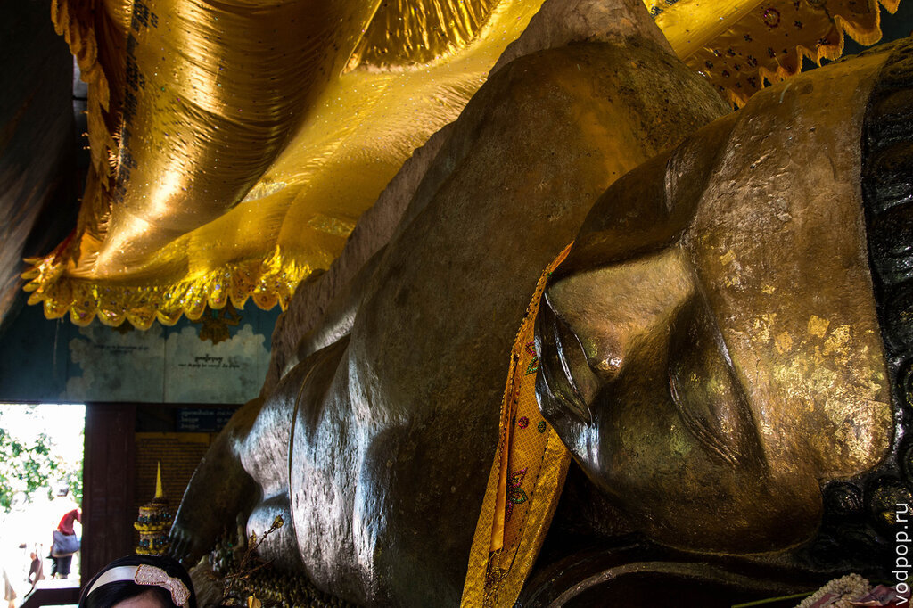

На теле Будды множество надписей на всех языках мира, в том числе и на русском (и на русском матерном тоже). Поэтому висит вот такая красивая табличка. Я бы на их месте еще отдельно на русском повесила, потому что не все наши соотечественники, которым хватает ума рисовать на святыне, знают английский язык.

При выходе из помещения вы скорее всего заметите огромный буддийский флаг.

Его придумали в 1865 году, как символ единства и гармонии. Пять цветов флага символизируют пять цветов ауры, излучаемой Буддой, когда он получил просветление.

Нравится статья? Узнавайте первым о выходе новых интересных историй! Подпишитесь на нас по [эл. почте](http://feedburner.google.com/fb/a/mailverify?uri=vodpop&loc=ru_RU) или в [группе ВКонтакте](http://vk.com/vodpop)

Кстати, оранжевый цвет - это чуть ли не официальный цвет буддизма. По крайней мере, все монахи и большая часть населения носит одежду именно этого цвета.

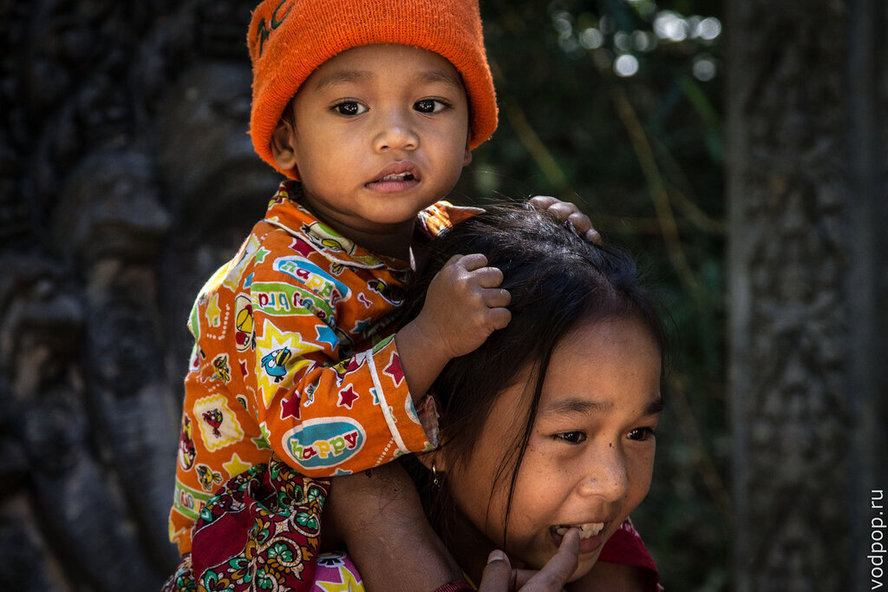

Кстати, Пном Кулен не самое популярное туристическое место, поэтому если вы проголодаетесь около лежащего Будды, то будьте готовы к тому, что еды вы не найдете. Разве что у самого подножия что-то очень специфическое и местное.

После довольно утомительных прогулок под палящим солнцем, было невероятно приятно нырнуть в свежий и прохладный водопад.

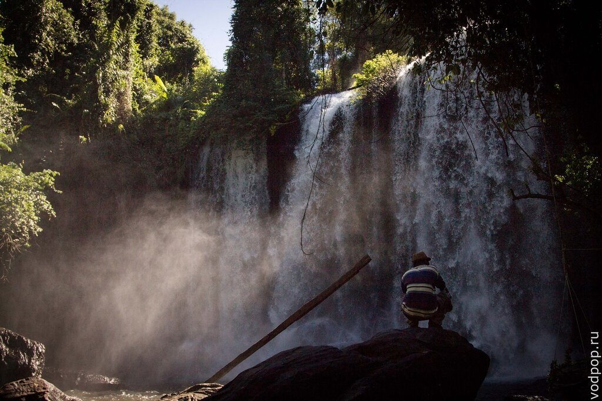

Конечно же, мы ныряли не с вершины, а с камней, которые выступали над небольшим озерцом, образованным потоками вод, падающих с небес. Поймали радугу

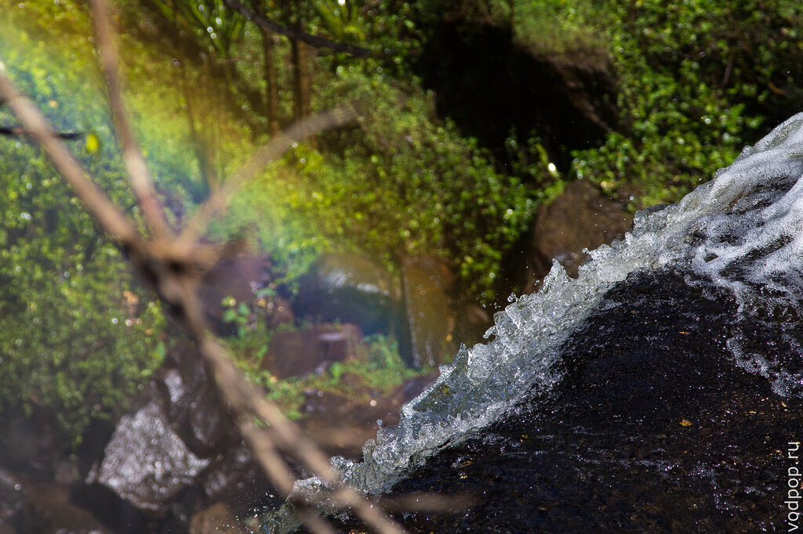

Там было так невероятно здорово, что совершенно не хотелось уходить, но мы накупались вдоволь и даже успели выбиться из сил, сопротивляясь мощному потоку воды. Тем более на этот день у нас была запланирована еще одна остановка.

Минуя опасные ступеньки, ведущие к и от водопада, мы сели в наш мини-автобус, и отправились дальше, в сторону последних двух на тот день храмов - Восточный Мебон и Пре Руп, о которых я расскажу в следующих статьях.

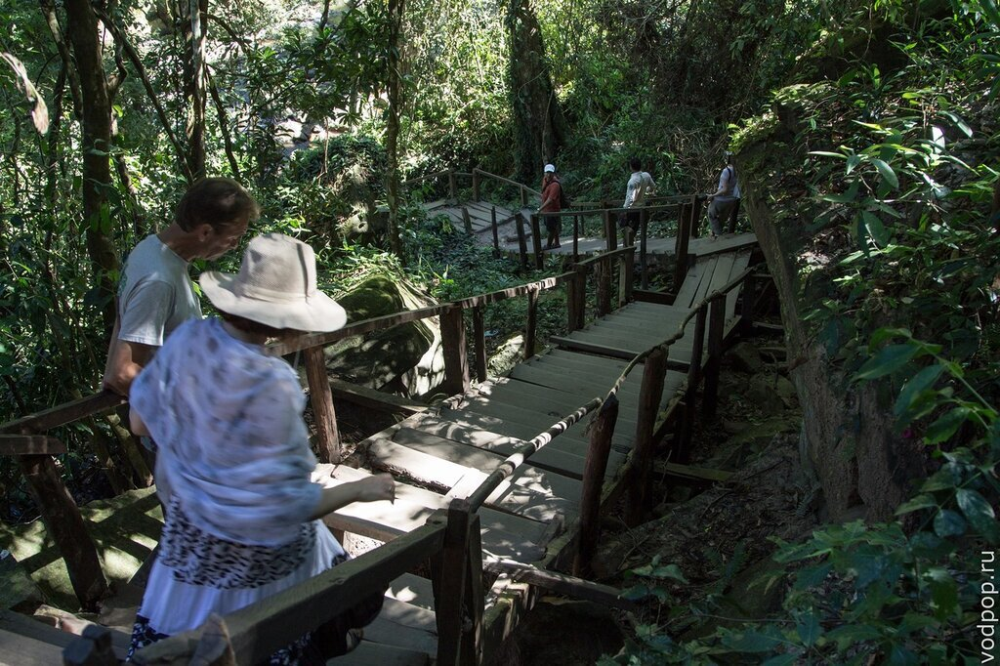
