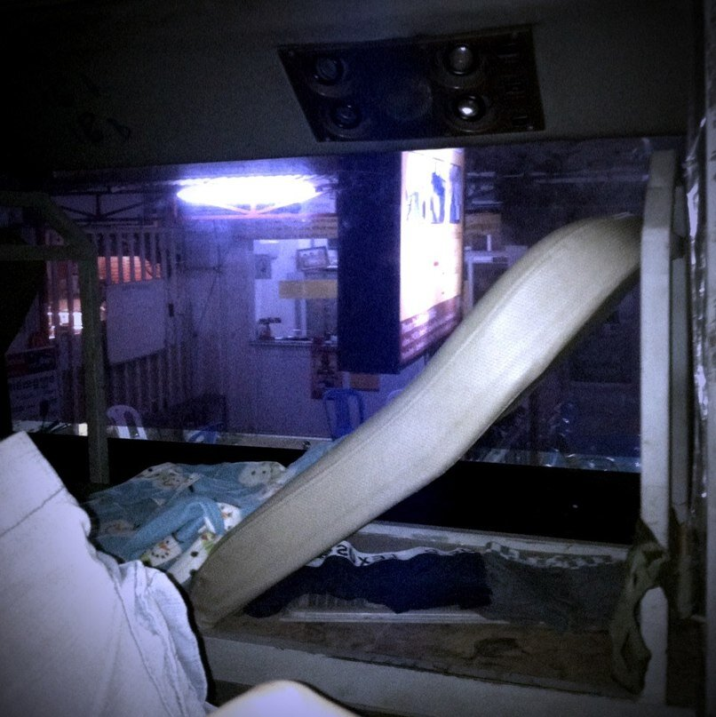
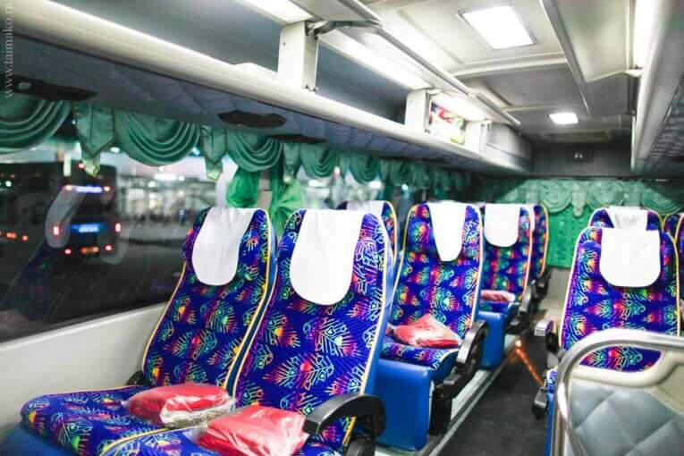
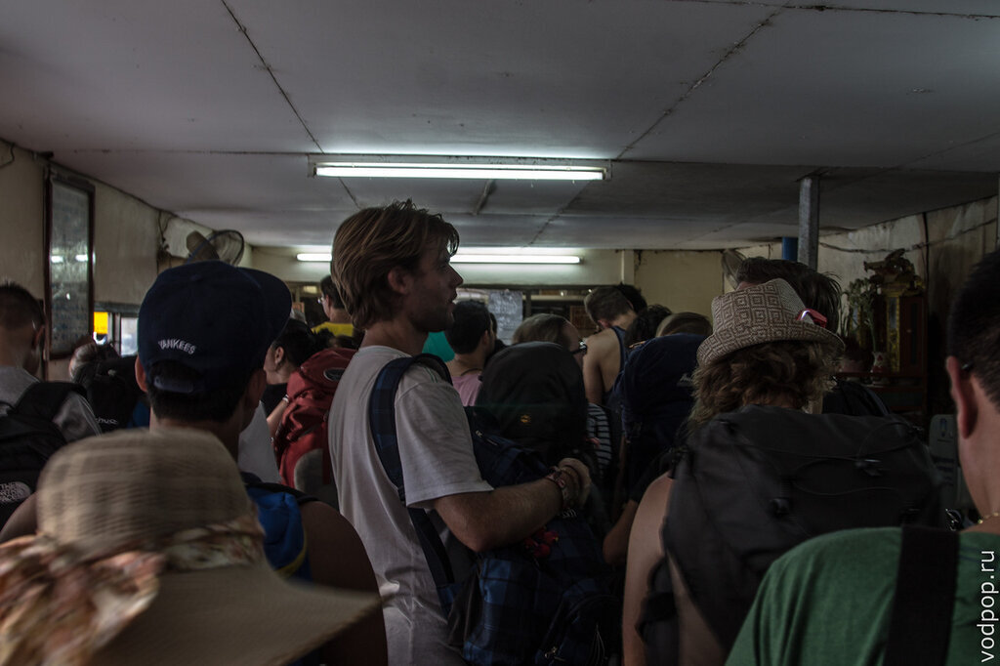
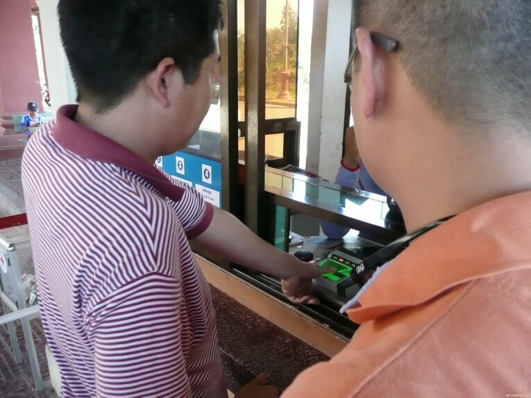

Пожалуй, в тот момент, когда мы вошли в  ночной автобус Пномпень-Бангкок, мы поняли, что нам предстоит веселое путешествие.

<!--more-->

Странные кресла из кожзама, разложенные на 130 градусов, покажутся привлекательны людям до 170 сантиметров. И если я сразу разместилась с относительным комфортом, накрывшись пледиком (и даже не одним), то Климентий долго мучался, пытаясь уснуть в разных позах на разных креслах, пока не нашел сразу два свободных места сзади, и не провалился в сон поперек сидений. Картинка с телефона, только для того, чтобы вы своими глазами увидели степень комфорта автобуса.

Забегая немного вперед, при последующих поездках на ночных автобусах, которые еще называют слипи-бас (sleepy bus) и найт бас (night bus), никаких проблем с комфортом у нас не было. Наверное, потому что качество тайских и малайских автобусов на порядок выше. Тут тебе и чистый(!) пледик, еда, откидывающиеся кресла с местом для ног, а также собственная мультимедийная система (наушники прилагаются бесплатно).

Туалетом в  нашем автобусе Пномпень - Бангкок не пахло во всех смыслах, поэтому несколько раз за ночь водитель останавливался на заправке и в зоне ночного кафе. Мы слишком хотели спать, чтобы хотеть есть, поэтому почти сразу вернулись на свои нагретые, в условиях старательно работающего кондиционера, который пытался воссоздать [температуру Северного полюса](https://vodpop.ru/nordcap-i-lofotenskie-ostrova/ "В Норвегию на машине. Часть 3. Нордкап и Лофотенские острова"), места.

Кстати, билеты мы купили в нашей гостинице, на ресепшн. Цена та же, что и в компании, да еще и трансфер на тук-туке нам обошелся бесплатно - спасибо Hotel Cambodiana.

Расписание в Камбодже - вещь весьма и весьма условная. Мы ждали отправления нашего автобуса Пномпень- Бангкок почти полчаса. Несмотря на это, на границе Пойпет мы были довольно рано. Спасибо нашим соседкам по автобусу, которые работают в Бангкоке танцовщицами и неплохо знают английский, что разбудили нас и показали, куда нам идти - мы остались последние в автобусе, припаркованном в паре километров от границы. С ними мы разделили траты на тук-тук, который довез нас прямо до очереди на пограничном пункте.

Толпа бэкпекеров со всего мира уже выстроилась в два ряда. Большая часть приехала из Сием Рипа, откуда, кстати, ходят весьма комфортабельные автобусы до Бангкока, и что главное - без смены транспортного средства после прохождения границы (как это было у нас).

Нравится статья? Узнавайте первым о выходе новых интересных историй! Подпишитесь на нас по [эл. почте](http://feedburner.google.com/fb/a/mailverify?uri=vodpop&loc=ru_RU) или в [группе ВКонтакте](http://vk.com/vodpop)

После получения штампиков о выезде из Камбоджи, где мы опять прикладывали пальцы (зачем такая суперпроверка въехавших и выехавших иностранцев - нам не понятно)

Потом мы пошли за толпой в другой зал, где уже тайские пограничники ставили 30-дневные штампы о прибытии. Нам лишних вопросов не задавали и пустили без единой бумажки в наш любимый Таиланд.

А затем начался период ожидания №2. Не то кхмерам было мало стоимости билета и они хотели дополнительные "надбавки", не то еще по каким-то причинам, отправление нашего микроавтобуса задерживалось и задерживалось.. То мы ждали, пока весь  автобус пройдет границу (хотя могли просто по наполнению микроавтобуса сразу отправлять людей), то мы ждали водителя, то мы ждали каких-то бумажек.. В общем, прошло почти 2 часа, когда люди, сидевшие в маленькой комнатке, уже пошли войной на менеджеров компании-перевозчика. После этого наш хитропопый менеджер решил все-таки посадить нас в микроавтобус до Бангкока. Затем в игру вступил водитель, который услышал, что кому-то из пассажиров надо до аэропорта Дон Муанг, и предложил "всего за 1000 бат" довезти пару, которая  из-за двухчасовой задержки начала опаздывать на рейс.  В общем, от количества разводов в такой короткий промежуток времени стало просто тошно. Благо, что мы никуда не спешили и не опаздывали, но за свои деньги мы ожидали куда более приятного сервиса. Зато когда мы выехали на дорогу, проблемы закончились как по мановению волшебной палочки - ровные дороги Таиланда позволили доехать до Виктории Монумент в Бангкоке за считанные часы.

## Итог:

если вы не самый отъявленный любитель приключений на свою пятую точку голову, то вам точно не по адресу. Переезд  Пномпень - Бангкок сам по себе довольно тяжелый - на дорогах Камбоджи в стареньком автобусе потрясывает, кондиционер работает люто и беспощадно. Персонал не понимает по-английски ничего, кроме слова "доллар". Лучшим вариантом будет речной круиз Пномпень - Сием Рип, а из последнего комфортным автобусом прямо до Бангкока.

## Полезное:

- возьмите с собой теплую одежду в салон автобуса
- захватите пару бутылок воды и еду
- наушники - абстрагироваться от внешних шумов, ведь с вами могут ехать очень болтливые взрослые или очень неспокойные дети
- постарайтесь ко всему относиться философски

Ну а тем, кто добрался до конца статьи, полезная ссылка [http://www.canbypublications.com/](http://www.canbypublications.com/cambodia/buses.htm) , где можно посмотреть компании, которые возят по маршруту Пномпень - Бангкок, а также их примерное расписание.
