Если вы хотите отправиться в путешествие, но не знаете, как это сделать, то вы пришли по нужному адресу! Мы с Климом посетили 49 стран, и их количество постоянно растет. Начинали мы с путешествий автостопом по России, с рюкзаком и на мотоцикле по Азии, на машине по Европе, а последние два года непрерывно путешествуем на [собственной машине](https://vodpop.ru/kak-kupit-mashinu-v-sha/) по Америкам. Следить за нами можно в [Вконтакте](https://vk.com/vodpop) и в [Facebook](https://www.facebook.com/alexbulygina).

Итак, какие же основные шаги нужно сделать к путешествию вашей мечты? <!--more-->

## **1\. Продумать маршрут**

## 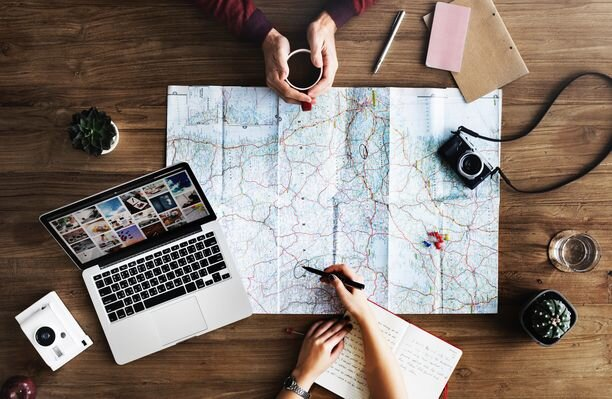

Для того, чтобы определиться с планами, советуем открыть карту мира и представить, какие места вы бы хотели посетить. В помощь вам поисковики, блоггеры, знакомые и просто картинки из интернета.

По своему опыту можем сказать, что лучше начинать с коротких поездок недалеко от дома, постепенно увеличивая количество ночей, проведенных вне родных стен.

Самым легким направлением будет своя собственная страна. Мы, например, начинали с поездок из Москвы в Петербург, по Золотому Кольцу, затем Восточная Европа, Скандинавия — и только потом уехали в наше первое большое путешествие (на семь месяцев по Азии).

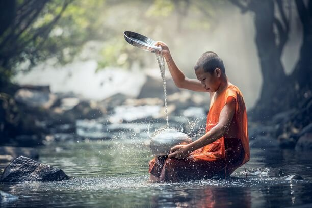

Кстати, Азия — это одно из самых легких для длительных путешествий направлений: ежегодно сюда приезжают миллионы путешественников со всех концов света. Их привлекает дешевизна, наличие инфраструктуры: хостелов, проката мопедов, мотоциклов и машин, вкусная уличная еда, и, конечно, азиатский колорит.

При продумывании маршрута не забудьте уточнить, нужны ли визы в каждую из стран на пути. Иногда это может стать неприятной неожиданностью.

## 2.  Найти источник финансирования

Тут вариантов великое множество и какой из них выбрать — решать вам. Среди самых популярных опций, как финансово подготовиться к поездке:

- Накопить заранее. Подходит тем, кто умеет взять себя в руки, и откладывать каждый месяц на путешествие. Сколько денег понадобится именно вам - вопрос неоднозначный. Мы путешествуем уже два года, и со статистикой вы можете познакомиться [тут](https://vodpop.ru/puteshestvie-po-amerikam-onlayn-statistika/)
- Сдача квартиры в аренду. Классический вариант — сдача помесячно, но все большую популярность приобретает сервис [Airbnb](http://www.airbnb.ru/c/alexandrab4058), где вы можете разместить свою квартиру или даже комнату. Правда, нужно будет найти человека, который будет присматривать за недвижимостью в ваше отсутствие. Для этого существуют специальные агентства, но можно поискать среди знакомых
- Свой бизнес. Мы встречались с путешественниками-владельцами IT-бизнесов, детских садиков, магазина цветов, домашних кондитерских и т.п.
- Поиск работы на месте. Официант, бармен, строитель, повар, администратор отеля/хостела, водитель, фотограф, ювелир - вот скромный перечень профессий, представителей которых мы встречали. Они приезжают в страну, и начинают обходить хостелы, отели и рестораны, предлагая свои услуги. Для этого нужно а) быть немного экстравертом, б) знать язык (об этом будет ниже)
- Удаленная работа (писатель, разработчик, переводчик, логист, инженер-проектировщик и т.д.). Существует две крупных международных площадки, где вы можете найти удаленную работу: [https://www.upwork.com/](https://www.upwork.com/)  и [https://www.toptal.com/](https://www.toptal.com/) (только для дизайнеров и разработчиков). Мы весьма активно пользуемся первой вот уже полтора года, и пока опыт исключительно положительный

- Создание авторских курсов. Если вы хорошо разбираетесь в какой-то теме и дружите с камерой, то курсы могут стать отличным способом заработка. Существует множество площадок, на которых можно разместить свои курсы, и вот некоторые из них: [https://www.udemy.com/](https://www.udemy.com/), [https://www.skillshare.com](https://skl.sh/2zZWuRH), [https://www.coursera.org/](https://www.coursera.org/)
- Волонтерство. Редко бывает оплачиваемым, но вы как минимум ничего не потеряете, а только приобретете уникальный опыт и новых друзей. Популярные сайты для поиска волонтерских программ: [https://vk.com/goodsurfing](https://vk.com/goodsurfing) (проверенная группа, лично знакома с ее основателем — Ильей Поповым), [https://www.workaway.info/](https://www.workaway.info/), [https://www.helpx.net/](https://www.helpx.net/)

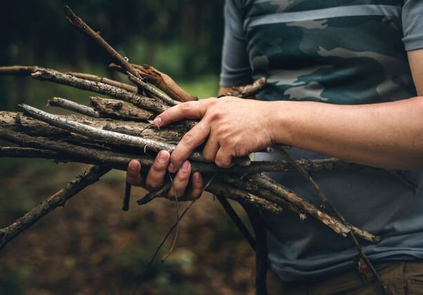

Преимущества этого вида путешествий — вы сможете оказаться в таких местах, о существовании которых вы даже не подозревали

## 3\. Привести личные финансы в порядок

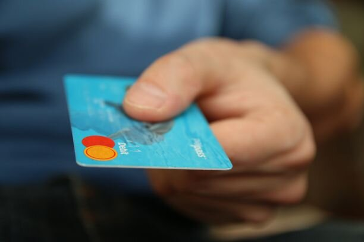

Под этим я подразумеваю продумывание, как именно вы будете получать доступ к деньгам, что будет, если вы, скажем, заболеете, у вас украдут карточку или паспорт.

Многие путешественники до сих пор возят с собой наличные, и в этом случае я рекомендую подготовиться к поездке заранее, и привести все к долларам/евро, в зависимости от направления. Скажем, в Латинской Америке вы вполне можете ездить и платить долларами почти везде, а кое-где доллар является официальной валютой.

Так как [наша поездка](https://vk.com/vodpop) слишком долгосрочная, такое количество налички с собой не увезти, поэтому мы отдаем предпочтение банкоматам.

Вот уже много лет мы обслуживаемся в банке Тинькофф и для путешествий используем [долларовую карту Visa](https://www.tinkoff.ru/sl/KzP9sMOsn1). Для нас преимущества этого банка состоит в том, что все операции можно выполнить онлайн, тех.поддержка работает 24х7 и работает весьма быстро и профессионально.

Полезные советы:

- Стереть CVC код (три последних цифры на обратной стороне карточки), чтобы было не так страшно отдавать карточку, скажем, в кафе или на заправке в незнакомом месте
- Убедиться, что на выбранной вами карте есть функция кэшбэка: возврата процента от потраченной суммы. По нашей — 1% кэшбэка. То есть за каждые потраченные 1000 рублей мы получаем +10 рублей.
- Приучить себя подводить финансовые итоги за месяц. Для этого существует миллион приложений, но мы много лет ведем бюджет в обычном Google Spreadsheet
- Платить везде с одной карточки: так легче подводить финансовые итоги за месяц, плюс кэшбэк
- Сделать запасную карту, а лучше две: одну возьмите с собой, но хорошо ее спрячьте, чтобы в случае потери у вас были средства к существованию, а вторую — оставьте с доверенным лицом в вашей стране проживания. Тогда друг/родственник всегда сможет вам эту карту а) переслать, б) оплатить вам билеты/жилье на то время, пока вы будете восстанавливать оригинальную карту
- Желательно иметь карты разных платежных систем. К примеру, одну Visa, другую MasterCard, так как в зависимости от страны будет выгоднее одна из них

У Тинькоффа есть еще один крутой продукт, карта All Airlines, которая возвращает вам кэшбэк в виде миль для путешествий. Если оформите ее через [эту ссылку](https://www.tinkoff.ru/mgm/form/?short_link=Ev0j4HYatN&httpMethod=GET&masterData=89c1078e48d113f17a723118d457667477ba25d8b88040952cf51f61633788caac36c5ea47a17d37175559534ded41d141b25e3da0a1c07dd47f6b938e1a85934ffa2801405a14686de893167d30b8832ab12245fce034dda703c105a63f66a91444074434836d30b8ca4970df31a7abc21874aa08c7ee11ccc5d7c82d7979749bf14b2038d78f0b68563d2020e13328&utmSource=mgm_mb_ios), то вам в подарок — 3 месяца бесплатного обслуживания. Приятным бонусом идет встроенная страховка на 45 дней. Отличный вариант для путешественников!

Наш личный опыт: у нас с Климом много карт, при этом активно используется только одна, две лежат в России на случай потери/ограбления, одна карточка — для показа в качестве залога в сомнительных местах, еще четыре спрятаны в машине, и еще парочка лежит в России на случай непредвиденных обстоятельств. При этом деньги между ними могут перемещаться онлайн, в течение 2 минут.

## 4\. Заняться здоровьем

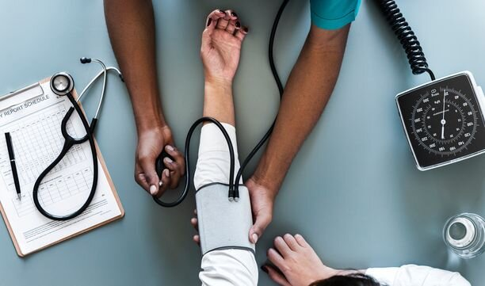

В поездку не стоит ехать больным, как минимум потому, что смена часовых поясов и климата сами по себе являются стрессом для организма, а на фоне болезни могут ощущаться еще хуже. К тому же не везде, куда вы едете, будет доступ к таким же лекарствам, как дома.

Учтите, что Россия — одна из немногих стран, где разрешено покупать антибиотики без рецепта. Если у вас есть хронические заболевания, то не стоит отправляться в поездку во время их острой фазы, лучше переждать, и не забыть перевести названия этого заболевания на наиболее популярные в регионе поездки языки, или, как минимум, на английский.

А еще мы настоятельно рекомендуем отправляться в поездку с зубами в отличном состоянии: лечить их за рубежом чаще всего дороже и намного сложнее. Вам, как минимум, нужно будет найти хорошего врача, а потом объяснить ему на его языке, что у вас болит. Задачка не из легких, тем более что по нашему опыту - стоматологии в России просто отличные!

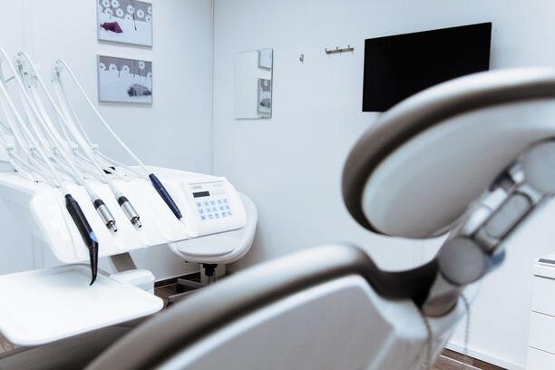

Следующий шаг — это прививки. В зависимости от направления поездки, некоторые прививки могут быть обязательными. Скажем, официально запрещено въезжать в Бразилию без прививки от желтой лихорадки. Прививками нужно заниматься заранее, так как некоторые прививочные схемы растягиваются на несколько месяцев. В принципе, вам их могут поставить по ускоренной схеме, но тогда их придется повторять раньше, чем действовала бы прививка по стандартной схеме.

Если у вас есть проблемы со зрением, то имейте в виду, что в некоторых странах линзы нельзя купить без рецепта, а поход на консультацию к врачу — платный и страховкой, как правило, не покрывается. В целом, если вы давно задумывались об операции по коррекции зрения, то я советую не откладывать это решение в долгий ящик, и сделать ее до поездки.

У меня зрение хорошее, а вот у Клима было по минус четыре на каждом глазу, и в один из приездов в Россию он сделал коррекцию: счастью его не было предела. Теперь все видит чуть ли не лучше меня.

Кстати, если вы путешествуете с питомцем, то не забудьте ему тоже сделать все необходимые медицинские процедуры перед поездкой!

## 5\. Купить страховку

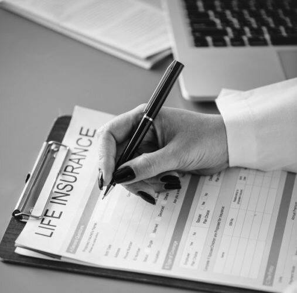

В какую бы страну вы не ехали, не стоит этого делать без страховки, как бы вам не хотелось сэкономить. Покупка страховки - это мой обязательный пункт при подготовке к поездке. Знаю ни один случай из ближайшего окружения, когда люди не хотели платить 3 тысячи за полис, а потом платили по 20-30 тысяч в госпитале, уже из своих денег.

Все наши страховки, купленные за годы путешествий, “отбились” одним посещением госпиталя в США, где за прием мне выставили счет на 2500$. Было бы весьма неприятно платить эту сумму из своего кошелька.

Вот уже много лет мы пользуемся агрегатором [Cherehapa](https://cherehapa.ru/?country=%D0%A1%D0%A8%D0%90&amp;partnerId=25257&amp;marker=z8rbz8s4i), который также позволяет выбрать и купить страховку, если вы уже находитесь в поездке. Кстати, если вы собираетесь в США, то у нас есть [целая статья](https://vodpop.ru/insurance-usa/) про покупку страховки именно на это направление. Впрочем, путешественникам, собирающимся в другие края, тоже будет не лишним почитать.

Есть одна хитрость, когда вы покупаете страховку уже находясь в путешествии. Скажем, если сегодня 1 июля, то самый ранний срок, когда ваша страховка начнет действовать — это 6 июля (+5 дней). Эти пять дней страховые компании берут, чтобы избавить себя от риска мошенничества: скажем, если вы сломаете ногу, то вам в таком случае надо будет ждать 5 дней, чтобы обратиться к врачу по страховой. Поэтому, если вы находитесь в путешествии, покупайте страховку минимум за 5 дней до желаемой даты начала страхования.

## 6\. Привести документы в порядок

Первый шаг к этому — сделать сканы всех имеющихся у вас документов. Это полезно и в обычной жизни, а уж в путешествии — особенно. Вот список документов, сканы которых мы используем постоянно:

- паспорт РФ
- заграничный паспорт
- права на машину

Желательно оставить папку с отсортированными документами у человека, который в случае необходимости готов их оперативно выслать.

## 7\. Сделать доверенность на сим-карту

Вообще, доверенность нужна на любое действие, которое вам может понадобиться, когда вас не будет в стране: скажем, вы планировали поездку на полгода, а потом внезапно решили остаться подольше, и хотите продать свою машину/квартиру/вставьте сюда любой объект, но не хотите возвращаться домой.

В этом случае вы можете заранее оформить доверенность на человека, которому доверяете эту процедуру. Доверенность оформляется у нотариуса, но для сим-карты достаточно просто прийти в офис оператора с паспортом.

В нашем случае это офис Мегафона, куда мы пришли лично с моей мамой, чтобы оформить на нее две доверенности: на меня и на Клима. Каждый из нас предъявил свой паспорт РФ. Один раз пригодилось, когда из в меру изношенного кошелька выпала наша симка и потерялась: телефон заблокировали, а мама получила вместо меня новую симку.

## 8\. Оформить международную сим-карту

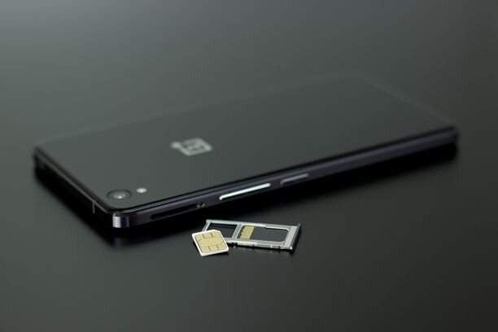

Есть множество опций, среди которых мы выбрали DrimSim. Их симка работает в 197 странах мира, и они могут выслать ее в любую точку мира. После года использования жалеем только о том, что не оформили сразу две симки. Если закажете ее по [этой ссылке](https://drimsim.app.link/1oqoQhKSLO), то и вы, и мы получим бонусом по 5€ на счет.

Обычно мы стараемся покупать симку в первый же день приезда в новую страну, но иногда офисы закрыты, либо мы слишком устали, чтобы туда ехать, или, как в случае с Панамой, это просто не имеет смысла: тариф DrimSim на интернет там был выгоднее, чем у местного оператора.

Особенно полезно для путешественников без машины: возможно, вам придется [вызвать такси](https://www.uber.com/invite/qjcmsc2sue) (по ссылке скидка на вашу первую поездку на Uber), [забронировать отель](http://www.booking.com/?aid=878635) или найти расписание автобусов еще до того, как вы сможете найти ближайший офис мобильного оператора.

## 9\. Заплатить налоги

Если вы еще не создали свою учетку на гос.услугах, то самое время это сделать: так вы сможете получить онлайн доступ ко всем государственным сервисам, в том числе к уплате налогов за оставшиеся на Родине квартиры/машины/бизнес.

Дополнительно для владельцев бизнеса: если вы работаете с русскими клиентами, то вам необходимо оформить электронную подпись в Diadoc и захватить с собой печать.

## 10\. Выучить английский язык

Вы думаете, что уже устали это слышать со всех сторон, и считаете, что все в мире вас поймут, если бы будете говорить громко, четко и по-русски? Так вот, это ложь. Конечно, вы можете проложить свой маршрут исключительно по России и странам СНГ, а за границу ездить исключительно туда, где толпа русскоязычных: ГОА, Паттайя, Нячанг. Но разве так можно познакомиться с другими культурами?

Плохая новость: по нашему личному опыту, мы — одна из самых плохо говорящих по-английски наций в мире. Хорошая новость — это легко поправить. Путешествие — это лучший стимул к изучению английского, и именно поездки заставили нас наконец понять не только важность, но и грамматику английского языка.

В интернете бесконечное количество материала, но я рекомендую вам, если есть деньги, провести их в школе в англоязычной стране. Две недели в школе [IELS Gozo](http://www.ielsgozo.com) на Мальте — это лучшее вложение денежных средств в обучение за все время, пожалуй. Если поедете туда, передайте привет Кэтрин и Брайану — они наши вдохновители!

И обязательно скачайте приложение [https://ru.duolingo.com/](https://ru.duolingo.com/) — оно абсолютно бесплатно, но станет отличным помощником в изучении языка, причем не только английского.

Также учтите, что есть целые регионы, где кроме английского неплохо знать еще один язык.

Например, Латинская Америка, где мы сейчас путешествуем. Если вы выучите испанский хотя бы на базовом уровне (еда, заселение в отель, поиск направления), то ваша жизнь станет значительно легче.

## 11\. Получить права

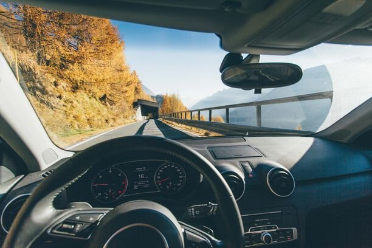

Если у вас вдруг нет этой корочки, а садится за руль вы боитесь, то мы вам все равно рекомендуем ее получить.

Даже если изначально не планируете путешествие на машине или мотоцикле, иметь такую возможность — всегда хорошо, а иногда даже просто необходимо.

Из нашего личного опыта скажу, что бывают ситуации, когда вы — единственный человек, который может помочь кому-то: отвезти человека в госпиталь или в полицейских участок. При этом, если планируете поездку в Азию, то рекомендую сразу открывать две категории: А и В, так как мотоциклы там чуть ли не популярнее машин.

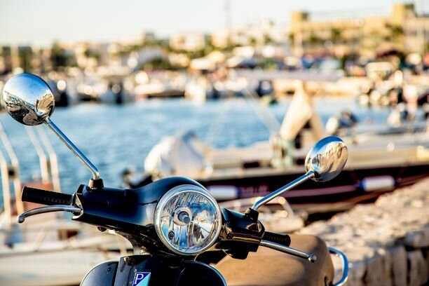

Не стоит забывать, что некоторые страны настаивают на предъявлении международных прав, особенно для аренды автомобиля. Этот момент стоит уточнить для каждой конкретной страны на вашем маршруте.

Полезный лайфхак для Латинской Америки и не только: сделайте красивую копию прав, заламинируйте ее, а оригинал спрячьте в надежное место. Большинство полицейских не имеет понятия, как выглядит оригинал, но среди них, к сожалению, встречаются недобросовестные, которые вполне могут вымогать взятку за то, чтобы отдать вам права. В случае, если вы отдали копию, то можете не переживать, закрыть дверь и уехать в закат на удивление коррумпированных полицейских.

## 12\. Проверить совместимость телефона с частотами в стране назначения

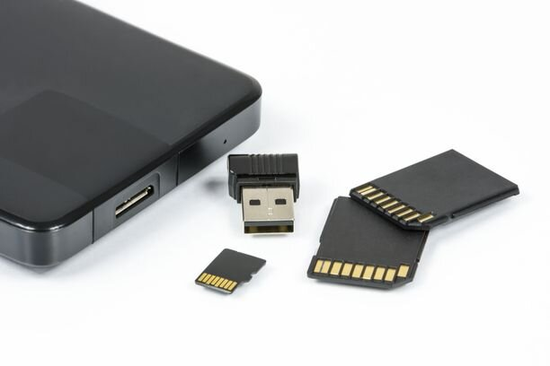

Уверена, для многих станет сюрпризом, что ваш телефон может не работать в некоторых странах. Для проверки совместимости частот существует сайт: [https://willmyphonework.net/](https://willmyphonework.net/), где вы можете выбрать свою модель и посмотреть, будет ли он работать, например, в Зимбабве.

Если у вас сложный маршрут, пересекающий несколько стран, будет не лишним купить второй телефон, чтобы наверняка не остаться без связи. Иногда проще всего это сделать на месте: простенький новый Андроид с поддержкой 3g обойдется вам в 70-100$.

## 13\. Посмотреть, какое напряжение в электросети на вашем маршруте

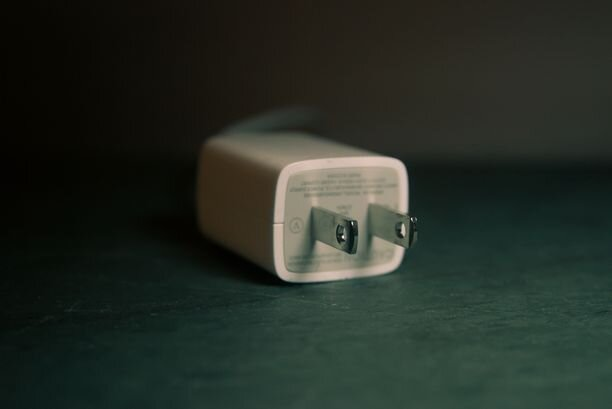

Хорошая новость заключается в том, что большинство персональных гаджетов поддерживает как 110В, так и 220В, однако, не без исключений. Перед поездкой надо обязательно узнать, какое напряжение и какие там розетки. Хороший многофункциональный переходник — это однозначно то, во что стоит вложить деньги. И не забывайте о последствиях: если вы воткнете, например, фен 220В в розетку с 110В, то ничего страшного не произойдет, а вот если наоборот, то вашему фену скорее всего придет конец.

## 14\. Оставьте все лишнее дома

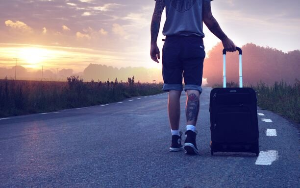

Для этого требуется опыт, и ничего больше.

Одна из наших первых поездок с Климом запомнится мне на всю жизнь в том числе и из-за огромного чемодана на колесиках, куда Клим на 2 недели нашего отпуска положил 4 брюк, 8 рубашек, 5 футболок, бесконечное количество носков и трусов. А я поехала с рюкзаком на 30 литров, взяв с собой минимально необходимое, и долго смеялась, глядя на все это разнообразие одежды.

А дело в том, что мой болезненный опыт пришелся на более ранние годы, когда мы ходили в походы со скаутами: в первый мой пеший поход я набрала всякого ненужного, которое отдавило мне плечи так, что к вечеру я разве что не ревела от усталости.

С тех пор беру с собой необходимый минимум, не больше, если речь идет о путешествии без машины.

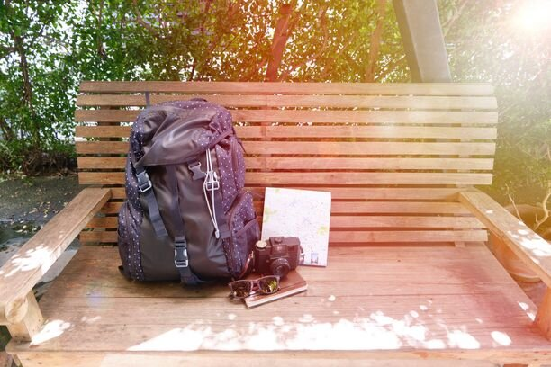

Учтите, что если ваше путешествие пойдет хорошо, то постепенно ваш рюкзак будет пополняться милыми сердцу сувенирами от новообретенных друзей. И сначала фенечки и фотографии не будут занимать много места, но через полгода-год приключений вполне накопятся на отправку домой. Так вот, это дорого. Поэтому приберегите место!

Также, в этом пункте речь идет не только о вещах. Если вы решились на эту поездку, то не стоит в нее брать все то, от чего вы бы хотели избавиться: плохие, негативные эмоции, предрассудки, зависть и злобу.

## 15\. Научиться фотографировать

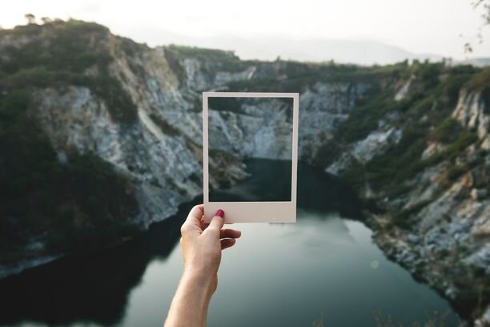

Или, как вариант, который выбрала я — взять в спутники того, кто умеет фотографировать. Мне куда больше нравится писать, а у Клима талант делать красивые снимки.

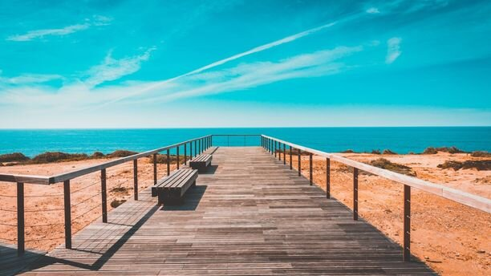

Дело в том, что путешествия — это воспоминания на всю жизнь. Научиться красиво фотографировать — это самое простое, что вы можете сделать для того, чтобы сохранить эти воспоминания в таком виде, чтобы ваши внуки говорили “вааау!”.

Сегодня существует тысячи сайтов и роликов на youtube о том, как фотографировать природу, людей, архитектуру, пейзажи и т.п.. Главное выбрать тот курс, который понравится именно вам, или попросить друга-фотографа (а у кого сейчас нет друзей-фотографов?) о помощи.

## 16\. Придумать, чем заняться

## 

Сидя на работе в офисе все думают о том, что вот “дайте мне месяц, и я сделаю и вот это, и вот то, и съезжу вон туда”, но реальность доказывает, что это не так. Где-то через месяц фантазия заканчивается: книги прочитаны, сериалы просмотрены, места посещены. Что же делать дальше?

А дальше вам нужно придумать что-то, чтобы вам было интересно продолжить!

Длительные поездки — это уже больше жизнь, в которой перемещения становятся частью рутины, и это нормально. Вы не сможете все время восторгаться пейзажами и без конца хвалить что-то, и это тоже нормально.

Через 2 месяца нормальный человек начинает тихонечко сходить с ума, и хочет вернуться к рабочей деятельности. И это надо поощрять! Теперь, когда вы отдохнули и полны сил, самое время вернуться к пункту 1 этой статьи и понять, что вам было бы интересно делать. Может, вы можете учить детишек в джунглях английскому? Или преподавать гитару онлайн? Возможно, вам захотелось написать книгу о своих приключениях, научиться рисовать или разобраться в своем генеалогическом дереве?

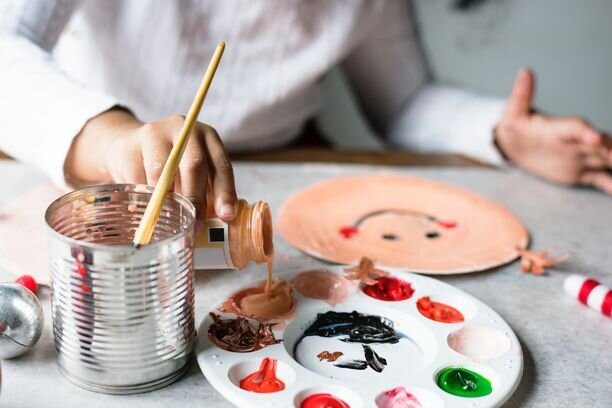

Что бы это ни было, главное — начать это делать. Делитесь своими идеями с другими, получайте обратную связь, занимайтесь самообразованием, читайте книги, до которых никогда не доходили руки, слушайте незнакомую музыку, научитесь готовить незнакомое блюдо или танцевать танец племени мумбо-юмбо. В общем, наслаждайтесь путешествием!
