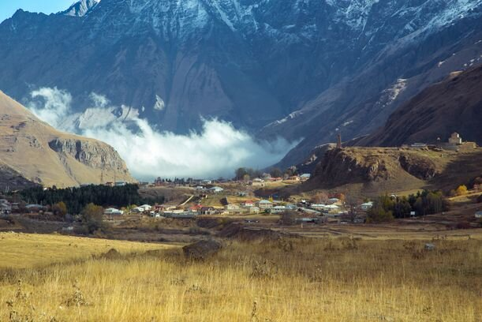
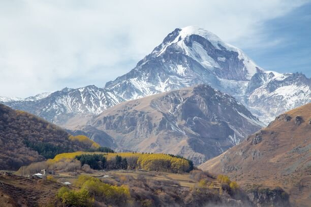
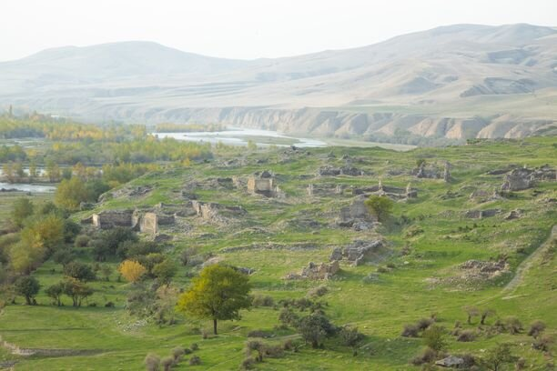
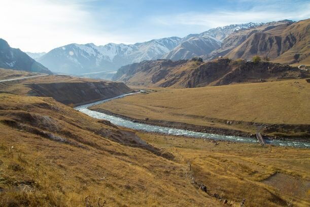
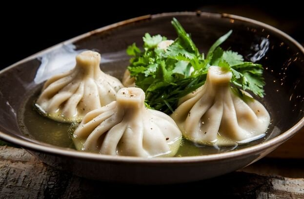

Поездка в Грузию несколько лет назад стала очень популярным способом провести отпуск. Эта гостеприимная страна неустанно и весьма успешно работает над привлечением туристов со всех концов мира. Ниже я приведу ответы на самые популярные вопросы о поездке в Грузию, а также дам несколько практичных советов, как сделать вашу поездку в Грузию незабываемой.

<!--more-->

Итак, вы пока только задумались или точно решили, что хотите провести свой заслуженный отпуск в Грузии.

## Нужна ли виза для поездки в Грузию

Хорошая новость: для граждан РФ, Украины и Белоруссии виза не нужна, при условии, что продолжительность вашей поездки не более 360 дней. А этого времени вполне достаточно, чтобы ознакомиться с самыми красивыми местами Грузии.

## Нужен ли загранпаспорт для поездки в Грузию

Для поездки в Грузию обязательно нужен загранпаспорт, в том числе и для детей (они могут иметь как свой собственный, так и быть вписаны в родильский), в котором не должно быть штампов Южной Осетии и Абхазии.

## сколько стоит отдых в Грузии

Отдых в Грузии можно с уверенностью назвать бюджетным и доступным практически для каждого. Вкусная, сытная и дешевая еда, потрясающее вино, свежие фрукты и овощи, полезные минеральные источники, красивые горные дороги - вот лишь краткий перечень того, что можно увидеть и попробовать в Грузии.

В среднем, если вы останавливаетесь в гостевых домах (15-25$), обедаете в кафешках (5-12$), посещаете достопримечательности, а перемещаетесь на общественном транспорте, то 14-дневный отпуск вам обойдется в 500$ с человека. Если вы планируете [арендовать машину в Грузии](https://www.momondo.ru/prokat-avto/Tbilisi-24544), то прибавьте к этому 14дней\*35$=490$. То есть для двухнедельной поездки в Грузию на двоих вам потребуется около 1500$. Если вы готовите сами, то смело можете сэкономить 200-300$, но приехать в Грузию и не познакомиться с местной кухней - это просто кощунство.

## Нужна ли медицинская страховка в Грузию

Краткий ответ - нет, по закону медицинская страховка для поездки в Грузию не нужна.

Однако, стоит напомнить, что в случае возникновения любой непредвиденной ситуации, все медицинские расходы вы оплачиваете из своего кармана.

Мы, как опытные путешественники с многолетним стажем, не рекомендуем вам выезжать за пределы своей страны без оформленного медицинского страхового полиса. Во-первых, страховки чаще всего не такие уж дорогие, а во-вторых, не по наслышке знаю людей, которые экономили 1000 рублей, а потом платили из своего кошелька 30 тысяч рублей.

Тем более, страховка в Грузию на неделю стоит всего 250 рублей, и может сэкономить кучу нервов, если возникнут проблемы со здоровьем. Особенно это актуально для тех, кто едет в Грузию кататься на горных лыжах. Не забудьте включить эту опцию в вашу страховку!

Больше всего для подбора страховок мне нравится сервис [Cherehapa](https://c24.travelpayouts.com/click?shmarker=25257&promo_id=659&source_type=customlink&type=click&custom_url=https%3A%2F%2Fcherehapa.ru%2F), где можно сравнить стоимость полисов сразу по нескольким компаниям.

## Нужна ли страховка на машину в Грузии

Да! С 1 марта 2018 года наличие страховки является обязательным для любого транспортного средства, въезжающего в Грузию. Страховку удобнее всего купить на [официальном сайте Центра Обязательного Страхования](https://www.tpl.ge/ru).

Грузинская страховка - это не ГринКарта. Грузия не входит в состав стран-участниц соглашения страховки ГринКарта, поэтому любой человек, пытающийся вам продать подобную страховку - мошенник.

Также вы можете купить страховку в одном [из офисов](https://www.tpl.ge/ru/tochkiprodaji). Для въезжающих с территории России ближайший офис находится на КПП Верхний Ларс.

Минимальный срок страхования - 15 дней, и даже если вы проезжаете Грузию транзитом, наличие страховки все равно обязательно: вас может остановить полиция, и в случае отсутствия страхового полиса выпишет штраф, который нужно будет оплатить в банке.

## Как добраться до Грузии

Существует два простых и недорогих способа, как добраться до Грузии:

###### 1. На машине

Весьма популярный способ для тех, что живет неподалеку от границы России и Грузии. Впрочем, путешественники едут на машине даже из Мурманска, Санкт-Петербурга и Москвы, но стоит учесть, что Верхний Ларс - это единственный КПП между Россией и Грузией, и дорога до него займет у вас как минимум 2 дня.

Дорога знаменита как минимум тем, что на посту ГИБДД "доблестные" полицейские очень любят вымогать взятки. Также при построении маршрута обратите внимание, чтобы он не проходил через город Моздок: там стоят вооруженные бандиты в форме полицейских, требующие 1000 рублей за въезд и выезд. Увы, мы об этом не знали, и о наших приключениях по дороге в Грузию можете почитать [тут](https://vk.com/vodpop?w=wall-58779921_5447).

Также стоит учесть, что в холодное время года Военно-Грузинскую дорогу часто закрывают из-за снегопадов, а это единственный способ попасть в Грузию со стороны России.

Я не пытаюсь вас запугать или отговорить от поездки в Грузию на собственной машине. Нам, например, очень понравилось, заодно Калмыкию посмотрели, где до этого не были ни разу. Просто лучше быть в курсе, какие проблемы могут возникнуть на пути.

###### 2\. На самолете

Оптимальный вариант для путешествия, особенно если вам не по вкусу длинные перегоны. Из Москвы, Санкт-Петербурга, Ростова и Краснодара есть [прямые рейсы до Тбилиси](https://www.momondo.ru/aviabilety/tbilisi), но из других городов России вы также можете добраться до Грузии всего с одной пересадкой.

Обратите внимание на нормы провоза багажа, особенно если летите лоукостером "Победа" - иногда это может стать неприятным сюрпризом.

Вы также можете долететь до Владикавказа, а оттуда сесть на одну из многочисленных маршруток до Грузии. Хотя, как мне кажется, добраться до Тбилиси самолетом - это самый легкий способ насладиться поездкой по Грузии без лишних проблем.

## Где жить в Грузии

Знаменитое грузинское гостеприимство не знает границ, поэтому во время поездки по Грузии жить можно практически везде: в хостеле, отеле, гостевом доме, частных апартаментах.

Учтите, что когда едете в сезон отпусков или праздников, то [бронировать отели](https://www.momondo.ru/oteli/) лучшего всего заранее.

Также в Грузии весьма популярен сервис Airbnb, который дарит [скидку 2100 рублей](http://www.airbnb.ru/c/alexandrab4058) при первом бронировании.

## Что обязательно попробовать в Грузии

Я точно не отношу себя к фуд-блогерам, но грузинская кухня не может оставить людей равнодушными. Вот краткий список того, что непременно стоит попробовать во время поездки в Грузии:

1. Хачапури по-аджарски: лодочки из теста с яйцом, сыром и маслом
2. Хинкали с картофелем, сыром и грибами. Поедание хинкали - это целая наука, для которой вам точно не понадобятся нож и вилка: их едят руками, держа за хвостик. Последний, к слову, не едят, а оставляют на тарелке!
3. Харчо - что-то меня зациклило на блюдах на букву Х. В общем, самый вкусный харчо в моей жизни я ела на Военно-Грузинской дороге, недалеко от Гудаури. Обязательно попробуйте!
4. Чурчхела. Орехи в оболочке из виноградного сока - это самое вкусное лакомство, которое только можно представить. Когда выбираете чурчхелу, обратите внимание, чтобы на ней нет белого налета (иначе несвежая)
5. Вино. Тут, как говорится, на вкус и цвет фломастеры разные: кому-то больше по душе сладкие, кому-то сухие вина. Мы с мужем алкоголь практически не употребляем, но во время поездки по Грузии все-таки попробовали Саперави - местное сухое вино, и остались в восторге

Надеюсь, эта информация сделает вашу поездку в Грузию незабываемой!
