Благодаря гостеприимству Марины и Дениса мы задержались в Ставангере на 2 дня, затем поднялись на Прекестулен, возвышающийся над фьордами Норвегии, и познакомились с современной архитектурой в столице.

<!--more-->

 

О начале нашей поездке можно прочитать по ссылкам внизу статьи.

## **День 12. Ставангер**

Ставангер по праву называют красивейшим городом Норвегии. Город располагается на полуострове, на берегу Северного моря, при входе в бухту Бокна-фьорд. Знакомство с городом началось с прогулки вдоль бухты.

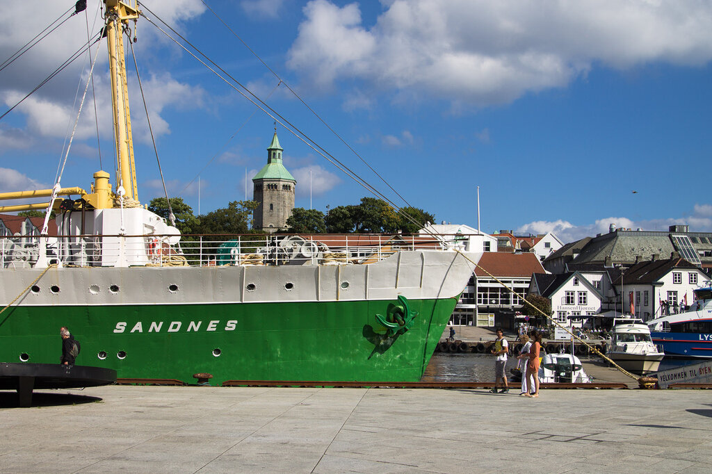

Затем мы свернули в историческую часть города.

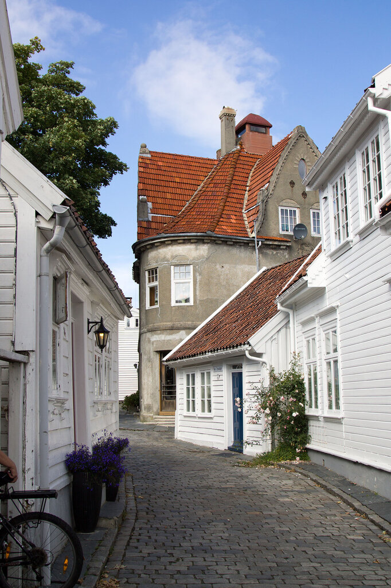

Мощеные улочки, цветы в горшках и тротуары, сделанные с учетом стандартов для маломобильных групп граждан - мамы с колясками и инвалиды-колясочники не чувствуют дискомфорта при передвижении по городу.

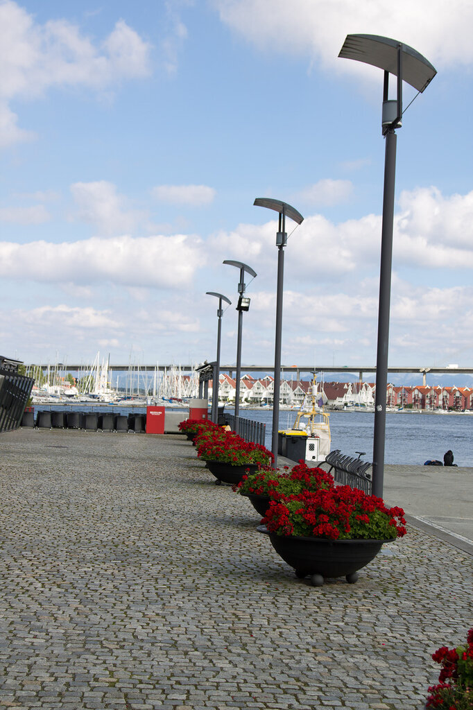

Мы сделали небольшой круг и вновь вернулись к бухте, чтобы поближе рассмотреть судно, похожее на 12-этажный дом.

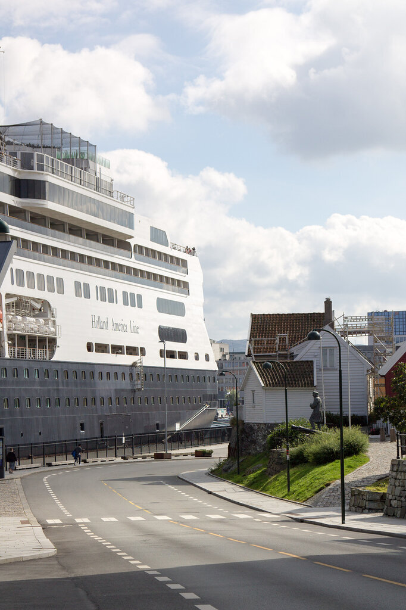

С тех пор, как в 1969 году в окрестностях Ставангера обнаружили нефть, город закрепил за собой звание нефтяной столицы Норвегии. Здесь сосредоточены штаб-квартиры крупнейших нефтедобывающих компаний   - Statoil, ConocoPhillips, Wintershall, Total  и многих других.

Чтобы поближе познакомиться с культурой этого города стоит идти не в краеведческий музей, а, конечно же, в музей нефти - Norwegian Petroleum Museum ([http://www.norskolje.museum.no/](http://www.norskolje.museum.no/)).  Внешне музей похож на нефтедобывающую платформу.

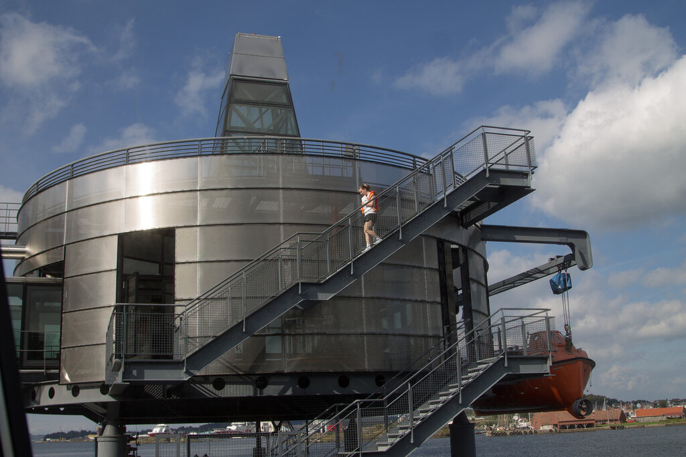

Музей открытый в 1999 году, по праву считается одним из самых лучших музеев нефти в мире. Здесь вы сможете узнать о том, что такое нефть, о ее добыче и использовании. А также понять, какую роль играет нефть в жизни этого города. План - схема музея.

При входе в музей представляются этапы образования нефти, начиная с динозавров. Очень много экспонатов демонстрируют различные этапы развития нефтедобычи. Например, самым первым способом добычи нефти был сбор с поверхности водоемов – его применяли в Сирии еще до нашей эры.

Затем были представлены основные виды буров с подробным описанием, для каких пород (и почему) они предназначены.

Практически весь музей посвящен шельфовой добыче (шельф -выровненная область подводной окраины материка, примыкающая к суше).

Много внимания уделяется месторождению «Экофиск», с которого и началась добыча нефти в Норвегии. Теперь на этом месте целый город из нескольких десятков платформ. Возле каждого такого стенда  подробное описание, когда и по какой технологии все было построено, фото и видеоматериалы.

Единственный (но существенный) недостаток - все на английском языке. Общая суть понятна, но очень много специфических терминов. Стоит взять переводчик (хотя бы на телефоне) или пригласить с собой человека, который в этом разбирается на русском языке. Иногда приходилось поломать голову, прежде чем понять, о чем речь.

В музее очень много чего можно делать самому: померить  костюм нефтедобытчика, попробовать управлять виртуальным бурением скважин, спуститься по спасательному трапу, поучаствовать в викторине на понимание материалов и покривляться на камеру, куда же без этого.

Очень понравилась та часть музея, в которой рассказывалось про влияние нефтедобычи на окружающую среду и развитие альтернативных источников энергии в Норвегии и в мире. Приятно думать, что рано или поздно человек изобретет что-то более совершенное, чем высасывать ресурсы из планеты. На фото: в верхней строке - количество  людей на планете; на нижней строке - количество выбросов углекислого газа CO2.

Вечером того же дня Марина и Денис, со своей маленькой дочкой Евой, показали нам монастырь Utstein Kloster на острове Mosterøy.

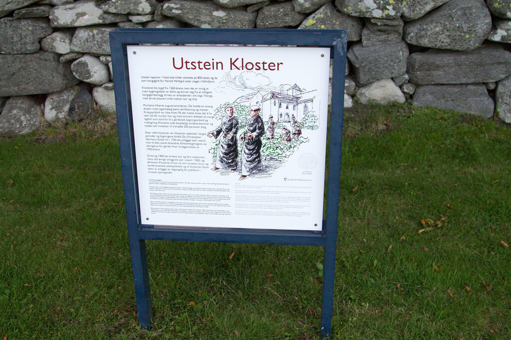

Utstein Kloster  находится в получасе езды от Ставангера и является самым хорошо сохранившимся средневековым монастырем. Точная дата основания неизвестна, но было принято считать 1160 год. По сей день на территории монастыря в восточной и южной части проходят церковные службы. Некоторые из отреставрированных зданий сейчас используются как место проведения концертов, лекций и конференций.

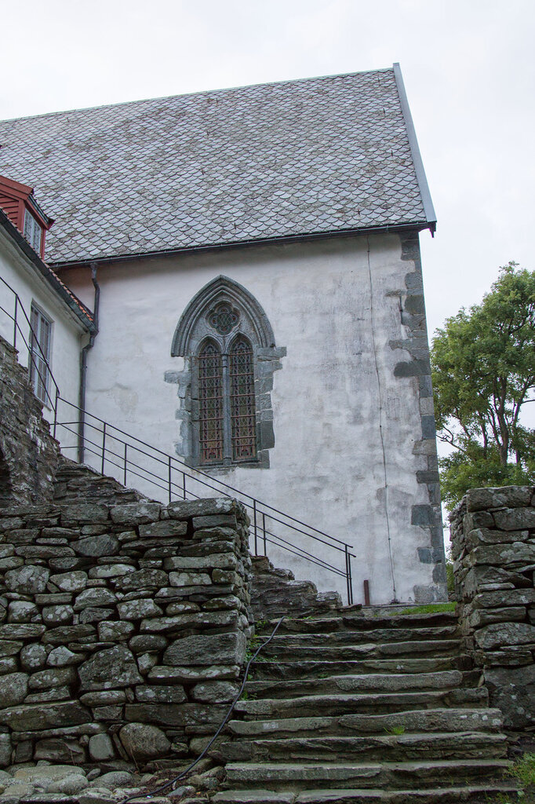 Рядом с монастырем раскинулись пастбища, на которых пасутся овцы. Судя по количеству рыбы и свитеров из натуральной овечьей шерсти в магазинах Норвегии, овец здесь выращивают в основном для шерсти.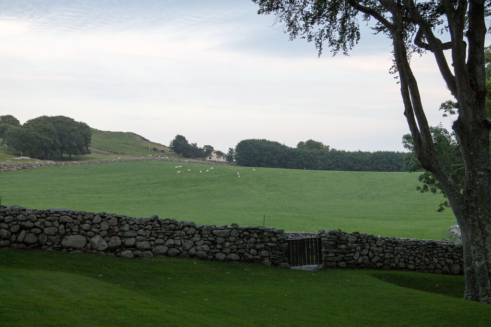

После прогулки вдоль монастыря мы проехали до песчаного пляжа. Стоит заметить, что Ставангер не является популярным туристическим местом для пляжного отдыха, хотя все условия для этого созданы - есть пляжи, кемпинги, множество водных видов спорта - яхтинг, каякинг, рыбалка, серфинг и так далее.

Если вы вдруг окажетесь в Норвегии в теплое время года, и решите искупаться, то в выборе пляжа вам поможет местный ресурс:  [http://www.regionstavanger.com/en/Attractions/Beaches-and-bathing/](http://www.regionstavanger.com/en/Attractions/Beaches-and-bathing/)

Тем временем мы любуемся закатом на берегу моря, заедая вкуснейшими бутербродами с креветками и согреваясь теплым чаем.

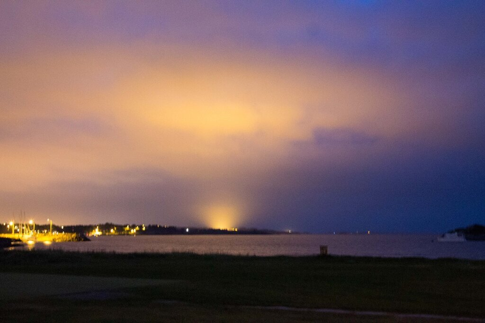

## **День 13. Ставангер - Драммен (Швеция)**

Позволив себе еще одну ночевку в Ставангере мы уже не могли вписаться в наш запланированный машрут. Запланировав подъем на 5 утра, мы, конечно же, проспали. После быстрых утренних сборов мы отправились в сторону Люсе-фьорда, на одной из вершин которого находится самый популярный утес Норвегии  -  Прекестулен (Preikestolen ) и Кьераг(Kjerag) - камень-горошина, застрявший между скал.

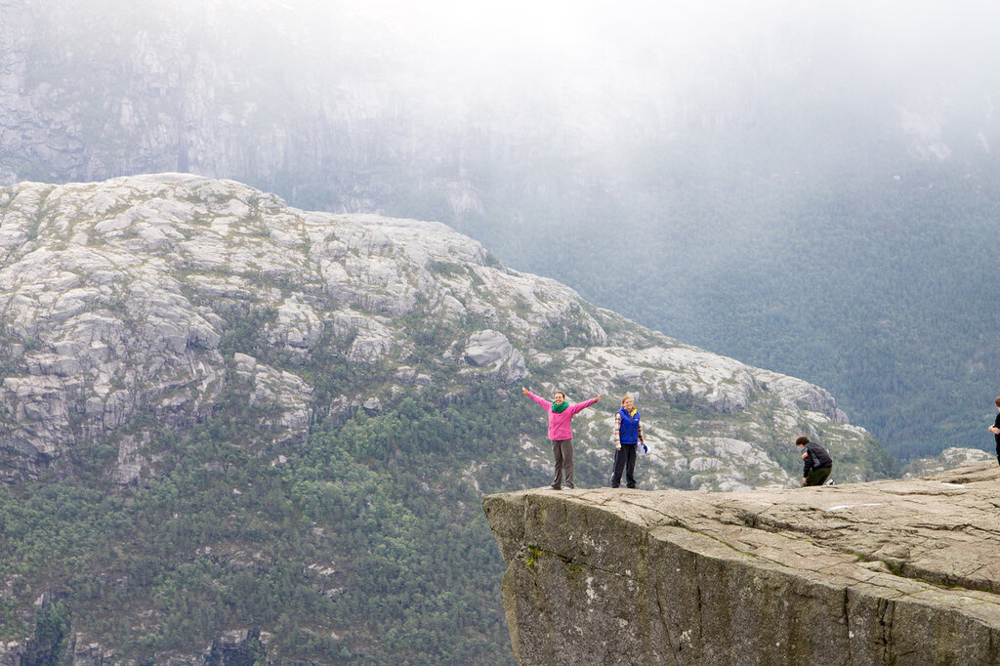

Вообще каждый норвежский фьорд заслуживает как минимум пары-тройки дней, чтобы без спешки погулять, изучить его, поплавать вдоль берегов, сделать фото и забраться на вершину. Поэтому мы очень советуем тем, у кого есть хотя бы неделя отпуска, купить билет до Осло и доехать до Люсе-фьорда, чтобы увидеть эту красоту своими глазами.

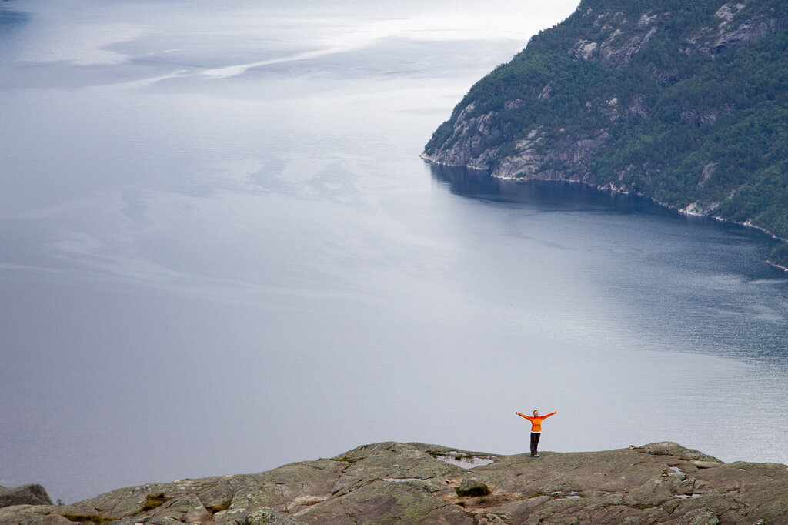

Во-первых стоит заметить, что если вы приехали своим транспортом, то вам придется заплатить 100 NOK за парковку. Вдоль дороги не встать никак, за 3-4 километра каждые 100 метров стоят знаки "Остановка и стоянка запрещены". Да и после четырехчасовой прогулки в горы вам вряд ли захочется еще 4 километра идти до машины.

Начало восхождения.

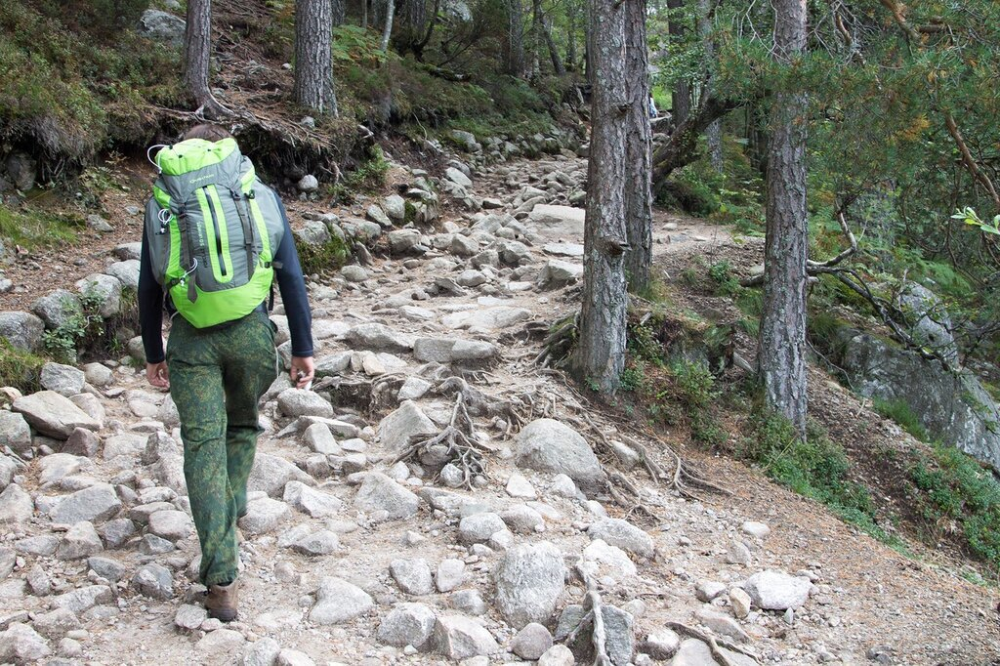

После получаса ходьбы по горам становимся розовенькими.

Первая остановка на отдых через час - жутко хочется пить. Обязательно берите с собой воду!

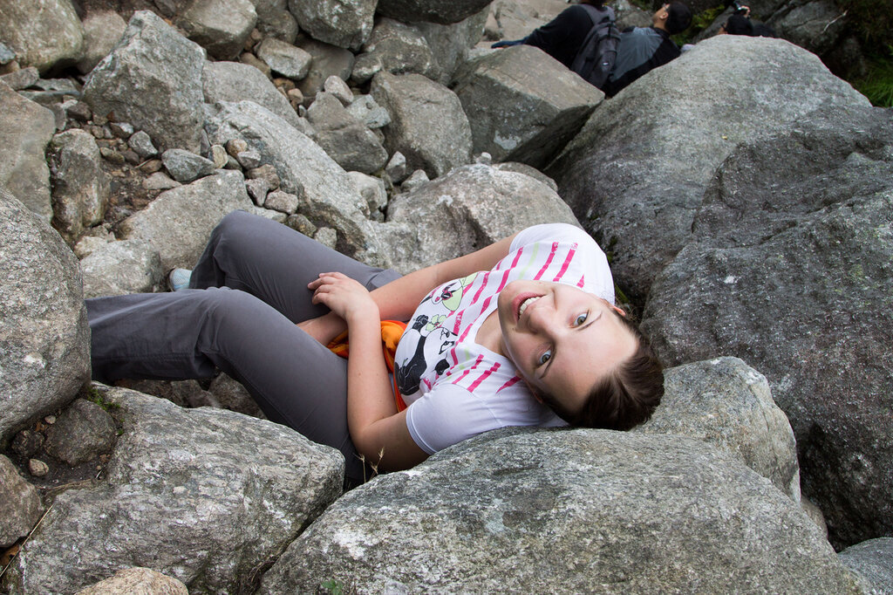

Горное озеро выглядело крайне соблазнительно для купания. Но так как купальников с собой не было, мы не рискнули залезть. Поэтому купальник и полотенце тоже в списке "взять с собой на Прекестулен".

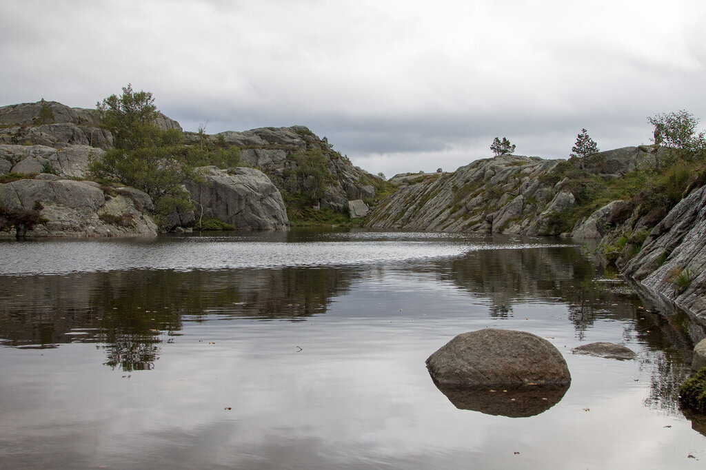

Хотя сезон был низкий и мы приехали довольно рано (к 10 утра), впереди нас уже шли люди, а сзади активно догоняли. Но даже если вы пришли первым и не знаете, куда идти - везде стоят таблички, а на камнях красной краской нарисована буква "Т". Заблудится невозможно.

На указателе можно заметить две стрелки, ведущие на Прекестулен. И это правда - начиная с этого момента вы можете пойти двумя разными путями. Кстати, существуют и другие названия Прекестулена - Кафедра проповедника (Preacher’s Pulpit), Скала-кафедра (Pulpit Rock)

Сначала мы прошли по указателю направо, т.к. вся толпа шла в другую сторону. Социопатам туда. А все остальные могут проследовать по маршруту, которым мы шли обратно. Там могут быть небольшие заторы - далеко не всем легко перескакивать с камня на камень.  Третья вещь, которую стоит не только взять с собой, но и одеть - удобная обувь, с противоскользящей подошвой. Местами вы будете переходить ручьи по камням и ноги будут проскальзывать. Будьте аккуратнее.

Зато когда вы доберетесь до вершины, то все остальное вылетит из головы. Дух завораживает от необыкновенной красоты природы.

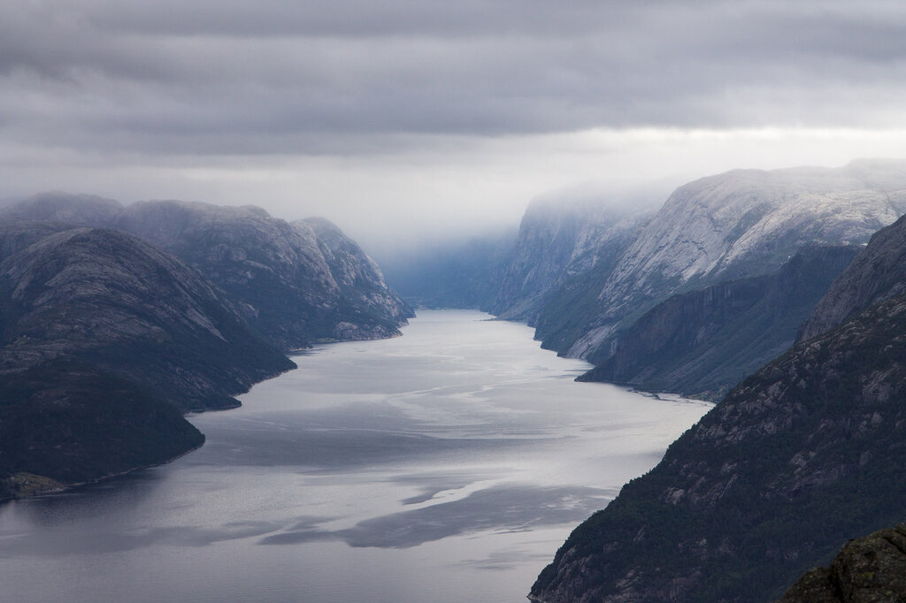

Сначала даже не видишь Прекестулен. Видишь именно фьорд, во всей красе. Ходишь и не можешь поверить, что такое место на Земле и правда существует.

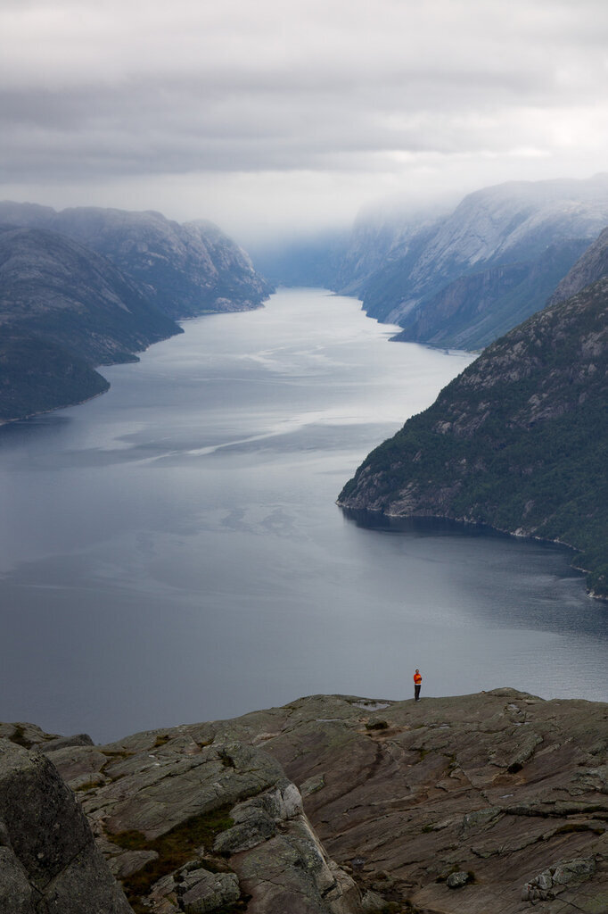

Норвежские фьорды фото.

Если посмотреть вправо можно увидеть обрыв в 600 метров.

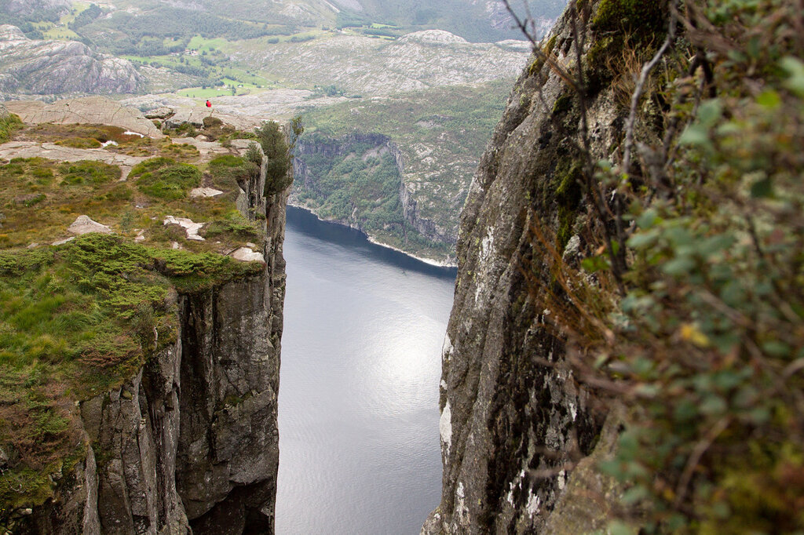

Прекестулен дополняет вид.

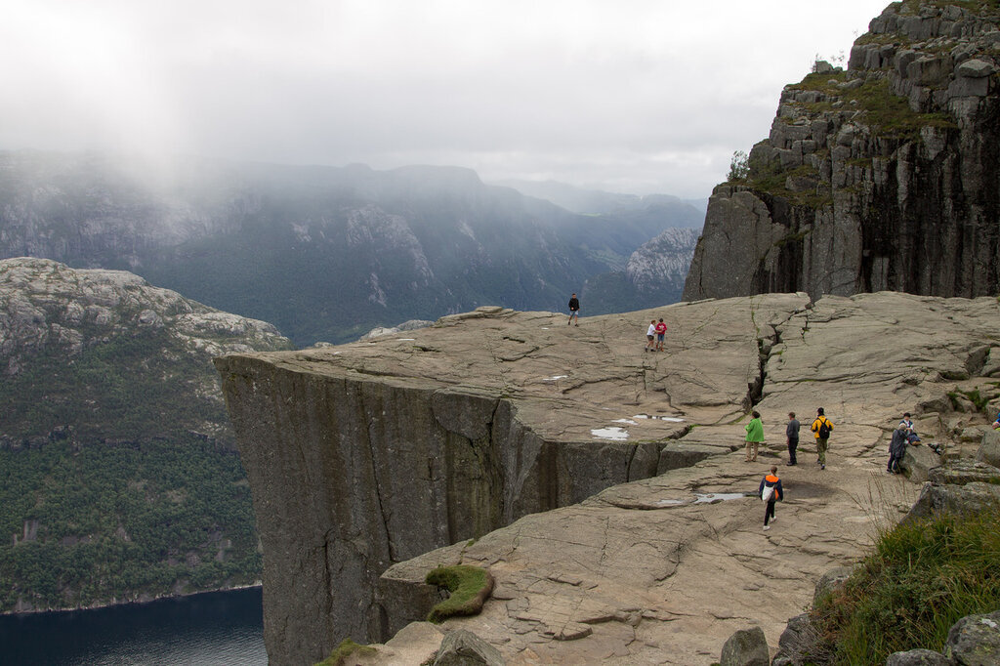

Когда мы пришли, было еще довольно мало туристов. Мы активно фотографировались, не забывая подстраховывать друг друга.

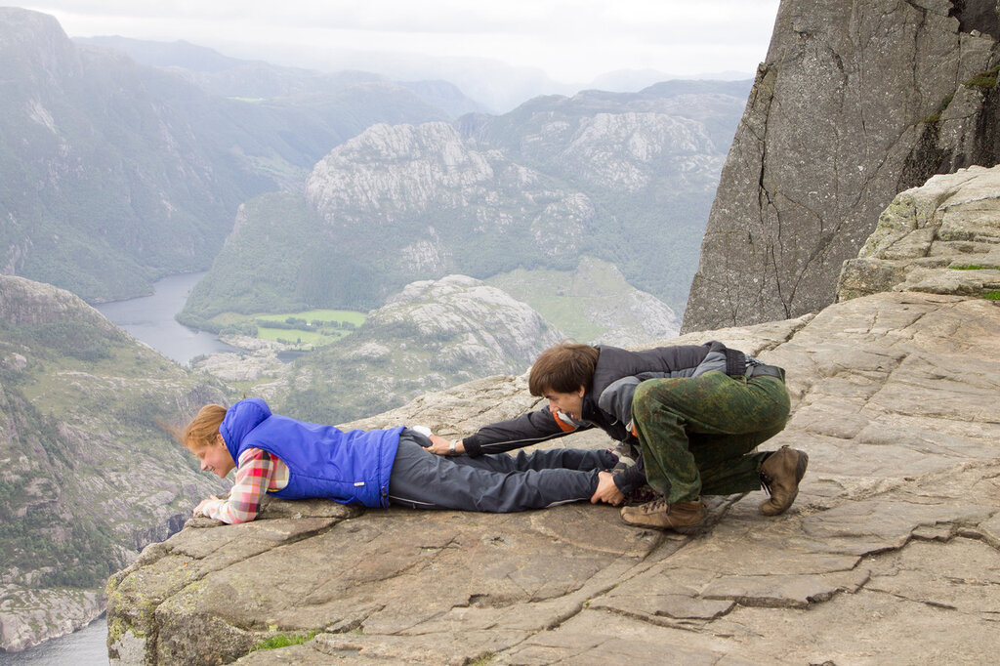

На самом деле на краю не так страшно, как может показаться по фотографиям. После того, как каждый сфотографировался во всех позах, в которых можно устоять на краю утеса, и небольшого обеда из супа и чая, мы решили проявить долю патриотизма и сфотографироваться с российским флагом над норвежским фьордом.

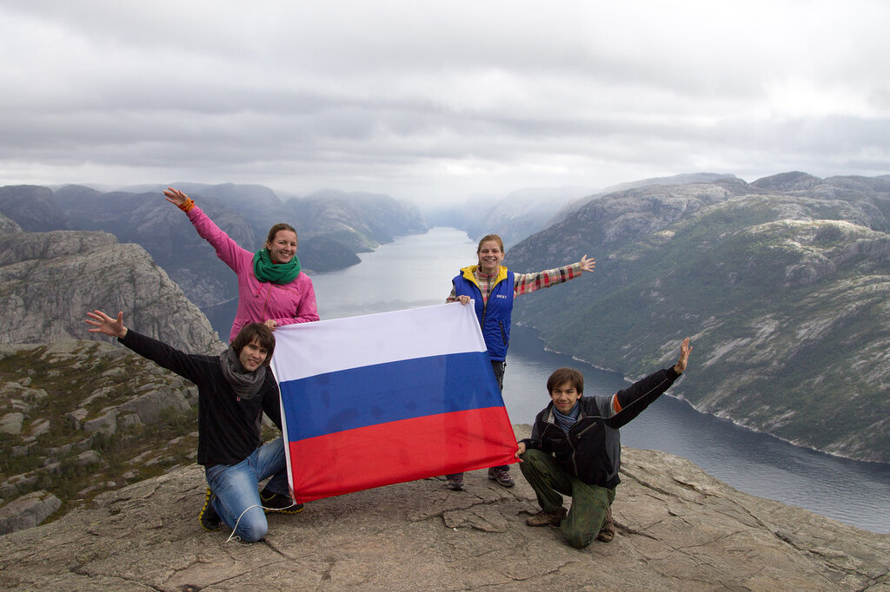

Пока мы фотографировались, начался небольшой дождь и подул холодный ветер. Так что возвращение назад прошло без мыслей о том, чтобы окунуться в озеро.

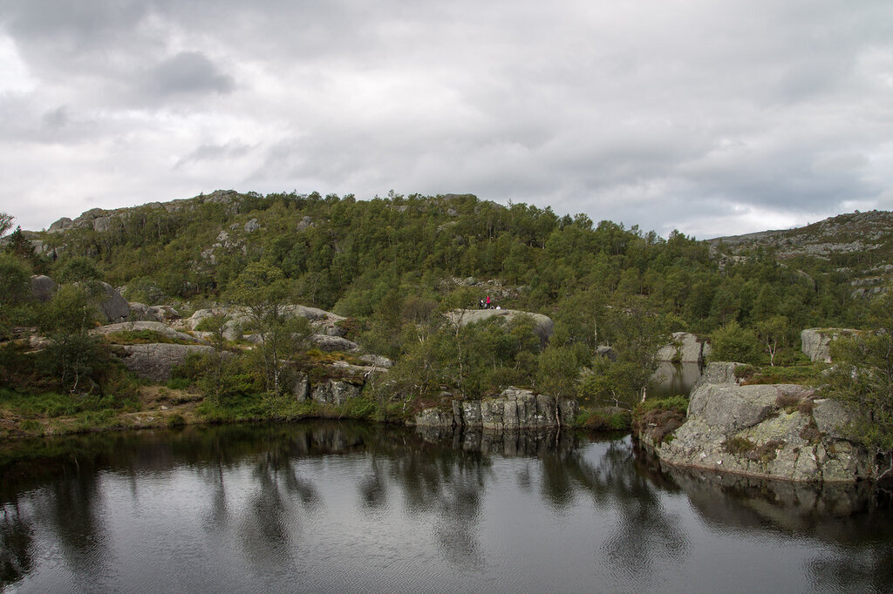

Прогулка в общей сложности занимает 4,5-5 часов, поэтому рассчитывайте свои силы и время. Обязательно возьмите что-то перекусить, чтобы не смотреть с завистью на людей, жующих бутерброды после восхождения.

К 12 ночи мы приехали в пригород Осло - небольшой городок Драммен. При заселении в [Drammen Camping](http://www.drammencamping.no/) мы вспомнили, что значит близость к столице - мужчина лет 50 с неохотой заселял нас, намекая, что они в 23.00 уже не работают. А когда мы подошли узнать пароль от wi-fi он чуть ли не криком отправил нас в домик, чтобы мы не мешали ему спать. Он же не разрешил загнать машину за ворота, пришлось нести вещи через проходную. А утром, когда мы попросили подогнать машину, он отказался это сделать, пока мы не оплатим домик (ночью он отказался принять оплату). В общем, при весьма средней цене за домик (450 NOK), это самый недружелюбный кемпинг из всех, в которых мы останавливались.

В следующей истории мы расскажем о двух столицах Скандинавии - Осло и Стокгольме и о возвращении домой.

Читайте все части нашей истории о Норвегии:

- [В Норвегию на машине. Часть 1. Подготовка к поездке](https://vodpop.ru/v-norvegiju-na-mashine-podgotovka/ "В Норвегию на машине. Часть 1. Подготовка к поездке")
- [В Норвегию на машине. Часть 2. Начало пути](https://vodpop.ru/moskva-norvegija-na-mashine/ "В Норвегию на машине. Часть 2. Начало пути")
- [В Норвегию на машине. Часть 3. Нордкап и Лофотенские острова](https://vodpop.ru/nordcap-i-lofotenskie-ostrova/ "В Норвегию на машине. Часть 3. Нордкап и Лофотенские острова")
- [В Норвегию на машине. Часть 4. Тропа Троллей и Атлантическая дорога](https://vodpop.ru/atlanticheskaja-doroga/ "В Норвегию на машине. Часть 4. Тропа Троллей и Атлантическая дорога")
- [В Норвегию на машине. Часть 5. Ставангер и Прекестулен](https://vodpop.ru/stavanger-prekestulen/ "В Норвегию на машине. Часть 5. Ставангер и Прекестулен")
- [В Норвегию на машине. Часть 6. Осло и Стокгольм](https://vodpop.ru/oslo-stokholm/ "В Норвегию на машине. Часть 6. Осло и Стокгольм")

Возможно, вам также будут интересны статьи о наших других поездках на машине по северным странам:

- [Исландия на машине зимой](https://vodpop.ru/category/evropa/islandiya/)
- [Вся Великобритания на машине](https://vodpop.ru/category/evropa/velikobritaniya/)
