Ни для кого не секрет, что Samui - одно из самых популярных направлений отдыха в Таиланде. Мы решили проверить это на собственном опыте, и после Малайзии (фу-фу-фу) отправились автостопом на  райский остров Самуи.

<!--more-->

Нам невероятно повезло с дорогой в тот день, когда мы прибыли в Хатьяй - южную торговую столицу Таиланда. Буквально за 12 часов мы добрались до паромной переправы, воспользовавшись электричкой и несколькими пикапами, чтобы преодолеть расстояние в 400 км.

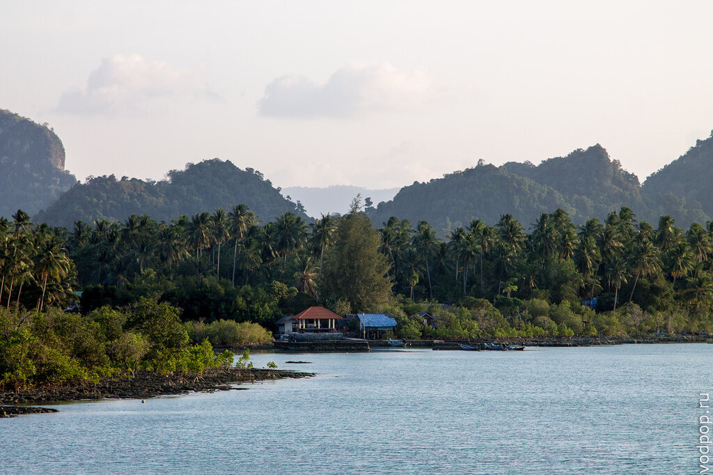

Наш паром был последним, он отправился из городка Донсак в 19.00. Это время - одно из самых лучших, чтобы плыть на остров: все словно сияет в предзакатных лучах.

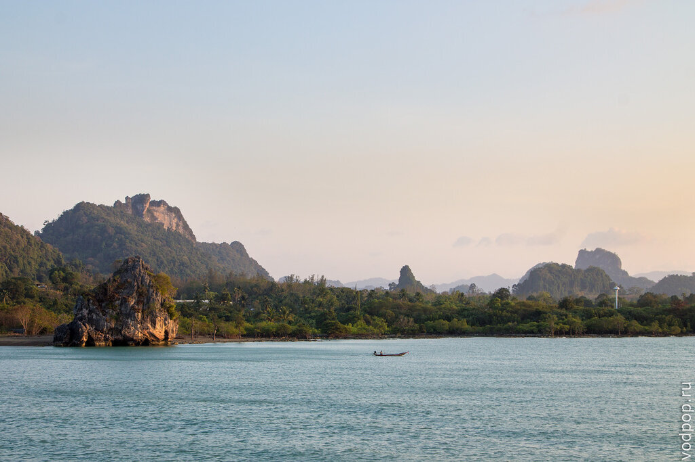

Постепенно становится темнее и темнее. На остров прибываем уже в кромешной тьме.

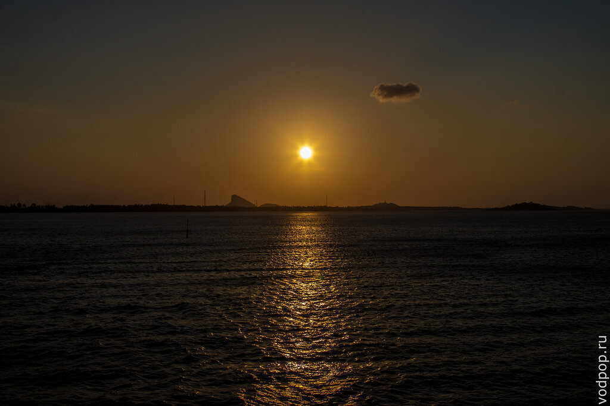

Про прелести заката на море я не буду подробно расписывать - слов не хватит, да и ощущения все равно не передать.

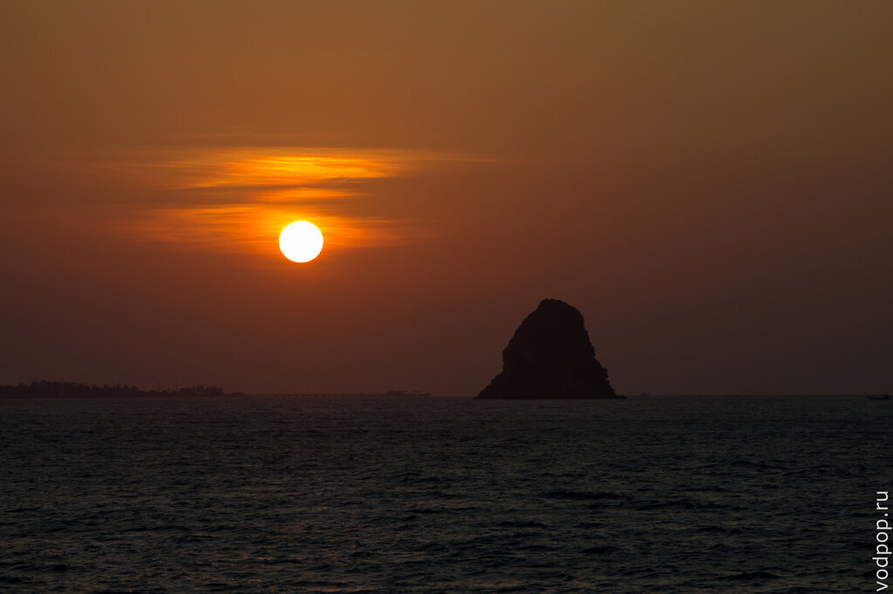

С собой на паром хорошо бы взять бутылку воды (можно купить на пристани, около касс) и ветровку, т.к. после захода солнце становится почти прохладно из-за ветра.

Гостиницу Gand Sea Vew Hotel Samui мы выбрали самым для Азии привычным образом:через agoda.ru. Не могу сказать, что она была сколько-нибудь выдающейся, но главный ее плюс был в том, что она находилась в 10 минутах ходьбы от пирса. Дополнительным бонусом мы получили отличную прокатную контору неподалеку и вкусный ресторанчик прямо за соседней стенкой.

<iframe style="border: 0;" src="https://www.google.com/maps/embed?pb=!1m14!1m8!1m3!1d3934.7535482323774!2d99.93515462698363!3d9.530128323058305!3m2!1i1024!2i768!4f13.1!3m3!1m2!1s0x0%3A0xe16948b085eabf31!2sGrand+Sea+View+Hotel!5e0!3m2!1sru!2sru!4v1410977481991" width="600" height="450" frameborder="0"></iframe>

Кстати, паромы на Самуи приходят сразу в несколько мест, разными компаниями и на разных лодках. Поэтому прежде чем решить, через какой пирс уходить в плавание, внимательно изучите карту острова.

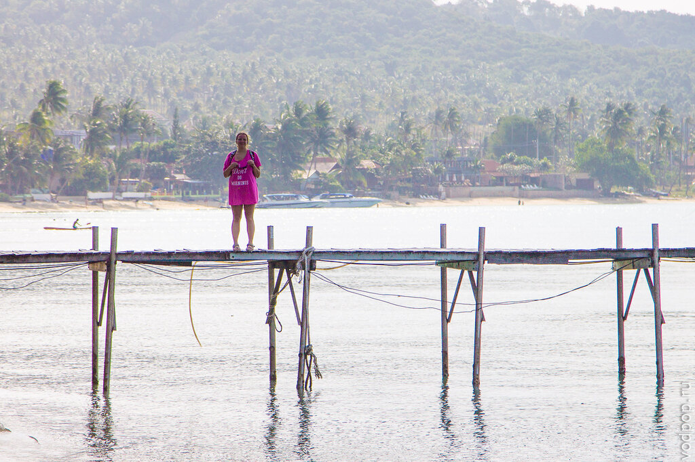

Есть несколько пирсов, откуда забирают туристов для Full Moon Party на Пангане - это небольшой островок к северу от Самуи. Мы как раз были в те даты, когда по всему городу были расклеены афишы и из каждой туристической лавочки нас пытались пригласить на эту вечеринку. Клим (на удивление!) был не против, но у меня было настроение, далекое от тусовочного с тысячей незнакомых людей и литрами алкоголя.

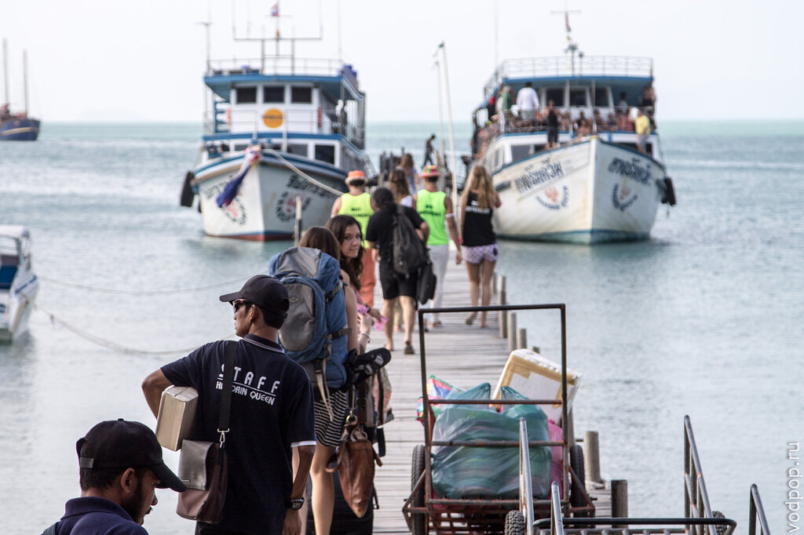

Вместо этого мы хорошенько выспались и посвятили пару дней изучению острова. Кстати, мы совершенно не ограничивали себя по дням пребывания, но с утра третьего дня поняли, что уже объездили весь остров и смотреть, собственно, больше нечего.

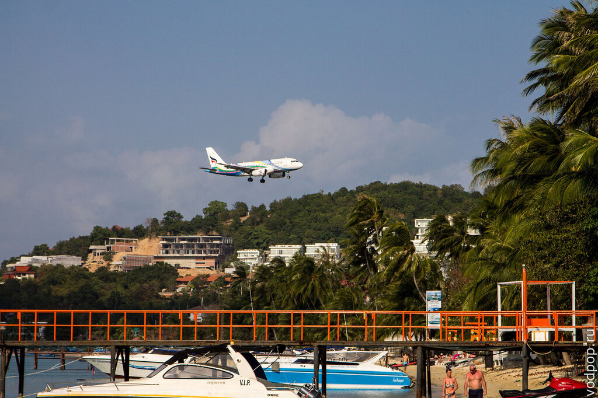

Итак, чтобы прокатиться по острову, нам прежде всего понадобился транспорт. Увы, несмотря на то, что хозяин прокатной конторы оказался очень приветливым европейцем (и пожаловался нам на русских, бьющих и угоняющих его байки, но-таки дал нам без паспорта байк!), весь приличный транспорт у него разобрали. Пришлось выбирать из малого - мы остановились на малюсеньком Honda MSX 125

Его размеры изначально не вызывали доверия для поездки сразу двух людей, но хозяин говорил, что ехать на нем будет вполне комфортно. Впрочем, он не обманул - на этом, позвольте ехидно усмехнуться, мотоцикле, действительно можно ехать вдвоем. Только если вы подростки или ростом до 165. Если больше, то деть куда-то свои руки, ноги и колени будет некуда. Со стороны смотреть на Клима без смеха было сложно

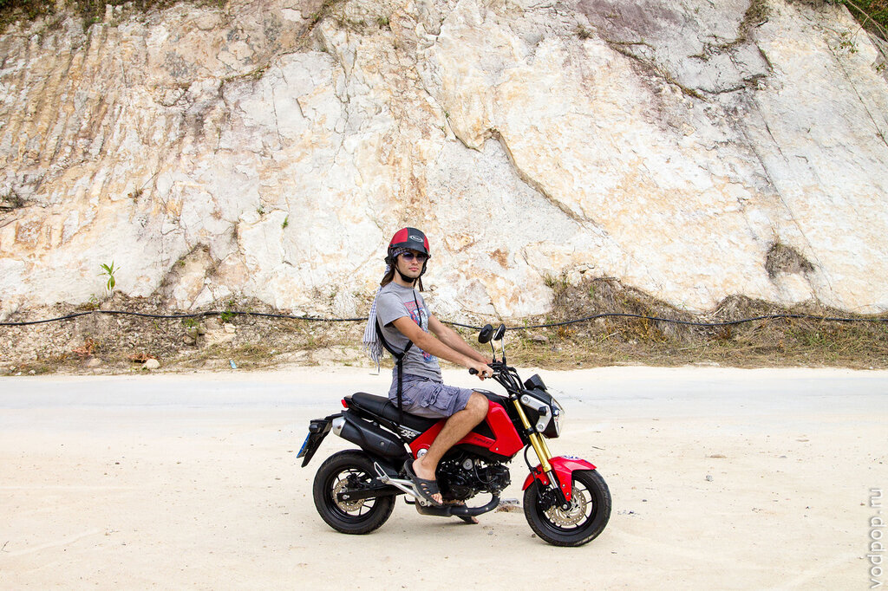

А еще у этого великолепного агрегата ооочень жесткое сидение, и даже после сравнительного недолго путешествия по острову пятая точка усиленно давала о себе знать.

Пожалуй, хватит про байк - надеюсь, мини-отчета вполне хватит, чтобы обходить данную модель в прокатных конторах за километр и не поддаваться на уговоры.

Впрочем, это мелочи - комфорт далеко не всегда имеет значение. И это Honda была явно удобнее вот этих бутс:

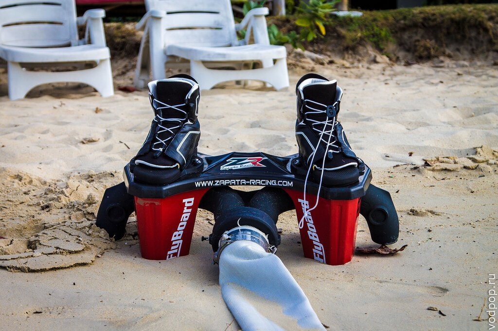

, которые, если вы когда-нибудь видели FlyBoard в действии, доставляют своему наезднику куда больше дискомфорта. Мы на себе пока не пробовали - нас остановила цена в 3000 бат, но судя по попыткам людей удержаться на высоте в 2-3 метра, дается это ой как нелегко.

Впрочем, на острове есть куда более менее дорогостоящие, но не менее зрелищные развлечения. Например, можете присоединиться к тайской команде по футболу с соксом. Возможно, этот спорт имеет какое-то другое название, но со стороны это выглядит именно так: команды стоят по разные стороны сетки и перебрасывают сокс через нее, отбивая любой частью тела.

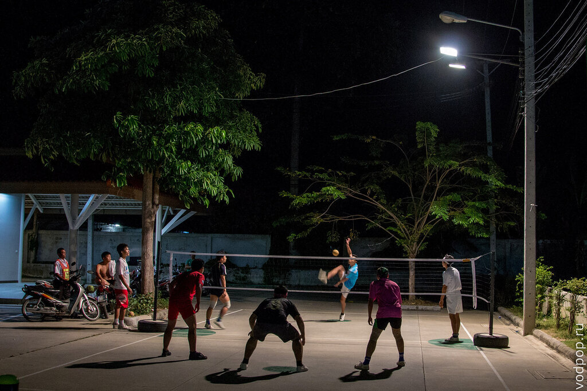

Обычно тайцы феерично задирают ноги и происходит это на таких скоростях, на которых обычно китайцы играют в пинг-понг. Поискать такие площадки можно рядом с магазином Теско.

Полагаю, фанаты Самуи будут кидаться в меня тухлыми помидорами, но море мне там не так понравилось, как на Пхукете, например. Вообще пляжный отдых там несколько переоценен. Остров живет исключительно туризмом и есть очень мало мест, где можно ощутить настоящий дух Таиланда. Возможно, большинству людей этого и не нужно, но если бы из Таиланда я бы видела только Самуи, я бы совершенно не так прониклась этой страной.

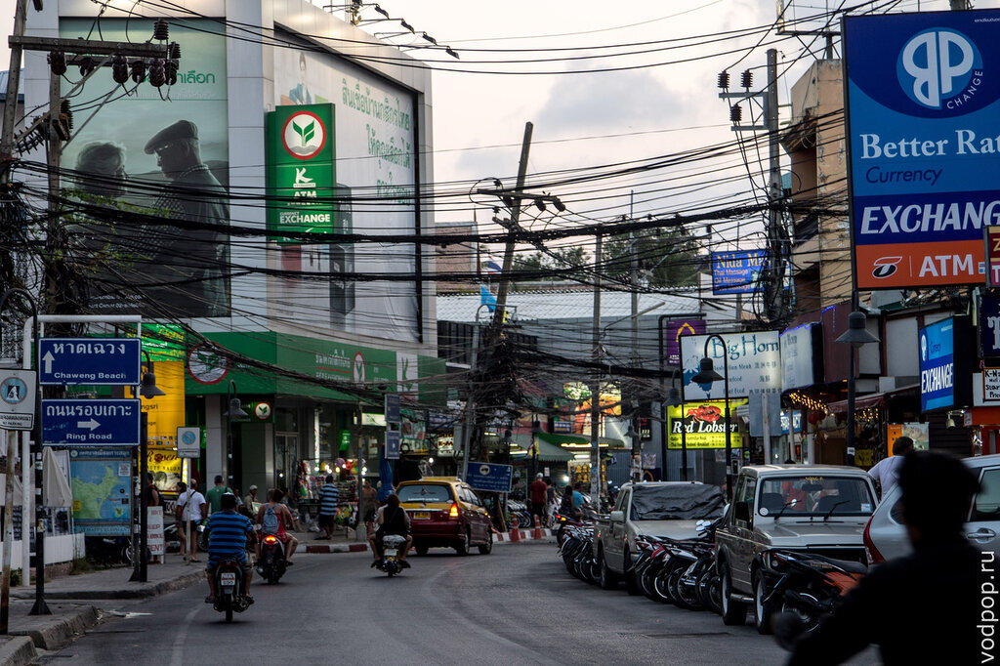

Что интересно, ни одна часть Таиланда не обходится без своего Биг Будды. Например, [на Пхукете](https://vodpop.ru/bolshoy-budda-na-phukete/ "Большой Будда на Пхукете. Покатушки на слонах и прекрасный вид на город") мы жили у подножия горы, на которой стоял свой Большой Будда - там во время страшного цунами в 2004 спаслось несколько тысяч человек.

Самуи не стал исключением. Золотой Будда, возвышающийся на ступенях, где мирно спят кошки и ходят туристы в шортах, старательно избегая взгляда любого, кто захочет сделать им замечание: в Таиланде почтительно относятся к Будде и Королю, и при "встрече" и с тем, и с другим, нужно соблюдать дресс-код.

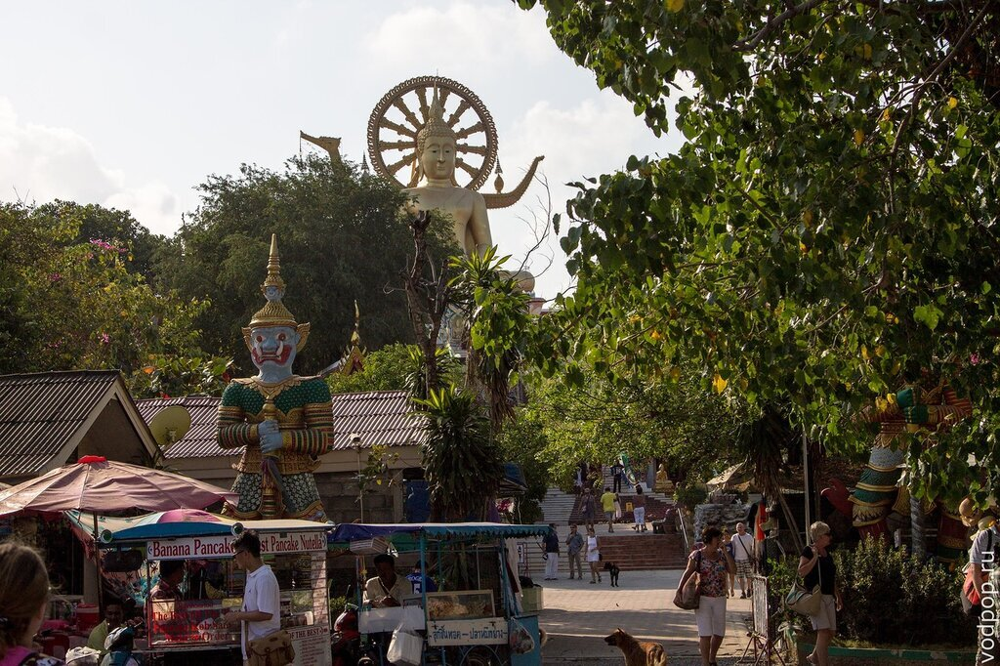

Я совершенно не такой фанат кошек, как большинство на просторах интернета, но именно этот мирно посапывающий кот с высунутым языком у подножия Будды вызвал море умиления. Надо сказать, что не у меня одной - судя по многочисленным щелчкам фотоаппаратов и телефонов, он попал в отпускные фотографии всех проходящих мимо.

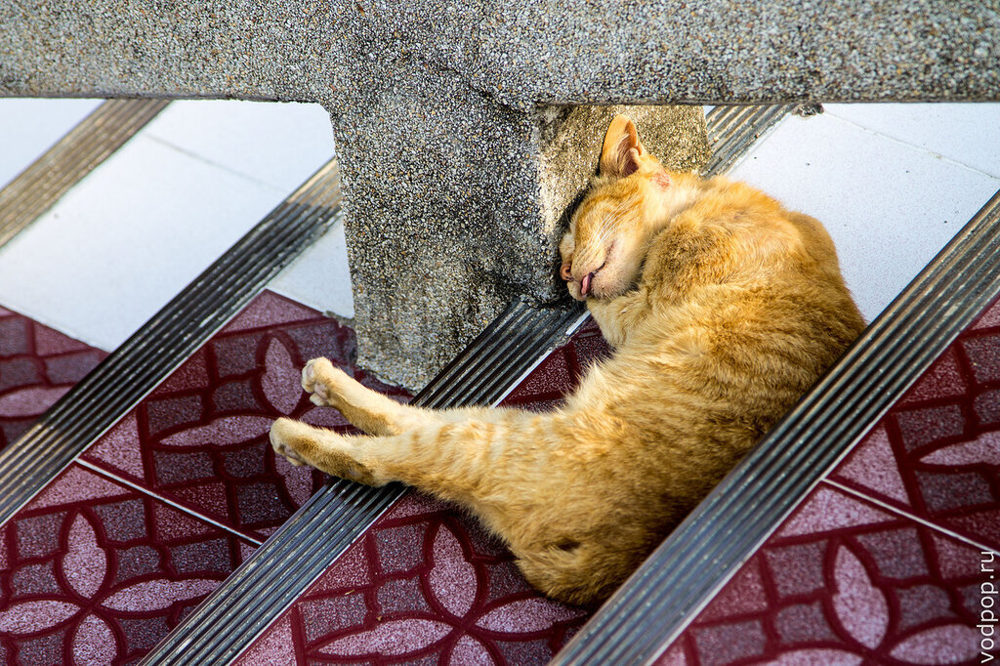

Для любителей современных культов это место будет интересно тем, что здесь базируется магазинчик тайского художника, который из металлолома собирает различные "скульптуры". Например, у него есть серия героев из популярного американского фильма "Трансформеры".

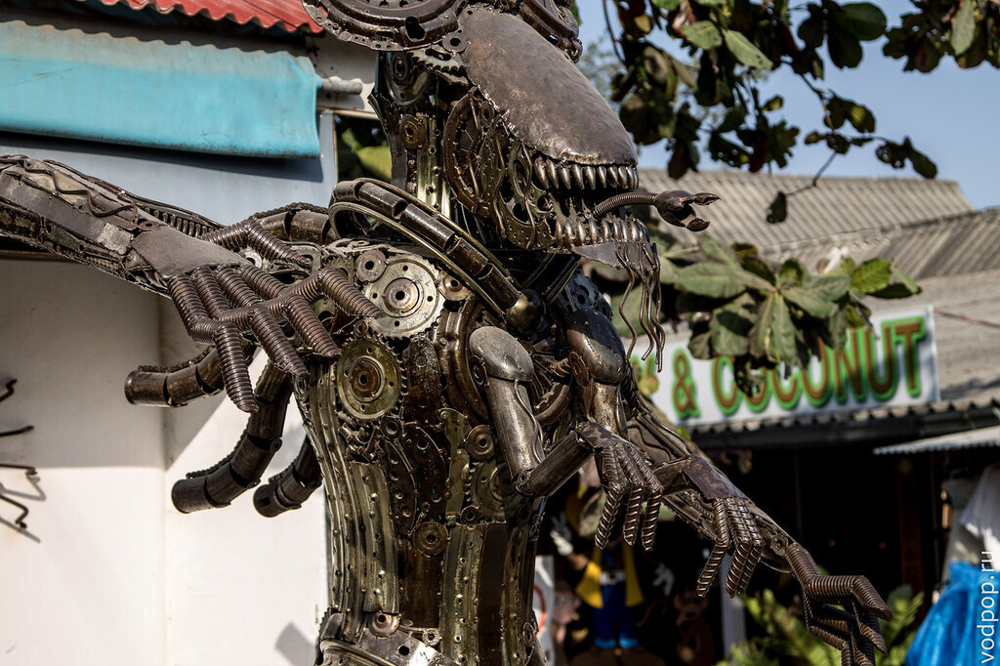

Для тех туристов, которые не могут себе позволить привезти ростовую скульптуру автобота или десептикона, могут купить экземплярчик поменьше.

Кстати, так как Большой Будда носит исключительно туристический характер, то следующая фотография посвящается всем туристам-свиньям абсолютно из всех стран мира! Четко под надписью "Please help keep Samui clean" валяется огромная куча мусора, а что творится в канавке в полуметре я даже и описывать не буду. Стыдно!

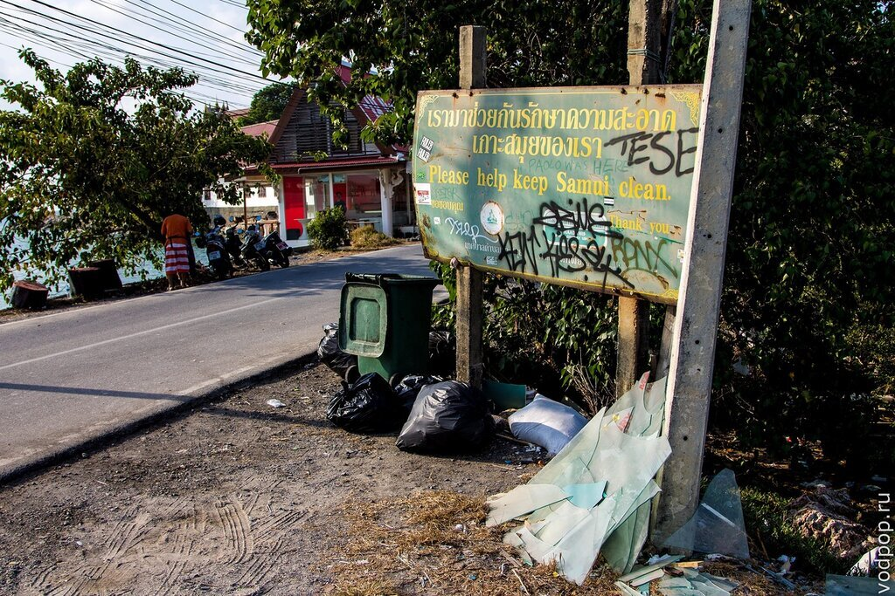

Мы всегда за собой выбрасываем мусор. Иногда делаем исключения в виде шкурки банана в джунглях, понимая, что она через неделю там уже разложится и станет полезным удобрением. А вот пластиковые пакеты и прочее - только в мусорку!

Иногда количество пластика в Азии просто убивает. Он используется везде, где нужно и не нужно.

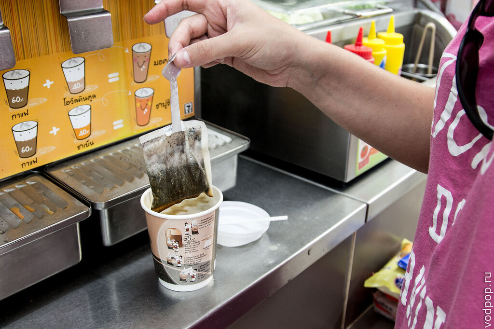

На фото пластиковый стакан, пластиковая крышечка, пластиковая ложечка и пакетик с кофе с пластиковым держателем. Ну не перебор ли?

Зато для европейцев много всяких штучек из вторичных материалов - экологически чистые блокноты, открытки и прочие сувениры.

Мы в этот очаровательный бар-магазин попали совсем случайно, просто проезжая мимо и увидев несколько хороших мотоциклов. Для нас наличие пары чопперов Harley или Honda - это всегда залог отличной атмосферы и качества.

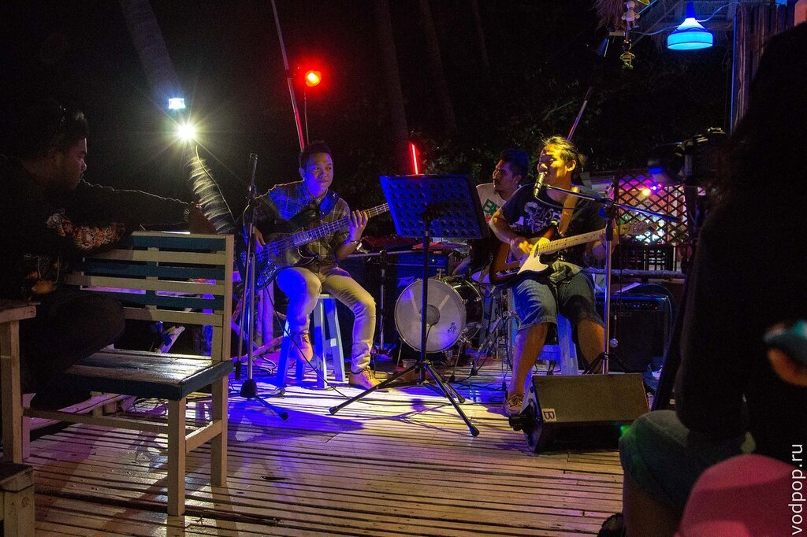

Местные музыканты играли неплохую подборку рока, блюза и рок-н-ролла, а очаровательные девушки готовили вкуснейшие фруктовые шейки и десерты.

Заведение называется Kalasea и внутри почти на всех сувенирах можно увидеть эту надпись.

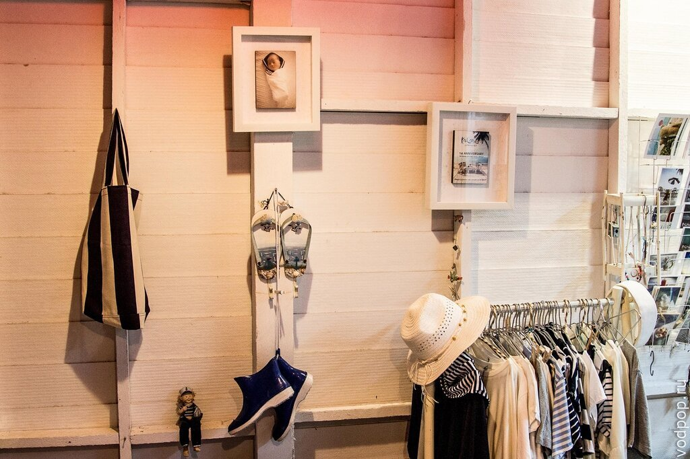

Рядом с баром есть свой пляж с хорошим заходом - днем наверняка можно арендовать шезлонги и валяться под солнцем с комфортом, попивая вкусный манго-шейк.

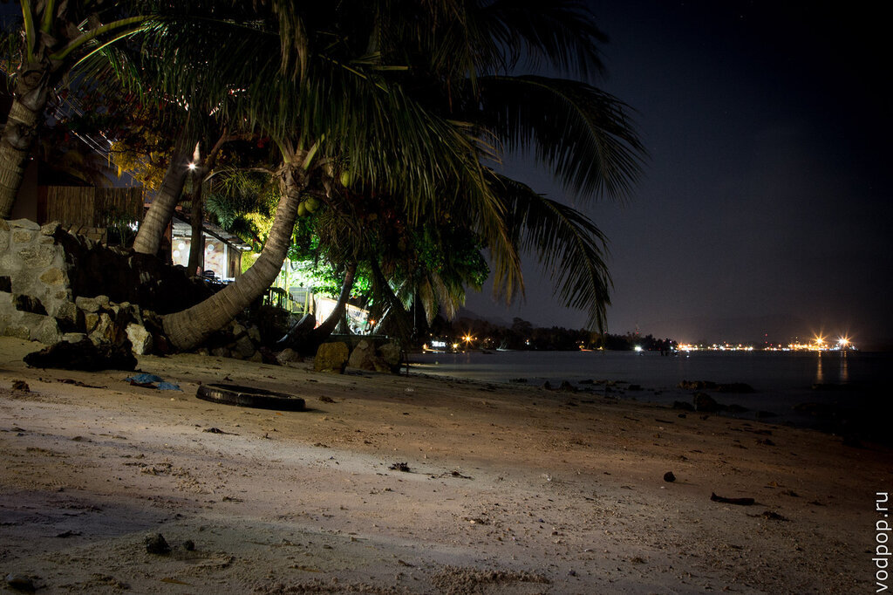

В общем, я искренне рекомендую это заведение.

На этом первый день нашего путешествия по Самуи внезапно закончился, но за второй день мы успели даже немного больше.

Попытка поменять мотоцикл не увенчалась успехом - наш счастливый арендатор сдал весь транспорт и взял себе выходной по этому поводу. Будить его с утра пораньше по телефону мы не стали, и решили страдать дальше. Хотя бы шлемы не сильно натирали!

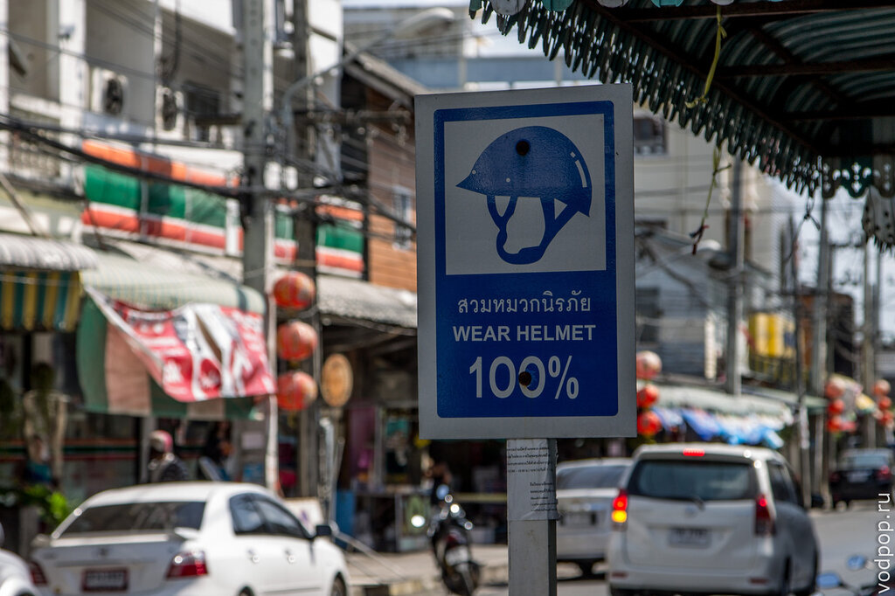

Вообще, со шлемами в Таиланде беда - они есть во всех прокатных конторах, но почему-то они в совершенно жутком состоянии. Я не понимаю, что с ними делают туристы? Играют ими в боулинг? В футбол?

Других причин, по которым на шлеме могут быть такие глубокие борозды от поцарапанной краски, я не вижу.

Само собой, иногда попадаются экземпляры, которые были в авариях, но таких крайне мало. Самая главная беда шлема- это либо жутко поцарапанный визор, либо его отсутствие. Визор - это стекло или пластик, через которое вы смотрите на мир, пока шлем на вашей голове. И чем больше царапин, тем хуже картинка.

У Климентия на этот счет есть свой "пунктик" - он физически не выносит царапин, т.к. у него постоянно царапаются очки и из-за этого он плохо видит, зрение падает,  и приходится заказывать новые очки.

Итак, решив все проблемы с визорами (обычно либо тщательным отмыванием, либо покупкой нового), мы отправились на покатушки по острову.

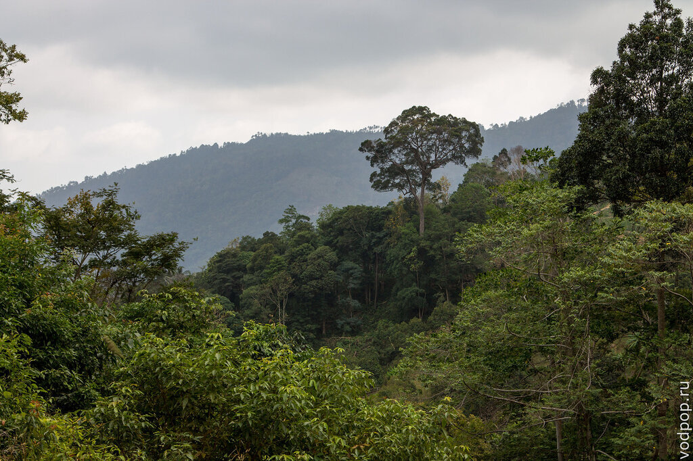

Когда забираешься в центр острова, ощущение, что рядом где-то есть море совершенно пропадает: кажется, что ты в джунглях и только горы вокруг.

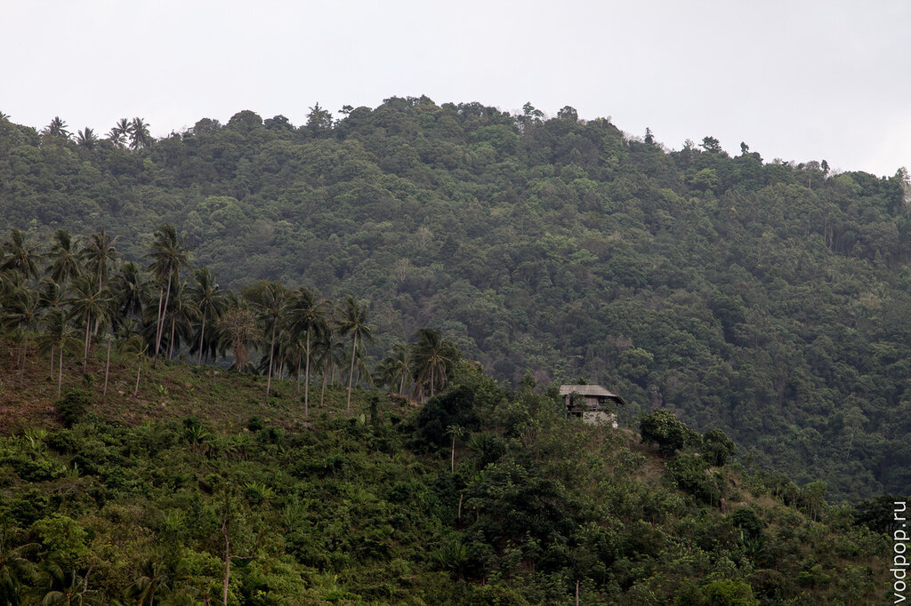

Дорога довольно приличная, но иногда слишком крутые спуски и подъемы - для путешествия по центру острова я бы не рекомендовала маломощные скутеры, коих в изобилии в прокатных конторах.

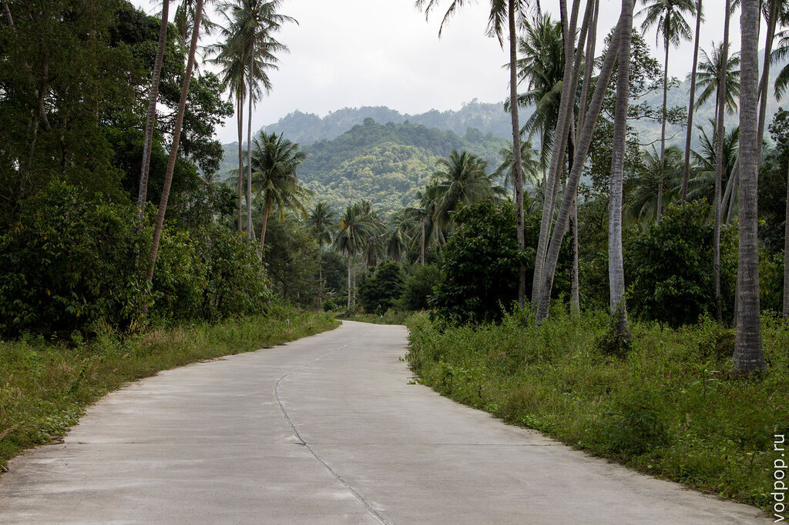

Природа совсем другая - больше зелени, есть не только пальмы, но и некоторое подобие лиственных деревьев - есть чему пошелестеть и вызвать волну ностальгии по Родине.

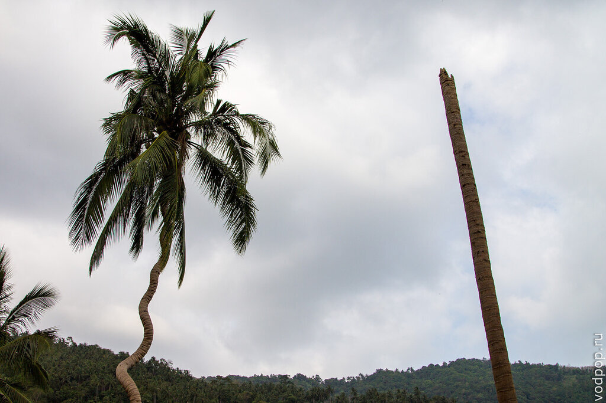

Места настолько дикие (особенно если свернете с асфальтированной дороги), что возвращаться после "затерянного мира" в цивилизацию как-то даже и непривычно.

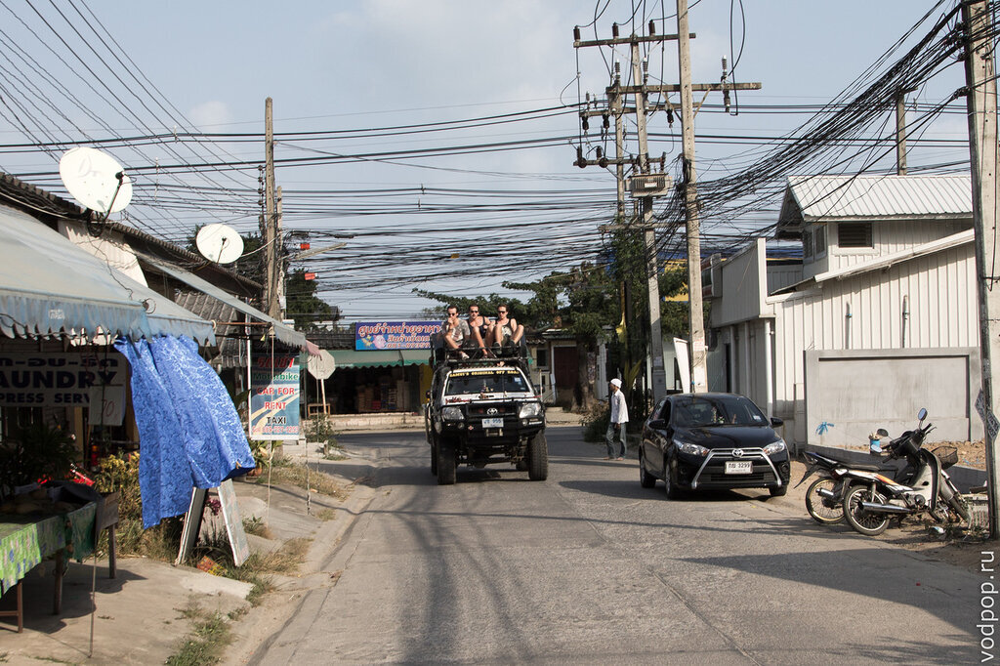

А в "цивилизации" множество туристов со всех уголков света - очень много немцев, итальянцев, французов. Русских на острове сравнительно мало, т.к. пакетные туры дешевле в Паттайю или Пхукет.

Райский остров Самуи - не самое дешевое удовольствие, если добираться сюда из Москвы, например. Прямых рейсов нет, поэтому в самом лучшем случае у вас будет одна стыковка в Бангкоке. И если вы покупаете билет Бангкок-Самуи самостоятельно, то надо быть готовым, что самолеты компании AirAsia отправляются не из Суварнабхуми, а из аэропорта Дон Муанг.

Ну и последняя достопримечательность Самуи, которую мы добавили в список must see - это пляж Ламаи.

Туристы сюда едут толпами посмотреть на камни "бабушка и дедушка", которые природа создала в форме детородных органов и выбросила на песчаный берег на радость всем

Но мне запомнилось на этом пляже совершенно другое. Во-первых, он почти бесконечный: можно долго-долго идти вдоль первой линии отелей, наблюдая за туристами и путешественниками со всего мира - как они общаются, читают книги, подпевают радио в барах.

Во-вторых здесь потрясающие волны, на которых можно долго-долго кататься, пока совсем не выбьешься из сил.

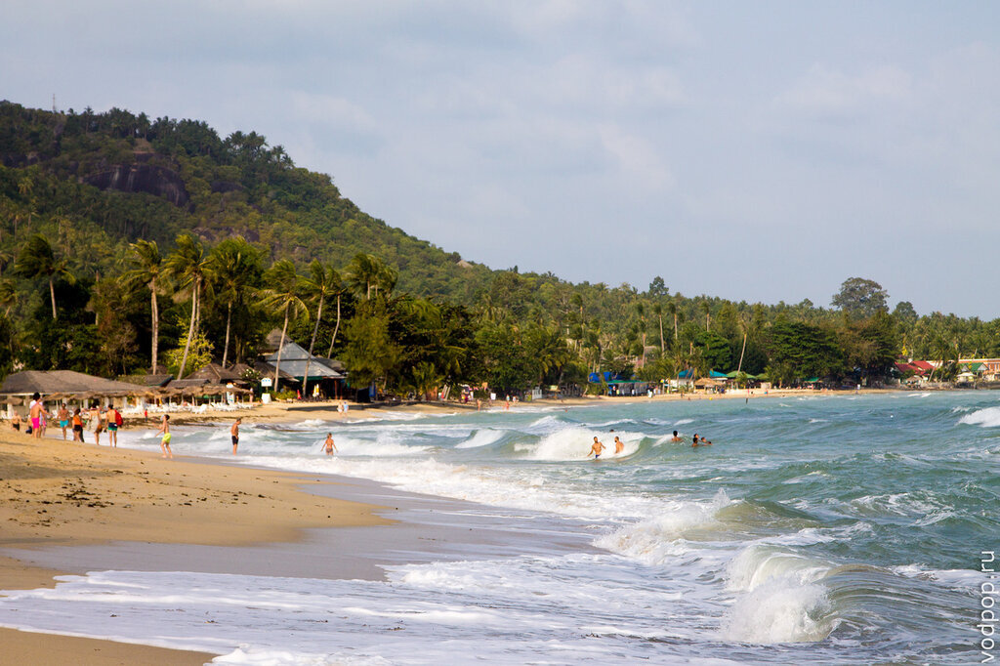

Моим единственным разочарованием на Ламаи стала потеря сережки, которую привезли в подарок Даша и Владимир.

Но в остальном это место идеально подходит для пляжного отдыха без маленьких детей: море слишком резко набирает глубину.

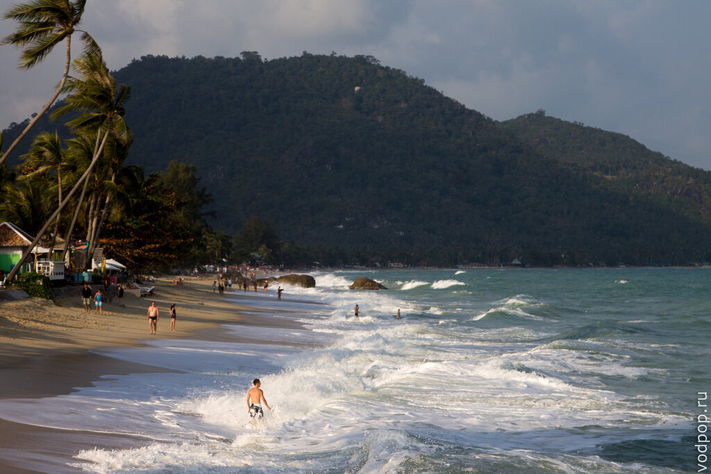

Самуи оставил положительные впечатления. Было мало интенсивно проведенных дней, нам повезло с погодой и мы любим, когда море немного штормит. Это идеальное место для пляжного отдыха по почти азиатским ценам с почти европейским комфортом.

Если есть, что добавить или возразить - ждем в комментариях!
