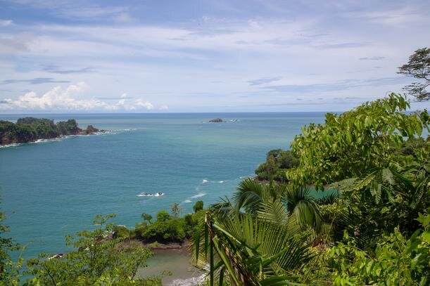
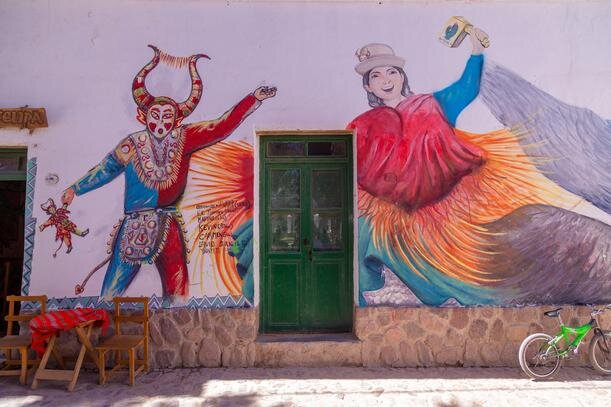
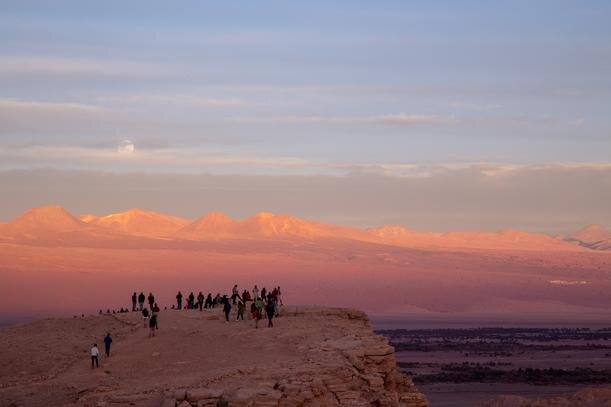
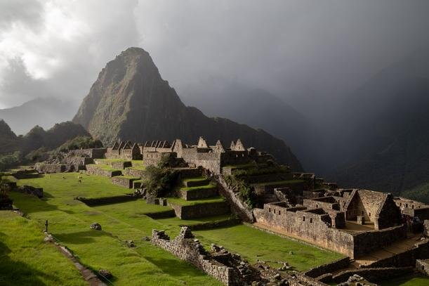
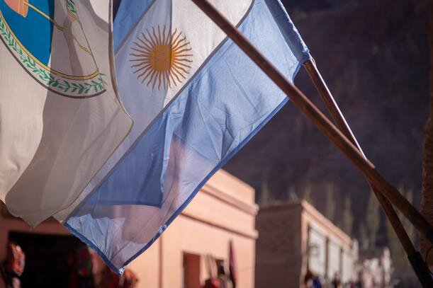
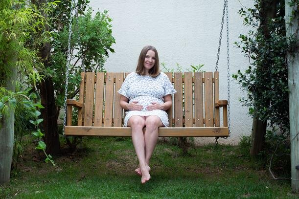

Не секрет, что все больше и больше будущих родителей задумываются о том, чтобы подарить своему ребенку второе гражданство. И мы с Климентием не стали исключением: еще задолго до планирования беременности мы уже приняли решение, что рожать будем за границей, и что ребенку обязательно нужен второй паспорт. О том, по каким критериям мы выбрали Аргентину для родов, как вели беременность в условиях путешествия, и как прошли сами роды, речь пойдет ниже.

<!--more-->

Перед тем, как вы продолжите чтение, я хочу заранее сделать акцент на том, что в статье будут озвучены мои личные ощущения, мнение и опыт. Они могут не совпадать с тем, что вы слышали или испытывали сами, и, как говорится, it's OK.

## Выбор страны

Во многом наша подборка стран обусловлена тем, что с апреля 2016 года мы находимся в путешествии на машине по ПанАмерике: едем от Аляски, США до Ушуайи, Аргентина. Узнать больше о нашем маршруте можно [тут](https://vodpop.ru/puteshestvie-po-amerikam-onlayn-statistika/), и также можно следить в режиме реального времени в [нашей группе ВК.](https://vk.com/vodpop)

В мире не так много стран, дающих гражданство по праву рождения: jus soli, юс соли, буквально «право земли», и, по счастливой случайности, почти все они находятся как раз в этой части света: в Северной и Южной Америках. Ознакомиться со списком стран можно в [этой статье на Википедии.](https://ru.wikipedia.org/wiki/Jus_soli)

Для себя мы сократили этот список, основываясь на нескольких факторах:

1. **Индекс паспорта.** Так называемая "сила паспорта", которая классифицирует страны по возможности безвизового свободного перемещения граждан на территории других государств. Так как мы постоянно перемещаемся по миру, для нас этот показатель один из самых важных. К примеру, у России индекс паспорта равен 121, что значит, что россияне могут посетить 121 страны в мире без предъявления визы. Узнать индекс можно [тут](https://www.passportindex.org/)
2. **Система здравоохранения.** Формально, Гватемала тоже дает второе гражданство, и даже если закрыть глаза на обстановку в стране и невысокий индекс паспорта, рожать бы там я не хотела. Если только в клинике [Health&Help](https://he-he.org/ru), которую построили русские волонтеры в гватемальской деревушке Момостенанго
3. **Возможность получить второе гражданство родителям**, то есть мне и Климентию. Безусловно, гражданство можно получить почти в любой стране мира, но некоторые страны предоставляют упрощенную схему, если вы родили на их территории
4. **Экономическая и политическая ситуация в стране.** Например, в Венесуэле наземные границы закрыты вот уже более года. Вряд ли бы кто-то стал добровольно рожать в обстановке тотального кризиса и отсутствия базовых товаров на полках магазинов
5. **Стоимость родов.** Не могу сказать, что это было решающим фактором, но мы определенно посматривали на стоимость ведения беременности и контракты на роды в каждой из стран. В итоге родили бесплатно
6. **Атмосфера.** С этим чуть сложнее, так как его почти невозможно описать словами. Но страна должна нам понравиться. Так, к примеру, Чили выпала из нашего списка фаворитов после попытки ограбления нашей машины.

Наш финальный список стран выглядел так:

##### **Аргентина:**

1. Passport Index – 159
2. Отличная система здравоохранения, возможность родить как платно, так и бесплатно
3. Сразу после рождения ребенка вы подаетесь на ПМЖ: здесь документ называется DNI, и он дает право не только легально находиться на территории Аргентины, но и путешествовать по большинству стран Южной Америки без виз/ограничений по дням. DNI также дает право работать в стране, и единственное, что вы не сможете делать с этой карточкой – это голосовать на выборах. Также после рождения ребенка можно сразу подаваться на получение аргентинского гражданства: процесс занимает около 2-х лет, если подавать документы в Буэнос-Айресе
4. Вечный кризис, но он чувствуется только если ваш доход в аргентинских песо. Если доход в долларах/евро, то в Аргентине можно жить очень комфортно
5. Если рожать в Public Hospital, то это абсолютно бесплатно: и естественные роды (ЕР), и кесарево. В частном госпитале Буэнос-Айреса цены начинаются от 3500$ за ЕР,
6. Мы влюбились в Аргентину с первого взгляда: нам нравится климат, еда, люди, культура, а про отношение к беременным (великолепное) я расскажу чуть ниже.

##### Бразилия:

1. Passport Index – 160
2. Хороший уровень медицины, но, согласно статистике, высокий процент кесаревых сечений (более 30%)
3. Сразу после рождения ребенка родители получают ВНЖ сроком на 9 лет, им выдается удостоверение Registro geral, которое, как и в случае с Аргентинским DNI, дает право путешествовать по Южной Америки без ограничений, вы можете устроиться на работу, и в целом, если вам не нужен второй паспорт, можете так и жить с Registro geral, обновляя его раз в девять лет. Процесс получения паспорта можно начинать через 365 дней от даты, указанной в карточке на ВНЖ. Через 6–12 месяцев вы уже можете иметь бразильский паспорт на руках
4. Зависит от города/провинции, где вы хотите рожать. Мы были только во Флорионаполисе на юге страны, и там все спокойно и безопасно, так как экономика держится на многочисленных туристах, преимущественно обеспеченных бразильцев из Рио и Сан-Пауло
5. Если оформить местный ИНН, то можно рожать в Public Hospital бесплатно, стоимость контрактных родов от 4000$
6. Неожиданно нам очень понравилось: мы не видели всю Бразилию и не можем говорить за всю страну, но во Флорианаполисе мы провели чуть больше месяца и с радостью вернемся еще: море, солнце, пляжи, вкусные морепродукты, кайтсерфинг, приветливые люди. Если бы они говорили по-испански, мы бы всерьез задумались остаться там надолго.

##### Канада

1. Passport Index – 168
2. Отличная система здравоохранения, если вы уже резидент Канады: медицина, как и в России, оплачивается из соответствующего бюджета налогоплательщиками, и вся система заточена именно под это. Судя по отзывам на многочисленных форумах, в Канаде сложно вести беременность и заключить контракт на индивидуальной основе. Из личного опыта: мы пытались сделать УЗ-чистку зубов, нам озвучили ценник в 250$ и записаться можно было только за 2 месяца вперед
3. Рождение ребенка в Канаде не дает никаких преимуществ его родителям: гражданство получит ребенок, и только
4. Канада — одна из самых благополучных стран в мире. Конечно, и тут есть свои проблемы, но по сравнению со многими странами, в том числе развитыми, тут все отлично
5. Роды в Канаде — самая дорогая опция из нашего списка, и хуже всех освещенная в блогах/статьях. С одной стороны, есть вариант родить бесплатно: есть несколько благотворительных организаций, где вас смогут принять. Но средняя стоимость родов по стране – около 20000 CAD, что на текущий момент примерно эквивалентно 14000$
6. Мы провели в Канаде почти полгода, и срок говорит сам за себя: нам очень там понравилось, и мы пропитались особо любовью к Калгари, где по стечению обстоятельств мы жили целый месяц, а на выходные выезжали в наш любимый национальный парк Банфф. Канада в целом одна из наиболее приятных стран для жизни из посещенных нами.

##### США

1. Passport Index – 170,
2. Дорогая, но высокого качества медицина, родовой туризм поставлен на поток, и можно выбрать госпиталь и акушерку, не выходя из дома: информации и отзывов тысячи. Конечно, при условии, что вы будете рожать в Майами или других популярных направлениях для родов.
3. По достижению ребенком 21 года он может подать прошение на воссоединение с семьей, но даже в таком случае вы сначала получаете Green Card, а только затем гражданство
4. Про США можно сказать то же самое, что и про Канаду: в целом благополучная страна, и если вы приедете исключительно на роды, то у вас останется наилучшее впечатление
5. В интернете можно найти информацию о родах как за 4000$, так и за 12000$. Я бы ориентировалась на нечто среднее, в районе 8000-10000$. Учтите, что ЕР обойдутся на пару тысяч дешевле, чем кесарево сечение
6. Мы искренне наслаждались нашим пребыванием тут, исколесив большую часть центральных и западных штатов. США — великолепная страна для путешествий на автомобиле, и нам очень понравилось быть там туристами: ни за что не платишь (налоги), но пользуешься всеми благами: дорогами, стоянками для отдыха, кемпингами, инфраструктурой в целом.

##### Чили

1. Passport Index – 160,
2. За всю систему не скажу, но роды в Чили в платной клинике считаются одними из самых комфортных и безопасных на континенте
3. Никаких бонусов родители будущего чилийца не получают, и если вы захотите получить чилийское гражданство, то вас ждут ровно те же самые процедуры, как и для неродителей. В среднем получение чилийского паспорта занимает 5 лет
4. До недавнего времени Чили могла похвастаться стабильной обстановкой, но все изменилось несколько месяцев назад, когда по всей стране прошла серия забастовок, были разграблены супермаркеты, центры городов "украшены" граффити и битым стеклом витрин. Началось все из-за повышения тарифа на проезд в транспорте, но достигло масштабов национальной катастрофы, и власти вынуждены были ввести комендантский час. С родами в Чили я бы повременила, пока обстановка окончательно не успокоится
5. Средняя цена по стране колеблется между 4000-6000$, но относится, по факту, к двум городам страны: Сантьяго-де-Чили и Вальпараисо. Последнее место особенно любимо россиянами, так как находится на берегу моря, и может похвастаться наличием солнца практически круглый год
6. Чилийский паспорт — единственный латиноамериканский паспорт, который дает право поехать в США без визы, и это весьма сильный аргумент в пользу Чили. Наше взаимодействие со страной было относительно успешным, пока нашу машину не вскрыли на наших глазах: благо, мы вовремя успели отпугнуть, отделавшись сломанным замком. После этого Клим сказал свое веское "давай уедем отсюда побыстрее", и с тех пор у нас двоякое впечатление от страны. Хотя объективно, это хороший вариант, если вы хотите подарить ребенку второе гражданство, а сами в таковом не нуждаетесь.

## Ведение беременности в Латинской Америке

Так как беременность была запланирована, то все предварительные анализы (группа крови, резус-фактор, диагностика ЗППП и прочее) были сделаны еще в России.

О беременности мы узнали в Перу, там же пошли к гинекологу, и через Викторию Валикову, основательницу клиник для всех Health&Help, о которой речь выше, я получила контакт Ани.

Аня — врач из Львова, которая вела мою беременность удаленно: говорила, какие анализы и обследования делать, а я затем высылала ей результаты, и она давала мне обратую связь. Такой вариант оказался идеальным для меня, так как Анюта была волонтером в клинике в Гватемале и знает испанский: мне не пришлось ничего переводить.

По поводу языка: на момент беременности мы оба вполне сносно говорили по-испански, но в любом крупном городе ЛА можно найти врача, который говорит по-английски.

Средняя стоимость консультации у врача-гинеколога – 50$, анализ кровь+моча – около 25$. За время моей беременности мы были в Перу, Чили, Аргентине, Парагвае, России, Уругвае, Бразилии, посетив врачей в половине стран. Мне очень понравился врач в Лиме, Перу, я бы с удовольствием вела у него беременность, но наш кочевой образ жизни к этому не располагал.

##### Медицина в Аргентине

Особенность аргентинской медицины состоит в том, что любой человек может воспользоваться услугами медицины, и потому традиционно считается, что в Public Hospital длинные очереди, попасть на прием к врачу сложнее, и благодаря этому здесь существует большое количество Hospital Privado — частных госпиталей. В Hospital Privado можно попасть как за наличный расчет (это называется particular), либо через программу страховки, наподобие нашего ДМС. Вы заключаете контракт со страховой компанией, которая, в свою очередь, подписывает контракты с несколькими частными госпиталями, и, в зависимости от вашей программы страховки, там будут госпитали попроще/подороже, а также будут включены разные услуги. По самой дорогой страховке можно даже делать пластические операции.

Мы специально заехали на 5-м месяце беременности в Буэнос-Айрес, чтобы выбрать а) госпиталь, б) попробовать заключить контракт со страховой компанией.

Как я упомянула выше, в Hospital Privado можно платить и из своего кармана, но тогда с вас будут брать за каждую единицу потраченного на вас оборудования, койко-места и медикамента. В таком случае кесарево сечение, анестезия, отделение неонатологии оплачиваются отдельно. Самое дорогое — это отделение нео, где за каждый день пребывания может набежать счет от 1000$ и выше. В отделение нео можно попасть по многим причинам, и если у вас рождается недоношенный малыш, то вас могут продержать там несколько дней, а то и месяцев.

По этой причине, если вы не на все 100% уверены в том, как пройдут ваши роды, или что ваш малыш не появится на свет раньше времени, я бы советовала либо рожать в бесплатном госпитале, либо в платном и со страховкой.

##### выбор госпиталя в буэнос-айресе

Итак, среди посещенных нами госпиталей были:

1. **Hospital Austral** – нам дали контакт заведующего отделением доктора Berutti, и мы договорились с ним о встрече через WhatsApp. Госпиталь красивый, современный, врачи очень приветливые (но это про всех врачей Аргентины без исключения, не важно, в какой госпиталь вы придете), находится за городом, и мы только потом осознали, что сюда пришлось бы кататься каждую неделю до самых родов: показываться гинекологу и сдавать анализы. Отличная опция для родов, но жить надо поближе к госпиталю. Есть возможность заключить контракт напрямую, доктор Berutti дал нам фиксированную цену за свои услуги: 2000$, а размещение в госпитале на стандартные 48 часов обошлось бы еще в 2000$ при условии ЕР без анестезии. Все доп.услуги оплачивались бы отдельно.
2. **Hospital Italiano** – неплохой госпиталь, хотя на фоне других платных немного пошарпанного вида. К сожалению, нам сразу отказали даже в оформлении контракта, так как у нас нет местного DNI (удостоверения личности). Ранее была информация, что иностранцы там рожали без проблем без оформления документов, но нам не удалось ее подтвердить.
3. **Hospital Aleman** – один из немногих частных госпиталей, который предлагает свою собственную программу страховки: за 230 тысяч песо ($3900 на ноябрь 2019) мы могли оформить страховку на оставшиеся 4 месяца беременности, и туда бы входили роды, размещение в палате, анестезия и отделение неонатологии. Мы были в шаге от заключения контракта, но обнаружилась неожиданная проблема: ближайшее turno (так называется бронь приема у врача, очередь, обычно дают бумажный талончик с временем и ФИО врача) было только через две недели. А у нас поджимали наши 90 дней штампа в паспорте: мы хотели израсходовать как можно меньше, чтобы не быть нелегалами на момент родов. Ну и, если честно, мы были несколько возмущены, что в платном госпитале нужно ждать две недели приема гинеколога, а без его заключения мне никак не могли оформить страховой договор, так как на цену могли повлиять какие-то осложнения, выявленные в процессе осмотра. Пожалуй, если бы у нас было время ждать эти две недели, я бы остановила свой выбор на этом госпитале.
4. **Mater Dei** – рекомендация от соседнего столика в кофейне, у которых был новорожденный малыш. Они спросили, откуда мы, что планируем делать в БА. Когда мы ответили, что рожать, они очень удивились (до 8-го месяца мой живот был практически незаметным под платьями), и порекомендовали врача в этом госпитале. Мы просидели в очереди полчаса, но в итоге так и не смогли узнать стоимость родов и в целом возможность родить по контракту.
5. **Hospital Fernandez** – на него можно найти много отзывов в российском коммьюнити приехавших рожать в Аргентину. Один из крупнейших и лучших бесплатных госпиталей Аргентины, куда массово приезжают рожать жительницы Парагвая, и с недавнего времени еще и России. Изначально он был в хвосте нашего списка, так как мы были с установкой "надо платить, чтобы был лучше сервис", но после просмотра всех платных госпиталей и невозможности сделать там что-то в тот же день, мы были приятно удивлены, что в Hospital Fernandez можно прийти с утра, взять turno, и в тот же день пойти к врачу. Как оказалось позже, можно даже записаться онлайн, и просто прийти к назначенному времени на прием. И когда я говорю "бесплатно", я имею в виду, что бесплатно все: анализы, ведение беременности, сами роды (ЕР и кесарево), отделение неонатологии, осмотры после родов и т.д. Единственное НО: во всех бесплатных госпиталях страны НЕ делают анестезию во время ЕР без показаний. "Мне больно" показанием не является: по мнению врачей Аргентины эпидуральная анестезия имеет много негативных последствий, и потому в стандартную процедуру не включена.

Кроме Hospital Fernandez бесплатно можно родить в Hospital Rivadavia и Hospital Ramón Sarda: на них также много отзывов от рожавших там россиянок, и не только.

##### разница между родами в платном и бесплатном госпиталях в аргентине

Нашей с Климом ошибкой было подходить к выбору госпиталя с установкой "платное — значит, лучшее". В Аргентине это не является правдой. Точнее, не на 100%.

Конечно, частные госпитали выглядят аккуратнее, публика там чуть более обеспеченная (что не всегда правда, со мной лежали в палатах девушки, которые точно могли себе позволить родить за деньги), но для меня самым важным критерием было наличие отделения нео (мало ли что), современного оборудования в родительном зале, а также компетентность врачей.

Кроме отзывов в интернете, я также спрашивала наших аргентинских друзей, и они тоже рекомендовали Hospital Fernandez. И все новые знакомые в Буэнос-Айресе, когда мы говорили, что мы будем рожать в Fernandez, говорили, что это хороший выбор.

Основные отличия:

1. Платные клиники лучше отремонтированы
2. Размещение в послеродовой палате по 2 человека в бесплатном, в платном может быть одиночная палата (зависит от типа контракта/страховки)
3. Говорят, что в платных кормят вкуснее и порции больше, но даже в Fernandez я оставляла часть порции Климу: мне было много. И вкусно!
4. Если речь идет о каких-то специалистах, кроме гинеколога/педиатра, то в платном госпитале действительно проще к нему попасть: в бесплатном часто нет нужного вам врача, либо к нему очередь на месяц вперед
5. В платных госпиталях анализы делают быстрее. Стандартное время ожидания в Fernandez – две недели. Если нужно срочно, то сделают в тот же день, но это исключение.

Отдельно хочу сказать по поводу анализов: за 7 недель ведения беременности в Fernandez из меня взяли, кажется, минимум литр крови. На первичном заборе я чувствовала себя донором, потому что взяли сразу на все: врачу было явно немного лень разбираться в ворохе моих анализов со всех стран Латинской Америки, поэтому мне многое повторили еще раз. Даже группу крови!

Напомню, что анализы сдаются натощак, и когда у меня брали 4-ю пробирку размером с кружку, и спросили "как я себя чувствую", я честно ответила, что не очень: лаборант сразу спросила, одна ли я, и меня "передали" в руки Климу.

##### отношение врачей в аргентине

Мы в восторге! Несмотря на то, что мы решили рожать в бесплатном госпитале, и несколько опасались, что врачи могут смотреть косыми взглядами, такого не было ни разу! Всегда все врачи встречали нас с улыбкой и человеческим отношением. Если в России, как часто замечают, лечат болезнь, то в Аргентине, я вас заверяю, лечат человека. Невероятно приятно, когда абсолютно весь медицинский персонал приветливый, и как будто бы подрабатывает психологами на полставки: все говорят, что все пройдет отлично, все будет хорошо, все будет просто прекрасно, что родится здоровый малыш, и вокруг всегда позитивная атмосфера.

Я не буду сравнивать сейчас российскую и аргентинскую бесплатные системы, так как первой я не пользуюсь уже очень много лет, и откровенно говоря, не очень в курсе, как все работает. Но то, что я увидела в Аргентине, мне понравилось.

##### Отношение к беременным в аргентине

Еще один элемент восторга, и я после первых родов сказала, что за вторым ребенком я тоже приеду в Аргентину. На что сестра разумно спросила "а зачем уезжать?". Уезжать из Аргентины и правда не хочется, но сейчас речь не о том.

Беременным всегда и везде рады, им абсолютно везде в Аргентине приоритет. Едва мы заходили в автобус, как половина салона подпрыгивала, спеша уступить мне место. Показательный случай: как-то мы зашли в переполненный людьми автобус, и никто не мог увидеть мой живот: водитель громко объявил, что вошла беременная, и что необходимо уступить мне место. Мне даже не по себе стало от такого внимания, но все равно приятно.

В очередях в супермаркетах вас обязательно пропустят вперед: об этом вам заботливо напомнят как сотрудники кассы, так и его посетители. С грудничком, кстати, тоже уступают: в наш совместный поход в магазин сами посетители подошли и сказали, что мне нужно пройти вперед, а не стоять со всеми.

В Hospital Fernandez, и, уверена, в любом другом тоже, у беременных и родителей с детьми всегда приоритет: тут она выглядела как отдельная очередь к стойке регистрации, чтобы получить turno. Но, напомню, что в нескольких бесплатных госпиталях уже введена онлайн-очередь, и вы можете взять turno не выходя из дома.

На улице вам будут радостно улыбаться, и совершенно незнакомые люди могут подойти и спросить, мальчик у вас или девочка: это местная норма, не стоит пугаться. Мой живот никто не пытался потрогать, но, говорят, и такое бывает. С исключительно добрыми намерениями, но с нашим менталитетом может быть чуточку непривычно.

Впрочем, могу смело сказать, что после рождения Тимофея, на улице стало еще больше внимания: прохожие не стесняясь заглядывают в коляску, и осыпают сына вниманием и комплиментами.

Вывод: быть беременной и родителем с ребенком в Аргентине невероятно приятно! Вы обязательно почувствуете заботу от незнакомых людей на улице, а ваш ребенок после рождения будет усыпан постоянным потоком улыбок и повышенного внимания.

Подробный отчет о родах в госпитале Фернандес читайте [во второй части статьи.](https://vodpop.ru/rodyi-v-argentine-moy-lichnyiy-opyit-i-nablyudeniya-chast-2/)
