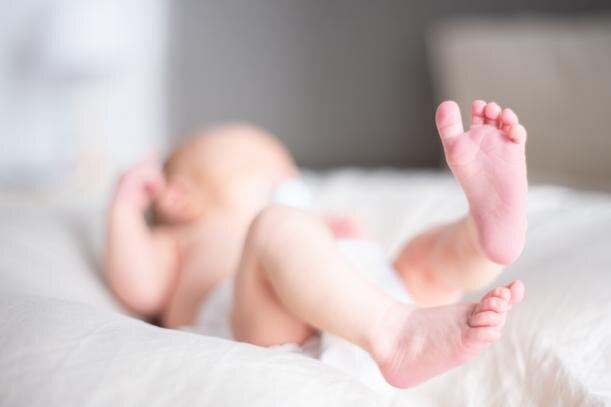

Продолжение рассказа о том, как мы решили рожать в Аргентине.<!--more-->

О том, как и почему мы выбрали именно Аргентину, читайте [в первой части статьи про роды](https://vodpop.ru/rodyi-v-argentine-moy-lichnyiy-opyit-i-nablyudeniya-chast-1/).

##### **Ведение беременности в Hospital Fernandez**

Я встала на учет в Hospital Fernandez на 32-й неделе беременности. Для этого нужно взять turno к гинекологу, я наблюдалась у доктора Graciela Folgado. Первый прием был самым длительным, и большая часть ушла на заполнение бумажек. Я взяла с собой паспорт и все анализы, которые у меня были. Особенно важно принести все УЗИ, сделанные во время беременности: их смотрит каждый врач, поэтому если они не на испанском, советую заранее перевести.

Несмотря на то, что у меня были сданы анализы на ЗППП и группу крови, мне их выписали сделать еще раз: так я и закончила предобморочным состоянием в лаборатории крови. Берут действительно немало, так что обязательно возьмите с собой перекус, чтобы прям там восполнить запас энергии.

Сдача анализов, пожалуй, самый неприятный момент из всего: надо очень рано приехать в госпиталь, и отстоять очередь. Мне повезло тем, что рядом всегда был Клим: он стоял рядом с мониторами, где подсвечивались порядковые номера, и я могла уйти в другой зал, посидеть. Некоторые особо продвинутые люди приносили с собой раскладной стульчик. Если бы он у нас был, мы бы тоже захватили: мест всем именно около лаборатории не хватает. Что не удивительно, потому что анализы в частных лабораториях довольно недешевые. Тот набор, что я сдала, обошелся бы минимум в 60$.

Кстати, валюта в Аргентине — аргентинский песо, но так как в стране постоянный кризис, и цены обновляются чуть ли не раз в месяц, разумнее говорить об эквиваленте в долларах.

До 38-й недели нужно приходить к гинекологу раз в две недели, а после наступления 38-й — каждую неделю. Очень удобно, конечно, жить где-то поблизости, в районе Palermo. Но нам понравился район Belgrano, от которого за 15 минут на такси/машине можно добраться до госпиталя.

Кроме стандартных анализов кровь+моча, у вас попросят результат Пап-теста (мазок Папаниколау). Если нет актуального, то вам его сделают в срочном порядке. Будьте готовы быть "донором" крови каждые две недели: как минимум общий анализ крови, но мне постоянно дописывали что-то еще, и еще, и еще... Так я узнала, к примеру, что у меня есть прививка от Гепатита B, но нет от Гепатита А: сразу после родов мне ее поставили.

По поводу прививок: в Аргентине нет понятия "медотвод", и вашему ребенку, если вы рожаете в госпитале, сразу при рождении сделают БЦЖ и Гепатит B, плюс дозу витамина К. Далее вы **обязаны** прививать ребенка по прививочному календарю. Его, кстати, можно найти на любой пачке молока. Беременных тоже прививают по рекомендации врача, в зависимости от того, какие антитела у вас есть по результатам анализов. Я была удивлена, что беременным можно прививаться, но да: можно. Просто не от всего. Мне сделали на 34-й неделе прививку от столбняка, а если бы я попала под начало сезона гриппа, то поставили бы еще и эту вакцину. Выработанные антитела будут защищать не только и не столько меня, сколько малыша первые месяцы, пока ему еще нельзя будет ставить эти прививки.

Официальный сайт о вакцинации в Аргентине: [https://www.argentina.gob.ar/salud/vacunas](https://www.argentina.gob.ar/salud/vacunas)

Чтобы избежать возможных спекуляций на эту тему: я НЕ антипрививочница, я за вакцинацию по календарю, и так как сама не являюсь специалистом, то верю рекомендациям ВОЗ (Всемирная Организация Здравоохранения) и тому, что написано в книге Федора Катасонова "Федиатрия".

Если вы встаете на учет с первого месяца, то всех три контрольных УЗИ вам сделают тут же. В моем случае первые два были сделаны в Перу и в России, а третий и завершающий тут, в Hospital Fernandez. Врач-узист сначала делает все необходимые замеры и считывание параметров, так что не бойтесь первые минуты тишины: они просто работают. А уже потом, когда отчет готов, она поворачивает экран и комментирует происходящее.

Мы до последнего УЗИ на 34-й недели не знали, кто у нас будет: мальчик или девочка. И, благо, что Клим был со мной, потому что мне уже протянули салфетки и она убрала датчик с живота, как он вспомнил, что мы так и не знаем пол ребенка! А у меня это вылетело из головы после фразы "все с вашим ребенком хорошо", и я уже готова была идти на выход. Врач удивилась, но вернулась к осмотру и сказала, что будет мальчик.

Начиная с 38-й недели гинеколог выдает направление на КТГ: прислоняют датчик, и вы лежите минут 20-30, пока идет запись сердцебиения плода. Врачи просят позавтракать перед этим, но я бы еще захватила что-то сладкое с собой: в нашем случае между завтраком и КТГ прошло время, и малыш успел уснуть. В результате его будили вибрацией, а на соседней кушетке беременную попросили сходить в магазин, купить и съесть шоколадку и вернуться через 15 минут: ее малыш очень лениво реагировал даже на вибрации.

На 39-й неделе мне дали направление на ЭКГ: мы сделали ее в клинике рядом с домом за 15$, так как не хотелось опять вставать ни свет ни заря.

Если быть честной, то раз в две недели ходить к врачу ощущалось еще ничего так, но по факту в госпиталь мы приезжали чаще: то анализы сдать, то на бесплатные курсы по подготовке к родам сходить. Кстати, очень рекомендую! Нас пустили в родовое отделение, посмотреть, где именно мы будем рожать. Приятно узнать и увидеть заранее, хотя, положа руку на сердце, в момент родов мне было абсолютно все равно: я бы и в коридоре родила.

##### **Как прошли мои Роды В HOSPITAL FERNANDEZ**

Думаю, без пояснений понятно, что роды – это процесс сугубо индивидуальный, и что никто не знает, как именно у вас они пройдут. Не знала и я, когда в 12 ночи мы распрощались с друзьями, отмечая Масленницу у нас дома, а в 2 часа ночи уже была в госпитале.

Позитивный настрой начался еще с таксиста: он, посмотрев на меня с животом и сумку в руках Клима, и сверив адрес, поздравил нас от всей души, и 15 минут поездки рассказывал о своей семье и детях, настраивал, что все пройдет хорошо и быстро и почему-то хотелось ему верить.

В госпитале мы подъехали сразу к входу в Guardia: не так важно, рожаете вы днем или ночью, если у вас начались роды, вам сюда. В Фернандес родовое отделение находится на 4-м этаже: туда можно подняться на лифте либо самостоятельно, либо вам привезут кресло-каталку, если вам уже больно ходить на схватках.

Дома у меня отошли воды, и почти сразу начались схватки: по прибытию на 4-й этаж меня положили в комнату и поставили датчик на живот (КТГ). Там я пролежала несколько часов, пережидая схватки, пока их частота не стала удовлетворительной для врача. В этот момент подвезли кресло, меня посадили и повезли в родовую палату.

Один небольшой, но крайне неудобный момент: именно на этапе начала родов Клима попросили спуститься вниз в Admisión, и заполнить бумажку о поступлении меня в приемное отделение. Более неудачного момента не выберешь: на схватках Клим делал мне массаж спины и всячески подбадривал, и те 15 минут, что его не было, я постоянно донимала персонал вопросом "¿Dónde está mi marido?" – "Где мой муж?". Клим же, с первого этажа услышав громкий крик решил, что это я кричу, и он пропустил рождение сына. В общем, дурацкая процедура, и я бы занялась оформлением этой бумажки до момента Х, но мы не знали о такой последовательности.

В родовой палате присутствовал врач, который изначально принял меня из Guardia, его коллега, затем подошла акушерка: совершенно волшебная и приятная женщина, с которой я бы пошла рожать второго. Один ее вид на меня наводил спокойствие. Время от времени появлялась врач, явно выше по званию, но кто она именно я не скажу. Также в палату заходили педиатр и неонатолог. В одиночестве вы не останетесь, это точно.

Клим стоял слева у моей головы, акушерка справа, а весь остальной медперсонал был где-то около ног. Часов в палате не было, но восстанавливая события, в родовую меня привезли около 6 утра, минут через 40 мне прокололи пузырь, а в 8 утра появился на свет Тимофей.

Кстати, подобная скорость меня окончательно смутила: я читала про первые роды минимум на 12 часов, и совершенно не верила врачам, которые говорили, что я вот-вот  рожу. Как результат, предвосхищая еще много часов боли, я кричала "Ya no puedo más" – "Я больше не могу". И да, несмотря на чтение литературы про правильные техники дыхания, пропевание схваток и бесполезность крика, я все-таки в конце знатно прокричалась. Но врачи к этому явно привыкшие.

У меня мозг отключился почти полностью, я только могла говорить простые фразы и ждать, пока накатит очередная волна схваток. Для себя я поняла, что если бы я поспала накануне, было бы значительно легче, а так меня выключало между схватками, что я даже не осознавала: об этом мне потом Клим рассказывал. Используйте каждую возможность поспать перед часом Х.

Пока ничего интересного не происходило, все врачи сидели по углам, каждый в своем телефоне. Но потом резко подскочили, и уже до появления ребенка не отвлекались. Информации о том, что именно происходит, сколько сантиметров открытия, было немного, либо я все прослушала. Врачи чаще спрашивали меня, как я чувствую схватки, хочу ли тужиться. Опять же, индивидуальные ощущения: я не хотела тужиться, и схватки животом не ощущала, у меня вся боль уходила в спину, и врачи между собой обсудили, что это не есть норма. В результате, чтобы помочь мне "ощутить" потуги, между мной и строгой врачом натянули простынь, мы с ней играли в "перетяни канат", и как-то так появился Тимофей.

Без врача и акушерки я понимала примерно ничего, что надо делать, так что была очень рада, что рядом со мной был квалифицированный персонал, который знал, что я должна делать. Мне также сделали эпизиотомию, и я не помню, чтобы меня спрашивали, хочу ли я или нет, но это было по показаниям: еще на УЗИ меня предупреждали, что у нас крупный малыш с большой головой. Общаясь с соседками по палате, у которых детки были значительно поменьше, поняла, что эпизио делают не всем.

Сразу после родов Тимофея положили мне на грудь, он там побыл какое-то время, а потом Клим вместе с врачом пошел на взвешивание и одевание ребенка. Когда они вернулись, меня уже заканчивали зашивать, и после завершения этого процесса нас оставили втроем.

Через 10 минут после отбытия всех врачей я пошла в душ, помыла голову, посушила волосы феном, переоделась, и вернулась в родовую палату: это немного нетипичный сценарий, так как обычно переводят в отделение уже родивших, но оно было переполнено в тот день из-за забастовки медсестер в другом госпитале, и всех их рожениц перевели в Фернандес.

Во время и после родов ставят капельницу. Что именно там, кроме физраствора, я не уточняла, хотя в меня зачем-то вогнали аж 4 штуки подряд, хотя я себя неплохо чувствовала. Опять же, врачи не говорили, а я не спрашивала, хотя уверена, что они бы с радостью ответили на любой мой вопрос. Но в тот момент мне хотелось наслаждаться малышом, и довериться профессионалам.

Итог: мне понравилось! Да, это были самые болезненные ощущения в моей жизни, но они абсолютно того стоили, к тому же они почти сразу забылись.

##### Партерские роды в Аргентине

И я однозначно голосую "за" партнерские роды: по закону в Аргентине вы можете провести минимум одного человека с собой, им может быть муж/партнер/доула/подруга/мама/сестра, словом, любой человек, которого вы хотите видеть рядом с собой в этот момент. Ничего, кроме присутствия не требуется: уже на месте сопровождающему выдадут одноразовый халат, и покажут, куда можно встать. Никаких справок/прививок не требуется, но точно не стоит сопровождать рожающую, если у вас какие-то болезни в активной стадии. Кстати, у врачей есть право попросить выйти из палаты, если вы мешаете/неадекватно себя ведете. Для этого на этаже также есть охрана.

Интересный факт: во время оформления апостиля на свидетельство о рождении, Клим познакомился с девушкой, которая замужем за аргентинцем, и рожать они ездили в ее родной Петербург. Так вот там его на роды не пустили, чему он долго сопротивлялся, и никак не мог поверить, как же так. Точную статистику не знаю, но по наблюдениям в госпитале, 80% рожает с мужьями, и на все осмотры к гинекологу и УЗИ тоже ходят вместе. По-моему, очень здорово!

##### Выписка из госпиталя после родов

После родов, если все хорошо с мамой и ребенком, вас выписывают через 48 часов. Тимофей глотнул немного околоплодных вод, поэтому нас оставили под наблюдением неонатологов, а потом из-за расписания врача продлили наше пребывание еще на полтора дня. Итого мы выписались аж на 2,5 дня позже запланированного, но зато нам сделали все обследования скопом еще в госпитале, которые потом пришлось бы ходить и делать отдельно.

##### Как устроено послеродовое отделение в Госпитале Фернандес

Послеродовая палата рассчитана на двух человек, соединена небольшим корридором с другой палатой, посередине находится душ, раковина и туалет. Кормят 4 раза в день, но завтрак типичный аргентинский: крекеры, джем и чай с сахаром. Если вы привыкли к каше/хлопьям, то попросите вам это купить и принести. Обед и ужин — полноценные, с горячими блюдами. Полдник такой же, как и завтрак. Еда немного пресная, но тем не менее вкусная, а порции были такие, что еще оставалось и Климу. В коридоре стоит кулер с холодной и горячей водой, так что берите с собой термос и заварку: можно будет пить чаек вне расписания.

Утренний обход начинается в 6 утра: по очереди в палату заходят медсестры, выдавая набор таблеток: витамин железа от анемии и обезболивающее. Они же меряют температуру и давление. Далее приходит гинеколог, она осматривает состояние швов и трогает живот. Затем очередь педиатра: они замеряют температуру ребенка и уровень билирубина специальным датчиком.

После обеда приходят специалисты по грудному вскармливанию, и, по моим ощущениям, пока они не дадут свое "добро", из госпиталя вас не выпишут: нас просили показать свою грудь, потом как мы кормим каждой из них, и только когда они были удовлетворены результатами, переходили в следующую палату.

Часы посещения скромные, с 14 до 17, и я могла принять в гости только одного человека в единицу времени, так же и как и моя соседка по комнате. Явно сделано для того, чтобы избежать толпы, но по факту не очень удобно: наши друзья чудом смогли зайти вдвоем, когда меня навещали.

Кстати, кроме обозначенных часов, есть еще специальный пропуск, который надо брать на охране, он дает право находиться в течение ночи, после окончания часов приема, до самого утреннего осмотра. Обычно остаются папы, но условия не самые удобные: кровати широкие, и там хватает места для двоих, но медсестры не разрешают, выгоняя пап на стулья. А просидеть так целую ночь ой как неудобно, поэтому я отправляла Клима на ночь домой. Новорожденный Тимофей особо не требовал внимания по ночам, просыпаясь всего два раза покушать, и снова спать.

Около 23 часов вновь осмотр медсестрой (таблетки, температура, давление), после чего можно уже и спать: до утра вас никто не потревожит.

Перед выпиской проводят обязательную charla — беседу, сначала с гинекологами, которые расскажут, что необходимо молодой маме, какие витамины принимать (железо), и когда прийти на осмотр. Вторая беседа с педиатрами: вам выдадут брошюру "Уход за ребенком", и еще разок пройдутся по базовым принципам, параллельно отвечая на любые вопросы. После этого нужно будет получить несколько подписей, предъявить заполненный документ на охране, срезать браслет с себя и ребенка, и вы свободны!

Также в Фернандес семь дней в неделю дежурят специалисты по грудному вскармливанию: к ним можно прийти без всяких turno и попросить помощи/совета, если что-то не получается.

##### Рекомендации для тех, кто едет рожать в Аргентину

Родовой туризм в Аргентину из России набирает невероятные обороты: в страну вкусной говядины и хорошего вина давно приезжают рожать из соседних стран: Боливии, Перу, Парагвая. Но последние годы в силу простоты получения второго гражданства для ребенка, сюда приезжает много россиян и украинцев. И у всех одна беда: незнание языка. Большая часть приезжающих сюда на роды не говорит ни по-английски, ни по-испански, и это сильно усложняет процесс коммуникации между врачами и пациентами.

Мы активно помогали переводить, если у нас была такая возможность, но порой человеческая наглость переходила все границы: нас буквально хватали за локти в коридоре, и ссылаясь на то, что переводчики дорогие, пытались нас подвести к той мысли, чтобы мы часика два потратили на помощь людям, которые даже не спросили, как нас зовут. Было очень неприятно.

В госпитале Rivadavia уже появилась табличка на русском(!), чтобы те, кто не говорит на испанском/английском, приходили только с переводчиком. Конечно, в многочисленных статьях и видео, которые вы, возможно, прочитали до или после этой, вы найдете упоминание про добрых и отзывчивых врачей, которые будут делать все возможное, чтобы понять ваши объяснения на пальцах. Но справедливо ли это по отношению к медицинскому персоналу, а также другим пациентам, чье время вы таким образом отнимаете?

Исходя из той логики, что все приехавшие в Аргентину рожать как минимум взрослые люди, и, значит, с головой на плечах, я не буду читать лекцию о том, что иностранные языки полезны. Безусловно, вам будет проще, если вы сможете сами общаться с врачами, без посторонней помощи. Но если вы не владеете иностранным языком, то, пожалуйста, обращайтесь к профессиональным переводчикам, не пытайтесь злооупотреблять радушием и гостеприимством аргентинцев.

Также важно понимать разницу в менталитетах и правилах поведения, и то, что работает в России, не работает в Аргентине, и наоброт. Например, в Фернандесе запрещено проносить цветы и плюшевые игрушки на территорию госпиталя, а также дарить какие-либо подарки медицинскому персоналу. Самое приятное, что вы можете для них сделать — прийти с переводчиком, четко выполнять все инструкции, ставить прививки себе и детям без споров с врачом. Про движение антипрививочников в России теперь знают и в Аргентине, и очень удивляются: здесь по закону вы обязаны прививаться, и привить своего ребенка. Ребенка в особенности, так как он гражданин Аргентины, и вы формально нарушаете закон, если не поставите все по календарю.

##### Наше мнение

Если вы ищете, где родить в Аргентине, то госпиталь Фернандес в Буэнос-Айресе станет отличным выбором! Если принять во внимание, что ведение беременности и роды абсолютно бесплатны, то на все мелкие недостатки можно смело закрыть глаза. Главное, что в госпитале работают хорошие врачи, которые позаботятся о здоровье вас и вашего малыша.
