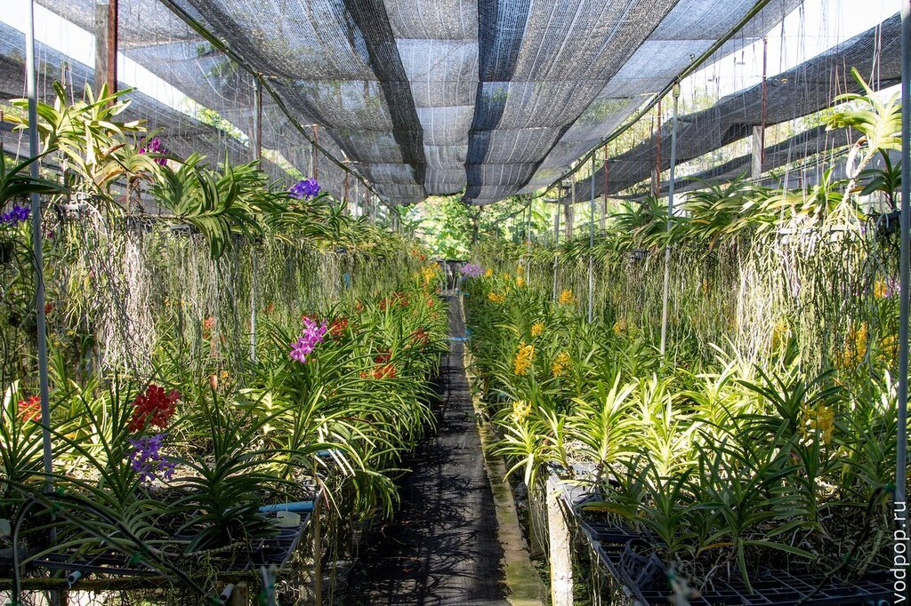
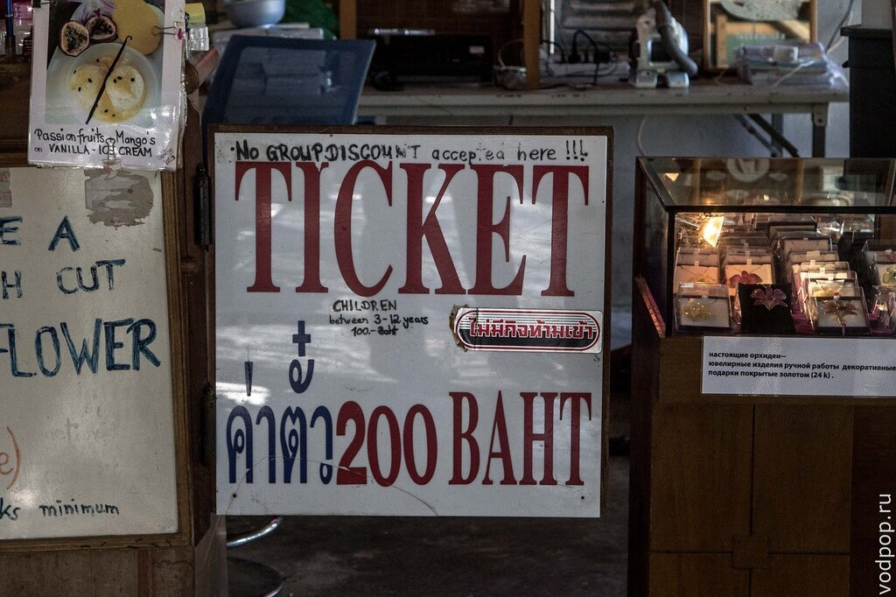
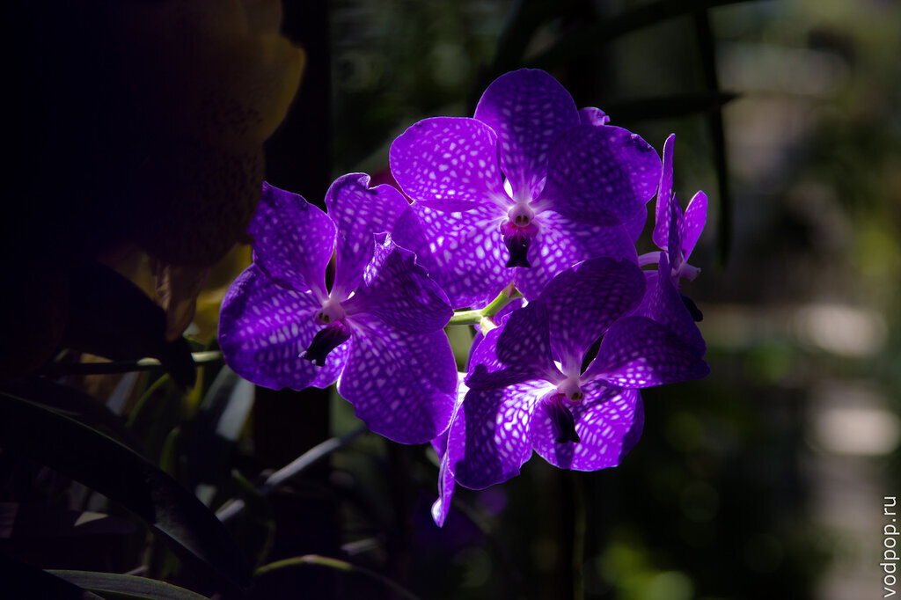
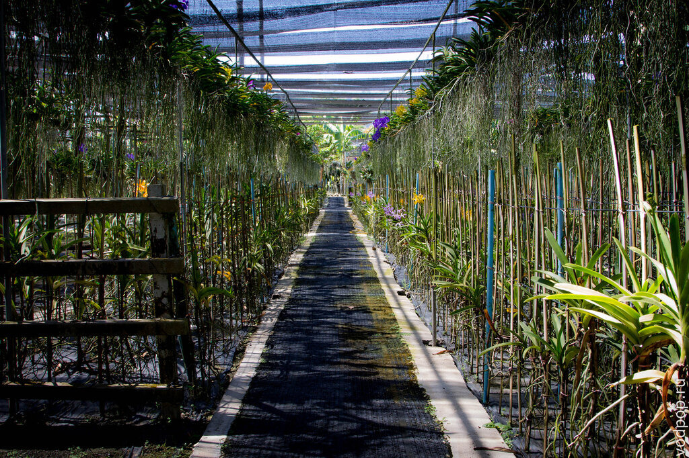
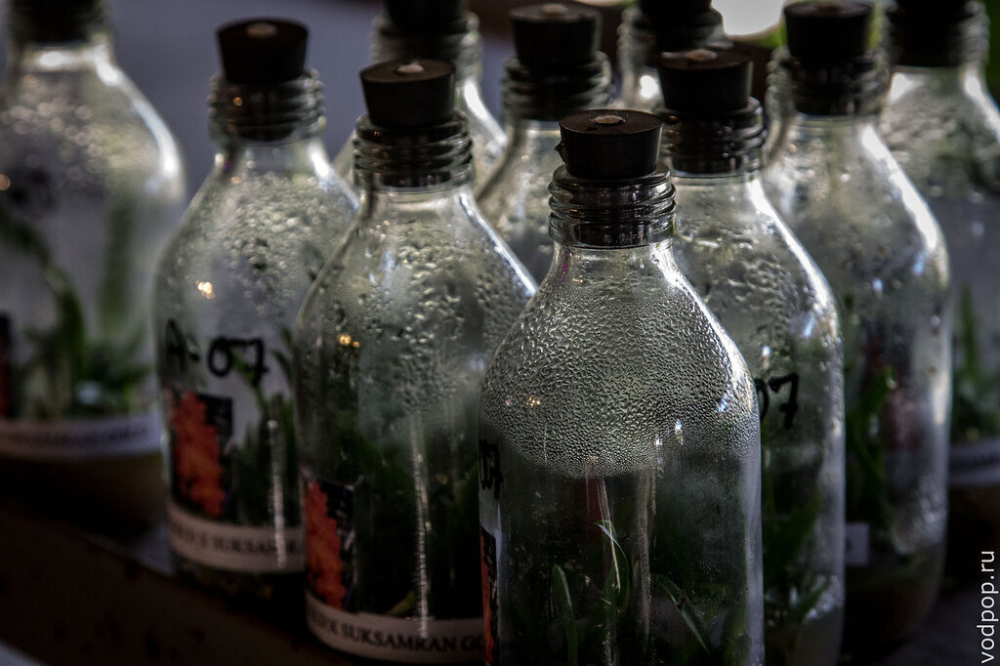
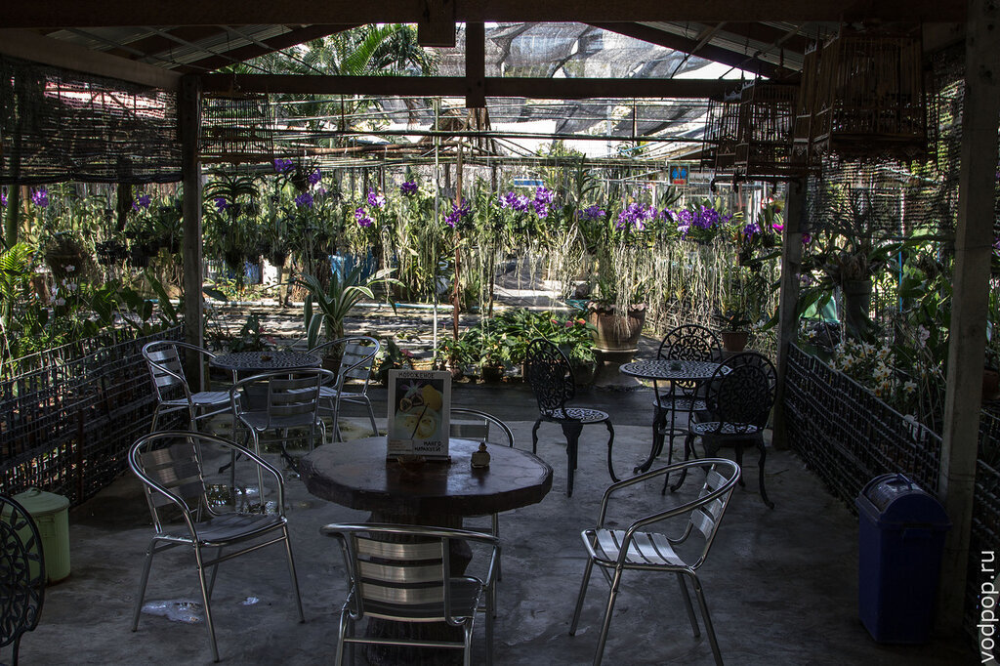
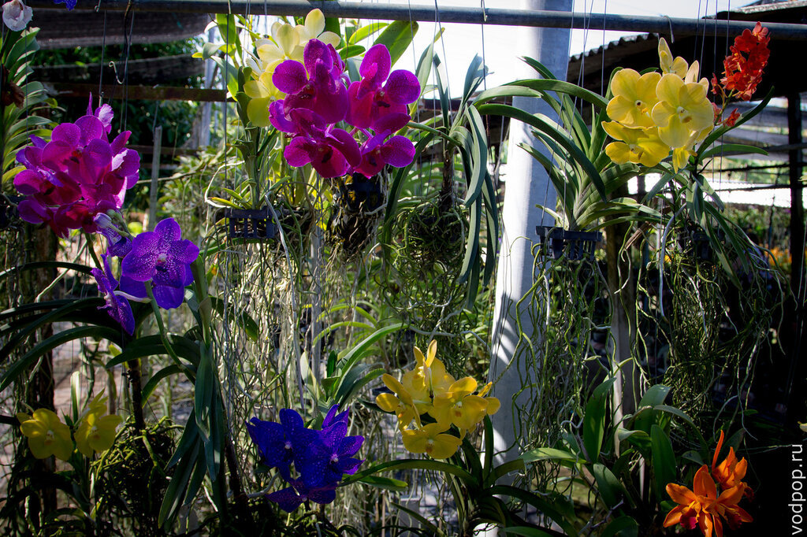
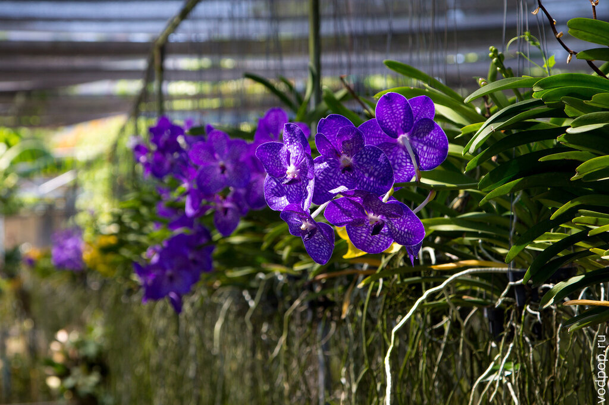
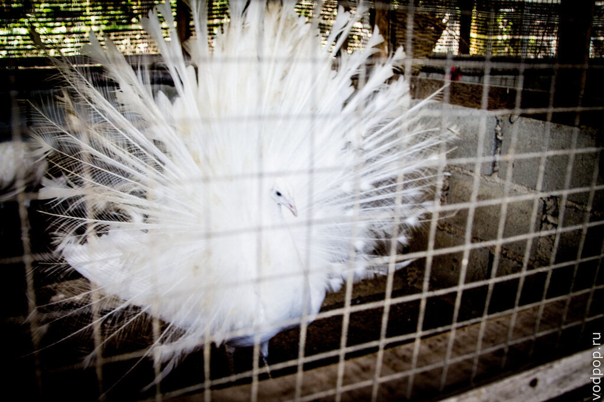
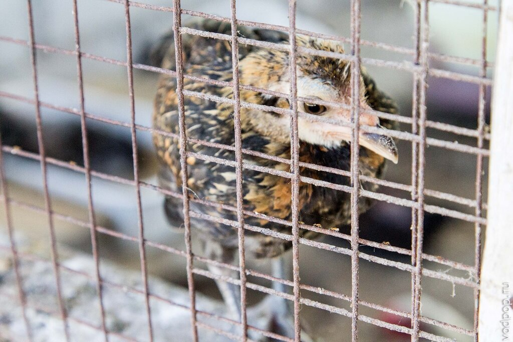

Сад орхидей на Пхукете обязательно понравится тем, кто любит эти цветы во всем их многообразии и великолепии, а также любителям птиц и зверей - на ферме есть свой маленький зоопарк.

<!--more-->

Сад орхидей, который на всех указателях и путеводителях указан как Orchid Farm, находится в районе Чалонга. Для туристов, которые живут на Кате и Патонге, будет проще всего арендовать байк и съездить туда самостоятельно, заодно посмотрев и [Большого Будду](https://vodpop.ru/bolshoy-budda-na-phukete/ "Большой Будда на Пхукете. Покатушки на слонах и прекрасный вид на город") - одну из самых главных достопримечательностей Пхукета, находящуюся в паре километров от сада орхидей.

Несмотря на сопротивления мужской части нашей компании, мы все получили удовольствия (ведь получили?!) от посещения сада. Первое, что немного смущает - цена. По меркам Таиланда просто неприлично высокая - целых 200 бат.

Но сад орхидей это место, исключительно ориентированное на туристов, поэтому, заглушив нашу жабу, мы купили билеты, и пошли во внутрь сада. Кстати, девушкам вместе с билетиком дарят небольшой букетик - мелочь, а приятно.

Видов орхидей тут великое множество - ряды кажутся нескончаемыми.

Каждый вид орхидеи по-своему прекрасен. Этот удивительный цветок способен радовать глаз своим цветением до полугода, затем нужно дать 3-4 месяца отдыха, и она снова будет радовать ваш глаз. По этой причине в магазине около кассы продают множество семян и луковиц  - многие пытаются повторить красоту у себя дома (хотя удается единицам). Цены варьируются от 250 до 3000 бат.

Так как орхидеи не любят прямых солнечных лучей, на территории всего сада натянуты сетки, которые спасают от солнечного удара не только цветы, но и посетителей.

Кстати, девушка на кассе - из Прибалтики, поэтому она отлично понимает по-русски, и многие надписи в саду орхидей переведены: например, на столике стоит реклама мороженого с манго и маракуйей на русском языке

Запах у орхидей бывает разный - от нулевого (почти полное отсутствие) до ярко-выраженного сладкого аромата. Вкуснее всех пахнут светло-бежевые и желтые цветки. Обратите внимание, что в саду орхидей на Пхукете нет привычных нам в России огромных цветов с ароматом, который заполняет сразу всю комнату, стоит в ней оставить хотя бы один цветочек. Здесь все запахи очень легкие.

Когда осознаешь весь масштаб работы по уходу за довольно капризными цветами, то понимаешь, что 200 бат - не такая уж высокая цена. Тут и там ходят тайцы, что-то скребут, поливают, сажают, переставляют...

Нравится статья? Узнавайте первым о выходе новых интересных историй! Подпишитесь на нас по [эл. почте](http://feedburner.google.com/fb/a/mailverify?uri=vodpop&loc=ru_RU) или в [группе ВКонтакте](http://vk.com/vodpop)

Все ради такой вот красоты

А если пройти вглубь сада орхидей и повернуть направо, то упретесь в клетки с птицами. Кого тут только нет! Курицы, петухи, фазаны, павлины - мы проверили минут 10, пытаясь заставить последних открыть свой хвост. Нам удалось

Другие птицы были не столь рады нашему появлению и недовольно поглядывали из своих клеток

Если у вас выдался свободный час и вам не жалко 200 бат, то советуем съездить в сад орхидей на Пхукете и полюбоваться на эту красоту своими глазами.

## Цены:

- дети до 3х лет - бесплатно;
- от 3 до 12 лет - 100 бат;
- старше 12 лет - 200 бат

Групповых скидок нет.

## Режим работы:

- с 9.00  до 17.30

## Как добраться:

- взять такси или тук-тук, сказав "Orchid Farm Chalong". Последнее уточнение крайне важно, ведь на Пхукете есть несколько садов орхидей - более известный PHUKET ORCHID GARDEN & THAI VILLAGE находится по дороге в сторону Аэропорта (на всякий случай ссылка на их сайт [http://phuketdir.com/thaivillage/](http://phuketdir.com/thaivillage/) )
- самостоятельно на байке. Координаты сада орхидей на Пхукете: 7.818462, 98.334314
- сориентировавшись на месте - если ехать по главной дороге со стороны Ват Чалонг и Централ Фестиваль до пляжа Раваи, то справа увидите небольшой белый знак с красными буквами Orchid Farm
- по карте

<iframe style="border: 0;" src="https://www.google.com/maps/embed?pb=!1m14!1m8!1m3!1d3952.7306217449714!2d98.33414330000001!3d7.818312149999999!3m2!1i1024!2i768!4f13.1!3m3!1m2!1s0x30502f1398225fef%3A0x2e8fc0c5e1f57022!2s3025!5e0!3m2!1sru!2sru!4v1394116665224" width="600" height="450" frameborder="0"></iframe>

 

## Сайт:

- [http://phuketdir.com/phuketorchid/](http://phuketdir.com/phuketorchid/)
