Во время нашего путешествия по острову Палаван нам посчастливилось увидеть самые красивые острова Филиппин - Coconut Island, German Island и Exotic Island.

<!--more-->

В тот момент мы остановились в Сан Висенте, маленьком и уютном городке, куда невероятно [трудно добраться](https://vodpop.ru/palavan-foto/ "Неизведанный Палаван: Сан Висенте") из-за плохих дорог. Но поверьте,  это  стоит того! Неподалеку находится самый красивый пляж Филиппин - Лонг Бич (Long Beach), о поездке на который мы написали [статью](https://vodpop.ru/samyj-dlinnij-plaj-na-filippinah/ "Лонг Бич: самый длинный пляж на Филиппинах") с множеством прекрасных фотографий. Но это далеко не полный перечень природных красот, которые находятся в этом районе.

Итак, самые красивые острова Филиппин мы посетили благодаря Стиву, владельцу гостиницы Peace and Love Resort ( о том, где еще можно остановиться в Сан Висенте читайте [тут](https://vodpop.ru/gde-ostanovitsa-v-san-vincente/ "Где остановиться в Сан Винсенте на Палаване: 10 лучших мест") ), который помог решить проблему с поиском лодки, готовой отвезти нас на острова.

Стив сказал, что пару лет назад было проще, а теперь лодочникам требуется специальная лицензия на перевозку туристов. Поэтому на весь Сан Висенте Побласьон ( тот район, где мы остановились) это себе смогли позволить только три лодочника, но и те в наши даты были недоступны. Хотя лодок в Сан Висенте более чем достаточно.

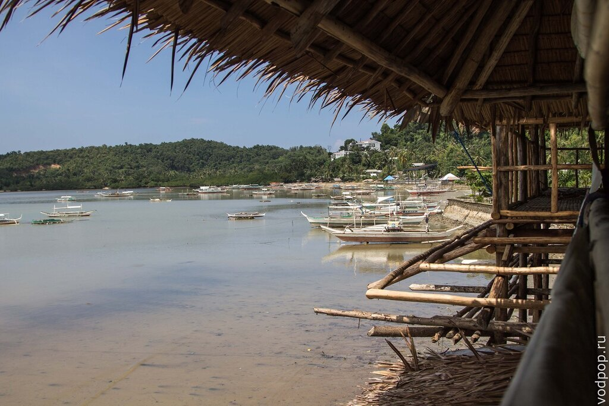

Был велик соблазн подойти и договориться с кем-то из частников, но нас отговорили от этой затеи, так как если лодочника "застукают" за нелегальной перевозкой туристов, его лишат лицензии и заставят выплатить большой штраф.

Мы, а точнее Стив, все-таки договорился с лодочниками на 9.30. Но пожив несколько недель на Филиппинах, мы уже привыкли к тому, что эта супер-медлительная и никуда не спешащая нация никогда не делает ничего вовремя, поэтому мы позволили себе поваляться лишние полчаса в нашем уютном гестхаусе Picardal Lodge, а позже еще посидели полчаса на солнышке в ожидании нашего проводника.

Наконец-то все собрались в лодке, и мы поплыли в сторону первого острова Coconut Garden.

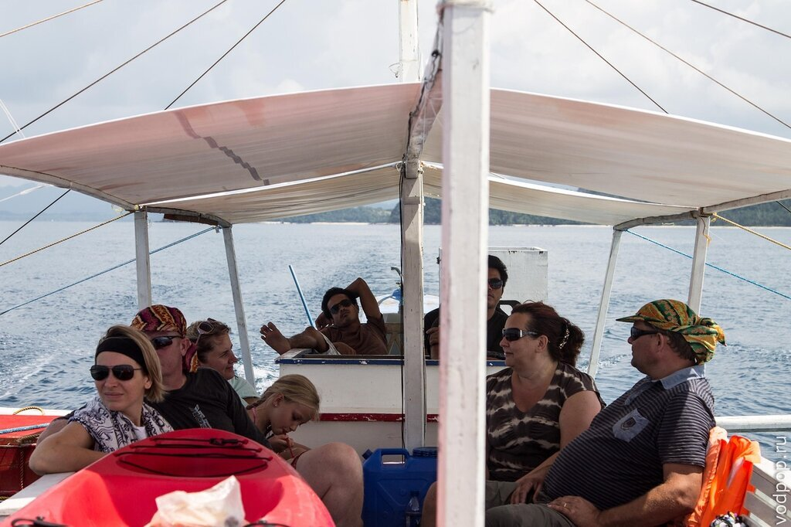

С нами плыли постояльцы Peace and Love Resort, с некоторыми из которых мы познакомились накануне и даже пообщались на русском языке с туристами из Эстонии.

На Coconut Island живет семья из 6 человек: папа, мама и дети, и столько же собак. Они следят за островом, встречают гостей, угощают кокосами и убирают всю территорию. Как в моей любимой книжке "Маленький принц": проснулся, убери свою планету. Вот так и они каждый день следят за своим маленьким островом.

Их домик

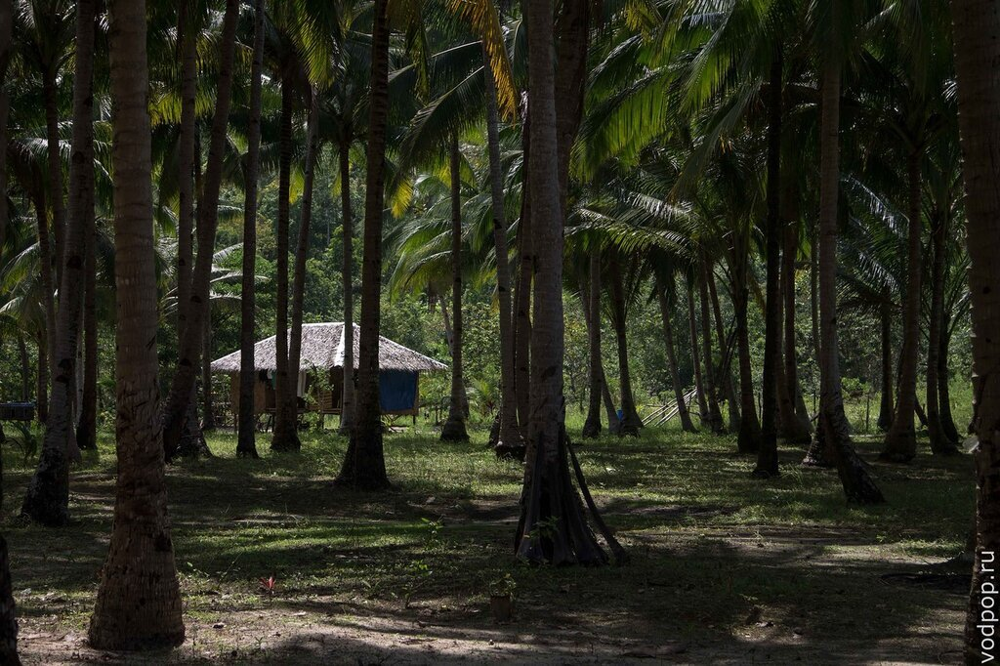

Один из четвероногих членов семьи

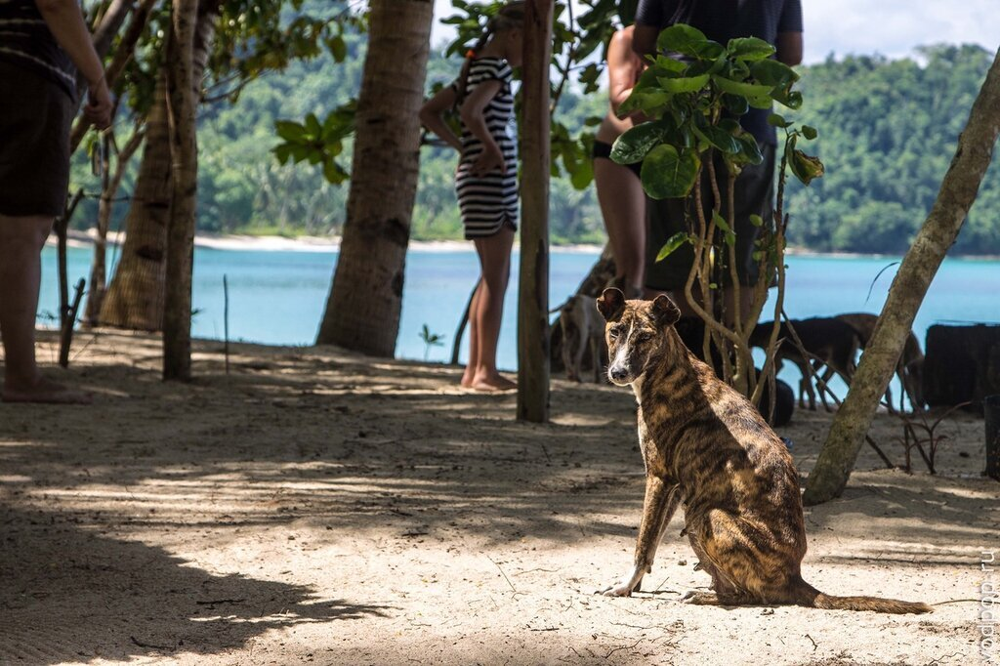

Собаки на Филиппинах ведут себя совершенно по-особенному, не так как в России. Они редко обнюхивают тебя, стараются держаться на расстоянии, почти никогда не лают, не кусаются и не гоняются за мотоциклистами и велосипедистами. А еще они с удовольствием едят кокосы.

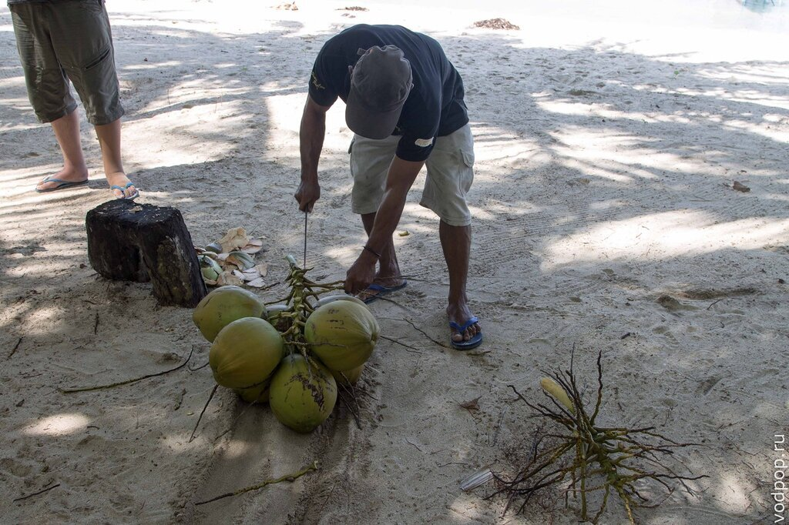

Кокосы на Филиппинах не такие вкусные, как в [Таиланде](https://vodpop.ru/bangkok-otzivy/ "Наши впечатления от Бангкока"), но в сочетании с молоком и колотым льдом просто потрясающие! Этот напиток (кокос+молоко+лед) тут называют буко (buko). Его продают в большинстве туристических мест, хотя его любят не только туристы, но и местные: буко очень освежает.

Если присмотреться на фото, то можно увидеть  главу семьи, который очень ловко и быстро взобрался на пальму, чтобы угостить гостей острова (то есть нас) свежим кокосовым соком.

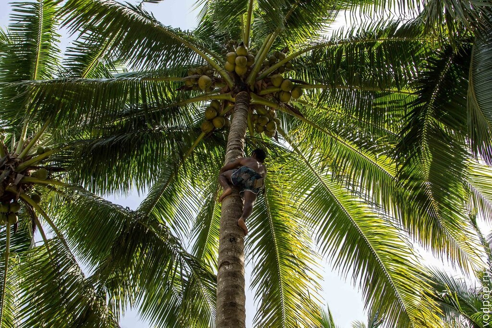

Он проделал это с невероятной скоростью: 30 секунд, чтобы забраться наверх и еще пару минут, чтобы привязать к веревку связку кокосов. Моей первой мыслью было "почему он их просто не скинет?", но потом стало понятно, что высота довольно приличная и кокосы просто разобьются.

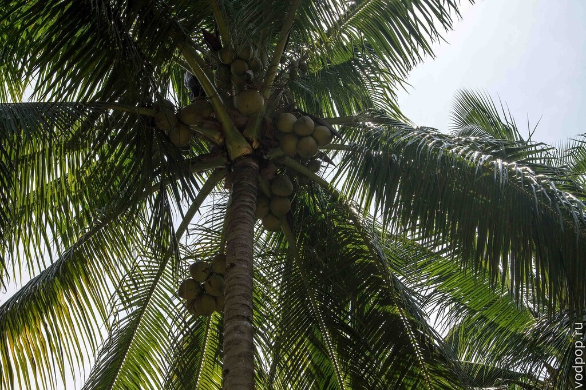

К слову об этом: в голове большинства россиян при слове "кокос" сразу всплывает реклама шоколадного батончика Баунти. Вот ведь грамотные маркетологи, которые год за годом заставляли нас верить, что кокос выглядит как мохнатый коричневый плод!

На самом деле плоды кокоса зеленые, а тот самый коричневый и мохнатый находится внутри зеленой шкурки. А еще падение кокосов не так романтично, как показано в рекламе - это очень опасно! Ежегодно от падения кокосов на Филиппинах погибает около 150 человек (как будто им стихийных бедствий мало). Так что мы под пальмами ходили только в шлемах, либо вообще не ходили.

Помимо этого, в пальмах есть и еще одна интересная особенность,  которая встречается в ЮВА повсеместно: на каждой пальме есть обязательные засечки, которые наносят, пока пальма растет. Примерно каждые 50-70 сантиметров. Это сделано как раз для того, чтобы местные могли буквально взлетать за кокосами и обратно. Почему я написала "местные"? Да потому что иностранцу, даже хорошо физически подкованному, будет крайне нелегко преодолеть многие законы физики, чтобы добраться до заветного плода. Попытка Климентия.

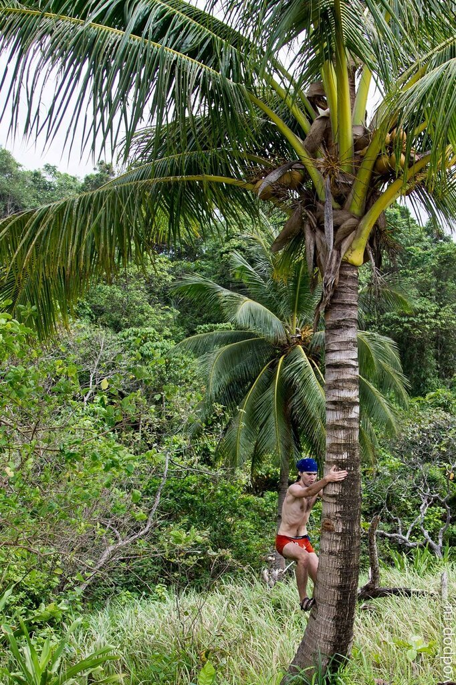

Подрастающие поколение филиппинцев не могут не радовать своим добродушным весельем и непосредственностью. А еще все филиппинские дети очень симпатичные.

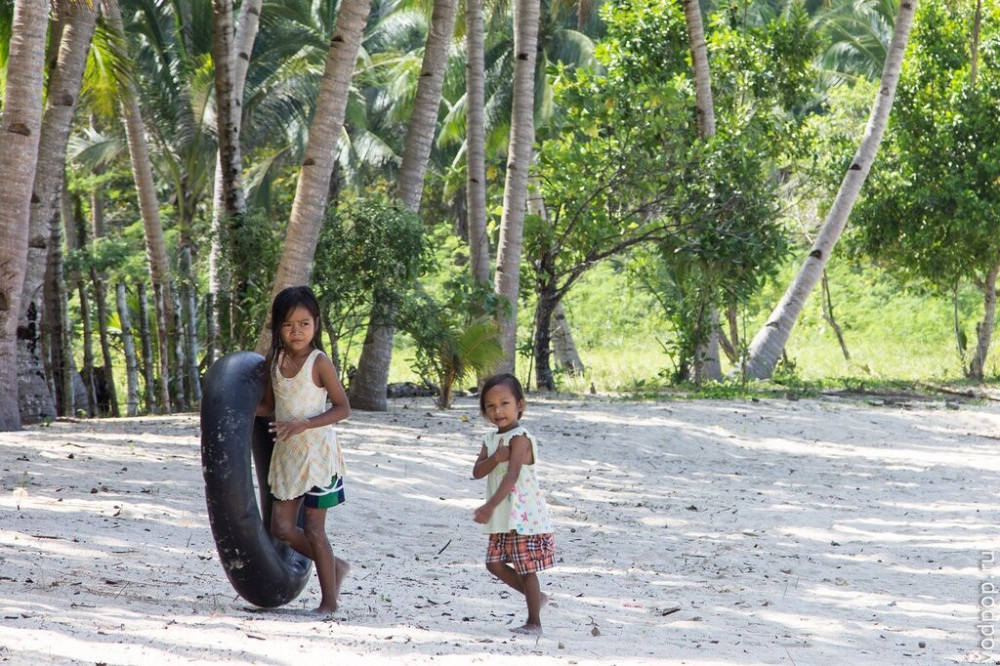

Райский вид с острова

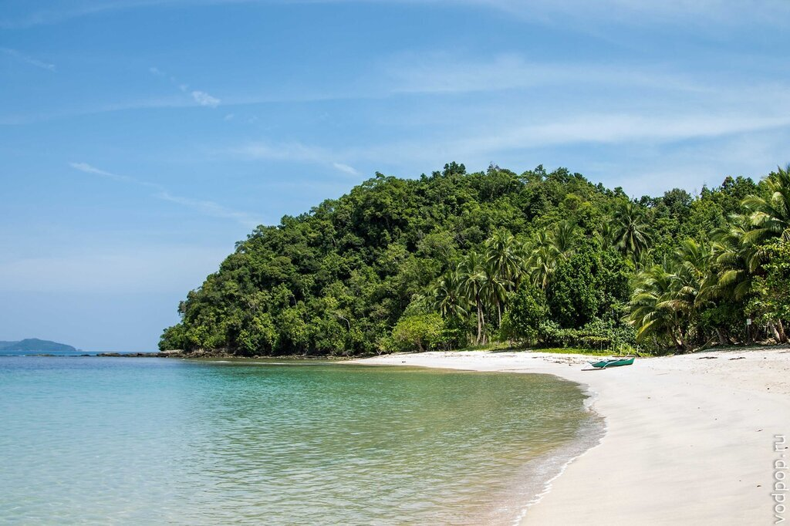

Нравится статья? Узнавайте первым о выходе новых интересных историй! Подпишитесь на нас по [эл. почте](http://feedburner.google.com/fb/a/mailverify?uri=vodpop&loc=ru_RU) или в [группе ВКонтакте](http://vk.com/vodpop)

Пора отправляться дальше, хотя тут очень красиво

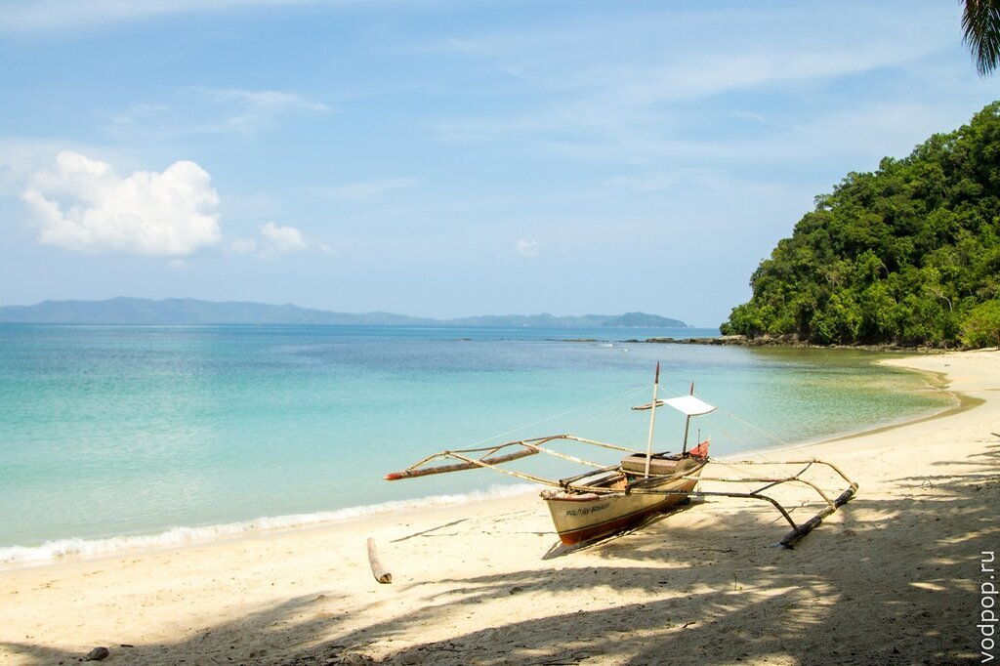

Следующий остров - German Island

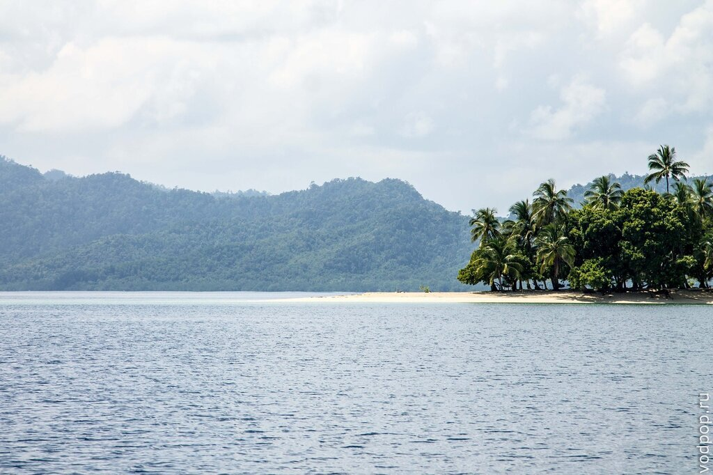

На этом острове мы провели больше всего времени. Пока мы плавали с масками,

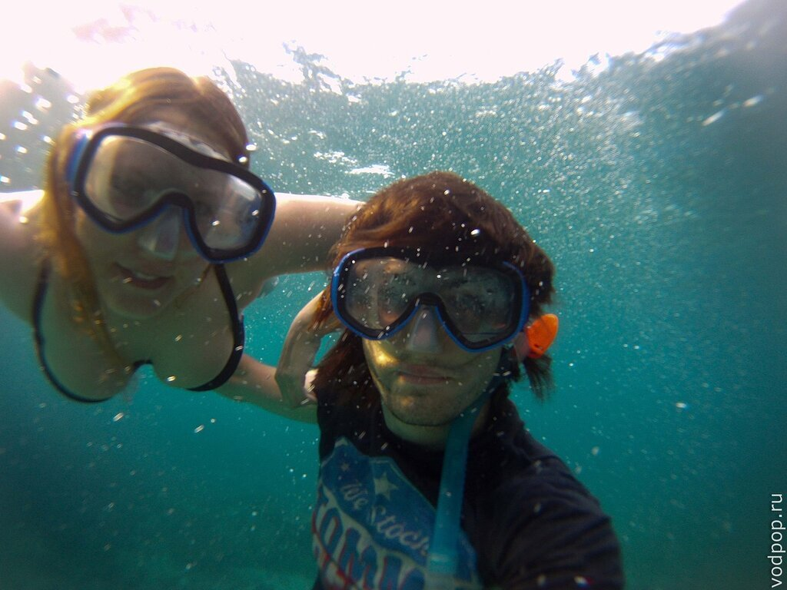

валялись в гамаке,

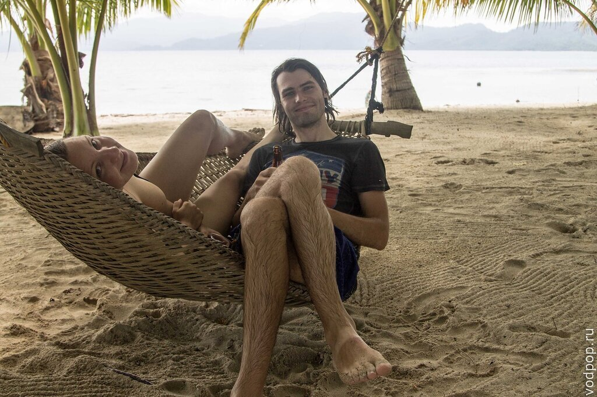

и плавали на байдарках,

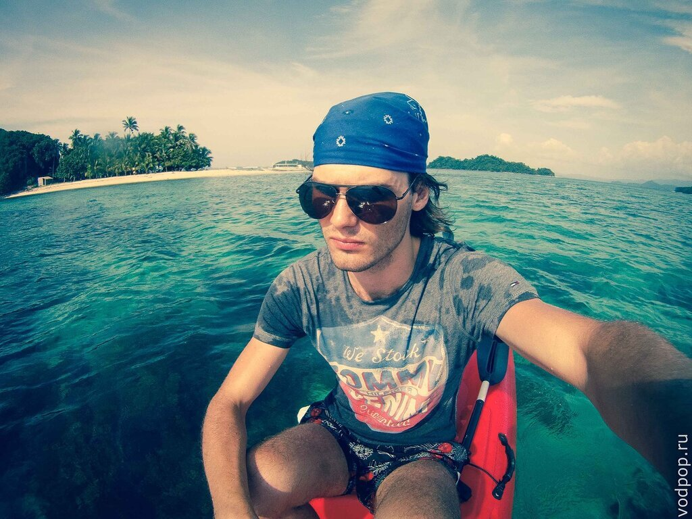

наши проводники готовили наш обед, который не попал на фотографии, потому что мы были дико голодные! Все потому, что на Филиппинах почему-то не принято поджаривать мясо и рыбу - они коптят. Этот процесс довольно длительный и вкус, на мой взгляд, сомнительный.

Овощи на Филиппинах и вполовину не такие вкусные, как в России, а салаты они готовят довольно странным образом. Любимая заправка для овощей - уксус. Мы к такому не сильно привыкли, поэтому по началу удивлялись. Зато можно смело есть тушеные овощи - вкус очень похож на привычный нам.

К счастью, на Филиппины едут не за помидорами и огурцами, а за невероятной природой.

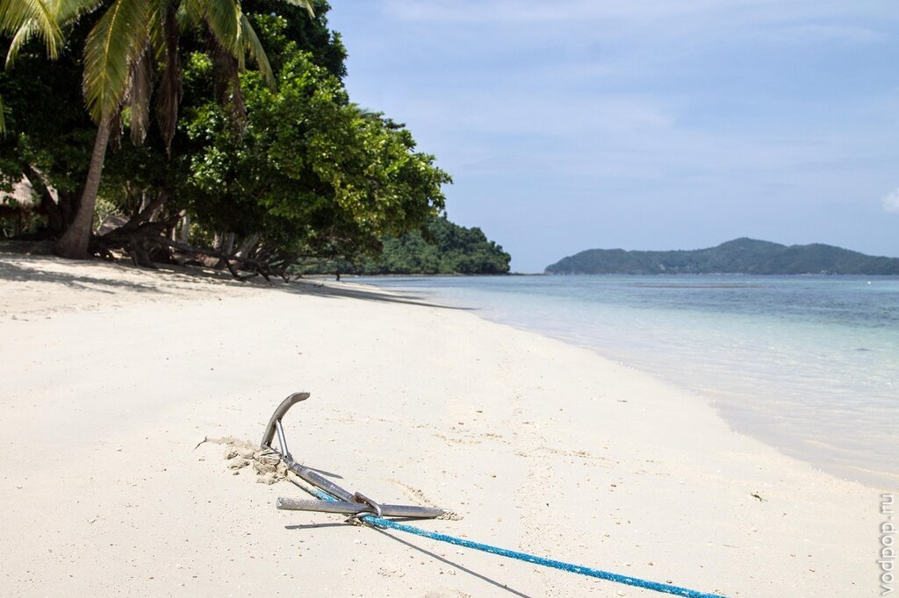

Снорклинг на Филиппинах - одно из самых популярных развлечений. Нам предоставился шанс посетить подводный мир самых красивых островов Филиппин. Оборудование: маска, трубка, ласты - входило в стоимость тура.

<iframe src="//www.youtube.com/embed/t54LzRGa3FE" width="853" height="480" frameborder="0" allowfullscreen="allowfullscreen"></iframe>

Не удивительно, что к последнему из островов - Exotic Island у нас кончились почти все силы.

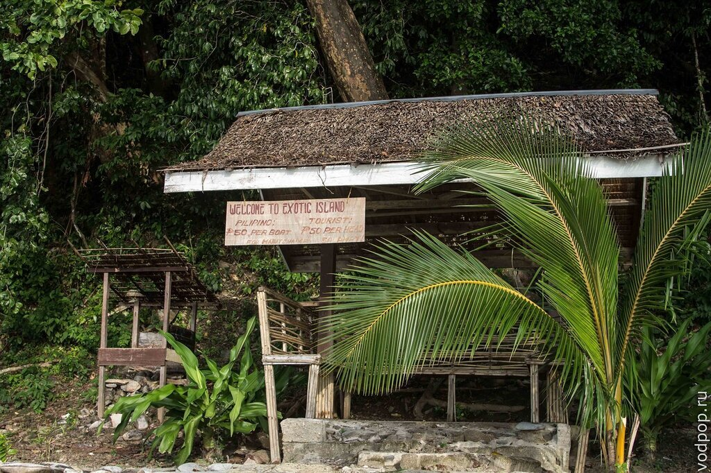

Обратная дорога заняла совсем немного времени. Нас встретил трицикл, который довез нас до нашей гостиницы, где мы, уставшие и довольные, рухнули "отдыхать", обсуждая самые яркие картинки прошедшего дня.

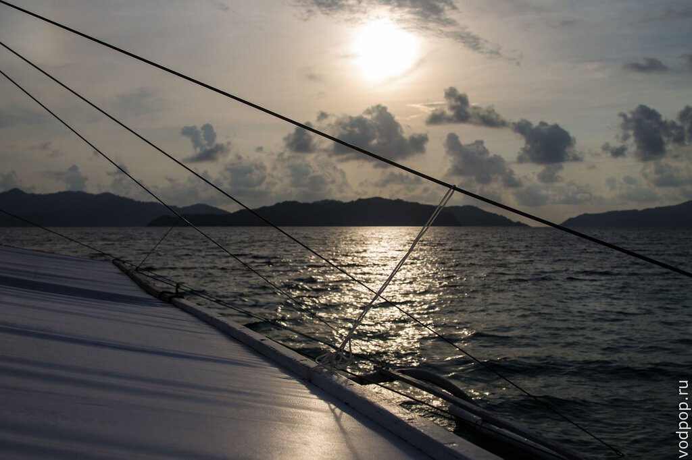

Дальше полезная информация для тех, кто собирается съездить в Сан Висенте и увидеть самые красивые острова Филиппин своими глазами.

###### Цена:

2000 песо на двоих с бесплатным трансфером от отеля + 300 песо за напитки

###### Продолжительность:

10.30 - 16.30. Но нас никто не торопил, к концу вечера уже сами устали. Уверена, если вы захотите задержаться на часок, вас никто ограничивать не будет.

###### Полезности:

- хорошенько намажьтесь солнцезащитным кремом и не забывайте повторять эту процедуру после каждого купания. Солнце на Филиппинах очень жаркое
- возьмите с собой бутылку воды, а лучше две. Во-первых, вам все время будет хотеться пить, а во-вторых, напитки в обед не входят (мы заплатили 300 песо сверху, что, впрочем, не так уж дорого за 5 напитков, это при том, что мы брали свою воду)
- головной убор обязательно взять с собой и не снимать даже в воде! Мы купили удобные банданки за 50 песо в ТЦ Робинсон в [Пуэрто-Принцессе](https://vodpop.ru/chem-zanatsa-v-puerto-princesse/ "Чем заняться в Пуэрто-Принцессе: Хонда Бэй, гостиницы и рестораны"), магазин называется Bench
- если у вас есть носки или спец.обувь для рифов - берите с собой. Во время снорклинга есть шанс поцарапать ноги, так как дно довольно близко
- если хотите заниматься снорклингом на Филиппинах дольше 5 минут, одевайте футболку с длинным рукавом. Можно купить на месте за 30 песо - это спасет вашу спину, плечи и руки от жутких ожогов и облезания кожи.
- возьмите с собой камеру для подводной съемки. Многие обитатели подводных глубин относятся к людям довольно доверчиво и разрешают себя поснимать. Не упускайте эту возможность!
- прихватите с собой связку бананов - это поможет дождаться обеда
- если вы вегетарианец, берите свою еду с собой. С нами была девушка, для которой забыли взять подходящую еду. Она была очень недовольна и голодна
- берегите голову под кокосовыми пальмами. Всегда можно прикрыться руками. Лучше уж сломанные руки, чем  голова.

###### Дополнительно:

Есть информация, что из Порт Бартон (Port Barton) ходят лодочные экскурсии на те же самые острова, и там меньше проблем с поисками лодок, так как это чуть более развитое с точки зрения туризма место, чем Сан Висенте Побласьон.  Стоимость от 1200 песо за двоих.

Не забывайте оставлять комментарии!
