В один из дней нашего пребывания в Сан Висенте мы решили увидеть своими глазами самый красивый и длинный песчаный пляж Лонг Бич (Long Beach) на Филиппинах. 14 км белоснежного песка и чистейшего океана привели нас в полный восторг!

<!--more-->

Я позаимствовала карту Сан Висенте Поблальсон (San Vicente Poblacion) в гостинице Peace and Love Resort. Кстати, именно напротив нее стоит единственный в Сан Висенте указатель на Лонг Бич.

 Палаван")

В качестве отправной точки для поездки на Лонг Бич я отметила Picardal Lodge, где мы останавливались на несколько дней с Климентием. О том, где еще можно переночевать в Сан Висенте, читать [тут](https://vodpop.ru/gde-ostanovitsa-v-san-vincente/ "Где остановиться в Сан Винсенте на Палаване: 10 лучших мест").

Как я уже писала [ранее](https://vodpop.ru/palavan-foto/ "Неизведанный Палаван: Сан Висенте"), мы приехали в Сан Висенте на арендованном мотоцикле Yamaha YBR 125 по дороге, которая даже не отмечена на картах. Ситуация с Лонг Бич почти такая же - ни на одной из известных нам карт пляж не отмечен. Зато местные хорошо знают дорогу и всегда готовы вам помочь.

На случай, если вы не очень коммуникабельны, на карте сверху я отметила желтым цветом маршрут от Picardal до того места, где мы свернули на пляж.

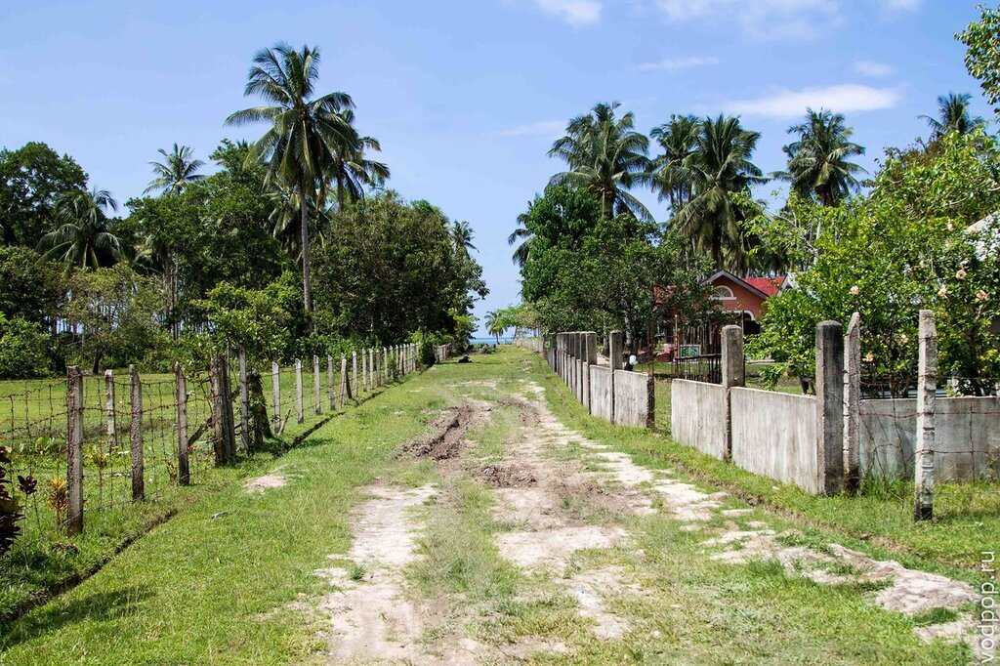

Лонг Бич разделен мною на 2 части: до красного крестика и после. Дело в том, что в этом месте речка впадает в море и объехать этот участок можно только вернувшись на основную дорогу (желтый цвет).

Я бы посоветовала ехать до того же места, где свернули мы (в 2013 году в 20 метрах от съезда на пляж заканчивался асфальт), так как в правом конце пляжа находится скалистое образование, куда можно загнать мотик и спрятать вещи так, что вас будет совсем не видно.

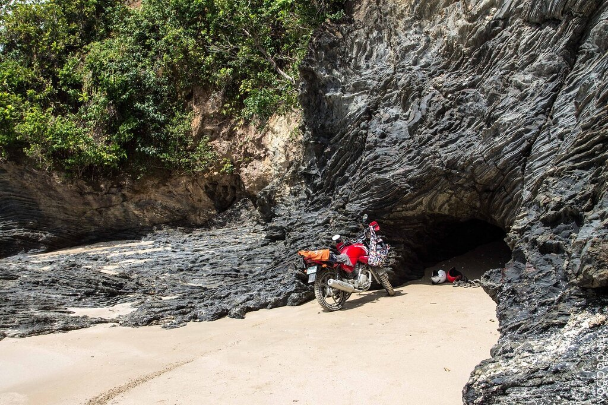

Лонг Бич нас сразу сразил белейшим песком, мягкими волнами и полным отсутствием людей. Четырнадцать километров белоснежного пляжа без единой души! Эмоции накрывали с головой.

 Палаван")

Справа видна скала, в которой мы спрятались.

 Палаван")

В этих углублениях можно спрятать вещи во время дождя. Мы так и сделали, когда темная тучка решила поплакать над нашими головами.

 Палаван")

Вид из пещеры.

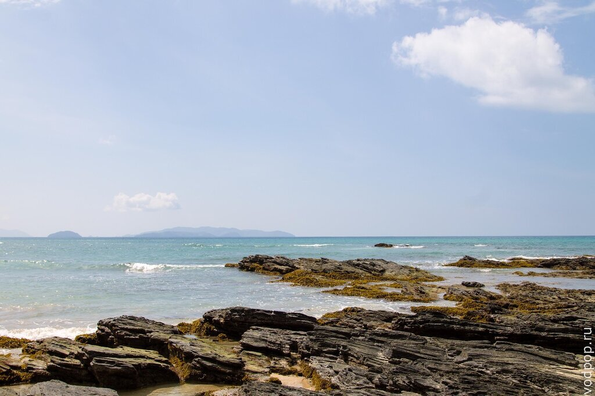

Этот пляж идеальное место, чтобы побыть наедине с природой. Без всяких ненужных барьеров в виде купальных костюмов.

Одна из немногих фото в одежде.

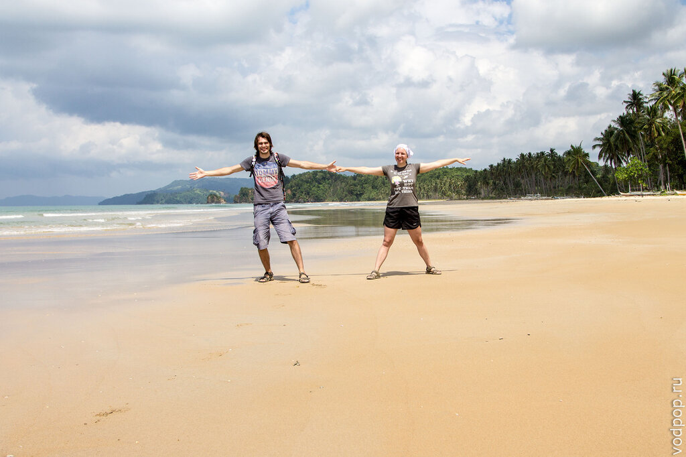

Климентий оторвался на все 100.

Накрутил восьмерок по пляжу.

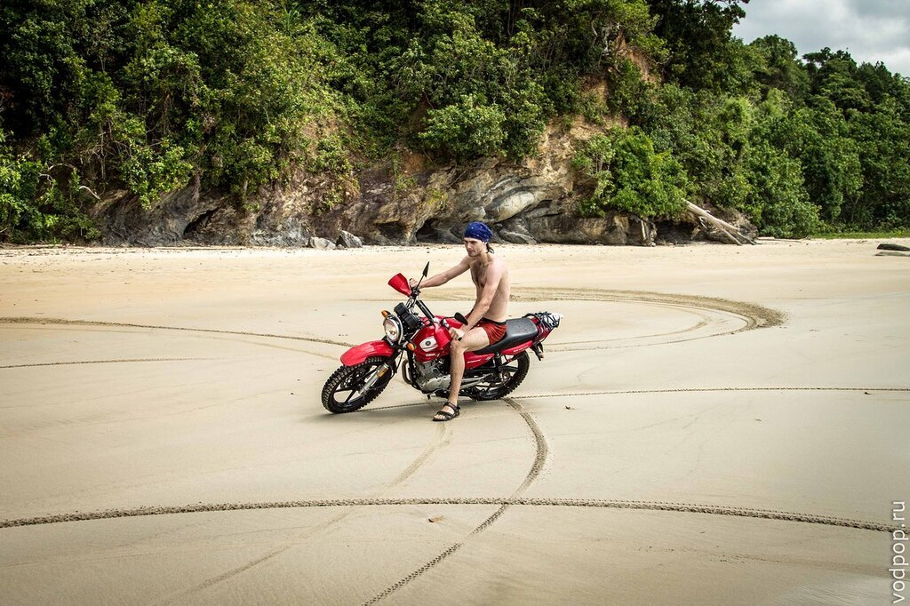

Не без огорчений. Пумба расстроился.

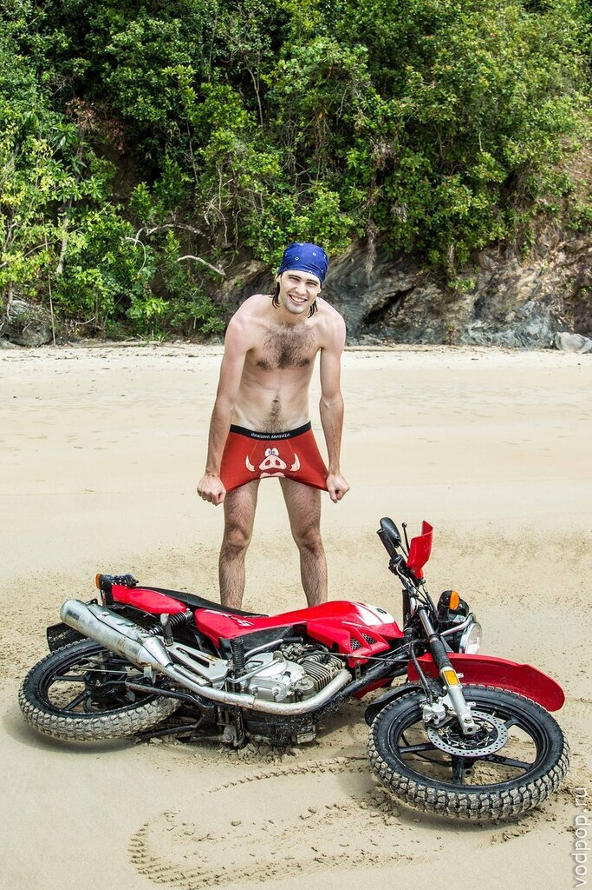

Потом мы увидели пальмы и вспомнили, как местные мальчишки, словно обезьяны, карабкались по специальным насечкам наверх. Климентий пытается это повторить.

Однако, пришлось довольствоваться водой из бутылки - кокосы не желали сдаваться. Пока Клим заползал наверх, написала веткой адрес нашего блога. PR-отдел не дремлет!

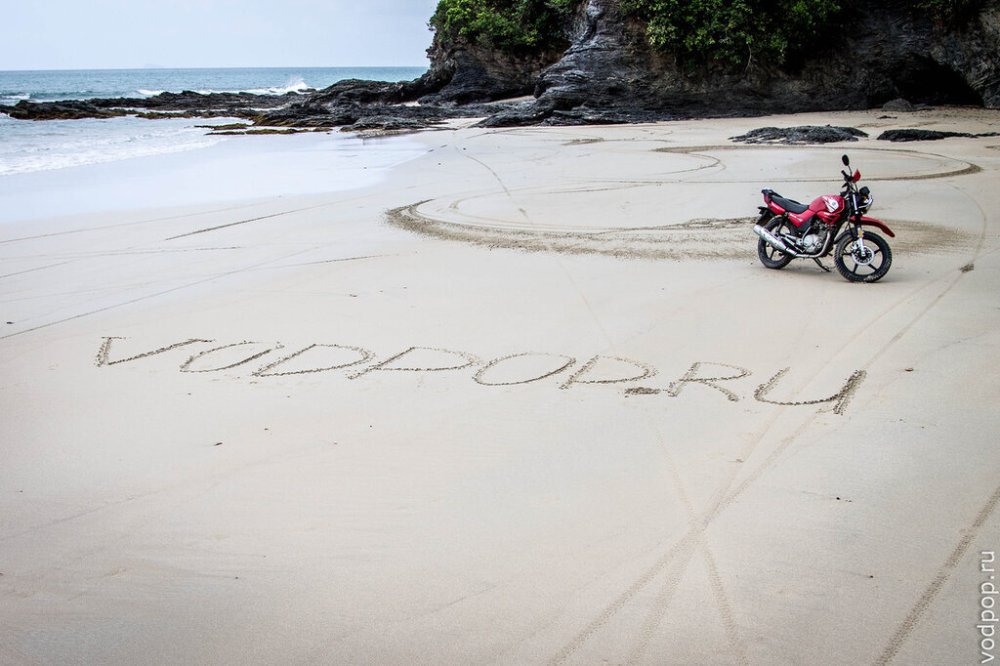

Затем вы увидели, как одной из банок (так называют местные лодки) идут два человека. Запечатлели момент, как рыбаки выходят в море.

Почти сразу же набежали тучи и начался дождь. Было немного страшно за рыбаков.

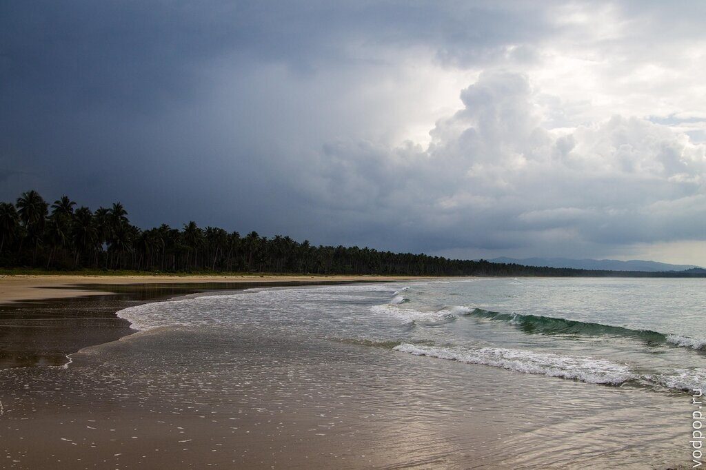

А мы тем временем купались и катались на большущих волнах. На всем Лонг Бич море очень спокойное. Волны есть только там, где скалы.

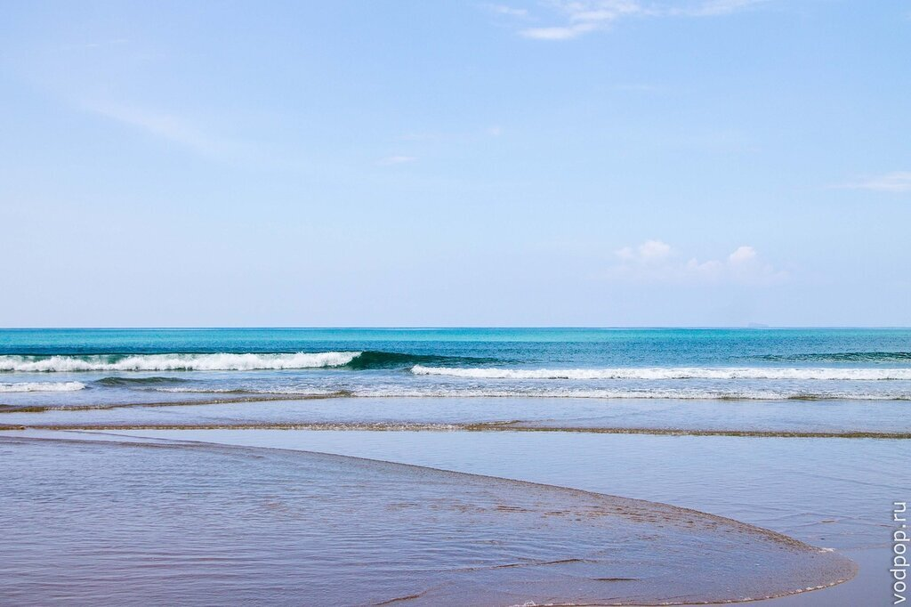

Немного уставшие от такого великолепия, мы стали собираться домой. Еще пару раз прокатились по пляжу, пытаясь еще лучше запечатлеть эти воспоминания.

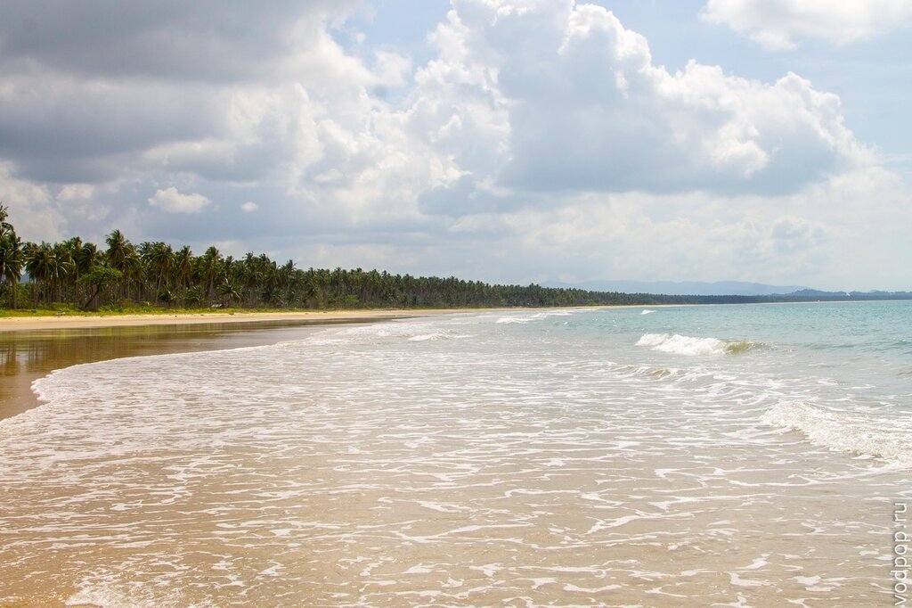

Обратный путь проходил крайне весело, так как местный домашний скот буквально не давал нам проехать.

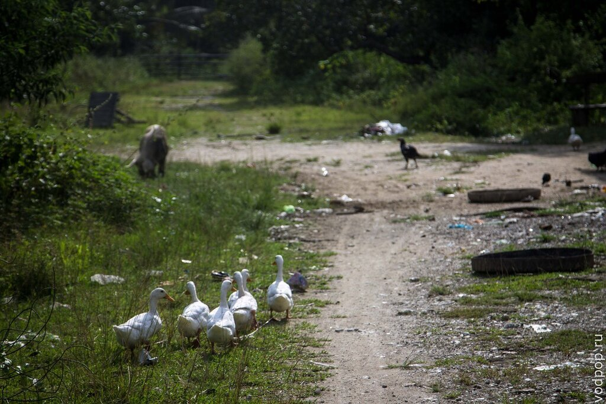

Если гуси испуганно разбегались прямо под колеса, то свиньи меланхолично проходили мимо.

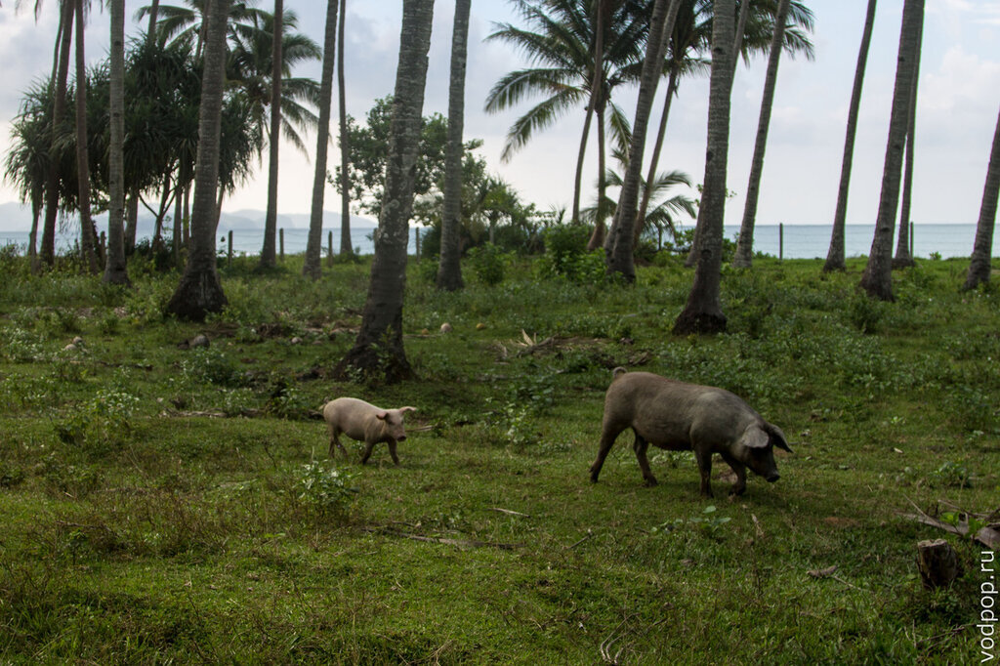

А некоторые предавались задумчивым мечтам о чем-то великом. Хотя судьба у хрюшек в этой стране одна - рано или поздно они станут pork adobo (местное блюдо из свинины).

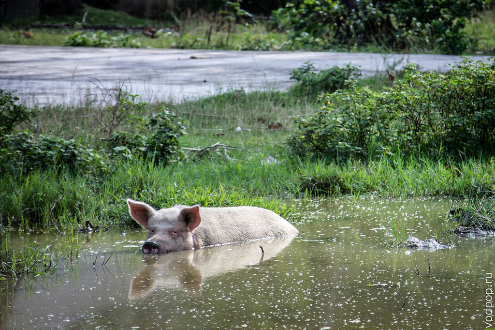

Вот так весело закончилась наша поездка на Лонг Бич, которая подарила столько потрясающих и ярких эмоций, которые останутся с нами на всю жизнь!

Если у вас есть вопросы, задавайте в комментариях, мы ответим!
