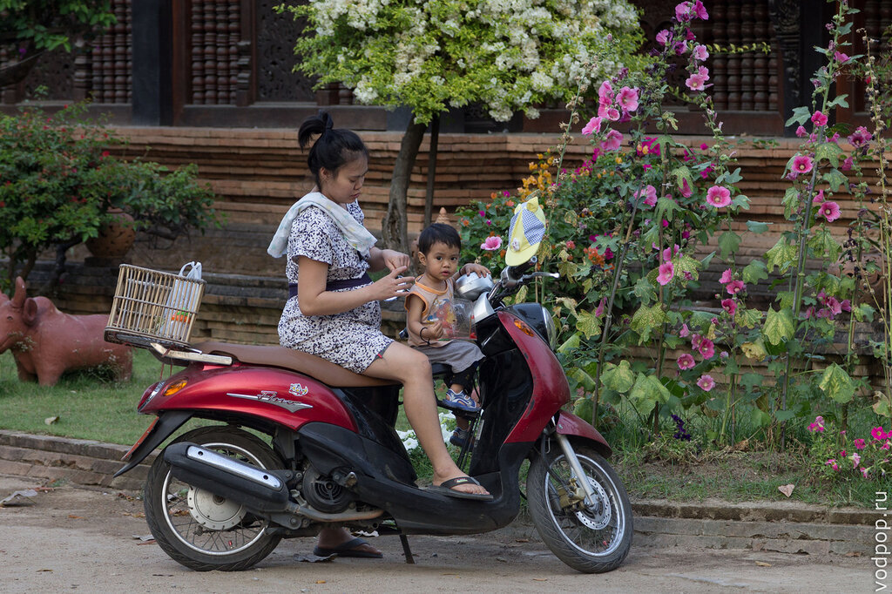
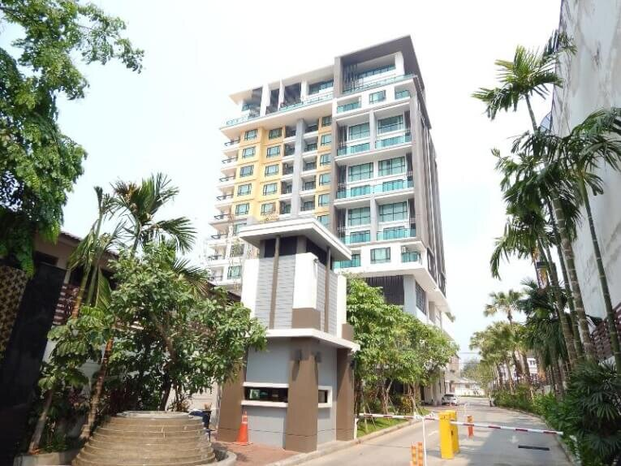
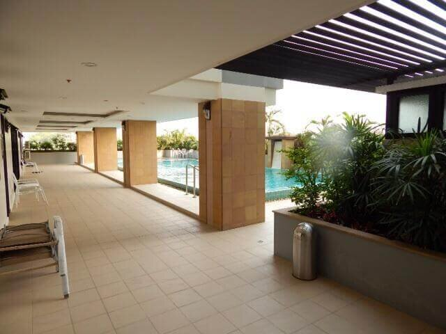
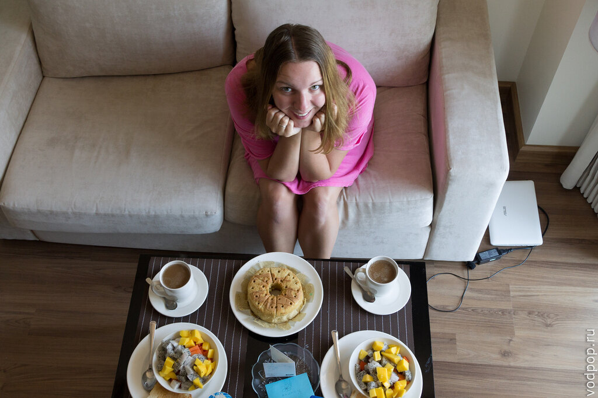
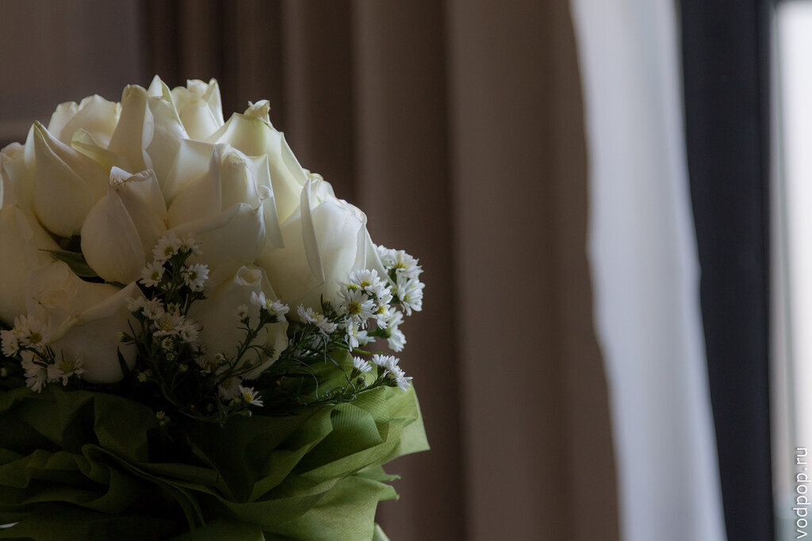
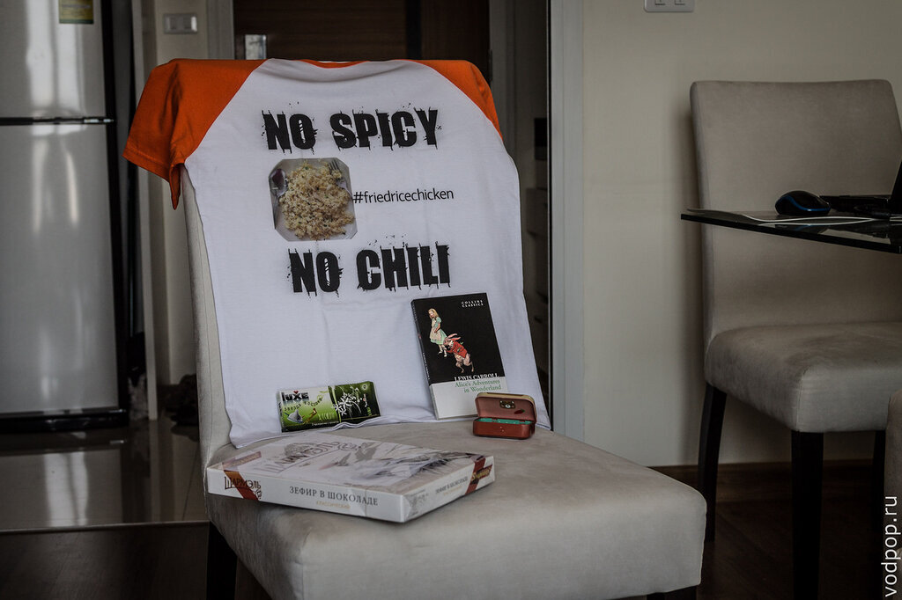

Будучи в [Хуа Хине](https://vodpop.ru/hua-hin/ "Хуа Хин — город, в котором хочется встретить старость") и не сумев купить билет на поезд до Бангкока, мы активно искали место, в которое мы хотели поехать и пожить там подольше. Решив, что Бангкок мы изучили достаточно хорошо, мы поехали в Чианг Май. Этот город тысячи храмов особенно популярен среди самостоятельных путешественников-бэкпекеров. Здесь не встретишь много 5-звездочных гостиниц, тут нет пляжа и меню на русском. Зато есть необыкновенной красоты горы, заповедники, храмы, озера и даже обсерватория!

<!--more-->

Комфортабельный автобус домчал нас до Чианг Мая, и рано-рано утром мы высадились у центрального автовокзала, где на наше счастье нашлась кофейня 24-часа. Мы забрались туда, и стали плотнее гуглить, где же находятся кондо. Вариантов было очень много, но в каждом из них люди называли какие-то существенные для нас недостатки. Отметив на карте точки, мы решили сразу арендовать байк и объездить кондоминиумы за день, чтобы выбрать что-то подходящее. Рюкзаки путешествовали с нами, что не назовешь особо удобным: одному человеку приходилось смотреть кондо, а второй караулил вещи.

Хотя тайцы без особых проблем возят сумки, детей и животных и не чувствуют особого дискомфорта

Надо сказать, что цены на кондо в Чианг Мае сравнительно высокие - спрос большой, а предложений мало. Самые интересные, конечно, на длительную аренду (от полугода). Найти вариант на 1-2 месяца за невысокую стоимость, с приятным ремонтом, минимум техники и нормальным вай-фаем не так уж легко.

Мы заехали в 3-4 кондо, но либо цены были слишком высокие, либо интернет на 12 квартир раздавался, либо уж совсем печально с мебелью. Немного взгрустнув, мы решили попытать счастья в еще одном месте - [Shine Condominium](www.theshinecondominium.com), на сайте которого не была указана цена.

Вид здания снаружи так и кричал "дорого!", но мы все-таки рискнули зайти и узнать цену на ресепшн: 20 тысяч бат. Для Таиланда, тем более для Севера, это очень большие деньги. Да и мы изначально рассчитывали на бюджет до 15 тысяч. Но стало любопытно, что же предлагают за такую сумму, и мы решили подняться и посмотреть номер.

Вид из окна Shine Condominium на город. Смог стоял дикий: лесные пожары.

Владелец здания - канадский пилот Neil. И это чувствуется. Все очень продумано именно для европейцев, а не для тайцев: есть фитнес-центр, бассейн и даже сауна. Все "плюшки" включены в стоимость.

Тренажерный зал

В квартире отдельная точка вай-фай, говорящие электрозамки, холодильник, стиральная машинка, гостиная и спальня, душ, два ЖК-телевизора. Постельное белье и полотенца входят в стоимость.

В общем, вы можете нас понять, почему мы не устояли и решили, что повышение уровня жизни повлечет за собой увеличение доходов. Так и получилось! Работать в таких условиях было очень и очень приятно.

Кусочек гостиной в день рождения Климентия. На торте остались дырочки от свечек.

Живые цветы с Ночного Рынка, который находится совсем неподалеку от Shine Condominium.

А это подарки друзей Климентия на день рождения: посылка EMS застала нас почти перед выездом из Чианг Мая.

Пожалуй, единственный негативный момент, связанный с данным кондо - уборка не включена в стоимость, и нас душила жаба платить по 750 бат. Зато все швабры-тряпки-ведра были предоставлены. А по выселении из кондо с нас пытались взять еще 1 тыс бат за финальную уборку, но мы отказались, сославшись на строчку в договоре, что данная уборка актуальна только для тех, кто прожил год в квартире.

_Совет:внимательнее читайте бумажки, которые подписываете._
