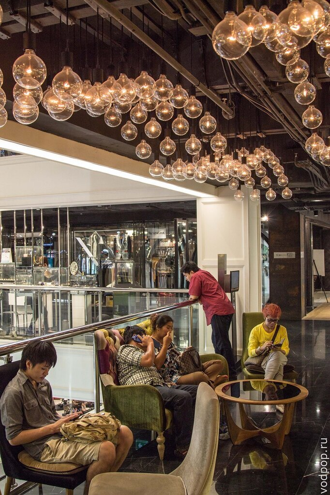
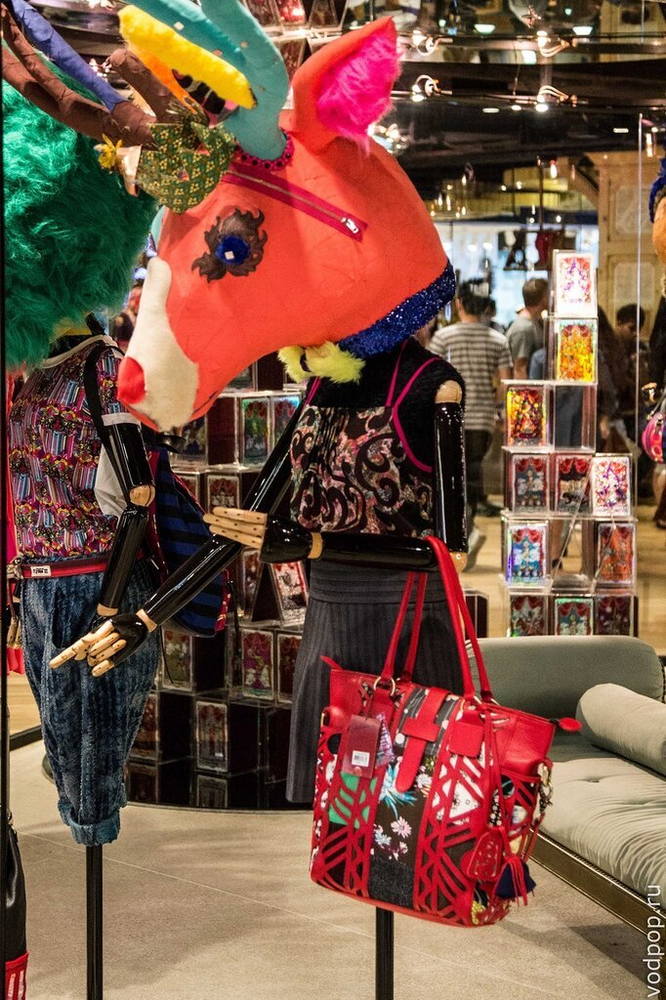

Если вы запланировали отпуск в Таиланде, и окажетесь в Бангкоке на пару дней, то настоятельно рекомендуем зайти хотя бы в один из торговых центров, совместив это с осмотром других достопримечательностей города.

<!--more-->

Шоппинг в Бангкоке - довольно приятное времяпрепровождение, особенно если спланировать свой маршрут таким образом, чтобы в самый солнцепек зайти в кондиционированное помещение торгового центра и насладиться радостью покупок. Лично мы не фанаты шоппинга, однако даже на нас произвело впечатление оформление магазинов - такого количества дизайнерских "фишек" не увидишь даже в журнале.

Тут тебе и манекены из проволоки, с головами оленя, вместо скамеек футуристические фигуры из металла и дерева.

Словом, даже если вы не любите сам процесс покупок, то вы все равно можете получить огромное удовольствие, просто гуляя по ТЦ.

Итак, 10 лучших мест для шоппинга в Бангкоке:

## 1\. Siam Paragom (Сиам Парагон)

Один из самых популярных торговых центров среди туристов и богатых тайцев. На 5 этажах расположено больше 250 магазинов, представлены бренды среднего и люкс-классов.  Можно купить одежду, электронику, книги, сувениры и даже последнюю модель Ламборджини или Порше. Помимо шоппинга можно запланировать посещение одного из самых больших океанариумов в Азии - Ocean World.

Сайт: [http://www.siamparagon.co.th/](http://www.siamparagon.co.th/)

Время работы: 10:00 - 22:00

Как добраться: станция BTS Siam.

Мы специально подготовили статью, которая расскажет, [как работает метро в Бангкоке](https://vodpop.ru/metro-v-bangkoke/).

## 2\. Centralworld (Централворлд)

Торговый центр, в котором можно купить одежду, последние новинки техники, дизайнерскую мебель по весьма демократичным ценам, а также зайти в банк, в салон красоты и даже покататься на катке.

Сайт: [http://www.centralworld.co.th](http://www.centralworld.co.th/)

Время работы: 10:00-22:00

Как добраться: станции BTS Chit Lom или Siam

## 3\. MBK (МБК)

Один из самых известных торговых центров в Бангкоке. Открыт в 1986 году и является одним из самых популярных шоппинг-моллов как у туристов, так и у местного населения. И это вполне обосновано - на 8 этажах этого центра вы сможете найти все, что только захотите.

Одежда от 10 до 10000 бат, сувениры, произведения ручной работы, картины, посуда, бытовая техника, бесчисленное количество телефонов и аксессуаров к ним, салоны красоты, массажа, фудкорт. После многочасового хождения вы можете заглянуть в  кинотеатр и посмотреть фильмы на английском или даже сходить на тайский бокс в MBK Tower.

Сайт: [https://en.wikipedia.org/wiki/MBK\_Center](https://en.wikipedia.org/wiki/MBK_Center)

Время работы: 10:00 - 22:00

Как добраться: BTS National Stadium

## 4. Terminal 21 (Терминал 21)

Этот торговый центр похож на аэропорт - персонал одет в костюмы стюардесс, на стенах висят экраны со справочной информацией и огромное количество стекла создает впечатление, что вы проходите на посадку, а не идете за покупками. По ассортименту Терминал 21 ни в чем не уступает другим торговым центрам. Здесь представлены известные мировые бренды, а также можно найти местные марки по демократичным ценам - всего на 9 этажах ТЦ расположено более 600 магазинов. Шоппинг в Терминал 21 запомнится не только покупками, но и интересным дизайнерским решением сделать его похожим на самые известные города мира. Так что вы сможете за один день побывать в Риме, Токио и Лондоне.

Сайт: [http://www.terminal21.co.th/](http://www.terminal21.co.th/)

Время работы: 10:00-22:00

Как добраться:  станция MRT Sukhumvit или  станция BTS Asok

## 5. Central Chidlom (Централ Чидлом)

Один из старейших торговых центров в Бангкоке, открыт в 1973 году и принадлежит торговой сети Central. Популярен у местного населения, а также среди иностранцев, которые долго живут в Бангкоке. В ТЦ представлены многие мировые бренды. Можно купить косметику, одежду, книги, электронику, спортивную одежду и т.п.

Сайт: [http://www.central.co.th/](http://www.central.co.th/)

Время работы: 10:00-22:00

Как добраться: станция BTS Chit Lom

## 6. The Emporium Department Store (Эмпориум)

В этом относительно небольшом торговом центре можно найти самые последние коллекции самых дорогих брендов, отделы с одеждой для восточных женщин, обувь и сумки. Популярен среди богатых иностранцев, т.к. дешевым шоппинг в Emporium DS не назовешь. Зато можно получить массу приятных впечатлений от великолепного обслуживания, приятного интерьера и качественной одежды. Также здесь сравнительно меньше людей, чем в других торговых центрах Бангкока. Если есть желание сэкономить, то можно отслеживать спец.предложения на официальном сайте торгового центра.

Сайт: [https://www.emporium.co.th/en/](https://www.emporium.co.th/en/)

Время работы: 10:00-22:00

Как добраться: станция BTS Phrom Phong

## 7. Gaysorn Shopping Mall ( Гейсон Шоппинг Молл)

Шикарный торговый комплекс из белого мрамора, металла и стекла опять-таки не славится демократичными ценами. Что не мешает зайти туда и выпить чашку кофе, разглядывая витрины магазинов люкс-класса -  Louis Vuitton, Gucci, Prada и Hugo Boss. Здесь также представлены наиболее популярные азиатские дизайнеры, поэтому если хочется роскоши и колорита, то вам обязательно стоит сюда заглянуть.

Сайт: [http://www.gaysorn.com/](http://www.gaysorn.com/)

Время работы: 10:00-22:00

Как добраться: станция BTS Chit Lom

## 8. Siam Discovery (Сиам Дискавери)

Сиам Дискавери не такой роскошный, как прочие ТЦ в Бангкоке, зато славится хорошим выбором женской и мужской одежды, представленным многочисленными европейскими и американскими марками. Здесь можно купить качественную косметику, уютные безделушки для дома и множество аксессуаров. Популярен среди местной и иностранной молодежи.

Сайт: [http://www.siamdiscovery.co.th](http://www.siamdiscovery.co.th/)

Время работы: 10:00-21:00

Как добраться: станция BTS Siam

## 9. Platinum Fashion Mall, Pratunam (Платинум Фешн Молл, Пратунам)

Platinum FM - это почти рынок Чатучак, только под крышей. Здесь собрано более 1600 магазинов с широчайшим ассортиментом: одежда на взрослых и детей, сумки, нижнее белье, вечерние костюмы и платья. Также много фирменных магазинов японских, корейских, индийских и китайских производителей. Преимущественно товары без ценников, поэтому смело торгуйтесь - здесь это любят.

Сайт: [http://www.platinumfashionmall.com/](http://www.platinumfashionmall.com/)

Время работы: 10:00-22:00

Как добраться: ближайшая станция BTS Chit Lom, затем 10-15 минут прогулки (или такси)

## 10. Pantip Plaza (Пантип Плаза)

Пожалуй, самый известный торговый центр электроники в Бангкоке. Настоящий рай для гиков. Тут можно найти все, начиная от кулера для системного блока, заканчивая супер-компьютером последней модели. Есть и отрицательные моменты - очень много контрафакта и пиратского ПО, а также много "помощников", которые стараются продать вам что-то нелегальное, утягивая за собой в укромный угол. Не поддавайтесь искушению и покупайте официальную продукцию в многочисленных фирменных магазинах - покупка пиратского ПО является преступлением в Таиланде.

Сайт: [http://www.pantipplaza.com/](http://www.pantipplaza.com/)

Время работы: 10:00 - 22:00

Как добраться: BTS Chit Lom

## Как добраться до Бангкока

Единственный адекватный способ добраться до Бангкока из России — самолетом. Некоторые делают это и на машине, и автостопом, но такая дорога сама по себе — отдельное экстремальное путешествие, требующее серьезной подготовки.

Есть ряд лайфхаков, которые особенно хорошо работают на азиатском направлении . Мы подробно написали о том, [как сэкономить на авиабилетах до 50%](https://vodpop.ru/kak-kupit-samyie-deshevyie-aviabiletyi/).

## Где остановиться в Бангкоке

Ищете, где остановиться в Бангкоке? Наш любимый с мужем вариант в поездках — это аренда комнаты или апартаментов на Airbnb. Вот [ссылка на скидку на airbnb](http://www.airbnb.ru/c/alexandrab4058) 2100 рублей при первом бронировании.

## Итог

Хотя самым дешевым местом для шоппинга по-прежнему является Китай, в Бангкоке вы можете найти для себя подходящие вещи хорошего качества по очень низким ценам.

Для шоппинга советую надеть удобную легкую обувь: шлепки, вьетнамки или сандалии без каблука, взять с собой бутылку воды и небольшой рюкзак.

Помните, что несмотря на доброжелательность и любовь к туристам, даже среди тайцев встречаются воры. Берегите свои телефоны и кошельки и не оставляйте вещи без присмотра. Большинство магазинов по факту начинают работу на час позже после открытия и заканчивают на час раньше.

Лучшее время для покупок с 11.30 до 17.00 - самое время спрятаться от жары, мало людей и вы можете в спокойной и приятной обстановке выбрать что-то подходящее.

Удачи вам в шоппинге!
