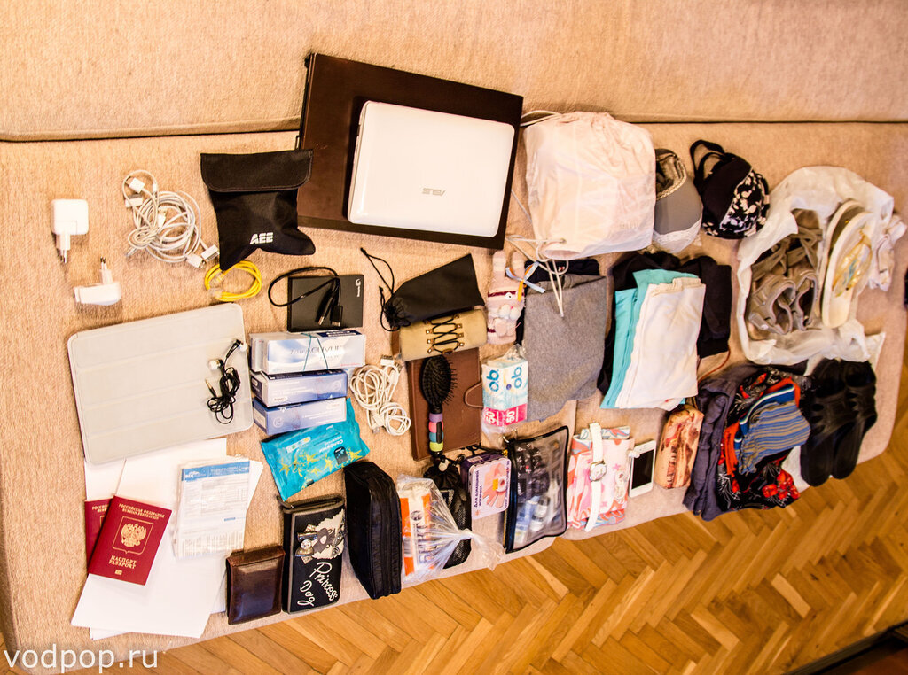
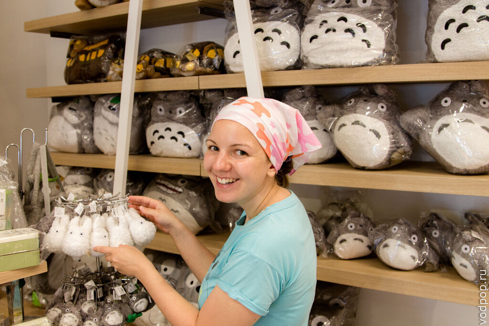

Итак, прошел почти месяц с момента нашего приезда в Таиланд и через несколько дней мы будем двигаться дальше по Азии. Причин тому несколько: во-первых, у нас заканчивается 30-дневный штамп, а это значит, что нам пришлось делать виза-ран (бордер-ран), чтобы получить новые штампы или визу, а во-вторых, нам уже немного поднадоело сидеть на одном месте - хочется двигаться дальше, смотреть и изучать что-то новое.

<!--more-->

Момент переезда сопровождается сбором вещей, поэтому я напишу о том, что мы взяли с собой, что купили на месте и что стоило оставить дома.

Прежде всего хочу сказать, что я ярая противница вещей как таковых: многие близкие знают за мной привычку выкидывать все лишнее без сожалений. Климентий более спокоен в этом отношении, его ограничивает масса рюкзака (ведь он всегда отбирает у меня самые тяжелые вещи), поэтому на двоих у нас получается совсем немного. Во всяком случае, [в поездку в Норвегию](https://vodpop.ru/v-norvegiju-na-mashine-podgotovka/ "В Норвегию на машине. Часть 1. Подготовка к поездке") мы брали намного больше. На фото все  вещи в дорогу на нашу бессрочную поездку в Азию, которые умещаются в 2 рюкзака по 50 литров каждый.

## Обязательные вещи:

- Загранпаспорт;
- Деньги (наличные, банковские карты). Об этом позже чуть поподробнее;
- Авиабилеты или распечатка;
- Водительское удостоверение. Мы брали российские, т.к. международных у нас нет.

## Техника:

- Ноутбук. У нас у каждого свой для работы.
- Планшет. Это основной пункт для нас, поскольку мы его используем для работы и обработки фотографий.
- 2 телефона. Обычно мы покупаем местную симку, чтобы можно было серфить в интернете, ориентироваться по карте и быть на связи с [заказчиками](http://uxman.ru). Поэтому мы взяли с собой еще по телефону (для российских симок), а Климентий прихватил с собой еще один "на всякий случай". Так что всего у нас 5 телефонов и это перебор!
- Наушники. Обычные затычки, чтобы общаться по скайпу и слушать музыку.
- Фотоаппарат. Про свой комплект Климентий позже напишет статью, а пока просто перечислю: тушка Canon EOS 1100d, зум Canon 24-105L f4, портретник Minolta MD 50mm f1.4, переходник под M42, зарядка.  Кстати, все фото в этом блоге, начиная с [Норвегии](https://vodpop.ru/v-norvegiju-na-mashine-podgotovka/), сделаны  на это оборудование.
- Экшн-камера. Пока не использовали, но хотим снимать под водой и на мотоцикле.
- Электронная книжка. Пользуюсь только я, т.к. Клим читает с планшета.
- Часы наручные. В принципе есть телефон, но часы всегда с собой и места много не занимают.
- Сетевой фильтр. Пока особо не пригодился, но мы жили в обустроенных гостиницах и кондо.

## Одежда:

- Футболки - лучше две, светлые из очень легкой ткани. В Азии в среднем под 30 градусов тепла, поэтому не замерзнете. Если таких нет, то можно купить на месте за 300-500 бат. Если кожа светлая и любите сгорать, то лучше тонкую рубашку. Кстати, в майках без рукавов не пускают в большинство храмов Таиланда.
- Шорты - лучше с карманами, чтобы можно убрать кошелек, телефон и ключи. Для Таиланда лучшего всего бриджи, которые прикрывают колени, т.к. в храмы не пускают с открытыми коленками. Для девушек подойдет длинная юбка (можно купить на месте за 150 рублей)
- Удобная обувь. У нас собой спортивные сандалии за 800 рублей из Спортмастера, сланцы и кроссовки. Последние нужны для занятий спортом и длительных прогулок в горы. Если в вашей поездке не намечается походов, то смело оставляйте кроссовки дома.
- Головной убор. Можно купить на месте за копейки, можно взять с собой.
- Купальники и плавки.
- Штаны+толстовка+носки. Пригодится для длительных перелетов, поездок на кондиционированных автобусах и походах в горы (пока не знаем, куда занесет)
- Нижнее белье - на свое усмотрение, конечно, но больше двух комплектов вам вряд ли понадобится. Сохнет все просто мгновенно, т.к. очень жарко. Нравится статья? Узнавайте первым о выходе новых интересных историй! Подпишитесь на нас по [эл. почте](http://feedburner.google.com/fb/a/mailverify?uri=vodpop&loc=ru_RU) или в [группе ВКонтакте](http://vk.com/vodpop)

## Общее:

- Медикаменты. У нас их получилось многовато, но лучше не рисковать и взять с собой необходимые лекарства. В нашем списке цитрамон, парацетамол, анальгин, мирамистин, смекта, колдакт, бинты  и пластыри. Как показала [практика с поездкой в Норвегию](https://vodpop.ru/nordcap-i-lofotenskie-ostrova/ "В Норвегию на машине. Часть 3. Нордкап и Лофотенские острова"), ничто не бывает лишним. Можно купить все на месте,только погуглить заранее международные названия. Кстати, безболезненно пережить акклиматизацию помогает обыкновенная валерьянка.  Мы выпили два привезенных с собой пузырька (кстати, помогло), потом хотели докупить еще, но не нашли.
- Косметика. Все можно купить на месте по невысоким ценам. Советую взять детскую присыпку - очень помогает в жару.
- Средства личной гигиены. Пожалуй, то же, что и косметика - все можно купить в ближайшем супермаркете. Исключение составляют линзы - их нужно покупать в оптике. Мы пока не приценивались, т.к. взяли достаточный запас из дома.
- Расческа.
- Зайка. Игрушка ручной работы, сделанная моей племяшкой Лерой. Смотрю каждый раз и вспоминаю о ней. А еще мы делаем отдельный [фотопроект](http://fotki.yandex.ru/users/klimentij511/album/370550/) под рабочим названием "Зайка", где фотографируем его в разных странах.
- Маленький рюкзачок (15-25 литров). С ним удобно ходить на прогулки и в магазин. Обязательно должны влезать бутылка воды, фотоаппарат и дождевики.

## Что купили на месте:

- Дождевики. Можно купить тонкий за 19 бат в любом супермаркете, а можно из плотной ткани за 60. Мы выбрали второй вариант, так как приехали в сезон дождей и первую неделю им активно пользовались.
- Комплект пластиковой посуды. 50 бат за комплект на двоих + 20 бат за столовые приборы (пришлось докупить из алюминия, т.к. Климентий быстро сломал все пластиковые вилки).
- Нож.
- Вспышка для фотоаппарата и аккумуляторы.
- Скраб для тела. Не удержалась я, слишком вкусный запах.
- Комплект постельного белья (в нашем кондо можно было арендовать за 500 бат, а мы купили за 300)
- Полотенца.
- Флисовый пледик. Пришлось купить за 230 бат, т.к. в комплект постельного белья в Таиланде не входит пододеяльник, а ночью бывает немного прохладно.
- Маленький чайник на 2 кружки.

Так как мы планируем летать лоукостовыми авиакомпаниями, то от некоторых предметов придется избавиться перед вылетом. Например, от ножа и некоторой косметики (больше 100 мл). Наши рюкзаки весят меньше 10 килограмм (каждый), поэтому мы можем брать их в ручную кладь. Хотя соблазн купить лишнего крайне велик, особенно в Бангкоке, где куча [торговых центров](https://vodpop.ru/shopping-v-bangkoke/ "Шоппинг в Бангкоке — 10 лучших мест для шоппинга") и множество качественных вещей по нормальным ценам.

В торговом центре Siam Paragon я нашла магазин детских игрушек и увидела там огромное количество Тоторо - одного из самых моих любимых мульт-персонажей. Когда мы полетим домой, я обязательно зайду сюда и куплю все, что вы видите на фото.

Удачи в сборах, ждем комментарии!
